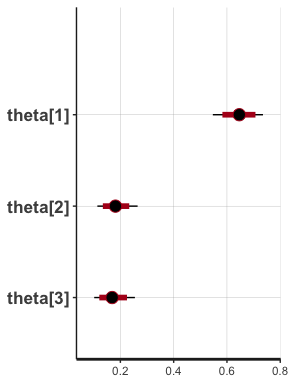
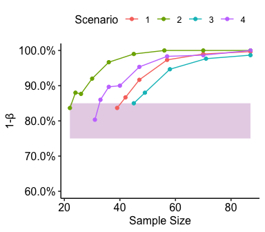
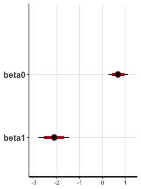
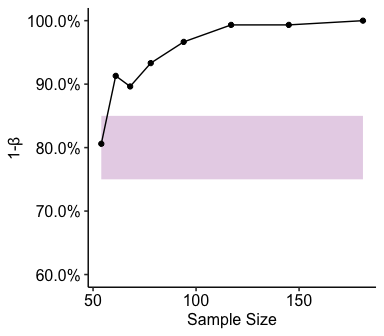

<font size="8"> Power Analysis </font><br>
<font size="6"> Replication Study JDMLab </font><br>
<font size="3"> Simone D’Ambrogio </font><br>
<font size="3"> 2022-02-15 </font><br>

<br><br> <font size="6"> **Introduction** </font> <br> One of the most
difficult and important decisions in power analysis involves specifying
an effect size. Here we use previous finding to quantify the sample size
needed to have a 80% statistical power, assuming as effect equal to the
one these papers report.

<br><br> <font size="4"> **Thaler, R. (1985). Mental accounting and
consumer choice. Marketing science, 4(3), 199-214.** </font>

<br> <font size="3"> **Scenario 1** </font>

<br> First, generate data assuming a multinomial distribution. The
outcomes will be determined by a vector θ (called true_theta below in
the R code) that indicates the probability of each outcome:

<br>

``` r
 #Load libraries:
library(brms); library(dplyr); library(purrr)
library(ggplot2); theme_set(ggpubr::theme_pubr())
library(ggpubr)
library(gridExtra)
library(extraDistr) # This library contains multinomial distribution

library(stringr)
words_replace <- function (variable, words_to_replace, replace_with = "") {
  
  
  library(dplyr)
  if (!require(dplyr)) {
    install.packages("dplyr")
    library(dplyr)
  }
  
  # variable <- enquo(variable)
  # var <- select(data, !!variable) %>% .[,]
  
  if(!is.character(variable)) variable <- as.character(variable)
  
  for (word_i in 1:length(words_to_replace)) {
    word_to_rm_index <- which(str_detect(variable, fixed(words_to_replace[word_i])))
    
    if(any(word_to_rm_index)) {
      words_to_replace_i <- words_to_replace[word_i]
      new_words <- sapply(seq_along(word_to_rm_index), function(i){
        variable[word_to_rm_index][i] <- gsub(words_to_replace_i, replace_with, variable[word_to_rm_index][i], fixed = TRUE)
      })
      variable[word_to_rm_index] <- new_words
    } else {
      warning( paste0("Sting '",  words_to_replace ,"' not found") )
    }
  }
  
  return(variable)
}
```

``` r
study = 'Thaler1985_scenario1'
N_sbj <- 87
answers <- c('A'=56, 'B'=16, 'nd'=15)

(true_theta <- data.frame(A  = answers['A']/N_sbj, 
                          B  = answers['B']/N_sbj, 
                          nd = answers['nd']/N_sbj, 
                          row.names = 'Proportion of Responses'))
```

                                    A        B        nd
    Proportion of Responses 0.6436782 0.183908 0.1724138

<br><br> Given this vector of probabilities θ, generate values assuming
a multinomial distribution of responses in 100 trials:

``` r
(sim_ans <- rmultinom(1, N_sbj, true_theta))
```

       [,1]
    A    58
    B    15
    nd   14

<br><br> Now, let’s fit this simulated data using Stan. <br> Stan Code:

``` r
data {
  int<lower = 1> N_opt;
  int<lower = 1> N_sbj;
  int<lower = 0,upper = N_sbj> ans[N_opt];
}
parameters {
  simplex[N_opt] theta;
}
model {
  target += dirichlet_lpdf(theta | rep_vector(2, N_opt));
  target += multinomial_lpmf(ans | theta);
}
```

<br> Stan Data:

``` r
stan_data <-  list(N_sbj = N_sbj,
                   N_opt = nrow(sim_ans),
                   ans = c(sim_ans)) 
```

<br> Fit Stan Model:

``` r
library( rstan ); options( mc.cores = 4 ); 
rstan_options(auto_write = TRUE)

# Upload Stancode:
stan_model <- stan_model(file = "Stan/mulinomial.stan")
# Fit model
res<-sampling(stan_model, iter = 2000, cores=4, 
              data=stan_data, save_warmup = FALSE)

plot(res)
```



Repeat this procedure and count the number of time the 95% Credible
Interval (CI) of response ‘A’ intersects the 95% CI of response ‘B’.

<br><br> Functions:

``` r
isStatSign <- function(true_theta, N_sbj){
  # Generate Artificial Data
  sim_ans <- rmultinom(1, N_sbj, true_theta)
  # Fit Model
  stan_data <-  list(N_sbj = N_sbj, 
                     N_opt = nrow(sim_ans),
                     ans = c(sim_ans)) 
  res<-sampling(stan_model, iter = 2000, cores=1, verbose=FALSE, refresh=0,
                data=stan_data, save_warmup = FALSE)
  
  # Get Parameters Summary
  res_summary <- summary(res)$summary %>% as.data.frame()
  # Check that chains converged
  if( all(res_summary$Rhat <= 1.01) ){
    CI_A <- c( res_summary$`2.5%`[1], res_summary$`97.5%`[1])
    CI_B <- c( res_summary$`2.5%`[2], res_summary$`97.5%`[2])
    
    # Check whether the 95% Credible Interval (CI) of response 'A' 
    # intersects the 95% CI of response 'B'
    if( (CI_B[1]>=CI_A[1] & CI_B[1]<=CI_A[2]) | 
        (CI_B[2]>=CI_A[1] & CI_B[2]<=CI_A[2]) ){
      is_significant <- 0
    } else {
      is_significant <- 1
    }
    return(is_significant)
  } else {
    return(NA)
  }
  
}

get_power <- function(N_sbj, N_sim=100){
  
  pow_list <- list()
  iter <- 0
  flag=1
  while(flag){
    iter <- iter+1
    
    cat( '\n\n|---------------------------|')
    cat( '\nCurrent Sample Size: ', N_sbj )
    cat( '\n|---------------------------|\n')
    
    # Estimate power given the current sample size
    is_significant <- vector(length = N_sim)
    for(i in 1:N_sim){
      cat( 'Power Computation... ', round( sum( (i>=1:N_sim) / N_sim *100 ), 1),'%', '\r' )
      is_significant[i] <- isStatSign(true_theta, N_sbj)
    } 
    
    pow <- mean(is_significant, na.rm=TRUE)
    print(pow)
    # Save results
    pow_list[[iter]] <- data.frame(N_sbj, power=pow)
    
    # If power is not close enough to the target, change sample size and repeat.
    if(pow < 0.75 | pow > 0.85){
      target_delta <- 0.8-pow
      N_sbj <- round( N_sbj+N_sbj*target_delta )
      
    } else {
      flag = 0 #Stop loop
    }
  }
  return( do.call(rbind.data.frame, pow_list) %>% mutate(study) )
}
```

``` r
Power <- get_power(87, N_sim = 300)
# Save Results
dir.create( paste0('Results/', study) )
write.csv(Power, file = paste0('Results/', study, '/power.csv'), row.names = F)
```

``` r
pow_df <- read.csv(file = paste0('Results/', study, '/power.csv'))
pow_pl <- ggplot(pow_df, aes(N_sbj, power)) +
  geom_ribbon(aes(x=N_sbj, ymin=0.75, ymax=0.85), fill="#E7D4E8", alpha=1) +
  # geom_hline(yintercept = c(0.75, 0.85), linetype=2, color='red', alpha=0.2) +
  # geom_hline(yintercept = c(.8), linetype=2, alpha=0.2) +
  geom_point(size=1.5) +
  geom_line() +
  
  scale_y_continuous(limits = c(0.6,1), 
                     labels=scales::percent) +
  labs(x='Sample Size', y='1-β') +
  theme_pubr()
ggsave(pow_pl, filename = paste0('Results/', study, '/power.svg'), width = 4.5, height = 3)
#pow_pl
```

<br><br> <font size="3"> **Scenario 2** </font>

<br> Estimate and Plot Power

``` r
# ------------ Input Paper Results ------------ #
study = 'Thaler1985_scenario2'
N_sbj <- 87
answers <- c('A'=66, 'B'=14, 'nd'=7)

(true_theta <- data.frame(A  = answers['A']/N_sbj, 
                          B  = answers['B']/N_sbj, 
                          nd = answers['nd']/N_sbj, 
                          row.names = 'Proportion of Responses'))


# ----------------- Estimate ----------------- #
Power <- get_power(N_sbj, N_sim = 300)
# Save Results
dir.create( paste0('Results/', study) )
write.csv(Power, file = paste0('Results/', study, '/power.csv'), row.names = F)
```

``` r
# ----------------- Plot ----------------- #
pow_df <- read.csv(file = paste0('Results/', study, '/power.csv'))
pow_pl <- ggplot(pow_df, aes(N_sbj, power)) +
  geom_ribbon(aes(x=N_sbj, ymin=0.75, ymax=0.85), fill="#E7D4E8", alpha=1) +
  # geom_hline(yintercept = c(0.75, 0.85), linetype=2, color='red', alpha=0.2) +
  # geom_hline(yintercept = c(.8), linetype=2, alpha=0.2) +
  geom_point(size=1.5) +
  geom_line() +
  
  scale_y_continuous(limits = c(0.6,1), 
                     labels=scales::percent) +
  labs(x='Sample Size', y='1-β') +
  theme_pubr()
# Save Results
ggsave(pow_pl, filename = paste0('Results/', study, '/power.svg'), width = 4.5, height = 3)
#pow_pl
```

<br><br> <font size="3"> **Scenario 3** </font>

<br> Estimate and Plot Power

``` r
# ------------ Input Paper Results ------------ #
study = 'Thaler1985_scenario3'
N_sbj <- 87
answers <- c('A'=22, 'B'=61, 'nd'=4)

(true_theta <- data.frame(A  = answers['A']/N_sbj, 
                          B  = answers['B']/N_sbj, 
                          nd = answers['nd']/N_sbj, 
                          row.names = 'Proportion of Responses'))


# ----------------- Estimate ----------------- #
Power <- get_power(N_sbj, N_sim = 300)
# Save Results
dir.create( paste0('Results/', study) )
write.csv(Power, file = paste0('Results/', study, '/power.csv'), row.names = F)
```

``` r
# ----------------- Plot ----------------- #
pow_df <- read.csv(file = paste0('Results/', study, '/power.csv'))
pow_pl <- ggplot(pow_df, aes(N_sbj, power)) +
  geom_ribbon(aes(x=N_sbj, ymin=0.75, ymax=0.85), fill="#E7D4E8", alpha=1) +
  # geom_hline(yintercept = c(0.75, 0.85), linetype=2, color='red', alpha=0.2) +
  # geom_hline(yintercept = c(.8), linetype=2, alpha=0.2) +
  geom_point(size=1.5) +
  geom_line() +
  
  scale_y_continuous(limits = c(0.6,1), 
                     labels=scales::percent) +
  labs(x='Sample Size', y='1-β') +
  theme_pubr()
# Save Results
ggsave(pow_pl, filename = paste0('Results/', study, '/power.svg'), width = 4.5, height = 3)
#pow_pl
```

<br><br> <font size="3"> **Scenario 4** </font>

<br> Estimate and Plot Power

``` r
# ------------ Input Paper Results ------------ #
study = 'Thaler1985_scenario4'
N_sbj <- 87
answers <- c('A'=19, 'B'=63, 'nd'=5)

(true_theta <- data.frame(A  = answers['A']/N_sbj, 
                          B  = answers['B']/N_sbj, 
                          nd = answers['nd']/N_sbj, 
                          row.names = 'Proportion of Responses'))


# ----------------- Estimate ----------------- #
Power <- get_power(N_sbj, N_sim = 300)
# Save Results
dir.create( paste0('Results/', study) )
write.csv(Power, file = paste0('Results/', study, '/power.csv'), row.names = F)
```

``` r
# ----------------- Plot ----------------- #
pow_df <- read.csv(file = paste0('Results/', study, '/power.csv'))
pow_pl <- ggplot(pow_df, aes(N_sbj, power)) +
  geom_ribbon(aes(x=N_sbj, ymin=0.75, ymax=0.85), fill="#E7D4E8", alpha=1) +
  # geom_hline(yintercept = c(0.75, 0.85), linetype=2, color='red', alpha=0.2) +
  # geom_hline(yintercept = c(.8), linetype=2, alpha=0.2) +
  geom_point(size=1.5) +
  geom_line() +
  
  scale_y_continuous(limits = c(0.6,1), 
                     labels=scales::percent) +
  labs(x='Sample Size', y='1-β') +
  theme_pubr()
# Save Results
ggsave(pow_pl, filename = paste0('Results/', study, '/power.svg'), width = 4.5, height = 3)
#pow_pl
```

<br><br> <font size="3"> **All 4 Scenarios** </font>

``` r
Thaler1985 <- purrr::map_dfr(1:4, function(i){
  read.csv(paste0('Results/Thaler1985_scenario', i,'/power.csv'))
})

Thaler1985 %>% 
  mutate(Scenario=words_replace(study, 'Thaler1985_scenario')) %>% 
  ggplot(aes(N_sbj, power)) +
  geom_ribbon(aes(x=N_sbj, ymin=0.75, ymax=0.85), fill="#E7D4E8", alpha=1) +
  # geom_hline(yintercept = c(0.75, 0.85), linetype=2, color='red', alpha=0.2) +
  # geom_hline(yintercept = c(.8), linetype=2, alpha=0.2) +
  geom_point(aes(color=Scenario),size=1.5) +
  geom_line(aes(color=Scenario)) +
  
  scale_y_continuous(limits = c(0.6,1), 
                     labels=scales::percent) +
  labs(x='Sample Size', y='1-β') +
  theme_pubr()
```



<br><br> <font size="4"> **Kahneman & Tversky, (1981). Kahneman, D., &
Tversky, A. (1982). The psychology of preferences. Scientific American,
246(1), 160-173.** </font>

<br><br>

``` r
# ------------ Input Paper Results ------------ #
study = 'Kahneman1981'
N_sbj = 181
P_sbj_v1 = 93/N_sbj #Proportion Subject in the First Version 
P_sbj_v2 = 88/N_sbj #Proportion Subject in the Second Version 

(true_theta <- c(V1  = 0.68,  #First Version 
                 V2  = 0.29)) #Second Version
```

      V1   V2 
    0.68 0.29 

<br><br> Given this vector of probabilities θ, generate values assuming
a binomial distribution of responses in N_sbj trials:

``` r
sim_ans <- rbind( data.frame(condition = 0, ans = rbinom( round(N_sbj*P_sbj_v1), 1, true_theta['V1'])),
                  data.frame(condition = 1, ans = rbinom( round(N_sbj*P_sbj_v2), 1, true_theta['V2'])))
```

<br><br> Now, let’s fit this simulated data using Stan. <br> Stan Code:

``` r
data {
  int<lower = 1> N_sbj;
  vector[N_sbj] x;
  int<lower=0,upper=1> ans[N_sbj];
}
parameters {
  real beta0;
  real beta1;
}
model {
  target += student_t_lpdf(beta0 | 3, 0, 2.5);
  target += student_t_lpdf(beta1 | 3, 0, 2.5);
  target += bernoulli_logit_lpmf(ans | beta0 + beta1 * x);
}
```

<br> Stan Data:

``` r
stan_data <-  list(N_sbj = nrow(sim_ans),
                   x = sim_ans$condition,
                   ans = sim_ans$ans) 
```

<br> Fit Stan Model:

``` r
library( rstan ); options( mc.cores = 4 ); 
rstan_options(auto_write = TRUE)

# Upload Stancode:
stan_model <- stan_model(file = "Stan/logistic.stan")
# Fit model
res<-sampling(stan_model, iter = 2000, cores=4, 
              data=stan_data, save_warmup = FALSE)

plot(res)
```



Repeat this procedure and count the number of time the 95% Credible
Interval (CI) of beta1 intersects 0.

<br><br> Functions:

``` r
isStatSign <- function(true_theta, N_sbj){
  # Generate Artificial Data
  sim_ans <- rbind( data.frame(condition = 0, 
                               ans = rbinom( round(N_sbj*P_sbj_v1), 1, true_theta['V1'])),
                    data.frame(condition = 1, 
                               ans = rbinom( round(N_sbj*P_sbj_v2), 1, true_theta['V2'])))
  # Fit Model
  stan_data <-  list(N_sbj = nrow(sim_ans),
                     x = sim_ans$condition,
                     ans = sim_ans$ans)  
  res<-sampling(stan_model, iter = 2000, cores=1, refresh=0,
                data=stan_data, save_warmup = FALSE)
  
  # Get Parameters Summary
  res_summary <- summary(res)$summary %>% as.data.frame()
  # Check that chains converged
  if( all(res_summary$Rhat <= 1.01) ){
    CI_B1 <- c( res_summary$`2.5%`[2], res_summary$`97.5%`[2])
    
    # Check whether the 95% Credible Interval (CI) of response 'A' 
    # intersects the 95% CI of response 'B'
    if( (0>=CI_B1[1] & 0<=CI_B1[2]) ){
      is_significant <- 0
    } else {
      is_significant <- 1
    }
    return(is_significant)
  } else {
    return(NA)
  }
  
}
```

``` r
# ----------------- Estimate ----------------- #
Power <- get_power(N_sbj, N_sim = 300)
# Save Results
dir.create( paste0('Results/', study) )
write.csv(Power, file = paste0('Results/', study, '/power.csv'), row.names = F)
```

``` r
pow_df <- read.csv(file = paste0('Results/', study, '/power.csv'))
pow_pl <- ggplot(pow_df, aes(N_sbj, power)) +
  geom_ribbon(aes(x=N_sbj, ymin=0.75, ymax=0.85), fill="#E7D4E8", alpha=1) +
  # geom_hline(yintercept = c(0.75, 0.85), linetype=2, color='red', alpha=0.2) +
  # geom_hline(yintercept = c(.8), linetype=2, alpha=0.2) +
  geom_point(size=1.5) +
  geom_line() +
  
  scale_y_continuous(limits = c(0.6,1), 
                     labels=scales::percent) +
  labs(x='Sample Size', y='1-β') +
  theme_pubr()
ggsave(pow_pl, filename = paste0('Results/', study, '/power.svg'), width = 4.5, height = 3)
pow_pl
```


