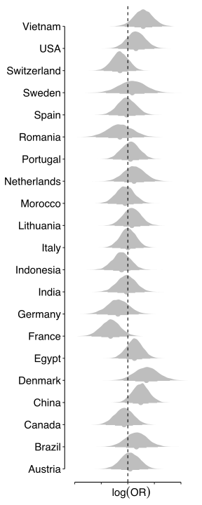

::: {.cell layout-align="center" hash='index_cache/html/unnamed-chunk-1_8566d5709fce10ff02894c0c94672bdb'}

:::

::: {.cell layout-align="center" hash='index_cache/html/Code-to-load-data-and-libraries_ac2dcc77804d4e19a61ad58c57f9e0c7'}

```{.r .cell-code  code-fold="true" code-summary="Code to load data and libraries"}
# Load libraries
library(dplyr); library(purrr); library(stringr)
library(ggplot2); library(ggpubr); library(jcolors)
library(cowplot); library(ggprism); library(tidybayes)
library(reshape2); library(parallel); library(rstan)
library(brms);
library(plotly);

library(knitr);
# library(kableExtra);
library(tidyverse)


color_21countries <- c(
  "#440154FF", "#481467FF", "#482576FF", "#463480FF", 
  "#414487FF", "#3B528BFF", "#35608DFF", "#2F6C8EFF",
  "#2A788EFF", "#25848EFF", "#21908CFF", "#1E9C89FF",
  "#22A884FF", "#2FB47CFF", "#43BF71FF", "#5DC863FF",
  "#7AD151FF", "#9AD93CFF", "#BBDF27FF", "#DEE318FF",
  "#FDE725FF"
)

# Load Preregistered data 
MrAB <- read.csv("../Data/Preregistered/MrAB.csv")
Game <- read.csv("../Data/Preregistered/Game.csv")
Drink <- read.csv("../Data/Preregistered/Drink.csv")
Jacket <- read.csv("../Data/Preregistered/Jacket.csv")
Play <- read.csv("../Data/Preregistered/Play.csv")
Gym <- read.csv("../Data/Preregistered/Gym.csv")
Plane <- read.csv("../Data/Preregistered/Plane.csv")

# Load data
data_MrAB <- read.csv(file = "../Data/data_MrAB.csv")
data_Game <- read.csv(file = "../Data/data_Game.csv")
data_Drink <- read.csv(file = "../Data/data_Drink.csv")
data_Jacket <- read.csv(file = "../Data/data_Jacket.csv")
data_Play <- read.csv(file = "../Data/data_Play.csv")
data_Gym <- read.csv(file = "../Data/data_Gym.csv")
data_Plane <- read.csv(file = "../Data/data_Plane.csv")

original_theta <- readRDS('../Data/original_theta.rds')
data_paper <- map_dfr(1:length(original_theta), function(i) original_theta[[i]])

countries2remove <- data_MrAB %>% 
  filter(attention_check_grater_than_3) %>% 
  group_by(subject) %>% 
  filter(row_number()==1) %>% 
  group_by(Country) %>% 
  summarise(sample_size=n()) %>% 
  filter(sample_size<250) %>% 
  .[,"Country", drop=TRUE]

countries2remove_attention_check_grater_than_2 <- data_MrAB %>% 
  filter(attention_check_grater_than_2) %>% 
  group_by(subject) %>% 
  filter(row_number()==1) %>% 
  group_by(Country) %>% 
  summarise(sample_size=n()) %>% 
  filter(sample_size<250) %>% 
  .[,"Country", drop=TRUE]
```
:::


## Exclusion Criterion

In this report we define five exclusion criterion. First, exclude participants with a completion time lower than a third of the median value of the Length of Interview [$LOI_{subject} < {Mdn(LOI) \over 3}$]. Second, exclude participants whose Country group is different than their Residence OR Native Language [$(Residence | Native~Language) != Country$]. Third, exclude participants who will report a value below 4 (i.e. 1-3) on the “attentional check” question (i.e. “How serious have you been about filling in the survey?”) [$attentional~ check < 4$]. Fourth, exclude participants who will report a value below 3 (i.e. 1-2) on the “attentional check” question [$attentional~ check < 3$]. Fifth, exclude countries with a sample size lower than 250 participants [$Sample < 250$]. 
In this report we will run the entire analysis protocol for five exclusion criterion. 

<br>

|                                           | Full | Exploratory | Preregistered | Partial | None |
|:------------------------------------------|:----:|:-----------:|:-------------:|:-------:|:----:|
|$LOI_{subject} < {Mdn(LOI) \over 3}$       | ✔    |  ✔          |  ✖            |  ✖      |  ✖   |
|$(Residence | Language) != Country$        | ✔    |  ✖          |  ✖            |  ✖      |  ✖   |
|$attentional ~ check < 4$                  | ✔    |  ✔          |  ✔            |  ✖      |  ✖   |
|$attentional ~ check < 3$                  | ✖    |  ✖          |  ✖            |  ✔      |  ✖   |
|$Sample < 250$                             | ✔    |  ✔          |  ✔            |  ✔      |  ✖   |

<br><br>


## Demographics

Demographics of the *Preregistered* sample. 


::: {.cell layout-align="center" hash='index_cache/html/demographics_f907daaeb4fa3d5d06291d23154e5364'}

```{.r .cell-code  code-summary="Create table"}
# Participants from 21 countries
df <- data_Plane %>% 
  filter(coupon=='free') %>% 
  # EXCLUSION: Preregistered
  filter( !(Country %in% countries2remove) ) %>% 
  filter( attention_check_grater_than_3 )


df_egypt <- df %>% filter(coupon=="free") %>% filter(Country=='Egypt')
convert_farsi_to_arabic <- function(x) {
  if(x=="٠"|x=="۰"){
    return( "0" )
  } else if (x=="۱" | x=="١"){
    return( "1" )
  } else if (x=="۲" | x=="٢"){
    return( "2" )
  } else if (x=="۳"|x=="٣"){
    return( "3" )
  } else if (x=="۴" | x=="٤"){
    return( "4" )
  } else if (x=="۵" | x=="٥"){
    return( "5" )
  } else if (x=="۶"|x=="٦"){
    return( "6" )
  } else if (x=="۷" | x=="٧"){
    return( "7" )
  } else if (x=="۸" | x=="٨"){
    return( "8" )
  } else if (x=="۹" | x=="٩"){
    return( "9" )
  } else if( any(x %in% as.character(0:9) ) ){
    return( x )
  } else {
    warning( paste("Persian number", x, "not found!!!") )
  }
}

convert <- function(x){
  apply(
    str_split(string = x, pattern = "", simplify = T),
    2,
    convert_farsi_to_arabic
  ) %>% paste0(collapse = "")
}

df[df$Country=='Egypt', "Age"] <-  sapply(as.list(df_egypt$Age), convert)


data_table <- rbind(
  df %>% 
    mutate(Age=as.numeric(Age)) %>% 
    filter(Age>0 & Age<99) %>% 
    summarise(
      Country="Pooled",
      Language="",
      n = n(),
      `% female` = round(mean(Gender=='Female')*100,2),
      `Age, median (IQR) (yr)` = str_c(median(Age), " (", quantile(Age,probs = .25), "-", quantile(Age,probs = .75), ")")
    ),
  df %>% 
    group_by(Country) %>% 
    mutate(Age=round(as.numeric(Age)),0) %>% 
    filter(Age>0 & Age<99) %>% 
    summarise(
      Country=names(which.max(table(Country))),
      Language=names(which.max(table(NativeLanguage))),
      n = n(),
      `% female` = round(mean(Gender=='Female')*100,2),
      `Age, median (IQR) (yr)` = str_c(round(median(Age)), " (", round(quantile(Age,probs = .25)), "-", round(quantile(Age,probs = .75)), ")")
    ) 
) %>% 
  mutate(
    Language=ifelse(Country=="Canada", "English, French", Language),
    Language=ifelse(Country=="India", "Hindi, Tamil, English", Language)
    )


# data_table %>%
#   kable(caption="<b>Table 1 | </b> Demographics", align=rep('l', 5),
#         table.attr = "style='width:40%;'", booktabs = T) %>%
#   kable_classic(html_font = "Cambria") %>%
#   # kable_material(c("striped", "hover")) %>%
#   row_spec(0, bold = TRUE) %>% 
#   save_kable("tables/png/Demographics.png", zoom = 3)

# data_table %>%
#   kable(caption="<b>Table 1 | </b> Demographics", align=rep('l', 5),
#         table.attr = "style='width:40%;'", booktabs = T) %>%
#   kable_classic(html_font = "Cambria") %>%
#   # kable_material(c("striped", "hover")) %>%
#   row_spec(0, bold = TRUE) %>% 
#   save_kable("tables/pdf/Demographics.pdf", zoom = 3)

# data_table %>% 
#   kable(caption="<b>Table 1 | </b> Demographics", align=rep('l', 5),
#       table.attr = "style='width:60%;'") %>% 
#   kable_classic(html_font = "Cambria") %>% 
#   kable_material(c("striped", "hover")) %>% 
#   row_spec(0, bold = TRUE)
```
:::


<br><br>

## Effect Size

<br>

In this section we show the effect size of each study for each country. We use log Odd Ratios (OR) to quantify the effect size of binary variables, while we use Standardized Mean Differences (SMD) as a measure of effect size of continuous variables. Each dot correspond to a country. The dots size indicate the inverse of the standard error (e.g. 1/SE). The red horizontal lines indicate the effect size calculated using the results reported in the original papers. For the Drink and Gym study, we could not calculate the effect size of the original papers as information about pooled standard deviation are not reported. To facilitate the interpretation of the results, the variables are coded in such a way that the effect reported in the original papers are positive in all studies.

<br>

::: {.panel-tabset}

### Preregistered


::: {.cell layout-align="center" hash='index_cache/html/create-preregistered-exclusion_d02d9a580efbfdf42cb7ebea2b2429e6'}

```{.r .cell-code  code-summary="Create preregistered exclusion dataset"}
data_MrAB_theta <- data_MrAB %>% filter(response!=2) %>% 
  # EXCLUSION: Full Exclusion
  filter( !(Country %in% countries2remove) ) %>% 
  filter( attention_check_grater_than_3 ) %>% 
  # Calculate mean Finantial Literacy
  group_by(Country) %>% 
  mutate(FinancialLiteracy = mean(FinancialLiteracy)) %>% 
  # Calculate ODD RATIO
  group_by(scenario, scenario_group, response, Country) %>% 
  mutate(n = n()) %>% filter(row_number()==1) %>% 
  group_by(scenario, Country) %>% 
  mutate(Odds = n[response==1]/n[response==0]) %>% 
  group_by(scenario_group, Country) %>% 
  # filter(Country=="Austria", scenario_group=="gain") %>% 
  mutate(se_theta = sqrt(sum(1/n))) %>%
  group_by(scenario, Country) %>% filter(row_number()==1) %>% select(-response) %>% 
  group_by(Country) %>% 
  mutate(ORgain = Odds[scenario=="gain-gain VS gain"]/Odds[scenario=="gain-loss VS gain"],
         ORloss = Odds[scenario=="loss-loss VS loss"]/Odds[scenario=="loss-gain VS loss"],
         theta = ifelse(scenario_group=="gain", log(ORgain), log(ORloss))) %>% 
  group_by(Country, scenario_group) %>% filter(row_number()==1) %>% 
  select(-c(ORgain, ORloss, Odds, n)) %>% ungroup()

data_Game_theta <- data_Game %>%
  # EXCLUSION: Full Exclusion
  filter( !(Country %in% countries2remove) ) %>% 
  filter( attention_check_grater_than_3 ) %>% 
  # Calculate mean Finantial Literacy
  group_by(Country) %>% 
  mutate(FinancialLiteracy = mean(FinancialLiteracy)) %>% 
  # Calculate ODD RATIO
  group_by(buyer, response, Country) %>%
  mutate(n = n()) %>% filter(row_number()==1) %>%
  group_by(buyer, Country) %>%
  mutate(Odds = n[response==1]/n[response==0]) %>%
  group_by(buyer, Country) %>%
  # filter(Country=="Austria", scenario_group=="gain") %>%
  mutate(se_theta = sqrt(sum(1/n))) %>%
  filter(row_number()==1) %>% select(-response) %>%
  group_by(Country) %>% 
  mutate(OR = Odds[buyer=="Stranger"]/Odds[buyer=="Friend"],
         theta = log(OR)) %>% filter(row_number()==1) %>% 
  select(-c(OR, Odds, n)) %>% ungroup() 

data_Drink_theta <- data_Drink %>% 
  # EXCLUSION: Full Exclusion
  filter( !(Country %in% countries2remove) ) %>% 
  filter( attention_check_grater_than_3 ) %>% 
  # Calculate mean Finantial Literacy
  group_by(Country) %>% 
  mutate(FinancialLiteracy = mean(FinancialLiteracy)) %>% 
  # Remove really really extreme outliers
  filter(response<10000 & response>=0) %>% 
  mutate(response=response+1, logResp=log(response)) %>% 
  # Compute effect size as Standardized Mean Difference
  group_by(Country, store) %>% mutate(n=n()) %>% 
  group_by(Country) %>% 
  # Calculate Mean Difference 
  mutate(md=mean(logResp[store=="Resort Hotel"])-mean(logResp[store=="Grocery Store"])) %>% 
  # Calculate effect size
  mutate(theta=md/sd(logResp)) %>% 
  group_by(Country, store) %>% filter(row_number()==1) %>% 
  group_by(Country) %>% 
  # -- Calculate standard error -- #
  mutate(first = sum(n) / (n[store=="Resort Hotel"]*n[store=="Grocery Store"]),
         second = theta[1]^2/(2*sum(n)),
         se_theta = sqrt(first+second)) %>% 
  select(-c(md, response, first, second, logResp, n)) %>% 
  filter(row_number()==1) %>% ungroup()

data_Jacket_theta <- data_Jacket %>%
  # EXCLUSION: Full Exclusion
  filter( !(Country %in% countries2remove) ) %>% 
  filter( attention_check_grater_than_3 ) %>% 
  # Calculate mean Finantial Literacy
  group_by(Country) %>% 
  mutate(FinancialLiteracy = mean(FinancialLiteracy)) %>% 
  # Calculate ODD RATIO
  group_by(price, response, Country) %>% 
  mutate(n = n()) %>% filter(row_number()==1) %>% 
  group_by(price, Country) %>% 
  mutate(Odds = n[response==1]/n[response==0]) %>% 
  group_by(price, Country) %>% 
  # filter(Country=="Austria", scenario_group=="gain") %>% 
  mutate(se_theta = sqrt(sum(1/n))) %>%
  group_by(price, Country) %>% filter(row_number()==1) %>% select(-response) %>% 
  group_by(Country) %>% 
  mutate(OR = Odds[price=="low"]/Odds[price=="high"],
         theta = log(OR)) %>% filter(row_number()==1) %>% 
  select(-c(OR, Odds, n)) %>% ungroup()

data_Play_theta <- data_Play %>%
  # EXCLUSION: Full Exclusion
  filter( !(Country %in% countries2remove) ) %>% 
  filter( attention_check_grater_than_3 ) %>% 
  # Calculate mean Finantial Literacy
  group_by(Country) %>% 
  mutate(FinancialLiteracy = mean(FinancialLiteracy)) %>% 
  # Calculate ODD RATIO
  group_by(loss, response, Country) %>% 
  mutate(n = n()) %>% filter(row_number()==1) %>% 
  group_by(loss, Country) %>% 
  mutate(Odds = n[response==1]/n[response==0]) %>% 
  group_by(loss, Country) %>% 
  # filter(Country=="Austria", scenario_group=="gain") %>% 
  mutate(se_theta = sqrt(sum(1/n))) %>%
  group_by(loss, Country) %>% filter(row_number()==1) %>% select(-response) %>% 
  group_by(Country) %>% 
  mutate(OR = Odds[loss=="cash"]/Odds[loss=="ticket"],
         theta = log(OR)) %>% filter(row_number()==1) %>% 
  select(-c(OR, Odds, n)) %>% ungroup()

data_Gym_theta <- data_Gym %>%
  # EXCLUSION: Full Exclusion
  filter( !(Country %in% countries2remove) ) %>% 
  filter( attention_check_grater_than_3 ) %>% 
  # Calculate mean Finantial Literacy
  group_by(Country) %>% 
  mutate(FinancialLiteracy = mean(FinancialLiteracy)) %>% 
  # Calculate Mean Difference
  group_by(frame, Country) %>% mutate(n = n()) %>%
  group_by(Country) %>% 
  mutate(pooled_sd = sd(response),
         md = mean(response[frame=="Yearly"])-mean(response[frame=="Per-session"]),
         theta = md/pooled_sd) %>% 
  group_by(frame, Country) %>% filter(row_number()==1) %>% 
  group_by(Country) %>%
  # -- Calculate standard error -- #
  mutate(first = sum(n) / (n[frame=="Per-session"]*n[frame=="Yearly"]),
         second = theta[1]^2/(2*sum(n)),
         se_theta = sqrt(first+second)) %>% 
  filter(row_number()==1) %>% ungroup() %>% 
  select(-c(md, first, second, pooled_sd, n, response))

data_Plane_theta <- data_Plane %>%
  # EXCLUSION: Full Exclusion
  filter( !(Country %in% countries2remove) ) %>% 
  filter( attention_check_grater_than_3 ) %>% 
  # Calculate mean Finantial Literacy
  group_by(Country) %>% 
  mutate(FinancialLiteracy = mean(FinancialLiteracy)) %>% 
  # Calculate ODD RATIO
  group_by(coupon, response, Country) %>% 
  mutate(n = n()) %>% filter(row_number()==1) %>% 
  group_by(coupon, Country) %>% 
  mutate(Odds = n[response==1]/n[response==0]) %>% 
  group_by(coupon, Country) %>% 
  # filter(Country=="Austria", scenario_group=="gain") %>% 
  mutate(se_theta = sqrt(sum(1/n))) %>%
  group_by(coupon, Country) %>% filter(row_number()==1) %>% select(-response) %>% 
  group_by(Country) %>% 
  mutate(OR = Odds[coupon=="purchased"]/Odds[coupon=="free"],
         theta = log(OR)) %>% filter(row_number()==1) %>% 
  select(-c(OR, Odds, n)) %>% ungroup()

theta_preregisteredExclusion <- list(
  MrAB = data_MrAB_theta %>% 
    mutate(study="MrAB", x=ifelse(scenario_group=="gain", 1.2, 1.8),
           family="binomial") %>% 
    select(-c(X, scenario)) %>% rename(condition = scenario_group),
  Game = data_Game_theta %>% mutate(study="Game", x=3, family="binomial") %>% 
    select(-c(X, market_value)) %>% rename(condition = buyer),
  Drink = data_Drink_theta %>% mutate(study="Drink", x=1, family="gaussian") %>% 
    select(-c(X)) %>% rename(condition = store),
  Jacket = data_Jacket_theta %>% mutate(study="Jacket", x=4, family="binomial") %>% 
    select(-c(X)) %>% rename(condition = price),
  Play = data_Play_theta %>% mutate(study="Play", x=5, family="binomial") %>% 
    select(-c(X)) %>% rename(condition = loss),
  Gym = data_Gym_theta %>% mutate(study="Gym", x=2, family="gaussian") %>% 
    select(-c(X)) %>% rename(condition = frame),
  Plane = data_Plane_theta %>% mutate(study="Plane", x=6, family="binomial") %>% 
    select(-c(X)) %>% rename(condition = coupon)
)
```
:::

::: {.cell layout-align="center" hash='index_cache/html/plot-preregistered-exclusion_c1eae7ac115bf1a6df608f8e4a70f3a3'}

```{.r .cell-code  code-summary="Plot full exclusion dataset"}
data_theta <- map_dfr(1:length(theta_preregisteredExclusion), function(i) theta_preregisteredExclusion[[i]])
nCountries <- length(unique(theta_preregisteredExclusion[[1]]$Country))

plot_OR <- data_theta %>% filter(family=="binomial") %>% 
  ggplot(aes(x, theta)) +
  geom_jitter( aes(size=1/se_theta, color=Country), width = 0.1, alpha=0.7) +
  geom_point(data = data_paper, color="firebrick", size=35, shape="-") +
  geom_hline(yintercept = 0, linetype=2) +
  theme_pubr() + theme(legend.position = "right") +
  labs(x=NULL, y=expression(log(OR))) +
  scale_color_manual(values = viridis::viridis_pal()(nCountries)) +
  scale_fill_manual(values = viridis::viridis_pal()(nCountries)) +
  scale_y_continuous(guide = "prism_offset", limits = c(-1,5.5), breaks = -1:5) + 
  scale_size(range = c(3, 8)) +
  scale_x_continuous(breaks =c(1.5,3:6), 
                     labels = unique(data_theta$study[data_theta$family=="binomial"]),
                     guide = "prism_offset") + 
  guides(size = "none") + 
  theme(text = element_text(size = 15), legend.position = "none")

plot_d <- data_theta %>% filter(family=="gaussian") %>% 
  filter( !(Country %in% countries2remove) ) %>% 
  ggplot(aes(x, theta, color=Country)) +
  geom_jitter( aes(size=1/se_theta), width = 0.1, alpha=0.7) +
  geom_hline(yintercept = 0, linetype=2) +
  theme_pubr() + theme(legend.position = "right") +
  labs(x=NULL, y=expression(SMD)) +
  scale_color_manual(values = viridis::viridis_pal()(nCountries)) +
  scale_y_continuous(guide = "prism_offset", breaks = -1:1, limits = c(-1, 1.5)) + 
  scale_size(range = c(3, 8)) +
  scale_x_continuous(breaks = 1:2, limits = c(0.5, 2.5),
                     labels = unique(data_theta$study[data_theta$family=="gaussian"]),
                     guide = "prism_offset") + 
  guides(size = "none") + 
  theme(text = element_text(size = 15), legend.position = "none")

cowplot::plot_grid(plot_OR, plot_d, nrow = 1, rel_widths = c(0.7, .3))
```

::: {.cell-output-display}
{fig-align='center'}
:::
:::


### Full


::: {.cell layout-align="center" hash='index_cache/html/create-full_ea4b99a81622b4d8706c057ab87db269'}

```{.r .cell-code  code-summary="Create full dataset"}
data_MrAB_theta <- data_MrAB %>% filter(response!=2) %>% 
  # EXCLUSION: Full Exclusion
  filter(native_language_is_country_language | Country!=Residence) %>% 
  filter( !loi_lower_than_loiX0_33 ) %>% 
  filter( !(Country %in% countries2remove) ) %>% 
  filter( attention_check_grater_than_3 ) %>% 
  # Calculate ODD RATIO
  group_by(scenario, scenario_group, response, Country) %>% 
  mutate(n = n()) %>% filter(row_number()==1) %>% 
  group_by(scenario, Country) %>% 
  mutate(Odds = n[response==1]/n[response==0]) %>% 
  group_by(scenario_group, Country) %>% 
  # filter(Country=="Austria", scenario_group=="gain") %>% 
  mutate(se_theta = sqrt(sum(1/n))) %>%
  group_by(scenario, Country) %>% filter(row_number()==1) %>% select(-response) %>% 
  group_by(Country) %>% 
  mutate(ORgain = Odds[scenario=="gain-gain VS gain"]/Odds[scenario=="gain-loss VS gain"],
         ORloss = Odds[scenario=="loss-loss VS loss"]/Odds[scenario=="loss-gain VS loss"],
         theta = ifelse(scenario_group=="gain", log(ORgain), log(ORloss))) %>% 
  group_by(Country, scenario_group) %>% filter(row_number()==1) %>% 
  select(-c(ORgain, ORloss, Odds, n)) %>% ungroup()

data_Game_theta <- data_Game %>%
  # EXCLUSION: Full Exclusion
  filter(native_language_is_country_language | Country!=Residence) %>% 
  filter( !loi_lower_than_loiX0_33 ) %>% 
  filter( !(Country %in% countries2remove) ) %>% 
  filter( attention_check_grater_than_3 ) %>% 
  # Calculate ODD RATIO
  group_by(buyer, response, Country) %>%
  mutate(n = n()) %>% filter(row_number()==1) %>%
  group_by(buyer, Country) %>%
  mutate(Odds = n[response==1]/n[response==0]) %>%
  group_by(buyer, Country) %>%
  # filter(Country=="Austria", scenario_group=="gain") %>%
  mutate(se_theta = sqrt(sum(1/n))) %>%
  filter(row_number()==1) %>% select(-response) %>%
  group_by(Country) %>% 
  mutate(OR = Odds[buyer=="Stranger"]/Odds[buyer=="Friend"],
         theta = log(OR)) %>% filter(row_number()==1) %>% 
  select(-c(OR, Odds, n)) %>% ungroup() 

data_Drink_theta <- data_Drink %>% 
  # EXCLUSION: Full Exclusion
  filter(native_language_is_country_language | Country!=Residence) %>% 
  filter( !loi_lower_than_loiX0_33 ) %>% 
  filter( !(Country %in% countries2remove) ) %>% 
  filter( attention_check_grater_than_3 ) %>% 
  # Remove really really extreme outliers
  filter(response<10000 & response>=0) %>% 
  mutate(response=response+1, logResp=log(response)) %>% 
  # Compute effect size as Standardized Mean Difference
  group_by(Country, store) %>% mutate(n=n()) %>% 
  group_by(Country) %>% 
  # Calculate Mean Difference 
  mutate(md=mean(logResp[store=="Resort Hotel"])-mean(logResp[store=="Grocery Store"])) %>% 
  # Calculate effect size
  mutate(theta=md/sd(logResp)) %>% 
  group_by(Country, store) %>% filter(row_number()==1) %>% 
  group_by(Country) %>% 
  # -- Calculate standard error -- #
  mutate(first = sum(n) / (n[store=="Resort Hotel"]*n[store=="Grocery Store"]),
         second = theta[1]^2/(2*sum(n)),
         se_theta = sqrt(first+second)) %>% 
  select(-c(md, response, first, second, logResp, n)) %>% 
  filter(row_number()==1) %>% ungroup()

data_Jacket_theta <- data_Jacket %>%
  # EXCLUSION: Full Exclusion
  filter(native_language_is_country_language | Country!=Residence) %>% 
  filter( !loi_lower_than_loiX0_33 ) %>% 
  filter( !(Country %in% countries2remove) ) %>% 
  filter( attention_check_grater_than_3 ) %>% 
  # Calculate ODD RATIO
  group_by(price, response, Country) %>% 
  mutate(n = n()) %>% filter(row_number()==1) %>% 
  group_by(price, Country) %>% 
  mutate(Odds = n[response==1]/n[response==0]) %>% 
  group_by(price, Country) %>% 
  # filter(Country=="Austria", scenario_group=="gain") %>% 
  mutate(se_theta = sqrt(sum(1/n))) %>%
  group_by(price, Country) %>% filter(row_number()==1) %>% select(-response) %>% 
  group_by(Country) %>% 
  mutate(OR = Odds[price=="low"]/Odds[price=="high"],
         theta = log(OR)) %>% filter(row_number()==1) %>% 
  select(-c(OR, Odds, n)) %>% ungroup()

data_Play_theta <- data_Play %>%
  # EXCLUSION: Full Exclusion
  filter(native_language_is_country_language | Country!=Residence) %>% 
  filter( !loi_lower_than_loiX0_33 ) %>% 
  filter( !(Country %in% countries2remove) ) %>% 
  filter( attention_check_grater_than_3 ) %>% 
  # Calculate ODD RATIO
  group_by(loss, response, Country) %>% 
  mutate(n = n()) %>% filter(row_number()==1) %>% 
  group_by(loss, Country) %>% 
  mutate(Odds = n[response==1]/n[response==0]) %>% 
  group_by(loss, Country) %>% 
  # filter(Country=="Austria", scenario_group=="gain") %>% 
  mutate(se_theta = sqrt(sum(1/n))) %>%
  group_by(loss, Country) %>% filter(row_number()==1) %>% select(-response) %>% 
  group_by(Country) %>% 
  mutate(OR = Odds[loss=="cash"]/Odds[loss=="ticket"],
         theta = log(OR)) %>% filter(row_number()==1) %>% 
  select(-c(OR, Odds, n)) %>% ungroup()

data_Gym_theta <- data_Gym %>%
  # EXCLUSION: Full Exclusion
  filter(native_language_is_country_language | Country!=Residence) %>% 
  filter( !loi_lower_than_loiX0_33 ) %>% 
  filter( !(Country %in% countries2remove) ) %>% 
  filter( attention_check_grater_than_3 ) %>% 
  # Calculate Mean Difference
  group_by(frame, Country) %>% mutate(n = n()) %>%
  group_by(Country) %>% 
  mutate(pooled_sd = sd(response),
         md = mean(response[frame=="Yearly"])-mean(response[frame=="Per-session"]),
         theta = md/pooled_sd) %>% 
  group_by(frame, Country) %>% filter(row_number()==1) %>% 
  group_by(Country) %>%
  # -- Calculate standard error -- #
  mutate(first = sum(n) / (n[frame=="Per-session"]*n[frame=="Yearly"]),
         second = theta[1]^2/(2*sum(n)),
         se_theta = sqrt(first+second)) %>% 
  filter(row_number()==1) %>% ungroup() %>% 
  select(-c(md, first, second, pooled_sd, n, response))

data_Plane_theta <- data_Plane %>%
  # EXCLUSION: Full Exclusion
  filter(native_language_is_country_language | Country!=Residence) %>% 
  filter( !loi_lower_than_loiX0_33 ) %>% 
  filter( !(Country %in% countries2remove) ) %>% 
  filter( attention_check_grater_than_3 ) %>% 
  # Calculate ODD RATIO
  group_by(coupon, response, Country) %>% 
  mutate(n = n()) %>% filter(row_number()==1) %>% 
  group_by(coupon, Country) %>% 
  mutate(Odds = n[response==1]/n[response==0]) %>% 
  group_by(coupon, Country) %>% 
  # filter(Country=="Austria", scenario_group=="gain") %>% 
  mutate(se_theta = sqrt(sum(1/n))) %>%
  group_by(coupon, Country) %>% filter(row_number()==1) %>% select(-response) %>% 
  group_by(Country) %>% 
  mutate(OR = Odds[coupon=="purchased"]/Odds[coupon=="free"],
         theta = log(OR)) %>% filter(row_number()==1) %>% 
  select(-c(OR, Odds, n)) %>% ungroup()

theta_fullExclusion <- list(
  MrAB = data_MrAB_theta %>% 
    mutate(study="MrAB", x=ifelse(scenario_group=="gain", 1.2, 1.8),
           family="binomial") %>% 
    select(-c(X, scenario)) %>% rename(condition = scenario_group),
  Game = data_Game_theta %>% mutate(study="Game", x=3, family="binomial") %>% 
    select(-c(X, market_value)) %>% rename(condition = buyer),
  Drink = data_Drink_theta %>% mutate(study="Drink", x=1, family="gaussian") %>% 
    select(-c(X)) %>% rename(condition = store),
  Jacket = data_Jacket_theta %>% mutate(study="Jacket", x=4, family="binomial") %>% 
    select(-c(X)) %>% rename(condition = price),
  Play = data_Play_theta %>% mutate(study="Play", x=5, family="binomial") %>% 
    select(-c(X)) %>% rename(condition = loss),
  Gym = data_Gym_theta %>% mutate(study="Gym", x=2, family="gaussian") %>% 
    select(-c(X)) %>% rename(condition = frame),
  Plane = data_Plane_theta %>% mutate(study="Plane", x=6, family="binomial") %>% 
    select(-c(X)) %>% rename(condition = coupon)
)
```
:::

::: {.cell layout-align="center" hash='index_cache/html/plot-full_b8ea77bd81f01c48e2aa447363cacc70'}

```{.r .cell-code  code-summary="Plot full exclusion dataset"}
data_theta <- map_dfr(1:length(theta_fullExclusion), function(i) theta_fullExclusion[[i]])
nCountries <- length(unique(theta_fullExclusion[[1]]$Country))

plot_OR <- data_theta %>% filter(family=="binomial") %>% 
  ggplot(aes(x, theta)) +
  geom_jitter( aes(size=1/se_theta, color=Country), width = 0.1, alpha=0.7) +
  geom_point(data = data_paper, color="firebrick", size=35, shape="-") +
  geom_hline(yintercept = 0, linetype=2) +
  theme_pubr() + theme(legend.position = "right") +
  labs(x=NULL, y=expression(log(OR))) +
  scale_color_manual(values = viridis::viridis_pal()(nCountries)) +
  scale_fill_manual(values = viridis::viridis_pal()(nCountries)) +
  scale_y_continuous(guide = "prism_offset", limits = c(-1,5.5), breaks = -1:5) + 
  scale_size(range = c(3, 8)) +
  scale_x_continuous(breaks =c(1.5,3:6), 
                     labels = unique(data_theta$study[data_theta$family=="binomial"]),
                     guide = "prism_offset") + 
  guides(size = "none") + 
  theme(text = element_text(size = 15), legend.position = "none")

plot_d <- data_theta %>% filter(family=="gaussian") %>% 
  filter( !(Country %in% countries2remove) ) %>% 
  ggplot(aes(x, theta, color=Country)) +
  geom_jitter( aes(size=1/se_theta), width = 0.1, alpha=0.7) +
  geom_hline(yintercept = 0, linetype=2) +
  theme_pubr() + theme(legend.position = "right") +
  labs(x=NULL, y=expression(SMD)) +
  scale_color_manual(values = viridis::viridis_pal()(nCountries)) +
  scale_y_continuous(guide = "prism_offset", breaks = -1:1, limits = c(-1, 1.5)) + 
  scale_size(range = c(3, 8)) +
  scale_x_continuous(breaks = 1:2, limits = c(0.5, 2.5),
                     labels = unique(data_theta$study[data_theta$family=="gaussian"]),
                     guide = "prism_offset") + 
  guides(size = "none") + 
  theme(text = element_text(size = 15), legend.position = "none")

cowplot::plot_grid(plot_OR, plot_d, nrow = 1, rel_widths = c(0.7, .3))
```

::: {.cell-output-display}
{fig-align='center'}
:::
:::


### Exploratory


::: {.cell layout-align="center" hash='index_cache/html/create-exploratory_9da970b5574a37ecbae4d5eaa89b0c8d'}

```{.r .cell-code  code-summary="Create exploratory dataset"}
data_MrAB_theta <- data_MrAB %>% filter(response!=2) %>% 
  # EXCLUSION: Exploratory Exclusion
  filter( !loi_lower_than_loiX0_33 ) %>% 
  filter( !(Country %in% countries2remove) ) %>% 
  filter( attention_check_grater_than_3 ) %>% 
  # Calculate ODD RATIO
  group_by(scenario, scenario_group, response, Country) %>% 
  mutate(n = n()) %>% filter(row_number()==1) %>% 
  group_by(scenario, Country) %>% 
  mutate(Odds = n[response==1]/n[response==0]) %>% 
  group_by(scenario_group, Country) %>% 
  # filter(Country=="Austria", scenario_group=="gain") %>% 
  mutate(se_theta = sqrt(sum(1/n))) %>%
  group_by(scenario, Country) %>% filter(row_number()==1) %>% select(-response) %>% 
  group_by(Country) %>% 
  mutate(ORgain = Odds[scenario=="gain-gain VS gain"]/Odds[scenario=="gain-loss VS gain"],
         ORloss = Odds[scenario=="loss-loss VS loss"]/Odds[scenario=="loss-gain VS loss"],
         theta = ifelse(scenario_group=="gain", log(ORgain), log(ORloss))) %>% 
  group_by(Country, scenario_group) %>% filter(row_number()==1) %>% 
  select(-c(ORgain, ORloss, Odds, n)) %>% ungroup()

data_Game_theta <- data_Game %>%
  # EXCLUSION: Exploratory Exclusion
  filter( !loi_lower_than_loiX0_33 ) %>% 
  filter( !(Country %in% countries2remove) ) %>% 
  filter( attention_check_grater_than_3 ) %>% 
  # Calculate ODD RATIO
  group_by(buyer, response, Country) %>%
  mutate(n = n()) %>% filter(row_number()==1) %>%
  group_by(buyer, Country) %>%
  mutate(Odds = n[response==1]/n[response==0]) %>%
  group_by(buyer, Country) %>%
  # filter(Country=="Austria", scenario_group=="gain") %>%
  mutate(se_theta = sqrt(sum(1/n))) %>%
  filter(row_number()==1) %>% select(-response) %>%
  group_by(Country) %>% 
  mutate(OR = Odds[buyer=="Stranger"]/Odds[buyer=="Friend"],
         theta = log(OR)) %>% filter(row_number()==1) %>% 
  select(-c(OR, Odds, n)) %>% ungroup() 

data_Drink_theta <- data_Drink %>% 
  # EXCLUSION: Exploratory Exclusion
  filter( !loi_lower_than_loiX0_33 ) %>% 
  filter( !(Country %in% countries2remove) ) %>% 
  filter( attention_check_grater_than_3 ) %>% 
  # Remove really really extreme outliers
  filter(response<10000 & response>=0) %>% 
  mutate(response=response+1, logResp=log(response)) %>% 
  # Compute effect size as Standardized Mean Difference
  group_by(Country, store) %>% mutate(n=n()) %>% 
  group_by(Country) %>% 
  # Calculate Mean Difference 
  mutate(md=mean(logResp[store=="Resort Hotel"])-mean(logResp[store=="Grocery Store"])) %>% 
  # Calculate effect size
  mutate(theta=md/sd(logResp)) %>% 
  group_by(Country, store) %>% filter(row_number()==1) %>% 
  group_by(Country) %>% 
  # -- Calculate standard error -- #
  mutate(first = sum(n) / (n[store=="Resort Hotel"]*n[store=="Grocery Store"]),
         second = theta[1]^2/(2*sum(n)),
         se_theta = sqrt(first+second)) %>% 
  select(-c(md, response, first, second, logResp, n)) %>% 
  filter(row_number()==1) %>% ungroup()

data_Jacket_theta <- data_Jacket %>%
  # EXCLUSION: Exploratory Exclusion
  filter( !loi_lower_than_loiX0_33 ) %>% 
  filter( !(Country %in% countries2remove) ) %>% 
  filter( attention_check_grater_than_3 ) %>% 
  # Calculate ODD RATIO
  group_by(price, response, Country) %>% 
  mutate(n = n()) %>% filter(row_number()==1) %>% 
  group_by(price, Country) %>% 
  mutate(Odds = n[response==1]/n[response==0]) %>% 
  group_by(price, Country) %>% 
  # filter(Country=="Austria", scenario_group=="gain") %>% 
  mutate(se_theta = sqrt(sum(1/n))) %>%
  group_by(price, Country) %>% filter(row_number()==1) %>% select(-response) %>% 
  group_by(Country) %>% 
  mutate(OR = Odds[price=="low"]/Odds[price=="high"],
         theta = log(OR)) %>% filter(row_number()==1) %>% 
  select(-c(OR, Odds, n)) %>% ungroup()

data_Play_theta <- data_Play %>%
  # EXCLUSION: Exploratory Exclusion
  filter( !loi_lower_than_loiX0_33 ) %>% 
  filter( !(Country %in% countries2remove) ) %>% 
  filter( attention_check_grater_than_3 ) %>% 
  # Calculate ODD RATIO
  group_by(loss, response, Country) %>% 
  mutate(n = n()) %>% filter(row_number()==1) %>% 
  group_by(loss, Country) %>% 
  mutate(Odds = n[response==1]/n[response==0]) %>% 
  group_by(loss, Country) %>% 
  # filter(Country=="Austria", scenario_group=="gain") %>% 
  mutate(se_theta = sqrt(sum(1/n))) %>%
  group_by(loss, Country) %>% filter(row_number()==1) %>% select(-response) %>% 
  group_by(Country) %>% 
  mutate(OR = Odds[loss=="cash"]/Odds[loss=="ticket"],
         theta = log(OR)) %>% filter(row_number()==1) %>% 
  select(-c(OR, Odds, n)) %>% ungroup()

data_Gym_theta <- data_Gym %>%
  # EXCLUSION: Exploratory Exclusion
  filter( !loi_lower_than_loiX0_33 ) %>% 
  filter( !(Country %in% countries2remove) ) %>% 
  filter( attention_check_grater_than_3 ) %>% 
  # Calculate Mean Difference
  group_by(frame, Country) %>% mutate(n = n()) %>%
  group_by(Country) %>% 
  mutate(pooled_sd = sd(response),
         md = mean(response[frame=="Yearly"])-mean(response[frame=="Per-session"]),
         theta = md/pooled_sd) %>% 
  group_by(frame, Country) %>% filter(row_number()==1) %>% 
  group_by(Country) %>%
  # -- Calculate standard error -- #
  mutate(first = sum(n) / (n[frame=="Per-session"]*n[frame=="Yearly"]),
         second = theta[1]^2/(2*sum(n)),
         se_theta = sqrt(first+second)) %>% 
  filter(row_number()==1) %>% ungroup() %>% 
  select(-c(md, first, second, pooled_sd, n, response))

data_Plane_theta <- data_Plane %>%
  # EXCLUSION: Exploratory Exclusion
  filter( !loi_lower_than_loiX0_33 ) %>% 
  filter( !(Country %in% countries2remove) ) %>% 
  filter( attention_check_grater_than_3 ) %>% 
  # Calculate ODD RATIO
  group_by(coupon, response, Country) %>% 
  mutate(n = n()) %>% filter(row_number()==1) %>% 
  group_by(coupon, Country) %>% 
  mutate(Odds = n[response==1]/n[response==0]) %>% 
  group_by(coupon, Country) %>% 
  # filter(Country=="Austria", scenario_group=="gain") %>% 
  mutate(se_theta = sqrt(sum(1/n))) %>%
  group_by(coupon, Country) %>% filter(row_number()==1) %>% select(-response) %>% 
  group_by(Country) %>% 
  mutate(OR = Odds[coupon=="purchased"]/Odds[coupon=="free"],
         theta = log(OR)) %>% filter(row_number()==1) %>% 
  select(-c(OR, Odds, n)) %>% ungroup()

theta_exploratoryExclusion <- list(
  MrAB = data_MrAB_theta %>% 
    mutate(study="MrAB", x=ifelse(scenario_group=="gain", 1.2, 1.8),
           family="binomial") %>% 
    select(-c(X, scenario)) %>% rename(condition = scenario_group),
  Game = data_Game_theta %>% mutate(study="Game", x=3, family="binomial") %>% 
    select(-c(X, market_value)) %>% rename(condition = buyer),
  Drink = data_Drink_theta %>% mutate(study="Drink", x=1, family="gaussian") %>% 
    select(-c(X)) %>% rename(condition = store),
  Jacket = data_Jacket_theta %>% mutate(study="Jacket", x=4, family="binomial") %>% 
    select(-c(X)) %>% rename(condition = price),
  Play = data_Play_theta %>% mutate(study="Play", x=5, family="binomial") %>% 
    select(-c(X)) %>% rename(condition = loss),
  Gym = data_Gym_theta %>% mutate(study="Gym", x=2, family="gaussian") %>% 
    select(-c(X)) %>% rename(condition = frame),
  Plane = data_Plane_theta %>% mutate(study="Plane", x=6, family="binomial") %>% 
    select(-c(X)) %>% rename(condition = coupon)
)
```
:::

::: {.cell layout-align="center" hash='index_cache/html/plot-exploratory_67f48e69858f3704b7f486b805fd7465'}

```{.r .cell-code  code-summary="Plot exploratory exclusion dataset"}
data_theta <- map_dfr(1:length(theta_exploratoryExclusion), function(i) theta_fullExclusion[[i]])
nCountries <- length(unique(theta_exploratoryExclusion[[1]]$Country))

plot_OR <- data_theta %>% filter(family=="binomial") %>% 
  ggplot(aes(x, theta)) +
  geom_jitter( aes(size=1/se_theta, color=Country), width = 0.1, alpha=0.7) +
  geom_point(data = data_paper, color="firebrick", size=35, shape="-") +
  geom_hline(yintercept = 0, linetype=2) +
  theme_pubr() + theme(legend.position = "right") +
  labs(x=NULL, y=expression(log(OR))) +
  scale_color_manual(values = viridis::viridis_pal()(nCountries)) +
  scale_fill_manual(values = viridis::viridis_pal()(nCountries)) +
  scale_y_continuous(guide = "prism_offset", limits = c(-1,5.5), breaks = -1:5) + 
  scale_size(range = c(3, 8)) +
  scale_x_continuous(breaks =c(1.5,3:6), 
                     labels = unique(data_theta$study[data_theta$family=="binomial"]),
                     guide = "prism_offset") + 
  guides(size = "none") + 
  theme(text = element_text(size = 15), legend.position = "none")

plot_d <- data_theta %>% filter(family=="gaussian") %>% 
  filter( !(Country %in% countries2remove) ) %>% 
  ggplot(aes(x, theta, color=Country)) +
  geom_jitter( aes(size=1/se_theta), width = 0.1, alpha=0.7) +
  geom_hline(yintercept = 0, linetype=2) +
  theme_pubr() + theme(legend.position = "right") +
  labs(x=NULL, y=expression(SMD)) +
  scale_color_manual(values = viridis::viridis_pal()(nCountries)) +
  scale_y_continuous(guide = "prism_offset", breaks = -1:1, limits = c(-1, 1.5)) + 
  scale_size(range = c(3, 8)) +
  scale_x_continuous(breaks = 1:2, limits = c(0.5, 2.5),
                     labels = unique(data_theta$study[data_theta$family=="gaussian"]),
                     guide = "prism_offset") + 
  guides(size = "none") + 
  theme(text = element_text(size = 15), legend.position = "none")

cowplot::plot_grid(plot_OR, plot_d, nrow = 1, rel_widths = c(0.7, .3))
```

::: {.cell-output-display}
{fig-align='center'}
:::
:::


### Partial


::: {.cell layout-align="center" hash='index_cache/html/create-partial-exclusion_75a20cec5c0b8f4e043c515aac7cec63'}

```{.r .cell-code  code-summary="Create partial exclusion dataset"}
data_MrAB_theta <- data_MrAB %>% filter(response!=2) %>% 
  # EXCLUSION: Full Exclusion
  filter( !(Country %in% countries2remove_attention_check_grater_than_2) ) %>% 
  filter( attention_check_grater_than_2 ) %>% 
  # Calculate ODD RATIO
  group_by(scenario, scenario_group, response, Country) %>% 
  mutate(n = n()) %>% filter(row_number()==1) %>% 
  group_by(scenario, Country) %>% 
  mutate(Odds = n[response==1]/n[response==0]) %>% 
  group_by(scenario_group, Country) %>% 
  # filter(Country=="Austria", scenario_group=="gain") %>% 
  mutate(se_theta = sqrt(sum(1/n))) %>%
  group_by(scenario, Country) %>% filter(row_number()==1) %>% select(-response) %>% 
  group_by(Country) %>% 
  mutate(ORgain = Odds[scenario=="gain-gain VS gain"]/Odds[scenario=="gain-loss VS gain"],
         ORloss = Odds[scenario=="loss-loss VS loss"]/Odds[scenario=="loss-gain VS loss"],
         theta = ifelse(scenario_group=="gain", log(ORgain), log(ORloss))) %>% 
  group_by(Country, scenario_group) %>% filter(row_number()==1) %>% 
  select(-c(ORgain, ORloss, Odds, n)) %>% ungroup()

data_Game_theta <- data_Game %>%
  # EXCLUSION: Full Exclusion
  filter( !(Country %in% countries2remove_attention_check_grater_than_2) ) %>% 
  filter( attention_check_grater_than_2 ) %>% 
  # Calculate ODD RATIO
  group_by(buyer, response, Country) %>%
  mutate(n = n()) %>% filter(row_number()==1) %>%
  group_by(buyer, Country) %>%
  mutate(Odds = n[response==1]/n[response==0]) %>%
  group_by(buyer, Country) %>%
  # filter(Country=="Austria", scenario_group=="gain") %>%
  mutate(se_theta = sqrt(sum(1/n))) %>%
  filter(row_number()==1) %>% select(-response) %>%
  group_by(Country) %>% 
  mutate(OR = Odds[buyer=="Stranger"]/Odds[buyer=="Friend"],
         theta = log(OR)) %>% filter(row_number()==1) %>% 
  select(-c(OR, Odds, n)) %>% ungroup() 

data_Drink_theta <- data_Drink %>% 
  # EXCLUSION: Full Exclusion
  filter( !(Country %in% countries2remove_attention_check_grater_than_2) ) %>% 
  filter( attention_check_grater_than_2 ) %>% 
  # Remove really really extreme outliers
  filter(response<10000 & response>=0) %>% 
  mutate(response=response+1, logResp=log(response)) %>% 
  # Compute effect size as Standardized Mean Difference
  group_by(Country, store) %>% mutate(n=n()) %>% 
  group_by(Country) %>% 
  # Calculate Mean Difference 
  mutate(md=mean(logResp[store=="Resort Hotel"])-mean(logResp[store=="Grocery Store"])) %>% 
  # Calculate effect size
  mutate(theta=md/sd(logResp)) %>% 
  group_by(Country, store) %>% filter(row_number()==1) %>% 
  group_by(Country) %>% 
  # -- Calculate standard error -- #
  mutate(first = sum(n) / (n[store=="Resort Hotel"]*n[store=="Grocery Store"]),
         second = theta[1]^2/(2*sum(n)),
         se_theta = sqrt(first+second)) %>% 
  select(-c(md, response, first, second, logResp, n)) %>% 
  filter(row_number()==1) %>% ungroup()

data_Jacket_theta <- data_Jacket %>%
  # EXCLUSION: Full Exclusion
  filter( !(Country %in% countries2remove_attention_check_grater_than_2) ) %>% 
  filter( attention_check_grater_than_2 ) %>% 
  # Calculate ODD RATIO
  group_by(price, response, Country) %>% 
  mutate(n = n()) %>% filter(row_number()==1) %>% 
  group_by(price, Country) %>% 
  mutate(Odds = n[response==1]/n[response==0]) %>% 
  group_by(price, Country) %>% 
  # filter(Country=="Austria", scenario_group=="gain") %>% 
  mutate(se_theta = sqrt(sum(1/n))) %>%
  group_by(price, Country) %>% filter(row_number()==1) %>% select(-response) %>% 
  group_by(Country) %>% 
  mutate(OR = Odds[price=="low"]/Odds[price=="high"],
         theta = log(OR)) %>% filter(row_number()==1) %>% 
  select(-c(OR, Odds, n)) %>% ungroup()

data_Play_theta <- data_Play %>%
  # EXCLUSION: Full Exclusion
  filter( !(Country %in% countries2remove_attention_check_grater_than_2) ) %>% 
  filter( attention_check_grater_than_2 ) %>% 
  # Calculate ODD RATIO
  group_by(loss, response, Country) %>% 
  mutate(n = n()) %>% filter(row_number()==1) %>% 
  group_by(loss, Country) %>% 
  mutate(Odds = n[response==1]/n[response==0]) %>% 
  group_by(loss, Country) %>% 
  # filter(Country=="Austria", scenario_group=="gain") %>% 
  mutate(se_theta = sqrt(sum(1/n))) %>%
  group_by(loss, Country) %>% filter(row_number()==1) %>% select(-response) %>% 
  group_by(Country) %>% 
  mutate(OR = Odds[loss=="cash"]/Odds[loss=="ticket"],
         theta = log(OR)) %>% filter(row_number()==1) %>% 
  select(-c(OR, Odds, n)) %>% ungroup()

data_Gym_theta <- data_Gym %>%
  # EXCLUSION: Full Exclusion
  filter( !(Country %in% countries2remove_attention_check_grater_than_2) ) %>% 
  filter( attention_check_grater_than_2 ) %>% 
  # Calculate Mean Difference
  group_by(frame, Country) %>% mutate(n = n()) %>%
  group_by(Country) %>% 
  mutate(pooled_sd = sd(response),
         md = mean(response[frame=="Yearly"])-mean(response[frame=="Per-session"]),
         theta = md/pooled_sd) %>% 
  group_by(frame, Country) %>% filter(row_number()==1) %>% 
  group_by(Country) %>%
  # -- Calculate standard error -- #
  mutate(first = sum(n) / (n[frame=="Per-session"]*n[frame=="Yearly"]),
         second = theta[1]^2/(2*sum(n)),
         se_theta = sqrt(first+second)) %>% 
  filter(row_number()==1) %>% ungroup() %>% 
  select(-c(md, first, second, pooled_sd, n, response))

data_Plane_theta <- data_Plane %>%
  # EXCLUSION: Full Exclusion
  filter( !(Country %in% countries2remove_attention_check_grater_than_2) ) %>% 
  filter( attention_check_grater_than_2 ) %>% 
  # Calculate ODD RATIO
  group_by(coupon, response, Country) %>% 
  mutate(n = n()) %>% filter(row_number()==1) %>% 
  group_by(coupon, Country) %>% 
  mutate(Odds = n[response==1]/n[response==0]) %>% 
  group_by(coupon, Country) %>% 
  # filter(Country=="Austria", scenario_group=="gain") %>% 
  mutate(se_theta = sqrt(sum(1/n))) %>%
  group_by(coupon, Country) %>% filter(row_number()==1) %>% select(-response) %>% 
  group_by(Country) %>% 
  mutate(OR = Odds[coupon=="purchased"]/Odds[coupon=="free"],
         theta = log(OR)) %>% filter(row_number()==1) %>% 
  select(-c(OR, Odds, n)) %>% ungroup()

theta_partialExclusion <- list(
  MrAB = data_MrAB_theta %>% 
    mutate(study="MrAB", x=ifelse(scenario_group=="gain", 1.2, 1.8),
           family="binomial") %>% 
    select(-c(X, scenario)) %>% rename(condition = scenario_group),
  Game = data_Game_theta %>% mutate(study="Game", x=3, family="binomial") %>% 
    select(-c(X, market_value)) %>% rename(condition = buyer),
  Drink = data_Drink_theta %>% mutate(study="Drink", x=1, family="gaussian") %>% 
    select(-c(X)) %>% rename(condition = store),
  Jacket = data_Jacket_theta %>% mutate(study="Jacket", x=4, family="binomial") %>% 
    select(-c(X)) %>% rename(condition = price),
  Play = data_Play_theta %>% mutate(study="Play", x=5, family="binomial") %>% 
    select(-c(X)) %>% rename(condition = loss),
  Gym = data_Gym_theta %>% mutate(study="Gym", x=2, family="gaussian") %>% 
    select(-c(X)) %>% rename(condition = frame),
  Plane = data_Plane_theta %>% mutate(study="Plane", x=6, family="binomial") %>% 
    select(-c(X)) %>% rename(condition = coupon)
)
```
:::

::: {.cell layout-align="center" hash='index_cache/html/plot-partial-exclusion_cfd4be00b5562f60a70411bd1279f938'}

```{.r .cell-code  code-summary="Plot partial exclusion dataset"}
data_theta <- map_dfr(1:length(theta_partialExclusion), function(i) theta_partialExclusion[[i]])
nCountries <- length(unique(theta_partialExclusion[[1]]$Country))

plot_OR <- data_theta %>% filter(family=="binomial") %>% 
  ggplot(aes(x, theta, color=Country)) +
  geom_jitter( aes(size=1/se_theta), width = 0.1, alpha=0.7) +
  geom_point(data = data_paper, color="firebrick", size=35, shape="-") +
  geom_hline(yintercept = 0, linetype=2) +
  theme_pubr() + theme(legend.position = "right") +
  labs(x=NULL, y=expression(log(OR))) +
  scale_color_manual(values = viridis::viridis_pal()(nCountries)) +
  scale_y_continuous(guide = "prism_offset", limits = c(-1,5.5), breaks = -1:5) + 
  scale_size(range = c(3, 8)) +
  scale_x_continuous(breaks =c(1.5,3:6), 
                     labels = unique(data_theta$study[data_theta$family=="binomial"]),
                     guide = "prism_offset") + 
  guides(size = "none") + 
  theme(text = element_text(size = 15), legend.position = "none")

plot_d <- data_theta %>% filter(family=="gaussian") %>% 
  filter( !(Country %in% countries2remove) ) %>% 
  ggplot(aes(x, theta, color=Country)) +
  geom_jitter( aes(size=1/se_theta), width = 0.1, alpha=0.7) +
  geom_hline(yintercept = 0, linetype=2) +
  theme_pubr() + theme(legend.position = "right") +
  labs(x=NULL, y=expression(SMD)) +
  scale_color_manual(values = viridis::viridis_pal()(nCountries)) +
  scale_y_continuous(guide = "prism_offset", breaks = -1:1, limits = c(-1, 1.5)) + 
  scale_size(range = c(3, 8)) +
  scale_x_continuous(breaks = 1:2, limits = c(0.5, 2.5),
                     labels = unique(data_theta$study[data_theta$family=="gaussian"]),
                     guide = "prism_offset") + 
  guides(size = "none") + 
  theme(text = element_text(size = 15), legend.position = "none")

cowplot::plot_grid(plot_OR, plot_d, nrow = 1, rel_widths = c(0.7, .3))
```

::: {.cell-output-display}
{fig-align='center'}
:::
:::


### None


::: {.cell layout-align="center" hash='index_cache/html/create-no-exclusion_dbfeff07b6c844510c7c65e9b34cd2ec'}

```{.r .cell-code  code-summary="Create no exclusion dataset"}
data_MrAB_theta <- data_MrAB %>% filter(response!=2) %>% 
  # EXCLUSION: Full Exclusion
  filter( T ) %>%
  # Calculate ODD RATIO
  group_by(scenario, scenario_group, response, Country) %>% 
  mutate(n = n()) %>% filter(row_number()==1) %>% 
  group_by(scenario, Country) %>% 
  mutate(Odds = n[response==1]/n[response==0]) %>% 
  group_by(scenario_group, Country) %>% 
  # filter(Country=="Austria", scenario_group=="gain") %>% 
  mutate(se_theta = sqrt(sum(1/n))) %>%
  group_by(scenario, Country) %>% filter(row_number()==1) %>% select(-response) %>% 
  group_by(Country) %>% 
  mutate(ORgain = Odds[scenario=="gain-gain VS gain"]/Odds[scenario=="gain-loss VS gain"],
         ORloss = Odds[scenario=="loss-loss VS loss"]/Odds[scenario=="loss-gain VS loss"],
         theta = ifelse(scenario_group=="gain", log(ORgain), log(ORloss))) %>% 
  group_by(Country, scenario_group) %>% filter(row_number()==1) %>% 
  select(-c(ORgain, ORloss, Odds, n)) %>% ungroup()

data_Game_theta <- data_Game %>%
  # EXCLUSION: Full Exclusion
  filter( T ) %>% 
  # Calculate ODD RATIO
  group_by(buyer, response, Country) %>%
  mutate(n = n()) %>% filter(row_number()==1) %>%
  group_by(buyer, Country) %>%
  mutate(Odds = n[response==1]/n[response==0]) %>%
  group_by(buyer, Country) %>%
  # filter(Country=="Austria", scenario_group=="gain") %>%
  mutate(se_theta = sqrt(sum(1/n))) %>%
  filter(row_number()==1) %>% select(-response) %>%
  group_by(Country) %>% 
  mutate(OR = Odds[buyer=="Stranger"]/Odds[buyer=="Friend"],
         theta = log(OR)) %>% filter(row_number()==1) %>% 
  select(-c(OR, Odds, n)) %>% ungroup() 

data_Drink_theta <- data_Drink %>% 
  # EXCLUSION: Full Exclusion
  filter( T ) %>% 
  # Remove really really extreme outliers
  filter(response<10000 & response>=0) %>% 
  mutate(response=response+1, logResp=log(response)) %>% 
  # Compute effect size as Standardized Mean Difference
  group_by(Country, store) %>% mutate(n=n()) %>% 
  group_by(Country) %>% 
  # Calculate Mean Difference 
  mutate(md=mean(logResp[store=="Resort Hotel"])-mean(logResp[store=="Grocery Store"])) %>% 
  # Calculate effect size
  mutate(theta=md/sd(logResp)) %>% 
  group_by(Country, store) %>% filter(row_number()==1) %>% 
  group_by(Country) %>% 
  # -- Calculate standard error -- #
  mutate(first = sum(n) / (n[store=="Resort Hotel"]*n[store=="Grocery Store"]),
         second = theta[1]^2/(2*sum(n)),
         se_theta = sqrt(first+second)) %>% 
  select(-c(md, response, first, second, logResp, n)) %>% 
  filter(row_number()==1) %>% ungroup()

data_Jacket_theta <- data_Jacket %>%
  # EXCLUSION: No Exclusion
  filter( T ) %>% 
  # Calculate ODD RATIO
  group_by(price, response, Country) %>% 
  mutate(n = n()) %>% filter(row_number()==1) %>% 
  group_by(price, Country) %>% 
  mutate(Odds = n[response==1]/n[response==0]) %>% 
  group_by(price, Country) %>% 
  # filter(Country=="Austria", scenario_group=="gain") %>% 
  mutate(se_theta = sqrt(sum(1/n))) %>%
  group_by(price, Country) %>% filter(row_number()==1) %>% select(-response) %>% 
  group_by(Country) %>% 
  mutate(OR = Odds[price=="low"]/Odds[price=="high"],
         theta = log(OR)) %>% filter(row_number()==1) %>% 
  select(-c(OR, Odds, n)) %>% ungroup()

data_Play_theta <- data_Play %>%
  # EXCLUSION: No Exclusion
  filter( T ) %>%
  # Calculate ODD RATIO
  group_by(loss, response, Country) %>% 
  mutate(n = n()) %>% filter(row_number()==1) %>% 
  group_by(loss, Country) %>% 
  mutate(Odds = n[response==1]/n[response==0]) %>% 
  group_by(loss, Country) %>% 
  # filter(Country=="Austria", scenario_group=="gain") %>% 
  mutate(se_theta = sqrt(sum(1/n))) %>%
  group_by(loss, Country) %>% filter(row_number()==1) %>% select(-response) %>% 
  group_by(Country) %>% 
  mutate(OR = Odds[loss=="cash"]/Odds[loss=="ticket"],
         theta = log(OR)) %>% filter(row_number()==1) %>% 
  select(-c(OR, Odds, n)) %>% ungroup()

data_Gym_theta <- data_Gym %>%
  # EXCLUSION: Full Exclusion
  filter( T ) %>% 
  # Calculate Mean Difference
  group_by(frame, Country) %>% mutate(n = n()) %>%
  group_by(Country) %>% 
  mutate(pooled_sd = sd(response),
         md = mean(response[frame=="Yearly"])-mean(response[frame=="Per-session"]),
         theta = md/pooled_sd) %>% 
  group_by(frame, Country) %>% filter(row_number()==1) %>% 
  group_by(Country) %>%
  # -- Calculate standard error -- #
  mutate(first = sum(n) / (n[frame=="Per-session"]*n[frame=="Yearly"]),
         second = theta[1]^2/(2*sum(n)),
         se_theta = sqrt(first+second)) %>% 
  filter(row_number()==1) %>% ungroup() %>% 
  select(-c(md, first, second, pooled_sd, n, response))

data_Plane_theta <- data_Plane %>%
  # EXCLUSION: No Exclusion
  filter( T ) %>% 
  # Calculate ODD RATIO
  group_by(coupon, response, Country) %>% 
  mutate(n = n()) %>% filter(row_number()==1) %>% 
  group_by(coupon, Country) %>% 
  mutate(Odds = n[response==1]/n[response==0]) %>% 
  group_by(coupon, Country) %>% 
  # filter(Country=="Austria", scenario_group=="gain") %>% 
  mutate(se_theta = sqrt(sum(1/n))) %>%
  group_by(coupon, Country) %>% filter(row_number()==1) %>% select(-response) %>% 
  group_by(Country) %>% 
  mutate(OR = Odds[coupon=="purchased"]/Odds[coupon=="free"],
         theta = log(OR)) %>% filter(row_number()==1) %>% 
  select(-c(OR, Odds, n)) %>% ungroup()

theta_noExclusion <- list(
  MrAB = data_MrAB_theta %>% 
    mutate(study="MrAB", x=ifelse(scenario_group=="gain", 1.2, 1.8),
           family="binomial") %>% 
    select(-c(X, scenario)) %>% rename(condition = scenario_group),
  Game = data_Game_theta %>% mutate(study="Game", x=3, family="binomial") %>% 
    select(-c(X, market_value)) %>% rename(condition = buyer),
  Drink = data_Drink_theta %>% mutate(study="Drink", x=1, family="gaussian") %>% 
    select(-c(X)) %>% rename(condition = store),
  Jacket = data_Jacket_theta %>% mutate(study="Jacket", x=4, family="binomial") %>% 
    select(-c(X)) %>% rename(condition = price),
  Play = data_Play_theta %>% mutate(study="Play", x=5, family="binomial") %>% 
    select(-c(X)) %>% rename(condition = loss),
  Gym = data_Gym_theta %>% mutate(study="Gym", x=2, family="gaussian") %>% 
    select(-c(X)) %>% rename(condition = frame),
  Plane = data_Plane_theta %>% mutate(study="Plane", x=6, family="binomial") %>% 
    select(-c(X)) %>% rename(condition = coupon)
)
```
:::

::: {.cell layout-align="center" hash='index_cache/html/plot-no-exclusion_94ef0ac3dbd53a65719b12f6fcb12bf8'}

```{.r .cell-code  code-summary="Plot no exclusion dataset"}
data_theta <- map_dfr(1:length(theta_noExclusion), function(i) theta_noExclusion[[i]])
nCountries <- length(unique(theta_noExclusion[[1]]$Country))

plot_OR <- data_theta %>% filter(family=="binomial") %>% 
  ggplot(aes(x, theta, color=Country)) +
  geom_jitter( aes(size=1/se_theta), width = 0.1, alpha=0.7) +
  geom_point(data = data_paper, color="firebrick", size=35, shape="-") +
  geom_hline(yintercept = 0, linetype=2) +
  theme_pubr() + theme(legend.position = "right") +
  labs(x=NULL, y=expression(log(OR))) +
  scale_color_manual(values = viridis::viridis_pal()(nCountries)) +
  scale_y_continuous(guide = "prism_offset", limits = c(-1,5.5), breaks = -1:5) + 
  scale_size(range = c(3, 8)) +
  scale_x_continuous(breaks =c(1.5,3:6), 
                     labels = unique(data_theta$study[data_theta$family=="binomial"]),
                     guide = "prism_offset") + 
  guides(size = "none") + 
  theme(text = element_text(size = 15), legend.position = "none")

plot_d <- data_theta %>% filter(family=="gaussian") %>% 
  filter( !(Country %in% countries2remove) ) %>% 
  ggplot(aes(x, theta, color=Country)) +
  geom_jitter( aes(size=1/se_theta), width = 0.1, alpha=0.7) +
  geom_hline(yintercept = 0, linetype=2) +
  theme_pubr() + theme(legend.position = "right") +
  labs(x=NULL, y=expression(SMD)) +
  scale_color_manual(values = viridis::viridis_pal()(nCountries)) +
  scale_y_continuous(guide = "prism_offset", breaks = -1:1, limits = c(-1, 1.5)) + 
  scale_size(range = c(3, 8)) +
  scale_x_continuous(breaks = 1:2, limits = c(0.5, 2.5),
                     labels = unique(data_theta$study[data_theta$family=="gaussian"]),
                     guide = "prism_offset") + 
  guides(size = "none") + 
  theme(text = element_text(size = 15), legend.position = "none")

cowplot::plot_grid(plot_OR, plot_d, nrow = 1, rel_widths = c(0.7, .3))
```

::: {.cell-output-display}
{fig-align='center'}
:::
:::


:::

<br><br>

## Bayesian Meta-Analysis

<br>

In this section we perform a Bayesian meta-analysis. The purple dots indicate the population level estimates, while the gray dots indicate the estimates of each country. Our results show that the population effect replicate the original findings for each study, regardless of the exclusion criterion used.

<br>

::: {.panel-tabset}

### Preregistered

::: {.panel-tabset}

#### 

Click on the tabs to see the model's summary for each study

#### MrAB


::: {.cell layout-align="center" hash='index_cache/html/fit-MrAB_50b99ade40c2a069e339c397b293f65b'}

```{.r .cell-code  code-summary="Show codes"}
# MrAB
mMrAB1 <- brm(theta|se(se_theta) ~ 1 + (1|Country),
              data = theta_preregisteredExclusion$MrAB %>% filter(condition=="gain"),
              iter = 10000, refresh = 0)

fe <- fixef(mMrAB1)[,"Estimate"]
re <- ranef(mMrAB1)$Country[,,][,"Estimate"]
postMrAB1 <- data.frame(post=c(fe, fe+re), 
                        Country=c("all", names(re)), 
                        study="MrAB", x = 1.2)

mMrAB2 <- brm(theta|se(se_theta) ~ 1 + (1|Country),
              data = theta_preregisteredExclusion$MrAB %>% filter(condition=="loss"),
              iter = 10000, refresh = 0)

fe <- fixef(mMrAB2)[,"Estimate"]
re <- ranef(mMrAB2)$Country[,,][,"Estimate"]
postMrAB2 <- data.frame(post=c(fe, fe+re), 
                        Country=c("all", names(re)), 
                        study="MrAB", x = 1.8)
```
:::

::: {.cell layout-align="center" hash='index_cache/html/summary-fit-MrAB1_646cca242ff69d68ce3851b2749429c9'}
::: {.cell-output-display}
`````{=html}
<table style="border-collapse:collapse; border:none;">
<tr>
<th style="border-top: double; text-align:center; font-style:normal; font-weight:bold; padding:0.2cm;  text-align:left; ">&nbsp;</th>
<th colspan="2" style="border-top: double; text-align:center; font-style:normal; font-weight:bold; padding:0.2cm; ">theta | se(se_theta)</th>
</tr>
<tr>
<td style=" text-align:center; border-bottom:1px solid; font-style:italic; font-weight:normal;  text-align:left; ">Predictors</td>
<td style=" text-align:center; border-bottom:1px solid; font-style:italic; font-weight:normal;  ">Estimates</td>
<td style=" text-align:center; border-bottom:1px solid; font-style:italic; font-weight:normal;  ">CI (95%)</td>
</tr>
<tr>
<td style=" padding:0.2cm; text-align:left; vertical-align:top; text-align:left; ">Intercept</td>
<td style=" padding:0.2cm; text-align:left; vertical-align:top; text-align:center;  ">2.27</td>
<td style=" padding:0.2cm; text-align:left; vertical-align:top; text-align:center;  ">1.97&nbsp;&ndash;&nbsp;2.58</td>
</tr>
<tr>
<td colspan="3" style="font-weight:bold; text-align:left; padding-top:.8em;">Random Effects</td>
</tr>

<tr>
<td style=" padding:0.2cm; text-align:left; vertical-align:top; text-align:left; padding-top:0.1cm; padding-bottom:0.1cm;">&sigma;<sup>2</sup></td>
<td style=" padding:0.2cm; text-align:left; vertical-align:top; padding-top:0.1cm; padding-bottom:0.1cm; text-align:left;" colspan="2">0.35</td>
</tr>

<tr>
<td style=" padding:0.2cm; text-align:left; vertical-align:top; text-align:left; padding-top:0.1cm; padding-bottom:0.1cm;">&tau;<sub>00</sub></td>
<td style=" padding:0.2cm; text-align:left; vertical-align:top; padding-top:0.1cm; padding-bottom:0.1cm; text-align:left;" colspan="2">0.06</td>

<tr>
<td style=" padding:0.2cm; text-align:left; vertical-align:top; text-align:left; padding-top:0.1cm; padding-bottom:0.1cm;">ICC</td>
<td style=" padding:0.2cm; text-align:left; vertical-align:top; padding-top:0.1cm; padding-bottom:0.1cm; text-align:left;" colspan="2">0.86</td>

<tr>
<td style=" padding:0.2cm; text-align:left; vertical-align:top; text-align:left; padding-top:0.1cm; padding-bottom:0.1cm;">N <sub>Country</sub></td>
<td style=" padding:0.2cm; text-align:left; vertical-align:top; padding-top:0.1cm; padding-bottom:0.1cm; text-align:left;" colspan="2">21</td>
<tr>
<td style=" padding:0.2cm; text-align:left; vertical-align:top; text-align:left; padding-top:0.1cm; padding-bottom:0.1cm; border-top:1px solid;">Observations</td>
<td style=" padding:0.2cm; text-align:left; vertical-align:top; padding-top:0.1cm; padding-bottom:0.1cm; text-align:left; border-top:1px solid;" colspan="2">21</td>
</tr>
<tr>
<td style=" padding:0.2cm; text-align:left; vertical-align:top; text-align:left; padding-top:0.1cm; padding-bottom:0.1cm;">Marginal R<sup>2</sup> / Conditional R<sup>2</sup></td>
<td style=" padding:0.2cm; text-align:left; vertical-align:top; padding-top:0.1cm; padding-bottom:0.1cm; text-align:left;" colspan="2">0.000 / 0.865</td>
</tr>

</table>

`````
:::
:::

::: {.cell layout-align="center" hash='index_cache/html/summary-fit-MrAB2_0b5f018262031a97d5552c28ff0d162f'}
::: {.cell-output-display}
`````{=html}
<table style="border-collapse:collapse; border:none;">
<tr>
<th style="border-top: double; text-align:center; font-style:normal; font-weight:bold; padding:0.2cm;  text-align:left; ">&nbsp;</th>
<th colspan="2" style="border-top: double; text-align:center; font-style:normal; font-weight:bold; padding:0.2cm; ">theta | se(se_theta)</th>
</tr>
<tr>
<td style=" text-align:center; border-bottom:1px solid; font-style:italic; font-weight:normal;  text-align:left; ">Predictors</td>
<td style=" text-align:center; border-bottom:1px solid; font-style:italic; font-weight:normal;  ">Estimates</td>
<td style=" text-align:center; border-bottom:1px solid; font-style:italic; font-weight:normal;  ">CI (95%)</td>
</tr>
<tr>
<td style=" padding:0.2cm; text-align:left; vertical-align:top; text-align:left; ">Intercept</td>
<td style=" padding:0.2cm; text-align:left; vertical-align:top; text-align:center;  ">3.77</td>
<td style=" padding:0.2cm; text-align:left; vertical-align:top; text-align:center;  ">3.45&nbsp;&ndash;&nbsp;4.09</td>
</tr>
<tr>
<td colspan="3" style="font-weight:bold; text-align:left; padding-top:.8em;">Random Effects</td>
</tr>

<tr>
<td style=" padding:0.2cm; text-align:left; vertical-align:top; text-align:left; padding-top:0.1cm; padding-bottom:0.1cm;">&sigma;<sup>2</sup></td>
<td style=" padding:0.2cm; text-align:left; vertical-align:top; padding-top:0.1cm; padding-bottom:0.1cm; text-align:left;" colspan="2">0.38</td>
</tr>

<tr>
<td style=" padding:0.2cm; text-align:left; vertical-align:top; text-align:left; padding-top:0.1cm; padding-bottom:0.1cm;">&tau;<sub>00</sub></td>
<td style=" padding:0.2cm; text-align:left; vertical-align:top; padding-top:0.1cm; padding-bottom:0.1cm; text-align:left;" colspan="2">0.09</td>

<tr>
<td style=" padding:0.2cm; text-align:left; vertical-align:top; text-align:left; padding-top:0.1cm; padding-bottom:0.1cm;">ICC</td>
<td style=" padding:0.2cm; text-align:left; vertical-align:top; padding-top:0.1cm; padding-bottom:0.1cm; text-align:left;" colspan="2">0.81</td>

<tr>
<td style=" padding:0.2cm; text-align:left; vertical-align:top; text-align:left; padding-top:0.1cm; padding-bottom:0.1cm;">N <sub>Country</sub></td>
<td style=" padding:0.2cm; text-align:left; vertical-align:top; padding-top:0.1cm; padding-bottom:0.1cm; text-align:left;" colspan="2">21</td>
<tr>
<td style=" padding:0.2cm; text-align:left; vertical-align:top; text-align:left; padding-top:0.1cm; padding-bottom:0.1cm; border-top:1px solid;">Observations</td>
<td style=" padding:0.2cm; text-align:left; vertical-align:top; padding-top:0.1cm; padding-bottom:0.1cm; text-align:left; border-top:1px solid;" colspan="2">21</td>
</tr>
<tr>
<td style=" padding:0.2cm; text-align:left; vertical-align:top; text-align:left; padding-top:0.1cm; padding-bottom:0.1cm;">Marginal R<sup>2</sup> / Conditional R<sup>2</sup></td>
<td style=" padding:0.2cm; text-align:left; vertical-align:top; padding-top:0.1cm; padding-bottom:0.1cm; text-align:left;" colspan="2">0.000 / 0.813</td>
</tr>

</table>

`````
:::
:::


#### Game

::: {.cell layout-align="center" hash='index_cache/html/fit-Game_4c4080dd2452151ddb845d504d26a55a'}

```{.r .cell-code  code-summary="Show codes"}
# MrAB
mGame <- brm(theta|se(se_theta) ~ 1 + (1|Country),
             data = theta_preregisteredExclusion$Game,
             iter = 10000)

fe <- fixef(mGame)[,"Estimate"]
re <- ranef(mGame)$Country[,,][,"Estimate"]
postGame <- data.frame(post=c(fe, fe+re), 
                       Country=c("all", names(re)), 
                       study="Game", x = 3)
```
:::

::: {.cell layout-align="center" hash='index_cache/html/summary-fit-Game_0e67b4b8617c860c74345139df757ac9'}
::: {.cell-output-display}
`````{=html}
<table style="border-collapse:collapse; border:none;">
<tr>
<th style="border-top: double; text-align:center; font-style:normal; font-weight:bold; padding:0.2cm;  text-align:left; ">&nbsp;</th>
<th colspan="2" style="border-top: double; text-align:center; font-style:normal; font-weight:bold; padding:0.2cm; ">theta | se(se_theta)</th>
</tr>
<tr>
<td style=" text-align:center; border-bottom:1px solid; font-style:italic; font-weight:normal;  text-align:left; ">Predictors</td>
<td style=" text-align:center; border-bottom:1px solid; font-style:italic; font-weight:normal;  ">Estimates</td>
<td style=" text-align:center; border-bottom:1px solid; font-style:italic; font-weight:normal;  ">CI (95%)</td>
</tr>
<tr>
<td style=" padding:0.2cm; text-align:left; vertical-align:top; text-align:left; ">Intercept</td>
<td style=" padding:0.2cm; text-align:left; vertical-align:top; text-align:center;  ">1.90</td>
<td style=" padding:0.2cm; text-align:left; vertical-align:top; text-align:center;  ">1.69&nbsp;&ndash;&nbsp;2.12</td>
</tr>
<tr>
<td colspan="3" style="font-weight:bold; text-align:left; padding-top:.8em;">Random Effects</td>
</tr>

<tr>
<td style=" padding:0.2cm; text-align:left; vertical-align:top; text-align:left; padding-top:0.1cm; padding-bottom:0.1cm;">&sigma;<sup>2</sup></td>
<td style=" padding:0.2cm; text-align:left; vertical-align:top; padding-top:0.1cm; padding-bottom:0.1cm; text-align:left;" colspan="2">0.22</td>
</tr>

<tr>
<td style=" padding:0.2cm; text-align:left; vertical-align:top; text-align:left; padding-top:0.1cm; padding-bottom:0.1cm;">&tau;<sub>00</sub></td>
<td style=" padding:0.2cm; text-align:left; vertical-align:top; padding-top:0.1cm; padding-bottom:0.1cm; text-align:left;" colspan="2">0.00</td>

<tr>
<td style=" padding:0.2cm; text-align:left; vertical-align:top; text-align:left; padding-top:0.1cm; padding-bottom:0.1cm;">ICC</td>
<td style=" padding:0.2cm; text-align:left; vertical-align:top; padding-top:0.1cm; padding-bottom:0.1cm; text-align:left;" colspan="2">0.98</td>

<tr>
<td style=" padding:0.2cm; text-align:left; vertical-align:top; text-align:left; padding-top:0.1cm; padding-bottom:0.1cm;">N <sub>Country</sub></td>
<td style=" padding:0.2cm; text-align:left; vertical-align:top; padding-top:0.1cm; padding-bottom:0.1cm; text-align:left;" colspan="2">21</td>
<tr>
<td style=" padding:0.2cm; text-align:left; vertical-align:top; text-align:left; padding-top:0.1cm; padding-bottom:0.1cm; border-top:1px solid;">Observations</td>
<td style=" padding:0.2cm; text-align:left; vertical-align:top; padding-top:0.1cm; padding-bottom:0.1cm; text-align:left; border-top:1px solid;" colspan="2">21</td>
</tr>
<tr>
<td style=" padding:0.2cm; text-align:left; vertical-align:top; text-align:left; padding-top:0.1cm; padding-bottom:0.1cm;">Marginal R<sup>2</sup> / Conditional R<sup>2</sup></td>
<td style=" padding:0.2cm; text-align:left; vertical-align:top; padding-top:0.1cm; padding-bottom:0.1cm; text-align:left;" colspan="2">0.000 / 0.983</td>
</tr>

</table>

`````
:::
:::


#### Drink

::: {.cell layout-align="center" hash='index_cache/html/fit-Drink_667d9296929a49dd7210770142a4cbb3'}

```{.r .cell-code  code-summary="Show codes"}
mDrink <- brm(theta|se(se_theta) ~ 1 + (1|Country),
             data = theta_preregisteredExclusion$Drink,
             iter = 10000)

fe <- fixef(mDrink)[,"Estimate"]
re <- ranef(mDrink)$Country[,,][,"Estimate"]
postDrink <- data.frame(post=c(fe, fe+re), 
                        Country=c("all", names(re)), 
                        study="Drink", x = 1)
```
:::

::: {.cell layout-align="center" hash='index_cache/html/summary-fit-Drink_432d9ad84cb2c727986c1bbbeb3a89a4'}
::: {.cell-output-display}
`````{=html}
<table style="border-collapse:collapse; border:none;">
<tr>
<th style="border-top: double; text-align:center; font-style:normal; font-weight:bold; padding:0.2cm;  text-align:left; ">&nbsp;</th>
<th colspan="2" style="border-top: double; text-align:center; font-style:normal; font-weight:bold; padding:0.2cm; ">theta | se(se_theta)</th>
</tr>
<tr>
<td style=" text-align:center; border-bottom:1px solid; font-style:italic; font-weight:normal;  text-align:left; ">Predictors</td>
<td style=" text-align:center; border-bottom:1px solid; font-style:italic; font-weight:normal;  ">Estimates</td>
<td style=" text-align:center; border-bottom:1px solid; font-style:italic; font-weight:normal;  ">CI (95%)</td>
</tr>
<tr>
<td style=" padding:0.2cm; text-align:left; vertical-align:top; text-align:left; ">Intercept</td>
<td style=" padding:0.2cm; text-align:left; vertical-align:top; text-align:center;  ">0.76</td>
<td style=" padding:0.2cm; text-align:left; vertical-align:top; text-align:center;  ">0.65&nbsp;&ndash;&nbsp;0.86</td>
</tr>
<tr>
<td colspan="3" style="font-weight:bold; text-align:left; padding-top:.8em;">Random Effects</td>
</tr>

<tr>
<td style=" padding:0.2cm; text-align:left; vertical-align:top; text-align:left; padding-top:0.1cm; padding-bottom:0.1cm;">&sigma;<sup>2</sup></td>
<td style=" padding:0.2cm; text-align:left; vertical-align:top; padding-top:0.1cm; padding-bottom:0.1cm; text-align:left;" colspan="2">0.04</td>
</tr>

<tr>
<td style=" padding:0.2cm; text-align:left; vertical-align:top; text-align:left; padding-top:0.1cm; padding-bottom:0.1cm;">&tau;<sub>00</sub></td>
<td style=" padding:0.2cm; text-align:left; vertical-align:top; padding-top:0.1cm; padding-bottom:0.1cm; text-align:left;" colspan="2">0.01</td>

<tr>
<td style=" padding:0.2cm; text-align:left; vertical-align:top; text-align:left; padding-top:0.1cm; padding-bottom:0.1cm;">ICC</td>
<td style=" padding:0.2cm; text-align:left; vertical-align:top; padding-top:0.1cm; padding-bottom:0.1cm; text-align:left;" colspan="2">0.80</td>

<tr>
<td style=" padding:0.2cm; text-align:left; vertical-align:top; text-align:left; padding-top:0.1cm; padding-bottom:0.1cm;">N <sub>Country</sub></td>
<td style=" padding:0.2cm; text-align:left; vertical-align:top; padding-top:0.1cm; padding-bottom:0.1cm; text-align:left;" colspan="2">21</td>
<tr>
<td style=" padding:0.2cm; text-align:left; vertical-align:top; text-align:left; padding-top:0.1cm; padding-bottom:0.1cm; border-top:1px solid;">Observations</td>
<td style=" padding:0.2cm; text-align:left; vertical-align:top; padding-top:0.1cm; padding-bottom:0.1cm; text-align:left; border-top:1px solid;" colspan="2">21</td>
</tr>
<tr>
<td style=" padding:0.2cm; text-align:left; vertical-align:top; text-align:left; padding-top:0.1cm; padding-bottom:0.1cm;">Marginal R<sup>2</sup> / Conditional R<sup>2</sup></td>
<td style=" padding:0.2cm; text-align:left; vertical-align:top; padding-top:0.1cm; padding-bottom:0.1cm; text-align:left;" colspan="2">0.000 / 0.737</td>
</tr>

</table>

`````
:::
:::


#### Jacket

::: {.cell layout-align="center" hash='index_cache/html/fit-Jacket_852a5d55bca871351a6a5cae0741f073'}

```{.r .cell-code  code-summary="Show codes"}
mJacket <- brm(theta|se(se_theta) ~ 1 + (1|Country),
               data = theta_preregisteredExclusion$Jacket,
               iter = 10000)

fe <- fixef(mJacket)[,"Estimate"]
re <- ranef(mJacket)$Country[,,][,"Estimate"]
postJacket <- data.frame(post=c(fe, fe+re), 
                         Country=c("all", names(re)), 
                         study="Jacket", x = 4)
```
:::

::: {.cell layout-align="center" hash='index_cache/html/summary-fit-Jacket_644b793ac9a0a2b3c47728be3865cbf5'}
::: {.cell-output-display}
`````{=html}
<table style="border-collapse:collapse; border:none;">
<tr>
<th style="border-top: double; text-align:center; font-style:normal; font-weight:bold; padding:0.2cm;  text-align:left; ">&nbsp;</th>
<th colspan="2" style="border-top: double; text-align:center; font-style:normal; font-weight:bold; padding:0.2cm; ">theta | se(se_theta)</th>
</tr>
<tr>
<td style=" text-align:center; border-bottom:1px solid; font-style:italic; font-weight:normal;  text-align:left; ">Predictors</td>
<td style=" text-align:center; border-bottom:1px solid; font-style:italic; font-weight:normal;  ">Estimates</td>
<td style=" text-align:center; border-bottom:1px solid; font-style:italic; font-weight:normal;  ">CI (95%)</td>
</tr>
<tr>
<td style=" padding:0.2cm; text-align:left; vertical-align:top; text-align:left; ">Intercept</td>
<td style=" padding:0.2cm; text-align:left; vertical-align:top; text-align:center;  ">0.53</td>
<td style=" padding:0.2cm; text-align:left; vertical-align:top; text-align:center;  ">0.42&nbsp;&ndash;&nbsp;0.63</td>
</tr>
<tr>
<td colspan="3" style="font-weight:bold; text-align:left; padding-top:.8em;">Random Effects</td>
</tr>

<tr>
<td style=" padding:0.2cm; text-align:left; vertical-align:top; text-align:left; padding-top:0.1cm; padding-bottom:0.1cm;">&sigma;<sup>2</sup></td>
<td style=" padding:0.2cm; text-align:left; vertical-align:top; padding-top:0.1cm; padding-bottom:0.1cm; text-align:left;" colspan="2">0.03</td>
</tr>

<tr>
<td style=" padding:0.2cm; text-align:left; vertical-align:top; text-align:left; padding-top:0.1cm; padding-bottom:0.1cm;">&tau;<sub>00</sub></td>
<td style=" padding:0.2cm; text-align:left; vertical-align:top; padding-top:0.1cm; padding-bottom:0.1cm; text-align:left;" colspan="2">0.02</td>

<tr>
<td style=" padding:0.2cm; text-align:left; vertical-align:top; text-align:left; padding-top:0.1cm; padding-bottom:0.1cm;">ICC</td>
<td style=" padding:0.2cm; text-align:left; vertical-align:top; padding-top:0.1cm; padding-bottom:0.1cm; text-align:left;" colspan="2">0.67</td>

<tr>
<td style=" padding:0.2cm; text-align:left; vertical-align:top; text-align:left; padding-top:0.1cm; padding-bottom:0.1cm;">N <sub>Country</sub></td>
<td style=" padding:0.2cm; text-align:left; vertical-align:top; padding-top:0.1cm; padding-bottom:0.1cm; text-align:left;" colspan="2">21</td>
<tr>
<td style=" padding:0.2cm; text-align:left; vertical-align:top; text-align:left; padding-top:0.1cm; padding-bottom:0.1cm; border-top:1px solid;">Observations</td>
<td style=" padding:0.2cm; text-align:left; vertical-align:top; padding-top:0.1cm; padding-bottom:0.1cm; text-align:left; border-top:1px solid;" colspan="2">21</td>
</tr>
<tr>
<td style=" padding:0.2cm; text-align:left; vertical-align:top; text-align:left; padding-top:0.1cm; padding-bottom:0.1cm;">Marginal R<sup>2</sup> / Conditional R<sup>2</sup></td>
<td style=" padding:0.2cm; text-align:left; vertical-align:top; padding-top:0.1cm; padding-bottom:0.1cm; text-align:left;" colspan="2">0.000 / 0.677</td>
</tr>

</table>

`````
:::
:::


#### Play

::: {.cell layout-align="center" hash='index_cache/html/fit-Play_71b14b3e9f39372bf46578e0af68c90f'}

```{.r .cell-code  code-summary="Show codes"}
mPlay <- brm(theta|se(se_theta) ~ 1 + (1|Country),
             data = theta_preregisteredExclusion$Play,
             iter = 10000)

fe <- fixef(mPlay)[,"Estimate"]
re <- ranef(mPlay)$Country[,,][,"Estimate"]
postPlay <- data.frame(post=c(fe, fe+re), 
                       Country=c("all", names(re)), 
                       study="Play", x = 5)
```
:::

::: {.cell layout-align="center" hash='index_cache/html/summary-fit-Play_ae98ceaa53e1cd98de8608916e2a5c1b'}
::: {.cell-output-display}
`````{=html}
<table style="border-collapse:collapse; border:none;">
<tr>
<th style="border-top: double; text-align:center; font-style:normal; font-weight:bold; padding:0.2cm;  text-align:left; ">&nbsp;</th>
<th colspan="2" style="border-top: double; text-align:center; font-style:normal; font-weight:bold; padding:0.2cm; ">theta | se(se_theta)</th>
</tr>
<tr>
<td style=" text-align:center; border-bottom:1px solid; font-style:italic; font-weight:normal;  text-align:left; ">Predictors</td>
<td style=" text-align:center; border-bottom:1px solid; font-style:italic; font-weight:normal;  ">Estimates</td>
<td style=" text-align:center; border-bottom:1px solid; font-style:italic; font-weight:normal;  ">CI (95%)</td>
</tr>
<tr>
<td style=" padding:0.2cm; text-align:left; vertical-align:top; text-align:left; ">Intercept</td>
<td style=" padding:0.2cm; text-align:left; vertical-align:top; text-align:center;  ">0.58</td>
<td style=" padding:0.2cm; text-align:left; vertical-align:top; text-align:center;  ">0.41&nbsp;&ndash;&nbsp;0.75</td>
</tr>
<tr>
<td colspan="3" style="font-weight:bold; text-align:left; padding-top:.8em;">Random Effects</td>
</tr>

<tr>
<td style=" padding:0.2cm; text-align:left; vertical-align:top; text-align:left; padding-top:0.1cm; padding-bottom:0.1cm;">&sigma;<sup>2</sup></td>
<td style=" padding:0.2cm; text-align:left; vertical-align:top; padding-top:0.1cm; padding-bottom:0.1cm; text-align:left;" colspan="2">0.12</td>
</tr>

<tr>
<td style=" padding:0.2cm; text-align:left; vertical-align:top; text-align:left; padding-top:0.1cm; padding-bottom:0.1cm;">&tau;<sub>00</sub></td>
<td style=" padding:0.2cm; text-align:left; vertical-align:top; padding-top:0.1cm; padding-bottom:0.1cm; text-align:left;" colspan="2">0.02</td>

<tr>
<td style=" padding:0.2cm; text-align:left; vertical-align:top; text-align:left; padding-top:0.1cm; padding-bottom:0.1cm;">ICC</td>
<td style=" padding:0.2cm; text-align:left; vertical-align:top; padding-top:0.1cm; padding-bottom:0.1cm; text-align:left;" colspan="2">0.87</td>

<tr>
<td style=" padding:0.2cm; text-align:left; vertical-align:top; text-align:left; padding-top:0.1cm; padding-bottom:0.1cm;">N <sub>Country</sub></td>
<td style=" padding:0.2cm; text-align:left; vertical-align:top; padding-top:0.1cm; padding-bottom:0.1cm; text-align:left;" colspan="2">21</td>
<tr>
<td style=" padding:0.2cm; text-align:left; vertical-align:top; text-align:left; padding-top:0.1cm; padding-bottom:0.1cm; border-top:1px solid;">Observations</td>
<td style=" padding:0.2cm; text-align:left; vertical-align:top; padding-top:0.1cm; padding-bottom:0.1cm; text-align:left; border-top:1px solid;" colspan="2">21</td>
</tr>
<tr>
<td style=" padding:0.2cm; text-align:left; vertical-align:top; text-align:left; padding-top:0.1cm; padding-bottom:0.1cm;">Marginal R<sup>2</sup> / Conditional R<sup>2</sup></td>
<td style=" padding:0.2cm; text-align:left; vertical-align:top; padding-top:0.1cm; padding-bottom:0.1cm; text-align:left;" colspan="2">0.000 / 0.870</td>
</tr>

</table>

`````
:::
:::


#### Gym

::: {.cell layout-align="center" hash='index_cache/html/fit-Gym_438cd00e186b2f6a364e735e8fd982ff'}

```{.r .cell-code  code-summary="Show codes"}
mGym <- brm(theta|se(se_theta) ~ 1 + (1|Country),
            data = theta_preregisteredExclusion$Gym,
            iter = 10000)

fe <- fixef(mGym)[,"Estimate"]
re <- ranef(mGym)$Country[,,][,"Estimate"]
postGym <- data.frame(post=c(fe, fe+re), 
                      Country=c("all", names(re)), 
                      study="Gym", x = 2)
```
:::

::: {.cell layout-align="center" hash='index_cache/html/summary-fit-Gym_dfe42faeeeb3c96562d0cbcdb9881b79'}
::: {.cell-output-display}
`````{=html}
<table style="border-collapse:collapse; border:none;">
<tr>
<th style="border-top: double; text-align:center; font-style:normal; font-weight:bold; padding:0.2cm;  text-align:left; ">&nbsp;</th>
<th colspan="2" style="border-top: double; text-align:center; font-style:normal; font-weight:bold; padding:0.2cm; ">theta | se(se_theta)</th>
</tr>
<tr>
<td style=" text-align:center; border-bottom:1px solid; font-style:italic; font-weight:normal;  text-align:left; ">Predictors</td>
<td style=" text-align:center; border-bottom:1px solid; font-style:italic; font-weight:normal;  ">Estimates</td>
<td style=" text-align:center; border-bottom:1px solid; font-style:italic; font-weight:normal;  ">CI (95%)</td>
</tr>
<tr>
<td style=" padding:0.2cm; text-align:left; vertical-align:top; text-align:left; ">Intercept</td>
<td style=" padding:0.2cm; text-align:left; vertical-align:top; text-align:center;  ">0.72</td>
<td style=" padding:0.2cm; text-align:left; vertical-align:top; text-align:center;  ">0.51&nbsp;&ndash;&nbsp;0.93</td>
</tr>
<tr>
<td colspan="3" style="font-weight:bold; text-align:left; padding-top:.8em;">Random Effects</td>
</tr>

<tr>
<td style=" padding:0.2cm; text-align:left; vertical-align:top; text-align:left; padding-top:0.1cm; padding-bottom:0.1cm;">&sigma;<sup>2</sup></td>
<td style=" padding:0.2cm; text-align:left; vertical-align:top; padding-top:0.1cm; padding-bottom:0.1cm; text-align:left;" colspan="2">0.21</td>
</tr>

<tr>
<td style=" padding:0.2cm; text-align:left; vertical-align:top; text-align:left; padding-top:0.1cm; padding-bottom:0.1cm;">&tau;<sub>00</sub></td>
<td style=" padding:0.2cm; text-align:left; vertical-align:top; padding-top:0.1cm; padding-bottom:0.1cm; text-align:left;" colspan="2">0.01</td>

<tr>
<td style=" padding:0.2cm; text-align:left; vertical-align:top; text-align:left; padding-top:0.1cm; padding-bottom:0.1cm;">ICC</td>
<td style=" padding:0.2cm; text-align:left; vertical-align:top; padding-top:0.1cm; padding-bottom:0.1cm; text-align:left;" colspan="2">0.96</td>

<tr>
<td style=" padding:0.2cm; text-align:left; vertical-align:top; text-align:left; padding-top:0.1cm; padding-bottom:0.1cm;">N <sub>Country</sub></td>
<td style=" padding:0.2cm; text-align:left; vertical-align:top; padding-top:0.1cm; padding-bottom:0.1cm; text-align:left;" colspan="2">21</td>
<tr>
<td style=" padding:0.2cm; text-align:left; vertical-align:top; text-align:left; padding-top:0.1cm; padding-bottom:0.1cm; border-top:1px solid;">Observations</td>
<td style=" padding:0.2cm; text-align:left; vertical-align:top; padding-top:0.1cm; padding-bottom:0.1cm; text-align:left; border-top:1px solid;" colspan="2">21</td>
</tr>
<tr>
<td style=" padding:0.2cm; text-align:left; vertical-align:top; text-align:left; padding-top:0.1cm; padding-bottom:0.1cm;">Marginal R<sup>2</sup> / Conditional R<sup>2</sup></td>
<td style=" padding:0.2cm; text-align:left; vertical-align:top; padding-top:0.1cm; padding-bottom:0.1cm; text-align:left;" colspan="2">0.000 / 0.963</td>
</tr>

</table>

`````
:::
:::


#### Plane

::: {.cell layout-align="center" hash='index_cache/html/fit-Plane_6c33ce0d58080e6adef5a7ce269aa0f7'}

```{.r .cell-code  code-summary="Show codes"}
mPlane <- brm(theta|se(se_theta) ~ 1 + (1|Country),
              data = theta_preregisteredExclusion$Plane,
              iter = 10000)

fe <- fixef(mPlane)[,"Estimate"]
re <- ranef(mPlane)$Country[,,][,"Estimate"]
postPlane <- data.frame(post=c(fe, fe+re), 
                        Country=c("all", names(re)), 
                        study="Plane", x = 6)
```
:::

::: {.cell layout-align="center" hash='index_cache/html/summary-fit-Plane_f5457f2de3a9f5ed6531d37cd3a31020'}
::: {.cell-output-display}
`````{=html}
<table style="border-collapse:collapse; border:none;">
<tr>
<th style="border-top: double; text-align:center; font-style:normal; font-weight:bold; padding:0.2cm;  text-align:left; ">&nbsp;</th>
<th colspan="2" style="border-top: double; text-align:center; font-style:normal; font-weight:bold; padding:0.2cm; ">theta | se(se_theta)</th>
</tr>
<tr>
<td style=" text-align:center; border-bottom:1px solid; font-style:italic; font-weight:normal;  text-align:left; ">Predictors</td>
<td style=" text-align:center; border-bottom:1px solid; font-style:italic; font-weight:normal;  ">Estimates</td>
<td style=" text-align:center; border-bottom:1px solid; font-style:italic; font-weight:normal;  ">CI (95%)</td>
</tr>
<tr>
<td style=" padding:0.2cm; text-align:left; vertical-align:top; text-align:left; ">Intercept</td>
<td style=" padding:0.2cm; text-align:left; vertical-align:top; text-align:center;  ">0.82</td>
<td style=" padding:0.2cm; text-align:left; vertical-align:top; text-align:center;  ">0.70&nbsp;&ndash;&nbsp;0.95</td>
</tr>
<tr>
<td colspan="3" style="font-weight:bold; text-align:left; padding-top:.8em;">Random Effects</td>
</tr>

<tr>
<td style=" padding:0.2cm; text-align:left; vertical-align:top; text-align:left; padding-top:0.1cm; padding-bottom:0.1cm;">&sigma;<sup>2</sup></td>
<td style=" padding:0.2cm; text-align:left; vertical-align:top; padding-top:0.1cm; padding-bottom:0.1cm; text-align:left;" colspan="2">0.06</td>
</tr>

<tr>
<td style=" padding:0.2cm; text-align:left; vertical-align:top; text-align:left; padding-top:0.1cm; padding-bottom:0.1cm;">&tau;<sub>00</sub></td>
<td style=" padding:0.2cm; text-align:left; vertical-align:top; padding-top:0.1cm; padding-bottom:0.1cm; text-align:left;" colspan="2">0.02</td>

<tr>
<td style=" padding:0.2cm; text-align:left; vertical-align:top; text-align:left; padding-top:0.1cm; padding-bottom:0.1cm;">ICC</td>
<td style=" padding:0.2cm; text-align:left; vertical-align:top; padding-top:0.1cm; padding-bottom:0.1cm; text-align:left;" colspan="2">0.74</td>

<tr>
<td style=" padding:0.2cm; text-align:left; vertical-align:top; text-align:left; padding-top:0.1cm; padding-bottom:0.1cm;">N <sub>Country</sub></td>
<td style=" padding:0.2cm; text-align:left; vertical-align:top; padding-top:0.1cm; padding-bottom:0.1cm; text-align:left;" colspan="2">21</td>
<tr>
<td style=" padding:0.2cm; text-align:left; vertical-align:top; text-align:left; padding-top:0.1cm; padding-bottom:0.1cm; border-top:1px solid;">Observations</td>
<td style=" padding:0.2cm; text-align:left; vertical-align:top; padding-top:0.1cm; padding-bottom:0.1cm; text-align:left; border-top:1px solid;" colspan="2">21</td>
</tr>
<tr>
<td style=" padding:0.2cm; text-align:left; vertical-align:top; text-align:left; padding-top:0.1cm; padding-bottom:0.1cm;">Marginal R<sup>2</sup> / Conditional R<sup>2</sup></td>
<td style=" padding:0.2cm; text-align:left; vertical-align:top; padding-top:0.1cm; padding-bottom:0.1cm; text-align:left;" colspan="2">0.000 / 0.744</td>
</tr>

</table>

`````
:::
:::


:::

::: {.panel-tabset}

#### Plot


::: {.cell layout-align="center" hash='index_cache/html/plot-posteriors-preregistered_c1b4af2059c55ef9863dee2140728069'}

```{.r .cell-code  code-summary="Plot posteriors full exclusion"}
post <- rbind(postMrAB1,postMrAB2,postGame,postDrink,postJacket,postPlay,postGym,postPlane) %>% 
  mutate(family=ifelse(study%in%c("Drink","Gym"), "gaussian", "binomial"))

post_OR <- post %>% filter(family=="binomial") %>% 
  filter(Country!="all") %>% 
  ggplot(aes(x, post, color=Country)) +
  geom_jitter( width = 0.1, alpha=0.7, color="gray", size=2 ) +
  geom_segment(data = data_paper, linewidth=1.8,
               aes(x=x-0.2, xend=x+0.2, y=theta, yend=theta), color="#472E7CFF") +
  geom_point(data = post %>% filter(family=="binomial") %>% 
               filter(Country=="all"), color="#228B8DFF", size=5) +
  geom_point(data = post %>% filter(family=="binomial") %>% 
               filter(Country=="all"), color="white", size=3) +
  geom_hline(yintercept = 0, linetype=2, size=1) +
  theme_pubr() + theme(legend.position = "right") +
  labs(x=NULL, y=expression(Posterior~log(OR))) +
  scale_y_continuous(guide = "prism_offset", limits = c(-1,5.5), breaks = -1:5) + 
  scale_size(range = c(3, 8)) +
  scale_x_continuous(breaks =c(1.5,3:6), 
                     labels = post %>% filter(family=="binomial") %>% 
                       .[,"study",drop=T] %>% unique(),
                     guide = "prism_offset") + 
  guides(size = "none") + 
  theme(text = element_text(size = 15), legend.position = "none")


post_SMD <- post %>% filter(family=="gaussian") %>% 
  filter(Country!="all") %>% 
  ggplot(aes(x, post, color=Country)) +
  geom_jitter( width = 0.1, alpha=0.7, color="gray", size=2 ) +
  geom_point(data = post %>% filter(family=="gaussian") %>% 
               filter(Country=="all"), color="#228B8DFF", size=5) +
  geom_point(data = post %>% filter(family=="gaussian") %>% 
               filter(Country=="all"), color="white", size=3) +
  geom_hline(yintercept = 0, linetype=2, size=1) +
  theme_pubr() + theme(legend.position = "right") +
  labs(x=NULL, y=expression(Posterior~SMD)) +
  scale_y_continuous(guide = "prism_offset", limits = c(-1,1.5), breaks = -1:1) + 
  scale_size(range = c(3, 8)) +
  scale_x_continuous(breaks = 1:2, limits = c(0.5, 2.5),
                     labels = post %>% filter(family=="gaussian") %>% 
                       .[,"study",drop=T] %>% unique(),
                     guide = "prism_offset") + 
  guides(size = "none") + 
  theme(text = element_text(size = 15), legend.position = "none")

cowplot::plot_grid(post_OR, post_SMD, nrow = 1, rel_widths = c(0.7, .3))
```

::: {.cell-output-display}
{fig-align='center'}
:::
:::


#### Table


::: {.cell layout-align="center" hash='index_cache/html/table-preregistered_5eaf97fced04b02e0750ceaec9cb47e1'}

```{.r .cell-code}
rownames(table_bayesian) <- table_bayesian$Study

table_bayesian %>% 
  select(-Study) |>
  kbl(caption="<b>Table 2 | </b> Hierarchical Bayesian Meta-Analysis",
      align=c('c', 'c'),
      format = "html", table.attr = "style='width:20%;'") %>% 
  kable_classic(html_font = "Cambria") %>%
  row_spec(0, bold = TRUE) %>%
  save_kable("tables/png/Hierarchical Bayesian Meta-Analysis.png", zoom = 3)
  # save_kable("tables/pdf/Hierarchical Bayesian Meta-Analysis.pdf")

table_bayesian %>% 
  select(-Study) |>
  kbl(caption="<b>Table 2 | </b> Hierarchical Bayesian Meta-Analysis",
      format = "html", table.attr = "style='width:50%;'") %>% 
  kable_classic(html_font = "Cambria") %>% 
  kable_material(c("striped", "hover"))
```
:::

 
::: 

Number of participants: 5589

### Partial


::: {.panel-tabset}

#### 

Click on the tabs to see the model's summary for each study


#### MrAB


::: {.cell layout-align="center" hash='index_cache/html/fit-MrAB-partial_46227cff13d052a21772d07d0734b04d'}

```{.r .cell-code  code-summary="Show codes"}
# MrAB
mMrAB1 <- brm(theta|se(se_theta) ~ 1 + (1|Country),
              data = theta_partialExclusion$MrAB %>% filter(condition=="gain"),
              iter = 10000, refresh = 0)

fe <- fixef(mMrAB1)[,"Estimate"]
re <- ranef(mMrAB1)$Country[,,][,"Estimate"]
postMrAB1 <- data.frame(post=c(fe, fe+re), 
                        Country=c("all", names(re)), 
                        study="MrAB", x = 1.2)

mMrAB2 <- brm(theta|se(se_theta) ~ 1 + (1|Country),
              data = theta_partialExclusion$MrAB %>% filter(condition=="loss"),
              iter = 10000, refresh = 0)

fe <- fixef(mMrAB2)[,"Estimate"]
re <- ranef(mMrAB2)$Country[,,][,"Estimate"]
postMrAB2 <- data.frame(post=c(fe, fe+re), 
                        Country=c("all", names(re)), 
                        study="MrAB", x = 1.8)
```
:::

::: {.cell layout-align="center" hash='index_cache/html/summary-fit-MrAB1-partial_0be3363870a28373850d73b47946b4f7'}
::: {.cell-output-display}
`````{=html}
<table style="border-collapse:collapse; border:none;">
<tr>
<th style="border-top: double; text-align:center; font-style:normal; font-weight:bold; padding:0.2cm;  text-align:left; ">&nbsp;</th>
<th colspan="2" style="border-top: double; text-align:center; font-style:normal; font-weight:bold; padding:0.2cm; ">theta | se(se_theta)</th>
</tr>
<tr>
<td style=" text-align:center; border-bottom:1px solid; font-style:italic; font-weight:normal;  text-align:left; ">Predictors</td>
<td style=" text-align:center; border-bottom:1px solid; font-style:italic; font-weight:normal;  ">Estimates</td>
<td style=" text-align:center; border-bottom:1px solid; font-style:italic; font-weight:normal;  ">CI (95%)</td>
</tr>
<tr>
<td style=" padding:0.2cm; text-align:left; vertical-align:top; text-align:left; ">Intercept</td>
<td style=" padding:0.2cm; text-align:left; vertical-align:top; text-align:center;  ">2.27</td>
<td style=" padding:0.2cm; text-align:left; vertical-align:top; text-align:center;  ">1.97&nbsp;&ndash;&nbsp;2.55</td>
</tr>
<tr>
<td colspan="3" style="font-weight:bold; text-align:left; padding-top:.8em;">Random Effects</td>
</tr>

<tr>
<td style=" padding:0.2cm; text-align:left; vertical-align:top; text-align:left; padding-top:0.1cm; padding-bottom:0.1cm;">&sigma;<sup>2</sup></td>
<td style=" padding:0.2cm; text-align:left; vertical-align:top; padding-top:0.1cm; padding-bottom:0.1cm; text-align:left;" colspan="2">0.34</td>
</tr>

<tr>
<td style=" padding:0.2cm; text-align:left; vertical-align:top; text-align:left; padding-top:0.1cm; padding-bottom:0.1cm;">&tau;<sub>00</sub></td>
<td style=" padding:0.2cm; text-align:left; vertical-align:top; padding-top:0.1cm; padding-bottom:0.1cm; text-align:left;" colspan="2">0.05</td>

<tr>
<td style=" padding:0.2cm; text-align:left; vertical-align:top; text-align:left; padding-top:0.1cm; padding-bottom:0.1cm;">ICC</td>
<td style=" padding:0.2cm; text-align:left; vertical-align:top; padding-top:0.1cm; padding-bottom:0.1cm; text-align:left;" colspan="2">0.88</td>

<tr>
<td style=" padding:0.2cm; text-align:left; vertical-align:top; text-align:left; padding-top:0.1cm; padding-bottom:0.1cm;">N <sub>Country</sub></td>
<td style=" padding:0.2cm; text-align:left; vertical-align:top; padding-top:0.1cm; padding-bottom:0.1cm; text-align:left;" colspan="2">21</td>
<tr>
<td style=" padding:0.2cm; text-align:left; vertical-align:top; text-align:left; padding-top:0.1cm; padding-bottom:0.1cm; border-top:1px solid;">Observations</td>
<td style=" padding:0.2cm; text-align:left; vertical-align:top; padding-top:0.1cm; padding-bottom:0.1cm; text-align:left; border-top:1px solid;" colspan="2">21</td>
</tr>
<tr>
<td style=" padding:0.2cm; text-align:left; vertical-align:top; text-align:left; padding-top:0.1cm; padding-bottom:0.1cm;">Marginal R<sup>2</sup> / Conditional R<sup>2</sup></td>
<td style=" padding:0.2cm; text-align:left; vertical-align:top; padding-top:0.1cm; padding-bottom:0.1cm; text-align:left;" colspan="2">0.000 / 0.881</td>
</tr>

</table>

`````
:::
:::

::: {.cell layout-align="center" hash='index_cache/html/summary-fit-MrAB2-partial_242aeef4a48760b9438c454e656fab17'}
::: {.cell-output-display}
`````{=html}
<table style="border-collapse:collapse; border:none;">
<tr>
<th style="border-top: double; text-align:center; font-style:normal; font-weight:bold; padding:0.2cm;  text-align:left; ">&nbsp;</th>
<th colspan="2" style="border-top: double; text-align:center; font-style:normal; font-weight:bold; padding:0.2cm; ">theta | se(se_theta)</th>
</tr>
<tr>
<td style=" text-align:center; border-bottom:1px solid; font-style:italic; font-weight:normal;  text-align:left; ">Predictors</td>
<td style=" text-align:center; border-bottom:1px solid; font-style:italic; font-weight:normal;  ">Estimates</td>
<td style=" text-align:center; border-bottom:1px solid; font-style:italic; font-weight:normal;  ">CI (95%)</td>
</tr>
<tr>
<td style=" padding:0.2cm; text-align:left; vertical-align:top; text-align:left; ">Intercept</td>
<td style=" padding:0.2cm; text-align:left; vertical-align:top; text-align:center;  ">3.69</td>
<td style=" padding:0.2cm; text-align:left; vertical-align:top; text-align:center;  ">3.41&nbsp;&ndash;&nbsp;4.00</td>
</tr>
<tr>
<td colspan="3" style="font-weight:bold; text-align:left; padding-top:.8em;">Random Effects</td>
</tr>

<tr>
<td style=" padding:0.2cm; text-align:left; vertical-align:top; text-align:left; padding-top:0.1cm; padding-bottom:0.1cm;">&sigma;<sup>2</sup></td>
<td style=" padding:0.2cm; text-align:left; vertical-align:top; padding-top:0.1cm; padding-bottom:0.1cm; text-align:left;" colspan="2">0.33</td>
</tr>

<tr>
<td style=" padding:0.2cm; text-align:left; vertical-align:top; text-align:left; padding-top:0.1cm; padding-bottom:0.1cm;">&tau;<sub>00</sub></td>
<td style=" padding:0.2cm; text-align:left; vertical-align:top; padding-top:0.1cm; padding-bottom:0.1cm; text-align:left;" colspan="2">0.07</td>

<tr>
<td style=" padding:0.2cm; text-align:left; vertical-align:top; text-align:left; padding-top:0.1cm; padding-bottom:0.1cm;">ICC</td>
<td style=" padding:0.2cm; text-align:left; vertical-align:top; padding-top:0.1cm; padding-bottom:0.1cm; text-align:left;" colspan="2">0.82</td>

<tr>
<td style=" padding:0.2cm; text-align:left; vertical-align:top; text-align:left; padding-top:0.1cm; padding-bottom:0.1cm;">N <sub>Country</sub></td>
<td style=" padding:0.2cm; text-align:left; vertical-align:top; padding-top:0.1cm; padding-bottom:0.1cm; text-align:left;" colspan="2">21</td>
<tr>
<td style=" padding:0.2cm; text-align:left; vertical-align:top; text-align:left; padding-top:0.1cm; padding-bottom:0.1cm; border-top:1px solid;">Observations</td>
<td style=" padding:0.2cm; text-align:left; vertical-align:top; padding-top:0.1cm; padding-bottom:0.1cm; text-align:left; border-top:1px solid;" colspan="2">21</td>
</tr>
<tr>
<td style=" padding:0.2cm; text-align:left; vertical-align:top; text-align:left; padding-top:0.1cm; padding-bottom:0.1cm;">Marginal R<sup>2</sup> / Conditional R<sup>2</sup></td>
<td style=" padding:0.2cm; text-align:left; vertical-align:top; padding-top:0.1cm; padding-bottom:0.1cm; text-align:left;" colspan="2">0.000 / 0.824</td>
</tr>

</table>

`````
:::
:::


#### Game

::: {.cell layout-align="center" hash='index_cache/html/fit-Game-partial_5255b5549d9efad2801deca4929c300a'}

```{.r .cell-code  code-summary="Show codes"}
# MrAB
mGame <- brm(theta|se(se_theta) ~ 1 + (1|Country),
             data = theta_partialExclusion$Game,
             iter = 10000)

fe <- fixef(mGame)[,"Estimate"]
re <- ranef(mGame)$Country[,,][,"Estimate"]
postGame <- data.frame(post=c(fe, fe+re), 
                       Country=c("all", names(re)), 
                       study="Game", x = 3)

sjPlot::tab_model(mGame)
```
:::

::: {.cell layout-align="center" hash='index_cache/html/summary-fit-Game-partial_6b82beec3056a70da2c3fb3a3dd1bf35'}
::: {.cell-output-display}
`````{=html}
<table style="border-collapse:collapse; border:none;">
<tr>
<th style="border-top: double; text-align:center; font-style:normal; font-weight:bold; padding:0.2cm;  text-align:left; ">&nbsp;</th>
<th colspan="2" style="border-top: double; text-align:center; font-style:normal; font-weight:bold; padding:0.2cm; ">theta | se(se_theta)</th>
</tr>
<tr>
<td style=" text-align:center; border-bottom:1px solid; font-style:italic; font-weight:normal;  text-align:left; ">Predictors</td>
<td style=" text-align:center; border-bottom:1px solid; font-style:italic; font-weight:normal;  ">Estimates</td>
<td style=" text-align:center; border-bottom:1px solid; font-style:italic; font-weight:normal;  ">CI (95%)</td>
</tr>
<tr>
<td style=" padding:0.2cm; text-align:left; vertical-align:top; text-align:left; ">Intercept</td>
<td style=" padding:0.2cm; text-align:left; vertical-align:top; text-align:center;  ">1.89</td>
<td style=" padding:0.2cm; text-align:left; vertical-align:top; text-align:center;  ">1.66&nbsp;&ndash;&nbsp;2.11</td>
</tr>
<tr>
<td colspan="3" style="font-weight:bold; text-align:left; padding-top:.8em;">Random Effects</td>
</tr>

<tr>
<td style=" padding:0.2cm; text-align:left; vertical-align:top; text-align:left; padding-top:0.1cm; padding-bottom:0.1cm;">&sigma;<sup>2</sup></td>
<td style=" padding:0.2cm; text-align:left; vertical-align:top; padding-top:0.1cm; padding-bottom:0.1cm; text-align:left;" colspan="2">0.22</td>
</tr>

<tr>
<td style=" padding:0.2cm; text-align:left; vertical-align:top; text-align:left; padding-top:0.1cm; padding-bottom:0.1cm;">&tau;<sub>00</sub></td>
<td style=" padding:0.2cm; text-align:left; vertical-align:top; padding-top:0.1cm; padding-bottom:0.1cm; text-align:left;" colspan="2">0.00</td>

<tr>
<td style=" padding:0.2cm; text-align:left; vertical-align:top; text-align:left; padding-top:0.1cm; padding-bottom:0.1cm;">ICC</td>
<td style=" padding:0.2cm; text-align:left; vertical-align:top; padding-top:0.1cm; padding-bottom:0.1cm; text-align:left;" colspan="2">0.99</td>

<tr>
<td style=" padding:0.2cm; text-align:left; vertical-align:top; text-align:left; padding-top:0.1cm; padding-bottom:0.1cm;">N <sub>Country</sub></td>
<td style=" padding:0.2cm; text-align:left; vertical-align:top; padding-top:0.1cm; padding-bottom:0.1cm; text-align:left;" colspan="2">21</td>
<tr>
<td style=" padding:0.2cm; text-align:left; vertical-align:top; text-align:left; padding-top:0.1cm; padding-bottom:0.1cm; border-top:1px solid;">Observations</td>
<td style=" padding:0.2cm; text-align:left; vertical-align:top; padding-top:0.1cm; padding-bottom:0.1cm; text-align:left; border-top:1px solid;" colspan="2">21</td>
</tr>
<tr>
<td style=" padding:0.2cm; text-align:left; vertical-align:top; text-align:left; padding-top:0.1cm; padding-bottom:0.1cm;">Marginal R<sup>2</sup> / Conditional R<sup>2</sup></td>
<td style=" padding:0.2cm; text-align:left; vertical-align:top; padding-top:0.1cm; padding-bottom:0.1cm; text-align:left;" colspan="2">0.000 / 0.986</td>
</tr>

</table>

`````
:::
:::


#### Drink

::: {.cell layout-align="center" hash='index_cache/html/fit-Drink-partial_f9f41fe0e199f7e71480fb0585a05998'}

```{.r .cell-code  code-summary="Show codes"}
mDrink <- brm(theta|se(se_theta) ~ 1 + (1|Country),
             data = theta_partialExclusion$Drink,
             iter = 10000)

fe <- fixef(mDrink)[,"Estimate"]
re <- ranef(mDrink)$Country[,,][,"Estimate"]
postDrink <- data.frame(post=c(fe, fe+re), 
                        Country=c("all", names(re)), 
                        study="Drink", x = 1)

sjPlot::tab_model(mDrink)
```
:::

::: {.cell layout-align="center" hash='index_cache/html/summary-fit-Drink-partial_ed776c10ad229a459fc127af59e610e9'}
::: {.cell-output-display}
`````{=html}
<table style="border-collapse:collapse; border:none;">
<tr>
<th style="border-top: double; text-align:center; font-style:normal; font-weight:bold; padding:0.2cm;  text-align:left; ">&nbsp;</th>
<th colspan="2" style="border-top: double; text-align:center; font-style:normal; font-weight:bold; padding:0.2cm; ">theta | se(se_theta)</th>
</tr>
<tr>
<td style=" text-align:center; border-bottom:1px solid; font-style:italic; font-weight:normal;  text-align:left; ">Predictors</td>
<td style=" text-align:center; border-bottom:1px solid; font-style:italic; font-weight:normal;  ">Estimates</td>
<td style=" text-align:center; border-bottom:1px solid; font-style:italic; font-weight:normal;  ">CI (95%)</td>
</tr>
<tr>
<td style=" padding:0.2cm; text-align:left; vertical-align:top; text-align:left; ">Intercept</td>
<td style=" padding:0.2cm; text-align:left; vertical-align:top; text-align:center;  ">0.74</td>
<td style=" padding:0.2cm; text-align:left; vertical-align:top; text-align:center;  ">0.63&nbsp;&ndash;&nbsp;0.85</td>
</tr>
<tr>
<td colspan="3" style="font-weight:bold; text-align:left; padding-top:.8em;">Random Effects</td>
</tr>

<tr>
<td style=" padding:0.2cm; text-align:left; vertical-align:top; text-align:left; padding-top:0.1cm; padding-bottom:0.1cm;">&sigma;<sup>2</sup></td>
<td style=" padding:0.2cm; text-align:left; vertical-align:top; padding-top:0.1cm; padding-bottom:0.1cm; text-align:left;" colspan="2">0.05</td>
</tr>

<tr>
<td style=" padding:0.2cm; text-align:left; vertical-align:top; text-align:left; padding-top:0.1cm; padding-bottom:0.1cm;">&tau;<sub>00</sub></td>
<td style=" padding:0.2cm; text-align:left; vertical-align:top; padding-top:0.1cm; padding-bottom:0.1cm; text-align:left;" colspan="2">0.01</td>

<tr>
<td style=" padding:0.2cm; text-align:left; vertical-align:top; text-align:left; padding-top:0.1cm; padding-bottom:0.1cm;">ICC</td>
<td style=" padding:0.2cm; text-align:left; vertical-align:top; padding-top:0.1cm; padding-bottom:0.1cm; text-align:left;" colspan="2">0.85</td>

<tr>
<td style=" padding:0.2cm; text-align:left; vertical-align:top; text-align:left; padding-top:0.1cm; padding-bottom:0.1cm;">N <sub>Country</sub></td>
<td style=" padding:0.2cm; text-align:left; vertical-align:top; padding-top:0.1cm; padding-bottom:0.1cm; text-align:left;" colspan="2">21</td>
<tr>
<td style=" padding:0.2cm; text-align:left; vertical-align:top; text-align:left; padding-top:0.1cm; padding-bottom:0.1cm; border-top:1px solid;">Observations</td>
<td style=" padding:0.2cm; text-align:left; vertical-align:top; padding-top:0.1cm; padding-bottom:0.1cm; text-align:left; border-top:1px solid;" colspan="2">21</td>
</tr>
<tr>
<td style=" padding:0.2cm; text-align:left; vertical-align:top; text-align:left; padding-top:0.1cm; padding-bottom:0.1cm;">Marginal R<sup>2</sup> / Conditional R<sup>2</sup></td>
<td style=" padding:0.2cm; text-align:left; vertical-align:top; padding-top:0.1cm; padding-bottom:0.1cm; text-align:left;" colspan="2">0.000 / 0.835</td>
</tr>

</table>

`````
:::
:::


#### Jacket

::: {.cell layout-align="center" hash='index_cache/html/fit-Jacket-partial_f0f03cd4a74d757485381cd8c8b50e94'}

```{.r .cell-code  code-summary="Show codes"}
mJacket <- brm(theta|se(se_theta) ~ 1 + (1|Country),
               data = theta_partialExclusion$Jacket,
               iter = 10000)

fe <- fixef(mJacket)[,"Estimate"]
re <- ranef(mJacket)$Country[,,][,"Estimate"]
postJacket <- data.frame(post=c(fe, fe+re), 
                         Country=c("all", names(re)), 
                         study="Jacket", x = 4)

sjPlot::tab_model(mJacket)
```
:::

::: {.cell layout-align="center" hash='index_cache/html/summary-fit-Jacket-partial_ac9bd50ec287fded53281e07976badc0'}
::: {.cell-output-display}
`````{=html}
<table style="border-collapse:collapse; border:none;">
<tr>
<th style="border-top: double; text-align:center; font-style:normal; font-weight:bold; padding:0.2cm;  text-align:left; ">&nbsp;</th>
<th colspan="2" style="border-top: double; text-align:center; font-style:normal; font-weight:bold; padding:0.2cm; ">theta | se(se_theta)</th>
</tr>
<tr>
<td style=" text-align:center; border-bottom:1px solid; font-style:italic; font-weight:normal;  text-align:left; ">Predictors</td>
<td style=" text-align:center; border-bottom:1px solid; font-style:italic; font-weight:normal;  ">Estimates</td>
<td style=" text-align:center; border-bottom:1px solid; font-style:italic; font-weight:normal;  ">CI (95%)</td>
</tr>
<tr>
<td style=" padding:0.2cm; text-align:left; vertical-align:top; text-align:left; ">Intercept</td>
<td style=" padding:0.2cm; text-align:left; vertical-align:top; text-align:center;  ">0.52</td>
<td style=" padding:0.2cm; text-align:left; vertical-align:top; text-align:center;  ">0.42&nbsp;&ndash;&nbsp;0.62</td>
</tr>
<tr>
<td colspan="3" style="font-weight:bold; text-align:left; padding-top:.8em;">Random Effects</td>
</tr>

<tr>
<td style=" padding:0.2cm; text-align:left; vertical-align:top; text-align:left; padding-top:0.1cm; padding-bottom:0.1cm;">&sigma;<sup>2</sup></td>
<td style=" padding:0.2cm; text-align:left; vertical-align:top; padding-top:0.1cm; padding-bottom:0.1cm; text-align:left;" colspan="2">0.03</td>
</tr>

<tr>
<td style=" padding:0.2cm; text-align:left; vertical-align:top; text-align:left; padding-top:0.1cm; padding-bottom:0.1cm;">&tau;<sub>00</sub></td>
<td style=" padding:0.2cm; text-align:left; vertical-align:top; padding-top:0.1cm; padding-bottom:0.1cm; text-align:left;" colspan="2">0.01</td>

<tr>
<td style=" padding:0.2cm; text-align:left; vertical-align:top; text-align:left; padding-top:0.1cm; padding-bottom:0.1cm;">ICC</td>
<td style=" padding:0.2cm; text-align:left; vertical-align:top; padding-top:0.1cm; padding-bottom:0.1cm; text-align:left;" colspan="2">0.72</td>

<tr>
<td style=" padding:0.2cm; text-align:left; vertical-align:top; text-align:left; padding-top:0.1cm; padding-bottom:0.1cm;">N <sub>Country</sub></td>
<td style=" padding:0.2cm; text-align:left; vertical-align:top; padding-top:0.1cm; padding-bottom:0.1cm; text-align:left;" colspan="2">21</td>
<tr>
<td style=" padding:0.2cm; text-align:left; vertical-align:top; text-align:left; padding-top:0.1cm; padding-bottom:0.1cm; border-top:1px solid;">Observations</td>
<td style=" padding:0.2cm; text-align:left; vertical-align:top; padding-top:0.1cm; padding-bottom:0.1cm; text-align:left; border-top:1px solid;" colspan="2">21</td>
</tr>
<tr>
<td style=" padding:0.2cm; text-align:left; vertical-align:top; text-align:left; padding-top:0.1cm; padding-bottom:0.1cm;">Marginal R<sup>2</sup> / Conditional R<sup>2</sup></td>
<td style=" padding:0.2cm; text-align:left; vertical-align:top; padding-top:0.1cm; padding-bottom:0.1cm; text-align:left;" colspan="2">0.000 / 0.728</td>
</tr>

</table>

`````
:::
:::


#### Play

::: {.cell layout-align="center" hash='index_cache/html/fit-Play-partial_a28d3ee9c4f27762b0638e13d2e60264'}

```{.r .cell-code  code-summary="Show codes"}
mPlay <- brm(theta|se(se_theta) ~ 1 + (1|Country),
             data = theta_partialExclusion$Play,
             iter = 10000)

fe <- fixef(mPlay)[,"Estimate"]
re <- ranef(mPlay)$Country[,,][,"Estimate"]
postPlay <- data.frame(post=c(fe, fe+re), 
                       Country=c("all", names(re)), 
                       study="Play", x = 5)

sjPlot::tab_model(mPlay)
```
:::

::: {.cell layout-align="center" hash='index_cache/html/summary-fit-Play-partial_99cab64656605a01929da2e784c1b019'}
::: {.cell-output-display}
`````{=html}
<table style="border-collapse:collapse; border:none;">
<tr>
<th style="border-top: double; text-align:center; font-style:normal; font-weight:bold; padding:0.2cm;  text-align:left; ">&nbsp;</th>
<th colspan="2" style="border-top: double; text-align:center; font-style:normal; font-weight:bold; padding:0.2cm; ">theta | se(se_theta)</th>
</tr>
<tr>
<td style=" text-align:center; border-bottom:1px solid; font-style:italic; font-weight:normal;  text-align:left; ">Predictors</td>
<td style=" text-align:center; border-bottom:1px solid; font-style:italic; font-weight:normal;  ">Estimates</td>
<td style=" text-align:center; border-bottom:1px solid; font-style:italic; font-weight:normal;  ">CI (95%)</td>
</tr>
<tr>
<td style=" padding:0.2cm; text-align:left; vertical-align:top; text-align:left; ">Intercept</td>
<td style=" padding:0.2cm; text-align:left; vertical-align:top; text-align:center;  ">0.56</td>
<td style=" padding:0.2cm; text-align:left; vertical-align:top; text-align:center;  ">0.40&nbsp;&ndash;&nbsp;0.72</td>
</tr>
<tr>
<td colspan="3" style="font-weight:bold; text-align:left; padding-top:.8em;">Random Effects</td>
</tr>

<tr>
<td style=" padding:0.2cm; text-align:left; vertical-align:top; text-align:left; padding-top:0.1cm; padding-bottom:0.1cm;">&sigma;<sup>2</sup></td>
<td style=" padding:0.2cm; text-align:left; vertical-align:top; padding-top:0.1cm; padding-bottom:0.1cm; text-align:left;" colspan="2">0.11</td>
</tr>

<tr>
<td style=" padding:0.2cm; text-align:left; vertical-align:top; text-align:left; padding-top:0.1cm; padding-bottom:0.1cm;">&tau;<sub>00</sub></td>
<td style=" padding:0.2cm; text-align:left; vertical-align:top; padding-top:0.1cm; padding-bottom:0.1cm; text-align:left;" colspan="2">0.01</td>

<tr>
<td style=" padding:0.2cm; text-align:left; vertical-align:top; text-align:left; padding-top:0.1cm; padding-bottom:0.1cm;">ICC</td>
<td style=" padding:0.2cm; text-align:left; vertical-align:top; padding-top:0.1cm; padding-bottom:0.1cm; text-align:left;" colspan="2">0.88</td>

<tr>
<td style=" padding:0.2cm; text-align:left; vertical-align:top; text-align:left; padding-top:0.1cm; padding-bottom:0.1cm;">N <sub>Country</sub></td>
<td style=" padding:0.2cm; text-align:left; vertical-align:top; padding-top:0.1cm; padding-bottom:0.1cm; text-align:left;" colspan="2">21</td>
<tr>
<td style=" padding:0.2cm; text-align:left; vertical-align:top; text-align:left; padding-top:0.1cm; padding-bottom:0.1cm; border-top:1px solid;">Observations</td>
<td style=" padding:0.2cm; text-align:left; vertical-align:top; padding-top:0.1cm; padding-bottom:0.1cm; text-align:left; border-top:1px solid;" colspan="2">21</td>
</tr>
<tr>
<td style=" padding:0.2cm; text-align:left; vertical-align:top; text-align:left; padding-top:0.1cm; padding-bottom:0.1cm;">Marginal R<sup>2</sup> / Conditional R<sup>2</sup></td>
<td style=" padding:0.2cm; text-align:left; vertical-align:top; padding-top:0.1cm; padding-bottom:0.1cm; text-align:left;" colspan="2">0.000 / 0.881</td>
</tr>

</table>

`````
:::
:::


#### Gym

::: {.cell layout-align="center" hash='index_cache/html/fit-Gym-partial_368044997c928f96a9c54d4ed636da73'}

```{.r .cell-code  code-summary="Show codes"}
mGym <- brm(theta|se(se_theta) ~ 1 + (1|Country),
            data = theta_partialExclusion$Gym,
            iter = 10000)

fe <- fixef(mGym)[,"Estimate"]
re <- ranef(mGym)$Country[,,][,"Estimate"]
postGym <- data.frame(post=c(fe, fe+re), 
                      Country=c("all", names(re)), 
                      study="Gym", x = 2)

sjPlot::tab_model(mGym)
```
:::

::: {.cell layout-align="center" hash='index_cache/html/summary-fit-Gym-partial_703eac2a5368dfa149570bbc1c4add37'}
::: {.cell-output-display}
`````{=html}
<table style="border-collapse:collapse; border:none;">
<tr>
<th style="border-top: double; text-align:center; font-style:normal; font-weight:bold; padding:0.2cm;  text-align:left; ">&nbsp;</th>
<th colspan="2" style="border-top: double; text-align:center; font-style:normal; font-weight:bold; padding:0.2cm; ">theta | se(se_theta)</th>
</tr>
<tr>
<td style=" text-align:center; border-bottom:1px solid; font-style:italic; font-weight:normal;  text-align:left; ">Predictors</td>
<td style=" text-align:center; border-bottom:1px solid; font-style:italic; font-weight:normal;  ">Estimates</td>
<td style=" text-align:center; border-bottom:1px solid; font-style:italic; font-weight:normal;  ">CI (95%)</td>
</tr>
<tr>
<td style=" padding:0.2cm; text-align:left; vertical-align:top; text-align:left; ">Intercept</td>
<td style=" padding:0.2cm; text-align:left; vertical-align:top; text-align:center;  ">0.70</td>
<td style=" padding:0.2cm; text-align:left; vertical-align:top; text-align:center;  ">0.48&nbsp;&ndash;&nbsp;0.90</td>
</tr>
<tr>
<td colspan="3" style="font-weight:bold; text-align:left; padding-top:.8em;">Random Effects</td>
</tr>

<tr>
<td style=" padding:0.2cm; text-align:left; vertical-align:top; text-align:left; padding-top:0.1cm; padding-bottom:0.1cm;">&sigma;<sup>2</sup></td>
<td style=" padding:0.2cm; text-align:left; vertical-align:top; padding-top:0.1cm; padding-bottom:0.1cm; text-align:left;" colspan="2">0.19</td>
</tr>

<tr>
<td style=" padding:0.2cm; text-align:left; vertical-align:top; text-align:left; padding-top:0.1cm; padding-bottom:0.1cm;">&tau;<sub>00</sub></td>
<td style=" padding:0.2cm; text-align:left; vertical-align:top; padding-top:0.1cm; padding-bottom:0.1cm; text-align:left;" colspan="2">0.01</td>

<tr>
<td style=" padding:0.2cm; text-align:left; vertical-align:top; text-align:left; padding-top:0.1cm; padding-bottom:0.1cm;">ICC</td>
<td style=" padding:0.2cm; text-align:left; vertical-align:top; padding-top:0.1cm; padding-bottom:0.1cm; text-align:left;" colspan="2">0.97</td>

<tr>
<td style=" padding:0.2cm; text-align:left; vertical-align:top; text-align:left; padding-top:0.1cm; padding-bottom:0.1cm;">N <sub>Country</sub></td>
<td style=" padding:0.2cm; text-align:left; vertical-align:top; padding-top:0.1cm; padding-bottom:0.1cm; text-align:left;" colspan="2">21</td>
<tr>
<td style=" padding:0.2cm; text-align:left; vertical-align:top; text-align:left; padding-top:0.1cm; padding-bottom:0.1cm; border-top:1px solid;">Observations</td>
<td style=" padding:0.2cm; text-align:left; vertical-align:top; padding-top:0.1cm; padding-bottom:0.1cm; text-align:left; border-top:1px solid;" colspan="2">21</td>
</tr>
<tr>
<td style=" padding:0.2cm; text-align:left; vertical-align:top; text-align:left; padding-top:0.1cm; padding-bottom:0.1cm;">Marginal R<sup>2</sup> / Conditional R<sup>2</sup></td>
<td style=" padding:0.2cm; text-align:left; vertical-align:top; padding-top:0.1cm; padding-bottom:0.1cm; text-align:left;" colspan="2">0.000 / 0.967</td>
</tr>

</table>

`````
:::
:::


#### Plane

::: {.cell layout-align="center" hash='index_cache/html/fit-Plane-partial_e9814a9b42773027e1021f7b1044a2b2'}

```{.r .cell-code  code-summary="Show codes"}
mPlane <- brm(theta|se(se_theta) ~ 1 + (1|Country),
              data = theta_partialExclusion$Plane,
              iter = 10000)

fe <- fixef(mPlane)[,"Estimate"]
re <- ranef(mPlane)$Country[,,][,"Estimate"]
postPlane <- data.frame(post=c(fe, fe+re), 
                        Country=c("all", names(re)), 
                        study="Plane", x = 6)

sjPlot::tab_model(mPlane)
```
:::

::: {.cell layout-align="center" hash='index_cache/html/summary-fit-Plane-partial_1b61a220d9aa805593c435b163c0db33'}
::: {.cell-output-display}
`````{=html}
<table style="border-collapse:collapse; border:none;">
<tr>
<th style="border-top: double; text-align:center; font-style:normal; font-weight:bold; padding:0.2cm;  text-align:left; ">&nbsp;</th>
<th colspan="2" style="border-top: double; text-align:center; font-style:normal; font-weight:bold; padding:0.2cm; ">theta | se(se_theta)</th>
</tr>
<tr>
<td style=" text-align:center; border-bottom:1px solid; font-style:italic; font-weight:normal;  text-align:left; ">Predictors</td>
<td style=" text-align:center; border-bottom:1px solid; font-style:italic; font-weight:normal;  ">Estimates</td>
<td style=" text-align:center; border-bottom:1px solid; font-style:italic; font-weight:normal;  ">CI (95%)</td>
</tr>
<tr>
<td style=" padding:0.2cm; text-align:left; vertical-align:top; text-align:left; ">Intercept</td>
<td style=" padding:0.2cm; text-align:left; vertical-align:top; text-align:center;  ">0.75</td>
<td style=" padding:0.2cm; text-align:left; vertical-align:top; text-align:center;  ">0.63&nbsp;&ndash;&nbsp;0.88</td>
</tr>
<tr>
<td colspan="3" style="font-weight:bold; text-align:left; padding-top:.8em;">Random Effects</td>
</tr>

<tr>
<td style=" padding:0.2cm; text-align:left; vertical-align:top; text-align:left; padding-top:0.1cm; padding-bottom:0.1cm;">&sigma;<sup>2</sup></td>
<td style=" padding:0.2cm; text-align:left; vertical-align:top; padding-top:0.1cm; padding-bottom:0.1cm; text-align:left;" colspan="2">0.05</td>
</tr>

<tr>
<td style=" padding:0.2cm; text-align:left; vertical-align:top; text-align:left; padding-top:0.1cm; padding-bottom:0.1cm;">&tau;<sub>00</sub></td>
<td style=" padding:0.2cm; text-align:left; vertical-align:top; padding-top:0.1cm; padding-bottom:0.1cm; text-align:left;" colspan="2">0.02</td>

<tr>
<td style=" padding:0.2cm; text-align:left; vertical-align:top; text-align:left; padding-top:0.1cm; padding-bottom:0.1cm;">ICC</td>
<td style=" padding:0.2cm; text-align:left; vertical-align:top; padding-top:0.1cm; padding-bottom:0.1cm; text-align:left;" colspan="2">0.76</td>

<tr>
<td style=" padding:0.2cm; text-align:left; vertical-align:top; text-align:left; padding-top:0.1cm; padding-bottom:0.1cm;">N <sub>Country</sub></td>
<td style=" padding:0.2cm; text-align:left; vertical-align:top; padding-top:0.1cm; padding-bottom:0.1cm; text-align:left;" colspan="2">21</td>
<tr>
<td style=" padding:0.2cm; text-align:left; vertical-align:top; text-align:left; padding-top:0.1cm; padding-bottom:0.1cm; border-top:1px solid;">Observations</td>
<td style=" padding:0.2cm; text-align:left; vertical-align:top; padding-top:0.1cm; padding-bottom:0.1cm; text-align:left; border-top:1px solid;" colspan="2">21</td>
</tr>
<tr>
<td style=" padding:0.2cm; text-align:left; vertical-align:top; text-align:left; padding-top:0.1cm; padding-bottom:0.1cm;">Marginal R<sup>2</sup> / Conditional R<sup>2</sup></td>
<td style=" padding:0.2cm; text-align:left; vertical-align:top; padding-top:0.1cm; padding-bottom:0.1cm; text-align:left;" colspan="2">0.000 / 0.757</td>
</tr>

</table>

`````
:::
:::


:::


::: {.cell layout-align="center" hash='index_cache/html/plot-posteriors-partial-exclusion_3575f71a831717081a0d8b1165ea1f8d'}

```{.r .cell-code  code-summary="Plot posteriors"}
post <- rbind(postMrAB1,postMrAB2,postGame,postDrink,postJacket,postPlay,postGym,postPlane) %>% 
  mutate(family=ifelse(study%in%c("Drink","Gym"), "gaussian", "binomial"))

post_OR <- post %>% filter(family=="binomial") %>% 
  filter(Country!="all") %>% 
  ggplot(aes(x, post, color=Country)) +
  geom_jitter( width = 0.1, alpha=0.7, color="gray", size=2 ) +
  geom_segment(data = data_paper, linewidth=1.8,
               aes(x=x-0.2, xend=x+0.2, y=theta, yend=theta), color="#472E7CFF") +
  geom_point(data = post %>% filter(family=="binomial") %>% 
               filter(Country=="all"), color="#228B8DFF", size=5) +
  geom_point(data = post %>% filter(family=="binomial") %>% 
               filter(Country=="all"), color="white", size=3) +
  geom_hline(yintercept = 0, linetype=2, size=1) +
  theme_pubr() + theme(legend.position = "right") +
  labs(x=NULL, y=expression(Posterior~log(OR))) +
  scale_y_continuous(guide = "prism_offset", limits = c(-1,5.5), breaks = -1:5) + 
  scale_size(range = c(3, 8)) +
  scale_x_continuous(breaks =c(1.5,3:6), 
                     labels = post %>% filter(family=="binomial") %>% 
                       .[,"study",drop=T] %>% unique(),
                     guide = "prism_offset") + 
  guides(size = "none") + 
  theme(text = element_text(size = 15), legend.position = "none")

post_OR <- post %>% filter(family=="binomial") %>% 
  filter(Country!="all") %>% 
  ggplot(aes(x, post, color=Country)) +
  geom_jitter( width = 0.1, alpha=0.7, color="gray", size=2 ) +
  geom_segment(data = data_paper, linewidth=1.8,
               aes(x=x-0.2, xend=x+0.2, y=theta, yend=theta), color="#472E7CFF") +
  geom_point(data = post %>% filter(family=="binomial") %>% 
               filter(Country=="all"), color="#228B8DFF", size=5) +
  geom_point(data = post %>% filter(family=="binomial") %>% 
               filter(Country=="all"), color="white", size=3) +
  geom_hline(yintercept = 0, linetype=2, size=1) +
  theme_pubr() + theme(legend.position = "right") +
  labs(x=NULL, y=expression(Posterior~log(OR))) +
  scale_y_continuous(guide = "prism_offset", limits = c(-1,5.5), breaks = -1:5) + 
  scale_size(range = c(3, 8)) +
  scale_x_continuous(breaks =c(1.5,3:6), 
                     labels = post %>% filter(family=="binomial") %>% 
                       .[,"study",drop=T] %>% unique(),
                     guide = "prism_offset") + 
  guides(size = "none") + 
  theme(text = element_text(size = 15), legend.position = "none")


post_SMD <- post %>% filter(family=="gaussian") %>% 
  filter(Country!="all") %>% 
  ggplot(aes(x, post, color=Country)) +
  geom_jitter( width = 0.1, alpha=0.7, color="gray", size=2 ) +
  geom_point(data = post %>% filter(family=="gaussian") %>% 
               filter(Country=="all"), color="#228B8DFF", size=5) +
  geom_point(data = post %>% filter(family=="gaussian") %>% 
               filter(Country=="all"), color="white", size=3) +
  geom_hline(yintercept = 0, linetype=2, size=1) +
  theme_pubr() + theme(legend.position = "right") +
  labs(x=NULL, y=expression(Posterior~SMD)) +
  scale_y_continuous(guide = "prism_offset", limits = c(-1,1.5), breaks = -1:1) + 
  scale_size(range = c(3, 8)) +
  scale_x_continuous(breaks = 1:2, limits = c(0.5, 2.5),
                     labels = post %>% filter(family=="gaussian") %>% 
                       .[,"study",drop=T] %>% unique(),
                     guide = "prism_offset") + 
  guides(size = "none") + 
  theme(text = element_text(size = 15), legend.position = "none")

cowplot::plot_grid(post_OR, post_SMD, nrow = 1, rel_widths = c(0.7, .3))
```

::: {.cell-output-display}
{fig-align='center'}
:::
:::


Number of participants: 6739


### Full


::: {.panel-tabset}

#### 

Click on the tabs to see the model's summary for each study

#### MrAB


::: {.cell layout-align="center" hash='index_cache/html/fit-MrAB-full_cba92acff36a9731c8a4ce2b7e4b2a88'}

```{.r .cell-code  code-summary="Show codes"}
# MrAB
mMrAB1 <- brm(theta|se(se_theta) ~ 1 + (1|Country),
              data = theta_fullExclusion$MrAB %>% filter(condition=="gain"),
              iter = 10000, refresh = 0)

fe <- fixef(mMrAB1)[,"Estimate"]
re <- ranef(mMrAB1)$Country[,,][,"Estimate"]
postMrAB1 <- data.frame(post=c(fe, fe+re), 
                        Country=c("all", names(re)), 
                        study="MrAB", x = 1.2)

mMrAB2 <- brm(theta|se(se_theta) ~ 1 + (1|Country),
              data = theta_fullExclusion$MrAB %>% filter(condition=="loss"),
              iter = 10000, refresh = 0)

fe <- fixef(mMrAB2)[,"Estimate"]
re <- ranef(mMrAB2)$Country[,,][,"Estimate"]
postMrAB2 <- data.frame(post=c(fe, fe+re), 
                        Country=c("all", names(re)), 
                        study="MrAB", x = 1.8)
```
:::

::: {.cell layout-align="center" hash='index_cache/html/summary-fit-MrAB1-full_8f868f12122ff5c453b13f27f4483d00'}
::: {.cell-output-display}
`````{=html}
<table style="border-collapse:collapse; border:none;">
<tr>
<th style="border-top: double; text-align:center; font-style:normal; font-weight:bold; padding:0.2cm;  text-align:left; ">&nbsp;</th>
<th colspan="2" style="border-top: double; text-align:center; font-style:normal; font-weight:bold; padding:0.2cm; ">theta | se(se_theta)</th>
</tr>
<tr>
<td style=" text-align:center; border-bottom:1px solid; font-style:italic; font-weight:normal;  text-align:left; ">Predictors</td>
<td style=" text-align:center; border-bottom:1px solid; font-style:italic; font-weight:normal;  ">Estimates</td>
<td style=" text-align:center; border-bottom:1px solid; font-style:italic; font-weight:normal;  ">CI (95%)</td>
</tr>
<tr>
<td style=" padding:0.2cm; text-align:left; vertical-align:top; text-align:left; ">Intercept</td>
<td style=" padding:0.2cm; text-align:left; vertical-align:top; text-align:center;  ">2.29</td>
<td style=" padding:0.2cm; text-align:left; vertical-align:top; text-align:center;  ">1.99&nbsp;&ndash;&nbsp;2.60</td>
</tr>
<tr>
<td colspan="3" style="font-weight:bold; text-align:left; padding-top:.8em;">Random Effects</td>
</tr>

<tr>
<td style=" padding:0.2cm; text-align:left; vertical-align:top; text-align:left; padding-top:0.1cm; padding-bottom:0.1cm;">&sigma;<sup>2</sup></td>
<td style=" padding:0.2cm; text-align:left; vertical-align:top; padding-top:0.1cm; padding-bottom:0.1cm; text-align:left;" colspan="2">0.38</td>
</tr>

<tr>
<td style=" padding:0.2cm; text-align:left; vertical-align:top; text-align:left; padding-top:0.1cm; padding-bottom:0.1cm;">&tau;<sub>00</sub></td>
<td style=" padding:0.2cm; text-align:left; vertical-align:top; padding-top:0.1cm; padding-bottom:0.1cm; text-align:left;" colspan="2">0.06</td>

<tr>
<td style=" padding:0.2cm; text-align:left; vertical-align:top; text-align:left; padding-top:0.1cm; padding-bottom:0.1cm;">ICC</td>
<td style=" padding:0.2cm; text-align:left; vertical-align:top; padding-top:0.1cm; padding-bottom:0.1cm; text-align:left;" colspan="2">0.86</td>

<tr>
<td style=" padding:0.2cm; text-align:left; vertical-align:top; text-align:left; padding-top:0.1cm; padding-bottom:0.1cm;">N <sub>Country</sub></td>
<td style=" padding:0.2cm; text-align:left; vertical-align:top; padding-top:0.1cm; padding-bottom:0.1cm; text-align:left;" colspan="2">21</td>
<tr>
<td style=" padding:0.2cm; text-align:left; vertical-align:top; text-align:left; padding-top:0.1cm; padding-bottom:0.1cm; border-top:1px solid;">Observations</td>
<td style=" padding:0.2cm; text-align:left; vertical-align:top; padding-top:0.1cm; padding-bottom:0.1cm; text-align:left; border-top:1px solid;" colspan="2">21</td>
</tr>
<tr>
<td style=" padding:0.2cm; text-align:left; vertical-align:top; text-align:left; padding-top:0.1cm; padding-bottom:0.1cm;">Marginal R<sup>2</sup> / Conditional R<sup>2</sup></td>
<td style=" padding:0.2cm; text-align:left; vertical-align:top; padding-top:0.1cm; padding-bottom:0.1cm; text-align:left;" colspan="2">0.000 / 0.861</td>
</tr>

</table>

`````
:::
:::

::: {.cell layout-align="center" hash='index_cache/html/summary-fit-MrAB2-full_e887085469724f941a70ce4090b29fbc'}
::: {.cell-output-display}
`````{=html}
<table style="border-collapse:collapse; border:none;">
<tr>
<th style="border-top: double; text-align:center; font-style:normal; font-weight:bold; padding:0.2cm;  text-align:left; ">&nbsp;</th>
<th colspan="2" style="border-top: double; text-align:center; font-style:normal; font-weight:bold; padding:0.2cm; ">theta | se(se_theta)</th>
</tr>
<tr>
<td style=" text-align:center; border-bottom:1px solid; font-style:italic; font-weight:normal;  text-align:left; ">Predictors</td>
<td style=" text-align:center; border-bottom:1px solid; font-style:italic; font-weight:normal;  ">Estimates</td>
<td style=" text-align:center; border-bottom:1px solid; font-style:italic; font-weight:normal;  ">CI (95%)</td>
</tr>
<tr>
<td style=" padding:0.2cm; text-align:left; vertical-align:top; text-align:left; ">Intercept</td>
<td style=" padding:0.2cm; text-align:left; vertical-align:top; text-align:center;  ">3.80</td>
<td style=" padding:0.2cm; text-align:left; vertical-align:top; text-align:center;  ">3.48&nbsp;&ndash;&nbsp;4.13</td>
</tr>
<tr>
<td colspan="3" style="font-weight:bold; text-align:left; padding-top:.8em;">Random Effects</td>
</tr>

<tr>
<td style=" padding:0.2cm; text-align:left; vertical-align:top; text-align:left; padding-top:0.1cm; padding-bottom:0.1cm;">&sigma;<sup>2</sup></td>
<td style=" padding:0.2cm; text-align:left; vertical-align:top; padding-top:0.1cm; padding-bottom:0.1cm; text-align:left;" colspan="2">0.39</td>
</tr>

<tr>
<td style=" padding:0.2cm; text-align:left; vertical-align:top; text-align:left; padding-top:0.1cm; padding-bottom:0.1cm;">&tau;<sub>00</sub></td>
<td style=" padding:0.2cm; text-align:left; vertical-align:top; padding-top:0.1cm; padding-bottom:0.1cm; text-align:left;" colspan="2">0.10</td>

<tr>
<td style=" padding:0.2cm; text-align:left; vertical-align:top; text-align:left; padding-top:0.1cm; padding-bottom:0.1cm;">ICC</td>
<td style=" padding:0.2cm; text-align:left; vertical-align:top; padding-top:0.1cm; padding-bottom:0.1cm; text-align:left;" colspan="2">0.80</td>

<tr>
<td style=" padding:0.2cm; text-align:left; vertical-align:top; text-align:left; padding-top:0.1cm; padding-bottom:0.1cm;">N <sub>Country</sub></td>
<td style=" padding:0.2cm; text-align:left; vertical-align:top; padding-top:0.1cm; padding-bottom:0.1cm; text-align:left;" colspan="2">21</td>
<tr>
<td style=" padding:0.2cm; text-align:left; vertical-align:top; text-align:left; padding-top:0.1cm; padding-bottom:0.1cm; border-top:1px solid;">Observations</td>
<td style=" padding:0.2cm; text-align:left; vertical-align:top; padding-top:0.1cm; padding-bottom:0.1cm; text-align:left; border-top:1px solid;" colspan="2">21</td>
</tr>
<tr>
<td style=" padding:0.2cm; text-align:left; vertical-align:top; text-align:left; padding-top:0.1cm; padding-bottom:0.1cm;">Marginal R<sup>2</sup> / Conditional R<sup>2</sup></td>
<td style=" padding:0.2cm; text-align:left; vertical-align:top; padding-top:0.1cm; padding-bottom:0.1cm; text-align:left;" colspan="2">0.000 / 0.793</td>
</tr>

</table>

`````
:::
:::


#### Game

::: {.cell layout-align="center" hash='index_cache/html/fit-Game-full_033907b5c150cc6bf7bad8a76a7b16d0'}

```{.r .cell-code  code-summary="Show codes"}
# MrAB
mGame <- brm(theta|se(se_theta) ~ 1 + (1|Country),
             data = theta_fullExclusion$Game,
             iter = 10000)

fe <- fixef(mGame)[,"Estimate"]
re <- ranef(mGame)$Country[,,][,"Estimate"]
postGame <- data.frame(post=c(fe, fe+re), 
                       Country=c("all", names(re)), 
                       study="Game", x = 3)
```
:::

::: {.cell layout-align="center" hash='index_cache/html/summary-fit-Game-full_0c12a812158c5d49ae58ae0d29ef7ddc'}
::: {.cell-output-display}
`````{=html}
<table style="border-collapse:collapse; border:none;">
<tr>
<th style="border-top: double; text-align:center; font-style:normal; font-weight:bold; padding:0.2cm;  text-align:left; ">&nbsp;</th>
<th colspan="2" style="border-top: double; text-align:center; font-style:normal; font-weight:bold; padding:0.2cm; ">theta | se(se_theta)</th>
</tr>
<tr>
<td style=" text-align:center; border-bottom:1px solid; font-style:italic; font-weight:normal;  text-align:left; ">Predictors</td>
<td style=" text-align:center; border-bottom:1px solid; font-style:italic; font-weight:normal;  ">Estimates</td>
<td style=" text-align:center; border-bottom:1px solid; font-style:italic; font-weight:normal;  ">CI (95%)</td>
</tr>
<tr>
<td style=" padding:0.2cm; text-align:left; vertical-align:top; text-align:left; ">Intercept</td>
<td style=" padding:0.2cm; text-align:left; vertical-align:top; text-align:center;  ">1.89</td>
<td style=" padding:0.2cm; text-align:left; vertical-align:top; text-align:center;  ">1.66&nbsp;&ndash;&nbsp;2.12</td>
</tr>
<tr>
<td colspan="3" style="font-weight:bold; text-align:left; padding-top:.8em;">Random Effects</td>
</tr>

<tr>
<td style=" padding:0.2cm; text-align:left; vertical-align:top; text-align:left; padding-top:0.1cm; padding-bottom:0.1cm;">&sigma;<sup>2</sup></td>
<td style=" padding:0.2cm; text-align:left; vertical-align:top; padding-top:0.1cm; padding-bottom:0.1cm; text-align:left;" colspan="2">0.24</td>
</tr>

<tr>
<td style=" padding:0.2cm; text-align:left; vertical-align:top; text-align:left; padding-top:0.1cm; padding-bottom:0.1cm;">&tau;<sub>00</sub></td>
<td style=" padding:0.2cm; text-align:left; vertical-align:top; padding-top:0.1cm; padding-bottom:0.1cm; text-align:left;" colspan="2">0.00</td>

<tr>
<td style=" padding:0.2cm; text-align:left; vertical-align:top; text-align:left; padding-top:0.1cm; padding-bottom:0.1cm;">ICC</td>
<td style=" padding:0.2cm; text-align:left; vertical-align:top; padding-top:0.1cm; padding-bottom:0.1cm; text-align:left;" colspan="2">0.98</td>

<tr>
<td style=" padding:0.2cm; text-align:left; vertical-align:top; text-align:left; padding-top:0.1cm; padding-bottom:0.1cm;">N <sub>Country</sub></td>
<td style=" padding:0.2cm; text-align:left; vertical-align:top; padding-top:0.1cm; padding-bottom:0.1cm; text-align:left;" colspan="2">21</td>
<tr>
<td style=" padding:0.2cm; text-align:left; vertical-align:top; text-align:left; padding-top:0.1cm; padding-bottom:0.1cm; border-top:1px solid;">Observations</td>
<td style=" padding:0.2cm; text-align:left; vertical-align:top; padding-top:0.1cm; padding-bottom:0.1cm; text-align:left; border-top:1px solid;" colspan="2">21</td>
</tr>
<tr>
<td style=" padding:0.2cm; text-align:left; vertical-align:top; text-align:left; padding-top:0.1cm; padding-bottom:0.1cm;">Marginal R<sup>2</sup> / Conditional R<sup>2</sup></td>
<td style=" padding:0.2cm; text-align:left; vertical-align:top; padding-top:0.1cm; padding-bottom:0.1cm; text-align:left;" colspan="2">0.000 / 0.982</td>
</tr>

</table>

`````
:::
:::


#### Drink

::: {.cell layout-align="center" hash='index_cache/html/fit-Drink-full_2ecced734fe85cdf37c187bc6c5159a3'}

```{.r .cell-code  code-summary="Show codes"}
mDrink <- brm(theta|se(se_theta) ~ 1 + (1|Country),
             data = theta_fullExclusion$Drink,
             iter = 10000)

fe <- fixef(mDrink)[,"Estimate"]
re <- ranef(mDrink)$Country[,,][,"Estimate"]
postDrink <- data.frame(post=c(fe, fe+re), 
                        Country=c("all", names(re)), 
                        study="Drink", x = 1)
```
:::

::: {.cell layout-align="center" hash='index_cache/html/summary-fit-Drink-full_221de99ef1ff70a693398716c9e8b2d6'}
::: {.cell-output-display}
`````{=html}
<table style="border-collapse:collapse; border:none;">
<tr>
<th style="border-top: double; text-align:center; font-style:normal; font-weight:bold; padding:0.2cm;  text-align:left; ">&nbsp;</th>
<th colspan="2" style="border-top: double; text-align:center; font-style:normal; font-weight:bold; padding:0.2cm; ">theta | se(se_theta)</th>
</tr>
<tr>
<td style=" text-align:center; border-bottom:1px solid; font-style:italic; font-weight:normal;  text-align:left; ">Predictors</td>
<td style=" text-align:center; border-bottom:1px solid; font-style:italic; font-weight:normal;  ">Estimates</td>
<td style=" text-align:center; border-bottom:1px solid; font-style:italic; font-weight:normal;  ">CI (95%)</td>
</tr>
<tr>
<td style=" padding:0.2cm; text-align:left; vertical-align:top; text-align:left; ">Intercept</td>
<td style=" padding:0.2cm; text-align:left; vertical-align:top; text-align:center;  ">0.76</td>
<td style=" padding:0.2cm; text-align:left; vertical-align:top; text-align:center;  ">0.66&nbsp;&ndash;&nbsp;0.86</td>
</tr>
<tr>
<td colspan="3" style="font-weight:bold; text-align:left; padding-top:.8em;">Random Effects</td>
</tr>

<tr>
<td style=" padding:0.2cm; text-align:left; vertical-align:top; text-align:left; padding-top:0.1cm; padding-bottom:0.1cm;">&sigma;<sup>2</sup></td>
<td style=" padding:0.2cm; text-align:left; vertical-align:top; padding-top:0.1cm; padding-bottom:0.1cm; text-align:left;" colspan="2">0.03</td>
</tr>

<tr>
<td style=" padding:0.2cm; text-align:left; vertical-align:top; text-align:left; padding-top:0.1cm; padding-bottom:0.1cm;">&tau;<sub>00</sub></td>
<td style=" padding:0.2cm; text-align:left; vertical-align:top; padding-top:0.1cm; padding-bottom:0.1cm; text-align:left;" colspan="2">0.01</td>

<tr>
<td style=" padding:0.2cm; text-align:left; vertical-align:top; text-align:left; padding-top:0.1cm; padding-bottom:0.1cm;">ICC</td>
<td style=" padding:0.2cm; text-align:left; vertical-align:top; padding-top:0.1cm; padding-bottom:0.1cm; text-align:left;" colspan="2">0.77</td>

<tr>
<td style=" padding:0.2cm; text-align:left; vertical-align:top; text-align:left; padding-top:0.1cm; padding-bottom:0.1cm;">N <sub>Country</sub></td>
<td style=" padding:0.2cm; text-align:left; vertical-align:top; padding-top:0.1cm; padding-bottom:0.1cm; text-align:left;" colspan="2">21</td>
<tr>
<td style=" padding:0.2cm; text-align:left; vertical-align:top; text-align:left; padding-top:0.1cm; padding-bottom:0.1cm; border-top:1px solid;">Observations</td>
<td style=" padding:0.2cm; text-align:left; vertical-align:top; padding-top:0.1cm; padding-bottom:0.1cm; text-align:left; border-top:1px solid;" colspan="2">21</td>
</tr>
<tr>
<td style=" padding:0.2cm; text-align:left; vertical-align:top; text-align:left; padding-top:0.1cm; padding-bottom:0.1cm;">Marginal R<sup>2</sup> / Conditional R<sup>2</sup></td>
<td style=" padding:0.2cm; text-align:left; vertical-align:top; padding-top:0.1cm; padding-bottom:0.1cm; text-align:left;" colspan="2">0.000 / 0.697</td>
</tr>

</table>

`````
:::
:::


#### Jacket

::: {.cell layout-align="center" hash='index_cache/html/fit-Jacket-full_517ea800f711419ef02730196a542320'}

```{.r .cell-code  code-summary="Show codes"}
mJacket <- brm(theta|se(se_theta) ~ 1 + (1|Country),
               data = theta_fullExclusion$Jacket,
               iter = 10000)

fe <- fixef(mJacket)[,"Estimate"]
re <- ranef(mJacket)$Country[,,][,"Estimate"]
postJacket <- data.frame(post=c(fe, fe+re), 
                         Country=c("all", names(re)), 
                         study="Jacket", x = 4)
```
:::

::: {.cell layout-align="center" hash='index_cache/html/summary-fit-Jacket-full_300c77541a8ac33d7613a00e3754e6a8'}
::: {.cell-output-display}
`````{=html}
<table style="border-collapse:collapse; border:none;">
<tr>
<th style="border-top: double; text-align:center; font-style:normal; font-weight:bold; padding:0.2cm;  text-align:left; ">&nbsp;</th>
<th colspan="2" style="border-top: double; text-align:center; font-style:normal; font-weight:bold; padding:0.2cm; ">theta | se(se_theta)</th>
</tr>
<tr>
<td style=" text-align:center; border-bottom:1px solid; font-style:italic; font-weight:normal;  text-align:left; ">Predictors</td>
<td style=" text-align:center; border-bottom:1px solid; font-style:italic; font-weight:normal;  ">Estimates</td>
<td style=" text-align:center; border-bottom:1px solid; font-style:italic; font-weight:normal;  ">CI (95%)</td>
</tr>
<tr>
<td style=" padding:0.2cm; text-align:left; vertical-align:top; text-align:left; ">Intercept</td>
<td style=" padding:0.2cm; text-align:left; vertical-align:top; text-align:center;  ">0.53</td>
<td style=" padding:0.2cm; text-align:left; vertical-align:top; text-align:center;  ">0.43&nbsp;&ndash;&nbsp;0.63</td>
</tr>
<tr>
<td colspan="3" style="font-weight:bold; text-align:left; padding-top:.8em;">Random Effects</td>
</tr>

<tr>
<td style=" padding:0.2cm; text-align:left; vertical-align:top; text-align:left; padding-top:0.1cm; padding-bottom:0.1cm;">&sigma;<sup>2</sup></td>
<td style=" padding:0.2cm; text-align:left; vertical-align:top; padding-top:0.1cm; padding-bottom:0.1cm; text-align:left;" colspan="2">0.03</td>
</tr>

<tr>
<td style=" padding:0.2cm; text-align:left; vertical-align:top; text-align:left; padding-top:0.1cm; padding-bottom:0.1cm;">&tau;<sub>00</sub></td>
<td style=" padding:0.2cm; text-align:left; vertical-align:top; padding-top:0.1cm; padding-bottom:0.1cm; text-align:left;" colspan="2">0.02</td>

<tr>
<td style=" padding:0.2cm; text-align:left; vertical-align:top; text-align:left; padding-top:0.1cm; padding-bottom:0.1cm;">ICC</td>
<td style=" padding:0.2cm; text-align:left; vertical-align:top; padding-top:0.1cm; padding-bottom:0.1cm; text-align:left;" colspan="2">0.63</td>

<tr>
<td style=" padding:0.2cm; text-align:left; vertical-align:top; text-align:left; padding-top:0.1cm; padding-bottom:0.1cm;">N <sub>Country</sub></td>
<td style=" padding:0.2cm; text-align:left; vertical-align:top; padding-top:0.1cm; padding-bottom:0.1cm; text-align:left;" colspan="2">21</td>
<tr>
<td style=" padding:0.2cm; text-align:left; vertical-align:top; text-align:left; padding-top:0.1cm; padding-bottom:0.1cm; border-top:1px solid;">Observations</td>
<td style=" padding:0.2cm; text-align:left; vertical-align:top; padding-top:0.1cm; padding-bottom:0.1cm; text-align:left; border-top:1px solid;" colspan="2">21</td>
</tr>
<tr>
<td style=" padding:0.2cm; text-align:left; vertical-align:top; text-align:left; padding-top:0.1cm; padding-bottom:0.1cm;">Marginal R<sup>2</sup> / Conditional R<sup>2</sup></td>
<td style=" padding:0.2cm; text-align:left; vertical-align:top; padding-top:0.1cm; padding-bottom:0.1cm; text-align:left;" colspan="2">0.000 / 0.633</td>
</tr>

</table>

`````
:::
:::


#### Play

::: {.cell layout-align="center" hash='index_cache/html/fit-Play-full_ae9fff6168ff0af3d08f3b0223f62957'}

```{.r .cell-code  code-summary="Show codes"}
mPlay <- brm(theta|se(se_theta) ~ 1 + (1|Country),
             data = theta_fullExclusion$Play,
             iter = 10000)

fe <- fixef(mPlay)[,"Estimate"]
re <- ranef(mPlay)$Country[,,][,"Estimate"]
postPlay <- data.frame(post=c(fe, fe+re), 
                       Country=c("all", names(re)), 
                       study="Play", x = 5)
```
:::

::: {.cell layout-align="center" hash='index_cache/html/summary-fit-Play-full_c4746a08dea2a0751fba4574c7c000e0'}
::: {.cell-output-display}
`````{=html}
<table style="border-collapse:collapse; border:none;">
<tr>
<th style="border-top: double; text-align:center; font-style:normal; font-weight:bold; padding:0.2cm;  text-align:left; ">&nbsp;</th>
<th colspan="2" style="border-top: double; text-align:center; font-style:normal; font-weight:bold; padding:0.2cm; ">theta | se(se_theta)</th>
</tr>
<tr>
<td style=" text-align:center; border-bottom:1px solid; font-style:italic; font-weight:normal;  text-align:left; ">Predictors</td>
<td style=" text-align:center; border-bottom:1px solid; font-style:italic; font-weight:normal;  ">Estimates</td>
<td style=" text-align:center; border-bottom:1px solid; font-style:italic; font-weight:normal;  ">CI (95%)</td>
</tr>
<tr>
<td style=" padding:0.2cm; text-align:left; vertical-align:top; text-align:left; ">Intercept</td>
<td style=" padding:0.2cm; text-align:left; vertical-align:top; text-align:center;  ">0.59</td>
<td style=" padding:0.2cm; text-align:left; vertical-align:top; text-align:center;  ">0.42&nbsp;&ndash;&nbsp;0.77</td>
</tr>
<tr>
<td colspan="3" style="font-weight:bold; text-align:left; padding-top:.8em;">Random Effects</td>
</tr>

<tr>
<td style=" padding:0.2cm; text-align:left; vertical-align:top; text-align:left; padding-top:0.1cm; padding-bottom:0.1cm;">&sigma;<sup>2</sup></td>
<td style=" padding:0.2cm; text-align:left; vertical-align:top; padding-top:0.1cm; padding-bottom:0.1cm; text-align:left;" colspan="2">0.12</td>
</tr>

<tr>
<td style=" padding:0.2cm; text-align:left; vertical-align:top; text-align:left; padding-top:0.1cm; padding-bottom:0.1cm;">&tau;<sub>00</sub></td>
<td style=" padding:0.2cm; text-align:left; vertical-align:top; padding-top:0.1cm; padding-bottom:0.1cm; text-align:left;" colspan="2">0.02</td>

<tr>
<td style=" padding:0.2cm; text-align:left; vertical-align:top; text-align:left; padding-top:0.1cm; padding-bottom:0.1cm;">ICC</td>
<td style=" padding:0.2cm; text-align:left; vertical-align:top; padding-top:0.1cm; padding-bottom:0.1cm; text-align:left;" colspan="2">0.86</td>

<tr>
<td style=" padding:0.2cm; text-align:left; vertical-align:top; text-align:left; padding-top:0.1cm; padding-bottom:0.1cm;">N <sub>Country</sub></td>
<td style=" padding:0.2cm; text-align:left; vertical-align:top; padding-top:0.1cm; padding-bottom:0.1cm; text-align:left;" colspan="2">21</td>
<tr>
<td style=" padding:0.2cm; text-align:left; vertical-align:top; text-align:left; padding-top:0.1cm; padding-bottom:0.1cm; border-top:1px solid;">Observations</td>
<td style=" padding:0.2cm; text-align:left; vertical-align:top; padding-top:0.1cm; padding-bottom:0.1cm; text-align:left; border-top:1px solid;" colspan="2">21</td>
</tr>
<tr>
<td style=" padding:0.2cm; text-align:left; vertical-align:top; text-align:left; padding-top:0.1cm; padding-bottom:0.1cm;">Marginal R<sup>2</sup> / Conditional R<sup>2</sup></td>
<td style=" padding:0.2cm; text-align:left; vertical-align:top; padding-top:0.1cm; padding-bottom:0.1cm; text-align:left;" colspan="2">0.000 / 0.856</td>
</tr>

</table>

`````
:::
:::


#### Gym

::: {.cell layout-align="center" hash='index_cache/html/fit-Gym-full_78beb66729ac677e416b091950dcdb02'}

```{.r .cell-code  code-summary="Show codes"}
mGym <- brm(theta|se(se_theta) ~ 1 + (1|Country),
            data = theta_fullExclusion$Gym,
            iter = 10000)

fe <- fixef(mGym)[,"Estimate"]
re <- ranef(mGym)$Country[,,][,"Estimate"]
postGym <- data.frame(post=c(fe, fe+re), 
                      Country=c("all", names(re)), 
                      study="Gym", x = 2)
```
:::

::: {.cell layout-align="center" hash='index_cache/html/summary-fit-Gym-full_9ebc71b575296084ac2a604ed7cf88b7'}
::: {.cell-output-display}
`````{=html}
<table style="border-collapse:collapse; border:none;">
<tr>
<th style="border-top: double; text-align:center; font-style:normal; font-weight:bold; padding:0.2cm;  text-align:left; ">&nbsp;</th>
<th colspan="2" style="border-top: double; text-align:center; font-style:normal; font-weight:bold; padding:0.2cm; ">theta | se(se_theta)</th>
</tr>
<tr>
<td style=" text-align:center; border-bottom:1px solid; font-style:italic; font-weight:normal;  text-align:left; ">Predictors</td>
<td style=" text-align:center; border-bottom:1px solid; font-style:italic; font-weight:normal;  ">Estimates</td>
<td style=" text-align:center; border-bottom:1px solid; font-style:italic; font-weight:normal;  ">CI (95%)</td>
</tr>
<tr>
<td style=" padding:0.2cm; text-align:left; vertical-align:top; text-align:left; ">Intercept</td>
<td style=" padding:0.2cm; text-align:left; vertical-align:top; text-align:center;  ">0.73</td>
<td style=" padding:0.2cm; text-align:left; vertical-align:top; text-align:center;  ">0.51&nbsp;&ndash;&nbsp;0.94</td>
</tr>
<tr>
<td colspan="3" style="font-weight:bold; text-align:left; padding-top:.8em;">Random Effects</td>
</tr>

<tr>
<td style=" padding:0.2cm; text-align:left; vertical-align:top; text-align:left; padding-top:0.1cm; padding-bottom:0.1cm;">&sigma;<sup>2</sup></td>
<td style=" padding:0.2cm; text-align:left; vertical-align:top; padding-top:0.1cm; padding-bottom:0.1cm; text-align:left;" colspan="2">0.21</td>
</tr>

<tr>
<td style=" padding:0.2cm; text-align:left; vertical-align:top; text-align:left; padding-top:0.1cm; padding-bottom:0.1cm;">&tau;<sub>00</sub></td>
<td style=" padding:0.2cm; text-align:left; vertical-align:top; padding-top:0.1cm; padding-bottom:0.1cm; text-align:left;" colspan="2">0.01</td>

<tr>
<td style=" padding:0.2cm; text-align:left; vertical-align:top; text-align:left; padding-top:0.1cm; padding-bottom:0.1cm;">ICC</td>
<td style=" padding:0.2cm; text-align:left; vertical-align:top; padding-top:0.1cm; padding-bottom:0.1cm; text-align:left;" colspan="2">0.96</td>

<tr>
<td style=" padding:0.2cm; text-align:left; vertical-align:top; text-align:left; padding-top:0.1cm; padding-bottom:0.1cm;">N <sub>Country</sub></td>
<td style=" padding:0.2cm; text-align:left; vertical-align:top; padding-top:0.1cm; padding-bottom:0.1cm; text-align:left;" colspan="2">21</td>
<tr>
<td style=" padding:0.2cm; text-align:left; vertical-align:top; text-align:left; padding-top:0.1cm; padding-bottom:0.1cm; border-top:1px solid;">Observations</td>
<td style=" padding:0.2cm; text-align:left; vertical-align:top; padding-top:0.1cm; padding-bottom:0.1cm; text-align:left; border-top:1px solid;" colspan="2">21</td>
</tr>
<tr>
<td style=" padding:0.2cm; text-align:left; vertical-align:top; text-align:left; padding-top:0.1cm; padding-bottom:0.1cm;">Marginal R<sup>2</sup> / Conditional R<sup>2</sup></td>
<td style=" padding:0.2cm; text-align:left; vertical-align:top; padding-top:0.1cm; padding-bottom:0.1cm; text-align:left;" colspan="2">0.000 / 0.960</td>
</tr>

</table>

`````
:::
:::


#### Plane

::: {.cell layout-align="center" hash='index_cache/html/fit-Plane-full_c353b295ba78ff986dbdfebb5d9ac1e6'}

```{.r .cell-code  code-summary="Show codes"}
mPlane <- brm(theta|se(se_theta) ~ 1 + (1|Country),
              data = theta_fullExclusion$Plane,
              iter = 10000)

fe <- fixef(mPlane)[,"Estimate"]
re <- ranef(mPlane)$Country[,,][,"Estimate"]
postPlane <- data.frame(post=c(fe, fe+re), 
                        Country=c("all", names(re)), 
                        study="Plane", x = 6)
```
:::

::: {.cell layout-align="center" hash='index_cache/html/summary-fit-Plane-full_7d0147358e15d3afe213e5092d5d2b4f'}
::: {.cell-output-display}
`````{=html}
<table style="border-collapse:collapse; border:none;">
<tr>
<th style="border-top: double; text-align:center; font-style:normal; font-weight:bold; padding:0.2cm;  text-align:left; ">&nbsp;</th>
<th colspan="2" style="border-top: double; text-align:center; font-style:normal; font-weight:bold; padding:0.2cm; ">theta | se(se_theta)</th>
</tr>
<tr>
<td style=" text-align:center; border-bottom:1px solid; font-style:italic; font-weight:normal;  text-align:left; ">Predictors</td>
<td style=" text-align:center; border-bottom:1px solid; font-style:italic; font-weight:normal;  ">Estimates</td>
<td style=" text-align:center; border-bottom:1px solid; font-style:italic; font-weight:normal;  ">CI (95%)</td>
</tr>
<tr>
<td style=" padding:0.2cm; text-align:left; vertical-align:top; text-align:left; ">Intercept</td>
<td style=" padding:0.2cm; text-align:left; vertical-align:top; text-align:center;  ">0.82</td>
<td style=" padding:0.2cm; text-align:left; vertical-align:top; text-align:center;  ">0.68&nbsp;&ndash;&nbsp;0.96</td>
</tr>
<tr>
<td colspan="3" style="font-weight:bold; text-align:left; padding-top:.8em;">Random Effects</td>
</tr>

<tr>
<td style=" padding:0.2cm; text-align:left; vertical-align:top; text-align:left; padding-top:0.1cm; padding-bottom:0.1cm;">&sigma;<sup>2</sup></td>
<td style=" padding:0.2cm; text-align:left; vertical-align:top; padding-top:0.1cm; padding-bottom:0.1cm; text-align:left;" colspan="2">0.06</td>
</tr>

<tr>
<td style=" padding:0.2cm; text-align:left; vertical-align:top; text-align:left; padding-top:0.1cm; padding-bottom:0.1cm;">&tau;<sub>00</sub></td>
<td style=" padding:0.2cm; text-align:left; vertical-align:top; padding-top:0.1cm; padding-bottom:0.1cm; text-align:left;" colspan="2">0.02</td>

<tr>
<td style=" padding:0.2cm; text-align:left; vertical-align:top; text-align:left; padding-top:0.1cm; padding-bottom:0.1cm;">ICC</td>
<td style=" padding:0.2cm; text-align:left; vertical-align:top; padding-top:0.1cm; padding-bottom:0.1cm; text-align:left;" colspan="2">0.73</td>

<tr>
<td style=" padding:0.2cm; text-align:left; vertical-align:top; text-align:left; padding-top:0.1cm; padding-bottom:0.1cm;">N <sub>Country</sub></td>
<td style=" padding:0.2cm; text-align:left; vertical-align:top; padding-top:0.1cm; padding-bottom:0.1cm; text-align:left;" colspan="2">21</td>
<tr>
<td style=" padding:0.2cm; text-align:left; vertical-align:top; text-align:left; padding-top:0.1cm; padding-bottom:0.1cm; border-top:1px solid;">Observations</td>
<td style=" padding:0.2cm; text-align:left; vertical-align:top; padding-top:0.1cm; padding-bottom:0.1cm; text-align:left; border-top:1px solid;" colspan="2">21</td>
</tr>
<tr>
<td style=" padding:0.2cm; text-align:left; vertical-align:top; text-align:left; padding-top:0.1cm; padding-bottom:0.1cm;">Marginal R<sup>2</sup> / Conditional R<sup>2</sup></td>
<td style=" padding:0.2cm; text-align:left; vertical-align:top; padding-top:0.1cm; padding-bottom:0.1cm; text-align:left;" colspan="2">0.000 / 0.729</td>
</tr>

</table>

`````
:::
:::


:::


::: {.cell layout-align="center" hash='index_cache/html/plot-posteriors-preregistered-full_e8fa0c79281e12e01ff175d8da0a97b0'}

```{.r .cell-code  code-summary="Plot posteriors full exclusion"}
post <- rbind(postMrAB1,postMrAB2,postGame,postDrink,postJacket,postPlay,postGym,postPlane) %>% 
  mutate(family=ifelse(study%in%c("Drink","Gym"), "gaussian", "binomial"))

post_OR <- post %>% filter(family=="binomial") %>% 
  filter(Country!="all") %>% 
  ggplot(aes(x, post, color=Country)) +
  geom_jitter( width = 0.1, alpha=0.7, color="gray", size=2 ) +
  geom_segment(data = data_paper, linewidth=1.8,
               aes(x=x-0.2, xend=x+0.2, y=theta, yend=theta), color="#472E7CFF") +
  geom_point(data = post %>% filter(family=="binomial") %>% 
               filter(Country=="all"), color="#228B8DFF", size=5) +
  geom_point(data = post %>% filter(family=="binomial") %>% 
               filter(Country=="all"), color="white", size=3) +
  geom_hline(yintercept = 0, linetype=2, size=1) +
  theme_pubr() + theme(legend.position = "right") +
  labs(x=NULL, y=expression(Posterior~log(OR))) +
  scale_y_continuous(guide = "prism_offset", limits = c(-1,5.5), breaks = -1:5) + 
  scale_size(range = c(3, 8)) +
  scale_x_continuous(breaks =c(1.5,3:6), 
                     labels = post %>% filter(family=="binomial") %>% 
                       .[,"study",drop=T] %>% unique(),
                     guide = "prism_offset") + 
  guides(size = "none") + 
  theme(text = element_text(size = 15), legend.position = "none")


post_SMD <- post %>% filter(family=="gaussian") %>% 
  filter(Country!="all") %>% 
  ggplot(aes(x, post, color=Country)) +
  geom_jitter( width = 0.1, alpha=0.7, color="gray", size=2 ) +
  geom_point(data = post %>% filter(family=="gaussian") %>% 
               filter(Country=="all"), color="#228B8DFF", size=5) +
  geom_point(data = post %>% filter(family=="gaussian") %>% 
               filter(Country=="all"), color="white", size=3) +
  geom_hline(yintercept = 0, linetype=2, size=1) +
  theme_pubr() + theme(legend.position = "right") +
  labs(x=NULL, y=expression(Posterior~SMD)) +
  scale_y_continuous(guide = "prism_offset", limits = c(-1,1.5), breaks = -1:1) + 
  scale_size(range = c(3, 8)) +
  scale_x_continuous(breaks = 1:2, limits = c(0.5, 2.5),
                     labels = post %>% filter(family=="gaussian") %>% 
                       .[,"study",drop=T] %>% unique(),
                     guide = "prism_offset") + 
  guides(size = "none") + 
  theme(text = element_text(size = 15), legend.position = "none")

cowplot::plot_grid(post_OR, post_SMD, nrow = 1, rel_widths = c(0.7, .3))
```

::: {.cell-output-display}
{fig-align='center'}
:::
:::


Number of participants: 5077

### Exploratory


::: {.panel-tabset}

#### 

Click on the tabs to see the model's summary for each study

#### MrAB


::: {.cell layout-align="center" hash='index_cache/html/fit-MrAB-exploratory_90921e6431586a9ec29db650b351a2fb'}

```{.r .cell-code  code-summary="Show codes"}
# MrAB
mMrAB1 <- brm(theta|se(se_theta) ~ 1 + (1|Country),
              data = theta_exploratoryExclusion$MrAB %>% filter(condition=="gain"),
              iter = 10000, refresh = 0)

fe <- fixef(mMrAB1)[,"Estimate"]
re <- ranef(mMrAB1)$Country[,,][,"Estimate"]
postMrAB1 <- data.frame(post=c(fe, fe+re), 
                        Country=c("all", names(re)), 
                        study="MrAB", x = 1.2)

mMrAB2 <- brm(theta|se(se_theta) ~ 1 + (1|Country),
              data = theta_exploratoryExclusion$MrAB %>% filter(condition=="loss"),
              iter = 10000, refresh = 0)

fe <- fixef(mMrAB2)[,"Estimate"]
re <- ranef(mMrAB2)$Country[,,][,"Estimate"]
postMrAB2 <- data.frame(post=c(fe, fe+re), 
                        Country=c("all", names(re)), 
                        study="MrAB", x = 1.8)
```
:::

::: {.cell layout-align="center" hash='index_cache/html/summary-fit-MrAB1-exploratory_0d4422cfc032f42a54c9293cd136ef6b'}
::: {.cell-output-display}
`````{=html}
<table style="border-collapse:collapse; border:none;">
<tr>
<th style="border-top: double; text-align:center; font-style:normal; font-weight:bold; padding:0.2cm;  text-align:left; ">&nbsp;</th>
<th colspan="2" style="border-top: double; text-align:center; font-style:normal; font-weight:bold; padding:0.2cm; ">theta | se(se_theta)</th>
</tr>
<tr>
<td style=" text-align:center; border-bottom:1px solid; font-style:italic; font-weight:normal;  text-align:left; ">Predictors</td>
<td style=" text-align:center; border-bottom:1px solid; font-style:italic; font-weight:normal;  ">Estimates</td>
<td style=" text-align:center; border-bottom:1px solid; font-style:italic; font-weight:normal;  ">CI (95%)</td>
</tr>
<tr>
<td style=" padding:0.2cm; text-align:left; vertical-align:top; text-align:left; ">Intercept</td>
<td style=" padding:0.2cm; text-align:left; vertical-align:top; text-align:center;  ">2.30</td>
<td style=" padding:0.2cm; text-align:left; vertical-align:top; text-align:center;  ">2.00&nbsp;&ndash;&nbsp;2.60</td>
</tr>
<tr>
<td colspan="3" style="font-weight:bold; text-align:left; padding-top:.8em;">Random Effects</td>
</tr>

<tr>
<td style=" padding:0.2cm; text-align:left; vertical-align:top; text-align:left; padding-top:0.1cm; padding-bottom:0.1cm;">&sigma;<sup>2</sup></td>
<td style=" padding:0.2cm; text-align:left; vertical-align:top; padding-top:0.1cm; padding-bottom:0.1cm; text-align:left;" colspan="2">0.36</td>
</tr>

<tr>
<td style=" padding:0.2cm; text-align:left; vertical-align:top; text-align:left; padding-top:0.1cm; padding-bottom:0.1cm;">&tau;<sub>00</sub></td>
<td style=" padding:0.2cm; text-align:left; vertical-align:top; padding-top:0.1cm; padding-bottom:0.1cm; text-align:left;" colspan="2">0.06</td>

<tr>
<td style=" padding:0.2cm; text-align:left; vertical-align:top; text-align:left; padding-top:0.1cm; padding-bottom:0.1cm;">ICC</td>
<td style=" padding:0.2cm; text-align:left; vertical-align:top; padding-top:0.1cm; padding-bottom:0.1cm; text-align:left;" colspan="2">0.86</td>

<tr>
<td style=" padding:0.2cm; text-align:left; vertical-align:top; text-align:left; padding-top:0.1cm; padding-bottom:0.1cm;">N <sub>Country</sub></td>
<td style=" padding:0.2cm; text-align:left; vertical-align:top; padding-top:0.1cm; padding-bottom:0.1cm; text-align:left;" colspan="2">21</td>
<tr>
<td style=" padding:0.2cm; text-align:left; vertical-align:top; text-align:left; padding-top:0.1cm; padding-bottom:0.1cm; border-top:1px solid;">Observations</td>
<td style=" padding:0.2cm; text-align:left; vertical-align:top; padding-top:0.1cm; padding-bottom:0.1cm; text-align:left; border-top:1px solid;" colspan="2">21</td>
</tr>
<tr>
<td style=" padding:0.2cm; text-align:left; vertical-align:top; text-align:left; padding-top:0.1cm; padding-bottom:0.1cm;">Marginal R<sup>2</sup> / Conditional R<sup>2</sup></td>
<td style=" padding:0.2cm; text-align:left; vertical-align:top; padding-top:0.1cm; padding-bottom:0.1cm; text-align:left;" colspan="2">0.000 / 0.866</td>
</tr>

</table>

`````
:::
:::

::: {.cell layout-align="center" hash='index_cache/html/summary-fit-MrAB2-exploratory_25fc1ec1a5a670c68103eaaff21a7299'}
::: {.cell-output-display}
`````{=html}
<table style="border-collapse:collapse; border:none;">
<tr>
<th style="border-top: double; text-align:center; font-style:normal; font-weight:bold; padding:0.2cm;  text-align:left; ">&nbsp;</th>
<th colspan="2" style="border-top: double; text-align:center; font-style:normal; font-weight:bold; padding:0.2cm; ">theta | se(se_theta)</th>
</tr>
<tr>
<td style=" text-align:center; border-bottom:1px solid; font-style:italic; font-weight:normal;  text-align:left; ">Predictors</td>
<td style=" text-align:center; border-bottom:1px solid; font-style:italic; font-weight:normal;  ">Estimates</td>
<td style=" text-align:center; border-bottom:1px solid; font-style:italic; font-weight:normal;  ">CI (95%)</td>
</tr>
<tr>
<td style=" padding:0.2cm; text-align:left; vertical-align:top; text-align:left; ">Intercept</td>
<td style=" padding:0.2cm; text-align:left; vertical-align:top; text-align:center;  ">3.81</td>
<td style=" padding:0.2cm; text-align:left; vertical-align:top; text-align:center;  ">3.49&nbsp;&ndash;&nbsp;4.13</td>
</tr>
<tr>
<td colspan="3" style="font-weight:bold; text-align:left; padding-top:.8em;">Random Effects</td>
</tr>

<tr>
<td style=" padding:0.2cm; text-align:left; vertical-align:top; text-align:left; padding-top:0.1cm; padding-bottom:0.1cm;">&sigma;<sup>2</sup></td>
<td style=" padding:0.2cm; text-align:left; vertical-align:top; padding-top:0.1cm; padding-bottom:0.1cm; text-align:left;" colspan="2">0.40</td>
</tr>

<tr>
<td style=" padding:0.2cm; text-align:left; vertical-align:top; text-align:left; padding-top:0.1cm; padding-bottom:0.1cm;">&tau;<sub>00</sub></td>
<td style=" padding:0.2cm; text-align:left; vertical-align:top; padding-top:0.1cm; padding-bottom:0.1cm; text-align:left;" colspan="2">0.09</td>

<tr>
<td style=" padding:0.2cm; text-align:left; vertical-align:top; text-align:left; padding-top:0.1cm; padding-bottom:0.1cm;">ICC</td>
<td style=" padding:0.2cm; text-align:left; vertical-align:top; padding-top:0.1cm; padding-bottom:0.1cm; text-align:left;" colspan="2">0.82</td>

<tr>
<td style=" padding:0.2cm; text-align:left; vertical-align:top; text-align:left; padding-top:0.1cm; padding-bottom:0.1cm;">N <sub>Country</sub></td>
<td style=" padding:0.2cm; text-align:left; vertical-align:top; padding-top:0.1cm; padding-bottom:0.1cm; text-align:left;" colspan="2">21</td>
<tr>
<td style=" padding:0.2cm; text-align:left; vertical-align:top; text-align:left; padding-top:0.1cm; padding-bottom:0.1cm; border-top:1px solid;">Observations</td>
<td style=" padding:0.2cm; text-align:left; vertical-align:top; padding-top:0.1cm; padding-bottom:0.1cm; text-align:left; border-top:1px solid;" colspan="2">21</td>
</tr>
<tr>
<td style=" padding:0.2cm; text-align:left; vertical-align:top; text-align:left; padding-top:0.1cm; padding-bottom:0.1cm;">Marginal R<sup>2</sup> / Conditional R<sup>2</sup></td>
<td style=" padding:0.2cm; text-align:left; vertical-align:top; padding-top:0.1cm; padding-bottom:0.1cm; text-align:left;" colspan="2">0.000 / 0.815</td>
</tr>

</table>

`````
:::
:::


#### Game

::: {.cell layout-align="center" hash='index_cache/html/fit-Game-exploratory_1a00f208d55c16fe008ce292cd624277'}

```{.r .cell-code  code-summary="Show codes"}
# MrAB
mGame <- brm(theta|se(se_theta) ~ 1 + (1|Country),
             data = theta_exploratoryExclusion$Game,
             iter = 10000)

fe <- fixef(mGame)[,"Estimate"]
re <- ranef(mGame)$Country[,,][,"Estimate"]
postGame <- data.frame(post=c(fe, fe+re), 
                       Country=c("all", names(re)), 
                       study="Game", x = 3)
```
:::

::: {.cell layout-align="center" hash='index_cache/html/summary-fit-Game-exploratory_13f253e26ee91fec3ad274003e566e11'}
::: {.cell-output-display}
`````{=html}
<table style="border-collapse:collapse; border:none;">
<tr>
<th style="border-top: double; text-align:center; font-style:normal; font-weight:bold; padding:0.2cm;  text-align:left; ">&nbsp;</th>
<th colspan="2" style="border-top: double; text-align:center; font-style:normal; font-weight:bold; padding:0.2cm; ">theta | se(se_theta)</th>
</tr>
<tr>
<td style=" text-align:center; border-bottom:1px solid; font-style:italic; font-weight:normal;  text-align:left; ">Predictors</td>
<td style=" text-align:center; border-bottom:1px solid; font-style:italic; font-weight:normal;  ">Estimates</td>
<td style=" text-align:center; border-bottom:1px solid; font-style:italic; font-weight:normal;  ">CI (95%)</td>
</tr>
<tr>
<td style=" padding:0.2cm; text-align:left; vertical-align:top; text-align:left; ">Intercept</td>
<td style=" padding:0.2cm; text-align:left; vertical-align:top; text-align:center;  ">1.89</td>
<td style=" padding:0.2cm; text-align:left; vertical-align:top; text-align:center;  ">1.65&nbsp;&ndash;&nbsp;2.13</td>
</tr>
<tr>
<td colspan="3" style="font-weight:bold; text-align:left; padding-top:.8em;">Random Effects</td>
</tr>

<tr>
<td style=" padding:0.2cm; text-align:left; vertical-align:top; text-align:left; padding-top:0.1cm; padding-bottom:0.1cm;">&sigma;<sup>2</sup></td>
<td style=" padding:0.2cm; text-align:left; vertical-align:top; padding-top:0.1cm; padding-bottom:0.1cm; text-align:left;" colspan="2">0.24</td>
</tr>

<tr>
<td style=" padding:0.2cm; text-align:left; vertical-align:top; text-align:left; padding-top:0.1cm; padding-bottom:0.1cm;">&tau;<sub>00</sub></td>
<td style=" padding:0.2cm; text-align:left; vertical-align:top; padding-top:0.1cm; padding-bottom:0.1cm; text-align:left;" colspan="2">0.00</td>

<tr>
<td style=" padding:0.2cm; text-align:left; vertical-align:top; text-align:left; padding-top:0.1cm; padding-bottom:0.1cm;">ICC</td>
<td style=" padding:0.2cm; text-align:left; vertical-align:top; padding-top:0.1cm; padding-bottom:0.1cm; text-align:left;" colspan="2">0.98</td>

<tr>
<td style=" padding:0.2cm; text-align:left; vertical-align:top; text-align:left; padding-top:0.1cm; padding-bottom:0.1cm;">N <sub>Country</sub></td>
<td style=" padding:0.2cm; text-align:left; vertical-align:top; padding-top:0.1cm; padding-bottom:0.1cm; text-align:left;" colspan="2">21</td>
<tr>
<td style=" padding:0.2cm; text-align:left; vertical-align:top; text-align:left; padding-top:0.1cm; padding-bottom:0.1cm; border-top:1px solid;">Observations</td>
<td style=" padding:0.2cm; text-align:left; vertical-align:top; padding-top:0.1cm; padding-bottom:0.1cm; text-align:left; border-top:1px solid;" colspan="2">21</td>
</tr>
<tr>
<td style=" padding:0.2cm; text-align:left; vertical-align:top; text-align:left; padding-top:0.1cm; padding-bottom:0.1cm;">Marginal R<sup>2</sup> / Conditional R<sup>2</sup></td>
<td style=" padding:0.2cm; text-align:left; vertical-align:top; padding-top:0.1cm; padding-bottom:0.1cm; text-align:left;" colspan="2">0.000 / 0.984</td>
</tr>

</table>

`````
:::
:::


#### Drink

::: {.cell layout-align="center" hash='index_cache/html/fit-Drink-exploratory_5baa13dd1a905bc07d03a1eaff9120c2'}

```{.r .cell-code  code-summary="Show codes"}
mDrink <- brm(theta|se(se_theta) ~ 1 + (1|Country),
             data = theta_fullExclusion$Drink,
             iter = 10000)

fe <- fixef(mDrink)[,"Estimate"]
re <- ranef(mDrink)$Country[,,][,"Estimate"]
postDrink <- data.frame(post=c(fe, fe+re), 
                        Country=c("all", names(re)), 
                        study="Drink", x = 1)
```
:::

::: {.cell layout-align="center" hash='index_cache/html/summary-fit-Drink-exploratory_cd410161bceace127586536229537882'}
::: {.cell-output-display}
`````{=html}
<table style="border-collapse:collapse; border:none;">
<tr>
<th style="border-top: double; text-align:center; font-style:normal; font-weight:bold; padding:0.2cm;  text-align:left; ">&nbsp;</th>
<th colspan="2" style="border-top: double; text-align:center; font-style:normal; font-weight:bold; padding:0.2cm; ">theta | se(se_theta)</th>
</tr>
<tr>
<td style=" text-align:center; border-bottom:1px solid; font-style:italic; font-weight:normal;  text-align:left; ">Predictors</td>
<td style=" text-align:center; border-bottom:1px solid; font-style:italic; font-weight:normal;  ">Estimates</td>
<td style=" text-align:center; border-bottom:1px solid; font-style:italic; font-weight:normal;  ">CI (95%)</td>
</tr>
<tr>
<td style=" padding:0.2cm; text-align:left; vertical-align:top; text-align:left; ">Intercept</td>
<td style=" padding:0.2cm; text-align:left; vertical-align:top; text-align:center;  ">0.76</td>
<td style=" padding:0.2cm; text-align:left; vertical-align:top; text-align:center;  ">0.66&nbsp;&ndash;&nbsp;0.86</td>
</tr>
<tr>
<td colspan="3" style="font-weight:bold; text-align:left; padding-top:.8em;">Random Effects</td>
</tr>

<tr>
<td style=" padding:0.2cm; text-align:left; vertical-align:top; text-align:left; padding-top:0.1cm; padding-bottom:0.1cm;">&sigma;<sup>2</sup></td>
<td style=" padding:0.2cm; text-align:left; vertical-align:top; padding-top:0.1cm; padding-bottom:0.1cm; text-align:left;" colspan="2">0.03</td>
</tr>

<tr>
<td style=" padding:0.2cm; text-align:left; vertical-align:top; text-align:left; padding-top:0.1cm; padding-bottom:0.1cm;">&tau;<sub>00</sub></td>
<td style=" padding:0.2cm; text-align:left; vertical-align:top; padding-top:0.1cm; padding-bottom:0.1cm; text-align:left;" colspan="2">0.01</td>

<tr>
<td style=" padding:0.2cm; text-align:left; vertical-align:top; text-align:left; padding-top:0.1cm; padding-bottom:0.1cm;">ICC</td>
<td style=" padding:0.2cm; text-align:left; vertical-align:top; padding-top:0.1cm; padding-bottom:0.1cm; text-align:left;" colspan="2">0.77</td>

<tr>
<td style=" padding:0.2cm; text-align:left; vertical-align:top; text-align:left; padding-top:0.1cm; padding-bottom:0.1cm;">N <sub>Country</sub></td>
<td style=" padding:0.2cm; text-align:left; vertical-align:top; padding-top:0.1cm; padding-bottom:0.1cm; text-align:left;" colspan="2">21</td>
<tr>
<td style=" padding:0.2cm; text-align:left; vertical-align:top; text-align:left; padding-top:0.1cm; padding-bottom:0.1cm; border-top:1px solid;">Observations</td>
<td style=" padding:0.2cm; text-align:left; vertical-align:top; padding-top:0.1cm; padding-bottom:0.1cm; text-align:left; border-top:1px solid;" colspan="2">21</td>
</tr>
<tr>
<td style=" padding:0.2cm; text-align:left; vertical-align:top; text-align:left; padding-top:0.1cm; padding-bottom:0.1cm;">Marginal R<sup>2</sup> / Conditional R<sup>2</sup></td>
<td style=" padding:0.2cm; text-align:left; vertical-align:top; padding-top:0.1cm; padding-bottom:0.1cm; text-align:left;" colspan="2">0.000 / 0.696</td>
</tr>

</table>

`````
:::
:::


#### Jacket

::: {.cell layout-align="center" hash='index_cache/html/fit-Jacket-exploratory_23dccd254f468fa212f0dfc4fcb4439d'}

```{.r .cell-code  code-summary="Show codes"}
mJacket <- brm(theta|se(se_theta) ~ 1 + (1|Country),
               data = theta_exploratoryExclusion$Jacket,
               iter = 10000)

fe <- fixef(mJacket)[,"Estimate"]
re <- ranef(mJacket)$Country[,,][,"Estimate"]
postJacket <- data.frame(post=c(fe, fe+re), 
                         Country=c("all", names(re)), 
                         study="Jacket", x = 4)
```
:::

::: {.cell layout-align="center" hash='index_cache/html/summary-fit-Jacket-exploratory_f8a146d1f192faaf3a4f17c26eb46e6b'}
::: {.cell-output-display}
`````{=html}
<table style="border-collapse:collapse; border:none;">
<tr>
<th style="border-top: double; text-align:center; font-style:normal; font-weight:bold; padding:0.2cm;  text-align:left; ">&nbsp;</th>
<th colspan="2" style="border-top: double; text-align:center; font-style:normal; font-weight:bold; padding:0.2cm; ">theta | se(se_theta)</th>
</tr>
<tr>
<td style=" text-align:center; border-bottom:1px solid; font-style:italic; font-weight:normal;  text-align:left; ">Predictors</td>
<td style=" text-align:center; border-bottom:1px solid; font-style:italic; font-weight:normal;  ">Estimates</td>
<td style=" text-align:center; border-bottom:1px solid; font-style:italic; font-weight:normal;  ">CI (95%)</td>
</tr>
<tr>
<td style=" padding:0.2cm; text-align:left; vertical-align:top; text-align:left; ">Intercept</td>
<td style=" padding:0.2cm; text-align:left; vertical-align:top; text-align:center;  ">0.53</td>
<td style=" padding:0.2cm; text-align:left; vertical-align:top; text-align:center;  ">0.43&nbsp;&ndash;&nbsp;0.64</td>
</tr>
<tr>
<td colspan="3" style="font-weight:bold; text-align:left; padding-top:.8em;">Random Effects</td>
</tr>

<tr>
<td style=" padding:0.2cm; text-align:left; vertical-align:top; text-align:left; padding-top:0.1cm; padding-bottom:0.1cm;">&sigma;<sup>2</sup></td>
<td style=" padding:0.2cm; text-align:left; vertical-align:top; padding-top:0.1cm; padding-bottom:0.1cm; text-align:left;" colspan="2">0.03</td>
</tr>

<tr>
<td style=" padding:0.2cm; text-align:left; vertical-align:top; text-align:left; padding-top:0.1cm; padding-bottom:0.1cm;">&tau;<sub>00</sub></td>
<td style=" padding:0.2cm; text-align:left; vertical-align:top; padding-top:0.1cm; padding-bottom:0.1cm; text-align:left;" colspan="2">0.02</td>

<tr>
<td style=" padding:0.2cm; text-align:left; vertical-align:top; text-align:left; padding-top:0.1cm; padding-bottom:0.1cm;">ICC</td>
<td style=" padding:0.2cm; text-align:left; vertical-align:top; padding-top:0.1cm; padding-bottom:0.1cm; text-align:left;" colspan="2">0.67</td>

<tr>
<td style=" padding:0.2cm; text-align:left; vertical-align:top; text-align:left; padding-top:0.1cm; padding-bottom:0.1cm;">N <sub>Country</sub></td>
<td style=" padding:0.2cm; text-align:left; vertical-align:top; padding-top:0.1cm; padding-bottom:0.1cm; text-align:left;" colspan="2">21</td>
<tr>
<td style=" padding:0.2cm; text-align:left; vertical-align:top; text-align:left; padding-top:0.1cm; padding-bottom:0.1cm; border-top:1px solid;">Observations</td>
<td style=" padding:0.2cm; text-align:left; vertical-align:top; padding-top:0.1cm; padding-bottom:0.1cm; text-align:left; border-top:1px solid;" colspan="2">21</td>
</tr>
<tr>
<td style=" padding:0.2cm; text-align:left; vertical-align:top; text-align:left; padding-top:0.1cm; padding-bottom:0.1cm;">Marginal R<sup>2</sup> / Conditional R<sup>2</sup></td>
<td style=" padding:0.2cm; text-align:left; vertical-align:top; padding-top:0.1cm; padding-bottom:0.1cm; text-align:left;" colspan="2">0.000 / 0.680</td>
</tr>

</table>

`````
:::
:::


#### Play

::: {.cell layout-align="center" hash='index_cache/html/fit-Play-exploratory_e8204f6cd2cf317a3ea26c1bde51e44c'}

```{.r .cell-code  code-summary="Show codes"}
mPlay <- brm(theta|se(se_theta) ~ 1 + (1|Country),
             data = theta_exploratoryExclusion$Play,
             iter = 10000)

fe <- fixef(mPlay)[,"Estimate"]
re <- ranef(mPlay)$Country[,,][,"Estimate"]
postPlay <- data.frame(post=c(fe, fe+re), 
                       Country=c("all", names(re)), 
                       study="Play", x = 5)
```
:::

::: {.cell layout-align="center" hash='index_cache/html/summary-fit-Play-exploratory_607d8540565dfee184261657169b42af'}
::: {.cell-output-display}
`````{=html}
<table style="border-collapse:collapse; border:none;">
<tr>
<th style="border-top: double; text-align:center; font-style:normal; font-weight:bold; padding:0.2cm;  text-align:left; ">&nbsp;</th>
<th colspan="2" style="border-top: double; text-align:center; font-style:normal; font-weight:bold; padding:0.2cm; ">theta | se(se_theta)</th>
</tr>
<tr>
<td style=" text-align:center; border-bottom:1px solid; font-style:italic; font-weight:normal;  text-align:left; ">Predictors</td>
<td style=" text-align:center; border-bottom:1px solid; font-style:italic; font-weight:normal;  ">Estimates</td>
<td style=" text-align:center; border-bottom:1px solid; font-style:italic; font-weight:normal;  ">CI (95%)</td>
</tr>
<tr>
<td style=" padding:0.2cm; text-align:left; vertical-align:top; text-align:left; ">Intercept</td>
<td style=" padding:0.2cm; text-align:left; vertical-align:top; text-align:center;  ">0.59</td>
<td style=" padding:0.2cm; text-align:left; vertical-align:top; text-align:center;  ">0.42&nbsp;&ndash;&nbsp;0.76</td>
</tr>
<tr>
<td colspan="3" style="font-weight:bold; text-align:left; padding-top:.8em;">Random Effects</td>
</tr>

<tr>
<td style=" padding:0.2cm; text-align:left; vertical-align:top; text-align:left; padding-top:0.1cm; padding-bottom:0.1cm;">&sigma;<sup>2</sup></td>
<td style=" padding:0.2cm; text-align:left; vertical-align:top; padding-top:0.1cm; padding-bottom:0.1cm; text-align:left;" colspan="2">0.12</td>
</tr>

<tr>
<td style=" padding:0.2cm; text-align:left; vertical-align:top; text-align:left; padding-top:0.1cm; padding-bottom:0.1cm;">&tau;<sub>00</sub></td>
<td style=" padding:0.2cm; text-align:left; vertical-align:top; padding-top:0.1cm; padding-bottom:0.1cm; text-align:left;" colspan="2">0.02</td>

<tr>
<td style=" padding:0.2cm; text-align:left; vertical-align:top; text-align:left; padding-top:0.1cm; padding-bottom:0.1cm;">ICC</td>
<td style=" padding:0.2cm; text-align:left; vertical-align:top; padding-top:0.1cm; padding-bottom:0.1cm; text-align:left;" colspan="2">0.87</td>

<tr>
<td style=" padding:0.2cm; text-align:left; vertical-align:top; text-align:left; padding-top:0.1cm; padding-bottom:0.1cm;">N <sub>Country</sub></td>
<td style=" padding:0.2cm; text-align:left; vertical-align:top; padding-top:0.1cm; padding-bottom:0.1cm; text-align:left;" colspan="2">21</td>
<tr>
<td style=" padding:0.2cm; text-align:left; vertical-align:top; text-align:left; padding-top:0.1cm; padding-bottom:0.1cm; border-top:1px solid;">Observations</td>
<td style=" padding:0.2cm; text-align:left; vertical-align:top; padding-top:0.1cm; padding-bottom:0.1cm; text-align:left; border-top:1px solid;" colspan="2">21</td>
</tr>
<tr>
<td style=" padding:0.2cm; text-align:left; vertical-align:top; text-align:left; padding-top:0.1cm; padding-bottom:0.1cm;">Marginal R<sup>2</sup> / Conditional R<sup>2</sup></td>
<td style=" padding:0.2cm; text-align:left; vertical-align:top; padding-top:0.1cm; padding-bottom:0.1cm; text-align:left;" colspan="2">0.000 / 0.867</td>
</tr>

</table>

`````
:::
:::


#### Gym

::: {.cell layout-align="center" hash='index_cache/html/fit-Gym-exploratory_893f9b40a068438b0a493eacad794daf'}

```{.r .cell-code  code-summary="Show codes"}
mGym <- brm(theta|se(se_theta) ~ 1 + (1|Country),
            data = theta_exploratoryExclusion$Gym,
            iter = 10000)

fe <- fixef(mGym)[,"Estimate"]
re <- ranef(mGym)$Country[,,][,"Estimate"]
postGym <- data.frame(post=c(fe, fe+re), 
                      Country=c("all", names(re)), 
                      study="Gym", x = 2)
```
:::

::: {.cell layout-align="center" hash='index_cache/html/summary-fit-Gym-exploratory_9fb011cd98f572a740a7a9f9200cf60b'}
::: {.cell-output-display}
`````{=html}
<table style="border-collapse:collapse; border:none;">
<tr>
<th style="border-top: double; text-align:center; font-style:normal; font-weight:bold; padding:0.2cm;  text-align:left; ">&nbsp;</th>
<th colspan="2" style="border-top: double; text-align:center; font-style:normal; font-weight:bold; padding:0.2cm; ">theta | se(se_theta)</th>
</tr>
<tr>
<td style=" text-align:center; border-bottom:1px solid; font-style:italic; font-weight:normal;  text-align:left; ">Predictors</td>
<td style=" text-align:center; border-bottom:1px solid; font-style:italic; font-weight:normal;  ">Estimates</td>
<td style=" text-align:center; border-bottom:1px solid; font-style:italic; font-weight:normal;  ">CI (95%)</td>
</tr>
<tr>
<td style=" padding:0.2cm; text-align:left; vertical-align:top; text-align:left; ">Intercept</td>
<td style=" padding:0.2cm; text-align:left; vertical-align:top; text-align:center;  ">0.73</td>
<td style=" padding:0.2cm; text-align:left; vertical-align:top; text-align:center;  ">0.52&nbsp;&ndash;&nbsp;0.94</td>
</tr>
<tr>
<td colspan="3" style="font-weight:bold; text-align:left; padding-top:.8em;">Random Effects</td>
</tr>

<tr>
<td style=" padding:0.2cm; text-align:left; vertical-align:top; text-align:left; padding-top:0.1cm; padding-bottom:0.1cm;">&sigma;<sup>2</sup></td>
<td style=" padding:0.2cm; text-align:left; vertical-align:top; padding-top:0.1cm; padding-bottom:0.1cm; text-align:left;" colspan="2">0.21</td>
</tr>

<tr>
<td style=" padding:0.2cm; text-align:left; vertical-align:top; text-align:left; padding-top:0.1cm; padding-bottom:0.1cm;">&tau;<sub>00</sub></td>
<td style=" padding:0.2cm; text-align:left; vertical-align:top; padding-top:0.1cm; padding-bottom:0.1cm; text-align:left;" colspan="2">0.01</td>

<tr>
<td style=" padding:0.2cm; text-align:left; vertical-align:top; text-align:left; padding-top:0.1cm; padding-bottom:0.1cm;">ICC</td>
<td style=" padding:0.2cm; text-align:left; vertical-align:top; padding-top:0.1cm; padding-bottom:0.1cm; text-align:left;" colspan="2">0.96</td>

<tr>
<td style=" padding:0.2cm; text-align:left; vertical-align:top; text-align:left; padding-top:0.1cm; padding-bottom:0.1cm;">N <sub>Country</sub></td>
<td style=" padding:0.2cm; text-align:left; vertical-align:top; padding-top:0.1cm; padding-bottom:0.1cm; text-align:left;" colspan="2">21</td>
<tr>
<td style=" padding:0.2cm; text-align:left; vertical-align:top; text-align:left; padding-top:0.1cm; padding-bottom:0.1cm; border-top:1px solid;">Observations</td>
<td style=" padding:0.2cm; text-align:left; vertical-align:top; padding-top:0.1cm; padding-bottom:0.1cm; text-align:left; border-top:1px solid;" colspan="2">21</td>
</tr>
<tr>
<td style=" padding:0.2cm; text-align:left; vertical-align:top; text-align:left; padding-top:0.1cm; padding-bottom:0.1cm;">Marginal R<sup>2</sup> / Conditional R<sup>2</sup></td>
<td style=" padding:0.2cm; text-align:left; vertical-align:top; padding-top:0.1cm; padding-bottom:0.1cm; text-align:left;" colspan="2">0.000 / 0.962</td>
</tr>

</table>

`````
:::
:::


#### Plane

::: {.cell layout-align="center" hash='index_cache/html/fit-Plane-exploratory_fd49e2d5e2228ede03f8ca5eca75e7ef'}

```{.r .cell-code  code-summary="Show codes"}
mPlane <- brm(theta|se(se_theta) ~ 1 + (1|Country),
              data = theta_exploratoryExclusion$Plane,
              iter = 10000)

fe <- fixef(mPlane)[,"Estimate"]
re <- ranef(mPlane)$Country[,,][,"Estimate"]
postPlane <- data.frame(post=c(fe, fe+re), 
                        Country=c("all", names(re)), 
                        study="Plane", x = 6)
```
:::

::: {.cell layout-align="center" hash='index_cache/html/summary-fit-Plane-exploratory_0cf42442ce0d04cfced3042559806cff'}
::: {.cell-output-display}
`````{=html}
<table style="border-collapse:collapse; border:none;">
<tr>
<th style="border-top: double; text-align:center; font-style:normal; font-weight:bold; padding:0.2cm;  text-align:left; ">&nbsp;</th>
<th colspan="2" style="border-top: double; text-align:center; font-style:normal; font-weight:bold; padding:0.2cm; ">theta | se(se_theta)</th>
</tr>
<tr>
<td style=" text-align:center; border-bottom:1px solid; font-style:italic; font-weight:normal;  text-align:left; ">Predictors</td>
<td style=" text-align:center; border-bottom:1px solid; font-style:italic; font-weight:normal;  ">Estimates</td>
<td style=" text-align:center; border-bottom:1px solid; font-style:italic; font-weight:normal;  ">CI (95%)</td>
</tr>
<tr>
<td style=" padding:0.2cm; text-align:left; vertical-align:top; text-align:left; ">Intercept</td>
<td style=" padding:0.2cm; text-align:left; vertical-align:top; text-align:center;  ">0.82</td>
<td style=" padding:0.2cm; text-align:left; vertical-align:top; text-align:center;  ">0.69&nbsp;&ndash;&nbsp;0.95</td>
</tr>
<tr>
<td colspan="3" style="font-weight:bold; text-align:left; padding-top:.8em;">Random Effects</td>
</tr>

<tr>
<td style=" padding:0.2cm; text-align:left; vertical-align:top; text-align:left; padding-top:0.1cm; padding-bottom:0.1cm;">&sigma;<sup>2</sup></td>
<td style=" padding:0.2cm; text-align:left; vertical-align:top; padding-top:0.1cm; padding-bottom:0.1cm; text-align:left;" colspan="2">0.06</td>
</tr>

<tr>
<td style=" padding:0.2cm; text-align:left; vertical-align:top; text-align:left; padding-top:0.1cm; padding-bottom:0.1cm;">&tau;<sub>00</sub></td>
<td style=" padding:0.2cm; text-align:left; vertical-align:top; padding-top:0.1cm; padding-bottom:0.1cm; text-align:left;" colspan="2">0.02</td>

<tr>
<td style=" padding:0.2cm; text-align:left; vertical-align:top; text-align:left; padding-top:0.1cm; padding-bottom:0.1cm;">ICC</td>
<td style=" padding:0.2cm; text-align:left; vertical-align:top; padding-top:0.1cm; padding-bottom:0.1cm; text-align:left;" colspan="2">0.73</td>

<tr>
<td style=" padding:0.2cm; text-align:left; vertical-align:top; text-align:left; padding-top:0.1cm; padding-bottom:0.1cm;">N <sub>Country</sub></td>
<td style=" padding:0.2cm; text-align:left; vertical-align:top; padding-top:0.1cm; padding-bottom:0.1cm; text-align:left;" colspan="2">21</td>
<tr>
<td style=" padding:0.2cm; text-align:left; vertical-align:top; text-align:left; padding-top:0.1cm; padding-bottom:0.1cm; border-top:1px solid;">Observations</td>
<td style=" padding:0.2cm; text-align:left; vertical-align:top; padding-top:0.1cm; padding-bottom:0.1cm; text-align:left; border-top:1px solid;" colspan="2">21</td>
</tr>
<tr>
<td style=" padding:0.2cm; text-align:left; vertical-align:top; text-align:left; padding-top:0.1cm; padding-bottom:0.1cm;">Marginal R<sup>2</sup> / Conditional R<sup>2</sup></td>
<td style=" padding:0.2cm; text-align:left; vertical-align:top; padding-top:0.1cm; padding-bottom:0.1cm; text-align:left;" colspan="2">0.000 / 0.735</td>
</tr>

</table>

`````
:::
:::


:::


::: {.cell layout-align="center" hash='index_cache/html/plot-posteriors-exploratory_6955ac4611fe532405122ddeb29fc586'}

```{.r .cell-code  code-summary="Plot posteriors full exclusion"}
post <- rbind(postMrAB1,postMrAB2,postGame,postDrink,postJacket,postPlay,postGym,postPlane) %>% 
  mutate(family=ifelse(study%in%c("Drink","Gym"), "gaussian", "binomial"))

post_OR <- post %>% filter(family=="binomial") %>% 
  filter(Country!="all") %>% 
  ggplot(aes(x, post, color=Country)) +
  geom_jitter( width = 0.1, alpha=0.7, color="gray", size=2 ) +
  geom_segment(data = data_paper, linewidth=1.8,
               aes(x=x-0.2, xend=x+0.2, y=theta, yend=theta), color="#472E7CFF") +
  geom_point(data = post %>% filter(family=="binomial") %>% 
               filter(Country=="all"), color="#228B8DFF", size=5) +
  geom_point(data = post %>% filter(family=="binomial") %>% 
               filter(Country=="all"), color="white", size=3) +
  geom_hline(yintercept = 0, linetype=2, size=1) +
  theme_pubr() + theme(legend.position = "right") +
  labs(x=NULL, y=expression(Posterior~log(OR))) +
  scale_y_continuous(guide = "prism_offset", limits = c(-1,5.5), breaks = -1:5) + 
  scale_size(range = c(3, 8)) +
  scale_x_continuous(breaks =c(1.5,3:6), 
                     labels = post %>% filter(family=="binomial") %>% 
                       .[,"study",drop=T] %>% unique(),
                     guide = "prism_offset") + 
  guides(size = "none") + 
  theme(text = element_text(size = 15), legend.position = "none")


post_SMD <- post %>% filter(family=="gaussian") %>% 
  filter(Country!="all") %>% 
  ggplot(aes(x, post, color=Country)) +
  geom_jitter( width = 0.1, alpha=0.7, color="gray", size=2 ) +
  geom_point(data = post %>% filter(family=="gaussian") %>% 
               filter(Country=="all"), color="#228B8DFF", size=5) +
  geom_point(data = post %>% filter(family=="gaussian") %>% 
               filter(Country=="all"), color="white", size=3) +
  geom_hline(yintercept = 0, linetype=2, size=1) +
  theme_pubr() + theme(legend.position = "right") +
  labs(x=NULL, y=expression(Posterior~SMD)) +
  scale_y_continuous(guide = "prism_offset", limits = c(-1,1.5), breaks = -1:1) + 
  scale_size(range = c(3, 8)) +
  scale_x_continuous(breaks = 1:2, limits = c(0.5, 2.5),
                     labels = post %>% filter(family=="gaussian") %>% 
                       .[,"study",drop=T] %>% unique(),
                     guide = "prism_offset") + 
  guides(size = "none") + 
  theme(text = element_text(size = 15), legend.position = "none")

cowplot::plot_grid(post_OR, post_SMD, nrow = 1, rel_widths = c(0.7, .3))
```

::: {.cell-output-display}
{fig-align='center'}
:::
:::


Number of participants: 5511


### None

::: {.panel-tabset}

#### 

Click on the tabs to see the model's summary for each study

#### MrAB


::: {.cell layout-align="center" hash='index_cache/html/fit-MrAB-no_bd32e72c928d6b16754abf9defecafd0'}

```{.r .cell-code  code-summary="Show codes"}
# MrAB
mMrAB1 <- brm(theta|se(se_theta) ~ 1 + (1|Country),
              data = theta_noExclusion$MrAB %>% filter(condition=="gain"),
              iter = 10000, refresh = 0)

fe <- fixef(mMrAB1)[,"Estimate"]
re <- ranef(mMrAB1)$Country[,,][,"Estimate"]
postMrAB1 <- data.frame(post=c(fe, fe+re), 
                        Country=c("all", names(re)), 
                        study="MrAB", x = 1.2)

mMrAB2 <- brm(theta|se(se_theta) ~ 1 + (1|Country),
              data = theta_noExclusion$MrAB %>% filter(condition=="loss"),
              iter = 10000, refresh = 0)

fe <- fixef(mMrAB2)[,"Estimate"]
re <- ranef(mMrAB2)$Country[,,][,"Estimate"]
postMrAB2 <- data.frame(post=c(fe, fe+re), 
                        Country=c("all", names(re)), 
                        study="MrAB", x = 1.8)
```
:::

::: {.cell layout-align="center" hash='index_cache/html/summary-fit-MrAB1-no_fab4ffbe873becb12cc12490e89c522c'}
::: {.cell-output-display}
`````{=html}
<table style="border-collapse:collapse; border:none;">
<tr>
<th style="border-top: double; text-align:center; font-style:normal; font-weight:bold; padding:0.2cm;  text-align:left; ">&nbsp;</th>
<th colspan="2" style="border-top: double; text-align:center; font-style:normal; font-weight:bold; padding:0.2cm; ">theta | se(se_theta)</th>
</tr>
<tr>
<td style=" text-align:center; border-bottom:1px solid; font-style:italic; font-weight:normal;  text-align:left; ">Predictors</td>
<td style=" text-align:center; border-bottom:1px solid; font-style:italic; font-weight:normal;  ">Estimates</td>
<td style=" text-align:center; border-bottom:1px solid; font-style:italic; font-weight:normal;  ">CI (95%)</td>
</tr>
<tr>
<td style=" padding:0.2cm; text-align:left; vertical-align:top; text-align:left; ">Intercept</td>
<td style=" padding:0.2cm; text-align:left; vertical-align:top; text-align:center;  ">2.26</td>
<td style=" padding:0.2cm; text-align:left; vertical-align:top; text-align:center;  ">2.03&nbsp;&ndash;&nbsp;2.49</td>
</tr>
<tr>
<td colspan="3" style="font-weight:bold; text-align:left; padding-top:.8em;">Random Effects</td>
</tr>

<tr>
<td style=" padding:0.2cm; text-align:left; vertical-align:top; text-align:left; padding-top:0.1cm; padding-bottom:0.1cm;">&sigma;<sup>2</sup></td>
<td style=" padding:0.2cm; text-align:left; vertical-align:top; padding-top:0.1cm; padding-bottom:0.1cm; text-align:left;" colspan="2">0.33</td>
</tr>

<tr>
<td style=" padding:0.2cm; text-align:left; vertical-align:top; text-align:left; padding-top:0.1cm; padding-bottom:0.1cm;">&tau;<sub>00</sub></td>
<td style=" padding:0.2cm; text-align:left; vertical-align:top; padding-top:0.1cm; padding-bottom:0.1cm; text-align:left;" colspan="2">0.07</td>

<tr>
<td style=" padding:0.2cm; text-align:left; vertical-align:top; text-align:left; padding-top:0.1cm; padding-bottom:0.1cm;">ICC</td>
<td style=" padding:0.2cm; text-align:left; vertical-align:top; padding-top:0.1cm; padding-bottom:0.1cm; text-align:left;" colspan="2">0.82</td>

<tr>
<td style=" padding:0.2cm; text-align:left; vertical-align:top; text-align:left; padding-top:0.1cm; padding-bottom:0.1cm;">N <sub>Country</sub></td>
<td style=" padding:0.2cm; text-align:left; vertical-align:top; padding-top:0.1cm; padding-bottom:0.1cm; text-align:left;" colspan="2">32</td>
<tr>
<td style=" padding:0.2cm; text-align:left; vertical-align:top; text-align:left; padding-top:0.1cm; padding-bottom:0.1cm; border-top:1px solid;">Observations</td>
<td style=" padding:0.2cm; text-align:left; vertical-align:top; padding-top:0.1cm; padding-bottom:0.1cm; text-align:left; border-top:1px solid;" colspan="2">32</td>
</tr>
<tr>
<td style=" padding:0.2cm; text-align:left; vertical-align:top; text-align:left; padding-top:0.1cm; padding-bottom:0.1cm;">Marginal R<sup>2</sup> / Conditional R<sup>2</sup></td>
<td style=" padding:0.2cm; text-align:left; vertical-align:top; padding-top:0.1cm; padding-bottom:0.1cm; text-align:left;" colspan="2">0.000 / 0.830</td>
</tr>

</table>

`````
:::
:::

::: {.cell layout-align="center" hash='index_cache/html/summary-fit-MrAB2-no_d898ada5710162bf29b3dce4539553bb'}
::: {.cell-output-display}
`````{=html}
<table style="border-collapse:collapse; border:none;">
<tr>
<th style="border-top: double; text-align:center; font-style:normal; font-weight:bold; padding:0.2cm;  text-align:left; ">&nbsp;</th>
<th colspan="2" style="border-top: double; text-align:center; font-style:normal; font-weight:bold; padding:0.2cm; ">theta | se(se_theta)</th>
</tr>
<tr>
<td style=" text-align:center; border-bottom:1px solid; font-style:italic; font-weight:normal;  text-align:left; ">Predictors</td>
<td style=" text-align:center; border-bottom:1px solid; font-style:italic; font-weight:normal;  ">Estimates</td>
<td style=" text-align:center; border-bottom:1px solid; font-style:italic; font-weight:normal;  ">CI (95%)</td>
</tr>
<tr>
<td style=" padding:0.2cm; text-align:left; vertical-align:top; text-align:left; ">Intercept</td>
<td style=" padding:0.2cm; text-align:left; vertical-align:top; text-align:center;  ">3.64</td>
<td style=" padding:0.2cm; text-align:left; vertical-align:top; text-align:center;  ">3.40&nbsp;&ndash;&nbsp;3.88</td>
</tr>
<tr>
<td colspan="3" style="font-weight:bold; text-align:left; padding-top:.8em;">Random Effects</td>
</tr>

<tr>
<td style=" padding:0.2cm; text-align:left; vertical-align:top; text-align:left; padding-top:0.1cm; padding-bottom:0.1cm;">&sigma;<sup>2</sup></td>
<td style=" padding:0.2cm; text-align:left; vertical-align:top; padding-top:0.1cm; padding-bottom:0.1cm; text-align:left;" colspan="2">0.34</td>
</tr>

<tr>
<td style=" padding:0.2cm; text-align:left; vertical-align:top; text-align:left; padding-top:0.1cm; padding-bottom:0.1cm;">&tau;<sub>00</sub></td>
<td style=" padding:0.2cm; text-align:left; vertical-align:top; padding-top:0.1cm; padding-bottom:0.1cm; text-align:left;" colspan="2">0.11</td>

<tr>
<td style=" padding:0.2cm; text-align:left; vertical-align:top; text-align:left; padding-top:0.1cm; padding-bottom:0.1cm;">ICC</td>
<td style=" padding:0.2cm; text-align:left; vertical-align:top; padding-top:0.1cm; padding-bottom:0.1cm; text-align:left;" colspan="2">0.76</td>

<tr>
<td style=" padding:0.2cm; text-align:left; vertical-align:top; text-align:left; padding-top:0.1cm; padding-bottom:0.1cm;">N <sub>Country</sub></td>
<td style=" padding:0.2cm; text-align:left; vertical-align:top; padding-top:0.1cm; padding-bottom:0.1cm; text-align:left;" colspan="2">32</td>
<tr>
<td style=" padding:0.2cm; text-align:left; vertical-align:top; text-align:left; padding-top:0.1cm; padding-bottom:0.1cm; border-top:1px solid;">Observations</td>
<td style=" padding:0.2cm; text-align:left; vertical-align:top; padding-top:0.1cm; padding-bottom:0.1cm; text-align:left; border-top:1px solid;" colspan="2">32</td>
</tr>
<tr>
<td style=" padding:0.2cm; text-align:left; vertical-align:top; text-align:left; padding-top:0.1cm; padding-bottom:0.1cm;">Marginal R<sup>2</sup> / Conditional R<sup>2</sup></td>
<td style=" padding:0.2cm; text-align:left; vertical-align:top; padding-top:0.1cm; padding-bottom:0.1cm; text-align:left;" colspan="2">0.000 / 0.776</td>
</tr>

</table>

`````
:::
:::


#### Game

::: {.cell layout-align="center" hash='index_cache/html/fit-Game-no_69d165d6155e372d3bc66ec7bdebe523'}

```{.r .cell-code  code-summary="Show codes"}
# MrAB
mGame <- brm(theta|se(se_theta) ~ 1 + (1|Country),
             data = theta_noExclusion$Game,
             iter = 10000)

fe <- fixef(mGame)[,"Estimate"]
re <- ranef(mGame)$Country[,,][,"Estimate"]
postGame <- data.frame(post=c(fe, fe+re), 
                       Country=c("all", names(re)), 
                       study="Game", x = 3)

sjPlot::tab_model(mGame)
```
:::

::: {.cell layout-align="center" hash='index_cache/html/summary-fit-Game-no_60cc0162b07ab39711c3b055ec031e3c'}
::: {.cell-output-display}
`````{=html}
<table style="border-collapse:collapse; border:none;">
<tr>
<th style="border-top: double; text-align:center; font-style:normal; font-weight:bold; padding:0.2cm;  text-align:left; ">&nbsp;</th>
<th colspan="2" style="border-top: double; text-align:center; font-style:normal; font-weight:bold; padding:0.2cm; ">theta | se(se_theta)</th>
</tr>
<tr>
<td style=" text-align:center; border-bottom:1px solid; font-style:italic; font-weight:normal;  text-align:left; ">Predictors</td>
<td style=" text-align:center; border-bottom:1px solid; font-style:italic; font-weight:normal;  ">Estimates</td>
<td style=" text-align:center; border-bottom:1px solid; font-style:italic; font-weight:normal;  ">CI (95%)</td>
</tr>
<tr>
<td style=" padding:0.2cm; text-align:left; vertical-align:top; text-align:left; ">Intercept</td>
<td style=" padding:0.2cm; text-align:left; vertical-align:top; text-align:center;  ">1.81</td>
<td style=" padding:0.2cm; text-align:left; vertical-align:top; text-align:center;  ">1.63&nbsp;&ndash;&nbsp;2.01</td>
</tr>
<tr>
<td colspan="3" style="font-weight:bold; text-align:left; padding-top:.8em;">Random Effects</td>
</tr>

<tr>
<td style=" padding:0.2cm; text-align:left; vertical-align:top; text-align:left; padding-top:0.1cm; padding-bottom:0.1cm;">&sigma;<sup>2</sup></td>
<td style=" padding:0.2cm; text-align:left; vertical-align:top; padding-top:0.1cm; padding-bottom:0.1cm; text-align:left;" colspan="2">0.27</td>
</tr>

<tr>
<td style=" padding:0.2cm; text-align:left; vertical-align:top; text-align:left; padding-top:0.1cm; padding-bottom:0.1cm;">&tau;<sub>00</sub></td>
<td style=" padding:0.2cm; text-align:left; vertical-align:top; padding-top:0.1cm; padding-bottom:0.1cm; text-align:left;" colspan="2">0.01</td>

<tr>
<td style=" padding:0.2cm; text-align:left; vertical-align:top; text-align:left; padding-top:0.1cm; padding-bottom:0.1cm;">ICC</td>
<td style=" padding:0.2cm; text-align:left; vertical-align:top; padding-top:0.1cm; padding-bottom:0.1cm; text-align:left;" colspan="2">0.98</td>

<tr>
<td style=" padding:0.2cm; text-align:left; vertical-align:top; text-align:left; padding-top:0.1cm; padding-bottom:0.1cm;">N <sub>Country</sub></td>
<td style=" padding:0.2cm; text-align:left; vertical-align:top; padding-top:0.1cm; padding-bottom:0.1cm; text-align:left;" colspan="2">32</td>
<tr>
<td style=" padding:0.2cm; text-align:left; vertical-align:top; text-align:left; padding-top:0.1cm; padding-bottom:0.1cm; border-top:1px solid;">Observations</td>
<td style=" padding:0.2cm; text-align:left; vertical-align:top; padding-top:0.1cm; padding-bottom:0.1cm; text-align:left; border-top:1px solid;" colspan="2">32</td>
</tr>
<tr>
<td style=" padding:0.2cm; text-align:left; vertical-align:top; text-align:left; padding-top:0.1cm; padding-bottom:0.1cm;">Marginal R<sup>2</sup> / Conditional R<sup>2</sup></td>
<td style=" padding:0.2cm; text-align:left; vertical-align:top; padding-top:0.1cm; padding-bottom:0.1cm; text-align:left;" colspan="2">0.000 / 0.981</td>
</tr>

</table>

`````
:::
:::


#### Drink

::: {.cell layout-align="center" hash='index_cache/html/fit-Drink-no_e5bfe22355e04816e6cbcf7b5752e2c5'}

```{.r .cell-code  code-summary="Show codes"}
mDrink <- brm(theta|se(se_theta) ~ 1 + (1|Country),
             data = theta_noExclusion$Drink,
             iter = 10000)

fe <- fixef(mDrink)[,"Estimate"]
re <- ranef(mDrink)$Country[,,][,"Estimate"]
postDrink <- data.frame(post=c(fe, fe+re), 
                        Country=c("all", names(re)), 
                        study="Drink", x = 1)

sjPlot::tab_model(mDrink)
```
:::

::: {.cell layout-align="center" hash='index_cache/html/summary-fit-Drink-no_c3f92ecc27ab1ff73290cad3c39335ec'}
::: {.cell-output-display}
`````{=html}
<table style="border-collapse:collapse; border:none;">
<tr>
<th style="border-top: double; text-align:center; font-style:normal; font-weight:bold; padding:0.2cm;  text-align:left; ">&nbsp;</th>
<th colspan="2" style="border-top: double; text-align:center; font-style:normal; font-weight:bold; padding:0.2cm; ">theta | se(se_theta)</th>
</tr>
<tr>
<td style=" text-align:center; border-bottom:1px solid; font-style:italic; font-weight:normal;  text-align:left; ">Predictors</td>
<td style=" text-align:center; border-bottom:1px solid; font-style:italic; font-weight:normal;  ">Estimates</td>
<td style=" text-align:center; border-bottom:1px solid; font-style:italic; font-weight:normal;  ">CI (95%)</td>
</tr>
<tr>
<td style=" padding:0.2cm; text-align:left; vertical-align:top; text-align:left; ">Intercept</td>
<td style=" padding:0.2cm; text-align:left; vertical-align:top; text-align:center;  ">0.67</td>
<td style=" padding:0.2cm; text-align:left; vertical-align:top; text-align:center;  ">0.57&nbsp;&ndash;&nbsp;0.77</td>
</tr>
<tr>
<td colspan="3" style="font-weight:bold; text-align:left; padding-top:.8em;">Random Effects</td>
</tr>

<tr>
<td style=" padding:0.2cm; text-align:left; vertical-align:top; text-align:left; padding-top:0.1cm; padding-bottom:0.1cm;">&sigma;<sup>2</sup></td>
<td style=" padding:0.2cm; text-align:left; vertical-align:top; padding-top:0.1cm; padding-bottom:0.1cm; text-align:left;" colspan="2">0.06</td>
</tr>

<tr>
<td style=" padding:0.2cm; text-align:left; vertical-align:top; text-align:left; padding-top:0.1cm; padding-bottom:0.1cm;">&tau;<sub>00</sub></td>
<td style=" padding:0.2cm; text-align:left; vertical-align:top; padding-top:0.1cm; padding-bottom:0.1cm; text-align:left;" colspan="2">0.01</td>

<tr>
<td style=" padding:0.2cm; text-align:left; vertical-align:top; text-align:left; padding-top:0.1cm; padding-bottom:0.1cm;">ICC</td>
<td style=" padding:0.2cm; text-align:left; vertical-align:top; padding-top:0.1cm; padding-bottom:0.1cm; text-align:left;" colspan="2">0.83</td>

<tr>
<td style=" padding:0.2cm; text-align:left; vertical-align:top; text-align:left; padding-top:0.1cm; padding-bottom:0.1cm;">N <sub>Country</sub></td>
<td style=" padding:0.2cm; text-align:left; vertical-align:top; padding-top:0.1cm; padding-bottom:0.1cm; text-align:left;" colspan="2">32</td>
<tr>
<td style=" padding:0.2cm; text-align:left; vertical-align:top; text-align:left; padding-top:0.1cm; padding-bottom:0.1cm; border-top:1px solid;">Observations</td>
<td style=" padding:0.2cm; text-align:left; vertical-align:top; padding-top:0.1cm; padding-bottom:0.1cm; text-align:left; border-top:1px solid;" colspan="2">32</td>
</tr>
<tr>
<td style=" padding:0.2cm; text-align:left; vertical-align:top; text-align:left; padding-top:0.1cm; padding-bottom:0.1cm;">Marginal R<sup>2</sup> / Conditional R<sup>2</sup></td>
<td style=" padding:0.2cm; text-align:left; vertical-align:top; padding-top:0.1cm; padding-bottom:0.1cm; text-align:left;" colspan="2">0.000 / 0.785</td>
</tr>

</table>

`````
:::
:::


#### Jacket

::: {.cell layout-align="center" hash='index_cache/html/fit-Jacket-no_b195d6ad78d3a373a5daca6a8d18a842'}

```{.r .cell-code  code-summary="Show codes"}
mJacket <- brm(theta|se(se_theta) ~ 1 + (1|Country),
               data = theta_noExclusion$Jacket,
               iter = 10000)

fe <- fixef(mJacket)[,"Estimate"]
re <- ranef(mJacket)$Country[,,][,"Estimate"]
postJacket <- data.frame(post=c(fe, fe+re), 
                         Country=c("all", names(re)), 
                         study="Jacket", x = 4)

sjPlot::tab_model(mJacket)
```
:::

::: {.cell layout-align="center" hash='index_cache/html/summary-fit-Jacket-no_53379361eb147d0a44ef53c8ac49d35f'}
::: {.cell-output-display}
`````{=html}
<table style="border-collapse:collapse; border:none;">
<tr>
<th style="border-top: double; text-align:center; font-style:normal; font-weight:bold; padding:0.2cm;  text-align:left; ">&nbsp;</th>
<th colspan="2" style="border-top: double; text-align:center; font-style:normal; font-weight:bold; padding:0.2cm; ">theta | se(se_theta)</th>
</tr>
<tr>
<td style=" text-align:center; border-bottom:1px solid; font-style:italic; font-weight:normal;  text-align:left; ">Predictors</td>
<td style=" text-align:center; border-bottom:1px solid; font-style:italic; font-weight:normal;  ">Estimates</td>
<td style=" text-align:center; border-bottom:1px solid; font-style:italic; font-weight:normal;  ">CI (95%)</td>
</tr>
<tr>
<td style=" padding:0.2cm; text-align:left; vertical-align:top; text-align:left; ">Intercept</td>
<td style=" padding:0.2cm; text-align:left; vertical-align:top; text-align:center;  ">0.54</td>
<td style=" padding:0.2cm; text-align:left; vertical-align:top; text-align:center;  ">0.45&nbsp;&ndash;&nbsp;0.64</td>
</tr>
<tr>
<td colspan="3" style="font-weight:bold; text-align:left; padding-top:.8em;">Random Effects</td>
</tr>

<tr>
<td style=" padding:0.2cm; text-align:left; vertical-align:top; text-align:left; padding-top:0.1cm; padding-bottom:0.1cm;">&sigma;<sup>2</sup></td>
<td style=" padding:0.2cm; text-align:left; vertical-align:top; padding-top:0.1cm; padding-bottom:0.1cm; text-align:left;" colspan="2">0.04</td>
</tr>

<tr>
<td style=" padding:0.2cm; text-align:left; vertical-align:top; text-align:left; padding-top:0.1cm; padding-bottom:0.1cm;">&tau;<sub>00</sub></td>
<td style=" padding:0.2cm; text-align:left; vertical-align:top; padding-top:0.1cm; padding-bottom:0.1cm; text-align:left;" colspan="2">0.02</td>

<tr>
<td style=" padding:0.2cm; text-align:left; vertical-align:top; text-align:left; padding-top:0.1cm; padding-bottom:0.1cm;">ICC</td>
<td style=" padding:0.2cm; text-align:left; vertical-align:top; padding-top:0.1cm; padding-bottom:0.1cm; text-align:left;" colspan="2">0.69</td>

<tr>
<td style=" padding:0.2cm; text-align:left; vertical-align:top; text-align:left; padding-top:0.1cm; padding-bottom:0.1cm;">N <sub>Country</sub></td>
<td style=" padding:0.2cm; text-align:left; vertical-align:top; padding-top:0.1cm; padding-bottom:0.1cm; text-align:left;" colspan="2">32</td>
<tr>
<td style=" padding:0.2cm; text-align:left; vertical-align:top; text-align:left; padding-top:0.1cm; padding-bottom:0.1cm; border-top:1px solid;">Observations</td>
<td style=" padding:0.2cm; text-align:left; vertical-align:top; padding-top:0.1cm; padding-bottom:0.1cm; text-align:left; border-top:1px solid;" colspan="2">32</td>
</tr>
<tr>
<td style=" padding:0.2cm; text-align:left; vertical-align:top; text-align:left; padding-top:0.1cm; padding-bottom:0.1cm;">Marginal R<sup>2</sup> / Conditional R<sup>2</sup></td>
<td style=" padding:0.2cm; text-align:left; vertical-align:top; padding-top:0.1cm; padding-bottom:0.1cm; text-align:left;" colspan="2">0.000 / 0.691</td>
</tr>

</table>

`````
:::
:::


#### Play

::: {.cell layout-align="center" hash='index_cache/html/fit-Play-no_5ee5bf98ac826717a09654c3f010cfd4'}

```{.r .cell-code  code-summary="Show codes"}
mPlay <- brm(theta|se(se_theta) ~ 1 + (1|Country),
             data = theta_noExclusion$Play,
             iter = 10000)

fe <- fixef(mPlay)[,"Estimate"]
re <- ranef(mPlay)$Country[,,][,"Estimate"]
postPlay <- data.frame(post=c(fe, fe+re), 
                       Country=c("all", names(re)), 
                       study="Play", x = 5)

sjPlot::tab_model(mPlay)
```
:::

::: {.cell layout-align="center" hash='index_cache/html/summary-fit-Play-no_4b5f812ed15c64fcc17b9a3235f5498b'}
::: {.cell-output-display}
`````{=html}
<table style="border-collapse:collapse; border:none;">
<tr>
<th style="border-top: double; text-align:center; font-style:normal; font-weight:bold; padding:0.2cm;  text-align:left; ">&nbsp;</th>
<th colspan="2" style="border-top: double; text-align:center; font-style:normal; font-weight:bold; padding:0.2cm; ">theta | se(se_theta)</th>
</tr>
<tr>
<td style=" text-align:center; border-bottom:1px solid; font-style:italic; font-weight:normal;  text-align:left; ">Predictors</td>
<td style=" text-align:center; border-bottom:1px solid; font-style:italic; font-weight:normal;  ">Estimates</td>
<td style=" text-align:center; border-bottom:1px solid; font-style:italic; font-weight:normal;  ">CI (95%)</td>
</tr>
<tr>
<td style=" padding:0.2cm; text-align:left; vertical-align:top; text-align:left; ">Intercept</td>
<td style=" padding:0.2cm; text-align:left; vertical-align:top; text-align:center;  ">0.54</td>
<td style=" padding:0.2cm; text-align:left; vertical-align:top; text-align:center;  ">0.42&nbsp;&ndash;&nbsp;0.65</td>
</tr>
<tr>
<td colspan="3" style="font-weight:bold; text-align:left; padding-top:.8em;">Random Effects</td>
</tr>

<tr>
<td style=" padding:0.2cm; text-align:left; vertical-align:top; text-align:left; padding-top:0.1cm; padding-bottom:0.1cm;">&sigma;<sup>2</sup></td>
<td style=" padding:0.2cm; text-align:left; vertical-align:top; padding-top:0.1cm; padding-bottom:0.1cm; text-align:left;" colspan="2">0.08</td>
</tr>

<tr>
<td style=" padding:0.2cm; text-align:left; vertical-align:top; text-align:left; padding-top:0.1cm; padding-bottom:0.1cm;">&tau;<sub>00</sub></td>
<td style=" padding:0.2cm; text-align:left; vertical-align:top; padding-top:0.1cm; padding-bottom:0.1cm; text-align:left;" colspan="2">0.02</td>

<tr>
<td style=" padding:0.2cm; text-align:left; vertical-align:top; text-align:left; padding-top:0.1cm; padding-bottom:0.1cm;">ICC</td>
<td style=" padding:0.2cm; text-align:left; vertical-align:top; padding-top:0.1cm; padding-bottom:0.1cm; text-align:left;" colspan="2">0.79</td>

<tr>
<td style=" padding:0.2cm; text-align:left; vertical-align:top; text-align:left; padding-top:0.1cm; padding-bottom:0.1cm;">N <sub>Country</sub></td>
<td style=" padding:0.2cm; text-align:left; vertical-align:top; padding-top:0.1cm; padding-bottom:0.1cm; text-align:left;" colspan="2">32</td>
<tr>
<td style=" padding:0.2cm; text-align:left; vertical-align:top; text-align:left; padding-top:0.1cm; padding-bottom:0.1cm; border-top:1px solid;">Observations</td>
<td style=" padding:0.2cm; text-align:left; vertical-align:top; padding-top:0.1cm; padding-bottom:0.1cm; text-align:left; border-top:1px solid;" colspan="2">32</td>
</tr>
<tr>
<td style=" padding:0.2cm; text-align:left; vertical-align:top; text-align:left; padding-top:0.1cm; padding-bottom:0.1cm;">Marginal R<sup>2</sup> / Conditional R<sup>2</sup></td>
<td style=" padding:0.2cm; text-align:left; vertical-align:top; padding-top:0.1cm; padding-bottom:0.1cm; text-align:left;" colspan="2">0.000 / 0.810</td>
</tr>

</table>

`````
:::
:::


#### Gym

::: {.cell layout-align="center" hash='index_cache/html/fit-Gym-no_5cc6a944399d1fe8b67244e5e5ac51ec'}

```{.r .cell-code  code-summary="Show codes"}
mGym <- brm(theta|se(se_theta) ~ 1 + (1|Country),
            data = theta_noExclusion$Gym,
            iter = 10000)

fe <- fixef(mGym)[,"Estimate"]
re <- ranef(mGym)$Country[,,][,"Estimate"]
postGym <- data.frame(post=c(fe, fe+re), 
                      Country=c("all", names(re)), 
                      study="Gym", x = 2)

sjPlot::tab_model(mGym)
```
:::

::: {.cell layout-align="center" hash='index_cache/html/summary-fit-Gym-no_3e9a10f58cb03d062e8b1e56041ca0a9'}
::: {.cell-output-display}
`````{=html}
<table style="border-collapse:collapse; border:none;">
<tr>
<th style="border-top: double; text-align:center; font-style:normal; font-weight:bold; padding:0.2cm;  text-align:left; ">&nbsp;</th>
<th colspan="2" style="border-top: double; text-align:center; font-style:normal; font-weight:bold; padding:0.2cm; ">theta | se(se_theta)</th>
</tr>
<tr>
<td style=" text-align:center; border-bottom:1px solid; font-style:italic; font-weight:normal;  text-align:left; ">Predictors</td>
<td style=" text-align:center; border-bottom:1px solid; font-style:italic; font-weight:normal;  ">Estimates</td>
<td style=" text-align:center; border-bottom:1px solid; font-style:italic; font-weight:normal;  ">CI (95%)</td>
</tr>
<tr>
<td style=" padding:0.2cm; text-align:left; vertical-align:top; text-align:left; ">Intercept</td>
<td style=" padding:0.2cm; text-align:left; vertical-align:top; text-align:center;  ">0.68</td>
<td style=" padding:0.2cm; text-align:left; vertical-align:top; text-align:center;  ">0.52&nbsp;&ndash;&nbsp;0.83</td>
</tr>
<tr>
<td colspan="3" style="font-weight:bold; text-align:left; padding-top:.8em;">Random Effects</td>
</tr>

<tr>
<td style=" padding:0.2cm; text-align:left; vertical-align:top; text-align:left; padding-top:0.1cm; padding-bottom:0.1cm;">&sigma;<sup>2</sup></td>
<td style=" padding:0.2cm; text-align:left; vertical-align:top; padding-top:0.1cm; padding-bottom:0.1cm; text-align:left;" colspan="2">0.16</td>
</tr>

<tr>
<td style=" padding:0.2cm; text-align:left; vertical-align:top; text-align:left; padding-top:0.1cm; padding-bottom:0.1cm;">&tau;<sub>00</sub></td>
<td style=" padding:0.2cm; text-align:left; vertical-align:top; padding-top:0.1cm; padding-bottom:0.1cm; text-align:left;" colspan="2">0.01</td>

<tr>
<td style=" padding:0.2cm; text-align:left; vertical-align:top; text-align:left; padding-top:0.1cm; padding-bottom:0.1cm;">ICC</td>
<td style=" padding:0.2cm; text-align:left; vertical-align:top; padding-top:0.1cm; padding-bottom:0.1cm; text-align:left;" colspan="2">0.94</td>

<tr>
<td style=" padding:0.2cm; text-align:left; vertical-align:top; text-align:left; padding-top:0.1cm; padding-bottom:0.1cm;">N <sub>Country</sub></td>
<td style=" padding:0.2cm; text-align:left; vertical-align:top; padding-top:0.1cm; padding-bottom:0.1cm; text-align:left;" colspan="2">32</td>
<tr>
<td style=" padding:0.2cm; text-align:left; vertical-align:top; text-align:left; padding-top:0.1cm; padding-bottom:0.1cm; border-top:1px solid;">Observations</td>
<td style=" padding:0.2cm; text-align:left; vertical-align:top; padding-top:0.1cm; padding-bottom:0.1cm; text-align:left; border-top:1px solid;" colspan="2">32</td>
</tr>
<tr>
<td style=" padding:0.2cm; text-align:left; vertical-align:top; text-align:left; padding-top:0.1cm; padding-bottom:0.1cm;">Marginal R<sup>2</sup> / Conditional R<sup>2</sup></td>
<td style=" padding:0.2cm; text-align:left; vertical-align:top; padding-top:0.1cm; padding-bottom:0.1cm; text-align:left;" colspan="2">0.000 / 0.944</td>
</tr>

</table>

`````
:::
:::


#### Plane

::: {.cell layout-align="center" hash='index_cache/html/fit-Plane-no_ddc9f0edf0df2459f37ee16c441b9a3f'}

```{.r .cell-code  code-summary="Show codes"}
mPlane <- brm(theta|se(se_theta) ~ 1 + (1|Country),
              data = theta_noExclusion$Plane,
              iter = 10000)

fe <- fixef(mPlane)[,"Estimate"]
re <- ranef(mPlane)$Country[,,][,"Estimate"]
postPlane <- data.frame(post=c(fe, fe+re), 
                        Country=c("all", names(re)), 
                        study="Plane", x = 6)

sjPlot::tab_model(mPlane)
```
:::

::: {.cell layout-align="center" hash='index_cache/html/summary-fit-Plane-no_12d3b7cbe104a7a74fa4b8a57c92b744'}
::: {.cell-output-display}
`````{=html}
<table style="border-collapse:collapse; border:none;">
<tr>
<th style="border-top: double; text-align:center; font-style:normal; font-weight:bold; padding:0.2cm;  text-align:left; ">&nbsp;</th>
<th colspan="2" style="border-top: double; text-align:center; font-style:normal; font-weight:bold; padding:0.2cm; ">theta | se(se_theta)</th>
</tr>
<tr>
<td style=" text-align:center; border-bottom:1px solid; font-style:italic; font-weight:normal;  text-align:left; ">Predictors</td>
<td style=" text-align:center; border-bottom:1px solid; font-style:italic; font-weight:normal;  ">Estimates</td>
<td style=" text-align:center; border-bottom:1px solid; font-style:italic; font-weight:normal;  ">CI (95%)</td>
</tr>
<tr>
<td style=" padding:0.2cm; text-align:left; vertical-align:top; text-align:left; ">Intercept</td>
<td style=" padding:0.2cm; text-align:left; vertical-align:top; text-align:center;  ">0.77</td>
<td style=" padding:0.2cm; text-align:left; vertical-align:top; text-align:center;  ">0.66&nbsp;&ndash;&nbsp;0.87</td>
</tr>
<tr>
<td colspan="3" style="font-weight:bold; text-align:left; padding-top:.8em;">Random Effects</td>
</tr>

<tr>
<td style=" padding:0.2cm; text-align:left; vertical-align:top; text-align:left; padding-top:0.1cm; padding-bottom:0.1cm;">&sigma;<sup>2</sup></td>
<td style=" padding:0.2cm; text-align:left; vertical-align:top; padding-top:0.1cm; padding-bottom:0.1cm; text-align:left;" colspan="2">0.06</td>
</tr>

<tr>
<td style=" padding:0.2cm; text-align:left; vertical-align:top; text-align:left; padding-top:0.1cm; padding-bottom:0.1cm;">&tau;<sub>00</sub></td>
<td style=" padding:0.2cm; text-align:left; vertical-align:top; padding-top:0.1cm; padding-bottom:0.1cm; text-align:left;" colspan="2">0.03</td>

<tr>
<td style=" padding:0.2cm; text-align:left; vertical-align:top; text-align:left; padding-top:0.1cm; padding-bottom:0.1cm;">ICC</td>
<td style=" padding:0.2cm; text-align:left; vertical-align:top; padding-top:0.1cm; padding-bottom:0.1cm; text-align:left;" colspan="2">0.69</td>

<tr>
<td style=" padding:0.2cm; text-align:left; vertical-align:top; text-align:left; padding-top:0.1cm; padding-bottom:0.1cm;">N <sub>Country</sub></td>
<td style=" padding:0.2cm; text-align:left; vertical-align:top; padding-top:0.1cm; padding-bottom:0.1cm; text-align:left;" colspan="2">32</td>
<tr>
<td style=" padding:0.2cm; text-align:left; vertical-align:top; text-align:left; padding-top:0.1cm; padding-bottom:0.1cm; border-top:1px solid;">Observations</td>
<td style=" padding:0.2cm; text-align:left; vertical-align:top; padding-top:0.1cm; padding-bottom:0.1cm; text-align:left; border-top:1px solid;" colspan="2">32</td>
</tr>
<tr>
<td style=" padding:0.2cm; text-align:left; vertical-align:top; text-align:left; padding-top:0.1cm; padding-bottom:0.1cm;">Marginal R<sup>2</sup> / Conditional R<sup>2</sup></td>
<td style=" padding:0.2cm; text-align:left; vertical-align:top; padding-top:0.1cm; padding-bottom:0.1cm; text-align:left;" colspan="2">0.000 / 0.651</td>
</tr>

</table>

`````
:::
:::


:::


::: {.cell layout-align="center" hash='index_cache/html/plot-posteriors-no-exclusion_fb46b85ec3e688d80059e2315211bdd3'}

```{.r .cell-code  code-summary="Plot posteriors"}
post <- rbind(postMrAB1,postMrAB2,postGame,postDrink,postJacket,postPlay,postGym,postPlane) %>% 
  mutate(family=ifelse(study%in%c("Drink","Gym"), "gaussian", "binomial"))

post_OR <- post %>% filter(family=="binomial") %>% 
  filter(Country!="all") %>% 
  ggplot(aes(x, post, color=Country)) +
  geom_jitter( width = 0.1, alpha=0.7, color="gray", size=2 ) +
  geom_segment(data = data_paper, linewidth=1.8,
               aes(x=x-0.2, xend=x+0.2, y=theta, yend=theta), color="#472E7CFF") +
  geom_point(data = post %>% filter(family=="binomial") %>% 
               filter(Country=="all"), color="#228B8DFF", size=5) +
  geom_point(data = post %>% filter(family=="binomial") %>% 
               filter(Country=="all"), color="white", size=3) +
  geom_hline(yintercept = 0, linetype=2, size=1) +
  theme_pubr() + theme(legend.position = "right") +
  labs(x=NULL, y=expression(Posterior~log(OR))) +
  scale_y_continuous(guide = "prism_offset", limits = c(-1,5.5), breaks = -1:5) + 
  scale_size(range = c(3, 8)) +
  scale_x_continuous(breaks =c(1.5,3:6), 
                     labels = post %>% filter(family=="binomial") %>% 
                       .[,"study",drop=T] %>% unique(),
                     guide = "prism_offset") + 
  guides(size = "none") + 
  theme(text = element_text(size = 15), legend.position = "none")

post_OR <- post %>% filter(family=="binomial") %>% 
  filter(Country!="all") %>% 
  ggplot(aes(x, post, color=Country)) +
  geom_jitter( width = 0.1, alpha=0.7, color="gray", size=2 ) +
  geom_segment(data = data_paper, linewidth=1.8,
               aes(x=x-0.2, xend=x+0.2, y=theta, yend=theta), color="#472E7CFF") +
  geom_point(data = post %>% filter(family=="binomial") %>% 
               filter(Country=="all"), color="#228B8DFF", size=5) +
  geom_point(data = post %>% filter(family=="binomial") %>% 
               filter(Country=="all"), color="white", size=3) +
  geom_hline(yintercept = 0, linetype=2, size=1) +
  theme_pubr() + theme(legend.position = "right") +
  labs(x=NULL, y=expression(Posterior~log(OR))) +
  scale_y_continuous(guide = "prism_offset", limits = c(-1,5.5), breaks = -1:5) + 
  scale_size(range = c(3, 8)) +
  scale_x_continuous(breaks =c(1.5,3:6), 
                     labels = post %>% filter(family=="binomial") %>% 
                       .[,"study",drop=T] %>% unique(),
                     guide = "prism_offset") + 
  guides(size = "none") + 
  theme(text = element_text(size = 15), legend.position = "none")


post_SMD <- post %>% filter(family=="gaussian") %>% 
  filter(Country!="all") %>% 
  ggplot(aes(x, post, color=Country)) +
  geom_jitter( width = 0.1, alpha=0.7, color="gray", size=2 ) +
  geom_point(data = post %>% filter(family=="gaussian") %>% 
               filter(Country=="all"), color="#228B8DFF", size=5) +
  geom_point(data = post %>% filter(family=="gaussian") %>% 
               filter(Country=="all"), color="white", size=3) +
  geom_hline(yintercept = 0, linetype=2, size=1) +
  theme_pubr() + theme(legend.position = "right") +
  labs(x=NULL, y=expression(Posterior~SMD)) +
  scale_y_continuous(guide = "prism_offset", limits = c(-1,1.5), breaks = -1:1) + 
  scale_size(range = c(3, 8)) +
  scale_x_continuous(breaks = 1:2, limits = c(0.5, 2.5),
                     labels = post %>% filter(family=="gaussian") %>% 
                       .[,"study",drop=T] %>% unique(),
                     guide = "prism_offset") + 
  guides(size = "none") + 
  theme(text = element_text(size = 15), legend.position = "none")

cowplot::plot_grid(post_OR, post_SMD, nrow = 1, rel_widths = c(0.7, .3))
```

::: {.cell-output-display}
{fig-align='center'}
:::
:::


Number of participants: 8533

:::


##  Unpooled Analysis

<br>

In this section we perform a Bayesian unpooled analysis. We will compute the effect size for each scenario and country independently. We will then compare each of them with the effect sizes found in the original papers.

<br>

::: {.panel-tabset}

### Preregistered

::: {.panel-tabset}

#### 

Click on the tabs to see the model's summary for each study

#### MrAB


::: {.cell layout-align="center" hash='index_cache/html/fit-MrAB-unpooled-full-exclusion_afbf99fe2db5d0894876734915375413'}

```{.r .cell-code  code-summary="Show codes"}
mMrAB1 <- brm(response ~ scenario * Country,
              data = data_MrAB %>% filter(response!=2) %>%
                filter(scenario_group=="gain") %>% 
                # EXCLUSION: Full Exclusion
                filter( !(Country %in% countries2remove) ) %>% 
                filter( attention_check_grater_than_3 ) %>% 
                mutate(scenario=factor(scenario, levels = c("gain-loss VS gain", "gain-gain VS gain") )), 
              iter = 5000, refresh = 0, family="bernoulli")


mMrAB2 <- brm(response ~ scenario * Country,
              data = data_MrAB %>% filter(response!=2) %>%
                filter(scenario_group=="loss") %>% 
                # EXCLUSION: Full Exclusion
                filter( !(Country %in% countries2remove) ) %>% 
                filter( attention_check_grater_than_3 ) %>% 
                mutate(scenario=factor(scenario, levels = c("loss-gain VS loss", "loss-loss VS loss") )),
              iter = 5000, refresh = 0, family="bernoulli")
```
:::

::: {.cell layout-align="center" hash='index_cache/html/plot-MrAB-unpooled-posteriors-full-exclusion_7a5ee2995899cf67ee159a97923ec434'}

```{.r .cell-code  code-summary="Plot posteriors"}
post <- prepare_predictions(mMrAB1)$dpars$mu$fe$b %>% 
  as.data.frame()

names(post)[1] <- "Austria"
names(post)[2] <- "theta"
names(post) <- str_remove( names(post), "b_" )
names(post) <- str_remove( names(post), "scenario" )
names(post) <- str_remove( names(post), "Country" )
all_countries <- names(post)[-2]
all_countries <- all_countries[-grep(":", all_countries)]

post_plot1 <- map_dfr(all_countries, function(country){
  if(country=="Austria"){
    theta <- post[,"theta"]
  } else {
    theta <- post[,"theta"] + post[,grep(paste0(":",country), names(post))]
  }
  data.frame(theta, Country=country, study="MrAB", family="binomial", x=1.2) %>% 
    mutate(lower = HDInterval::hdi( theta )["lower"],
           upper = HDInterval::hdi( theta )["upper"],
           credible = ifelse(lower<0, "no", "yes"))
})

postMrAB1 <- post_plot1 %>% 
  group_by(Country) %>% 
  mutate(theta=mean(theta)) %>% 
  filter(row_number()==1)

plMrAB1 <- post_plot1 %>% 
  ggplot(aes(x = theta, y = Country)) +
  stat_halfeye(aes(fill=credible, color=credible)) +
  geom_vline(xintercept = 0, linetype=2) +
  theme_pubr() + 
  labs(x=expression(log(OR)), y=NULL) +
  scale_y_discrete(guide = "prism_offset") + 
  scale_x_continuous(guide = "prism_offset") + 
  scale_fill_manual(values = c("#228B8DFF", "gray"), breaks = c("yes", "no")) +
  scale_color_manual(values = c("#33628DFF", "gray"), breaks = c("yes", "no")) +
  guides(size = "none") + 
  theme(text = element_text(size = 15),
        axis.text.x = element_blank(),
        axis.text.y = element_text(size = 15),
        legend.position = "none")


post <- prepare_predictions(mMrAB2)$dpars$mu$fe$b %>% 
  as.data.frame()

names(post)[1] <- "Austria"
names(post)[2] <- "theta"
names(post) <- str_remove( names(post), "b_" )
names(post) <- str_remove( names(post), "scenario" )
names(post) <- str_remove( names(post), "Country" )
all_countries <- names(post)[-2]
all_countries <- all_countries[-grep(":", all_countries)]

post_plot2 <- map_dfr(all_countries, function(country){
  if(country=="Austria"){
    theta <- post[,"theta"]
  } else {
    theta <- post[,"theta"] + post[,grep(paste0(":",country), names(post))]
  }
  data.frame(theta, Country=country, study="MrAB", family="binomial", x=1.8) %>% 
    mutate(lower = HDInterval::hdi( theta )["lower"],
           upper = HDInterval::hdi( theta )["upper"],
           credible = ifelse(lower<0, "no", "yes"))
})

postMrAB2 <- post_plot2 %>% 
  group_by(Country) %>% 
  mutate(theta=mean(theta)) %>% 
  filter(row_number()==1)

plMrAB2 <- post_plot2 %>% 
  ggplot(aes(x = theta, y = Country)) +
  stat_halfeye(aes(fill=credible, color=credible)) +
  geom_vline(xintercept = 0, linetype=2) +
  theme_pubr() + 
  labs(x=expression(log(OR)), y=NULL) +
  scale_y_discrete(guide = "prism_offset") + 
  scale_x_continuous(guide = "prism_offset") + 
  scale_fill_manual(values = c("#228B8DFF", "gray"), breaks = c("yes", "no")) +
  scale_color_manual(values = c("#33628DFF", "gray"), breaks = c("yes", "no")) +
  guides(size = "none") + 
  theme(text = element_text(size = 15),
        axis.text.x = element_blank(),
        axis.text.y = element_blank(),
        axis.line.y = element_blank(),
        axis.ticks.y = element_blank(),
        legend.position = "none")

cowplot::plot_grid(plMrAB1, plMrAB2, nrow = 1)
```

::: {.cell-output-display}
{fig-align='center'}
:::
:::

::: {.cell layout-align="center" hash='index_cache/html/summary-fit-MrAB1-unpooled-full-exclusion_5f62235d3c4a8386b973974e036fb23e'}
::: {.cell-output-display}
`````{=html}
<div data-pagedtable="false">
  <script data-pagedtable-source type="application/json">
{"columns":[{"label":["Country"],"name":[1],"type":["chr"],"align":["left"]},{"label":["mu"],"name":[2],"type":["dbl"],"align":["right"]},{"label":["lower"],"name":[3],"type":["dbl"],"align":["right"]},{"label":["upper"],"name":[4],"type":["dbl"],"align":["right"]}],"data":[{"1":"Austria","2":"1.176031","3":"0.7863914","4":"1.571608"},{"1":"Brazil","2":"2.107369","3":"1.5562136","4":"2.684659"},{"1":"Canada","2":"2.865962","3":"2.3319385","4":"3.370784"},{"1":"China","2":"1.989510","3":"1.5860086","4":"2.414940"},{"1":"Denmark","2":"1.944560","3":"1.4921120","4":"2.400117"},{"1":"Egypt","2":"1.129991","3":"0.7308774","4":"1.542442"},{"1":"France","2":"1.695625","3":"1.2646474","4":"2.148372"},{"1":"Germany","2":"2.871794","3":"2.3623992","4":"3.369525"},{"1":"India","2":"2.233020","3":"1.8045512","4":"2.681980"},{"1":"Indonesia","2":"2.849109","3":"2.3545189","4":"3.324582"},{"1":"Italy","2":"1.738568","3":"1.3309915","4":"2.157669"},{"1":"Lithuania","2":"2.542218","3":"2.0467104","4":"2.990200"},{"1":"Morocco","2":"1.502208","3":"1.0555744","4":"1.935817"},{"1":"Netherlands","2":"1.864542","3":"1.4205052","4":"2.305840"},{"1":"Portugal","2":"2.928179","3":"2.4131214","4":"3.471287"},{"1":"Romania","2":"2.829295","3":"2.3468818","4":"3.304418"},{"1":"Spain","2":"3.085073","3":"2.6381644","4":"3.613433"},{"1":"Sweden","2":"2.094967","3":"1.6654640","4":"2.517456"},{"1":"Switzerland","2":"3.040979","3":"2.5396966","4":"3.532910"},{"1":"USA","2":"2.999618","3":"2.4497439","4":"3.573145"},{"1":"Vietnam","2":"2.899404","3":"2.3536385","4":"3.445999"}],"options":{"columns":{"min":{},"max":[10]},"rows":{"min":[10],"max":[10]},"pages":{}}}
  </script>
</div>
`````
:::
:::

::: {.cell layout-align="center" hash='index_cache/html/summary-fit-MrAB2-unpooled-full-exclusion_de8d33f591cf95532a5b9633ec701ac9'}
::: {.cell-output-display}
`````{=html}
<div data-pagedtable="false">
  <script data-pagedtable-source type="application/json">
{"columns":[{"label":["Country"],"name":[1],"type":["chr"],"align":["left"]},{"label":["mu"],"name":[2],"type":["dbl"],"align":["right"]},{"label":["lower"],"name":[3],"type":["dbl"],"align":["right"]},{"label":["upper"],"name":[4],"type":["dbl"],"align":["right"]}],"data":[{"1":"Austria","2":"2.981916","3":"2.524316","4":"3.464169"},{"1":"Brazil","2":"4.258429","3":"3.542323","4":"4.964842"},{"1":"Canada","2":"4.685309","3":"4.013781","4":"5.371624"},{"1":"China","2":"3.219422","3":"2.716946","4":"3.708954"},{"1":"Denmark","2":"4.035425","3":"3.382699","4":"4.712988"},{"1":"Egypt","2":"2.413314","3":"1.958563","4":"2.897053"},{"1":"France","2":"4.530144","3":"3.850597","4":"5.212531"},{"1":"Germany","2":"3.829473","3":"3.269839","4":"4.410660"},{"1":"India","2":"2.773787","3":"2.283365","4":"3.265089"},{"1":"Indonesia","2":"4.034008","3":"3.466773","4":"4.653266"},{"1":"Italy","2":"4.236981","3":"3.647823","4":"4.792033"},{"1":"Lithuania","2":"3.385092","3":"2.849416","4":"3.935010"},{"1":"Morocco","2":"3.114472","3":"2.579438","4":"3.702826"},{"1":"Netherlands","2":"3.646533","3":"3.108232","4":"4.226591"},{"1":"Portugal","2":"3.934324","3":"3.293860","4":"4.561295"},{"1":"Romania","2":"3.552798","3":"3.003323","4":"4.123450"},{"1":"Spain","2":"4.321087","3":"3.736182","4":"4.917471"},{"1":"Sweden","2":"5.419402","3":"4.729977","4":"6.184184"},{"1":"Switzerland","2":"3.948048","3":"3.392238","4":"4.530514"},{"1":"USA","2":"4.275953","3":"3.648891","4":"4.925180"},{"1":"Vietnam","2":"3.934959","3":"3.328138","4":"4.542637"}],"options":{"columns":{"min":{},"max":[10]},"rows":{"min":[10],"max":[10]},"pages":{}}}
  </script>
</div>
`````
:::
:::


#### Game


::: {.cell layout-align="center" hash='index_cache/html/fit-Game-unpooled-full-exclusion_eeabb21a37c5c78d296305809a2b6988'}

```{.r .cell-code  code-summary="Show codes"}
mGame <- brm(response ~ buyer * Country,
              data = data_Game %>% 
                # EXCLUSION: Full Exclusion
                filter( !(Country %in% countries2remove) ) %>% 
                filter( attention_check_grater_than_3 ),
              iter = 5000, refresh = 0, family="bernoulli")
```
:::

::: {.cell layout-align="center" hash='index_cache/html/plot-Game-unpooled-posteriors-full-exclusion_55fa82fab57d200081687c6e3ebf8886'}

```{.r .cell-code  code-summary="Plot posteriors"}
post <- prepare_predictions(mGame)$dpars$mu$fe$b %>% 
  as.data.frame()

names(post)[1] <- "Austria"
names(post)[2] <- "theta"
names(post) <- str_remove( names(post), "b_" )
names(post) <- str_remove( names(post), "buyer" )
names(post) <- str_remove( names(post), "Country" )
all_countries <- names(post)[-2]
all_countries <- all_countries[-grep(":", all_countries)]

post_plot <- map_dfr(all_countries, function(country){
  if(country=="Austria"){
    theta <- post[,"theta"]
  } else {
    theta <- post[,"theta"] + post[,grep(paste0(":",country), names(post))]
  }
  data.frame(theta, Country=country, study="Game", family="binomial", x=3) %>% 
    mutate(lower = HDInterval::hdi( theta )["lower"],
           upper = HDInterval::hdi( theta )["upper"],
           credible = ifelse(lower<0, "no", "yes"))
})

postGame <- post_plot %>% 
  group_by(Country) %>% 
  mutate(theta=mean(theta)) %>% 
  filter(row_number()==1)

post_plot %>% 
  ggplot(aes(x = theta, y = Country)) +
  stat_halfeye(aes(fill=credible, color=credible)) +
  geom_vline(xintercept = 0, linetype=2) +
  theme_pubr() + 
  labs(x=expression(log(OR)), y=NULL) +
  scale_y_discrete(guide = "prism_offset") + 
  scale_x_continuous(guide = "prism_offset") + 
  scale_fill_manual(values = c("#228B8DFF", "gray"), breaks = c("yes", "no")) +
  scale_color_manual(values = c("#33628DFF", "gray"), breaks = c("yes", "no")) +
  guides(size = "none") + 
  theme(text = element_text(size = 15),
        axis.text.x = element_blank(),
        axis.text.y = element_text(size = 15),
        legend.position = "none")
```

::: {.cell-output-display}
{fig-align='center'}
:::
:::

::: {.cell layout-align="center" hash='index_cache/html/summary-fit-Game-unpooled-full-exclusion_883cd09af8c0df693ff1fbb087cb9f44'}
::: {.cell-output-display}
`````{=html}
<div data-pagedtable="false">
  <script data-pagedtable-source type="application/json">
{"columns":[{"label":["Country"],"name":[1],"type":["chr"],"align":["left"]},{"label":["mu"],"name":[2],"type":["dbl"],"align":["right"]},{"label":["lower"],"name":[3],"type":["dbl"],"align":["right"]},{"label":["upper"],"name":[4],"type":["dbl"],"align":["right"]}],"data":[{"1":"Austria","2":"2.0350487","3":"1.8278282","4":"2.220203"},{"1":"Brazil","2":"1.4529216","3":"1.2377996","4":"1.655291"},{"1":"Canada","2":"2.0377756","3":"1.8332559","4":"2.240227"},{"1":"China","2":"2.6518542","3":"2.3719972","4":"2.921758"},{"1":"Denmark","2":"2.0783118","3":"1.8794015","4":"2.282926"},{"1":"Egypt","2":"1.5075344","3":"1.2981845","4":"1.725150"},{"1":"France","2":"2.0786730","3":"1.8876783","4":"2.271385"},{"1":"Germany","2":"2.3599557","3":"2.1585397","4":"2.573209"},{"1":"India","2":"1.4154045","3":"1.1941346","4":"1.619929"},{"1":"Indonesia","2":"0.8449239","3":"0.6747361","4":"1.018308"},{"1":"Italy","2":"2.2231798","3":"2.0331665","4":"2.435749"},{"1":"Lithuania","2":"2.1039778","3":"1.8766655","4":"2.323427"},{"1":"Morocco","2":"1.6498917","3":"1.4414197","4":"1.842539"},{"1":"Netherlands","2":"2.3258249","3":"2.1005505","4":"2.528044"},{"1":"Portugal","2":"2.0926799","3":"1.8975257","4":"2.290182"},{"1":"Romania","2":"1.5930504","3":"1.4121282","4":"1.776124"},{"1":"Spain","2":"2.4584663","3":"2.2334153","4":"2.667996"},{"1":"Sweden","2":"2.2183109","3":"2.0317379","4":"2.407400"},{"1":"Switzerland","2":"2.2075813","3":"2.0062197","4":"2.406396"},{"1":"USA","2":"1.7848625","3":"1.5980418","4":"1.987523"},{"1":"Vietnam","2":"0.9393708","3":"0.7673212","4":"1.120741"}],"options":{"columns":{"min":{},"max":[10]},"rows":{"min":[10],"max":[10]},"pages":{}}}
  </script>
</div>
`````
:::
:::


#### Drink


::: {.cell layout-align="center" hash='index_cache/html/fit-Drink-unpooled-full-exclusion_1029eda448d23e812d6845a9e14c4fd5'}

```{.r .cell-code  code-summary="Show codes"}
mDrink <- brm(response ~ store * Country,
              data = data_Drink %>% 
                # EXCLUSION: Full Exclusion
                filter( !(Country %in% countries2remove) ) %>% 
                filter( attention_check_grater_than_3 ) %>% 
                # Remove really really extreme outliers
                filter(response<10000 & response>=0) %>% 
                mutate(response=response+1, logResp=log(response)) %>% 
                group_by(Country) %>%
                mutate(response=as.vector(scale(logResp))) %>% 
                ungroup(),
              iter = 5000, refresh = 0)
```
:::

::: {.cell layout-align="center" hash='index_cache/html/plot-Drink-unpooled-posteriors-full-exclusion_fb12505dbd4e676f9311ae73480ed216'}

```{.r .cell-code  code-summary="Plot posteriors"}
post <- prepare_predictions(mDrink)$dpars$mu$fe$b %>% 
  as.data.frame()

names(post)[1] <- "Austria"
names(post)[2] <- "theta"
names(post) <- str_remove( names(post), "b_" )
names(post) <- str_remove( names(post), "store" )
names(post) <- str_remove( names(post), "Country" )
all_countries <- names(post)[-2]
all_countries <- all_countries[-grep(":", all_countries)]


post_plot <- map_dfr(all_countries, function(country){
  if(country=="Austria"){
    theta <- post[,"theta"]
  } else {
    theta <- post[,"theta"] + post[,grep(paste0(":",country), names(post))]
  }
  data.frame(theta, Country=country, study="Drink", family="gaussian", x=1) %>% 
    mutate(lower = HDInterval::hdi( theta )["lower"],
           upper = HDInterval::hdi( theta )["upper"],
           credible = ifelse(lower<0, "no", "yes"))
})
 
postDrink <- post_plot %>% 
  group_by(Country) %>% 
  mutate(theta=mean(theta)) %>% 
  filter(row_number()==1)

post_plot %>%   
  ggplot(aes(x = theta, y = Country)) +
  stat_halfeye(aes(fill=credible, color=credible)) +
  geom_vline(xintercept = 0, linetype=2) +
  theme_pubr() + 
  labs(x=expression(SMD), y=NULL) +
  scale_y_discrete(guide = "prism_offset") + 
  scale_x_continuous(guide = "prism_offset") + 
  scale_fill_manual(values = c("#228B8DFF", "gray"), breaks = c("yes", "no")) +
  scale_color_manual(values = c("#33628DFF", "gray"), breaks = c("yes", "no")) +
  guides(size = "none") + 
  theme(text = element_text(size = 15),
        axis.text.x = element_blank(),
        axis.text.y = element_text(size = 15),
        legend.position = "none")
```

::: {.cell-output-display}
{fig-align='center'}
:::
:::

::: {.cell layout-align="center" hash='index_cache/html/summary-fit-Drink-unpooled-full-exclusion_f0901b909b2ec900ba05cdd860cd3c2a'}
::: {.cell-output-display}
`````{=html}
<div data-pagedtable="false">
  <script data-pagedtable-source type="application/json">
{"columns":[{"label":["Country"],"name":[1],"type":["chr"],"align":["left"]},{"label":["mu"],"name":[2],"type":["dbl"],"align":["right"]},{"label":["lower"],"name":[3],"type":["dbl"],"align":["right"]},{"label":["upper"],"name":[4],"type":["dbl"],"align":["right"]}],"data":[{"1":"Austria","2":"0.9018054","3":"0.7478167","4":"1.05337891"},{"1":"Brazil","2":"0.7190803","3":"0.5568799","4":"0.87617278"},{"1":"Canada","2":"0.9815118","3":"0.8196043","4":"1.12957728"},{"1":"China","2":"0.8206637","3":"0.6654764","4":"0.97866092"},{"1":"Denmark","2":"0.6895024","3":"0.5299165","4":"0.84752689"},{"1":"Egypt","2":"1.0860924","3":"0.9250644","4":"1.23694095"},{"1":"France","2":"0.7959030","3":"0.6413673","4":"0.95374814"},{"1":"Germany","2":"0.9694471","3":"0.8119365","4":"1.12627256"},{"1":"India","2":"0.5904245","3":"0.4315948","4":"0.74931140"},{"1":"Indonesia","2":"-0.1869297","3":"-0.4565628","4":"0.09209392"},{"1":"Italy","2":"0.7452234","3":"0.6015052","4":"0.89978158"},{"1":"Lithuania","2":"0.7204628","3":"0.5591924","4":"0.87248709"},{"1":"Morocco","2":"0.8401144","3":"0.6910704","4":"1.00333677"},{"1":"Netherlands","2":"0.7405758","3":"0.5772527","4":"0.89859755"},{"1":"Portugal","2":"0.8328702","3":"0.6753655","4":"0.97926563"},{"1":"Romania","2":"0.7443944","3":"0.5947116","4":"0.90524969"},{"1":"Spain","2":"0.5915762","3":"0.4376625","4":"0.74018604"},{"1":"Sweden","2":"0.6236588","3":"0.4831491","4":"0.77683248"},{"1":"Switzerland","2":"0.8777929","3":"0.7299010","4":"1.03478704"},{"1":"USA","2":"0.9819848","3":"0.8157567","4":"1.14039942"},{"1":"Vietnam","2":"0.6474037","3":"0.3037555","4":"0.98548020"}],"options":{"columns":{"min":{},"max":[10]},"rows":{"min":[10],"max":[10]},"pages":{}}}
  </script>
</div>
`````
:::
:::


#### Jacket


::: {.cell layout-align="center" hash='index_cache/html/fit-Jacket-unpooled-full-exclusion_ca787608a5d91961d05b2c08ffd3297d'}

```{.r .cell-code  code-summary="Show codes"}
mJacket <- brm(response ~ price * Country,
               data = data_Jacket %>% 
                 # EXCLUSION: Full Exclusion
                 filter( !(Country %in% countries2remove) ) %>% 
                 filter( attention_check_grater_than_3 ),
               iter = 5000, refresh = 0, family="bernoulli")
```
:::

::: {.cell layout-align="center" hash='index_cache/html/plot-Jacket-unpooled-posteriors-full-exclusion_a2cfb95af1cfacc95a2c4895b99e51ed'}

```{.r .cell-code  code-summary="Plot posteriors"}
post <- prepare_predictions(mJacket)$dpars$mu$fe$b %>% 
  as.data.frame()

names(post)[1] <- "Austria"
names(post)[2] <- "theta"
names(post) <- str_remove( names(post), "b_" )
names(post) <- str_remove( names(post), "price" )
names(post) <- str_remove( names(post), "Country" )
all_countries <- names(post)[-2]
all_countries <- all_countries[-grep(":", all_countries)]

post_plot <- map_dfr(all_countries, function(country){
  if(country=="Austria"){
    theta <- post[,"theta"]
  } else {
    theta <- post[,"theta"] + post[,grep(paste0(":",country), names(post))]
  }
  data.frame(theta, Country=country, study="Jacket", family="binomial", x=4) %>% 
    mutate(lower = HDInterval::hdi( theta )["lower"],
           upper = HDInterval::hdi( theta )["upper"],
           credible = ifelse(lower<0, "no", "yes"))
})

postJacket <- post_plot %>% 
  group_by(Country) %>% 
  mutate(theta=mean(theta)) %>% 
  filter(row_number()==1)

post_plot %>% 
  ggplot(aes(x = theta, y = Country)) +
  stat_halfeye(aes(fill=credible, color=credible)) +
  geom_vline(xintercept = 0, linetype=2) +
  theme_pubr() + 
  labs(x=expression(log(OR)), y=NULL) +
  scale_y_discrete(guide = "prism_offset") + 
  scale_x_continuous(guide = "prism_offset") + 
  scale_fill_manual(values = c("#228B8DFF", "gray"), breaks = c("yes", "no")) +
  scale_color_manual(values = c("#33628DFF", "gray"), breaks = c("yes", "no")) +
  guides(size = "none") + 
  theme(text = element_text(size = 15),
        axis.text.x = element_blank(),
        axis.text.y = element_text(size = 15),
        legend.position = "none")
```

::: {.cell-output-display}
{fig-align='center'}
:::
:::

::: {.cell layout-align="center" hash='index_cache/html/summary-fit-Jacket-unpooled-full-exclusion_9e2cb564d3920c3d4c3ec032fc5528b6'}
::: {.cell-output-display}
`````{=html}
<div data-pagedtable="false">
  <script data-pagedtable-source type="application/json">
{"columns":[{"label":["Country"],"name":[1],"type":["chr"],"align":["left"]},{"label":["mu"],"name":[2],"type":["dbl"],"align":["right"]},{"label":["lower"],"name":[3],"type":["dbl"],"align":["right"]},{"label":["upper"],"name":[4],"type":["dbl"],"align":["right"]}],"data":[{"1":"Austria","2":"0.8027383","3":"0.43573772","4":"1.1761074"},{"1":"Brazil","2":"0.2264494","3":"-0.16326478","4":"0.6253144"},{"1":"Canada","2":"0.3180594","3":"-0.02755550","4":"0.6627630"},{"1":"China","2":"0.3552502","3":"0.01334792","4":"0.7132036"},{"1":"Denmark","2":"0.5318868","3":"0.03314105","4":"1.0235386"},{"1":"Egypt","2":"0.5688466","3":"0.21823312","4":"0.9407171"},{"1":"France","2":"0.6239188","3":"0.27875416","4":"0.9586696"},{"1":"Germany","2":"0.7267312","3":"0.37283030","4":"1.0715783"},{"1":"India","2":"0.3941873","3":"0.03054242","4":"0.7933458"},{"1":"Indonesia","2":"0.4986064","3":"0.11092430","4":"0.8621994"},{"1":"Italy","2":"0.9549563","3":"0.61609094","4":"1.2872234"},{"1":"Lithuania","2":"0.3960044","3":"0.02740607","4":"0.7679392"},{"1":"Morocco","2":"0.5819167","3":"0.21413465","4":"0.9377283"},{"1":"Netherlands","2":"0.6612403","3":"0.30590540","4":"1.0061989"},{"1":"Portugal","2":"0.3737565","3":"0.03298681","4":"0.7077016"},{"1":"Romania","2":"0.4752149","3":"0.07690928","4":"0.8843721"},{"1":"Spain","2":"0.4450468","3":"0.11104611","4":"0.7782480"},{"1":"Sweden","2":"1.0017288","3":"0.55773133","4":"1.4356874"},{"1":"Switzerland","2":"0.2349458","3":"-0.10805611","4":"0.5711559"},{"1":"USA","2":"0.2638985","3":"-0.08808430","4":"0.6266992"},{"1":"Vietnam","2":"0.6438067","3":"0.25858936","4":"0.9994535"}],"options":{"columns":{"min":{},"max":[10]},"rows":{"min":[10],"max":[10]},"pages":{}}}
  </script>
</div>
`````
:::
:::


#### Play


::: {.cell layout-align="center" hash='index_cache/html/fit-Play-unpooled-full-exclusion_fd3c05a32a685eac07fb3abe6fc1231b'}

```{.r .cell-code  code-summary="Show codes"}
mPlay <- brm(response ~ loss * Country,
             data = data_Play %>% 
               # EXCLUSION: Full Exclusion
               filter( !(Country %in% countries2remove) ) %>% 
               filter( attention_check_grater_than_3 ) %>% 
               mutate(loss=factor(loss, levels = c("ticket", "cash"))),
             iter = 5000, refresh = 0, family="bernoulli")
```
:::

::: {.cell layout-align="center" hash='index_cache/html/plot-Play-unpooled-posteriors-full-exclusion_fcad8c42394d708278469d4f65a1a132'}

```{.r .cell-code  code-summary="Plot posteriors"}
post <- prepare_predictions(mPlay)$dpars$mu$fe$b %>% 
  as.data.frame()

names(post)[1] <- "Austria"
names(post)[2] <- "theta"
names(post) <- str_remove( names(post), "b_" )
names(post) <- str_remove( names(post), "loss" )
names(post) <- str_remove( names(post), "Country" )
all_countries <- names(post)[-2]
all_countries <- all_countries[-grep(":", all_countries)]

post_plot <- map_dfr(all_countries, function(country){
  if(country=="Austria"){
    theta <- post[,"theta"]
  } else {
    theta <- post[,"theta"] + post[,grep(paste0(":",country), names(post))]
  }
  data.frame(theta, Country=country, study="Play", family="binomial", x=5) %>% 
    mutate(lower = HDInterval::hdi( theta )["lower"],
           upper = HDInterval::hdi( theta )["upper"],
           credible = ifelse(lower<0, "no", "yes"))
})

postPlay <- post_plot %>% 
  group_by(Country) %>% 
  mutate(theta=mean(theta)) %>% 
  filter(row_number()==1)

post_plot %>% 
  ggplot(aes(x = theta, y = Country)) +
  stat_halfeye(aes(fill=credible, color=credible)) +
  geom_vline(xintercept = 0, linetype=2) +
  theme_pubr() + 
  labs(x=expression(log(OR)), y=NULL) +
  scale_y_discrete(guide = "prism_offset") + 
  scale_x_continuous(guide = "prism_offset") + 
  scale_fill_manual(values = c("#228B8DFF", "gray"), breaks = c("yes", "no")) +
  scale_color_manual(values = c("#33628DFF", "gray"), breaks = c("yes", "no")) +
  guides(size = "none") + 
  theme(text = element_text(size = 15),
        axis.text.x = element_blank(),
        axis.text.y = element_text(size = 15),
        legend.position = "none")
```

::: {.cell-output-display}
{fig-align='center'}
:::
:::

::: {.cell layout-align="center" hash='index_cache/html/summary-fit-Play-unpooled-full-exclusion_a955bd652d9176bf16f1b46bb74e7849'}
::: {.cell-output-display}
`````{=html}
<div data-pagedtable="false">
  <script data-pagedtable-source type="application/json">
{"columns":[{"label":["Country"],"name":[1],"type":["chr"],"align":["left"]},{"label":["mu"],"name":[2],"type":["dbl"],"align":["right"]},{"label":["lower"],"name":[3],"type":["dbl"],"align":["right"]},{"label":["upper"],"name":[4],"type":["dbl"],"align":["right"]}],"data":[{"1":"Austria","2":"0.91541760","3":"0.56992751","4":"1.2542076"},{"1":"Brazil","2":"0.32906737","3":"-0.08663982","4":"0.7233007"},{"1":"Canada","2":"0.39286835","3":"0.04887422","4":"0.7330748"},{"1":"China","2":"0.02415391","3":"-0.40048635","4":"0.4333961"},{"1":"Denmark","2":"0.66489327","3":"0.29583986","4":"1.0110186"},{"1":"Egypt","2":"0.47559657","3":"0.13318108","4":"0.8291047"},{"1":"France","2":"0.59625363","3":"0.27155355","4":"0.9398229"},{"1":"Germany","2":"0.99842551","3":"0.64536061","4":"1.3638820"},{"1":"India","2":"-0.03303145","3":"-0.38742895","4":"0.3175719"},{"1":"Indonesia","2":"0.15984707","3":"-0.17031836","4":"0.5087598"},{"1":"Italy","2":"0.52261936","3":"0.19684824","4":"0.8798602"},{"1":"Lithuania","2":"0.83127119","3":"0.47465244","4":"1.1946299"},{"1":"Morocco","2":"0.18759271","3":"-0.16222967","4":"0.5354674"},{"1":"Netherlands","2":"1.21386120","3":"0.85387871","4":"1.5903681"},{"1":"Portugal","2":"0.70429705","3":"0.35951578","4":"1.0572024"},{"1":"Romania","2":"0.21324071","3":"-0.21682872","4":"0.6389044"},{"1":"Spain","2":"0.74853060","3":"0.39711496","4":"1.1272095"},{"1":"Sweden","2":"1.38264404","3":"1.00756363","4":"1.7508094"},{"1":"Switzerland","2":"0.64348354","3":"0.30427651","4":"1.0001827"},{"1":"USA","2":"0.78857264","3":"0.41740970","4":"1.1348065"},{"1":"Vietnam","2":"0.44324446","3":"0.07831481","4":"0.7975624"}],"options":{"columns":{"min":{},"max":[10]},"rows":{"min":[10],"max":[10]},"pages":{}}}
  </script>
</div>
`````
:::
:::


#### Gym


::: {.cell layout-align="center" hash='index_cache/html/fit-Gym-unpooled-full-exclusion_f8b23b0f3ab3c9da4fc5ce83bb846f7b'}

```{.r .cell-code  code-summary="Show codes"}
mGym <- brm(response ~ frame * Country,
            data = data_Gym %>% 
              # EXCLUSION: Full Exclusion
              filter( !(Country %in% countries2remove) ) %>% 
              filter( attention_check_grater_than_3 ) %>% 
              group_by(Country) %>%
                mutate(response=as.vector(scale(response))) %>% 
                ungroup(),
             iter = 5000, refresh = 0)
```
:::

::: {.cell layout-align="center" hash='index_cache/html/plot-Gym-unpooled-posteriors-full-exclusion_2d3dde504ad4b6cdcfdf262bdc0e57c5'}

```{.r .cell-code  code-summary="Plot posteriors"}
post <- prepare_predictions(mGym)$dpars$mu$fe$b %>% 
  as.data.frame()

names(post)[1] <- "Austria"
names(post)[2] <- "theta" #
names(post) <- str_remove( names(post), "b_" )
names(post) <- str_remove( names(post), "frame" )
names(post) <- str_remove( names(post), "Country" )
all_countries <- names(post)[-2]
all_countries <- all_countries[-grep(":", all_countries)]

post_plot <- map_dfr(all_countries, function(country){
  if(country=="Austria"){
    theta <- post[,"theta"]
  } else {
    theta <- post[,"theta"] + post[,grep(paste0(":",country), names(post))]
  }
  data.frame(theta, Country=country, study="Gym", family="binomial", x=2) %>% 
    mutate(lower = HDInterval::hdi( theta )["lower"],
           upper = HDInterval::hdi( theta )["upper"],
           credible = ifelse(lower<0, "no", "yes"))
})

postGym <- post_plot %>% 
  group_by(Country) %>% 
  mutate(theta=mean(theta)) %>% 
  filter(row_number()==1)

post_plot %>% 
  ggplot(aes(x = theta, y = Country)) +
  stat_halfeye(aes(fill=credible, color=credible)) +
  geom_vline(xintercept = 0, linetype=2) +
  theme_pubr() + 
  labs(x=expression(SMD), y=NULL) +
  scale_y_discrete(guide = "prism_offset") + 
  scale_x_continuous(guide = "prism_offset") + 
  scale_fill_manual(values = c("#228B8DFF", "gray"), breaks = c("yes", "no")) +
  scale_color_manual(values = c("#33628DFF", "gray"), breaks = c("yes", "no")) +
  guides(size = "none") + 
  theme(text = element_text(size = 15),
        axis.text.x = element_blank(),
        axis.text.y = element_text(size = 15),
        legend.position = "none")
```

::: {.cell-output-display}
{fig-align='center'}
:::
:::

::: {.cell layout-align="center" hash='index_cache/html/summary-fit-Gym-unpooled-full-exclusion_1d866f661fc4ef643a29ac736a2c2bb7'}
::: {.cell-output-display}
`````{=html}
<div data-pagedtable="false">
  <script data-pagedtable-source type="application/json">
{"columns":[{"label":["Country"],"name":[1],"type":["chr"],"align":["left"]},{"label":["mu"],"name":[2],"type":["dbl"],"align":["right"]},{"label":["lower"],"name":[3],"type":["dbl"],"align":["right"]},{"label":["upper"],"name":[4],"type":["dbl"],"align":["right"]}],"data":[{"1":"Austria","2":"0.82905130","3":"0.6754364","4":"0.9788553"},{"1":"Brazil","2":"-0.65806323","3":"-0.8171508","4":"-0.5010100"},{"1":"Canada","2":"1.04630749","3":"0.8849097","4":"1.1931542"},{"1":"China","2":"0.68421231","3":"0.5238808","4":"0.8354121"},{"1":"Denmark","2":"1.06620865","3":"0.9054734","4":"1.2222154"},{"1":"Egypt","2":"0.41844481","3":"0.2556557","4":"0.5710553"},{"1":"France","2":"0.88664363","3":"0.7405582","4":"1.0376989"},{"1":"Germany","2":"1.10952904","3":"0.9564668","4":"1.2612835"},{"1":"India","2":"0.35859727","3":"0.1991920","4":"0.5143678"},{"1":"Indonesia","2":"-0.03322301","3":"-0.1831561","4":"0.1226219"},{"1":"Italy","2":"1.04250691","3":"0.9028225","4":"1.1928079"},{"1":"Lithuania","2":"0.77705261","3":"0.6253672","4":"0.9353429"},{"1":"Morocco","2":"0.37265856","3":"0.2119927","4":"0.5258175"},{"1":"Netherlands","2":"1.18037590","3":"1.0257319","4":"1.3376276"},{"1":"Portugal","2":"0.72103868","3":"0.5735550","4":"0.8747215"},{"1":"Romania","2":"0.58986792","3":"0.4254991","4":"0.7346201"},{"1":"Spain","2":"0.92055387","3":"0.7739421","4":"1.0657008"},{"1":"Sweden","2":"1.36627131","3":"1.2245301","4":"1.5077874"},{"1":"Switzerland","2":"1.07818983","3":"0.9266742","4":"1.2227707"},{"1":"USA","2":"0.94931167","3":"0.7970036","4":"1.1150353"},{"1":"Vietnam","2":"0.41859001","3":"0.2622535","4":"0.5732061"}],"options":{"columns":{"min":{},"max":[10]},"rows":{"min":[10],"max":[10]},"pages":{}}}
  </script>
</div>
`````
:::
:::


#### Plane


::: {.cell layout-align="center" hash='index_cache/html/fit-Plane-unpooled-full-exclusion_3d04fcf431d919ffc969b9a68224dbec'}

```{.r .cell-code  code-summary="Show codes"}
mPlane <- brm(response ~ coupon * Country,
             data = data_Plane %>% 
               # EXCLUSION: Full Exclusion
               filter( !(Country %in% countries2remove) ) %>% 
               filter( attention_check_grater_than_3 ),
             iter = 5000, refresh = 0, family="bernoulli")
```
:::

::: {.cell layout-align="center" hash='index_cache/html/plot-Plane-unpooled-posteriors-full-exclusion_e3bdad6ec1d46f65d6927c2845c78f2d'}

```{.r .cell-code  code-summary="Plot posteriors"}
post <- prepare_predictions(mPlane)$dpars$mu$fe$b %>% 
  as.data.frame()

names(post)[1] <- "Austria"
names(post)[2] <- "theta"
names(post) <- str_remove( names(post), "b_" )
names(post) <- str_remove( names(post), "coupon" )
names(post) <- str_remove( names(post), "Country" )
all_countries <- names(post)[-2]
all_countries <- all_countries[-grep(":", all_countries)]

post_plot <- map_dfr(all_countries, function(country){
  if(country=="Austria"){
    theta <- post[,"theta"]
  } else {
    theta <- post[,"theta"] + post[,grep(paste0(":",country), names(post))]
  }
  data.frame(theta, Country=country, study="Plane", family="binomial", x=6) %>% 
    mutate(lower = HDInterval::hdi( theta )["lower"],
           upper = HDInterval::hdi( theta )["upper"],
           credible = ifelse(lower<0, "no", "yes"))
})

postPlane <- post_plot %>% 
  group_by(Country) %>% 
  mutate(theta=mean(theta)) %>% 
  filter(row_number()==1)

post_plot %>% 
  ggplot(aes(x = theta, y = Country)) +
  stat_halfeye(aes(fill=credible, color=credible)) +
  geom_vline(xintercept = 0, linetype=2) +
  theme_pubr() + 
  labs(x=expression(log(OR)), y=NULL) +
  scale_y_discrete(guide = "prism_offset") + 
  scale_x_continuous(guide = "prism_offset") + 
  scale_fill_manual(values = c("#228B8DFF", "gray"), breaks = c("yes", "no")) +
  scale_color_manual(values = c("#33628DFF", "gray"), breaks = c("yes", "no")) +
  guides(size = "none") + 
  theme(text = element_text(size = 15),
        axis.text.x = element_blank(),
        axis.text.y = element_text(size = 15),
        legend.position = "none")
```

::: {.cell-output-display}
{fig-align='center'}
:::
:::

::: {.cell layout-align="center" hash='index_cache/html/summary-fit-Plane-unpooled-full-exclusion_55966e675e1f6bb35624fd5f29257eb5'}
::: {.cell-output-display}
`````{=html}
<div data-pagedtable="false">
  <script data-pagedtable-source type="application/json">
{"columns":[{"label":["Country"],"name":[1],"type":["chr"],"align":["left"]},{"label":["mu"],"name":[2],"type":["dbl"],"align":["right"]},{"label":["lower"],"name":[3],"type":["dbl"],"align":["right"]},{"label":["upper"],"name":[4],"type":["dbl"],"align":["right"]}],"data":[{"1":"Austria","2":"1.0727616","3":"0.66451394","4":"1.4715389"},{"1":"Brazil","2":"0.6903319","3":"0.33838087","4":"1.0574287"},{"1":"Canada","2":"1.1012347","3":"0.72293805","4":"1.4676039"},{"1":"China","2":"0.5295770","3":"0.17244478","4":"0.8830806"},{"1":"Denmark","2":"0.9714509","3":"0.56453060","4":"1.3736477"},{"1":"Egypt","2":"1.0362150","3":"0.67833296","4":"1.4030688"},{"1":"France","2":"0.7551266","3":"0.37098773","4":"1.1427269"},{"1":"Germany","2":"1.0946151","3":"0.70370194","4":"1.4732074"},{"1":"India","2":"0.6815224","3":"0.32103911","4":"1.0440864"},{"1":"Indonesia","2":"0.5086645","3":"0.11879273","4":"0.8834365"},{"1":"Italy","2":"0.8804858","3":"0.50260508","4":"1.2841621"},{"1":"Lithuania","2":"1.2978764","3":"0.94058116","4":"1.6723051"},{"1":"Morocco","2":"0.2394235","3":"-0.19622513","4":"0.6626543"},{"1":"Netherlands","2":"1.0001206","3":"0.56681984","4":"1.4491429"},{"1":"Portugal","2":"0.6162610","3":"0.25439028","4":"0.9636121"},{"1":"Romania","2":"0.5836469","3":"0.20207540","4":"0.9690207"},{"1":"Spain","2":"0.7288133","3":"0.36335204","4":"1.0823882"},{"1":"Sweden","2":"0.8035029","3":"0.41976718","4":"1.1634456"},{"1":"Switzerland","2":"1.1349855","3":"0.76090420","4":"1.5225202"},{"1":"USA","2":"1.2279090","3":"0.84573503","4":"1.6190451"},{"1":"Vietnam","2":"0.4221758","3":"0.07325392","4":"0.7807421"}],"options":{"columns":{"min":{},"max":[10]},"rows":{"min":[10],"max":[10]},"pages":{}}}
  </script>
</div>
`````
:::
:::


:::


::: {.cell layout-align="center" hash='index_cache/html/unpooled-replication-rate_6d7668a1ffa82dab6e975e48dc1eab84'}

:::


We estimated 7 effects for 21 countries, for a total of 147 effects, and found an overall replication rate of 90.5%

::: {.panel-tabset}


#### Plot


::: {.cell layout-align="center" hash='index_cache/html/plot-unpooled-posteriors-full-exclusion_ce9b0439721c7cced74a25d6ac21e29f'}

```{.r .cell-code  code-summary="Plot posteriors"}
post <- rbind(postMrAB1,postMrAB2,postGame,postDrink,postJacket,postPlay,postGym,postPlane) %>% # Recalcu
  mutate(family=ifelse(study%in%c("Drink","Gym"), "gaussian", "binomial"))

plotOR <- post %>% filter(family=="binomial") %>% 
  ggplot(aes(x, theta, color=credible)) +
  geom_jitter( width = 0.1, alpha=0.7, size=4 ) +
  geom_hline(yintercept = 0, linetype=2, size=1) +
  theme_pubr() + theme(legend.position = "right") +
  labs(x=NULL, y=expression(Posterior~log(OR))) +
  scale_y_continuous(guide = "prism_offset", limits = c(-1,5.5), breaks = -1:5) +
  scale_size(range = c(3, 8)) +
  scale_x_continuous(breaks =c(1.5, 3:6), 
                     labels = post %>% filter(family=="binomial") %>% 
                       .[,"study",drop=T] %>% unique(),
                     guide = "prism_offset") + 
  scale_color_manual(values = c("#228B8DFF", "gray"), breaks = c("yes", "no")) +
  guides(size = "none") + 
  theme(text = element_text(size = 15), legend.position = "none")

plotSMD <- post %>% filter(family=="gaussian") %>% 
  ggplot(aes(x, theta, color=credible)) +
  geom_jitter( width = 0.1, alpha=0.7, size=4 ) +
  geom_hline(yintercept = 0, linetype=2, size=1) +
  theme_pubr() + theme(legend.position = "right") +
  labs(x=NULL, y=expression(Posterior~SMD)) +
  scale_y_continuous(guide = "prism_offset", limits = c(-1,1.5), breaks = -1:5) +
  scale_size(range = c(3, 8)) +
  scale_x_continuous(breaks = 1:2, limits = c(0.5, 2.5),
                     labels = post %>% filter(family=="gaussian") %>% 
                       .[,"study",drop=T] %>% unique(),
                     guide = "prism_offset") + 
  scale_color_manual(values = c("#228B8DFF", "gray"), breaks = c("yes", "no")) +
  guides(size = "none") + 
  theme(text = element_text(size = 15), legend.position = "none")


cowplot::plot_grid(plotOR, plotSMD, nrow = 1, rel_widths = c(0.7, .3))
```

::: {.cell-output-display}
{fig-align='center'}
:::
:::


#### Table


::: {.cell layout-align="center" hash='index_cache/html/table-preregistered-unpooled_cbb45462e9e5b68e641cd701ad0af8b7'}

```{.r .cell-code}
table_unpooled %>% 
  kbl(caption="<b>Table 3 | </b> Unpooled Analysis",
      format = "html", table.attr = "style='width:50%;'") %>% 
  kable_classic(html_font = "Cambria") %>% 
  row_spec(0, bold = TRUE) %>%
  save_kable("tables/png/Unpooled Analysis.png", zoom = 3)
  # save_kable("tables/pdf/Unpooled Analysis.pdf")
  
table_unpooled %>% 
  kbl(caption="<b>Table 3 | </b> Unpooled Analysis",
      format = "html", table.attr = "style='width:50%;'") %>% 
  kable_classic(html_font = "Cambria") %>% 
  kable_material(c("striped", "hover"))
```
:::


:::

### Partial

::: {.panel-tabset}

#### 

Click on the tabs to see the model's summary for each study

#### MrAB


::: {.cell layout-align="center" hash='index_cache/html/fit-MrAB-unpooled-partial-exclusion_37bf2e2ab011f126cfd0d92d264ce432'}

```{.r .cell-code  code-summary="Show codes"}
mMrAB1 <- brm(response ~ scenario * Country,
              data = data_MrAB %>% filter(response!=2) %>%
                filter(scenario_group=="gain") %>% 
                # EXCLUSION: Full Exclusion
                filter( !(Country %in% countries2remove) ) %>% 
                filter( attention_check_grater_than_2 ) %>% 
                mutate(scenario=factor(scenario, levels = c("gain-loss VS gain", "gain-gain VS gain") )), 
              iter = 5000, refresh = 0, family="bernoulli")


mMrAB2 <- brm(response ~ scenario * Country,
              data = data_MrAB %>% filter(response!=2) %>%
                filter(scenario_group=="loss") %>% 
                # EXCLUSION: Full Exclusion
                filter( !(Country %in% countries2remove) ) %>% 
                filter( attention_check_grater_than_2 ) %>% 
                mutate(scenario=factor(scenario, levels = c("loss-gain VS loss", "loss-loss VS loss") )),
              iter = 5000, refresh = 0, family="bernoulli")
```
:::

::: {.cell layout-align="center" hash='index_cache/html/plot-MrAB-unpooled-posteriors-partial-exclusion_14f2ff36329f05236fb7f370a8bac1f1'}

```{.r .cell-code  code-summary="Plot posteriors"}
post <- prepare_predictions(mMrAB1)$dpars$mu$fe$b %>% 
  as.data.frame()

names(post)[1] <- "Austria"
names(post)[2] <- "theta"
names(post) <- str_remove( names(post), "b_" )
names(post) <- str_remove( names(post), "scenario" )
names(post) <- str_remove( names(post), "Country" )
all_countries <- names(post)[-2]
all_countries <- all_countries[-grep(":", all_countries)]

post_plot1 <- map_dfr(all_countries, function(country){
  if(country=="Austria"){
    theta <- post[,"theta"]
  } else {
    theta <- post[,"theta"] + post[,grep(paste0(":",country), names(post))]
  }
  data.frame(theta, Country=country, study="MrAB", family="binomial", x=1.2) %>% 
    mutate(lower = HDInterval::hdi( theta )["lower"],
           upper = HDInterval::hdi( theta )["upper"],
           credible = ifelse(lower<0, "no", "yes"))
})

postMrAB1 <- post_plot1 %>% 
  group_by(Country) %>% 
  mutate(theta=mean(theta)) %>% 
  filter(row_number()==1)

plMrAB1 <- post_plot1 %>% 
  ggplot(aes(x = theta, y = Country)) +
  stat_halfeye(aes(fill=credible, color=credible)) +
  geom_vline(xintercept = 0, linetype=2) +
  theme_pubr() + 
  labs(x=expression(log(OR)), y=NULL) +
  scale_y_discrete(guide = "prism_offset") + 
  scale_x_continuous(guide = "prism_offset") + 
  scale_fill_manual(values = c("#228B8DFF", "gray"), breaks = c("yes", "no")) +
  scale_color_manual(values = c("#33628DFF", "gray"), breaks = c("yes", "no")) +
  guides(size = "none") + 
  theme(text = element_text(size = 15),
        axis.text.x = element_blank(),
        axis.text.y = element_text(size = 15),
        legend.position = "none")


post <- prepare_predictions(mMrAB2)$dpars$mu$fe$b %>% 
  as.data.frame()

names(post)[1] <- "Austria"
names(post)[2] <- "theta"
names(post) <- str_remove( names(post), "b_" )
names(post) <- str_remove( names(post), "scenario" )
names(post) <- str_remove( names(post), "Country" )
all_countries <- names(post)[-2]
all_countries <- all_countries[-grep(":", all_countries)]

post_plot2 <- map_dfr(all_countries, function(country){
  if(country=="Austria"){
    theta <- post[,"theta"]
  } else {
    theta <- post[,"theta"] + post[,grep(paste0(":",country), names(post))]
  }
  data.frame(theta, Country=country, study="MrAB", family="binomial", x=1.8) %>% 
    mutate(lower = HDInterval::hdi( theta )["lower"],
           upper = HDInterval::hdi( theta )["upper"],
           credible = ifelse(lower<0, "no", "yes"))
})

postMrAB2 <- post_plot2 %>% 
  group_by(Country) %>% 
  mutate(theta=mean(theta)) %>% 
  filter(row_number()==1)

plMrAB2 <- post_plot2 %>% 
  ggplot(aes(x = theta, y = Country)) +
  stat_halfeye(aes(fill=credible, color=credible)) +
  geom_vline(xintercept = 0, linetype=2) +
  theme_pubr() + 
  labs(x=expression(log(OR)), y=NULL) +
  scale_y_discrete(guide = "prism_offset") + 
  scale_x_continuous(guide = "prism_offset") + 
  scale_fill_manual(values = c("#228B8DFF", "gray"), breaks = c("yes", "no")) +
  scale_color_manual(values = c("#33628DFF", "gray"), breaks = c("yes", "no")) +
  guides(size = "none") + 
  theme(text = element_text(size = 15),
        axis.text.x = element_blank(),
        axis.text.y = element_blank(),
        axis.line.y = element_blank(),
        axis.ticks.y = element_blank(),
        legend.position = "none")

cowplot::plot_grid(plMrAB1, plMrAB2, nrow = 1)
```

::: {.cell-output-display}
{fig-align='center'}
:::
:::

::: {.cell layout-align="center" hash='index_cache/html/summary-fit-MrAB1-unpooled-partial-exclusion_8fe83cc39aba2682325e0a2c7dc33d22'}
::: {.cell-output-display}
`````{=html}
<div data-pagedtable="false">
  <script data-pagedtable-source type="application/json">
{"columns":[{"label":["Country"],"name":[1],"type":["chr"],"align":["left"]},{"label":["mu"],"name":[2],"type":["dbl"],"align":["right"]},{"label":["lower"],"name":[3],"type":["dbl"],"align":["right"]},{"label":["upper"],"name":[4],"type":["dbl"],"align":["right"]}],"data":[{"1":"Austria","2":"1.069379","3":"0.7142313","4":"1.430340"},{"1":"Brazil","2":"2.039589","3":"1.5573739","4":"2.573445"},{"1":"Canada","2":"2.819331","3":"2.3544380","4":"3.322736"},{"1":"China","2":"1.966486","3":"1.6076889","4":"2.340490"},{"1":"Denmark","2":"1.879471","3":"1.4499294","4":"2.320402"},{"1":"Egypt","2":"1.211920","3":"0.8488727","4":"1.573593"},{"1":"France","2":"1.709261","3":"1.2666758","4":"2.128822"},{"1":"Germany","2":"2.764711","3":"2.3231772","4":"3.228946"},{"1":"India","2":"2.224387","3":"1.8112823","4":"2.598845"},{"1":"Indonesia","2":"2.877853","3":"2.4830350","4":"3.306937"},{"1":"Italy","2":"1.848260","3":"1.4996799","4":"2.197055"},{"1":"Lithuania","2":"2.605841","3":"2.2038784","4":"3.035298"},{"1":"Morocco","2":"1.561389","3":"1.1541453","4":"1.993573"},{"1":"Netherlands","2":"1.800672","3":"1.3843814","4":"2.187600"},{"1":"Portugal","2":"2.759812","3":"2.3277379","4":"3.241264"},{"1":"Romania","2":"2.757100","3":"2.3033519","4":"3.204707"},{"1":"Spain","2":"3.008787","3":"2.5902379","4":"3.458839"},{"1":"Sweden","2":"2.174466","3":"1.7724020","4":"2.581867"},{"1":"Switzerland","2":"3.142840","3":"2.6859314","4":"3.621096"},{"1":"USA","2":"2.938165","3":"2.4408556","4":"3.443026"},{"1":"Vietnam","2":"2.840408","3":"2.3440390","4":"3.335567"}],"options":{"columns":{"min":{},"max":[10]},"rows":{"min":[10],"max":[10]},"pages":{}}}
  </script>
</div>
`````
:::
:::

::: {.cell layout-align="center" hash='index_cache/html/summary-fit-MrAB2-unpooled-partial-exclusion_4ad58c4b9dc0536461d19dc2fa04d9e8'}
::: {.cell-output-display}
`````{=html}
<div data-pagedtable="false">
  <script data-pagedtable-source type="application/json">
{"columns":[{"label":["Country"],"name":[1],"type":["chr"],"align":["left"]},{"label":["mu"],"name":[2],"type":["dbl"],"align":["right"]},{"label":["lower"],"name":[3],"type":["dbl"],"align":["right"]},{"label":["upper"],"name":[4],"type":["dbl"],"align":["right"]}],"data":[{"1":"Austria","2":"3.046027","3":"2.621719","4":"3.507827"},{"1":"Brazil","2":"4.181814","3":"3.511302","4":"4.837472"},{"1":"Canada","2":"4.627144","3":"3.987827","4":"5.275790"},{"1":"China","2":"3.451749","3":"3.011923","4":"3.922737"},{"1":"Denmark","2":"3.939104","3":"3.352403","4":"4.572230"},{"1":"Egypt","2":"2.402045","3":"2.004350","4":"2.836169"},{"1":"France","2":"4.556167","3":"3.915096","4":"5.228798"},{"1":"Germany","2":"3.722866","3":"3.211401","4":"4.242523"},{"1":"India","2":"2.726139","3":"2.293474","4":"3.142903"},{"1":"Indonesia","2":"3.429245","3":"2.998904","4":"3.858594"},{"1":"Italy","2":"3.973776","3":"3.504916","4":"4.446954"},{"1":"Lithuania","2":"3.552740","3":"3.055586","4":"4.047957"},{"1":"Morocco","2":"3.041978","3":"2.516521","4":"3.554002"},{"1":"Netherlands","2":"3.614881","3":"3.122952","4":"4.142166"},{"1":"Portugal","2":"3.578568","3":"3.062203","4":"4.100244"},{"1":"Romania","2":"3.419345","3":"2.909349","4":"3.937827"},{"1":"Spain","2":"4.266518","3":"3.721835","4":"4.791128"},{"1":"Sweden","2":"5.170410","3":"4.520506","4":"5.829481"},{"1":"Switzerland","2":"3.912097","3":"3.392592","4":"4.464612"},{"1":"USA","2":"4.228799","3":"3.662687","4":"4.805443"},{"1":"Vietnam","2":"3.842675","3":"3.300783","4":"4.377493"}],"options":{"columns":{"min":{},"max":[10]},"rows":{"min":[10],"max":[10]},"pages":{}}}
  </script>
</div>
`````
:::
:::


#### Game


::: {.cell layout-align="center" hash='index_cache/html/fit-Game-unpooled-partial-exclusion_80335de17707afac5cb74ee66aa8a4eb'}

```{.r .cell-code  code-summary="Show codes"}
mGame <- brm(response ~ buyer * Country,
              data = data_Game %>% 
                # EXCLUSION: Full Exclusion
                filter( !(Country %in% countries2remove) ) %>% 
                filter( attention_check_grater_than_2 ),
              iter = 5000, refresh = 0, family="bernoulli")
```
:::

::: {.cell layout-align="center" hash='index_cache/html/plot-Game-unpooled-posteriors-partial-exclusion_af3bd0d21908d01e2d297298281a9053'}

```{.r .cell-code  code-summary="Plot posteriors"}
post <- prepare_predictions(mGame)$dpars$mu$fe$b %>% 
  as.data.frame()

names(post)[1] <- "Austria"
names(post)[2] <- "theta"
names(post) <- str_remove( names(post), "b_" )
names(post) <- str_remove( names(post), "buyer" )
names(post) <- str_remove( names(post), "Country" )
all_countries <- names(post)[-2]
all_countries <- all_countries[-grep(":", all_countries)]

post_plot <- map_dfr(all_countries, function(country){
  if(country=="Austria"){
    theta <- post[,"theta"]
  } else {
    theta <- post[,"theta"] + post[,grep(paste0(":",country), names(post))]
  }
  data.frame(theta, Country=country, study="Game", family="binomial", x=3) %>% 
    mutate(lower = HDInterval::hdi( theta )["lower"],
           upper = HDInterval::hdi( theta )["upper"],
           credible = ifelse(lower<0, "no", "yes"))
})

postGame <- post_plot %>% 
  group_by(Country) %>% 
  mutate(theta=mean(theta)) %>% 
  filter(row_number()==1)

post_plot %>% 
  ggplot(aes(x = theta, y = Country)) +
  stat_halfeye(aes(fill=credible, color=credible)) +
  geom_vline(xintercept = 0, linetype=2) +
  theme_pubr() + 
  labs(x=expression(log(OR)), y=NULL) +
  scale_y_discrete(guide = "prism_offset") + 
  scale_x_continuous(guide = "prism_offset") + 
  scale_fill_manual(values = c("#228B8DFF", "gray"), breaks = c("yes", "no")) +
  scale_color_manual(values = c("#33628DFF", "gray"), breaks = c("yes", "no")) +
  guides(size = "none") + 
  theme(text = element_text(size = 15),
        axis.text.x = element_blank(),
        axis.text.y = element_text(size = 15),
        legend.position = "none")
```

::: {.cell-output-display}
{fig-align='center'}
:::
:::

::: {.cell layout-align="center" hash='index_cache/html/summary-fit-Game-unpooled-partial-exclusion_a545bbee5721bd3ef39e4aa76172e36c'}
::: {.cell-output-display}
`````{=html}
<div data-pagedtable="false">
  <script data-pagedtable-source type="application/json">
{"columns":[{"label":["Country"],"name":[1],"type":["chr"],"align":["left"]},{"label":["mu"],"name":[2],"type":["dbl"],"align":["right"]},{"label":["lower"],"name":[3],"type":["dbl"],"align":["right"]},{"label":["upper"],"name":[4],"type":["dbl"],"align":["right"]}],"data":[{"1":"Austria","2":"2.1099269","3":"1.9267101","4":"2.2882255"},{"1":"Brazil","2":"1.4396561","3":"1.2531104","4":"1.6453435"},{"1":"Canada","2":"1.9843975","3":"1.7902264","4":"2.1773532"},{"1":"China","2":"2.6242298","3":"2.3756589","4":"2.8570896"},{"1":"Denmark","2":"2.0656677","3":"1.8775713","4":"2.2517294"},{"1":"Egypt","2":"1.5312283","3":"1.3399205","4":"1.7250518"},{"1":"France","2":"2.0792980","3":"1.8912198","4":"2.2634847"},{"1":"Germany","2":"2.2812501","3":"2.0842424","4":"2.4712796"},{"1":"India","2":"1.4249740","3":"1.2454759","4":"1.6205668"},{"1":"Indonesia","2":"0.7520421","3":"0.6044763","4":"0.8938317"},{"1":"Italy","2":"2.0166204","3":"1.8507677","4":"2.1801597"},{"1":"Lithuania","2":"2.1013416","3":"1.9022935","4":"2.3070599"},{"1":"Morocco","2":"1.6249794","3":"1.4383155","4":"1.8220277"},{"1":"Netherlands","2":"2.2824697","3":"2.0850028","4":"2.4854094"},{"1":"Portugal","2":"2.0995998","3":"1.9260676","4":"2.2841406"},{"1":"Romania","2":"1.5580755","3":"1.3855995","4":"1.7264845"},{"1":"Spain","2":"2.5350429","3":"2.3374390","4":"2.7470434"},{"1":"Sweden","2":"2.1518277","3":"1.9810495","4":"2.3312029"},{"1":"Switzerland","2":"2.2080239","3":"2.0282321","4":"2.4006341"},{"1":"USA","2":"1.7555863","3":"1.5794663","4":"1.9361396"},{"1":"Vietnam","2":"0.9669797","3":"0.8016947","4":"1.1342597"}],"options":{"columns":{"min":{},"max":[10]},"rows":{"min":[10],"max":[10]},"pages":{}}}
  </script>
</div>
`````
:::
:::


#### Drink


::: {.cell layout-align="center" hash='index_cache/html/fit-Drink-unpooled-partial-exclusion_8a7e73043d8df7e263fc50086e1acb20'}

```{.r .cell-code  code-summary="Show codes"}
mDrink <- brm(response ~ store * Country,
              data = data_Drink %>% 
                # EXCLUSION: Full Exclusion
                filter( !(Country %in% countries2remove) ) %>% 
                filter( attention_check_grater_than_2 ) %>% 
                # Remove really really extreme outliers
                filter(response<10000 & response>=0) %>% 
                mutate(response=response+1, logResp=log(response)) %>% 
                group_by(Country) %>%
                mutate(response=as.vector(scale(logResp))) %>% 
                ungroup(),
              iter = 5000, refresh = 0)
```
:::

::: {.cell layout-align="center" hash='index_cache/html/plot-Drink-unpooled-posteriors-partial-exclusion_a937a9f27eb34bc3b1f044f8e86a7ff8'}

```{.r .cell-code  code-summary="Plot posteriors"}
post <- prepare_predictions(mDrink)$dpars$mu$fe$b %>% 
  as.data.frame()

names(post)[1] <- "Austria"
names(post)[2] <- "theta"
names(post) <- str_remove( names(post), "b_" )
names(post) <- str_remove( names(post), "store" )
names(post) <- str_remove( names(post), "Country" )
all_countries <- names(post)[-2]
all_countries <- all_countries[-grep(":", all_countries)]


post_plot <- map_dfr(all_countries, function(country){
  if(country=="Austria"){
    theta <- post[,"theta"]
  } else {
    theta <- post[,"theta"] + post[,grep(paste0(":",country), names(post))]
  }
  data.frame(theta, Country=country, study="Drink", family="gaussian", x=1) %>% 
    mutate(lower = HDInterval::hdi( theta )["lower"],
           upper = HDInterval::hdi( theta )["upper"],
           credible = ifelse(lower<0, "no", "yes"))
})
 
postDrink <- post_plot %>% 
  group_by(Country) %>% 
  mutate(theta=mean(theta)) %>% 
  filter(row_number()==1)

post_plot %>%   
  ggplot(aes(x = theta, y = Country)) +
  stat_halfeye(aes(fill=credible, color=credible)) +
  geom_vline(xintercept = 0, linetype=2) +
  theme_pubr() + 
  labs(x=expression(SMD), y=NULL) +
  scale_y_discrete(guide = "prism_offset") + 
  scale_x_continuous(guide = "prism_offset") + 
  scale_fill_manual(values = c("#228B8DFF", "gray"), breaks = c("yes", "no")) +
  scale_color_manual(values = c("#33628DFF", "gray"), breaks = c("yes", "no")) +
  guides(size = "none") + 
  theme(text = element_text(size = 15),
        axis.text.x = element_blank(),
        axis.text.y = element_text(size = 15),
        legend.position = "none")
```

::: {.cell-output-display}
{fig-align='center'}
:::
:::

::: {.cell layout-align="center" hash='index_cache/html/summary-fit-Drink-unpooled-partial-exclusion_89cbbba45884dd84f467e5839ca6729d'}
::: {.cell-output-display}
`````{=html}
<div data-pagedtable="false">
  <script data-pagedtable-source type="application/json">
{"columns":[{"label":["Country"],"name":[1],"type":["chr"],"align":["left"]},{"label":["mu"],"name":[2],"type":["dbl"],"align":["right"]},{"label":["lower"],"name":[3],"type":["dbl"],"align":["right"]},{"label":["upper"],"name":[4],"type":["dbl"],"align":["right"]}],"data":[{"1":"Austria","2":"0.8603628","3":"0.7263057","4":"1.00552366"},{"1":"Brazil","2":"0.7084247","3":"0.5578517","4":"0.85265975"},{"1":"Canada","2":"0.9860586","3":"0.8354601","4":"1.13696119"},{"1":"China","2":"0.8351646","3":"0.6931302","4":"0.97329482"},{"1":"Denmark","2":"0.6841290","3":"0.5289547","4":"0.82538695"},{"1":"Egypt","2":"1.0753426","3":"0.9373670","4":"1.21841534"},{"1":"France","2":"0.7911980","3":"0.6398736","4":"0.94396793"},{"1":"Germany","2":"0.9257806","3":"0.7744364","4":"1.06827096"},{"1":"India","2":"0.5253989","3":"0.3836031","4":"0.66587434"},{"1":"Indonesia","2":"-0.2078257","3":"-0.4324952","4":"0.01032789"},{"1":"Italy","2":"0.7533049","3":"0.6295342","4":"0.87424875"},{"1":"Lithuania","2":"0.7259789","3":"0.5883775","4":"0.86983993"},{"1":"Morocco","2":"0.7468116","3":"0.6018493","4":"0.89766420"},{"1":"Netherlands","2":"0.7222574","3":"0.5767117","4":"0.87226485"},{"1":"Portugal","2":"0.8097622","3":"0.6643014","4":"0.94364720"},{"1":"Romania","2":"0.7537097","3":"0.6068539","4":"0.90432205"},{"1":"Spain","2":"0.6023944","3":"0.4691350","4":"0.73546233"},{"1":"Sweden","2":"0.6484063","3":"0.5130454","4":"0.78199688"},{"1":"Switzerland","2":"0.8758567","3":"0.7346514","4":"1.02269893"},{"1":"USA","2":"0.9238123","3":"0.7743554","4":"1.07409582"},{"1":"Vietnam","2":"0.6675862","3":"0.3284651","4":"0.99032048"}],"options":{"columns":{"min":{},"max":[10]},"rows":{"min":[10],"max":[10]},"pages":{}}}
  </script>
</div>
`````
:::
:::


#### Jacket


::: {.cell layout-align="center" hash='index_cache/html/fit-Jacket-unpooled-partial-exclusion_5d8eb1cf32cb9d4ced66cbc92690f85b'}

```{.r .cell-code  code-summary="Show codes"}
mJacket <- brm(response ~ price * Country,
               data = data_Jacket %>% 
                 # EXCLUSION: Full Exclusion
                 filter( !(Country %in% countries2remove) ) %>% 
                 filter( attention_check_grater_than_2 ),
               iter = 5000, refresh = 0, family="bernoulli")
```
:::

::: {.cell layout-align="center" hash='index_cache/html/plot-Jacket-unpooled-posteriors-partial-exclusion_0aeef39e0a2c281a83f9078689a6307b'}

```{.r .cell-code  code-summary="Plot posteriors"}
post <- prepare_predictions(mJacket)$dpars$mu$fe$b %>% 
  as.data.frame()

names(post)[1] <- "Austria"
names(post)[2] <- "theta"
names(post) <- str_remove( names(post), "b_" )
names(post) <- str_remove( names(post), "price" )
names(post) <- str_remove( names(post), "Country" )
all_countries <- names(post)[-2]
all_countries <- all_countries[-grep(":", all_countries)]

post_plot <- map_dfr(all_countries, function(country){
  if(country=="Austria"){
    theta <- post[,"theta"]
  } else {
    theta <- post[,"theta"] + post[,grep(paste0(":",country), names(post))]
  }
  data.frame(theta, Country=country, study="Jacket", family="binomial", x=4) %>% 
    mutate(lower = HDInterval::hdi( theta )["lower"],
           upper = HDInterval::hdi( theta )["upper"],
           credible = ifelse(lower<0, "no", "yes"))
})

postJacket <- post_plot %>% 
  group_by(Country) %>% 
  mutate(theta=mean(theta)) %>% 
  filter(row_number()==1)

post_plot %>% 
  ggplot(aes(x = theta, y = Country)) +
  stat_halfeye(aes(fill=credible, color=credible)) +
  geom_vline(xintercept = 0, linetype=2) +
  theme_pubr() + 
  labs(x=expression(log(OR)), y=NULL) +
  scale_y_discrete(guide = "prism_offset") + 
  scale_x_continuous(guide = "prism_offset") + 
  scale_fill_manual(values = c("#228B8DFF", "gray"), breaks = c("yes", "no")) +
  scale_color_manual(values = c("#33628DFF", "gray"), breaks = c("yes", "no")) +
  guides(size = "none") + 
  theme(text = element_text(size = 15),
        axis.text.x = element_blank(),
        axis.text.y = element_text(size = 15),
        legend.position = "none")
```

::: {.cell-output-display}
{fig-align='center'}
:::
:::

::: {.cell layout-align="center" hash='index_cache/html/summary-fit-Jacket-unpooled-partial-exclusion_2557a9155c494ab49c5165d4e4f1e54e'}
::: {.cell-output-display}
`````{=html}
<div data-pagedtable="false">
  <script data-pagedtable-source type="application/json">
{"columns":[{"label":["Country"],"name":[1],"type":["chr"],"align":["left"]},{"label":["mu"],"name":[2],"type":["dbl"],"align":["right"]},{"label":["lower"],"name":[3],"type":["dbl"],"align":["right"]},{"label":["upper"],"name":[4],"type":["dbl"],"align":["right"]}],"data":[{"1":"Austria","2":"0.7919340","3":"0.450819876","4":"1.1258984"},{"1":"Brazil","2":"0.2159955","3":"-0.160923545","4":"0.5786692"},{"1":"Canada","2":"0.2950612","3":"-0.039590131","4":"0.6109618"},{"1":"China","2":"0.4802206","3":"0.157739427","4":"0.7894172"},{"1":"Denmark","2":"0.5617328","3":"0.105340973","4":"1.0074364"},{"1":"Egypt","2":"0.5247419","3":"0.213955777","4":"0.8411404"},{"1":"France","2":"0.6658430","3":"0.349065855","4":"1.0111320"},{"1":"Germany","2":"0.7234840","3":"0.400439971","4":"1.0603223"},{"1":"India","2":"0.2491631","3":"-0.067569584","4":"0.5786604"},{"1":"Indonesia","2":"0.3945592","3":"0.097127508","4":"0.6957397"},{"1":"Italy","2":"0.8545940","3":"0.576794656","4":"1.1309058"},{"1":"Lithuania","2":"0.3506764","3":"0.032694926","4":"0.6770600"},{"1":"Morocco","2":"0.5323764","3":"0.189660067","4":"0.8623150"},{"1":"Netherlands","2":"0.7371083","3":"0.403974373","4":"1.0615414"},{"1":"Portugal","2":"0.3691463","3":"0.066442490","4":"0.6769156"},{"1":"Romania","2":"0.4313111","3":"0.054303758","4":"0.8077451"},{"1":"Spain","2":"0.4228381","3":"0.126238840","4":"0.7238479"},{"1":"Sweden","2":"1.0273670","3":"0.630230197","4":"1.4295954"},{"1":"Switzerland","2":"0.2840768","3":"-0.033296701","4":"0.5882773"},{"1":"USA","2":"0.3326551","3":"0.009562922","4":"0.6731166"},{"1":"Vietnam","2":"0.6776667","3":"0.342025417","4":"1.0234688"}],"options":{"columns":{"min":{},"max":[10]},"rows":{"min":[10],"max":[10]},"pages":{}}}
  </script>
</div>
`````
:::
:::


#### Play


::: {.cell layout-align="center" hash='index_cache/html/fit-Play-unpooled-partial-exclusion_979e719ca9ff66b1e200d30b61ab8d9a'}

```{.r .cell-code  code-summary="Show codes"}
mPlay <- brm(response ~ loss * Country,
             data = data_Play %>% 
               # EXCLUSION: Full Exclusion
               filter( !(Country %in% countries2remove) ) %>% 
               filter( attention_check_grater_than_2 ) %>% 
               mutate(loss=factor(loss, levels = c("ticket", "cash"))),
             iter = 5000, refresh = 0, family="bernoulli")
```
:::

::: {.cell layout-align="center" hash='index_cache/html/plot-Play-unpooled-posteriors-partial-exclusion_5938bf01f97a5d1644e71c6840cf03d3'}

```{.r .cell-code  code-summary="Plot posteriors"}
post <- prepare_predictions(mPlay)$dpars$mu$fe$b %>% 
  as.data.frame()

names(post)[1] <- "Austria"
names(post)[2] <- "theta"
names(post) <- str_remove( names(post), "b_" )
names(post) <- str_remove( names(post), "loss" )
names(post) <- str_remove( names(post), "Country" )
all_countries <- names(post)[-2]
all_countries <- all_countries[-grep(":", all_countries)]

post_plot <- map_dfr(all_countries, function(country){
  if(country=="Austria"){
    theta <- post[,"theta"]
  } else {
    theta <- post[,"theta"] + post[,grep(paste0(":",country), names(post))]
  }
  data.frame(theta, Country=country, study="Play", family="binomial", x=5) %>% 
    mutate(lower = HDInterval::hdi( theta )["lower"],
           upper = HDInterval::hdi( theta )["upper"],
           credible = ifelse(lower<0, "no", "yes"))
})

postPlay <- post_plot %>% 
  group_by(Country) %>% 
  mutate(theta=mean(theta)) %>% 
  filter(row_number()==1)

post_plot %>% 
  ggplot(aes(x = theta, y = Country)) +
  stat_halfeye(aes(fill=credible, color=credible)) +
  geom_vline(xintercept = 0, linetype=2) +
  theme_pubr() + 
  labs(x=expression(log(OR)), y=NULL) +
  scale_y_discrete(guide = "prism_offset") + 
  scale_x_continuous(guide = "prism_offset") + 
  scale_fill_manual(values = c("#228B8DFF", "gray"), breaks = c("yes", "no")) +
  scale_color_manual(values = c("#33628DFF", "gray"), breaks = c("yes", "no")) +
  guides(size = "none") + 
  theme(text = element_text(size = 15),
        axis.text.x = element_blank(),
        axis.text.y = element_text(size = 15),
        legend.position = "none")
```

::: {.cell-output-display}
{fig-align='center'}
:::
:::

::: {.cell layout-align="center" hash='index_cache/html/summary-fit-Play-unpooled-partial-exclusion_cc1655d7810482fffaf732decbdf8df7'}
::: {.cell-output-display}
`````{=html}
<div data-pagedtable="false">
  <script data-pagedtable-source type="application/json">
{"columns":[{"label":["Country"],"name":[1],"type":["chr"],"align":["left"]},{"label":["mu"],"name":[2],"type":["dbl"],"align":["right"]},{"label":["lower"],"name":[3],"type":["dbl"],"align":["right"]},{"label":["upper"],"name":[4],"type":["dbl"],"align":["right"]}],"data":[{"1":"Austria","2":"0.88365884","3":"0.57285502","4":"1.1999303"},{"1":"Brazil","2":"0.33200201","3":"-0.05473325","4":"0.7050906"},{"1":"Canada","2":"0.46473062","3":"0.11538708","4":"0.7982417"},{"1":"China","2":"0.05120839","3":"-0.31708582","4":"0.4198677"},{"1":"Denmark","2":"0.62991692","3":"0.29522172","4":"0.9541485"},{"1":"Egypt","2":"0.38673511","3":"0.09031537","4":"0.7030386"},{"1":"France","2":"0.57733428","3":"0.25229251","4":"0.9165620"},{"1":"Germany","2":"0.96431926","3":"0.62907434","4":"1.3087499"},{"1":"India","2":"0.04879450","3":"-0.26329856","4":"0.3561427"},{"1":"Indonesia","2":"0.06859388","3":"-0.21323671","4":"0.3475718"},{"1":"Italy","2":"0.45926309","3":"0.18902360","4":"0.7381600"},{"1":"Lithuania","2":"0.75285553","3":"0.43541133","4":"1.0729042"},{"1":"Morocco","2":"0.19718676","3":"-0.11534490","4":"0.5335187"},{"1":"Netherlands","2":"1.22047836","3":"0.88738878","4":"1.5778441"},{"1":"Portugal","2":"0.63741110","3":"0.31571127","4":"0.9604725"},{"1":"Romania","2":"0.31680882","3":"-0.09988496","4":"0.6967158"},{"1":"Spain","2":"0.69735567","3":"0.36268058","4":"1.0193591"},{"1":"Sweden","2":"1.36152745","3":"1.02002236","4":"1.7058622"},{"1":"Switzerland","2":"0.63670550","3":"0.30773752","4":"0.9580325"},{"1":"USA","2":"0.73098002","3":"0.38872865","4":"1.0569657"},{"1":"Vietnam","2":"0.39539970","3":"0.06720666","4":"0.7190763"}],"options":{"columns":{"min":{},"max":[10]},"rows":{"min":[10],"max":[10]},"pages":{}}}
  </script>
</div>
`````
:::
:::


#### Gym


::: {.cell layout-align="center" hash='index_cache/html/fit-Gym-unpooled-partial-exclusion_257ee5a54749206f16abf4fa9d7c8085'}

```{.r .cell-code  code-summary="Show codes"}
mGym <- brm(response ~ frame * Country,
            data = data_Gym %>% 
              # EXCLUSION: Full Exclusion
              filter( !(Country %in% countries2remove) ) %>% 
              filter( attention_check_grater_than_2 ) %>% 
              group_by(Country) %>%
                mutate(response=as.vector(scale(response))) %>% 
                ungroup(),
             iter = 5000, refresh = 0)
```
:::

::: {.cell layout-align="center" hash='index_cache/html/plot-Gym-unpooled-posteriors-partial-exclusion_d4736b622cc581aeb57d48548e447692'}

```{.r .cell-code  code-summary="Plot posteriors"}
post <- prepare_predictions(mGym)$dpars$mu$fe$b %>% 
  as.data.frame()

names(post)[1] <- "Austria"
names(post)[2] <- "theta" #
names(post) <- str_remove( names(post), "b_" )
names(post) <- str_remove( names(post), "frame" )
names(post) <- str_remove( names(post), "Country" )
all_countries <- names(post)[-2]
all_countries <- all_countries[-grep(":", all_countries)]

post_plot <- map_dfr(all_countries, function(country){
  if(country=="Austria"){
    theta <- post[,"theta"]
  } else {
    theta <- post[,"theta"] + post[,grep(paste0(":",country), names(post))]
  }
  data.frame(theta, Country=country, study="Gym", family="binomial", x=2) %>% 
    mutate(lower = HDInterval::hdi( theta )["lower"],
           upper = HDInterval::hdi( theta )["upper"],
           credible = ifelse(lower<0, "no", "yes"))
})

postGym <- post_plot %>% 
  group_by(Country) %>% 
  mutate(theta=mean(theta)) %>% 
  filter(row_number()==1)

post_plot %>% 
  ggplot(aes(x = theta, y = Country)) +
  stat_halfeye(aes(fill=credible, color=credible)) +
  geom_vline(xintercept = 0, linetype=2) +
  theme_pubr() + 
  labs(x=expression(SMD), y=NULL) +
  scale_y_discrete(guide = "prism_offset") + 
  scale_x_continuous(guide = "prism_offset") + 
  scale_fill_manual(values = c("#228B8DFF", "gray"), breaks = c("yes", "no")) +
  scale_color_manual(values = c("#33628DFF", "gray"), breaks = c("yes", "no")) +
  guides(size = "none") + 
  theme(text = element_text(size = 15),
        axis.text.x = element_blank(),
        axis.text.y = element_text(size = 15),
        legend.position = "none")
```

::: {.cell-output-display}
{fig-align='center'}
:::
:::

::: {.cell layout-align="center" hash='index_cache/html/summary-fit-Gym-unpooled-partial-exclusion_4543b0b99eb8f7da7b8a9bd1eab7fa24'}
::: {.cell-output-display}
`````{=html}
<div data-pagedtable="false">
  <script data-pagedtable-source type="application/json">
{"columns":[{"label":["Country"],"name":[1],"type":["chr"],"align":["left"]},{"label":["mu"],"name":[2],"type":["dbl"],"align":["right"]},{"label":["lower"],"name":[3],"type":["dbl"],"align":["right"]},{"label":["upper"],"name":[4],"type":["dbl"],"align":["right"]}],"data":[{"1":"Austria","2":"0.77482357","3":"0.6332445","4":"0.9104064"},{"1":"Brazil","2":"-0.63150977","3":"-0.7803379","4":"-0.4841818"},{"1":"Canada","2":"1.05763048","3":"0.9080415","4":"1.1982509"},{"1":"China","2":"0.72280224","3":"0.5895692","4":"0.8699624"},{"1":"Denmark","2":"1.00966662","3":"0.8693757","4":"1.1610755"},{"1":"Egypt","2":"0.46235113","3":"0.3228273","4":"0.6014043"},{"1":"France","2":"0.86857159","3":"0.7230289","4":"1.0166070"},{"1":"Germany","2":"1.07446610","3":"0.9211093","4":"1.2139295"},{"1":"India","2":"0.30521829","3":"0.1655083","4":"0.4394388"},{"1":"Indonesia","2":"-0.01225954","3":"-0.1398186","4":"0.1090576"},{"1":"Italy","2":"0.93390742","3":"0.8123794","4":"1.0602276"},{"1":"Lithuania","2":"0.71494030","3":"0.5739908","4":"0.8529369"},{"1":"Morocco","2":"0.34554818","3":"0.1959867","4":"0.4953799"},{"1":"Netherlands","2":"1.09107099","3":"0.9477815","4":"1.2387761"},{"1":"Portugal","2":"0.68089000","3":"0.5329270","4":"0.8127220"},{"1":"Romania","2":"0.59072016","3":"0.4501074","4":"0.7413477"},{"1":"Spain","2":"0.87739806","3":"0.7375109","4":"1.0068029"},{"1":"Sweden","2":"1.35207449","3":"1.2147659","4":"1.4857469"},{"1":"Switzerland","2":"1.05532346","3":"0.9114806","4":"1.1956810"},{"1":"USA","2":"0.92268479","3":"0.7761863","4":"1.0720414"},{"1":"Vietnam","2":"0.40893955","3":"0.2616981","4":"0.5540891"}],"options":{"columns":{"min":{},"max":[10]},"rows":{"min":[10],"max":[10]},"pages":{}}}
  </script>
</div>
`````
:::
:::


#### Plane


::: {.cell layout-align="center" hash='index_cache/html/fit-Plane-unpooled-partial-exclusion_34631bb4c16945dc0068992f085901da'}

```{.r .cell-code  code-summary="Show codes"}
mPlane <- brm(response ~ coupon * Country,
             data = data_Plane %>% 
               # EXCLUSION: Full Exclusion
               filter( !(Country %in% countries2remove) ) %>% 
               filter( attention_check_grater_than_2 ),
             iter = 5000, refresh = 0, family="bernoulli")
```
:::

::: {.cell layout-align="center" hash='index_cache/html/plot-Plane-unpooled-posteriors-partial-exclusion_f17db812c702cdebb6d6fe6933502950'}

```{.r .cell-code  code-summary="Plot posteriors"}
post <- prepare_predictions(mPlane)$dpars$mu$fe$b %>% 
  as.data.frame()

names(post)[1] <- "Austria"
names(post)[2] <- "theta"
names(post) <- str_remove( names(post), "b_" )
names(post) <- str_remove( names(post), "coupon" )
names(post) <- str_remove( names(post), "Country" )
all_countries <- names(post)[-2]
all_countries <- all_countries[-grep(":", all_countries)]

post_plot <- map_dfr(all_countries, function(country){
  if(country=="Austria"){
    theta <- post[,"theta"]
  } else {
    theta <- post[,"theta"] + post[,grep(paste0(":",country), names(post))]
  }
  data.frame(theta, Country=country, study="Plane", family="binomial", x=6) %>% 
    mutate(lower = HDInterval::hdi( theta )["lower"],
           upper = HDInterval::hdi( theta )["upper"],
           credible = ifelse(lower<0, "no", "yes"))
})

postPlane <- post_plot %>% 
  group_by(Country) %>% 
  mutate(theta=mean(theta)) %>% 
  filter(row_number()==1)

post_plot %>% 
  ggplot(aes(x = theta, y = Country)) +
  stat_halfeye(aes(fill=credible, color=credible)) +
  geom_vline(xintercept = 0, linetype=2) +
  theme_pubr() + 
  labs(x=expression(log(OR)), y=NULL) +
  scale_y_discrete(guide = "prism_offset") + 
  scale_x_continuous(guide = "prism_offset") + 
  scale_fill_manual(values = c("#228B8DFF", "gray"), breaks = c("yes", "no")) +
  scale_color_manual(values = c("#33628DFF", "gray"), breaks = c("yes", "no")) +
  guides(size = "none") + 
  theme(text = element_text(size = 15),
        axis.text.x = element_blank(),
        axis.text.y = element_text(size = 15),
        legend.position = "none")
```

::: {.cell-output-display}
{fig-align='center'}
:::
:::

::: {.cell layout-align="center" hash='index_cache/html/summary-fit-Plane-unpooled-partial-exclusion_852e89faa3fd241a5ada3558e3a8bd5c'}
::: {.cell-output-display}
`````{=html}
<div data-pagedtable="false">
  <script data-pagedtable-source type="application/json">
{"columns":[{"label":["Country"],"name":[1],"type":["chr"],"align":["left"]},{"label":["mu"],"name":[2],"type":["dbl"],"align":["right"]},{"label":["lower"],"name":[3],"type":["dbl"],"align":["right"]},{"label":["upper"],"name":[4],"type":["dbl"],"align":["right"]}],"data":[{"1":"Austria","2":"0.9910973","3":"0.61273991","4":"1.3519965"},{"1":"Brazil","2":"0.6240659","3":"0.27678605","4":"0.9437794"},{"1":"Canada","2":"1.0359190","3":"0.69368567","4":"1.3853113"},{"1":"China","2":"0.5296125","3":"0.21088258","4":"0.8341097"},{"1":"Denmark","2":"0.9724940","3":"0.60564132","4":"1.3571483"},{"1":"Egypt","2":"0.8977781","3":"0.58216543","4":"1.2004978"},{"1":"France","2":"0.7353944","3":"0.33820181","4":"1.1052305"},{"1":"Germany","2":"0.9975020","3":"0.63188507","4":"1.3671622"},{"1":"India","2":"0.5528748","3":"0.22615257","4":"0.8518425"},{"1":"Indonesia","2":"0.4395021","3":"0.13522687","4":"0.7360058"},{"1":"Italy","2":"0.7210872","3":"0.40440911","4":"1.0229987"},{"1":"Lithuania","2":"1.1905282","3":"0.86479561","4":"1.5115522"},{"1":"Morocco","2":"0.1902444","3":"-0.20477238","4":"0.6074021"},{"1":"Netherlands","2":"0.9491187","3":"0.52448418","4":"1.3545192"},{"1":"Portugal","2":"0.5707874","3":"0.25617484","4":"0.9032960"},{"1":"Romania","2":"0.5977662","3":"0.22889082","4":"0.9528610"},{"1":"Spain","2":"0.6635746","3":"0.33574656","4":"0.9746795"},{"1":"Sweden","2":"0.7549961","3":"0.42094643","4":"1.0955855"},{"1":"Switzerland","2":"1.0412490","3":"0.68280071","4":"1.3961861"},{"1":"USA","2":"1.1305980","3":"0.76576424","4":"1.4853643"},{"1":"Vietnam","2":"0.4055466","3":"0.06463342","4":"0.7235615"}],"options":{"columns":{"min":{},"max":[10]},"rows":{"min":[10],"max":[10]},"pages":{}}}
  </script>
</div>
`````
:::
:::


:::


::: {.cell layout-align="center" hash='index_cache/html/plot-unpooled-posteriors-partial-exclusion_dbb563ce3646b385217c95e9ba2e1f52'}

```{.r .cell-code  code-summary="Plot posteriors"}
post <- rbind(postMrAB1,postMrAB2,postGame,postDrink,postJacket,postPlay,postGym,postPlane) %>% 
  mutate(family=ifelse(study%in%c("Drink","Gym"), "gaussian", "binomial"))

plotOR <- post %>% filter(family=="binomial") %>% 
  ggplot(aes(x, theta, color=credible)) +
  geom_jitter( width = 0.1, alpha=0.7, size=4 ) +
  geom_hline(yintercept = 0, linetype=2, size=1) +
  theme_pubr() + theme(legend.position = "right") +
  labs(x=NULL, y=expression(Posterior~log(OR))) +
  scale_y_continuous(guide = "prism_offset", limits = c(-1,5.5), breaks = -1:5) +
  scale_size(range = c(3, 8)) +
  scale_x_continuous(breaks =c(1.5, 3:6), 
                     labels = post %>% filter(family=="binomial") %>% 
                       .[,"study",drop=T] %>% unique(),
                     guide = "prism_offset") + 
  scale_color_manual(values = c("#228B8DFF", "gray"), breaks = c("yes", "no")) +
  guides(size = "none") + 
  theme(text = element_text(size = 15), legend.position = "none")

plotSMD <- post %>% filter(family=="gaussian") %>% 
  ggplot(aes(x, theta, color=credible)) +
  geom_jitter( width = 0.1, alpha=0.7, size=4 ) +
  geom_hline(yintercept = 0, linetype=2, size=1) +
  theme_pubr() + theme(legend.position = "right") +
  labs(x=NULL, y=expression(Posterior~SMD)) +
  scale_y_continuous(guide = "prism_offset", limits = c(-1,1.5), breaks = -1:5) +
  scale_size(range = c(3, 8)) +
  scale_x_continuous(breaks = 1:2, limits = c(0.5, 2.5),
                     labels = post %>% filter(family=="gaussian") %>% 
                       .[,"study",drop=T] %>% unique(),
                     guide = "prism_offset") + 
  scale_color_manual(values = c("#228B8DFF", "gray"), breaks = c("yes", "no")) +
  guides(size = "none") + 
  theme(text = element_text(size = 15), legend.position = "none")


cowplot::plot_grid(plotOR, plotSMD, nrow = 1, rel_widths = c(0.7, .3))
```

::: {.cell-output-display}
{fig-align='center'}
:::
:::


### Full

::: {.panel-tabset}

#### 

Click on the tabs to see the model's summary for each study

#### MrAB


::: {.cell layout-align="center" hash='index_cache/html/fit-MrAB-unpooled-full_b64103126bd3b76b250273067ac02f52'}

```{.r .cell-code  code-summary="Show codes"}
mMrAB1 <- brm(response ~ scenario * Country,
              data = data_MrAB %>% filter(response!=2) %>%
                filter(scenario_group=="gain") %>% 
                # EXCLUSION: Full Exclusion
                filter(native_language_is_country_language | Country!=Residence) %>% 
                filter( !loi_lower_than_loiX0_33 ) %>% 
                filter( !(Country %in% countries2remove) ) %>% 
                filter( attention_check_grater_than_3 ) %>% 
                mutate(scenario=factor(scenario, levels = c("gain-loss VS gain", "gain-gain VS gain") )), 
              iter = 5000, refresh = 0, family="bernoulli")


mMrAB2 <- brm(response ~ scenario * Country,
              data = data_MrAB %>% filter(response!=2) %>%
                filter(scenario_group=="loss") %>% 
                # EXCLUSION: Full Exclusion
                filter(native_language_is_country_language | Country!=Residence) %>% 
                filter( !loi_lower_than_loiX0_33 ) %>%
                filter( !(Country %in% countries2remove) ) %>% 
                filter( attention_check_grater_than_3 ) %>% 
                mutate(scenario=factor(scenario, levels = c("loss-gain VS loss", "loss-loss VS loss") )),
              iter = 5000, refresh = 0, family="bernoulli")
```
:::

::: {.cell layout-align="center" hash='index_cache/html/plot-MrAB-unpooled-posteriors-full_dd13aa44ee39f5e625c543b1c769a826'}

```{.r .cell-code  code-summary="Plot posteriors"}
post <- prepare_predictions(mMrAB1)$dpars$mu$fe$b %>% 
  as.data.frame()

names(post)[1] <- "Austria"
names(post)[2] <- "theta"
names(post) <- str_remove( names(post), "b_" )
names(post) <- str_remove( names(post), "scenario" )
names(post) <- str_remove( names(post), "Country" )
all_countries <- names(post)[-2]
all_countries <- all_countries[-grep(":", all_countries)]

post_plot1 <- map_dfr(all_countries, function(country){
  if(country=="Austria"){
    theta <- post[,"theta"]
  } else {
    theta <- post[,"theta"] + post[,grep(paste0(":",country), names(post))]
  }
  data.frame(theta, Country=country, study="MrAB", family="binomial", x=1.2) %>% 
    mutate(lower = HDInterval::hdi( theta )["lower"],
           upper = HDInterval::hdi( theta )["upper"],
           credible = ifelse(lower<0, "no", "yes"))
})

postMrAB1 <- post_plot1 %>% 
  group_by(Country) %>% 
  mutate(theta=mean(theta)) %>% 
  filter(row_number()==1)

plMrAB1 <- post_plot1 %>% 
  ggplot(aes(x = theta, y = Country)) +
  stat_halfeye(aes(fill=credible, color=credible)) +
  geom_vline(xintercept = 0, linetype=2) +
  theme_pubr() + 
  labs(x=expression(log(OR)), y=NULL) +
  scale_y_discrete(guide = "prism_offset") + 
  scale_x_continuous(guide = "prism_offset") + 
  scale_fill_manual(values = c("#228B8DFF", "gray"), breaks = c("yes", "no")) +
  scale_color_manual(values = c("#33628DFF", "gray"), breaks = c("yes", "no")) +
  guides(size = "none") + 
  theme(text = element_text(size = 15),
        axis.text.x = element_blank(),
        axis.text.y = element_text(size = 15),
        legend.position = "none")


post <- prepare_predictions(mMrAB2)$dpars$mu$fe$b %>% 
  as.data.frame()

names(post)[1] <- "Austria"
names(post)[2] <- "theta"
names(post) <- str_remove( names(post), "b_" )
names(post) <- str_remove( names(post), "scenario" )
names(post) <- str_remove( names(post), "Country" )
all_countries <- names(post)[-2]
all_countries <- all_countries[-grep(":", all_countries)]

post_plot2 <- map_dfr(all_countries, function(country){
  if(country=="Austria"){
    theta <- post[,"theta"]
  } else {
    theta <- post[,"theta"] + post[,grep(paste0(":",country), names(post))]
  }
  data.frame(theta, Country=country, study="MrAB", family="binomial", x=1.8) %>% 
    mutate(lower = HDInterval::hdi( theta )["lower"],
           upper = HDInterval::hdi( theta )["upper"],
           credible = ifelse(lower<0, "no", "yes"))
})

postMrAB2 <- post_plot2 %>% 
  group_by(Country) %>% 
  mutate(theta=mean(theta)) %>% 
  filter(row_number()==1)

plMrAB2 <- post_plot2 %>% 
  ggplot(aes(x = theta, y = Country)) +
  stat_halfeye(aes(fill=credible, color=credible)) +
  geom_vline(xintercept = 0, linetype=2) +
  theme_pubr() + 
  labs(x=expression(log(OR)), y=NULL) +
  scale_y_discrete(guide = "prism_offset") + 
  scale_x_continuous(guide = "prism_offset") + 
  scale_fill_manual(values = c("#228B8DFF", "gray"), breaks = c("yes", "no")) +
  scale_color_manual(values = c("#33628DFF", "gray"), breaks = c("yes", "no")) +
  guides(size = "none") + 
  theme(text = element_text(size = 15),
        axis.text.x = element_blank(),
        axis.text.y = element_blank(),
        axis.line.y = element_blank(),
        axis.ticks.y = element_blank(),
        legend.position = "none")

cowplot::plot_grid(plMrAB1, plMrAB2, nrow = 1)
```

::: {.cell-output-display}
{fig-align='center'}
:::
:::

::: {.cell layout-align="center" hash='index_cache/html/summary-fit-MrAB1-unpooled-full_42b287fed7c57603d22036e5070828f4'}
::: {.cell-output-display}
`````{=html}
<div data-pagedtable="false">
  <script data-pagedtable-source type="application/json">
{"columns":[{"label":["Country"],"name":[1],"type":["chr"],"align":["left"]},{"label":["mu"],"name":[2],"type":["dbl"],"align":["right"]},{"label":["lower"],"name":[3],"type":["dbl"],"align":["right"]},{"label":["upper"],"name":[4],"type":["dbl"],"align":["right"]}],"data":[{"1":"Austria","2":"1.183439","3":"0.7549814","4":"1.625345"},{"1":"Brazil","2":"2.036855","3":"1.5016565","4":"2.594984"},{"1":"Canada","2":"3.049855","3":"2.4126775","4":"3.676363"},{"1":"China","2":"1.960096","3":"1.5513354","4":"2.387003"},{"1":"Denmark","2":"1.918949","3":"1.4427367","4":"2.361513"},{"1":"Egypt","2":"1.086867","3":"0.6546317","4":"1.511890"},{"1":"France","2":"1.589726","3":"1.1069100","4":"2.078985"},{"1":"Germany","2":"2.826812","3":"2.3338514","4":"3.358858"},{"1":"India","2":"2.286154","3":"1.8045683","4":"2.795451"},{"1":"Indonesia","2":"3.016667","3":"2.5066663","4":"3.538208"},{"1":"Italy","2":"1.717874","3":"1.2871058","4":"2.124526"},{"1":"Lithuania","2":"2.684602","3":"2.1652149","4":"3.188587"},{"1":"Morocco","2":"1.619574","3":"1.1164789","4":"2.139859"},{"1":"Netherlands","2":"1.840388","3":"1.3775537","4":"2.321944"},{"1":"Portugal","2":"2.955425","3":"2.4418666","4":"3.494322"},{"1":"Romania","2":"2.802826","3":"2.3523162","4":"3.305803"},{"1":"Spain","2":"3.032303","3":"2.5333745","4":"3.556113"},{"1":"Sweden","2":"2.058104","3":"1.6111269","4":"2.509674"},{"1":"Switzerland","2":"3.094421","3":"2.5896298","4":"3.604897"},{"1":"USA","2":"3.060147","3":"2.4981300","4":"3.636899"},{"1":"Vietnam","2":"2.944583","3":"2.3908727","4":"3.501919"}],"options":{"columns":{"min":{},"max":[10]},"rows":{"min":[10],"max":[10]},"pages":{}}}
  </script>
</div>
`````
:::
:::

::: {.cell layout-align="center" hash='index_cache/html/summary-fit-MrAB2-unpooled-full_48b655d7d301de2cfa6ef92a8a16bf29'}
::: {.cell-output-display}
`````{=html}
<div data-pagedtable="false">
  <script data-pagedtable-source type="application/json">
{"columns":[{"label":["Country"],"name":[1],"type":["chr"],"align":["left"]},{"label":["mu"],"name":[2],"type":["dbl"],"align":["right"]},{"label":["lower"],"name":[3],"type":["dbl"],"align":["right"]},{"label":["upper"],"name":[4],"type":["dbl"],"align":["right"]}],"data":[{"1":"Austria","2":"3.201274","3":"2.668396","4":"3.774101"},{"1":"Brazil","2":"4.216699","3":"3.500840","4":"4.950319"},{"1":"Canada","2":"5.078715","3":"4.282100","4":"5.938646"},{"1":"China","2":"3.224914","3":"2.751088","4":"3.734722"},{"1":"Denmark","2":"3.917832","3":"3.245403","4":"4.583378"},{"1":"Egypt","2":"2.406552","3":"1.922825","4":"2.917577"},{"1":"France","2":"4.463142","3":"3.720814","4":"5.235863"},{"1":"Germany","2":"3.819031","3":"3.242745","4":"4.429165"},{"1":"India","2":"2.929532","3":"2.349351","4":"3.461308"},{"1":"Indonesia","2":"4.057505","3":"3.433049","4":"4.660356"},{"1":"Italy","2":"4.216248","3":"3.640952","4":"4.802402"},{"1":"Lithuania","2":"3.590170","3":"3.035020","4":"4.194569"},{"1":"Morocco","2":"2.801772","3":"2.175069","4":"3.394521"},{"1":"Netherlands","2":"3.686569","3":"3.077632","4":"4.298242"},{"1":"Portugal","2":"3.941920","3":"3.274213","4":"4.574288"},{"1":"Romania","2":"3.530444","3":"2.971946","4":"4.105752"},{"1":"Spain","2":"4.559079","3":"3.905083","4":"5.222324"},{"1":"Sweden","2":"5.425702","3":"4.617448","4":"6.220511"},{"1":"Switzerland","2":"3.898113","3":"3.310454","4":"4.455945"},{"1":"USA","2":"4.258358","3":"3.606242","4":"4.907535"},{"1":"Vietnam","2":"4.018830","3":"3.400784","4":"4.660991"}],"options":{"columns":{"min":{},"max":[10]},"rows":{"min":[10],"max":[10]},"pages":{}}}
  </script>
</div>
`````
:::
:::


#### Game


::: {.cell layout-align="center" hash='index_cache/html/fit-Game-unpooled-full_ac37682470abee73b6ea2c83320f93a9'}

```{.r .cell-code  code-summary="Show codes"}
mGame <- brm(response ~ buyer * Country,
              data = data_Game %>% 
                # EXCLUSION: Full Exclusion
                filter(native_language_is_country_language | Country!=Residence) %>% 
                filter( !loi_lower_than_loiX0_33 ) %>%
                filter( !(Country %in% countries2remove) ) %>% 
                filter( attention_check_grater_than_3 ),
              iter = 5000, refresh = 0, family="bernoulli")
```
:::

::: {.cell layout-align="center" hash='index_cache/html/plot-Game-unpooled-posteriors-full_55526ff9e79546733748d0c1717bc31b'}

```{.r .cell-code  code-summary="Plot posteriors"}
post <- prepare_predictions(mGame)$dpars$mu$fe$b %>% 
  as.data.frame()

names(post)[1] <- "Austria"
names(post)[2] <- "theta"
names(post) <- str_remove( names(post), "b_" )
names(post) <- str_remove( names(post), "buyer" )
names(post) <- str_remove( names(post), "Country" )
all_countries <- names(post)[-2]
all_countries <- all_countries[-grep(":", all_countries)]

post_plot <- map_dfr(all_countries, function(country){
  if(country=="Austria"){
    theta <- post[,"theta"]
  } else {
    theta <- post[,"theta"] + post[,grep(paste0(":",country), names(post))]
  }
  data.frame(theta, Country=country, study="Game", family="binomial", x=3) %>% 
    mutate(lower = HDInterval::hdi( theta )["lower"],
           upper = HDInterval::hdi( theta )["upper"],
           credible = ifelse(lower<0, "no", "yes"))
})

postGame <- post_plot %>% 
  group_by(Country) %>% 
  mutate(theta=mean(theta)) %>% 
  filter(row_number()==1)

post_plot %>% 
  ggplot(aes(x = theta, y = Country)) +
  stat_halfeye(aes(fill=credible, color=credible)) +
  geom_vline(xintercept = 0, linetype=2) +
  theme_pubr() + 
  labs(x=expression(log(OR)), y=NULL) +
  scale_y_discrete(guide = "prism_offset") + 
  scale_x_continuous(guide = "prism_offset") + 
  scale_fill_manual(values = c("#228B8DFF", "gray"), breaks = c("yes", "no")) +
  scale_color_manual(values = c("#33628DFF", "gray"), breaks = c("yes", "no")) +
  guides(size = "none") + 
  theme(text = element_text(size = 15),
        axis.text.x = element_blank(),
        axis.text.y = element_text(size = 15),
        legend.position = "none")
```

::: {.cell-output-display}
{fig-align='center'}
:::
:::

::: {.cell layout-align="center" hash='index_cache/html/summary-fit-Game-unpooled-full_1a26d2729b60ca2cfba79e22217448e5'}
::: {.cell-output-display}
`````{=html}
<div data-pagedtable="false">
  <script data-pagedtable-source type="application/json">
{"columns":[{"label":["Country"],"name":[1],"type":["chr"],"align":["left"]},{"label":["mu"],"name":[2],"type":["dbl"],"align":["right"]},{"label":["lower"],"name":[3],"type":["dbl"],"align":["right"]},{"label":["upper"],"name":[4],"type":["dbl"],"align":["right"]}],"data":[{"1":"Austria","2":"2.0424156","3":"1.8352568","4":"2.243413"},{"1":"Brazil","2":"1.4602204","3":"1.2513571","4":"1.673731"},{"1":"Canada","2":"1.9942184","3":"1.7629811","4":"2.222986"},{"1":"China","2":"2.7415800","3":"2.4573369","4":"3.017375"},{"1":"Denmark","2":"2.1050087","3":"1.9066566","4":"2.312675"},{"1":"Egypt","2":"1.5089509","3":"1.2970444","4":"1.727080"},{"1":"France","2":"1.9959138","3":"1.7928093","4":"2.207141"},{"1":"Germany","2":"2.3288852","3":"2.1154753","4":"2.546334"},{"1":"India","2":"1.4085148","3":"1.1697586","4":"1.644787"},{"1":"Indonesia","2":"0.8349912","3":"0.6506213","4":"1.018687"},{"1":"Italy","2":"2.2256736","3":"2.0256492","4":"2.428315"},{"1":"Lithuania","2":"2.0470951","3":"1.8107175","4":"2.274721"},{"1":"Morocco","2":"1.3944132","3":"1.1832182","4":"1.625801"},{"1":"Netherlands","2":"2.3114846","3":"2.0756952","4":"2.555886"},{"1":"Portugal","2":"2.0930341","3":"1.8982088","4":"2.292857"},{"1":"Romania","2":"1.6004866","3":"1.4129340","4":"1.785476"},{"1":"Spain","2":"2.4898076","3":"2.2596597","4":"2.732509"},{"1":"Sweden","2":"2.2631973","3":"2.0658827","4":"2.465385"},{"1":"Switzerland","2":"2.2223556","3":"2.0164213","4":"2.423316"},{"1":"USA","2":"1.7641773","3":"1.5660370","4":"1.957553"},{"1":"Vietnam","2":"0.9542214","3":"0.7752380","4":"1.137084"}],"options":{"columns":{"min":{},"max":[10]},"rows":{"min":[10],"max":[10]},"pages":{}}}
  </script>
</div>
`````
:::
:::


#### Drink


::: {.cell layout-align="center" hash='index_cache/html/fit-Drink-unpooled-full_165e1f6d6eac705259e7864b001aacc1'}

```{.r .cell-code  code-summary="Show codes"}
mDrink <- brm(response ~ store * Country,
              data = data_Drink %>% 
                # EXCLUSION: Full Exclusion
                filter( native_language_is_country_language | Country!=Residence ) %>% 
                filter( !loi_lower_than_loiX0_33 ) %>%
                filter( !(Country %in% countries2remove) ) %>% 
                filter( attention_check_grater_than_3 ) %>% 
                # Remove really really extreme outliers
                filter(response<10000 & response>=0) %>% 
                mutate(response=response+1, logResp=log(response)) %>% 
                group_by(Country) %>%
                mutate(response=as.vector(scale(logResp))) %>% 
                ungroup(),
              iter = 5000, refresh = 0)
```
:::

::: {.cell layout-align="center" hash='index_cache/html/plot-Drink-unpooled-posteriors-full_9a5fb8969ea1a21f3cc66f8419e21e0f'}

```{.r .cell-code  code-summary="Plot posteriors"}
post <- prepare_predictions(mDrink)$dpars$mu$fe$b %>% 
  as.data.frame()

names(post)[1] <- "Austria"
names(post)[2] <- "theta"
names(post) <- str_remove( names(post), "b_" )
names(post) <- str_remove( names(post), "store" )
names(post) <- str_remove( names(post), "Country" )
all_countries <- names(post)[-2]
all_countries <- all_countries[-grep(":", all_countries)]


post_plot <- map_dfr(all_countries, function(country){
  if(country=="Austria"){
    theta <- post[,"theta"]
  } else {
    theta <- post[,"theta"] + post[,grep(paste0(":",country), names(post))]
  }
  data.frame(theta, Country=country, study="Drink", family="gaussian", x=1) %>% 
    mutate(lower = HDInterval::hdi( theta )["lower"],
           upper = HDInterval::hdi( theta )["upper"],
           credible = ifelse(lower<0, "no", "yes"))
})
 
postDrink <- post_plot %>% 
  group_by(Country) %>% 
  mutate(theta=mean(theta)) %>% 
  filter(row_number()==1)

post_plot %>%   
  ggplot(aes(x = theta, y = Country)) +
  stat_halfeye(aes(fill=credible, color=credible)) +
  geom_vline(xintercept = 0, linetype=2) +
  theme_pubr() + 
  labs(x=expression(SMD), y=NULL) +
  scale_y_discrete(guide = "prism_offset") + 
  scale_x_continuous(guide = "prism_offset") + 
  scale_fill_manual(values = c("#228B8DFF", "gray"), breaks = c("yes", "no")) +
  scale_color_manual(values = c("#33628DFF", "gray"), breaks = c("yes", "no")) +
  guides(size = "none") + 
  theme(text = element_text(size = 15),
        axis.text.x = element_blank(),
        axis.text.y = element_text(size = 15),
        legend.position = "none")
```

::: {.cell-output-display}
{fig-align='center'}
:::
:::

::: {.cell layout-align="center" hash='index_cache/html/summary-fit-Drink-unpooled-full_dc0ad9981bce330e5daf8a8257251bd7'}
::: {.cell-output-display}
`````{=html}
<div data-pagedtable="false">
  <script data-pagedtable-source type="application/json">
{"columns":[{"label":["Country"],"name":[1],"type":["chr"],"align":["left"]},{"label":["mu"],"name":[2],"type":["dbl"],"align":["right"]},{"label":["lower"],"name":[3],"type":["dbl"],"align":["right"]},{"label":["upper"],"name":[4],"type":["dbl"],"align":["right"]}],"data":[{"1":"Austria","2":"0.8505018","3":"0.6774190","4":"1.01795766"},{"1":"Brazil","2":"0.7405928","3":"0.5760508","4":"0.89937204"},{"1":"Canada","2":"1.0099064","3":"0.8334191","4":"1.18925970"},{"1":"China","2":"0.8284926","3":"0.6715484","4":"0.98908725"},{"1":"Denmark","2":"0.6811958","3":"0.5093456","4":"0.83537482"},{"1":"Egypt","2":"1.0513735","3":"0.8855222","4":"1.21667622"},{"1":"France","2":"0.7853636","3":"0.6229041","4":"0.96009111"},{"1":"Germany","2":"1.0188039","3":"0.8576421","4":"1.18063896"},{"1":"India","2":"0.5967402","3":"0.4140835","4":"0.77098531"},{"1":"Indonesia","2":"-0.1886011","3":"-0.4733897","4":"0.08561867"},{"1":"Italy","2":"0.7435739","3":"0.5897388","4":"0.89577499"},{"1":"Lithuania","2":"0.7094600","3":"0.5429667","4":"0.86937410"},{"1":"Morocco","2":"0.7898911","3":"0.6090371","4":"0.95850352"},{"1":"Netherlands","2":"0.7029269","3":"0.5293128","4":"0.88317340"},{"1":"Portugal","2":"0.8312867","3":"0.6734129","4":"0.98754674"},{"1":"Romania","2":"0.7422617","3":"0.5801819","4":"0.89897608"},{"1":"Spain","2":"0.6504780","3":"0.4895169","4":"0.80411896"},{"1":"Sweden","2":"0.6701239","3":"0.5180162","4":"0.82595151"},{"1":"Switzerland","2":"0.8711963","3":"0.7163985","4":"1.03627302"},{"1":"USA","2":"0.9933868","3":"0.8306441","4":"1.16406720"},{"1":"Vietnam","2":"0.6486398","3":"0.3109974","4":"0.98767683"}],"options":{"columns":{"min":{},"max":[10]},"rows":{"min":[10],"max":[10]},"pages":{}}}
  </script>
</div>
`````
:::
:::


#### Jacket


::: {.cell layout-align="center" hash='index_cache/html/fit-Jacket-unpooled-full_961b2e3a054af8af7e6cf257ab0dcb19'}

```{.r .cell-code  code-summary="Show codes"}
mJacket <- brm(response ~ price * Country,
               data = data_Jacket %>% 
                 # EXCLUSION: Full Exclusion
                filter( native_language_is_country_language | Country!= Residence ) %>% 
                filter( !loi_lower_than_loiX0_33 ) %>%
                 filter( !(Country %in% countries2remove) ) %>% 
                 filter( attention_check_grater_than_3 ),
               iter = 5000, refresh = 0, family="bernoulli")
```
:::

::: {.cell layout-align="center" hash='index_cache/html/plot-Jacket-unpooled-posteriors-full_f956ab8da84333e37423898dec45eb8e'}

```{.r .cell-code  code-summary="Plot posteriors"}
post <- prepare_predictions(mJacket)$dpars$mu$fe$b %>% 
  as.data.frame()

names(post)[1] <- "Austria"
names(post)[2] <- "theta"
names(post) <- str_remove( names(post), "b_" )
names(post) <- str_remove( names(post), "price" )
names(post) <- str_remove( names(post), "Country" )
all_countries <- names(post)[-2]
all_countries <- all_countries[-grep(":", all_countries)]

post_plot <- map_dfr(all_countries, function(country){
  if(country=="Austria"){
    theta <- post[,"theta"]
  } else {
    theta <- post[,"theta"] + post[,grep(paste0(":",country), names(post))]
  }
  data.frame(theta, Country=country, study="Jacket", family="binomial", x=4) %>% 
    mutate(lower = HDInterval::hdi( theta )["lower"],
           upper = HDInterval::hdi( theta )["upper"],
           credible = ifelse(lower<0, "no", "yes"))
})

postJacket <- post_plot %>% 
  group_by(Country) %>% 
  mutate(theta=mean(theta)) %>% 
  filter(row_number()==1)

post_plot %>% 
  ggplot(aes(x = theta, y = Country)) +
  stat_halfeye(aes(fill=credible, color=credible)) +
  geom_vline(xintercept = 0, linetype=2) +
  theme_pubr() + 
  labs(x=expression(log(OR)), y=NULL) +
  scale_y_discrete(guide = "prism_offset") + 
  scale_x_continuous(guide = "prism_offset") + 
  scale_fill_manual(values = c("#228B8DFF", "gray"), breaks = c("yes", "no")) +
  scale_color_manual(values = c("#33628DFF", "gray"), breaks = c("yes", "no")) +
  guides(size = "none") + 
  theme(text = element_text(size = 15),
        axis.text.x = element_blank(),
        axis.text.y = element_text(size = 15),
        legend.position = "none")
```

::: {.cell-output-display}
{fig-align='center'}
:::
:::

::: {.cell layout-align="center" hash='index_cache/html/summary-fit-Jacket-unpooled-full_222bbb49e420ef3af5d660625b898bbc'}
::: {.cell-output-display}
`````{=html}
<div data-pagedtable="false">
  <script data-pagedtable-source type="application/json">
{"columns":[{"label":["Country"],"name":[1],"type":["chr"],"align":["left"]},{"label":["mu"],"name":[2],"type":["dbl"],"align":["right"]},{"label":["lower"],"name":[3],"type":["dbl"],"align":["right"]},{"label":["upper"],"name":[4],"type":["dbl"],"align":["right"]}],"data":[{"1":"Austria","2":"0.8593463","3":"0.4398229272","4":"1.2588257"},{"1":"Brazil","2":"0.2158907","3":"-0.1735782448","4":"0.6340119"},{"1":"Canada","2":"0.3977922","3":"0.0034847280","4":"0.8006062"},{"1":"China","2":"0.3607813","3":"0.0173079831","4":"0.7262233"},{"1":"Denmark","2":"0.5659509","3":"0.0530211689","4":"1.0686699"},{"1":"Egypt","2":"0.5636647","3":"0.2074555195","4":"0.9466309"},{"1":"France","2":"0.5254855","3":"0.1438203061","4":"0.9040866"},{"1":"Germany","2":"0.7509629","3":"0.3782551699","4":"1.1060086"},{"1":"India","2":"0.4278902","3":"0.0006462404","4":"0.8470187"},{"1":"Indonesia","2":"0.4974674","3":"0.1222414129","4":"0.8808518"},{"1":"Italy","2":"0.9497530","3":"0.6170476353","4":"1.2873330"},{"1":"Lithuania","2":"0.3226993","3":"-0.0652890355","4":"0.6992194"},{"1":"Morocco","2":"0.6399341","3":"0.2679349015","4":"1.0436312"},{"1":"Netherlands","2":"0.6602325","3":"0.2760906085","4":"1.0752422"},{"1":"Portugal","2":"0.3416808","3":"-0.0082409258","4":"0.6886052"},{"1":"Romania","2":"0.4713483","3":"0.0799641317","4":"0.8673240"},{"1":"Spain","2":"0.4571133","3":"0.1009136689","4":"0.8296599"},{"1":"Sweden","2":"0.9420081","3":"0.4929886885","4":"1.4061235"},{"1":"Switzerland","2":"0.2506486","3":"-0.0933532888","4":"0.5850642"},{"1":"USA","2":"0.2834095","3":"-0.0673660843","4":"0.6581790"},{"1":"Vietnam","2":"0.6501306","3":"0.2827195666","4":"1.0194780"}],"options":{"columns":{"min":{},"max":[10]},"rows":{"min":[10],"max":[10]},"pages":{}}}
  </script>
</div>
`````
:::
:::


#### Play


::: {.cell layout-align="center" hash='index_cache/html/fit-Play-unpooled-full_cbb2cf5e2a57c986f1fae6e2f15fe058'}

```{.r .cell-code  code-summary="Show codes"}
mPlay <- brm(response ~ loss * Country,
             data = data_Play %>% 
               # EXCLUSION: Full Exclusion
                filter( native_language_is_country_language | Country!= Residence ) %>% 
                filter( !loi_lower_than_loiX0_33 ) %>%
               filter( !(Country %in% countries2remove) ) %>% 
               filter( attention_check_grater_than_3 ) %>% 
               mutate(loss=factor(loss, levels = c("ticket", "cash"))),
             iter = 5000, refresh = 0, family="bernoulli")
```
:::

::: {.cell layout-align="center" hash='index_cache/html/plot-Play-unpooled-posteriors-full_0cce590ae98142f7f3212b55028e7104'}

```{.r .cell-code  code-summary="Plot posteriors"}
post <- prepare_predictions(mPlay)$dpars$mu$fe$b %>% 
  as.data.frame()

names(post)[1] <- "Austria"
names(post)[2] <- "theta"
names(post) <- str_remove( names(post), "b_" )
names(post) <- str_remove( names(post), "loss" )
names(post) <- str_remove( names(post), "Country" )
all_countries <- names(post)[-2]
all_countries <- all_countries[-grep(":", all_countries)]

post_plot <- map_dfr(all_countries, function(country){
  if(country=="Austria"){
    theta <- post[,"theta"]
  } else {
    theta <- post[,"theta"] + post[,grep(paste0(":",country), names(post))]
  }
  data.frame(theta, Country=country, study="Play", family="binomial", x=5) %>% 
    mutate(lower = HDInterval::hdi( theta )["lower"],
           upper = HDInterval::hdi( theta )["upper"],
           credible = ifelse(lower<0, "no", "yes"))
})

postPlay <- post_plot %>% 
  group_by(Country) %>% 
  mutate(theta=mean(theta)) %>% 
  filter(row_number()==1)

post_plot %>% 
  ggplot(aes(x = theta, y = Country)) +
  stat_halfeye(aes(fill=credible, color=credible)) +
  geom_vline(xintercept = 0, linetype=2) +
  theme_pubr() + 
  labs(x=expression(log(OR)), y=NULL) +
  scale_y_discrete(guide = "prism_offset") + 
  scale_x_continuous(guide = "prism_offset") + 
  scale_fill_manual(values = c("#228B8DFF", "gray"), breaks = c("yes", "no")) +
  scale_color_manual(values = c("#33628DFF", "gray"), breaks = c("yes", "no")) +
  guides(size = "none") + 
  theme(text = element_text(size = 15),
        axis.text.x = element_blank(),
        axis.text.y = element_text(size = 15),
        legend.position = "none")
```

::: {.cell-output-display}
{fig-align='center'}
:::
:::

::: {.cell layout-align="center" hash='index_cache/html/summary-fit-Play-unpooled-full_ffd13cce06068faa0fb9fde834391d53'}
::: {.cell-output-display}
`````{=html}
<div data-pagedtable="false">
  <script data-pagedtable-source type="application/json">
{"columns":[{"label":["Country"],"name":[1],"type":["chr"],"align":["left"]},{"label":["mu"],"name":[2],"type":["dbl"],"align":["right"]},{"label":["lower"],"name":[3],"type":["dbl"],"align":["right"]},{"label":["upper"],"name":[4],"type":["dbl"],"align":["right"]}],"data":[{"1":"Austria","2":"1.08942063","3":"0.71762100","4":"1.4783254"},{"1":"Brazil","2":"0.34377137","3":"-0.06147064","4":"0.7606252"},{"1":"Canada","2":"0.42870297","3":"0.02387423","4":"0.8128124"},{"1":"China","2":"0.02459434","3":"-0.38461369","4":"0.4592849"},{"1":"Denmark","2":"0.68728510","3":"0.31560500","4":"1.0584015"},{"1":"Egypt","2":"0.48181906","3":"0.11661218","4":"0.8506592"},{"1":"France","2":"0.43371938","3":"0.07276854","4":"0.8163731"},{"1":"Germany","2":"0.96977333","3":"0.59784513","4":"1.3288253"},{"1":"India","2":"0.04398358","3":"-0.36341839","4":"0.4368651"},{"1":"Indonesia","2":"0.14932170","3":"-0.18911332","4":"0.5102025"},{"1":"Italy","2":"0.51193342","3":"0.17308858","4":"0.8471714"},{"1":"Lithuania","2":"0.85015180","3":"0.45465019","4":"1.2219189"},{"1":"Morocco","2":"0.29885698","3":"-0.08846287","4":"0.6853536"},{"1":"Netherlands","2":"1.31311698","3":"0.90219353","4":"1.7181283"},{"1":"Portugal","2":"0.70884526","3":"0.34605387","4":"1.0773257"},{"1":"Romania","2":"0.21467348","3":"-0.20954061","4":"0.6570964"},{"1":"Spain","2":"0.69596478","3":"0.29653910","4":"1.0713481"},{"1":"Sweden","2":"1.36396353","3":"0.95783739","4":"1.7592062"},{"1":"Switzerland","2":"0.66768297","3":"0.32117089","4":"1.0273337"},{"1":"USA","2":"0.83900109","3":"0.46785715","4":"1.2121418"},{"1":"Vietnam","2":"0.44592257","3":"0.08760199","4":"0.8006156"}],"options":{"columns":{"min":{},"max":[10]},"rows":{"min":[10],"max":[10]},"pages":{}}}
  </script>
</div>
`````
:::
:::


#### Gym


::: {.cell layout-align="center" hash='index_cache/html/fit-Gym-unpooled-full_4dc435c87d775548ac86dbb7c143a432'}

```{.r .cell-code  code-summary="Show codes"}
mGym <- brm(response ~ frame * Country,
            data = data_Gym %>% 
              # EXCLUSION: Full Exclusion
                filter( native_language_is_country_language | Country!= Residence ) %>% 
                filter( !loi_lower_than_loiX0_33 ) %>%
              filter( !(Country %in% countries2remove) ) %>% 
              filter( attention_check_grater_than_3 ) %>% 
              group_by(Country) %>%
                mutate(response=as.vector(scale(response))) %>% 
                ungroup(),
             iter = 5000, refresh = 0)
```
:::

::: {.cell layout-align="center" hash='index_cache/html/plot-Gym-unpooled-posteriors-full_06b5bdd8567fc4099a631595abdb5825'}

```{.r .cell-code  code-summary="Plot posteriors"}
post <- prepare_predictions(mGym)$dpars$mu$fe$b %>% 
  as.data.frame()

names(post)[1] <- "Austria"
names(post)[2] <- "theta" #
names(post) <- str_remove( names(post), "b_" )
names(post) <- str_remove( names(post), "frame" )
names(post) <- str_remove( names(post), "Country" )
all_countries <- names(post)[-2]
all_countries <- all_countries[-grep(":", all_countries)]

post_plot <- map_dfr(all_countries, function(country){
  if(country=="Austria"){
    theta <- post[,"theta"]
  } else {
    theta <- post[,"theta"] + post[,grep(paste0(":",country), names(post))]
  }
  data.frame(theta, Country=country, study="Gym", family="binomial", x=2) %>% 
    mutate(lower = HDInterval::hdi( theta )["lower"],
           upper = HDInterval::hdi( theta )["upper"],
           credible = ifelse(lower<0, "no", "yes"))
})

postGym <- post_plot %>% 
  group_by(Country) %>% 
  mutate(theta=mean(theta)) %>% 
  filter(row_number()==1)

post_plot %>% 
  ggplot(aes(x = theta, y = Country)) +
  stat_halfeye(aes(fill=credible, color=credible)) +
  geom_vline(xintercept = 0, linetype=2) +
  theme_pubr() + 
  labs(x=expression(SMD), y=NULL) +
  scale_y_discrete(guide = "prism_offset") + 
  scale_x_continuous(guide = "prism_offset") + 
  scale_fill_manual(values = c("#228B8DFF", "gray"), breaks = c("yes", "no")) +
  scale_color_manual(values = c("#33628DFF", "gray"), breaks = c("yes", "no")) +
  guides(size = "none") + 
  theme(text = element_text(size = 15),
        axis.text.x = element_blank(),
        axis.text.y = element_text(size = 15),
        legend.position = "none")
```

::: {.cell-output-display}
{fig-align='center'}
:::
:::

::: {.cell layout-align="center" hash='index_cache/html/summary-fit-Gym-unpooled-full_07a825d211abee0cc75c3486dfe279cd'}
::: {.cell-output-display}
`````{=html}
<div data-pagedtable="false">
  <script data-pagedtable-source type="application/json">
{"columns":[{"label":["Country"],"name":[1],"type":["chr"],"align":["left"]},{"label":["mu"],"name":[2],"type":["dbl"],"align":["right"]},{"label":["lower"],"name":[3],"type":["dbl"],"align":["right"]},{"label":["upper"],"name":[4],"type":["dbl"],"align":["right"]}],"data":[{"1":"Austria","2":"0.86851865","3":"0.7007304","4":"1.0330646"},{"1":"Brazil","2":"-0.66288679","3":"-0.8154782","4":"-0.4987877"},{"1":"Canada","2":"1.11135376","3":"0.9240951","4":"1.2797796"},{"1":"China","2":"0.70251676","3":"0.5460329","4":"0.8577385"},{"1":"Denmark","2":"1.04709605","3":"0.8894398","4":"1.2056386"},{"1":"Egypt","2":"0.42357592","3":"0.2564350","4":"0.5837325"},{"1":"France","2":"0.88131825","3":"0.7205143","4":"1.0518340"},{"1":"Germany","2":"1.14807760","3":"0.9870640","4":"1.3095900"},{"1":"India","2":"0.35713855","3":"0.1858111","4":"0.5456693"},{"1":"Indonesia","2":"-0.04496525","3":"-0.2022340","4":"0.1139109"},{"1":"Italy","2":"1.04080763","3":"0.8958062","4":"1.1853549"},{"1":"Lithuania","2":"0.74660979","3":"0.5856865","4":"0.9023521"},{"1":"Morocco","2":"0.45560779","3":"0.2840128","4":"0.6349160"},{"1":"Netherlands","2":"1.12719703","3":"0.9593743","4":"1.3066491"},{"1":"Portugal","2":"0.74977429","3":"0.5967294","4":"0.9020521"},{"1":"Romania","2":"0.58330383","3":"0.4300842","4":"0.7353817"},{"1":"Spain","2":"0.91748194","3":"0.7616820","4":"1.0761007"},{"1":"Sweden","2":"1.38702495","3":"1.2367987","4":"1.5397043"},{"1":"Switzerland","2":"1.06363741","3":"0.9120320","4":"1.2190533"},{"1":"USA","2":"0.98477776","3":"0.8215871","4":"1.1527985"},{"1":"Vietnam","2":"0.42443824","3":"0.2638702","4":"0.5767556"}],"options":{"columns":{"min":{},"max":[10]},"rows":{"min":[10],"max":[10]},"pages":{}}}
  </script>
</div>
`````
:::
:::


#### Plane


::: {.cell layout-align="center" hash='index_cache/html/fit-Plane-unpooled-full_0db2197af5f2579de75d2d9544d84076'}

```{.r .cell-code  code-summary="Show codes"}
mPlane <- brm(response ~ coupon * Country,
             data = data_Plane %>% 
               # EXCLUSION: Full Exclusion
                filter( native_language_is_country_language | Country!=Residence ) %>% 
                filter( !loi_lower_than_loiX0_33 ) %>%
               filter( !(Country %in% countries2remove) ) %>% 
               filter( attention_check_grater_than_3 ),
             iter = 5000, refresh = 0, family="bernoulli")
```
:::

::: {.cell layout-align="center" hash='index_cache/html/plot-Plane-unpooled-posteriors-full_a50b3483c7c1f54cdcf51f9e9bc818be'}

```{.r .cell-code  code-summary="Plot posteriors"}
post <- prepare_predictions(mPlane)$dpars$mu$fe$b %>% 
  as.data.frame()

names(post)[1] <- "Austria"
names(post)[2] <- "theta"
names(post) <- str_remove( names(post), "b_" )
names(post) <- str_remove( names(post), "coupon" )
names(post) <- str_remove( names(post), "Country" )
all_countries <- names(post)[-2]
all_countries <- all_countries[-grep(":", all_countries)]

post_plot <- map_dfr(all_countries, function(country){
  if(country=="Austria"){
    theta <- post[,"theta"]
  } else {
    theta <- post[,"theta"] + post[,grep(paste0(":",country), names(post))]
  }
  data.frame(theta, Country=country, study="Plane", family="binomial", x=6) %>% 
    mutate(lower = HDInterval::hdi( theta )["lower"],
           upper = HDInterval::hdi( theta )["upper"],
           credible = ifelse(lower<0, "no", "yes"))
})

postPlane <- post_plot %>% 
  group_by(Country) %>% 
  mutate(theta=mean(theta)) %>% 
  filter(row_number()==1)

post_plot %>% 
  ggplot(aes(x = theta, y = Country)) +
  stat_halfeye(aes(fill=credible, color=credible)) +
  geom_vline(xintercept = 0, linetype=2) +
  theme_pubr() + 
  labs(x=expression(log(OR)), y=NULL) +
  scale_y_discrete(guide = "prism_offset") + 
  scale_x_continuous(guide = "prism_offset") + 
  scale_fill_manual(values = c("#228B8DFF", "gray"), breaks = c("yes", "no")) +
  scale_color_manual(values = c("#33628DFF", "gray"), breaks = c("yes", "no")) +
  guides(size = "none") + 
  theme(text = element_text(size = 15),
        axis.text.x = element_blank(),
        axis.text.y = element_text(size = 15),
        legend.position = "none")
```

::: {.cell-output-display}
{fig-align='center'}
:::
:::

::: {.cell layout-align="center" hash='index_cache/html/summary-fit-Plane-unpooled-full_84d68f0fb25619ee0131c6c744bae455'}
::: {.cell-output-display}
`````{=html}
<div data-pagedtable="false">
  <script data-pagedtable-source type="application/json">
{"columns":[{"label":["Country"],"name":[1],"type":["chr"],"align":["left"]},{"label":["mu"],"name":[2],"type":["dbl"],"align":["right"]},{"label":["lower"],"name":[3],"type":["dbl"],"align":["right"]},{"label":["upper"],"name":[4],"type":["dbl"],"align":["right"]}],"data":[{"1":"Austria","2":"1.1389791","3":"0.71384107","4":"1.5909397"},{"1":"Brazil","2":"0.7267452","3":"0.34927865","4":"1.0919364"},{"1":"Canada","2":"1.1176100","3":"0.67856236","4":"1.5444001"},{"1":"China","2":"0.5403591","3":"0.20655186","4":"0.9035719"},{"1":"Denmark","2":"0.9631746","3":"0.54792364","4":"1.3737792"},{"1":"Egypt","2":"0.9785569","3":"0.62577580","4":"1.3577413"},{"1":"France","2":"0.7882182","3":"0.35028373","4":"1.2122725"},{"1":"Germany","2":"1.0924480","3":"0.68755648","4":"1.5105314"},{"1":"India","2":"0.7434800","3":"0.33926271","4":"1.1475888"},{"1":"Indonesia","2":"0.4751238","3":"0.08282005","4":"0.8626798"},{"1":"Italy","2":"0.8670033","3":"0.46500021","4":"1.2648507"},{"1":"Lithuania","2":"1.3139505","3":"0.92757126","4":"1.6788333"},{"1":"Morocco","2":"0.1966351","3":"-0.26741560","4":"0.6555833"},{"1":"Netherlands","2":"0.8719477","3":"0.39493000","4":"1.3680732"},{"1":"Portugal","2":"0.6246626","3":"0.26733584","4":"0.9800573"},{"1":"Romania","2":"0.5725833","3":"0.17878783","4":"0.9583776"},{"1":"Spain","2":"0.7336298","3":"0.35481140","4":"1.1239836"},{"1":"Sweden","2":"0.8413508","3":"0.44673718","4":"1.2482881"},{"1":"Switzerland","2":"1.1174038","3":"0.74983336","4":"1.5227383"},{"1":"USA","2":"1.2899459","3":"0.89898651","4":"1.6856751"},{"1":"Vietnam","2":"0.4079977","3":"0.05084407","4":"0.7678043"}],"options":{"columns":{"min":{},"max":[10]},"rows":{"min":[10],"max":[10]},"pages":{}}}
  </script>
</div>
`````
:::
:::


:::


::: {.cell layout-align="center" hash='index_cache/html/plot-unpooled-posteriors-full_fe9d943990f7845d2a1c0f6b91974348'}

```{.r .cell-code  code-summary="Plot posteriors"}
post <- rbind(postMrAB1,postMrAB2,postGame,postDrink,postJacket,postPlay,postGym,postPlane) %>% # Recalcu
  mutate(family=ifelse(study%in%c("Drink","Gym"), "gaussian", "binomial"))

plotOR <- post %>% filter(family=="binomial") %>% 
  ggplot(aes(x, theta, color=credible)) +
  geom_jitter( width = 0.1, alpha=0.7, size=4 ) +
  geom_hline(yintercept = 0, linetype=2, size=1) +
  theme_pubr() + theme(legend.position = "right") +
  labs(x=NULL, y=expression(Posterior~log(OR))) +
  scale_y_continuous(guide = "prism_offset", limits = c(-1,5.5), breaks = -1:5) +
  scale_size(range = c(3, 8)) +
  scale_x_continuous(breaks =c(1.5, 3:6), 
                     labels = post %>% filter(family=="binomial") %>% 
                       .[,"study",drop=T] %>% unique(),
                     guide = "prism_offset") + 
  scale_color_manual(values = c("#228B8DFF", "gray"), breaks = c("yes", "no")) +
  guides(size = "none") + 
  theme(text = element_text(size = 15), legend.position = "none")

plotSMD <- post %>% filter(family=="gaussian") %>% 
  ggplot(aes(x, theta, color=credible)) +
  geom_jitter( width = 0.1, alpha=0.7, size=4 ) +
  geom_hline(yintercept = 0, linetype=2, size=1) +
  theme_pubr() + theme(legend.position = "right") +
  labs(x=NULL, y=expression(Posterior~SMD)) +
  scale_y_continuous(guide = "prism_offset", limits = c(-1,1.5), breaks = -1:5) +
  scale_size(range = c(3, 8)) +
  scale_x_continuous(breaks = 1:2, limits = c(0.5, 2.5),
                     labels = post %>% filter(family=="gaussian") %>% 
                       .[,"study",drop=T] %>% unique(),
                     guide = "prism_offset") + 
  scale_color_manual(values = c("#228B8DFF", "gray"), breaks = c("yes", "no")) +
  guides(size = "none") + 
  theme(text = element_text(size = 15), legend.position = "none")


cowplot::plot_grid(plotOR, plotSMD, nrow = 1, rel_widths = c(0.7, .3))
```

::: {.cell-output-display}
{fig-align='center'}
:::
:::


### Exploratory

::: {.panel-tabset}

#### 

Click on the tabs to see the model's summary for each study

#### MrAB


::: {.cell layout-align="center" hash='index_cache/html/fit-MrAB-unpooled-exploratory_6006f06258f06f2205adc616ad6fe627'}

```{.r .cell-code  code-summary="Show codes"}
mMrAB1 <- brm(response ~ scenario * Country,
              data = data_MrAB %>% filter(response!=2) %>%
                filter(scenario_group=="gain") %>% 
                # EXCLUSION: Exploratory Exclusion
                filter( !loi_lower_than_loiX0_33 ) %>% 
                filter( !(Country %in% countries2remove) ) %>% 
                filter( attention_check_grater_than_3 ) %>% 
                mutate(scenario=factor(scenario, levels = c("gain-loss VS gain", "gain-gain VS gain") )), 
              iter = 5000, refresh = 0, family="bernoulli")


mMrAB2 <- brm(response ~ scenario * Country,
              data = data_MrAB %>% filter(response!=2) %>%
                filter(scenario_group=="loss") %>% 
                # EXCLUSION: Exploratory Exclusion
                filter( !loi_lower_than_loiX0_33 ) %>% 
                filter( !(Country %in% countries2remove) ) %>% 
                filter( attention_check_grater_than_3 ) %>%   
                mutate(scenario=factor(scenario, levels = c("loss-gain VS loss", "loss-loss VS loss") )),
              iter = 5000, refresh = 0, family="bernoulli")
```
:::

::: {.cell layout-align="center" hash='index_cache/html/plot-MrAB-unpooled-posteriors-exploratory_b4e6b42f1a26286c747c614549781d6f'}

```{.r .cell-code  code-summary="Plot posteriors"}
post <- prepare_predictions(mMrAB1)$dpars$mu$fe$b %>% 
  as.data.frame()

names(post)[1] <- "Austria"
names(post)[2] <- "theta"
names(post) <- str_remove( names(post), "b_" )
names(post) <- str_remove( names(post), "scenario" )
names(post) <- str_remove( names(post), "Country" )
all_countries <- names(post)[-2]
all_countries <- all_countries[-grep(":", all_countries)]

post_plot1 <- map_dfr(all_countries, function(country){
  if(country=="Austria"){
    theta <- post[,"theta"]
  } else {
    theta <- post[,"theta"] + post[,grep(paste0(":",country), names(post))]
  }
  data.frame(theta, Country=country, study="MrAB", family="binomial", x=1.2) %>% 
    mutate(lower = HDInterval::hdi( theta )["lower"],
           upper = HDInterval::hdi( theta )["upper"],
           credible = ifelse(lower<0, "no", "yes"))
})

postMrAB1 <- post_plot1 %>% 
  group_by(Country) %>% 
  mutate(theta=mean(theta)) %>% 
  filter(row_number()==1)

plMrAB1 <- post_plot1 %>% 
  ggplot(aes(x = theta, y = Country)) +
  stat_halfeye(aes(fill=credible, color=credible)) +
  geom_vline(xintercept = 0, linetype=2) +
  theme_pubr() + 
  labs(x=expression(log(OR)), y=NULL) +
  scale_y_discrete(guide = "prism_offset") + 
  scale_x_continuous(guide = "prism_offset") + 
  scale_fill_manual(values = c("#228B8DFF", "gray"), breaks = c("yes", "no")) +
  scale_color_manual(values = c("#33628DFF", "gray"), breaks = c("yes", "no")) +
  guides(size = "none") + 
  theme(text = element_text(size = 15),
        axis.text.x = element_blank(),
        axis.text.y = element_text(size = 15),
        legend.position = "none")


post <- prepare_predictions(mMrAB2)$dpars$mu$fe$b %>% 
  as.data.frame()

names(post)[1] <- "Austria"
names(post)[2] <- "theta"
names(post) <- str_remove( names(post), "b_" )
names(post) <- str_remove( names(post), "scenario" )
names(post) <- str_remove( names(post), "Country" )
all_countries <- names(post)[-2]
all_countries <- all_countries[-grep(":", all_countries)]

post_plot2 <- map_dfr(all_countries, function(country){
  if(country=="Austria"){
    theta <- post[,"theta"]
  } else {
    theta <- post[,"theta"] + post[,grep(paste0(":",country), names(post))]
  }
  data.frame(theta, Country=country, study="MrAB", family="binomial", x=1.8) %>% 
    mutate(lower = HDInterval::hdi( theta )["lower"],
           upper = HDInterval::hdi( theta )["upper"],
           credible = ifelse(lower<0, "no", "yes"))
})

postMrAB2 <- post_plot2 %>% 
  group_by(Country) %>% 
  mutate(theta=mean(theta)) %>% 
  filter(row_number()==1)

plMrAB2 <- post_plot2 %>% 
  ggplot(aes(x = theta, y = Country)) +
  stat_halfeye(aes(fill=credible, color=credible)) +
  geom_vline(xintercept = 0, linetype=2) +
  theme_pubr() + 
  labs(x=expression(log(OR)), y=NULL) +
  scale_y_discrete(guide = "prism_offset") + 
  scale_x_continuous(guide = "prism_offset") + 
  scale_fill_manual(values = c("#228B8DFF", "gray"), breaks = c("yes", "no")) +
  scale_color_manual(values = c("#33628DFF", "gray"), breaks = c("yes", "no")) +
  guides(size = "none") + 
  theme(text = element_text(size = 15),
        axis.text.x = element_blank(),
        axis.text.y = element_blank(),
        axis.line.y = element_blank(),
        axis.ticks.y = element_blank(),
        legend.position = "none")

cowplot::plot_grid(plMrAB1, plMrAB2, nrow = 1)
```

::: {.cell-output-display}
{fig-align='center'}
:::
:::

::: {.cell layout-align="center" hash='index_cache/html/summary-fit-MrAB1-unpooled-exploratory_fa2e015f5cd16e3f579d60945acb8f5f'}
::: {.cell-output-display}
`````{=html}
<div data-pagedtable="false">
  <script data-pagedtable-source type="application/json">
{"columns":[{"label":["Country"],"name":[1],"type":["chr"],"align":["left"]},{"label":["mu"],"name":[2],"type":["dbl"],"align":["right"]},{"label":["lower"],"name":[3],"type":["dbl"],"align":["right"]},{"label":["upper"],"name":[4],"type":["dbl"],"align":["right"]}],"data":[{"1":"Austria","2":"1.129071","3":"0.7074856","4":"1.527351"},{"1":"Brazil","2":"2.097226","3":"1.5204245","4":"2.627774"},{"1":"Canada","2":"3.062501","3":"2.5218645","4":"3.628061"},{"1":"China","2":"1.971928","3":"1.5618172","4":"2.384325"},{"1":"Denmark","2":"1.939340","3":"1.4856696","4":"2.391657"},{"1":"Egypt","2":"1.102599","3":"0.6971586","4":"1.531763"},{"1":"France","2":"1.696090","3":"1.2437477","4":"2.127074"},{"1":"Germany","2":"2.946238","3":"2.4356541","4":"3.418599"},{"1":"India","2":"2.248790","3":"1.8132778","4":"2.694660"},{"1":"Indonesia","2":"2.885232","3":"2.3885138","4":"3.372935"},{"1":"Italy","2":"1.736290","3":"1.3178029","4":"2.137078"},{"1":"Lithuania","2":"2.606380","3":"2.1217801","4":"3.079615"},{"1":"Morocco","2":"1.651628","3":"1.1776796","4":"2.130154"},{"1":"Netherlands","2":"1.882004","3":"1.4605408","4":"2.342318"},{"1":"Portugal","2":"2.928732","3":"2.4151107","4":"3.446386"},{"1":"Romania","2":"2.827449","3":"2.3526279","4":"3.305829"},{"1":"Spain","2":"3.073757","3":"2.5792948","4":"3.548837"},{"1":"Sweden","2":"2.094094","3":"1.6833284","4":"2.539775"},{"1":"Switzerland","2":"3.040445","3":"2.5486641","4":"3.516192"},{"1":"USA","2":"2.976426","3":"2.4435000","4":"3.517755"},{"1":"Vietnam","2":"2.899996","3":"2.3750361","4":"3.467702"}],"options":{"columns":{"min":{},"max":[10]},"rows":{"min":[10],"max":[10]},"pages":{}}}
  </script>
</div>
`````
:::
:::

::: {.cell layout-align="center" hash='index_cache/html/summary-fit-MrAB2-unpooled-exploratory_67a66143d15787c02bd53d5c66e1d84d'}
::: {.cell-output-display}
`````{=html}
<div data-pagedtable="false">
  <script data-pagedtable-source type="application/json">
{"columns":[{"label":["Country"],"name":[1],"type":["chr"],"align":["left"]},{"label":["mu"],"name":[2],"type":["dbl"],"align":["right"]},{"label":["lower"],"name":[3],"type":["dbl"],"align":["right"]},{"label":["upper"],"name":[4],"type":["dbl"],"align":["right"]}],"data":[{"1":"Austria","2":"3.177512","3":"2.696691","4":"3.693610"},{"1":"Brazil","2":"4.255772","3":"3.512532","4":"4.967887"},{"1":"Canada","2":"5.000627","3":"4.290030","4":"5.713673"},{"1":"China","2":"3.235089","3":"2.753947","4":"3.744028"},{"1":"Denmark","2":"4.032828","3":"3.358718","4":"4.720807"},{"1":"Egypt","2":"2.405203","3":"1.931767","4":"2.906756"},{"1":"France","2":"4.534791","3":"3.851911","4":"5.219342"},{"1":"Germany","2":"3.813953","3":"3.250616","4":"4.384622"},{"1":"India","2":"2.829013","3":"2.311674","4":"3.294240"},{"1":"Indonesia","2":"4.051999","3":"3.475581","4":"4.669027"},{"1":"Italy","2":"4.237799","3":"3.646821","4":"4.819183"},{"1":"Lithuania","2":"3.487283","3":"2.954553","4":"4.071659"},{"1":"Morocco","2":"2.917106","3":"2.333560","4":"3.501924"},{"1":"Netherlands","2":"3.718083","3":"3.155379","4":"4.291135"},{"1":"Portugal","2":"3.938653","3":"3.303971","4":"4.602425"},{"1":"Romania","2":"3.550495","3":"3.006348","4":"4.125536"},{"1":"Spain","2":"4.377162","3":"3.769142","4":"4.958451"},{"1":"Sweden","2":"5.429457","3":"4.719903","4":"6.202050"},{"1":"Switzerland","2":"3.951478","3":"3.391730","4":"4.497878"},{"1":"USA","2":"4.299610","3":"3.672877","4":"4.969179"},{"1":"Vietnam","2":"4.023829","3":"3.396066","4":"4.645758"}],"options":{"columns":{"min":{},"max":[10]},"rows":{"min":[10],"max":[10]},"pages":{}}}
  </script>
</div>
`````
:::
:::


#### Game


::: {.cell layout-align="center" hash='index_cache/html/fit-Game-unpooled-exploratory_3cf97ba37d761c57bd4a249feac5ed1e'}

```{.r .cell-code  code-summary="Show codes"}
mGame <- brm(response ~ buyer * Country,
             data = data_Game %>% 
               # EXCLUSION: Exploratory Exclusion
               filter( !loi_lower_than_loiX0_33 ) %>% 
               filter( !(Country %in% countries2remove) ) %>% 
               filter( attention_check_grater_than_3 ),
              iter = 5000, refresh = 0, family="bernoulli")
```
:::

::: {.cell layout-align="center" hash='index_cache/html/plot-Game-unpooled-posteriors-exploratory_d0fcca775dc61e0a63b3336969d709ed'}

```{.r .cell-code  code-summary="Plot posteriors"}
post <- prepare_predictions(mGame)$dpars$mu$fe$b %>% 
  as.data.frame()

names(post)[1] <- "Austria"
names(post)[2] <- "theta"
names(post) <- str_remove( names(post), "b_" )
names(post) <- str_remove( names(post), "buyer" )
names(post) <- str_remove( names(post), "Country" )
all_countries <- names(post)[-2]
all_countries <- all_countries[-grep(":", all_countries)]

post_plot <- map_dfr(all_countries, function(country){
  if(country=="Austria"){
    theta <- post[,"theta"]
  } else {
    theta <- post[,"theta"] + post[,grep(paste0(":",country), names(post))]
  }
  data.frame(theta, Country=country, study="Game", family="binomial", x=3) %>% 
    mutate(lower = HDInterval::hdi( theta )["lower"],
           upper = HDInterval::hdi( theta )["upper"],
           credible = ifelse(lower<0, "no", "yes"))
})

postGame <- post_plot %>% 
  group_by(Country) %>% 
  mutate(theta=mean(theta)) %>% 
  filter(row_number()==1)

post_plot %>% 
  ggplot(aes(x = theta, y = Country)) +
  stat_halfeye(aes(fill=credible, color=credible)) +
  geom_vline(xintercept = 0, linetype=2) +
  theme_pubr() + 
  labs(x=expression(log(OR)), y=NULL) +
  scale_y_discrete(guide = "prism_offset") + 
  scale_x_continuous(guide = "prism_offset") + 
  scale_fill_manual(values = c("#228B8DFF", "gray"), breaks = c("yes", "no")) +
  scale_color_manual(values = c("#33628DFF", "gray"), breaks = c("yes", "no")) +
  guides(size = "none") + 
  theme(text = element_text(size = 15),
        axis.text.x = element_blank(),
        axis.text.y = element_text(size = 15),
        legend.position = "none")
```

::: {.cell-output-display}
{fig-align='center'}
:::
:::

::: {.cell layout-align="center" hash='index_cache/html/summary-fit-Game-unpooled-exploratory_af25a15597f4715511a40ab64162d934'}
::: {.cell-output-display}
`````{=html}
<div data-pagedtable="false">
  <script data-pagedtable-source type="application/json">
{"columns":[{"label":["Country"],"name":[1],"type":["chr"],"align":["left"]},{"label":["mu"],"name":[2],"type":["dbl"],"align":["right"]},{"label":["lower"],"name":[3],"type":["dbl"],"align":["right"]},{"label":["upper"],"name":[4],"type":["dbl"],"align":["right"]}],"data":[{"1":"Austria","2":"1.9887008","3":"1.7983610","4":"2.193910"},{"1":"Brazil","2":"1.4581085","3":"1.2499413","4":"1.672321"},{"1":"Canada","2":"2.0498037","3":"1.8475997","4":"2.247512"},{"1":"China","2":"2.7520608","3":"2.4679848","4":"3.033468"},{"1":"Denmark","2":"2.0768307","3":"1.8718164","4":"2.274188"},{"1":"Egypt","2":"1.5062425","3":"1.2800507","4":"1.717146"},{"1":"France","2":"2.0779427","3":"1.8862310","4":"2.281381"},{"1":"Germany","2":"2.3651990","3":"2.1633518","4":"2.574939"},{"1":"India","2":"1.4125244","3":"1.2122710","4":"1.635630"},{"1":"Indonesia","2":"0.8256766","3":"0.6456798","4":"1.005589"},{"1":"Italy","2":"2.2239397","3":"2.0174865","4":"2.426890"},{"1":"Lithuania","2":"2.0968556","3":"1.8764660","4":"2.329838"},{"1":"Morocco","2":"1.3845971","3":"1.1759648","4":"1.587581"},{"1":"Netherlands","2":"2.3243582","3":"2.1108284","4":"2.531657"},{"1":"Portugal","2":"2.0906473","3":"1.8992180","4":"2.290107"},{"1":"Romania","2":"1.5936786","3":"1.4138284","4":"1.779571"},{"1":"Spain","2":"2.4548943","3":"2.2304344","4":"2.669657"},{"1":"Sweden","2":"2.2184702","3":"2.0336149","4":"2.402492"},{"1":"Switzerland","2":"2.2082779","3":"2.0157955","4":"2.415179"},{"1":"USA","2":"1.8114107","3":"1.6099436","4":"2.004359"},{"1":"Vietnam","2":"0.9494697","3":"0.7710965","4":"1.126989"}],"options":{"columns":{"min":{},"max":[10]},"rows":{"min":[10],"max":[10]},"pages":{}}}
  </script>
</div>
`````
:::
:::


#### Drink


::: {.cell layout-align="center" hash='index_cache/html/fit-Drink-unpooled-exploratory_f2e347be90a0d820aa9e8d1d535eda83'}

```{.r .cell-code  code-summary="Show codes"}
mDrink <- brm(response ~ store * Country,
              data = data_Drink %>% 
                # EXCLUSION: Full Exclusion
                filter( !(Country %in% countries2remove) ) %>% 
                filter( attention_check_grater_than_3 ) %>% 
                # Remove really really extreme outliers
                filter(response<10000 & response>=0) %>% 
                mutate(response=response+1, logResp=log(response)) %>% 
                group_by(Country) %>%
                mutate(response=as.vector(scale(logResp))) %>% 
                ungroup(),
              iter = 5000, refresh = 0)
```
:::

::: {.cell layout-align="center" hash='index_cache/html/plot-Drink-unpooled-posteriors-exploratory_488dcf2671609dbca0a618f21bd28002'}

```{.r .cell-code  code-summary="Plot posteriors"}
post <- prepare_predictions(mDrink)$dpars$mu$fe$b %>% 
  as.data.frame()

names(post)[1] <- "Austria"
names(post)[2] <- "theta"
names(post) <- str_remove( names(post), "b_" )
names(post) <- str_remove( names(post), "store" )
names(post) <- str_remove( names(post), "Country" )
all_countries <- names(post)[-2]
all_countries <- all_countries[-grep(":", all_countries)]


post_plot <- map_dfr(all_countries, function(country){
  if(country=="Austria"){
    theta <- post[,"theta"]
  } else {
    theta <- post[,"theta"] + post[,grep(paste0(":",country), names(post))]
  }
  data.frame(theta, Country=country, study="Drink", family="gaussian", x=1) %>% 
    mutate(lower = HDInterval::hdi( theta )["lower"],
           upper = HDInterval::hdi( theta )["upper"],
           credible = ifelse(lower<0, "no", "yes"))
})
 
postDrink <- post_plot %>% 
  group_by(Country) %>% 
  mutate(theta=mean(theta)) %>% 
  filter(row_number()==1)

post_plot %>%   
  ggplot(aes(x = theta, y = Country)) +
  stat_halfeye(aes(fill=credible, color=credible)) +
  geom_vline(xintercept = 0, linetype=2) +
  theme_pubr() + 
  labs(x=expression(SMD), y=NULL) +
  scale_y_discrete(guide = "prism_offset") + 
  scale_x_continuous(guide = "prism_offset") + 
  scale_fill_manual(values = c("#228B8DFF", "gray"), breaks = c("yes", "no")) +
  scale_color_manual(values = c("#33628DFF", "gray"), breaks = c("yes", "no")) +
  guides(size = "none") + 
  theme(text = element_text(size = 15),
        axis.text.x = element_blank(),
        axis.text.y = element_text(size = 15),
        legend.position = "none")
```

::: {.cell-output-display}
{fig-align='center'}
:::
:::

::: {.cell layout-align="center" hash='index_cache/html/summary-fit-Drink-unpooled-exploratory_4030b9669449fdf2461bec2e4d16b47e'}
::: {.cell-output-display}
`````{=html}
<div data-pagedtable="false">
  <script data-pagedtable-source type="application/json">
{"columns":[{"label":["Country"],"name":[1],"type":["chr"],"align":["left"]},{"label":["mu"],"name":[2],"type":["dbl"],"align":["right"]},{"label":["lower"],"name":[3],"type":["dbl"],"align":["right"]},{"label":["upper"],"name":[4],"type":["dbl"],"align":["right"]}],"data":[{"1":"Austria","2":"0.9075651","3":"0.7589889","4":"1.05967617"},{"1":"Brazil","2":"0.7183561","3":"0.5615099","4":"0.87767528"},{"1":"Canada","2":"0.9828836","3":"0.8243303","4":"1.13644673"},{"1":"China","2":"0.8213679","3":"0.6717357","4":"0.98384802"},{"1":"Denmark","2":"0.6894009","3":"0.5315278","4":"0.84779279"},{"1":"Egypt","2":"1.0871967","3":"0.9257909","4":"1.24130151"},{"1":"France","2":"0.7954063","3":"0.6424897","4":"0.94624550"},{"1":"Germany","2":"0.9694615","3":"0.8218083","4":"1.13203038"},{"1":"India","2":"0.5906800","3":"0.4328469","4":"0.75023216"},{"1":"Indonesia","2":"-0.1858438","3":"-0.4576395","4":"0.08254962"},{"1":"Italy","2":"0.7443972","3":"0.6011582","4":"0.89912165"},{"1":"Lithuania","2":"0.7205956","3":"0.5694814","4":"0.87984288"},{"1":"Morocco","2":"0.8405500","3":"0.6867410","4":"1.00556666"},{"1":"Netherlands","2":"0.7391604","3":"0.5774168","4":"0.89822504"},{"1":"Portugal","2":"0.8317469","3":"0.6743847","4":"0.98324406"},{"1":"Romania","2":"0.7441267","3":"0.5914156","4":"0.90244035"},{"1":"Spain","2":"0.5931268","3":"0.4516053","4":"0.74854978"},{"1":"Sweden","2":"0.6232643","3":"0.4847301","4":"0.77057514"},{"1":"Switzerland","2":"0.8769811","3":"0.7319093","4":"1.03171872"},{"1":"USA","2":"0.9821927","3":"0.8281680","4":"1.14797771"},{"1":"Vietnam","2":"0.6451956","3":"0.3207044","4":"0.99025161"}],"options":{"columns":{"min":{},"max":[10]},"rows":{"min":[10],"max":[10]},"pages":{}}}
  </script>
</div>
`````
:::
:::


#### Jacket


::: {.cell layout-align="center" hash='index_cache/html/fit-Jacket-unpooled-exploratory_9d93f90229a5cef96911a312f63b3070'}

```{.r .cell-code  code-summary="Show codes"}
mJacket <- brm(response ~ price * Country,
               data = data_Jacket %>% 
                 # EXCLUSION: Exploratory Exclusion
                filter( !loi_lower_than_loiX0_33 ) %>% 
                filter( !(Country %in% countries2remove) ) %>% 
                filter( attention_check_grater_than_3 ),
               iter = 5000, refresh = 0, family="bernoulli")
```
:::

::: {.cell layout-align="center" hash='index_cache/html/plot-Jacket-unpooled-posteriors-exploratory_00af8f89c63470a70179e43c07c04839'}

```{.r .cell-code  code-summary="Plot posteriors"}
post <- prepare_predictions(mJacket)$dpars$mu$fe$b %>% 
  as.data.frame()

names(post)[1] <- "Austria"
names(post)[2] <- "theta"
names(post) <- str_remove( names(post), "b_" )
names(post) <- str_remove( names(post), "price" )
names(post) <- str_remove( names(post), "Country" )
all_countries <- names(post)[-2]
all_countries <- all_countries[-grep(":", all_countries)]

post_plot <- map_dfr(all_countries, function(country){
  if(country=="Austria"){
    theta <- post[,"theta"]
  } else {
    theta <- post[,"theta"] + post[,grep(paste0(":",country), names(post))]
  }
  data.frame(theta, Country=country, study="Jacket", family="binomial", x=4) %>% 
    mutate(lower = HDInterval::hdi( theta )["lower"],
           upper = HDInterval::hdi( theta )["upper"],
           credible = ifelse(lower<0, "no", "yes"))
})

postJacket <- post_plot %>% 
  group_by(Country) %>% 
  mutate(theta=mean(theta)) %>% 
  filter(row_number()==1)

post_plot %>% 
  ggplot(aes(x = theta, y = Country)) +
  stat_halfeye(aes(fill=credible, color=credible)) +
  geom_vline(xintercept = 0, linetype=2) +
  theme_pubr() + 
  labs(x=expression(log(OR)), y=NULL) +
  scale_y_discrete(guide = "prism_offset") + 
  scale_x_continuous(guide = "prism_offset") + 
  scale_fill_manual(values = c("#228B8DFF", "gray"), breaks = c("yes", "no")) +
  scale_color_manual(values = c("#33628DFF", "gray"), breaks = c("yes", "no")) +
  guides(size = "none") + 
  theme(text = element_text(size = 15),
        axis.text.x = element_blank(),
        axis.text.y = element_text(size = 15),
        legend.position = "none")
```

::: {.cell-output-display}
{fig-align='center'}
:::
:::

::: {.cell layout-align="center" hash='index_cache/html/summary-fit-Jacket-unpooled-exploratory_e0efb9083a85638c643ef6c1abb3d021'}
::: {.cell-output-display}
`````{=html}
<div data-pagedtable="false">
  <script data-pagedtable-source type="application/json">
{"columns":[{"label":["Country"],"name":[1],"type":["chr"],"align":["left"]},{"label":["mu"],"name":[2],"type":["dbl"],"align":["right"]},{"label":["lower"],"name":[3],"type":["dbl"],"align":["right"]},{"label":["upper"],"name":[4],"type":["dbl"],"align":["right"]}],"data":[{"1":"Austria","2":"0.8386156","3":"0.462485669","4":"1.2144523"},{"1":"Brazil","2":"0.2063227","3":"-0.204232349","4":"0.5919433"},{"1":"Canada","2":"0.3540813","3":"0.009768409","4":"0.6904843"},{"1":"China","2":"0.3612712","3":"0.008766711","4":"0.7180114"},{"1":"Denmark","2":"0.5322227","3":"0.055725548","4":"1.0079137"},{"1":"Egypt","2":"0.5724927","3":"0.223753609","4":"0.9499490"},{"1":"France","2":"0.6266045","3":"0.300681502","4":"0.9684218"},{"1":"Germany","2":"0.7326600","3":"0.373464252","4":"1.0780872"},{"1":"India","2":"0.4035154","3":"0.024167421","4":"0.8012876"},{"1":"Indonesia","2":"0.5241390","3":"0.137173796","4":"0.8902991"},{"1":"Italy","2":"0.9572411","3":"0.629736477","4":"1.2980807"},{"1":"Lithuania","2":"0.3535137","3":"-0.019791830","4":"0.7327026"},{"1":"Morocco","2":"0.6281383","3":"0.264373738","4":"1.0061931"},{"1":"Netherlands","2":"0.6450170","3":"0.288437054","4":"1.0101173"},{"1":"Portugal","2":"0.3720299","3":"0.043617608","4":"0.7095193"},{"1":"Romania","2":"0.4737051","3":"0.073803886","4":"0.8845080"},{"1":"Spain","2":"0.4434408","3":"0.103170247","4":"0.7821072"},{"1":"Sweden","2":"1.0021306","3":"0.568774637","4":"1.4265452"},{"1":"Switzerland","2":"0.2366609","3":"-0.093938591","4":"0.5814204"},{"1":"USA","2":"0.2829274","3":"-0.079585591","4":"0.6381401"},{"1":"Vietnam","2":"0.6459386","3":"0.260811286","4":"1.0101743"}],"options":{"columns":{"min":{},"max":[10]},"rows":{"min":[10],"max":[10]},"pages":{}}}
  </script>
</div>
`````
:::
:::


#### Play


::: {.cell layout-align="center" hash='index_cache/html/fit-Play-unpooled-exploratory_3aae5561b4b3221da48968e869149f6c'}

```{.r .cell-code  code-summary="Show codes"}
mPlay <- brm(response ~ loss * Country,
             data = data_Play %>% 
               # EXCLUSION: Exploratory Exclusion
               filter( !loi_lower_than_loiX0_33 ) %>% 
               filter( !(Country %in% countries2remove) ) %>% 
               filter( attention_check_grater_than_3 ) %>% 
               mutate(loss=factor(loss, levels = c("ticket", "cash"))),
             iter = 5000, refresh = 0, family="bernoulli")
```
:::

::: {.cell layout-align="center" hash='index_cache/html/plot-Play-unpooled-posteriors-exploratory_b0cef6e2c2899ed8e08872b58076142e'}

```{.r .cell-code  code-summary="Plot posteriors"}
post <- prepare_predictions(mPlay)$dpars$mu$fe$b %>% 
  as.data.frame()

names(post)[1] <- "Austria"
names(post)[2] <- "theta"
names(post) <- str_remove( names(post), "b_" )
names(post) <- str_remove( names(post), "loss" )
names(post) <- str_remove( names(post), "Country" )
all_countries <- names(post)[-2]
all_countries <- all_countries[-grep(":", all_countries)]

post_plot <- map_dfr(all_countries, function(country){
  if(country=="Austria"){
    theta <- post[,"theta"]
  } else {
    theta <- post[,"theta"] + post[,grep(paste0(":",country), names(post))]
  }
  data.frame(theta, Country=country, study="Play", family="binomial", x=5) %>% 
    mutate(lower = HDInterval::hdi( theta )["lower"],
           upper = HDInterval::hdi( theta )["upper"],
           credible = ifelse(lower<0, "no", "yes"))
})

postPlay <- post_plot %>% 
  group_by(Country) %>% 
  mutate(theta=mean(theta)) %>% 
  filter(row_number()==1)

post_plot %>% 
  ggplot(aes(x = theta, y = Country)) +
  stat_halfeye(aes(fill=credible, color=credible)) +
  geom_vline(xintercept = 0, linetype=2) +
  theme_pubr() + 
  labs(x=expression(log(OR)), y=NULL) +
  scale_y_discrete(guide = "prism_offset") + 
  scale_x_continuous(guide = "prism_offset") + 
  scale_fill_manual(values = c("#228B8DFF", "gray"), breaks = c("yes", "no")) +
  scale_color_manual(values = c("#33628DFF", "gray"), breaks = c("yes", "no")) +
  guides(size = "none") + 
  theme(text = element_text(size = 15),
        axis.text.x = element_blank(),
        axis.text.y = element_text(size = 15),
        legend.position = "none")
```

::: {.cell-output-display}
{fig-align='center'}
:::
:::

::: {.cell layout-align="center" hash='index_cache/html/summary-fit-Play-unpooled-exploratory_80a0415aaa7b9a5aa9975fe782abb12e'}
::: {.cell-output-display}
`````{=html}
<div data-pagedtable="false">
  <script data-pagedtable-source type="application/json">
{"columns":[{"label":["Country"],"name":[1],"type":["chr"],"align":["left"]},{"label":["mu"],"name":[2],"type":["dbl"],"align":["right"]},{"label":["lower"],"name":[3],"type":["dbl"],"align":["right"]},{"label":["upper"],"name":[4],"type":["dbl"],"align":["right"]}],"data":[{"1":"Austria","2":"0.95841667","3":"0.59004307","4":"1.3095174"},{"1":"Brazil","2":"0.33143650","3":"-0.06553617","4":"0.7345656"},{"1":"Canada","2":"0.41458707","3":"0.06118345","4":"0.7581363"},{"1":"China","2":"0.02215869","3":"-0.38987336","4":"0.4481789"},{"1":"Denmark","2":"0.66333029","3":"0.30387694","4":"1.0286198"},{"1":"Egypt","2":"0.49927238","3":"0.15278393","4":"0.8669499"},{"1":"France","2":"0.59541991","3":"0.23850899","4":"0.9216609"},{"1":"Germany","2":"1.00626588","3":"0.63073824","4":"1.3555384"},{"1":"India","2":"-0.01788152","3":"-0.37104719","4":"0.3433366"},{"1":"Indonesia","2":"0.15827398","3":"-0.18751621","4":"0.4972965"},{"1":"Italy","2":"0.52186229","3":"0.18417379","4":"0.8514893"},{"1":"Lithuania","2":"0.82003819","3":"0.46355440","4":"1.1998294"},{"1":"Morocco","2":"0.21416064","3":"-0.13826494","4":"0.5849697"},{"1":"Netherlands","2":"1.20172721","3":"0.82374682","4":"1.5782072"},{"1":"Portugal","2":"0.70560080","3":"0.36845266","4":"1.0689531"},{"1":"Romania","2":"0.20960204","3":"-0.20727900","4":"0.6415145"},{"1":"Spain","2":"0.74945031","3":"0.36655334","4":"1.1199606"},{"1":"Sweden","2":"1.38011813","3":"1.00799842","4":"1.7513087"},{"1":"Switzerland","2":"0.64523508","3":"0.32165367","4":"1.0117143"},{"1":"USA","2":"0.81347237","3":"0.46307881","4":"1.1723596"},{"1":"Vietnam","2":"0.44617265","3":"0.08210219","4":"0.8000850"}],"options":{"columns":{"min":{},"max":[10]},"rows":{"min":[10],"max":[10]},"pages":{}}}
  </script>
</div>
`````
:::
:::


#### Gym


::: {.cell layout-align="center" hash='index_cache/html/fit-Gym-unpooled-exploratory_9111c3f6c3bdd8f026ed93053d77fb17'}

```{.r .cell-code  code-summary="Show codes"}
mGym <- brm(response ~ frame * Country,
            data = data_Gym %>% 
              # EXCLUSION: Exploratory Exclusion
              filter( !loi_lower_than_loiX0_33 ) %>% 
              filter( !(Country %in% countries2remove) ) %>% 
              filter( attention_check_grater_than_3 ) %>%  
              group_by(Country) %>%
                mutate(response=as.vector(scale(response))) %>% 
                ungroup(),
             iter = 5000, refresh = 0)
```
:::

::: {.cell layout-align="center" hash='index_cache/html/plot-Gym-unpooled-posteriors-exploratory_9921053ad08e0a63b30e41e76b823637'}

```{.r .cell-code  code-summary="Plot posteriors"}
post <- prepare_predictions(mGym)$dpars$mu$fe$b %>% 
  as.data.frame()

names(post)[1] <- "Austria"
names(post)[2] <- "theta" #
names(post) <- str_remove( names(post), "b_" )
names(post) <- str_remove( names(post), "frame" )
names(post) <- str_remove( names(post), "Country" )
all_countries <- names(post)[-2]
all_countries <- all_countries[-grep(":", all_countries)]

post_plot <- map_dfr(all_countries, function(country){
  if(country=="Austria"){
    theta <- post[,"theta"]
  } else {
    theta <- post[,"theta"] + post[,grep(paste0(":",country), names(post))]
  }
  data.frame(theta, Country=country, study="Gym", family="binomial", x=2) %>% 
    mutate(lower = HDInterval::hdi( theta )["lower"],
           upper = HDInterval::hdi( theta )["upper"],
           credible = ifelse(lower<0, "no", "yes"))
})

postGym <- post_plot %>% 
  group_by(Country) %>% 
  mutate(theta=mean(theta)) %>% 
  filter(row_number()==1)

post_plot %>% 
  ggplot(aes(x = theta, y = Country)) +
  stat_halfeye(aes(fill=credible, color=credible)) +
  geom_vline(xintercept = 0, linetype=2) +
  theme_pubr() + 
  labs(x=expression(SMD), y=NULL) +
  scale_y_discrete(guide = "prism_offset") + 
  scale_x_continuous(guide = "prism_offset") + 
  scale_fill_manual(values = c("#228B8DFF", "gray"), breaks = c("yes", "no")) +
  scale_color_manual(values = c("#33628DFF", "gray"), breaks = c("yes", "no")) +
  guides(size = "none") + 
  theme(text = element_text(size = 15),
        axis.text.x = element_blank(),
        axis.text.y = element_text(size = 15),
        legend.position = "none")
```

::: {.cell-output-display}
{fig-align='center'}
:::
:::

::: {.cell layout-align="center" hash='index_cache/html/summary-fit-Gym-unpooled-exploratory_626389f401bfc1c73511f5e93d7aa2b7'}
::: {.cell-output-display}
`````{=html}
<div data-pagedtable="false">
  <script data-pagedtable-source type="application/json">
{"columns":[{"label":["Country"],"name":[1],"type":["chr"],"align":["left"]},{"label":["mu"],"name":[2],"type":["dbl"],"align":["right"]},{"label":["lower"],"name":[3],"type":["dbl"],"align":["right"]},{"label":["upper"],"name":[4],"type":["dbl"],"align":["right"]}],"data":[{"1":"Austria","2":"0.86364427","3":"0.7129119","4":"1.0244539"},{"1":"Brazil","2":"-0.65740869","3":"-0.8220720","4":"-0.5052088"},{"1":"Canada","2":"1.05490706","3":"0.9000951","4":"1.2101397"},{"1":"China","2":"0.69653598","3":"0.5408296","4":"0.8522299"},{"1":"Denmark","2":"1.06645098","3":"0.9092164","4":"1.2187204"},{"1":"Egypt","2":"0.43396135","3":"0.2739342","4":"0.5934230"},{"1":"France","2":"0.88656865","3":"0.7365526","4":"1.0406286"},{"1":"Germany","2":"1.12713910","3":"0.9754842","4":"1.2849725"},{"1":"India","2":"0.36604982","3":"0.2027634","4":"0.5198651"},{"1":"Indonesia","2":"-0.03363613","3":"-0.1866209","4":"0.1213058"},{"1":"Italy","2":"1.04207381","3":"0.8985301","4":"1.1906703"},{"1":"Lithuania","2":"0.74699251","3":"0.5886706","4":"0.8982470"},{"1":"Morocco","2":"0.42379885","3":"0.2596250","4":"0.5860127"},{"1":"Netherlands","2":"1.17722930","3":"1.0197476","4":"1.3307885"},{"1":"Portugal","2":"0.72067572","3":"0.5728428","4":"0.8748166"},{"1":"Romania","2":"0.58843042","3":"0.4372768","4":"0.7414237"},{"1":"Spain","2":"0.92536007","3":"0.7757912","4":"1.0677331"},{"1":"Sweden","2":"1.36663477","3":"1.2267491","4":"1.5062582"},{"1":"Switzerland","2":"1.07680323","3":"0.9340105","4":"1.2356133"},{"1":"USA","2":"0.96053420","3":"0.7986606","4":"1.1102484"},{"1":"Vietnam","2":"0.42192776","3":"0.2698495","4":"0.5809503"}],"options":{"columns":{"min":{},"max":[10]},"rows":{"min":[10],"max":[10]},"pages":{}}}
  </script>
</div>
`````
:::
:::


#### Plane


::: {.cell layout-align="center" hash='index_cache/html/fit-Plane-unpooled-exploratory_d77d9d2479c4e798f5ac8fd05837b98b'}

```{.r .cell-code  code-summary="Show codes"}
mPlane <- brm(response ~ coupon * Country,
             data = data_Plane %>% 
               # EXCLUSION: Exploratory Exclusion
              filter( !loi_lower_than_loiX0_33 ) %>% 
              filter( !(Country %in% countries2remove) ) %>% 
              filter( attention_check_grater_than_3 ),
             iter = 5000, refresh = 0, family="bernoulli")
```
:::

::: {.cell layout-align="center" hash='index_cache/html/plot-Plane-unpooled-posteriors-exploratory_f2255f5edf952c8d0cda606b1256c604'}

```{.r .cell-code  code-summary="Plot posteriors"}
post <- prepare_predictions(mPlane)$dpars$mu$fe$b %>% 
  as.data.frame()

names(post)[1] <- "Austria"
names(post)[2] <- "theta"
names(post) <- str_remove( names(post), "b_" )
names(post) <- str_remove( names(post), "coupon" )
names(post) <- str_remove( names(post), "Country" )
all_countries <- names(post)[-2]
all_countries <- all_countries[-grep(":", all_countries)]

post_plot <- map_dfr(all_countries, function(country){
  if(country=="Austria"){
    theta <- post[,"theta"]
  } else {
    theta <- post[,"theta"] + post[,grep(paste0(":",country), names(post))]
  }
  data.frame(theta, Country=country, study="Plane", family="binomial", x=6) %>% 
    mutate(lower = HDInterval::hdi( theta )["lower"],
           upper = HDInterval::hdi( theta )["upper"],
           credible = ifelse(lower<0, "no", "yes"))
})

postPlane <- post_plot %>% 
  group_by(Country) %>% 
  mutate(theta=mean(theta)) %>% 
  filter(row_number()==1)

post_plot %>% 
  ggplot(aes(x = theta, y = Country)) +
  stat_halfeye(aes(fill=credible, color=credible)) +
  geom_vline(xintercept = 0, linetype=2) +
  theme_pubr() + 
  labs(x=expression(log(OR)), y=NULL) +
  scale_y_discrete(guide = "prism_offset") + 
  scale_x_continuous(guide = "prism_offset") + 
  scale_fill_manual(values = c("#228B8DFF", "gray"), breaks = c("yes", "no")) +
  scale_color_manual(values = c("#33628DFF", "gray"), breaks = c("yes", "no")) +
  guides(size = "none") + 
  theme(text = element_text(size = 15),
        axis.text.x = element_blank(),
        axis.text.y = element_text(size = 15),
        legend.position = "none")
```

::: {.cell-output-display}
{fig-align='center'}
:::
:::

::: {.cell layout-align="center" hash='index_cache/html/summary-fit-Plane-unpooled-exploratory_1f2026a0ad77c8ed6b480661d9021b7f'}
::: {.cell-output-display}
`````{=html}
<div data-pagedtable="false">
  <script data-pagedtable-source type="application/json">
{"columns":[{"label":["Country"],"name":[1],"type":["chr"],"align":["left"]},{"label":["mu"],"name":[2],"type":["dbl"],"align":["right"]},{"label":["lower"],"name":[3],"type":["dbl"],"align":["right"]},{"label":["upper"],"name":[4],"type":["dbl"],"align":["right"]}],"data":[{"1":"Austria","2":"1.1152330","3":"0.70507944","4":"1.5469027"},{"1":"Brazil","2":"0.7087635","3":"0.34144143","4":"1.0772838"},{"1":"Canada","2":"1.0819989","3":"0.70346732","4":"1.4407583"},{"1":"China","2":"0.5393666","3":"0.20417082","4":"0.8950087"},{"1":"Denmark","2":"0.9713364","3":"0.56176013","4":"1.3586188"},{"1":"Egypt","2":"0.9798255","3":"0.60324676","4":"1.3357545"},{"1":"France","2":"0.7535198","3":"0.37762235","4":"1.1649527"},{"1":"Germany","2":"1.0999260","3":"0.71100071","4":"1.4913691"},{"1":"India","2":"0.6902356","3":"0.32370431","4":"1.0394707"},{"1":"Indonesia","2":"0.5000308","3":"0.11707811","4":"0.9047506"},{"1":"Italy","2":"0.8759869","3":"0.50219193","4":"1.2893749"},{"1":"Lithuania","2":"1.2970081","3":"0.92186626","4":"1.6616001"},{"1":"Morocco","2":"0.2536272","3":"-0.16568812","4":"0.7165143"},{"1":"Netherlands","2":"1.0170161","3":"0.55780269","4":"1.4487524"},{"1":"Portugal","2":"0.6168307","3":"0.26712187","4":"0.9882294"},{"1":"Romania","2":"0.5853043","3":"0.19417185","4":"0.9537561"},{"1":"Spain","2":"0.7291632","3":"0.34794208","4":"1.0928878"},{"1":"Sweden","2":"0.8032048","3":"0.42101640","4":"1.1800267"},{"1":"Switzerland","2":"1.1313992","3":"0.73070057","4":"1.5036302"},{"1":"USA","2":"1.2213226","3":"0.82820993","4":"1.6185849"},{"1":"Vietnam","2":"0.4079569","3":"0.05972969","4":"0.7648431"}],"options":{"columns":{"min":{},"max":[10]},"rows":{"min":[10],"max":[10]},"pages":{}}}
  </script>
</div>
`````
:::
:::


:::


::: {.cell layout-align="center" hash='index_cache/html/plot-unpooled-posteriors-exploratory_9ed3c9b7c0a61a0bfbb1745331136bde'}

```{.r .cell-code  code-summary="Plot posteriors"}
post <- rbind(postMrAB1,postMrAB2,postGame,postDrink,postJacket,postPlay,postGym,postPlane) %>% 
  mutate(family=ifelse(study%in%c("Drink","Gym"), "gaussian", "binomial"))

plotOR <- post %>% filter(family=="binomial") %>% 
  ggplot(aes(x, theta, color=credible)) +
  geom_jitter( width = 0.1, alpha=0.7, size=4 ) +
  geom_hline(yintercept = 0, linetype=2, size=1) +
  theme_pubr() + theme(legend.position = "right") +
  labs(x=NULL, y=expression(Posterior~log(OR))) +
  scale_y_continuous(guide = "prism_offset", limits = c(-1,5.5), breaks = -1:5) +
  scale_size(range = c(3, 8)) +
  scale_x_continuous(breaks =c(1.5, 3:6), 
                     labels = post %>% filter(family=="binomial") %>% 
                       .[,"study",drop=T] %>% unique(),
                     guide = "prism_offset") + 
  scale_color_manual(values = c("#228B8DFF", "gray"), breaks = c("yes", "no")) +
  guides(size = "none") + 
  theme(text = element_text(size = 15), legend.position = "none")

plotSMD <- post %>% filter(family=="gaussian") %>% 
  ggplot(aes(x, theta, color=credible)) +
  geom_jitter( width = 0.1, alpha=0.7, size=4 ) +
  geom_hline(yintercept = 0, linetype=2, size=1) +
  theme_pubr() + theme(legend.position = "right") +
  labs(x=NULL, y=expression(Posterior~SMD)) +
  scale_y_continuous(guide = "prism_offset", limits = c(-1,1.5), breaks = -1:5) +
  scale_size(range = c(3, 8)) +
  scale_x_continuous(breaks = 1:2, limits = c(0.5, 2.5),
                     labels = post %>% filter(family=="gaussian") %>% 
                       .[,"study",drop=T] %>% unique(),
                     guide = "prism_offset") + 
  scale_color_manual(values = c("#228B8DFF", "gray"), breaks = c("yes", "no")) +
  guides(size = "none") + 
  theme(text = element_text(size = 15), legend.position = "none")


cowplot::plot_grid(plotOR, plotSMD, nrow = 1, rel_widths = c(0.7, .3))
```

::: {.cell-output-display}
{fig-align='center'}
:::
:::


### None

::: {.panel-tabset}

#### 

Click on the tabs to see the model's summary for each study

#### MrAB


::: {.cell layout-align="center" hash='index_cache/html/fit-MrAB-unpooled-no-exclusion_002ca8e36102df6b35304fa1f229bbf3'}

```{.r .cell-code  code-summary="Show codes"}
mMrAB1 <- brm(response ~ scenario * Country,
              data = data_MrAB %>% filter(response!=2) %>%
                filter(scenario_group=="gain") %>% 
                mutate(scenario=factor(scenario, levels = c("gain-loss VS gain", "gain-gain VS gain") )), 
              iter = 5000, refresh = 0, family="bernoulli")


mMrAB2 <- brm(response ~ scenario * Country,
              data = data_MrAB %>% filter(response!=2) %>%
                filter(scenario_group=="loss") %>% 
                mutate(scenario=factor(scenario, levels = c("loss-gain VS loss", "loss-loss VS loss") )),
              iter = 5000, refresh = 0, family="bernoulli")
```
:::

::: {.cell layout-align="center" hash='index_cache/html/plot-MrAB-unpooled-posteriors-no-exclusion_97149f74d35d0995899b15d1d79139d3'}

```{.r .cell-code  code-summary="Plot posteriors"}
post <- prepare_predictions(mMrAB1)$dpars$mu$fe$b %>% 
  as.data.frame()

names(post)[1] <- "Austria"
names(post)[2] <- "theta"
names(post) <- str_remove( names(post), "b_" )
names(post) <- str_remove( names(post), "scenario" )
names(post) <- str_remove( names(post), "Country" )
all_countries <- names(post)[-2]
all_countries <- all_countries[-grep(":", all_countries)]

post_plot1 <- map_dfr(all_countries, function(country){
  if(country=="Austria"){
    theta <- post[,"theta"]
  } else {
    theta <- post[,"theta"] + post[,grep(paste0(":",country), names(post))]
  }
  data.frame(theta, Country=country, study="MrAB", family="binomial", x=1.2) %>% 
    mutate(lower = HDInterval::hdi( theta )["lower"],
           upper = HDInterval::hdi( theta )["upper"],
           credible = ifelse(lower<0, "no", "yes"))
})

postMrAB1 <- post_plot1 %>% 
  group_by(Country) %>% 
  mutate(theta=mean(theta)) %>% 
  filter(row_number()==1)

plMrAB1 <- post_plot1 %>% 
  ggplot(aes(x = theta, y = Country)) +
  stat_halfeye(aes(fill=credible, color=credible)) +
  geom_vline(xintercept = 0, linetype=2) +
  theme_pubr() + 
  labs(x=expression(log(OR)), y=NULL) +
  scale_y_discrete(guide = "prism_offset") + 
  scale_x_continuous(guide = "prism_offset") + 
  scale_fill_manual(values = c("#228B8DFF", "gray"), breaks = c("yes", "no")) +
  scale_color_manual(values = c("#33628DFF", "gray"), breaks = c("yes", "no")) +
  guides(size = "none") + 
  theme(text = element_text(size = 15),
        axis.text.x = element_blank(),
        axis.text.y = element_text(size = 15),
        legend.position = "none")


post <- prepare_predictions(mMrAB2)$dpars$mu$fe$b %>% 
  as.data.frame()

names(post)[1] <- "Austria"
names(post)[2] <- "theta"
names(post) <- str_remove( names(post), "b_" )
names(post) <- str_remove( names(post), "scenario" )
names(post) <- str_remove( names(post), "Country" )
all_countries <- names(post)[-2]
all_countries <- all_countries[-grep(":", all_countries)]

post_plot2 <- map_dfr(all_countries, function(country){
  if(country=="Austria"){
    theta <- post[,"theta"]
  } else {
    theta <- post[,"theta"] + post[,grep(paste0(":",country), names(post))]
  }
  data.frame(theta, Country=country, study="MrAB", family="binomial", x=1.8) %>% 
    mutate(lower = HDInterval::hdi( theta )["lower"],
           upper = HDInterval::hdi( theta )["upper"],
           credible = ifelse(lower<0, "no", "yes"))
})

postMrAB2 <- post_plot2 %>% 
  group_by(Country) %>% 
  mutate(theta=mean(theta)) %>% 
  filter(row_number()==1)

plMrAB2 <- post_plot2 %>% 
  ggplot(aes(x = theta, y = Country)) +
  stat_halfeye(aes(fill=credible, color=credible)) +
  geom_vline(xintercept = 0, linetype=2) +
  theme_pubr() + 
  labs(x=expression(log(OR)), y=NULL) +
  scale_y_discrete(guide = "prism_offset") + 
  scale_x_continuous(guide = "prism_offset") + 
  scale_fill_manual(values = c("#228B8DFF", "gray"), breaks = c("yes", "no")) +
  scale_color_manual(values = c("#33628DFF", "gray"), breaks = c("yes", "no")) +
  guides(size = "none") + 
  theme(text = element_text(size = 15),
        axis.text.x = element_blank(),
        axis.text.y = element_blank(),
        axis.line.y = element_blank(),
        axis.ticks.y = element_blank(),
        legend.position = "none")

cowplot::plot_grid(plMrAB1, plMrAB2, nrow = 1)
```

::: {.cell-output-display}
{fig-align='center'}
:::
:::

::: {.cell layout-align="center" hash='index_cache/html/summary-fit-MrAB1-unpooled-no-exclusion_7c7547164be91079d13fab646d79b59c'}
::: {.cell-output-display}
`````{=html}
<div data-pagedtable="false">
  <script data-pagedtable-source type="application/json">
{"columns":[{"label":["Country"],"name":[1],"type":["chr"],"align":["left"]},{"label":["mu"],"name":[2],"type":["dbl"],"align":["right"]},{"label":["lower"],"name":[3],"type":["dbl"],"align":["right"]},{"label":["upper"],"name":[4],"type":["dbl"],"align":["right"]}],"data":[{"1":"Austria","2":"1.057303","3":"0.7144911","4":"1.422642"},{"1":"Brazil","2":"1.988139","3":"1.4858497","4":"2.500338"},{"1":"Canada","2":"2.840955","3":"2.3604618","4":"3.336989"},{"1":"China","2":"1.946116","3":"1.5855939","4":"2.299323"},{"1":"Colombia","2":"1.674809","3":"0.7320424","4":"2.669107"},{"1":"Denmark","2":"1.899657","3":"1.4842930","4":"2.320768"},{"1":"Egypt","2":"1.197383","3":"0.8487337","4":"1.573573"},{"1":"France","2":"1.706892","3":"1.2770141","4":"2.129144"},{"1":"Germany","2":"2.773373","3":"2.3349783","4":"3.232170"},{"1":"Ghana","2":"1.126546","3":"0.5064567","4":"1.780045"},{"1":"Hungary","2":"2.381512","3":"1.3923596","4":"3.480567"},{"1":"India","2":"2.130569","3":"1.7506112","4":"2.490820"},{"1":"Indonesia","2":"2.781593","3":"2.3929521","4":"3.172108"},{"1":"Iran","2":"2.904975","3":"2.1787509","4":"3.558906"},{"1":"Israel","2":"2.654467","3":"1.9919287","4":"3.291256"},{"1":"Italy","2":"1.846253","3":"1.5125168","4":"2.195409"},{"1":"Lithuania","2":"2.593976","3":"2.1843988","4":"3.016415"},{"1":"Morocco","2":"1.522441","3":"1.1137951","4":"1.937255"},{"1":"Netherlands","2":"1.755016","3":"1.3418228","4":"2.139317"},{"1":"Portugal","2":"2.696457","3":"2.2499110","4":"3.147818"},{"1":"Romania","2":"2.741016","3":"2.3053936","4":"3.203137"},{"1":"Russia","2":"2.992689","3":"2.3851976","4":"3.648437"},{"1":"Singapore","2":"3.254043","3":"2.6686900","4":"3.819898"},{"1":"SouthAfrica","2":"1.698100","3":"1.1580966","4":"2.274288"},{"1":"SouthKorea","2":"1.760021","3":"1.1241338","4":"2.436801"},{"1":"Spain","2":"3.040270","3":"2.6303179","4":"3.483433"},{"1":"Sweden","2":"2.175786","3":"1.7702483","4":"2.595630"},{"1":"Switzerland","2":"3.117218","3":"2.6804152","4":"3.627245"},{"1":"Turkey","2":"2.488856","3":"1.9364028","4":"3.051273"},{"1":"UK","2":"2.443432","3":"1.8672671","4":"3.013313"},{"1":"USA","2":"2.962424","3":"2.4531553","4":"3.464628"},{"1":"Vietnam","2":"2.818342","3":"2.3512231","4":"3.296329"}],"options":{"columns":{"min":{},"max":[10]},"rows":{"min":[10],"max":[10]},"pages":{}}}
  </script>
</div>
`````
:::
:::

::: {.cell layout-align="center" hash='index_cache/html/summary-fit-MrAB2-unpooled-no-exclusion_e16564d99d54306349aea131c9552b17'}
::: {.cell-output-display}
`````{=html}
<div data-pagedtable="false">
  <script data-pagedtable-source type="application/json">
{"columns":[{"label":["Country"],"name":[1],"type":["chr"],"align":["left"]},{"label":["mu"],"name":[2],"type":["dbl"],"align":["right"]},{"label":["lower"],"name":[3],"type":["dbl"],"align":["right"]},{"label":["upper"],"name":[4],"type":["dbl"],"align":["right"]}],"data":[{"1":"Austria","2":"3.023367","3":"2.605318","4":"3.455589"},{"1":"Brazil","2":"4.143009","3":"3.488917","4":"4.788789"},{"1":"Canada","2":"4.664448","3":"4.043080","4":"5.320585"},{"1":"China","2":"3.499159","3":"3.052905","4":"3.936955"},{"1":"Colombia","2":"3.964722","3":"2.645303","4":"5.371673"},{"1":"Denmark","2":"3.953040","3":"3.377641","4":"4.591659"},{"1":"Egypt","2":"2.399190","3":"1.985997","4":"2.793400"},{"1":"France","2":"4.462480","3":"3.845622","4":"5.130350"},{"1":"Germany","2":"3.722452","3":"3.221720","4":"4.217143"},{"1":"Ghana","2":"1.946552","3":"1.285035","4":"2.623502"},{"1":"Hungary","2":"4.253948","3":"2.929015","4":"5.671503"},{"1":"India","2":"2.717665","3":"2.303509","4":"3.124691"},{"1":"Indonesia","2":"3.364463","3":"2.969249","4":"3.801072"},{"1":"Iran","2":"3.335054","3":"2.589998","4":"4.037625"},{"1":"Israel","2":"4.335436","3":"3.469812","4":"5.198675"},{"1":"Italy","2":"3.914644","3":"3.469529","4":"4.371926"},{"1":"Lithuania","2":"3.524018","3":"3.029265","4":"4.001134"},{"1":"Morocco","2":"3.062817","3":"2.536959","4":"3.578711"},{"1":"Netherlands","2":"3.481457","3":"2.976550","4":"3.978627"},{"1":"Portugal","2":"3.540323","3":"3.042667","4":"4.034928"},{"1":"Romania","2":"3.402266","3":"2.895486","4":"3.902508"},{"1":"Russia","2":"4.271311","3":"3.555765","4":"5.053327"},{"1":"Singapore","2":"4.168414","3":"3.537527","4":"4.851825"},{"1":"SouthAfrica","2":"3.207033","3":"2.486125","4":"3.920180"},{"1":"SouthKorea","2":"4.095924","3":"3.186019","4":"5.034272"},{"1":"Spain","2":"4.296324","3":"3.758257","4":"4.841494"},{"1":"Sweden","2":"5.172131","3":"4.511239","4":"5.830658"},{"1":"Switzerland","2":"3.935880","3":"3.412959","4":"4.468631"},{"1":"Turkey","2":"3.137724","3":"2.512662","4":"3.725795"},{"1":"UK","2":"3.767164","3":"3.091349","4":"4.481822"},{"1":"USA","2":"4.198471","3":"3.633252","4":"4.761218"},{"1":"Vietnam","2":"3.775210","3":"3.269240","4":"4.299979"}],"options":{"columns":{"min":{},"max":[10]},"rows":{"min":[10],"max":[10]},"pages":{}}}
  </script>
</div>
`````
:::
:::


#### Game


::: {.cell layout-align="center" hash='index_cache/html/fit-Game-unpooled-no-exclusion_b3f34ce2644d04d80309a808ecd2f962'}

```{.r .cell-code  code-summary="Show codes"}
mGame <- brm(response ~ buyer * Country,
              data = data_Game,
              iter = 5000, refresh = 0, family="bernoulli")
```
:::

::: {.cell layout-align="center" hash='index_cache/html/plot-Game-unpooled-posteriors-no-exclusion_c59215236544294cc72928a74e3689c1'}

```{.r .cell-code  code-summary="Plot posteriors"}
post <- prepare_predictions(mGame)$dpars$mu$fe$b %>% 
  as.data.frame()

names(post)[1] <- "Austria"
names(post)[2] <- "theta"
names(post) <- str_remove( names(post), "b_" )
names(post) <- str_remove( names(post), "buyer" )
names(post) <- str_remove( names(post), "Country" )
all_countries <- names(post)[-2]
all_countries <- all_countries[-grep(":", all_countries)]

post_plot <- map_dfr(all_countries, function(country){
  if(country=="Austria"){
    theta <- post[,"theta"]
  } else {
    theta <- post[,"theta"] + post[,grep(paste0(":",country), names(post))]
  }
  data.frame(theta, Country=country, study="Game", family="binomial", x=3) %>% 
    mutate(lower = HDInterval::hdi( theta )["lower"],
           upper = HDInterval::hdi( theta )["upper"],
           credible = ifelse(lower<0, "no", "yes"))
})

postGame <- post_plot %>% 
  group_by(Country) %>% 
  mutate(theta=mean(theta)) %>% 
  filter(row_number()==1)

post_plot %>% 
  ggplot(aes(x = theta, y = Country)) +
  stat_halfeye(aes(fill=credible, color=credible)) +
  geom_vline(xintercept = 0, linetype=2) +
  theme_pubr() + 
  labs(x=expression(log(OR)), y=NULL) +
  scale_y_discrete(guide = "prism_offset") + 
  scale_x_continuous(guide = "prism_offset") + 
  scale_fill_manual(values = c("#228B8DFF", "gray"), breaks = c("yes", "no")) +
  scale_color_manual(values = c("#33628DFF", "gray"), breaks = c("yes", "no")) +
  guides(size = "none") + 
  theme(text = element_text(size = 15),
        axis.text.x = element_blank(),
        axis.text.y = element_text(size = 15),
        legend.position = "none")
```

::: {.cell-output-display}
{fig-align='center'}
:::
:::

::: {.cell layout-align="center" hash='index_cache/html/summary-fit-Game-unpooled-no-exclusion_f16de9b725de319481efd0f0f940040b'}
::: {.cell-output-display}
`````{=html}
<div data-pagedtable="false">
  <script data-pagedtable-source type="application/json">
{"columns":[{"label":["Country"],"name":[1],"type":["chr"],"align":["left"]},{"label":["mu"],"name":[2],"type":["dbl"],"align":["right"]},{"label":["lower"],"name":[3],"type":["dbl"],"align":["right"]},{"label":["upper"],"name":[4],"type":["dbl"],"align":["right"]}],"data":[{"1":"Austria","2":"2.1047428","3":"1.9259855","4":"2.2814001"},{"1":"Brazil","2":"1.4361527","3":"1.2453181","4":"1.6386273"},{"1":"Canada","2":"1.9887857","3":"1.8013442","4":"2.1866040"},{"1":"China","2":"2.6608332","3":"2.4301872","4":"2.9027907"},{"1":"Colombia","2":"0.8449149","3":"0.4849107","4":"1.2229050"},{"1":"Denmark","2":"2.0692036","3":"1.8826653","4":"2.2503912"},{"1":"Egypt","2":"1.5721902","3":"1.3866441","4":"1.7613015"},{"1":"France","2":"2.0721103","3":"1.8793674","4":"2.2454249"},{"1":"Germany","2":"2.2843342","3":"2.0957590","4":"2.4772889"},{"1":"Ghana","2":"1.0201320","3":"0.7293458","4":"1.3131338"},{"1":"Hungary","2":"1.4312324","3":"1.0560181","4":"1.8341523"},{"1":"India","2":"1.3635448","3":"1.1811293","4":"1.5497814"},{"1":"Indonesia","2":"0.7367158","3":"0.5997865","4":"0.8836057"},{"1":"Iran","2":"1.1723160","3":"0.8974240","4":"1.4488912"},{"1":"Israel","2":"1.9945964","3":"1.7352445","4":"2.2698273"},{"1":"Italy","2":"1.9647972","3":"1.7994832","4":"2.1233741"},{"1":"Lithuania","2":"2.0766906","3":"1.8837987","4":"2.2909292"},{"1":"Morocco","2":"1.5892940","3":"1.4101759","4":"1.7819923"},{"1":"Netherlands","2":"2.2756839","3":"2.0916506","4":"2.4783667"},{"1":"Portugal","2":"2.0785700","3":"1.9055148","4":"2.2509099"},{"1":"Romania","2":"1.5616446","3":"1.3882940","4":"1.7340011"},{"1":"Russia","2":"2.1326713","3":"1.9008022","4":"2.3702082"},{"1":"Singapore","2":"2.7028850","3":"2.4225954","4":"2.9610024"},{"1":"SouthAfrica","2":"1.1867470","3":"0.9554219","4":"1.4181936"},{"1":"SouthKorea","2":"1.8352261","3":"1.5556132","4":"2.1221161"},{"1":"Spain","2":"2.5596825","3":"2.3523600","4":"2.7636133"},{"1":"Sweden","2":"2.1507766","3":"1.9773765","4":"2.3215784"},{"1":"Switzerland","2":"2.2142955","3":"2.0302724","4":"2.3985672"},{"1":"Turkey","2":"2.1785290","3":"1.8900610","4":"2.4647183"},{"1":"UK","2":"2.1951048","3":"1.9351679","4":"2.4473534"},{"1":"USA","2":"1.7594822","3":"1.5768726","4":"1.9323726"},{"1":"Vietnam","2":"0.9753440","3":"0.8204145","4":"1.1416905"}],"options":{"columns":{"min":{},"max":[10]},"rows":{"min":[10],"max":[10]},"pages":{}}}
  </script>
</div>
`````
:::
:::


#### Drink


::: {.cell layout-align="center" hash='index_cache/html/fit-Drink-unpooled-no-exclusion_e9d698b757af8d433269f6321a9ac2f3'}

```{.r .cell-code  code-summary="Show codes"}
mDrink <- brm(response ~ store * Country,
              data = data_Drink %>% 
                # Remove really really extreme outliers
                filter(response<10000 & response>=0) %>% 
                mutate(response=response+1, logResp=log(response)) %>% 
                group_by(Country) %>%
                mutate(response=as.vector(scale(logResp))) %>% 
                ungroup(),
              iter = 5000, refresh = 0)
```
:::

::: {.cell layout-align="center" hash='index_cache/html/plot-Drink-unpooled-posteriors-no-exclusion_3bc3e25f5f24965eb8bd90a828971f58'}

```{.r .cell-code  code-summary="Plot posteriors"}
post <- prepare_predictions(mDrink)$dpars$mu$fe$b %>% 
  as.data.frame()

names(post)[1] <- "Austria"
names(post)[2] <- "theta"
names(post) <- str_remove( names(post), "b_" )
names(post) <- str_remove( names(post), "store" )
names(post) <- str_remove( names(post), "Country" )
all_countries <- names(post)[-2]
all_countries <- all_countries[-grep(":", all_countries)]


post_plot <- map_dfr(all_countries, function(country){
  if(country=="Austria"){
    theta <- post[,"theta"]
  } else {
    theta <- post[,"theta"] + post[,grep(paste0(":",country), names(post))]
  }
  data.frame(theta, Country=country, study="Drink", family="gaussian", x=1) %>% 
    mutate(lower = HDInterval::hdi( theta )["lower"],
           upper = HDInterval::hdi( theta )["upper"],
           credible = ifelse(lower<0, "no", "yes"))
})
 
postDrink <- post_plot %>% 
  group_by(Country) %>% 
  mutate(theta=mean(theta)) %>% 
  filter(row_number()==1)

post_plot %>%   
  ggplot(aes(x = theta, y = Country)) +
  stat_halfeye(aes(fill=credible, color=credible)) +
  geom_vline(xintercept = 0, linetype=2) +
  theme_pubr() + 
  labs(x=expression(SMD), y=NULL) +
  scale_y_discrete(guide = "prism_offset") + 
  scale_x_continuous(guide = "prism_offset") + 
  scale_fill_manual(values = c("#228B8DFF", "gray"), breaks = c("yes", "no")) +
  scale_color_manual(values = c("#33628DFF", "gray"), breaks = c("yes", "no")) +
  guides(size = "none") + 
  theme(text = element_text(size = 15),
        axis.text.x = element_blank(),
        axis.text.y = element_text(size = 15),
        legend.position = "none")
```

::: {.cell-output-display}
{fig-align='center'}
:::
:::

::: {.cell layout-align="center" hash='index_cache/html/summary-fit-Drink-unpooled-no-exclusion_d594ce3eebe9e068916286157a54752c'}
::: {.cell-output-display}
`````{=html}
<div data-pagedtable="false">
  <script data-pagedtable-source type="application/json">
{"columns":[{"label":["Country"],"name":[1],"type":["chr"],"align":["left"]},{"label":["mu"],"name":[2],"type":["dbl"],"align":["right"]},{"label":["lower"],"name":[3],"type":["dbl"],"align":["right"]},{"label":["upper"],"name":[4],"type":["dbl"],"align":["right"]}],"data":[{"1":"Austria","2":"0.82280708","3":"0.6853929","4":"0.963740815"},{"1":"Brazil","2":"0.71407540","3":"0.5619366","4":"0.866591040"},{"1":"Canada","2":"0.98043485","3":"0.8318833","4":"1.131258677"},{"1":"China","2":"0.82604132","3":"0.6922584","4":"0.966646510"},{"1":"Colombia","2":"0.08424152","3":"-0.4017420","4":"0.535944456"},{"1":"Denmark","2":"0.69012521","3":"0.5413807","4":"0.834781517"},{"1":"Egypt","2":"1.05446891","3":"0.9108169","4":"1.185733189"},{"1":"France","2":"0.79489680","3":"0.6496972","4":"0.953465158"},{"1":"Germany","2":"0.93353523","3":"0.7888367","4":"1.083425344"},{"1":"Ghana","2":"0.51001184","3":"0.2919738","4":"0.726304950"},{"1":"Hungary","2":"0.70462362","3":"0.3627138","4":"1.041399067"},{"1":"India","2":"0.50951704","3":"0.3765932","4":"0.645231283"},{"1":"Indonesia","2":"-0.20758892","3":"-0.4295932","4":"0.007069783"},{"1":"Iran","2":"-0.19560695","3":"-0.5223986","4":"0.134393522"},{"1":"Israel","2":"0.58328838","3":"0.3715562","4":"0.793429199"},{"1":"Italy","2":"0.72885938","3":"0.6092937","4":"0.852622493"},{"1":"Lithuania","2":"0.73024820","3":"0.5921300","4":"0.865065780"},{"1":"Morocco","2":"0.72478479","3":"0.5757161","4":"0.872852102"},{"1":"Netherlands","2":"0.71387276","3":"0.5631852","4":"0.858840567"},{"1":"Portugal","2":"0.75512740","3":"0.6197824","4":"0.897659010"},{"1":"Romania","2":"0.75545311","3":"0.6052673","4":"0.899176021"},{"1":"Russia","2":"0.97198501","3":"0.7905932","4":"1.169046274"},{"1":"Singapore","2":"0.95740841","3":"0.7905113","4":"1.128991036"},{"1":"SouthAfrica","2":"0.59145446","3":"0.4106722","4":"0.771589638"},{"1":"SouthKorea","2":"0.08946466","3":"-0.2726055","4":"0.507329871"},{"1":"Spain","2":"0.58745486","3":"0.4557675","4":"0.721626064"},{"1":"Sweden","2":"0.64839710","3":"0.5091013","4":"0.785246330"},{"1":"Switzerland","2":"0.87773646","3":"0.7375992","4":"1.025671774"},{"1":"Turkey","2":"0.47863720","3":"0.2828553","4":"0.670370671"},{"1":"UK","2":"0.81594275","3":"0.6204430","4":"0.995910640"},{"1":"USA","2":"0.91991300","3":"0.7694056","4":"1.067313626"},{"1":"Vietnam","2":"0.67729679","3":"0.3458589","4":"1.002804369"}],"options":{"columns":{"min":{},"max":[10]},"rows":{"min":[10],"max":[10]},"pages":{}}}
  </script>
</div>
`````
:::
:::


#### Jacket


::: {.cell layout-align="center" hash='index_cache/html/fit-Jacket-unpooled-no-exclusion_2872eeeb96a0291050ff811e3abdebe7'}

```{.r .cell-code  code-summary="Show codes"}
mJacket <- brm(response ~ price * Country,
               data = data_Jacket,
               iter = 5000, refresh = 0, family="bernoulli")
```
:::

::: {.cell layout-align="center" hash='index_cache/html/plot-Jacket-unpooled-posteriors-no-exclusion_a3ae62d786ac881c9ce5bf5c6d0455c8'}

```{.r .cell-code  code-summary="Plot posteriors"}
post <- prepare_predictions(mJacket)$dpars$mu$fe$b %>% 
  as.data.frame()

names(post)[1] <- "Austria"
names(post)[2] <- "theta"
names(post) <- str_remove( names(post), "b_" )
names(post) <- str_remove( names(post), "price" )
names(post) <- str_remove( names(post), "Country" )
all_countries <- names(post)[-2]
all_countries <- all_countries[-grep(":", all_countries)]

post_plot <- map_dfr(all_countries, function(country){
  if(country=="Austria"){
    theta <- post[,"theta"]
  } else {
    theta <- post[,"theta"] + post[,grep(paste0(":",country), names(post))]
  }
  data.frame(theta, Country=country, study="Jacket", family="binomial", x=4) %>% 
    mutate(lower = HDInterval::hdi( theta )["lower"],
           upper = HDInterval::hdi( theta )["upper"],
           credible = ifelse(lower<0, "no", "yes"))
})

postJacket <- post_plot %>% 
  group_by(Country) %>% 
  mutate(theta=mean(theta)) %>% 
  filter(row_number()==1)

post_plot %>% 
  ggplot(aes(x = theta, y = Country)) +
  stat_halfeye(aes(fill=credible, color=credible)) +
  geom_vline(xintercept = 0, linetype=2) +
  theme_pubr() + 
  labs(x=expression(log(OR)), y=NULL) +
  scale_y_discrete(guide = "prism_offset") + 
  scale_x_continuous(guide = "prism_offset") + 
  scale_fill_manual(values = c("#228B8DFF", "gray"), breaks = c("yes", "no")) +
  scale_color_manual(values = c("#33628DFF", "gray"), breaks = c("yes", "no")) +
  guides(size = "none") + 
  theme(text = element_text(size = 15),
        axis.text.x = element_blank(),
        axis.text.y = element_text(size = 15),
        legend.position = "none")
```

::: {.cell-output-display}
{fig-align='center'}
:::
:::

::: {.cell layout-align="center" hash='index_cache/html/summary-fit-Jacket-unpooled-no-exclusion_19e8f48eddafec55309c9ba117dd8383'}
::: {.cell-output-display}
`````{=html}
<div data-pagedtable="false">
  <script data-pagedtable-source type="application/json">
{"columns":[{"label":["Country"],"name":[1],"type":["chr"],"align":["left"]},{"label":["mu"],"name":[2],"type":["dbl"],"align":["right"]},{"label":["lower"],"name":[3],"type":["dbl"],"align":["right"]},{"label":["upper"],"name":[4],"type":["dbl"],"align":["right"]}],"data":[{"1":"Austria","2":"0.7858078","3":"0.461825386","4":"1.1304911"},{"1":"Brazil","2":"0.2121821","3":"-0.172603644","4":"0.5679844"},{"1":"Canada","2":"0.2891995","3":"-0.029290357","4":"0.6304556"},{"1":"China","2":"0.4462677","3":"0.153394592","4":"0.7475892"},{"1":"Colombia","2":"0.4562968","3":"-0.220914139","4":"1.1678528"},{"1":"Denmark","2":"0.5607176","3":"0.114400636","4":"0.9942473"},{"1":"Egypt","2":"0.5356909","3":"0.233142374","4":"0.8393070"},{"1":"France","2":"0.6595041","3":"0.316902234","4":"0.9834747"},{"1":"Germany","2":"0.7260285","3":"0.403036894","4":"1.0610260"},{"1":"Ghana","2":"0.1230772","3":"-0.369980200","4":"0.5918398"},{"1":"Hungary","2":"0.5554201","3":"-0.200297920","4":"1.2615852"},{"1":"India","2":"0.2386392","3":"-0.075057279","4":"0.5561453"},{"1":"Indonesia","2":"0.3480993","3":"0.062000480","4":"0.6482401"},{"1":"Iran","2":"0.7354313","3":"0.246056152","4":"1.2239352"},{"1":"Israel","2":"1.3311810","3":"0.814387325","4":"1.8276605"},{"1":"Italy","2":"0.8319914","3":"0.571384077","4":"1.1056081"},{"1":"Lithuania","2":"0.3612542","3":"0.045824128","4":"0.6903266"},{"1":"Morocco","2":"0.5203989","3":"0.194542677","4":"0.8658647"},{"1":"Netherlands","2":"0.7167751","3":"0.400281215","4":"1.0431079"},{"1":"Portugal","2":"0.3612641","3":"0.059869229","4":"0.6707099"},{"1":"Romania","2":"0.4271959","3":"0.068412777","4":"0.8021643"},{"1":"Russia","2":"0.4970206","3":"0.054484125","4":"0.9479208"},{"1":"Singapore","2":"0.7054856","3":"0.175135902","4":"1.2383323"},{"1":"SouthAfrica","2":"0.4493623","3":"0.008709741","4":"0.8968055"},{"1":"SouthKorea","2":"0.9381651","3":"0.415346769","4":"1.4953556"},{"1":"Spain","2":"0.4147870","3":"0.104663182","4":"0.7175847"},{"1":"Sweden","2":"1.0271246","3":"0.631629454","4":"1.4492332"},{"1":"Switzerland","2":"0.2809607","3":"-0.029319679","4":"0.5949832"},{"1":"Turkey","2":"0.5588910","3":"0.127767105","4":"0.9849702"},{"1":"UK","2":"0.6468712","3":"0.223176371","4":"1.0725896"},{"1":"USA","2":"0.3273270","3":"0.007272616","4":"0.6566000"},{"1":"Vietnam","2":"0.6591200","3":"0.335283937","4":"1.0098114"}],"options":{"columns":{"min":{},"max":[10]},"rows":{"min":[10],"max":[10]},"pages":{}}}
  </script>
</div>
`````
:::
:::


#### Play


::: {.cell layout-align="center" hash='index_cache/html/fit-Play-unpooled-no-exclusion_8e7a2a341732d49b34ec657c002b4a17'}

```{.r .cell-code  code-summary="Show codes"}
mPlay <- brm(response ~ loss * Country,
             data = data_Play %>% 
               mutate(loss=factor(loss, levels = c("ticket", "cash"))),
             iter = 5000, refresh = 0, family="bernoulli")
```
:::

::: {.cell layout-align="center" hash='index_cache/html/plot-Play-unpooled-posteriors-no-exclusion_e93b9400168b99a5bcc346ac539094cf'}

```{.r .cell-code  code-summary="Plot posteriors"}
post <- prepare_predictions(mPlay)$dpars$mu$fe$b %>% 
  as.data.frame()

names(post)[1] <- "Austria"
names(post)[2] <- "theta"
names(post) <- str_remove( names(post), "b_" )
names(post) <- str_remove( names(post), "loss" )
names(post) <- str_remove( names(post), "Country" )
all_countries <- names(post)[-2]
all_countries <- all_countries[-grep(":", all_countries)]

post_plot <- map_dfr(all_countries, function(country){
  if(country=="Austria"){
    theta <- post[,"theta"]
  } else {
    theta <- post[,"theta"] + post[,grep(paste0(":",country), names(post))]
  }
  data.frame(theta, Country=country, study="Play", family="binomial", x=5) %>% 
    mutate(lower = HDInterval::hdi( theta )["lower"],
           upper = HDInterval::hdi( theta )["upper"],
           credible = ifelse(lower<0, "no", "yes"))
})

postPlay <- post_plot %>% 
  group_by(Country) %>% 
  mutate(theta=mean(theta)) %>% 
  filter(row_number()==1)

post_plot %>% 
  ggplot(aes(x = theta, y = Country)) +
  stat_halfeye(aes(fill=credible, color=credible)) +
  geom_vline(xintercept = 0, linetype=2) +
  theme_pubr() + 
  labs(x=expression(log(OR)), y=NULL) +
  scale_y_discrete(guide = "prism_offset") + 
  scale_x_continuous(guide = "prism_offset") + 
  scale_fill_manual(values = c("#228B8DFF", "gray"), breaks = c("yes", "no")) +
  scale_color_manual(values = c("#33628DFF", "gray"), breaks = c("yes", "no")) +
  guides(size = "none") + 
  theme(text = element_text(size = 15),
        axis.text.x = element_blank(),
        axis.text.y = element_text(size = 15),
        legend.position = "none")
```

::: {.cell-output-display}
{fig-align='center'}
:::
:::

::: {.cell layout-align="center" hash='index_cache/html/summary-fit-Play-unpooled-no-exclusion_8cdad7127244ed4bfbddd38694d94716'}
::: {.cell-output-display}
`````{=html}
<div data-pagedtable="false">
  <script data-pagedtable-source type="application/json">
{"columns":[{"label":["Country"],"name":[1],"type":["chr"],"align":["left"]},{"label":["mu"],"name":[2],"type":["dbl"],"align":["right"]},{"label":["lower"],"name":[3],"type":["dbl"],"align":["right"]},{"label":["upper"],"name":[4],"type":["dbl"],"align":["right"]}],"data":[{"1":"Austria","2":"0.89402204","3":"0.55307443","4":"1.1872397"},{"1":"Brazil","2":"0.31381734","3":"-0.05652249","4":"0.6934972"},{"1":"Canada","2":"0.49625673","3":"0.15949102","4":"0.8330728"},{"1":"China","2":"0.06421144","3":"-0.28481146","4":"0.4124214"},{"1":"Colombia","2":"0.37923570","3":"-0.31268171","4":"1.0734795"},{"1":"Denmark","2":"0.62566305","3":"0.30022484","4":"0.9735024"},{"1":"Egypt","2":"0.36218235","3":"0.06462141","4":"0.6733800"},{"1":"France","2":"0.60246568","3":"0.27435164","4":"0.9319022"},{"1":"Germany","2":"0.96459741","3":"0.62582607","4":"1.2878764"},{"1":"Ghana","2":"0.49367439","3":"0.03988722","4":"0.9872581"},{"1":"Hungary","2":"0.50807446","3":"-0.32396582","4":"1.2905970"},{"1":"India","2":"0.05906250","3":"-0.24695084","4":"0.3491734"},{"1":"Indonesia","2":"0.08690558","3":"-0.18545680","4":"0.3638744"},{"1":"Iran","2":"0.42787477","3":"-0.08676167","4":"1.0081380"},{"1":"Israel","2":"0.70838651","3":"0.21789127","4":"1.1756373"},{"1":"Italy","2":"0.46673827","3":"0.19610098","4":"0.7324555"},{"1":"Lithuania","2":"0.76340288","3":"0.44510916","4":"1.0761431"},{"1":"Morocco","2":"0.20699512","3":"-0.11144899","4":"0.5416463"},{"1":"Netherlands","2":"1.20834183","3":"0.86797127","4":"1.5488579"},{"1":"Portugal","2":"0.64149831","3":"0.32185186","4":"0.9629282"},{"1":"Romania","2":"0.31524094","3":"-0.07570395","4":"0.7270163"},{"1":"Russia","2":"0.65645863","3":"0.23695004","4":"1.0853094"},{"1":"Singapore","2":"0.62663668","3":"0.23548914","4":"1.0098920"},{"1":"SouthAfrica","2":"0.07962683","3":"-0.29723516","4":"0.4835511"},{"1":"SouthKorea","2":"0.71132310","3":"0.11239964","4":"1.2860011"},{"1":"Spain","2":"0.70862987","3":"0.38221444","4":"1.0304688"},{"1":"Sweden","2":"1.36107061","3":"1.00951503","4":"1.7077746"},{"1":"Switzerland","2":"0.61494924","3":"0.28294198","4":"0.9312171"},{"1":"Turkey","2":"0.19586480","3":"-0.23306548","4":"0.6181966"},{"1":"UK","2":"0.66811510","3":"0.22107974","4":"1.0938011"},{"1":"USA","2":"0.75736212","3":"0.43856334","4":"1.0943427"},{"1":"Vietnam","2":"0.36674138","3":"0.05160108","4":"0.6756285"}],"options":{"columns":{"min":{},"max":[10]},"rows":{"min":[10],"max":[10]},"pages":{}}}
  </script>
</div>
`````
:::
:::


#### Gym


::: {.cell layout-align="center" hash='index_cache/html/fit-Gym-unpooled-no-exclusion_491eb956000a79cdc40c9bfdd144ab12'}

```{.r .cell-code  code-summary="Show codes"}
mGym <- brm(response ~ frame * Country,
            data = data_Gym %>% 
              group_by(Country) %>% 
              mutate(response=as.vector(scale(response))) %>% 
              ungroup(),
             iter = 5000, refresh = 0)
```
:::

::: {.cell layout-align="center" hash='index_cache/html/plot-Gym-unpooled-posteriors-no-exclusion_0ff889f12a77e5bb0385cb6f89b81d30'}

```{.r .cell-code  code-summary="Plot posteriors"}
post <- prepare_predictions(mGym)$dpars$mu$fe$b %>% 
  as.data.frame()

names(post)[1] <- "Austria"
names(post)[2] <- "theta" #
names(post) <- str_remove( names(post), "b_" )
names(post) <- str_remove( names(post), "frame" )
names(post) <- str_remove( names(post), "Country" )
all_countries <- names(post)[-2]
all_countries <- all_countries[-grep(":", all_countries)]

post_plot <- map_dfr(all_countries, function(country){
  if(country=="Austria"){
    theta <- post[,"theta"]
  } else {
    theta <- post[,"theta"] + post[,grep(paste0(":",country), names(post))]
  }
  data.frame(theta, Country=country, study="Gym", family="binomial", x=2) %>% 
    mutate(lower = HDInterval::hdi( theta )["lower"],
           upper = HDInterval::hdi( theta )["upper"],
           credible = ifelse(lower<0, "no", "yes"))
})

postGym <- post_plot %>% 
  group_by(Country) %>% 
  mutate(theta=mean(theta)) %>% 
  filter(row_number()==1)

post_plot %>% 
  ggplot(aes(x = theta, y = Country)) +
  stat_halfeye(aes(fill=credible, color=credible)) +
  geom_vline(xintercept = 0, linetype=2) +
  theme_pubr() + 
  labs(x=expression(SMD), y=NULL) +
  scale_y_discrete(guide = "prism_offset") + 
  scale_x_continuous(guide = "prism_offset") + 
  scale_fill_manual(values = c("#228B8DFF", "gray"), breaks = c("yes", "no")) +
  scale_color_manual(values = c("#33628DFF", "gray"), breaks = c("yes", "no")) +
  guides(size = "none") + 
  theme(text = element_text(size = 15),
        axis.text.x = element_blank(),
        axis.text.y = element_text(size = 15),
        legend.position = "none")
```

::: {.cell-output-display}
{fig-align='center'}
:::
:::

::: {.cell layout-align="center" hash='index_cache/html/summary-fit-Gym-unpooled-no-exclusion_9dcbebdeecbb5c7fc970bd6c5bfddf77'}
::: {.cell-output-display}
`````{=html}
<div data-pagedtable="false">
  <script data-pagedtable-source type="application/json">
{"columns":[{"label":["Country"],"name":[1],"type":["chr"],"align":["left"]},{"label":["mu"],"name":[2],"type":["dbl"],"align":["right"]},{"label":["lower"],"name":[3],"type":["dbl"],"align":["right"]},{"label":["upper"],"name":[4],"type":["dbl"],"align":["right"]}],"data":[{"1":"Austria","2":"0.76771100","3":"0.63400632","4":"0.9105014"},{"1":"Brazil","2":"-0.62764235","3":"-0.77847251","4":"-0.4730624"},{"1":"Canada","2":"1.05667977","3":"0.89827747","4":"1.1996320"},{"1":"China","2":"0.71413254","3":"0.57533671","4":"0.8470848"},{"1":"Colombia","2":"0.22270485","3":"-0.07391319","4":"0.5557257"},{"1":"Denmark","2":"1.01050175","3":"0.86595230","4":"1.1569906"},{"1":"Egypt","2":"0.45416647","3":"0.32145678","4":"0.5950132"},{"1":"France","2":"0.87061425","3":"0.72844208","4":"1.0213116"},{"1":"Germany","2":"1.08403016","3":"0.92728761","4":"1.2255071"},{"1":"Ghana","2":"0.33996296","3":"0.12784764","4":"0.5491882"},{"1":"Hungary","2":"0.29189880","3":"-0.03484058","4":"0.6244029"},{"1":"India","2":"0.28646705","3":"0.15445815","4":"0.4212687"},{"1":"Indonesia","2":"-0.01688704","3":"-0.14089755","4":"0.1107562"},{"1":"Iran","2":"0.42284638","3":"0.21278010","4":"0.6504718"},{"1":"Israel","2":"1.15390961","3":"0.93281454","4":"1.3558382"},{"1":"Italy","2":"0.91855720","3":"0.80051781","4":"1.0426858"},{"1":"Lithuania","2":"0.71451662","3":"0.57109627","4":"0.8495969"},{"1":"Morocco","2":"0.36263772","3":"0.21177870","4":"0.5074096"},{"1":"Netherlands","2":"1.07247690","3":"0.91910530","4":"1.2121603"},{"1":"Portugal","2":"0.67566545","3":"0.53437749","4":"0.8176136"},{"1":"Romania","2":"0.58822479","3":"0.44196603","4":"0.7335295"},{"1":"Russia","2":"0.95677118","3":"0.76376865","4":"1.1374084"},{"1":"Singapore","2":"1.02874097","3":"0.86081161","4":"1.1986623"},{"1":"SouthAfrica","2":"0.42124927","3":"0.24523841","4":"0.5914984"},{"1":"SouthKorea","2":"0.65518595","3":"0.41689266","4":"0.8903334"},{"1":"Spain","2":"0.87167473","3":"0.74048288","4":"1.0038748"},{"1":"Sweden","2":"1.35266301","3":"1.21738954","4":"1.4951927"},{"1":"Switzerland","2":"1.05636004","3":"0.91694473","4":"1.1980461"},{"1":"Turkey","2":"0.34544581","3":"0.15024490","4":"0.5360400"},{"1":"UK","2":"1.21391361","3":"1.02089901","4":"1.4035273"},{"1":"USA","2":"0.92212707","3":"0.78308915","4":"1.0766496"},{"1":"Vietnam","2":"0.39445270","3":"0.25292097","4":"0.5341525"}],"options":{"columns":{"min":{},"max":[10]},"rows":{"min":[10],"max":[10]},"pages":{}}}
  </script>
</div>
`````
:::
:::


#### Plane


::: {.cell layout-align="center" hash='index_cache/html/fit-Plane-unpooled-no-exclusion_9e035911f870d696a2d715e195057360'}

```{.r .cell-code  code-summary="Show codes"}
mPlane <- brm(response ~ coupon * Country,
             data = data_Plane,
             iter = 5000, refresh = 0, family="bernoulli")
```
:::

::: {.cell layout-align="center" hash='index_cache/html/plot-Plane-unpooled-posteriors-no-exclusion_3a23948a4dd8e0c51f94c4fb8e1ccdb1'}

```{.r .cell-code  code-summary="Plot posteriors"}
post <- prepare_predictions(mPlane)$dpars$mu$fe$b %>% 
  as.data.frame()

names(post)[1] <- "Austria"
names(post)[2] <- "theta"
names(post) <- str_remove( names(post), "b_" )
names(post) <- str_remove( names(post), "coupon" )
names(post) <- str_remove( names(post), "Country" )
all_countries <- names(post)[-2]
all_countries <- all_countries[-grep(":", all_countries)]

post_plot <- map_dfr(all_countries, function(country){
  if(country=="Austria"){
    theta <- post[,"theta"]
  } else {
    theta <- post[,"theta"] + post[,grep(paste0(":",country), names(post))]
  }
  data.frame(theta, Country=country, study="Plane", family="binomial", x=6) %>% 
    mutate(lower = HDInterval::hdi( theta )["lower"],
           upper = HDInterval::hdi( theta )["upper"],
           credible = ifelse(lower<0, "no", "yes"))
})

postPlane <- post_plot %>% 
  group_by(Country) %>% 
  mutate(theta=mean(theta)) %>% 
  filter(row_number()==1)

post_plot %>% 
  ggplot(aes(x = theta, y = Country)) +
  stat_halfeye(aes(fill=credible, color=credible)) +
  geom_vline(xintercept = 0, linetype=2) +
  theme_pubr() + 
  labs(x=expression(log(OR)), y=NULL) +
  scale_y_discrete(guide = "prism_offset") + 
  scale_x_continuous(guide = "prism_offset") + 
  scale_fill_manual(values = c("#228B8DFF", "gray"), breaks = c("yes", "no")) +
  scale_color_manual(values = c("#33628DFF", "gray"), breaks = c("yes", "no")) +
  guides(size = "none") + 
  theme(text = element_text(size = 15),
        axis.text.x = element_blank(),
        axis.text.y = element_text(size = 15),
        legend.position = "none")
```

::: {.cell-output-display}
{fig-align='center'}
:::
:::

::: {.cell layout-align="center" hash='index_cache/html/summary-fit-Plane-unpooled-no-exclusion_6c8b78f976a3acfce36523a5a618392e'}
::: {.cell-output-display}
`````{=html}
<div data-pagedtable="false">
  <script data-pagedtable-source type="application/json">
{"columns":[{"label":["Country"],"name":[1],"type":["chr"],"align":["left"]},{"label":["mu"],"name":[2],"type":["dbl"],"align":["right"]},{"label":["lower"],"name":[3],"type":["dbl"],"align":["right"]},{"label":["upper"],"name":[4],"type":["dbl"],"align":["right"]}],"data":[{"1":"Austria","2":"0.9875973","3":"0.62261266","4":"1.3388243"},{"1":"Brazil","2":"0.6178570","3":"0.28915805","4":"0.9839503"},{"1":"Canada","2":"1.0295066","3":"0.69202824","4":"1.3827516"},{"1":"China","2":"0.5431881","3":"0.24165792","4":"0.8439222"},{"1":"Colombia","2":"0.1944633","3":"-0.44860425","4":"0.9251057"},{"1":"Denmark","2":"0.9813599","3":"0.60876759","4":"1.3494421"},{"1":"Egypt","2":"0.8680341","3":"0.57737276","4":"1.1832000"},{"1":"France","2":"0.7140933","3":"0.33221881","4":"1.0717154"},{"1":"Germany","2":"0.9960823","3":"0.62186050","4":"1.3503178"},{"1":"Ghana","2":"0.5284650","3":"0.02716621","4":"1.0107964"},{"1":"Hungary","2":"1.3677758","3":"0.26320316","4":"2.4936907"},{"1":"India","2":"0.5416448","3":"0.25044406","4":"0.8418881"},{"1":"Indonesia","2":"0.4250690","3":"0.11632631","4":"0.7158798"},{"1":"Iran","2":"1.2935699","3":"0.71821886","4":"1.8368016"},{"1":"Israel","2":"1.1310564","3":"0.65665421","4":"1.6284024"},{"1":"Italy","2":"0.6666512","3":"0.38012629","4":"0.9590237"},{"1":"Lithuania","2":"1.1905461","3":"0.86349480","4":"1.5112053"},{"1":"Morocco","2":"0.1609271","3":"-0.21226845","4":"0.5565072"},{"1":"Netherlands","2":"0.9653118","3":"0.56280945","4":"1.3612781"},{"1":"Portugal","2":"0.5465463","3":"0.22568214","4":"0.8515235"},{"1":"Romania","2":"0.6152038","3":"0.25760396","4":"0.9713915"},{"1":"Russia","2":"1.4916219","3":"0.96202167","4":"2.0246117"},{"1":"Singapore","2":"0.7825880","3":"0.34666918","4":"1.2119916"},{"1":"SouthAfrica","2":"0.5291508","3":"0.13271932","4":"0.9179059"},{"1":"SouthKorea","2":"0.6224121","3":"0.09669647","4":"1.1633214"},{"1":"Spain","2":"0.6559485","3":"0.32373214","4":"0.9767936"},{"1":"Sweden","2":"0.7527699","3":"0.40924313","4":"1.1082669"},{"1":"Switzerland","2":"1.0198418","3":"0.68492071","4":"1.3926748"},{"1":"Turkey","2":"0.5981289","3":"0.18968375","4":"1.0277009"},{"1":"UK","2":"0.9511471","3":"0.48647790","4":"1.3786402"},{"1":"USA","2":"1.1533959","3":"0.80814242","4":"1.5123233"},{"1":"Vietnam","2":"0.4153380","3":"0.09466062","4":"0.7387997"}],"options":{"columns":{"min":{},"max":[10]},"rows":{"min":[10],"max":[10]},"pages":{}}}
  </script>
</div>
`````
:::
:::


:::


::: {.cell layout-align="center" hash='index_cache/html/plot-unpooled-posteriors-no-exclusion_dc2893c0a4d5080cd2835c2718226c63'}

```{.r .cell-code  code-summary="Plot posteriors"}
post <- rbind(postMrAB1,postMrAB2,postGame,postDrink,postJacket,postPlay,postGym,postPlane) %>% 
  mutate(family=ifelse(study%in%c("Drink","Gym"), "gaussian", "binomial"))

plotOR <- post %>% filter(family=="binomial") %>% 
  ggplot(aes(x, theta, color=credible)) +
  geom_jitter( width = 0.1, alpha=0.7, size=4 ) +
  geom_hline(yintercept = 0, linetype=2, size=1) +
  theme_pubr() + theme(legend.position = "right") +
  labs(x=NULL, y=expression(Posterior~log(OR))) +
  scale_y_continuous(guide = "prism_offset", limits = c(-1,5.5), breaks = -1:5) +
  scale_size(range = c(3, 8)) +
  scale_x_continuous(breaks =c(1.5, 3:6), 
                     labels = post %>% filter(family=="binomial") %>% 
                       .[,"study",drop=T] %>% unique(),
                     guide = "prism_offset") + 
  scale_color_manual(values = c("#228B8DFF", "gray"), breaks = c("yes", "no")) +
  guides(size = "none") + 
  theme(text = element_text(size = 15), legend.position = "none")

plotSMD <- post %>% filter(family=="gaussian") %>% 
  ggplot(aes(x, theta, color=credible)) +
  geom_jitter( width = 0.1, alpha=0.7, size=4 ) +
  geom_hline(yintercept = 0, linetype=2, size=1) +
  theme_pubr() + theme(legend.position = "right") +
  labs(x=NULL, y=expression(Posterior~SMD)) +
  scale_y_continuous(guide = "prism_offset", limits = c(-1,1.5), breaks = -1:5) +
  scale_size(range = c(3, 8)) +
  scale_x_continuous(breaks = 1:2, limits = c(0.5, 2.5),
                     labels = post %>% filter(family=="gaussian") %>% 
                       .[,"study",drop=T] %>% unique(),
                     guide = "prism_offset") + 
  scale_color_manual(values = c("#228B8DFF", "gray"), breaks = c("yes", "no")) +
  guides(size = "none") + 
  theme(text = element_text(size = 15), legend.position = "none")


cowplot::plot_grid(plotOR, plotSMD, nrow = 1, rel_widths = c(0.7, .3))
```

::: {.cell-output-display}
{fig-align='center'}
:::
:::


::: 


## Exploratory Analysis

In this section we perform a Bayesian unpooled analysis to explore the role of financial literacy (i.e., are people with higher levels of financial literacy less susceptible to the mental accounting effect?), age, gender, and income.

::: {.panel-tabset}


::: {.cell layout-align="center" hash='index_cache/html/fit-exploratory-MrAB1_42ce1c34eb34f7ae6bfd5c14b3c59062'}

```{.r .cell-code  code-summary="Fit MrAB1"}
mMrAB1 <- brm(response ~ condition*(Age+Education+FinancialLiteracy+Gender+numeric_income) + (condition*(Age+Education+FinancialLiteracy+Gender+numeric_income) | Country),
                data = MrAB %>% 
                  # Tidy
                  mutate(Age=as.numeric(Age)) %>%
                  filter(Age>0 & Age<99) %>% 
                  mutate(Education=as.numeric(Education)) %>% 
                  filter(Education<100) %>% 
                  filter(Gender%in%c("Male", "Female")) %>% 
                  mutate(condition_group=ifelse(
                    condition %in% c("gain-gain VS gain", "gain-loss VS gain"),
                    "gain",
                    "loss"
                  )) %>% 
                  filter(condition_group=="gain") %>% 
                  mutate(condition=factor(condition, levels = c("gain-loss VS gain", "gain-gain VS gain") )), 
                iter = 10000, refresh = 0, family="bernoulli")
```
:::

::: {.cell layout-align="center" hash='index_cache/html/fit-exploratory-MrAB2_bcad070ed4ced86a27180d8bf0b81443'}

```{.r .cell-code  code-summary="Fit MrAB2"}
mMrAB2 <- brm(response ~ condition*(Age+Education+FinancialLiteracy+Gender+numeric_income) + (condition+FinancialLiteracy+Age+Education+FinancialLiteracy+Gender+numeric_income | Country),
                data = MrAB %>% 
                  # Tidy
                  mutate(Age=as.numeric(Age)) %>%
                  filter(Age>0 & Age<99) %>% 
                  mutate(Education=as.numeric(Education)) %>% 
                  filter(Education<100) %>% 
                  filter(Gender%in%c("Male", "Female")) %>% 
                  mutate(condition_group=ifelse(
                    condition %in% c("gain-gain VS gain", "gain-loss VS gain"),
                    "gain",
                    "loss"
                  )) %>% 
                  filter(condition_group=="loss") %>% 
                  mutate(condition=factor(condition, levels = c("loss-gain VS loss", "loss-loss VS loss") )), 
                iter = 10000, refresh = 0, family="bernoulli")
```
:::

::: {.cell layout-align="center" hash='index_cache/html/fit-exploratory-Game_bc35536c9e4cdd60d9ba27bd9431c1b3'}

```{.r .cell-code  code-summary="Fit Game"}
mGame <- glmer(response ~ condition*(Age+Education+FinancialLiteracy+Gender+numeric_income) + (condition+FinancialLiteracy+Age+Education+FinancialLiteracy+Gender+numeric_income | Country),
                data = Game %>% 
                  # Tidy
                  mutate(Age=as.numeric(Age)) %>%
                  filter(Age>0 & Age<99) %>% 
                  mutate(Education=as.numeric(Education)) %>% 
                  filter(Education<100) %>% 
                  filter(Gender%in%c("Male", "Female")), 
                family=binomial())
```
:::

::: {.cell layout-align="center" hash='index_cache/html/fit-exploratory-Drink_cd4cfd16f5ee20061da6082805aa1027'}

```{.r .cell-code  code-summary="Fit Drink"}
mDrink <- glmer(response ~ condition*(Age+Education+FinancialLiteracy+Gender+numeric_income) + (condition+FinancialLiteracy+Age+Education+FinancialLiteracy+Gender+numeric_income | Country),
                data = Drink %>% 
                  # Tidy
                  mutate(Age=as.numeric(Age)) %>%
                  filter(Age>0 & Age<99) %>% 
                  mutate(Education=as.numeric(Education)) %>% 
                  filter(Education<100) %>% 
                  filter(Gender%in%c("Male", "Female")))
```
:::

::: {.cell layout-align="center" hash='index_cache/html/fit-exploratory-Jacket_a3db8e695fd35ca1b62b16e2a8080354'}

```{.r .cell-code  code-summary="Fit Jacket"}
mJacket <- glmer(response ~ condition*(Age+Education+FinancialLiteracy+Gender+numeric_income) + (condition+FinancialLiteracy+Age+Education+FinancialLiteracy+Gender+numeric_income | Country),
                data = Jacket %>% 
                  # Tidy
                  mutate(Age=as.numeric(Age)) %>%
                  filter(Age>0 & Age<99) %>% 
                  mutate(Education=as.numeric(Education)) %>% 
                  filter(Education<100) %>% 
                  filter(Gender%in%c("Male", "Female")), 
                family=binomial())
```
:::

::: {.cell layout-align="center" hash='index_cache/html/fit-exploratory-Play_bf57d38fb040e05d0551d18e9039eaf5'}

```{.r .cell-code  code-summary="Fit Play"}
mPlay <- glmer(response ~ condition*(Age+Education+FinancialLiteracy+Gender+numeric_income) + (condition+FinancialLiteracy+Age+Education+FinancialLiteracy+Gender+numeric_income | Country),
                data = Play %>% 
                  # Tidy
                  mutate(Age=as.numeric(Age)) %>%
                  filter(Age>0 & Age<99) %>% 
                  mutate(Education=as.numeric(Education)) %>% 
                  filter(Education<100) %>% 
                  filter(Gender%in%c("Male", "Female")) %>% 
                 mutate(condition=factor(condition, levels = c("ticket", "cash"))), 
                family=binomial())
```
:::

::: {.cell layout-align="center" hash='index_cache/html/fit-exploratory-Gym_3b0b26e020bc0cc530c51a585df3e403'}

```{.r .cell-code  code-summary="Fit Gym"}
mGym <- glmer(response ~ condition*(Age+Education+FinancialLiteracy+Gender+numeric_income) + (condition+FinancialLiteracy+Age+Education+FinancialLiteracy+Gender+numeric_income | Country),
                data = Gym %>% 
                  # Tidy
                  mutate(Age=as.numeric(Age)) %>%
                  filter(Age>0 & Age<99) %>% 
                  mutate(Education=as.numeric(Education)) %>% 
                  filter(Education<100) %>% 
                  filter(Gender%in%c("Male", "Female")))
```
:::

::: {.cell layout-align="center" hash='index_cache/html/fit-exploratory-Plane_2f20bf143b0f934dd0469fab1a08198c'}

```{.r .cell-code  code-summary="Fit Plane"}
mPlane <- glmer(response ~ condition*(Age+Education+FinancialLiteracy+Gender+numeric_income) + (condition+FinancialLiteracy+Age+Education+FinancialLiteracy+Gender+numeric_income | Country),
                data = Plane %>% 
                  # Tidy
                  mutate(Age=as.numeric(Age)) %>%
                  filter(Age>0 & Age<99) %>% 
                  mutate(Education=as.numeric(Education)) %>% 
                  filter(Education<100) %>% 
                  filter(Gender%in%c("Male", "Female")), 
                family=binomial())
```
:::


###  Age

::: {.panel-tabset}

#### 

Click on the tabs to see the model's summary for each study


::: {.cell layout-align="center" hash='index_cache/html/age-plot_2ac9e4af776bca89bd53e85267c6194d'}

```{.r .cell-code  code-summary="Show plot code"}
Jacket %>% 
  filter(condition==first(Jacket$condition)) %>% 
  mutate(Age=as.numeric(Age)) %>%
  filter(Age>18 & Age<99) %>% 
  ggplot(aes(Age, Country, color=Country)) +
  geom_boxplot(width = 0.5) +
  geom_jitter(alpha=0.1, width = 0.3, height = 0.2) +
  theme_pubr() + 
  guides(size = "none") + 
  theme(text = element_text(size = 15),
        axis.text.y = element_text(size = 15),
        legend.position = "none") +
  scale_color_manual(values = color_21countries) +
  labs(y=NULL)
```

::: {.cell-output-display}
{fig-align='center'}
:::
:::


#### MrAB


::: {.cell layout-align="center" hash='index_cache/html/fit-MrAB1-unpooled-exploratory-preregistered-exclusion_23ae1410c20cf24a11d0309a609b8e39'}

```{.r .cell-code  code-summary="Show codes"}
mMrAB1 <- brm(response ~ condition * (Age+Education+FinancialLiteracy+Gender+numeric_income) * Country,
              data = MrAB %>% 
                # Tidy
                mutate(Age=as.numeric(Age)) %>%
                filter(Age>0 & Age<99) %>% 
                mutate(Education=as.numeric(Education)) %>% 
                filter(Education<100) %>% 
                mutate(condition_group=ifelse(
                  condition %in% c("gain-gain VS gain", "gain-loss VS gain"),
                  "gain",
                  "loss"
                )) %>% 
                filter(condition_group=="gain") %>% 
                mutate(condition=factor(condition, levels = c("gain-loss VS gain", "gain-gain VS gain") )),
              iter = 5000, refresh = 0, family="bernoulli")
```
:::

::: {.cell layout-align="center" hash='index_cache/html/fit-MrAB2-unpooled-exploratory-preregistered-exclusion_7b4d4815c80e12c07afc83854cc34076'}

```{.r .cell-code  code-summary="Show codes"}
mMrAB2 <- brm(response ~ condition * (Age+Education+FinancialLiteracy+Gender+numeric_income) * Country,
              data = MrAB %>% 
                # Tidy
                mutate(Age=as.numeric(Age)) %>%
                filter(Age>0 & Age<99) %>% 
                mutate(Education=as.numeric(Education)) %>% 
                filter(Education<100) %>% 
                mutate(condition_group=ifelse(
                  condition %in% c("gain-gain VS gain", "gain-loss VS gain"),
                  "gain",
                  "loss"
                )) %>% 
                filter(condition_group=="loss") %>% 
                mutate(condition=factor(condition, levels = c("loss-gain VS loss", "loss-loss VS loss") )),
              iter = 10000, refresh = 0, family="bernoulli")
```
:::

::: {.cell layout-align="center" hash='index_cache/html/plot-MrAB-unpooled-age-posteriors-preregistered-exclusion_b190f81d94d2f2e3120e9eeb64aac604'}

```{.r .cell-code  code-summary="Plot posteriors"}
predictor_of_interest <- "Age"
post <- prepare_predictions(mMrAB1)$dpars$mu$fe$b %>% 
  as.data.frame() %>% 
  select(contains("condition") & contains(":") & contains(predictor_of_interest))

names(post) <- c("Austria", sapply(2:length(post), function(i) strsplit( names(post)[i], "Country")[[1]][2]))
all_countries <- names(post)
post_plot1 <- map_dfr(all_countries, function(country){
  if(country=="Austria"){
    theta <- post[,"Austria"]
  } else {
    theta <- post[,"Austria"] + post[,country]
  }
  data.frame(theta, Country=country, study="MrAB", family="binomial", x=1.2) %>% 
    mutate(lower = HDInterval::hdi( theta )["lower"],
           upper = HDInterval::hdi( theta )["upper"],
           credible = ifelse(lower<0, "no", "higher"),
           credible = ifelse(upper>0, credible, "lower"))
})

postMrAB1 <- post_plot1 %>% 
  group_by(Country) %>% 
  mutate(theta=mean(theta)) %>% 
  filter(row_number()==1)

plMrAB1 <- post_plot1 %>% 
  ggplot(aes(x = theta, y = Country)) +
  stat_halfeye(aes(fill=credible, color=credible)) +
  geom_vline(xintercept = 0, linetype=2) +
  theme_pubr() + 
  labs(x=expression(log(OR)), y=NULL) +
  scale_y_discrete(guide = "prism_offset") + 
  scale_x_continuous(guide = "prism_offset") + 
  scale_fill_manual(values = c("#228B8DFF", "#D5006A", "gray"), breaks = c("higher", "lower","no")) +
  scale_color_manual(values = c("#33628DFF", "#560f56", "gray"), breaks = c("higher", "lower","no")) +
  guides(size = "none") + 
  theme(text = element_text(size = 15),
        axis.text.x = element_blank(),
        axis.text.y = element_text(size = 15),
        legend.position = "none")

cowplot::plot_grid(plMrAB1, plMrAB1, nrow = 1)
```

::: {.cell-output-display}
{fig-align='center'}
:::
:::

::: {.cell layout-align="center" hash='index_cache/html/summary-fit-MrAB1-unpooled-age-preregistered-exclusion_5dc3ba58623e6d79546683e8562ce5c9'}
::: {.cell-output-display}
`````{=html}
<div data-pagedtable="false">
  <script data-pagedtable-source type="application/json">
{"columns":[{"label":["Country"],"name":[1],"type":["chr"],"align":["left"]},{"label":["mu"],"name":[2],"type":["dbl"],"align":["right"]},{"label":["lower"],"name":[3],"type":["dbl"],"align":["right"]},{"label":["upper"],"name":[4],"type":["dbl"],"align":["right"]}],"data":[{"1":"Austria","2":"0.022596386","3":"-0.024220569","4":"0.056072755"},{"1":"Brazil","2":"0.021335778","3":"-0.031954323","4":"0.074183005"},{"1":"Canada","2":"0.002204479","3":"-0.036526427","4":"0.038229384"},{"1":"China","2":"0.017364739","3":"-0.083578066","4":"0.103419480"},{"1":"Denmark","2":"0.014443334","3":"-0.012507272","4":"0.045991671"},{"1":"Egypt","2":"0.002546529","3":"-0.036395290","4":"0.041083293"},{"1":"France","2":"0.021687552","3":"-0.014546227","4":"0.059338406"},{"1":"Germany","2":"0.005488711","3":"-0.058191069","4":"0.065831908"},{"1":"India","2":"0.049238523","3":"-0.008532996","4":"0.099079648"},{"1":"Indonesia","2":"-0.066586965","3":"-0.127038674","4":"-0.017862786"},{"1":"Italy","2":"0.019923482","3":"-0.015542086","4":"0.047487637"},{"1":"Lithuania","2":"-0.002314474","3":"-0.061790811","4":"0.049198120"},{"1":"Morocco","2":"-0.034432214","3":"-0.085182272","4":"0.009125232"},{"1":"Netherlands","2":"-0.063811544","3":"-0.112918798","4":"-0.002196404"},{"1":"Portugal","2":"0.012461470","3":"-0.053850266","4":"0.068308321"},{"1":"Romania","2":"-0.004891936","3":"-0.045358288","4":"0.031958099"},{"1":"Spain","2":"0.021543615","3":"-0.027231801","4":"0.094915597"},{"1":"Sweden","2":"0.028955370","3":"-0.034888297","4":"0.102973921"},{"1":"Switzerland","2":"-0.013543269","3":"-0.050100983","4":"0.024070598"},{"1":"USA","2":"0.007303077","3":"-0.037137392","4":"0.053612048"},{"1":"Vietnam","2":"0.019411958","3":"-0.067534220","4":"0.092057237"}],"options":{"columns":{"min":{},"max":[10]},"rows":{"min":[10],"max":[10]},"pages":{}}}
  </script>
</div>
`````
:::
:::


#### Game


::: {.cell layout-align="center" hash='index_cache/html/fit-Game-unpooled-exploratory-preregistered-exclusion_0f132292ee9c94b4460dbb16e3356319'}

```{.r .cell-code  code-summary="Show codes"}
mGame <- brm(response ~ buyer*FinancialLiteracy * Country,
              data = data_Game %>% 
                # EXCLUSION: Full Exclusion
                filter( !(Country %in% countries2remove) ) %>% 
                filter( attention_check_grater_than_3 ),
              iter = 5000, refresh = 0, family="bernoulli")
```
:::


#### Drink


::: {.cell layout-align="center" hash='index_cache/html/fit-Drink-unpooled-exploratory-preregistered-exclusion_d43e607fbe6a343bc2124cf649c2ea06'}

```{.r .cell-code  code-summary="Show codes"}
mDrink<- brm(response ~ store*FinancialLiteracy * Country,
              data = data_Drink %>% 
                # EXCLUSION: Full Exclusion
                filter( !(Country %in% countries2remove) ) %>% 
                filter( attention_check_grater_than_3 ) %>% 
               # Remove really really extreme outliers
                filter(response<10000 & response>=0) %>% 
                mutate(response=response+1, logResp=log(response)) %>% 
                group_by(Country) %>%
                mutate(response=as.vector(scale(logResp))) %>% 
                ungroup(),
              iter = 5000, refresh = 0)
```
:::


#### Jacket


::: {.cell layout-align="center" hash='index_cache/html/fit-Jacket-unpooled-exploratory-preregistered-exclusion_5b076a9947a71d690c75b1680b1c72ea'}

```{.r .cell-code  code-summary="Show codes"}
mJacket <- brm(response ~ price*FinancialLiteracy * Country,
              data = data_Jacket %>% 
                # EXCLUSION: Full Exclusion
                filter( !(Country %in% countries2remove) ) %>% 
                filter( attention_check_grater_than_3 ),
              iter = 5000, refresh = 0, family="bernoulli")
```
:::


#### Play


::: {.cell layout-align="center" hash='index_cache/html/fit-Play-unpooled-exploratory-preregistered-exclusion_8d7e5937804c041b874e94f791f630d9'}

```{.r .cell-code  code-summary="Show codes"}
mPlay <- brm(response ~ loss*FinancialLiteracy * Country,
              data = data_Play %>% 
                # EXCLUSION: Full Exclusion
                filter( !(Country %in% countries2remove) ) %>% 
                filter( attention_check_grater_than_3 ) %>% 
               mutate(loss=factor(loss, levels = c("ticket", "cash"))),
              iter = 5000, refresh = 0, family="bernoulli")
```
:::


#### Gym


::: {.cell layout-align="center" hash='index_cache/html/fit-Gym-unpooled-exploratory-preregistered-exclusion_ad128ba2b7a358c84a95d7f20d69802a'}

```{.r .cell-code  code-summary="Show codes"}
mGym <- brm(response ~ frame*FinancialLiteracy * Country,
              data = data_Gym %>% 
               # EXCLUSION: Full Exclusion
               filter( !(Country %in% countries2remove) ) %>% 
               filter( attention_check_grater_than_3 ) %>% 
               group_by(Country) %>%
               mutate(response=as.vector(scale(response))) %>% 
               ungroup(),
              iter = 5000, refresh = 0)
```
:::


#### Plane


::: {.cell layout-align="center" hash='index_cache/html/fit-Plane-unpooled-exploratory-preregistered-exclusion_e60e189639fc0866919cca073db806c0'}

```{.r .cell-code  code-summary="Show codes"}
mPlane <- brm(response ~ coupon*FinancialLiteracy * Country,
              data = data_Plane %>% 
                # EXCLUSION: Full Exclusion
                filter( !(Country %in% countries2remove) ) %>% 
                filter( attention_check_grater_than_3 ),
              iter = 5000, refresh = 0, family="bernoulli")
```
:::


:::

###  Education

::: {.panel-tabset}

#### 

Click on the tabs to see the model's summary for each study


::: {.cell layout-align="center" hash='index_cache/html/education-plot_ccbcca682501405af99b3a9621110c59'}

```{.r .cell-code  code-summary="Show plot code"}
Jacket %>% 
  # Tidy
  filter(condition==first(Jacket$condition)) %>% 
  mutate(Age=as.numeric(Age)) %>%
  filter(Age>0 & Age<99) %>% 
  mutate(Education=as.numeric(Education)) %>% 
  filter(Education<100) %>% 
  # Plot
  ggplot(aes(Education, Country, color=Country)) +
  geom_boxplot(width = 0.5) +
  geom_jitter(alpha=0.1, width = 0.3, height = 0.2) +
  scale_color_manual(values = color_21countries) +
  theme_pubr() +
  guides(size = "none") + 
  theme(text = element_text(size = 15),
        axis.text.y = element_text(size = 15),
        legend.position = "none") +
  labs(y=NULL) 
```

::: {.cell-output-display}
{fig-align='center'}
:::
:::


#### MrAB


::: {.cell layout-align="center" hash='index_cache/html/plot-MrAB-unpooled-education-posteriors-preregistered-exclusion_2d4f1b88f9d6af6e1252d91edbdb19d7'}

```{.r .cell-code  code-summary="Plot posteriors"}
predictor_of_interest <- "Education"
post <- prepare_predictions(mMrAB1)$dpars$mu$fe$b %>% 
  as.data.frame() %>% 
  select(contains("condition") & contains(":") & contains(predictor_of_interest))

names(post) <- c("Austria", sapply(2:length(post), function(i) strsplit( names(post)[i], "Country")[[1]][2]))
all_countries <- names(post)
post_plot1 <- map_dfr(all_countries, function(country){
  if(country=="Austria"){
    theta <- post[,"Austria"]
  } else {
    theta <- post[,"Austria"] + post[,country]
  }
  data.frame(theta, Country=country, study="MrAB", family="binomial", x=1.2) %>% 
    mutate(lower = HDInterval::hdi( theta )["lower"],
           upper = HDInterval::hdi( theta )["upper"],
           credible = ifelse(lower<0, "no", "higher"),
           credible = ifelse(upper>0, credible, "lower"))
})

postMrAB1 <- post_plot1 %>% 
  group_by(Country) %>% 
  mutate(theta=mean(theta)) %>% 
  filter(row_number()==1)

plMrAB1 <- post_plot1 %>% 
  ggplot(aes(x = theta, y = Country)) +
  stat_halfeye(aes(fill=credible, color=credible)) +
  geom_vline(xintercept = 0, linetype=2) +
  theme_pubr() + 
  labs(x=expression(log(OR)), y=NULL) +
  scale_y_discrete(guide = "prism_offset") + 
  scale_x_continuous(guide = "prism_offset") + 
  scale_fill_manual(values = c("#228B8DFF", "#D5006A", "gray"), breaks = c("higher", "lower","no")) +
  scale_color_manual(values = c("#33628DFF", "#560f56", "gray"), breaks = c("higher", "lower","no")) +
  guides(size = "none") + 
  theme(text = element_text(size = 15),
        axis.text.x = element_blank(),
        axis.text.y = element_text(size = 15),
        legend.position = "none")

cowplot::plot_grid(plMrAB1, plMrAB1, nrow = 1)
```

::: {.cell-output-display}
{fig-align='center'}
:::
:::

::: {.cell layout-align="center" hash='index_cache/html/summary-fit-MrAB1-unpooled-education-preregistered-exclusion_0c1fa0b4da6b85608cab887e61b98edb'}
::: {.cell-output-display}
`````{=html}
<div data-pagedtable="false">
  <script data-pagedtable-source type="application/json">
{"columns":[{"label":["Country"],"name":[1],"type":["chr"],"align":["left"]},{"label":["mu"],"name":[2],"type":["dbl"],"align":["right"]},{"label":["lower"],"name":[3],"type":["dbl"],"align":["right"]},{"label":["upper"],"name":[4],"type":["dbl"],"align":["right"]}],"data":[{"1":"Austria","2":"0.1130714609","3":"0.04229456","4":"0.17706625"},{"1":"Brazil","2":"-0.0421806279","3":"-0.12126608","4":"0.04061831"},{"1":"Canada","2":"-0.0244398179","3":"-0.15477615","4":"0.10870089"},{"1":"China","2":"-0.0511202842","3":"-0.23931097","4":"0.07591965"},{"1":"Denmark","2":"0.0062625411","3":"-0.09820751","4":"0.11290571"},{"1":"Egypt","2":"-0.0228058912","3":"-0.15630731","4":"0.14771569"},{"1":"France","2":"-0.0192232383","3":"-0.08876861","4":"0.06065908"},{"1":"Germany","2":"-0.0006380963","3":"-0.14783637","4":"0.12196057"},{"1":"India","2":"0.0142189677","3":"-0.10729560","4":"0.13646475"},{"1":"Indonesia","2":"0.1051711448","3":"-0.04148831","4":"0.23462874"},{"1":"Italy","2":"-0.0265394071","3":"-0.13126138","4":"0.09153759"},{"1":"Lithuania","2":"-0.0603031951","3":"-0.18751497","4":"0.08441977"},{"1":"Morocco","2":"0.0703340311","3":"-0.04190768","4":"0.19355823"},{"1":"Netherlands","2":"0.1871284689","3":"0.02876641","4":"0.34515909"},{"1":"Portugal","2":"-0.0543907140","3":"-0.29900818","4":"0.18728618"},{"1":"Romania","2":"-0.0017666838","3":"-0.16732551","4":"0.15232681"},{"1":"Spain","2":"-0.0602361175","3":"-0.18574057","4":"0.06523761"},{"1":"Sweden","2":"-0.0604383865","3":"-0.19675482","4":"0.05330290"},{"1":"Switzerland","2":"0.0853181028","3":"-0.03784361","4":"0.21170697"},{"1":"USA","2":"0.1224844641","3":"-0.04222748","4":"0.26948507"},{"1":"Vietnam","2":"-0.0311451871","3":"-0.14667191","4":"0.07825130"}],"options":{"columns":{"min":{},"max":[10]},"rows":{"min":[10],"max":[10]},"pages":{}}}
  </script>
</div>
`````
:::
:::


#### Game

#### Drink

#### Jacket

#### Play

#### Gym

#### Plane

:::

###  Gender

::: {.panel-tabset}

#### 

Click on the tabs to see the model's summary for each study


::: {.cell layout-align="center" hash='index_cache/html/gender-plot_eb99f12e32c7f587dc9de1b45f35a97f'}

```{.r .cell-code  code-summary="Show plot code"}
Jacket %>% 
  # Tidy
  filter(condition==first(Jacket$condition)) %>% 
  mutate(Age=as.numeric(Age)) %>%
  filter(Age>0 & Age<99) %>% 
  mutate(Education=as.numeric(Education)) %>% 
  filter(Education<100) %>% 
  filter(Gender!="Prefer not to say") %>% 
  group_by(Country) %>% 
  summarise(pMale = mean(ifelse(Gender=='Male', 1, 0))) %>% 
  # Plot
  ggplot(aes(pMale, Country, fill=Country)) +
  geom_bar(stat = "identity", width=0.8) +
  geom_boxplot(width = 0.5) +
  scale_fill_manual(values = color_21countries) +
  theme_pubr() +
  guides(size = "none") + 
  theme(text = element_text(size = 15),
        axis.text.y = element_text(size = 15),
        legend.position = "none") +
  labs(x="Proportion of Male", y=NULL)
```

::: {.cell-output-display}
{fig-align='center'}
:::
:::


#### MrAB


::: {.cell layout-align="center" hash='index_cache/html/plot-MrAB-unpooled-gender-posteriors-preregistered-exclusion_3c342bdefa32a0ff30d308a3b74659fb'}

```{.r .cell-code  code-summary="Plot posteriors"}
predictor_of_interest <- "GenderMale"
post <- prepare_predictions(mMrAB1)$dpars$mu$fe$b %>% 
  as.data.frame() %>% 
  select(contains("condition") & contains(":") & contains(predictor_of_interest))

names(post) <- c("Austria", sapply(2:length(post), function(i) strsplit( names(post)[i], "Country")[[1]][2]))
all_countries <- names(post)
post_plot1 <- map_dfr(all_countries, function(country){
  if(country=="Austria"){
    theta <- post[,"Austria"]
  } else {
    theta <- post[,"Austria"] + post[,country]
  }
  data.frame(theta, Country=country, study="MrAB", family="binomial", x=1.2) %>% 
    mutate(lower = HDInterval::hdi( theta )["lower"],
           upper = HDInterval::hdi( theta )["upper"],
           credible = ifelse(lower<0, "no", "higher"),
           credible = ifelse(upper>0, credible, "lower"))
})

postMrAB1 <- post_plot1 %>% 
  group_by(Country) %>% 
  mutate(theta=mean(theta)) %>% 
  filter(row_number()==1)

plMrAB1 <- post_plot1 %>% 
  ggplot(aes(x = theta, y = Country)) +
  stat_halfeye(aes(fill=credible, color=credible)) +
  geom_vline(xintercept = 0, linetype=2) +
  theme_pubr() + 
  labs(x=expression(log(OR)), y=NULL) +
  scale_y_discrete(guide = "prism_offset") + 
  scale_x_continuous(guide = "prism_offset") + 
  scale_fill_manual(values = c("#228B8DFF", "#D5006A", "gray"), breaks = c("higher", "lower","no")) +
  scale_color_manual(values = c("#33628DFF", "#560f56", "gray"), breaks = c("higher", "lower","no")) +
  guides(size = "none") + 
  theme(text = element_text(size = 15),
        axis.text.x = element_blank(),
        axis.text.y = element_text(size = 15),
        legend.position = "none")

cowplot::plot_grid(plMrAB1, plMrAB1, nrow = 1)
```

::: {.cell-output-display}
{fig-align='center'}
:::
:::

::: {.cell layout-align="center" hash='index_cache/html/summary-fit-MrAB1-unpooled-gender-preregistered-exclusion_788a944c08d0f8e235c7d3d6e8233976'}
::: {.cell-output-display}
`````{=html}
<div data-pagedtable="false">
  <script data-pagedtable-source type="application/json">
{"columns":[{"label":["Country"],"name":[1],"type":["chr"],"align":["left"]},{"label":["mu"],"name":[2],"type":["dbl"],"align":["right"]},{"label":["lower"],"name":[3],"type":["dbl"],"align":["right"]},{"label":["upper"],"name":[4],"type":["dbl"],"align":["right"]}],"data":[{"1":"Austria","2":"0.04676719","3":"-0.8728380","4":"0.73269623"},{"1":"Brazil","2":"0.73079857","3":"-0.7166910","4":"2.00746092"},{"1":"Canada","2":"0.10403249","3":"-1.2699903","4":"1.41121912"},{"1":"China","2":"0.69919052","3":"-0.3998190","4":"1.79652459"},{"1":"Denmark","2":"0.50821509","3":"-0.9041549","4":"1.75766852"},{"1":"Egypt","2":"0.43790364","3":"-0.7957908","4":"1.51136638"},{"1":"France","2":"0.27657977","3":"-0.8874957","4":"1.54409204"},{"1":"Germany","2":"-0.64580826","3":"-1.8686294","4":"0.36660410"},{"1":"India","2":"-0.21712281","3":"-1.4683464","4":"0.85097678"},{"1":"Indonesia","2":"-0.53134642","3":"-1.5300232","4":"0.42651412"},{"1":"Italy","2":"-0.18609694","3":"-1.2010005","4":"0.86980717"},{"1":"Lithuania","2":"-0.73498471","3":"-1.6091174","4":"0.31079185"},{"1":"Morocco","2":"0.70798445","3":"-0.2484343","4":"1.59820153"},{"1":"Netherlands","2":"0.59751361","3":"-0.6074966","4":"1.76651207"},{"1":"Portugal","2":"0.30723169","3":"-0.9720354","4":"1.50299675"},{"1":"Romania","2":"0.08264196","3":"-0.9353810","4":"1.03443048"},{"1":"Spain","2":"1.20037468","3":"-0.1619649","4":"2.36041924"},{"1":"Sweden","2":"-0.94147669","3":"-1.7140549","4":"-0.09232328"},{"1":"Switzerland","2":"0.82162766","3":"-0.2638411","4":"1.95260907"},{"1":"USA","2":"1.62028301","3":"0.4598653","4":"2.95468225"},{"1":"Vietnam","2":"-1.59956283","3":"-2.5381920","4":"-0.61118455"}],"options":{"columns":{"min":{},"max":[10]},"rows":{"min":[10],"max":[10]},"pages":{}}}
  </script>
</div>
`````
:::
:::


#### Game

#### Drink

#### Jacket

#### Play

#### Gym

#### Plane

:::


###  Income

::: {.panel-tabset}

#### 

Click on the tabs to see the model's summary for each study


::: {.cell layout-align="center" hash='index_cache/html/income-plot_51a9d413486050d5d5d195d0f9c167eb'}

```{.r .cell-code  code-summary="Show plot code"}
Jacket %>% 
  # Tidy
  filter(condition==first(Jacket$condition)) %>% 
  mutate(Age=as.numeric(Age)) %>%
  filter(Age>0 & Age<99) %>% 
  mutate(Education=as.numeric(Education)) %>% 
  filter(Education<100) %>% 
  # Plot
  ggplot(aes(numeric_income, Country, color=Country)) +
  geom_jitter(alpha=0.1, width = 0.2, height = 0.2) +
  scale_color_manual(values = color_21countries) +
  theme_pubr() +
  guides(size = "none") + 
  theme(text = element_text(size = 15),
        axis.text.y = element_text(size = 15),
        legend.position = "none") +
  labs(y=NULL, x="Income") +
  scale_x_continuous(breaks = 0:5)
```

::: {.cell-output-display}
{fig-align='center'}
:::
:::


#### MrAB


::: {.cell layout-align="center" hash='index_cache/html/plot-MrAB-unpooled-income-posteriors-preregistered-exclusion_e4eaa05d18aac94cf3776bf798ef9daf'}

```{.r .cell-code  code-summary="Plot posteriors"}
predictor_of_interest <- "numeric_income"
post <- prepare_predictions(mMrAB1)$dpars$mu$fe$b %>% 
  as.data.frame() %>% 
  select(contains("condition") & contains(":") & contains(predictor_of_interest))

names(post) <- c("Austria", sapply(2:length(post), function(i) strsplit( names(post)[i], "Country")[[1]][2]))
all_countries <- names(post)
post_plot1 <- map_dfr(all_countries, function(country){
  if(country=="Austria"){
    theta <- post[,"Austria"]
  } else {
    theta <- post[,"Austria"] + post[,country]
  }
  data.frame(theta, Country=country, study="MrAB", family="binomial", x=1.2) %>% 
    mutate(lower = HDInterval::hdi( theta )["lower"],
           upper = HDInterval::hdi( theta )["upper"],
           credible = ifelse(lower<0, "no", "higher"),
           credible = ifelse(upper>0, credible, "lower"))
})

postMrAB1 <- post_plot1 %>% 
  group_by(Country) %>% 
  mutate(theta=mean(theta)) %>% 
  filter(row_number()==1)

plMrAB1 <- post_plot1 %>% 
  ggplot(aes(x = theta, y = Country)) +
  stat_halfeye(aes(fill=credible, color=credible)) +
  geom_vline(xintercept = 0, linetype=2) +
  theme_pubr() + 
  labs(x=expression(log(OR)), y=NULL) +
  scale_y_discrete(guide = "prism_offset") + 
  scale_x_continuous(guide = "prism_offset") + 
  scale_fill_manual(values = c("#228B8DFF", "#D5006A", "gray"), breaks = c("higher", "lower","no")) +
  scale_color_manual(values = c("#33628DFF", "#560f56", "gray"), breaks = c("higher", "lower","no")) +
  guides(size = "none") + 
  theme(text = element_text(size = 15),
        axis.text.x = element_blank(),
        axis.text.y = element_text(size = 15),
        legend.position = "none")

cowplot::plot_grid(plMrAB1, plMrAB1, nrow = 1)
```

::: {.cell-output-display}
{fig-align='center'}
:::
:::

::: {.cell layout-align="center" hash='index_cache/html/summary-fit-MrAB1-unpooled-income-preregistered-exclusion_20917966aa81ac2889525cae4b75de03'}
::: {.cell-output-display}
`````{=html}
<div data-pagedtable="false">
  <script data-pagedtable-source type="application/json">
{"columns":[{"label":["Country"],"name":[1],"type":["chr"],"align":["left"]},{"label":["mu"],"name":[2],"type":["dbl"],"align":["right"]},{"label":["lower"],"name":[3],"type":["dbl"],"align":["right"]},{"label":["upper"],"name":[4],"type":["dbl"],"align":["right"]}],"data":[{"1":"Austria","2":"-0.07834012","3":"-0.27957078","4":"0.17634661"},{"1":"Brazil","2":"-0.09509556","3":"-0.50300944","4":"0.30510111"},{"1":"Canada","2":"-0.04727446","3":"-0.35419043","4":"0.31794746"},{"1":"China","2":"-0.07589489","3":"-0.31817223","4":"0.17553300"},{"1":"Denmark","2":"0.24190306","3":"-0.01774515","4":"0.51356697"},{"1":"Egypt","2":"-0.04470026","3":"-0.40901291","4":"0.29251294"},{"1":"France","2":"0.07686158","3":"-0.14056517","4":"0.30004319"},{"1":"Germany","2":"0.13009778","3":"-0.19754127","4":"0.57889067"},{"1":"India","2":"-0.04402557","3":"-0.35614630","4":"0.26337485"},{"1":"Indonesia","2":"0.15113051","3":"-0.15116433","4":"0.46748458"},{"1":"Italy","2":"-0.18934981","3":"-0.41759694","4":"0.09021055"},{"1":"Lithuania","2":"0.29165563","3":"0.01536176","4":"0.57468711"},{"1":"Morocco","2":"-0.11488143","3":"-0.40471850","4":"0.19333628"},{"1":"Netherlands","2":"-0.15725622","3":"-0.45605506","4":"0.10065375"},{"1":"Portugal","2":"-0.10945096","3":"-0.44453624","4":"0.19847993"},{"1":"Romania","2":"-0.10807474","3":"-0.54936912","4":"0.27216192"},{"1":"Spain","2":"-0.20325064","3":"-0.52800390","4":"0.13292553"},{"1":"Sweden","2":"0.10802983","3":"-0.12281362","4":"0.35380241"},{"1":"Switzerland","2":"-0.08610636","3":"-0.43956973","4":"0.21458104"},{"1":"USA","2":"-0.41665141","3":"-0.74677724","4":"-0.03801578"},{"1":"Vietnam","2":"0.16364087","3":"-0.17702386","4":"0.48505071"}],"options":{"columns":{"min":{},"max":[10]},"rows":{"min":[10],"max":[10]},"pages":{}}}
  </script>
</div>
`````
:::
:::


#### Game

#### Drink

#### Jacket

#### Play

#### Gym

#### Plane

:::

###  Financial Literacy

::: {.panel-tabset}

#### 

Click on the tabs to see the model's summary for each study


::: {.cell layout-align="center" hash='index_cache/html/financial-literacy-plotly_ce5702087ad4dda31a543f035510af48'}

```{.r .cell-code  code-summary="Show plot code"}
plotlyDat <- data_MrAB %>% 
  group_by(Country, subject) %>% 
  filter(row_number()==1) %>% 
  group_by(Country) %>%
  mutate(N=n()) %>% 
  group_by(Country, FinancialLiteracy) %>% 
  summarise(fqFinLit = n()/N) %>% ungroup()

nCountries <- length(unique(plotlyDat$Country))

fig <- plot_ly(plotlyDat,  type = 'scatter', mode = 'lines',
               x = ~FinancialLiteracy, y = ~fqFinLit, color = ~Country, 
               colors = viridis::viridis_pal()(nCountries)) %>% 
  add_trace(line=list(width = 4)) %>% 
  layout(xaxis = list(title = "Financial Literacy Score", 
                      range=c(-0.5,4.5), zeroline = F, showgrid = FALSE),
         font = list(size=20),
         yaxis = list(title = "Proportion", showgrid = FALSE))

fig
```

::: {.cell-output-display}
```{=html}
<div class="plotly html-widget html-fill-item-overflow-hidden html-fill-item" id="htmlwidget-5b678feea6e5ea5b2c29" style="width:100%;height:464px;"></div>
<script type="application/json" data-for="htmlwidget-5b678feea6e5ea5b2c29">{"x":{"visdat":{"9b918fe8134":["function () ","plotlyVisDat"]},"cur_data":"9b918fe8134","attrs":{"9b918fe8134":{"mode":"lines","x":{},"y":{},"color":{},"colors":["#440154FF","#470D60FF","#48196BFF","#482475FF","#472E7CFF","#453882FF","#424186FF","#3E4B8AFF","#3A548CFF","#365D8DFF","#32658EFF","#2E6D8EFF","#2B758EFF","#287D8EFF","#25848EFF","#228C8DFF","#1F948CFF","#1E9C89FF","#20A386FF","#25AB82FF","#2EB37CFF","#3ABA76FF","#48C16EFF","#58C765FF","#6ACD5BFF","#7ED34FFF","#93D741FF","#A8DB34FF","#BEDF26FF","#D4E21AFF","#E9E51AFF","#FDE725FF"],"alpha_stroke":1,"sizes":[10,100],"spans":[1,20],"type":"scatter"},"9b918fe8134.1":{"mode":"lines","x":{},"y":{},"color":{},"colors":["#440154FF","#470D60FF","#48196BFF","#482475FF","#472E7CFF","#453882FF","#424186FF","#3E4B8AFF","#3A548CFF","#365D8DFF","#32658EFF","#2E6D8EFF","#2B758EFF","#287D8EFF","#25848EFF","#228C8DFF","#1F948CFF","#1E9C89FF","#20A386FF","#25AB82FF","#2EB37CFF","#3ABA76FF","#48C16EFF","#58C765FF","#6ACD5BFF","#7ED34FFF","#93D741FF","#A8DB34FF","#BEDF26FF","#D4E21AFF","#E9E51AFF","#FDE725FF"],"alpha_stroke":1,"sizes":[10,100],"spans":[1,20],"type":"scatter","line":{"width":4},"inherit":true}},"layout":{"margin":{"b":40,"l":60,"t":25,"r":10},"xaxis":{"domain":[0,1],"automargin":true,"title":"Financial Literacy Score","range":[-0.5,4.5],"zeroline":false,"showgrid":false},"font":{"size":20},"yaxis":{"domain":[0,1],"automargin":true,"title":"Proportion","showgrid":false},"hovermode":"closest","showlegend":true},"source":"A","config":{"modeBarButtonsToAdd":["hoverclosest","hovercompare"],"showSendToCloud":false},"data":[{"mode":"lines","x":[0,0,0,0,0,0,0,0,0,0,0,0,0,0,0,0,0,0,0,0,0,0,1,1,1,1,1,1,1,1,1,1,1,1,1,1,1,1,1,1,1,1,1,1,1,1,1,1,1,1,1,1,1,1,1,1,2,2,2,2,2,2,2,2,2,2,2,2,2,2,2,2,2,2,2,2,2,2,2,2,2,2,2,2,2,2,2,2,2,2,2,2,2,2,2,2,2,2,2,2,2,2,2,2,2,2,2,2,2,2,2,2,2,2,2,2,2,2,2,2,2,2,2,2,2,2,2,2,2,2,2,2,2,2,2,2,2,2,2,2,2,2,2,3,3,3,3,3,3,3,3,3,3,3,3,3,3,3,3,3,3,3,3,3,3,3,3,3,3,3,3,3,3,3,3,3,3,3,3,3,3,3,3,3,3,3,3,3,3,3,3,3,3,3,3,3,3,3,3,3,3,3,3,3,3,3,3,3,3,3,3,3,3,3,3,3,3,3,3,3,3,3,3,3,3,3,3,3,3,3,3,3,3,3,3,3,3,3,3,3,3,3,3,3,3,3,3,3,3,3,3,3,3,3,3,3,3,3,3,3,3,3,3,3,3,3,3,3,3,3,3,3,3,3,3,3,3,3,3,3,3,3,3,4,4,4,4,4,4,4,4,4,4,4,4,4,4,4,4,4,4,4,4,4,4,4,4,4,4,4,4,4,4,4,4,4,4,4,4,4,4,4,4,4,4,4,4,4,4,4,4,4,4,4,4,4,4,4,4],"y":[0.0648967551622419,0.0648967551622419,0.0648967551622419,0.0648967551622419,0.0648967551622419,0.0648967551622419,0.0648967551622419,0.0648967551622419,0.0648967551622419,0.0648967551622419,0.0648967551622419,0.0648967551622419,0.0648967551622419,0.0648967551622419,0.0648967551622419,0.0648967551622419,0.0648967551622419,0.0648967551622419,0.0648967551622419,0.0648967551622419,0.0648967551622419,0.0648967551622419,0.100294985250737,0.100294985250737,0.100294985250737,0.100294985250737,0.100294985250737,0.100294985250737,0.100294985250737,0.100294985250737,0.100294985250737,0.100294985250737,0.100294985250737,0.100294985250737,0.100294985250737,0.100294985250737,0.100294985250737,0.100294985250737,0.100294985250737,0.100294985250737,0.100294985250737,0.100294985250737,0.100294985250737,0.100294985250737,0.100294985250737,0.100294985250737,0.100294985250737,0.100294985250737,0.100294985250737,0.100294985250737,0.100294985250737,0.100294985250737,0.100294985250737,0.100294985250737,0.100294985250737,0.100294985250737,0.256637168141593,0.256637168141593,0.256637168141593,0.256637168141593,0.256637168141593,0.256637168141593,0.256637168141593,0.256637168141593,0.256637168141593,0.256637168141593,0.256637168141593,0.256637168141593,0.256637168141593,0.256637168141593,0.256637168141593,0.256637168141593,0.256637168141593,0.256637168141593,0.256637168141593,0.256637168141593,0.256637168141593,0.256637168141593,0.256637168141593,0.256637168141593,0.256637168141593,0.256637168141593,0.256637168141593,0.256637168141593,0.256637168141593,0.256637168141593,0.256637168141593,0.256637168141593,0.256637168141593,0.256637168141593,0.256637168141593,0.256637168141593,0.256637168141593,0.256637168141593,0.256637168141593,0.256637168141593,0.256637168141593,0.256637168141593,0.256637168141593,0.256637168141593,0.256637168141593,0.256637168141593,0.256637168141593,0.256637168141593,0.256637168141593,0.256637168141593,0.256637168141593,0.256637168141593,0.256637168141593,0.256637168141593,0.256637168141593,0.256637168141593,0.256637168141593,0.256637168141593,0.256637168141593,0.256637168141593,0.256637168141593,0.256637168141593,0.256637168141593,0.256637168141593,0.256637168141593,0.256637168141593,0.256637168141593,0.256637168141593,0.256637168141593,0.256637168141593,0.256637168141593,0.256637168141593,0.256637168141593,0.256637168141593,0.256637168141593,0.256637168141593,0.256637168141593,0.256637168141593,0.256637168141593,0.256637168141593,0.256637168141593,0.256637168141593,0.256637168141593,0.256637168141593,0.256637168141593,0.256637168141593,0.256637168141593,0.412979351032448,0.412979351032448,0.412979351032448,0.412979351032448,0.412979351032448,0.412979351032448,0.412979351032448,0.412979351032448,0.412979351032448,0.412979351032448,0.412979351032448,0.412979351032448,0.412979351032448,0.412979351032448,0.412979351032448,0.412979351032448,0.412979351032448,0.412979351032448,0.412979351032448,0.412979351032448,0.412979351032448,0.412979351032448,0.412979351032448,0.412979351032448,0.412979351032448,0.412979351032448,0.412979351032448,0.412979351032448,0.412979351032448,0.412979351032448,0.412979351032448,0.412979351032448,0.412979351032448,0.412979351032448,0.412979351032448,0.412979351032448,0.412979351032448,0.412979351032448,0.412979351032448,0.412979351032448,0.412979351032448,0.412979351032448,0.412979351032448,0.412979351032448,0.412979351032448,0.412979351032448,0.412979351032448,0.412979351032448,0.412979351032448,0.412979351032448,0.412979351032448,0.412979351032448,0.412979351032448,0.412979351032448,0.412979351032448,0.412979351032448,0.412979351032448,0.412979351032448,0.412979351032448,0.412979351032448,0.412979351032448,0.412979351032448,0.412979351032448,0.412979351032448,0.412979351032448,0.412979351032448,0.412979351032448,0.412979351032448,0.412979351032448,0.412979351032448,0.412979351032448,0.412979351032448,0.412979351032448,0.412979351032448,0.412979351032448,0.412979351032448,0.412979351032448,0.412979351032448,0.412979351032448,0.412979351032448,0.412979351032448,0.412979351032448,0.412979351032448,0.412979351032448,0.412979351032448,0.412979351032448,0.412979351032448,0.412979351032448,0.412979351032448,0.412979351032448,0.412979351032448,0.412979351032448,0.412979351032448,0.412979351032448,0.412979351032448,0.412979351032448,0.412979351032448,0.412979351032448,0.412979351032448,0.412979351032448,0.412979351032448,0.412979351032448,0.412979351032448,0.412979351032448,0.412979351032448,0.412979351032448,0.412979351032448,0.412979351032448,0.412979351032448,0.412979351032448,0.412979351032448,0.412979351032448,0.412979351032448,0.412979351032448,0.412979351032448,0.412979351032448,0.412979351032448,0.412979351032448,0.412979351032448,0.412979351032448,0.412979351032448,0.412979351032448,0.412979351032448,0.412979351032448,0.412979351032448,0.412979351032448,0.412979351032448,0.412979351032448,0.412979351032448,0.412979351032448,0.412979351032448,0.412979351032448,0.412979351032448,0.412979351032448,0.412979351032448,0.412979351032448,0.412979351032448,0.412979351032448,0.412979351032448,0.412979351032448,0.165191740412979,0.165191740412979,0.165191740412979,0.165191740412979,0.165191740412979,0.165191740412979,0.165191740412979,0.165191740412979,0.165191740412979,0.165191740412979,0.165191740412979,0.165191740412979,0.165191740412979,0.165191740412979,0.165191740412979,0.165191740412979,0.165191740412979,0.165191740412979,0.165191740412979,0.165191740412979,0.165191740412979,0.165191740412979,0.165191740412979,0.165191740412979,0.165191740412979,0.165191740412979,0.165191740412979,0.165191740412979,0.165191740412979,0.165191740412979,0.165191740412979,0.165191740412979,0.165191740412979,0.165191740412979,0.165191740412979,0.165191740412979,0.165191740412979,0.165191740412979,0.165191740412979,0.165191740412979,0.165191740412979,0.165191740412979,0.165191740412979,0.165191740412979,0.165191740412979,0.165191740412979,0.165191740412979,0.165191740412979,0.165191740412979,0.165191740412979,0.165191740412979,0.165191740412979,0.165191740412979,0.165191740412979,0.165191740412979,0.165191740412979],"type":"scatter","name":"Austria","marker":{"color":"rgba(68,1,84,1)","line":{"color":"rgba(68,1,84,1)"}},"textfont":{"color":"rgba(68,1,84,1)"},"error_y":{"color":"rgba(68,1,84,1)"},"error_x":{"color":"rgba(68,1,84,1)"},"line":{"color":"rgba(68,1,84,1)"},"xaxis":"x","yaxis":"y","frame":null},{"mode":"lines","x":[0,0,0,0,0,0,0,0,0,0,0,1,1,1,1,1,1,1,1,1,1,1,1,1,1,1,1,1,1,2,2,2,2,2,2,2,2,2,2,2,2,2,2,2,2,2,2,2,2,2,2,2,2,2,2,2,2,2,2,2,2,2,2,2,2,2,2,2,2,2,2,2,2,2,2,2,2,2,2,2,2,2,2,2,2,2,3,3,3,3,3,3,3,3,3,3,3,3,3,3,3,3,3,3,3,3,3,3,3,3,3,3,3,3,3,3,3,3,3,3,3,3,3,3,3,3,3,3,3,3,3,3,3,3,3,3,3,3,3,3,3,3,3,3,3,3,3,3,3,3,3,3,3,3,3,3,3,3,3,3,3,3,3,3,3,3,3,3,3,3,3,3,3,3,3,3,3,3,3,3,3,3,3,3,3,3,3,3,3,3,3,3,3,3,3,3,3,3,3,3,3,3,3,3,3,3,3,3,3,3,3,3,3,3,3,3,4,4,4,4,4,4,4,4,4,4,4,4,4,4,4,4,4,4,4,4,4,4,4,4,4,4,4,4,4,4,4,4,4,4,4,4,4,4,4,4,4,4,4,4,4,4,4,4,4,4,4,4,4,4,4,4,4,4,4,4,4,4,4,4,4,4,4,4,4,4],"y":[0.0384615384615385,0.0384615384615385,0.0384615384615385,0.0384615384615385,0.0384615384615385,0.0384615384615385,0.0384615384615385,0.0384615384615385,0.0384615384615385,0.0384615384615385,0.0384615384615385,0.0629370629370629,0.0629370629370629,0.0629370629370629,0.0629370629370629,0.0629370629370629,0.0629370629370629,0.0629370629370629,0.0629370629370629,0.0629370629370629,0.0629370629370629,0.0629370629370629,0.0629370629370629,0.0629370629370629,0.0629370629370629,0.0629370629370629,0.0629370629370629,0.0629370629370629,0.0629370629370629,0.199300699300699,0.199300699300699,0.199300699300699,0.199300699300699,0.199300699300699,0.199300699300699,0.199300699300699,0.199300699300699,0.199300699300699,0.199300699300699,0.199300699300699,0.199300699300699,0.199300699300699,0.199300699300699,0.199300699300699,0.199300699300699,0.199300699300699,0.199300699300699,0.199300699300699,0.199300699300699,0.199300699300699,0.199300699300699,0.199300699300699,0.199300699300699,0.199300699300699,0.199300699300699,0.199300699300699,0.199300699300699,0.199300699300699,0.199300699300699,0.199300699300699,0.199300699300699,0.199300699300699,0.199300699300699,0.199300699300699,0.199300699300699,0.199300699300699,0.199300699300699,0.199300699300699,0.199300699300699,0.199300699300699,0.199300699300699,0.199300699300699,0.199300699300699,0.199300699300699,0.199300699300699,0.199300699300699,0.199300699300699,0.199300699300699,0.199300699300699,0.199300699300699,0.199300699300699,0.199300699300699,0.199300699300699,0.199300699300699,0.199300699300699,0.199300699300699,0.454545454545455,0.454545454545455,0.454545454545455,0.454545454545455,0.454545454545455,0.454545454545455,0.454545454545455,0.454545454545455,0.454545454545455,0.454545454545455,0.454545454545455,0.454545454545455,0.454545454545455,0.454545454545455,0.454545454545455,0.454545454545455,0.454545454545455,0.454545454545455,0.454545454545455,0.454545454545455,0.454545454545455,0.454545454545455,0.454545454545455,0.454545454545455,0.454545454545455,0.454545454545455,0.454545454545455,0.454545454545455,0.454545454545455,0.454545454545455,0.454545454545455,0.454545454545455,0.454545454545455,0.454545454545455,0.454545454545455,0.454545454545455,0.454545454545455,0.454545454545455,0.454545454545455,0.454545454545455,0.454545454545455,0.454545454545455,0.454545454545455,0.454545454545455,0.454545454545455,0.454545454545455,0.454545454545455,0.454545454545455,0.454545454545455,0.454545454545455,0.454545454545455,0.454545454545455,0.454545454545455,0.454545454545455,0.454545454545455,0.454545454545455,0.454545454545455,0.454545454545455,0.454545454545455,0.454545454545455,0.454545454545455,0.454545454545455,0.454545454545455,0.454545454545455,0.454545454545455,0.454545454545455,0.454545454545455,0.454545454545455,0.454545454545455,0.454545454545455,0.454545454545455,0.454545454545455,0.454545454545455,0.454545454545455,0.454545454545455,0.454545454545455,0.454545454545455,0.454545454545455,0.454545454545455,0.454545454545455,0.454545454545455,0.454545454545455,0.454545454545455,0.454545454545455,0.454545454545455,0.454545454545455,0.454545454545455,0.454545454545455,0.454545454545455,0.454545454545455,0.454545454545455,0.454545454545455,0.454545454545455,0.454545454545455,0.454545454545455,0.454545454545455,0.454545454545455,0.454545454545455,0.454545454545455,0.454545454545455,0.454545454545455,0.454545454545455,0.454545454545455,0.454545454545455,0.454545454545455,0.454545454545455,0.454545454545455,0.454545454545455,0.454545454545455,0.454545454545455,0.454545454545455,0.454545454545455,0.454545454545455,0.454545454545455,0.454545454545455,0.454545454545455,0.454545454545455,0.454545454545455,0.454545454545455,0.454545454545455,0.454545454545455,0.454545454545455,0.454545454545455,0.454545454545455,0.454545454545455,0.454545454545455,0.454545454545455,0.454545454545455,0.454545454545455,0.454545454545455,0.244755244755245,0.244755244755245,0.244755244755245,0.244755244755245,0.244755244755245,0.244755244755245,0.244755244755245,0.244755244755245,0.244755244755245,0.244755244755245,0.244755244755245,0.244755244755245,0.244755244755245,0.244755244755245,0.244755244755245,0.244755244755245,0.244755244755245,0.244755244755245,0.244755244755245,0.244755244755245,0.244755244755245,0.244755244755245,0.244755244755245,0.244755244755245,0.244755244755245,0.244755244755245,0.244755244755245,0.244755244755245,0.244755244755245,0.244755244755245,0.244755244755245,0.244755244755245,0.244755244755245,0.244755244755245,0.244755244755245,0.244755244755245,0.244755244755245,0.244755244755245,0.244755244755245,0.244755244755245,0.244755244755245,0.244755244755245,0.244755244755245,0.244755244755245,0.244755244755245,0.244755244755245,0.244755244755245,0.244755244755245,0.244755244755245,0.244755244755245,0.244755244755245,0.244755244755245,0.244755244755245,0.244755244755245,0.244755244755245,0.244755244755245,0.244755244755245,0.244755244755245,0.244755244755245,0.244755244755245,0.244755244755245,0.244755244755245,0.244755244755245,0.244755244755245,0.244755244755245,0.244755244755245,0.244755244755245,0.244755244755245,0.244755244755245,0.244755244755245],"type":"scatter","name":"Brazil","marker":{"color":"rgba(71,13,96,1)","line":{"color":"rgba(71,13,96,1)"}},"textfont":{"color":"rgba(71,13,96,1)"},"error_y":{"color":"rgba(71,13,96,1)"},"error_x":{"color":"rgba(71,13,96,1)"},"line":{"color":"rgba(71,13,96,1)"},"xaxis":"x","yaxis":"y","frame":null},{"mode":"lines","x":[0,0,0,0,0,0,0,0,1,1,1,1,1,1,1,1,1,1,1,1,1,1,1,1,1,1,1,2,2,2,2,2,2,2,2,2,2,2,2,2,2,2,2,2,2,2,2,2,2,2,2,2,2,2,2,2,2,2,2,2,2,2,2,2,2,2,2,2,2,2,2,2,2,2,2,2,2,2,2,2,2,2,2,2,2,2,2,2,2,2,2,2,2,2,2,2,2,2,2,3,3,3,3,3,3,3,3,3,3,3,3,3,3,3,3,3,3,3,3,3,3,3,3,3,3,3,3,3,3,3,3,3,3,3,3,3,3,3,3,3,3,3,3,3,3,3,3,3,3,3,3,3,3,3,3,3,3,3,3,3,3,3,3,3,3,3,3,3,3,3,3,3,3,3,3,3,3,3,3,3,3,3,3,3,3,3,3,3,3,3,3,3,3,3,3,3,3,3,3,3,3,3,3,3,3,3,3,3,3,3,4,4,4,4,4,4,4,4,4,4,4,4,4,4,4,4,4,4,4,4,4,4,4,4,4,4,4,4,4,4,4,4,4,4,4,4,4,4,4,4,4,4,4,4,4,4,4,4,4,4,4,4,4,4,4,4,4,4,4,4,4,4,4,4,4,4,4,4,4,4,4,4,4,4,4,4,4,4,4,4,4,4,4],"y":[0.0273037542662116,0.0273037542662116,0.0273037542662116,0.0273037542662116,0.0273037542662116,0.0273037542662116,0.0273037542662116,0.0273037542662116,0.0648464163822526,0.0648464163822526,0.0648464163822526,0.0648464163822526,0.0648464163822526,0.0648464163822526,0.0648464163822526,0.0648464163822526,0.0648464163822526,0.0648464163822526,0.0648464163822526,0.0648464163822526,0.0648464163822526,0.0648464163822526,0.0648464163822526,0.0648464163822526,0.0648464163822526,0.0648464163822526,0.0648464163822526,0.245733788395904,0.245733788395904,0.245733788395904,0.245733788395904,0.245733788395904,0.245733788395904,0.245733788395904,0.245733788395904,0.245733788395904,0.245733788395904,0.245733788395904,0.245733788395904,0.245733788395904,0.245733788395904,0.245733788395904,0.245733788395904,0.245733788395904,0.245733788395904,0.245733788395904,0.245733788395904,0.245733788395904,0.245733788395904,0.245733788395904,0.245733788395904,0.245733788395904,0.245733788395904,0.245733788395904,0.245733788395904,0.245733788395904,0.245733788395904,0.245733788395904,0.245733788395904,0.245733788395904,0.245733788395904,0.245733788395904,0.245733788395904,0.245733788395904,0.245733788395904,0.245733788395904,0.245733788395904,0.245733788395904,0.245733788395904,0.245733788395904,0.245733788395904,0.245733788395904,0.245733788395904,0.245733788395904,0.245733788395904,0.245733788395904,0.245733788395904,0.245733788395904,0.245733788395904,0.245733788395904,0.245733788395904,0.245733788395904,0.245733788395904,0.245733788395904,0.245733788395904,0.245733788395904,0.245733788395904,0.245733788395904,0.245733788395904,0.245733788395904,0.245733788395904,0.245733788395904,0.245733788395904,0.245733788395904,0.245733788395904,0.245733788395904,0.245733788395904,0.245733788395904,0.245733788395904,0.378839590443686,0.378839590443686,0.378839590443686,0.378839590443686,0.378839590443686,0.378839590443686,0.378839590443686,0.378839590443686,0.378839590443686,0.378839590443686,0.378839590443686,0.378839590443686,0.378839590443686,0.378839590443686,0.378839590443686,0.378839590443686,0.378839590443686,0.378839590443686,0.378839590443686,0.378839590443686,0.378839590443686,0.378839590443686,0.378839590443686,0.378839590443686,0.378839590443686,0.378839590443686,0.378839590443686,0.378839590443686,0.378839590443686,0.378839590443686,0.378839590443686,0.378839590443686,0.378839590443686,0.378839590443686,0.378839590443686,0.378839590443686,0.378839590443686,0.378839590443686,0.378839590443686,0.378839590443686,0.378839590443686,0.378839590443686,0.378839590443686,0.378839590443686,0.378839590443686,0.378839590443686,0.378839590443686,0.378839590443686,0.378839590443686,0.378839590443686,0.378839590443686,0.378839590443686,0.378839590443686,0.378839590443686,0.378839590443686,0.378839590443686,0.378839590443686,0.378839590443686,0.378839590443686,0.378839590443686,0.378839590443686,0.378839590443686,0.378839590443686,0.378839590443686,0.378839590443686,0.378839590443686,0.378839590443686,0.378839590443686,0.378839590443686,0.378839590443686,0.378839590443686,0.378839590443686,0.378839590443686,0.378839590443686,0.378839590443686,0.378839590443686,0.378839590443686,0.378839590443686,0.378839590443686,0.378839590443686,0.378839590443686,0.378839590443686,0.378839590443686,0.378839590443686,0.378839590443686,0.378839590443686,0.378839590443686,0.378839590443686,0.378839590443686,0.378839590443686,0.378839590443686,0.378839590443686,0.378839590443686,0.378839590443686,0.378839590443686,0.378839590443686,0.378839590443686,0.378839590443686,0.378839590443686,0.378839590443686,0.378839590443686,0.378839590443686,0.378839590443686,0.378839590443686,0.378839590443686,0.378839590443686,0.378839590443686,0.378839590443686,0.378839590443686,0.378839590443686,0.378839590443686,0.283276450511945,0.283276450511945,0.283276450511945,0.283276450511945,0.283276450511945,0.283276450511945,0.283276450511945,0.283276450511945,0.283276450511945,0.283276450511945,0.283276450511945,0.283276450511945,0.283276450511945,0.283276450511945,0.283276450511945,0.283276450511945,0.283276450511945,0.283276450511945,0.283276450511945,0.283276450511945,0.283276450511945,0.283276450511945,0.283276450511945,0.283276450511945,0.283276450511945,0.283276450511945,0.283276450511945,0.283276450511945,0.283276450511945,0.283276450511945,0.283276450511945,0.283276450511945,0.283276450511945,0.283276450511945,0.283276450511945,0.283276450511945,0.283276450511945,0.283276450511945,0.283276450511945,0.283276450511945,0.283276450511945,0.283276450511945,0.283276450511945,0.283276450511945,0.283276450511945,0.283276450511945,0.283276450511945,0.283276450511945,0.283276450511945,0.283276450511945,0.283276450511945,0.283276450511945,0.283276450511945,0.283276450511945,0.283276450511945,0.283276450511945,0.283276450511945,0.283276450511945,0.283276450511945,0.283276450511945,0.283276450511945,0.283276450511945,0.283276450511945,0.283276450511945,0.283276450511945,0.283276450511945,0.283276450511945,0.283276450511945,0.283276450511945,0.283276450511945,0.283276450511945,0.283276450511945,0.283276450511945,0.283276450511945,0.283276450511945,0.283276450511945,0.283276450511945,0.283276450511945,0.283276450511945,0.283276450511945,0.283276450511945,0.283276450511945,0.283276450511945],"type":"scatter","name":"Canada","marker":{"color":"rgba(72,25,107,1)","line":{"color":"rgba(72,25,107,1)"}},"textfont":{"color":"rgba(72,25,107,1)"},"error_y":{"color":"rgba(72,25,107,1)"},"error_x":{"color":"rgba(72,25,107,1)"},"line":{"color":"rgba(72,25,107,1)"},"xaxis":"x","yaxis":"y","frame":null},{"mode":"lines","x":[0,0,0,0,0,0,0,0,0,0,0,0,0,0,0,0,0,0,0,0,0,0,0,0,1,1,1,1,1,1,1,1,1,1,1,1,1,1,1,1,1,1,1,1,1,1,1,1,1,1,1,1,1,1,1,1,2,2,2,2,2,2,2,2,2,2,2,2,2,2,2,2,2,2,2,2,2,2,2,2,2,2,2,2,2,2,2,2,2,2,2,2,2,2,2,2,2,2,2,2,2,2,2,2,2,2,2,2,2,2,2,2,3,3,3,3,3,3,3,3,3,3,3,3,3,3,3,3,3,3,3,3,3,3,3,3,3,3,3,3,3,3,3,3,3,3,3,3,3,3,3,3,3,3,3,3,3,3,3,3,3,3,3,3,3,3,3,3,3,3,3,3,3,3,3,3,3,3,3,3,3,3,3,3,3,3,3,3,3,3,3,3,3,3,3,3,3,3,4,4,4,4,4,4,4,4,4,4,4,4,4,4,4,4,4,4,4,4,4,4,4,4,4,4,4,4,4,4,4,4,4,4,4,4,4,4,4,4,4,4,4,4,4,4,4,4,4,4,4,4,4,4,4,4,4,4,4,4,4,4,4,4,4,4,4,4,4,4,4,4,4,4,4,4,4,4,4,4,4,4,4,4,4,4,4,4,4,4,4,4,4,4,4,4,4,4,4,4,4,4,4,4,4,4,4,4,4,4,4,4,4,4,4,4,4,4,4,4,4,4,4,4,4,4,4,4,4,4,4,4,4,4,4,4,4,4,4,4,4,4,4,4,4,4,4,4,4,4],"y":[0.0689655172413793,0.0689655172413793,0.0689655172413793,0.0689655172413793,0.0689655172413793,0.0689655172413793,0.0689655172413793,0.0689655172413793,0.0689655172413793,0.0689655172413793,0.0689655172413793,0.0689655172413793,0.0689655172413793,0.0689655172413793,0.0689655172413793,0.0689655172413793,0.0689655172413793,0.0689655172413793,0.0689655172413793,0.0689655172413793,0.0689655172413793,0.0689655172413793,0.0689655172413793,0.0689655172413793,0.0919540229885057,0.0919540229885057,0.0919540229885057,0.0919540229885057,0.0919540229885057,0.0919540229885057,0.0919540229885057,0.0919540229885057,0.0919540229885057,0.0919540229885057,0.0919540229885057,0.0919540229885057,0.0919540229885057,0.0919540229885057,0.0919540229885057,0.0919540229885057,0.0919540229885057,0.0919540229885057,0.0919540229885057,0.0919540229885057,0.0919540229885057,0.0919540229885057,0.0919540229885057,0.0919540229885057,0.0919540229885057,0.0919540229885057,0.0919540229885057,0.0919540229885057,0.0919540229885057,0.0919540229885057,0.0919540229885057,0.0919540229885057,0.160919540229885,0.160919540229885,0.160919540229885,0.160919540229885,0.160919540229885,0.160919540229885,0.160919540229885,0.160919540229885,0.160919540229885,0.160919540229885,0.160919540229885,0.160919540229885,0.160919540229885,0.160919540229885,0.160919540229885,0.160919540229885,0.160919540229885,0.160919540229885,0.160919540229885,0.160919540229885,0.160919540229885,0.160919540229885,0.160919540229885,0.160919540229885,0.160919540229885,0.160919540229885,0.160919540229885,0.160919540229885,0.160919540229885,0.160919540229885,0.160919540229885,0.160919540229885,0.160919540229885,0.160919540229885,0.160919540229885,0.160919540229885,0.160919540229885,0.160919540229885,0.160919540229885,0.160919540229885,0.160919540229885,0.160919540229885,0.160919540229885,0.160919540229885,0.160919540229885,0.160919540229885,0.160919540229885,0.160919540229885,0.160919540229885,0.160919540229885,0.160919540229885,0.160919540229885,0.160919540229885,0.160919540229885,0.160919540229885,0.160919540229885,0.247126436781609,0.247126436781609,0.247126436781609,0.247126436781609,0.247126436781609,0.247126436781609,0.247126436781609,0.247126436781609,0.247126436781609,0.247126436781609,0.247126436781609,0.247126436781609,0.247126436781609,0.247126436781609,0.247126436781609,0.247126436781609,0.247126436781609,0.247126436781609,0.247126436781609,0.247126436781609,0.247126436781609,0.247126436781609,0.247126436781609,0.247126436781609,0.247126436781609,0.247126436781609,0.247126436781609,0.247126436781609,0.247126436781609,0.247126436781609,0.247126436781609,0.247126436781609,0.247126436781609,0.247126436781609,0.247126436781609,0.247126436781609,0.247126436781609,0.247126436781609,0.247126436781609,0.247126436781609,0.247126436781609,0.247126436781609,0.247126436781609,0.247126436781609,0.247126436781609,0.247126436781609,0.247126436781609,0.247126436781609,0.247126436781609,0.247126436781609,0.247126436781609,0.247126436781609,0.247126436781609,0.247126436781609,0.247126436781609,0.247126436781609,0.247126436781609,0.247126436781609,0.247126436781609,0.247126436781609,0.247126436781609,0.247126436781609,0.247126436781609,0.247126436781609,0.247126436781609,0.247126436781609,0.247126436781609,0.247126436781609,0.247126436781609,0.247126436781609,0.247126436781609,0.247126436781609,0.247126436781609,0.247126436781609,0.247126436781609,0.247126436781609,0.247126436781609,0.247126436781609,0.247126436781609,0.247126436781609,0.247126436781609,0.247126436781609,0.247126436781609,0.247126436781609,0.247126436781609,0.247126436781609,0.431034482758621,0.431034482758621,0.431034482758621,0.431034482758621,0.431034482758621,0.431034482758621,0.431034482758621,0.431034482758621,0.431034482758621,0.431034482758621,0.431034482758621,0.431034482758621,0.431034482758621,0.431034482758621,0.431034482758621,0.431034482758621,0.431034482758621,0.431034482758621,0.431034482758621,0.431034482758621,0.431034482758621,0.431034482758621,0.431034482758621,0.431034482758621,0.431034482758621,0.431034482758621,0.431034482758621,0.431034482758621,0.431034482758621,0.431034482758621,0.431034482758621,0.431034482758621,0.431034482758621,0.431034482758621,0.431034482758621,0.431034482758621,0.431034482758621,0.431034482758621,0.431034482758621,0.431034482758621,0.431034482758621,0.431034482758621,0.431034482758621,0.431034482758621,0.431034482758621,0.431034482758621,0.431034482758621,0.431034482758621,0.431034482758621,0.431034482758621,0.431034482758621,0.431034482758621,0.431034482758621,0.431034482758621,0.431034482758621,0.431034482758621,0.431034482758621,0.431034482758621,0.431034482758621,0.431034482758621,0.431034482758621,0.431034482758621,0.431034482758621,0.431034482758621,0.431034482758621,0.431034482758621,0.431034482758621,0.431034482758621,0.431034482758621,0.431034482758621,0.431034482758621,0.431034482758621,0.431034482758621,0.431034482758621,0.431034482758621,0.431034482758621,0.431034482758621,0.431034482758621,0.431034482758621,0.431034482758621,0.431034482758621,0.431034482758621,0.431034482758621,0.431034482758621,0.431034482758621,0.431034482758621,0.431034482758621,0.431034482758621,0.431034482758621,0.431034482758621,0.431034482758621,0.431034482758621,0.431034482758621,0.431034482758621,0.431034482758621,0.431034482758621,0.431034482758621,0.431034482758621,0.431034482758621,0.431034482758621,0.431034482758621,0.431034482758621,0.431034482758621,0.431034482758621,0.431034482758621,0.431034482758621,0.431034482758621,0.431034482758621,0.431034482758621,0.431034482758621,0.431034482758621,0.431034482758621,0.431034482758621,0.431034482758621,0.431034482758621,0.431034482758621,0.431034482758621,0.431034482758621,0.431034482758621,0.431034482758621,0.431034482758621,0.431034482758621,0.431034482758621,0.431034482758621,0.431034482758621,0.431034482758621,0.431034482758621,0.431034482758621,0.431034482758621,0.431034482758621,0.431034482758621,0.431034482758621,0.431034482758621,0.431034482758621,0.431034482758621,0.431034482758621,0.431034482758621,0.431034482758621,0.431034482758621,0.431034482758621,0.431034482758621,0.431034482758621,0.431034482758621,0.431034482758621,0.431034482758621,0.431034482758621,0.431034482758621,0.431034482758621,0.431034482758621,0.431034482758621],"type":"scatter","name":"China","marker":{"color":"rgba(72,36,117,1)","line":{"color":"rgba(72,36,117,1)"}},"textfont":{"color":"rgba(72,36,117,1)"},"error_y":{"color":"rgba(72,36,117,1)"},"error_x":{"color":"rgba(72,36,117,1)"},"line":{"color":"rgba(72,36,117,1)"},"xaxis":"x","yaxis":"y","frame":null},{"mode":"lines","x":[0,0,0,0,0,0,0,0,0,0,0,0,0,0,0,0,0,0,1,1,1,1,1,1,1,1,1,1,1,1,1,1,1,1,1,1,1,1,1,1,2,2,2,2,2,2,2,2,2,2,2,2,2,2,3,3,3,3,3,3,3,3,3,4],"y":[0.28125,0.28125,0.28125,0.28125,0.28125,0.28125,0.28125,0.28125,0.28125,0.28125,0.28125,0.28125,0.28125,0.28125,0.28125,0.28125,0.28125,0.28125,0.34375,0.34375,0.34375,0.34375,0.34375,0.34375,0.34375,0.34375,0.34375,0.34375,0.34375,0.34375,0.34375,0.34375,0.34375,0.34375,0.34375,0.34375,0.34375,0.34375,0.34375,0.34375,0.21875,0.21875,0.21875,0.21875,0.21875,0.21875,0.21875,0.21875,0.21875,0.21875,0.21875,0.21875,0.21875,0.21875,0.140625,0.140625,0.140625,0.140625,0.140625,0.140625,0.140625,0.140625,0.140625,0.015625],"type":"scatter","name":"Colombia","marker":{"color":"rgba(71,46,124,1)","line":{"color":"rgba(71,46,124,1)"}},"textfont":{"color":"rgba(71,46,124,1)"},"error_y":{"color":"rgba(71,46,124,1)"},"error_x":{"color":"rgba(71,46,124,1)"},"line":{"color":"rgba(71,46,124,1)"},"xaxis":"x","yaxis":"y","frame":null},{"mode":"lines","x":[0,0,0,0,0,0,0,0,0,0,0,0,0,0,0,0,0,0,1,1,1,1,1,1,1,1,1,1,1,1,1,1,1,1,1,1,1,1,1,1,1,1,1,1,1,1,1,1,2,2,2,2,2,2,2,2,2,2,2,2,2,2,2,2,2,2,2,2,2,2,2,2,2,2,2,2,2,2,2,2,2,2,2,2,2,2,2,2,2,2,2,2,2,2,2,2,2,2,2,2,2,2,2,2,2,2,2,2,2,2,2,2,2,2,2,2,2,3,3,3,3,3,3,3,3,3,3,3,3,3,3,3,3,3,3,3,3,3,3,3,3,3,3,3,3,3,3,3,3,3,3,3,3,3,3,3,3,3,3,3,3,3,3,3,3,3,3,3,3,3,3,3,3,3,3,3,3,3,3,3,3,3,3,3,3,3,3,3,3,3,3,3,3,3,3,3,3,3,3,3,3,3,3,3,3,3,3,3,3,3,3,3,3,3,3,3,3,3,3,3,3,3,3,3,3,3,3,4,4,4,4,4,4,4,4,4,4,4,4,4,4,4,4,4,4,4,4,4,4,4,4,4,4,4,4,4,4,4,4,4,4,4,4,4,4,4,4,4,4,4,4,4,4,4,4,4,4,4,4,4,4,4,4,4,4,4,4,4,4,4,4,4,4,4,4,4,4,4,4,4],"y":[0.06,0.06,0.06,0.06,0.06,0.06,0.06,0.06,0.06,0.06,0.06,0.06,0.06,0.06,0.06,0.06,0.06,0.06,0.1,0.1,0.1,0.1,0.1,0.1,0.1,0.1,0.1,0.1,0.1,0.1,0.1,0.1,0.1,0.1,0.1,0.1,0.1,0.1,0.1,0.1,0.1,0.1,0.1,0.1,0.1,0.1,0.1,0.1,0.23,0.23,0.23,0.23,0.23,0.23,0.23,0.23,0.23,0.23,0.23,0.23,0.23,0.23,0.23,0.23,0.23,0.23,0.23,0.23,0.23,0.23,0.23,0.23,0.23,0.23,0.23,0.23,0.23,0.23,0.23,0.23,0.23,0.23,0.23,0.23,0.23,0.23,0.23,0.23,0.23,0.23,0.23,0.23,0.23,0.23,0.23,0.23,0.23,0.23,0.23,0.23,0.23,0.23,0.23,0.23,0.23,0.23,0.23,0.23,0.23,0.23,0.23,0.23,0.23,0.23,0.23,0.23,0.23,0.366666666666667,0.366666666666667,0.366666666666667,0.366666666666667,0.366666666666667,0.366666666666667,0.366666666666667,0.366666666666667,0.366666666666667,0.366666666666667,0.366666666666667,0.366666666666667,0.366666666666667,0.366666666666667,0.366666666666667,0.366666666666667,0.366666666666667,0.366666666666667,0.366666666666667,0.366666666666667,0.366666666666667,0.366666666666667,0.366666666666667,0.366666666666667,0.366666666666667,0.366666666666667,0.366666666666667,0.366666666666667,0.366666666666667,0.366666666666667,0.366666666666667,0.366666666666667,0.366666666666667,0.366666666666667,0.366666666666667,0.366666666666667,0.366666666666667,0.366666666666667,0.366666666666667,0.366666666666667,0.366666666666667,0.366666666666667,0.366666666666667,0.366666666666667,0.366666666666667,0.366666666666667,0.366666666666667,0.366666666666667,0.366666666666667,0.366666666666667,0.366666666666667,0.366666666666667,0.366666666666667,0.366666666666667,0.366666666666667,0.366666666666667,0.366666666666667,0.366666666666667,0.366666666666667,0.366666666666667,0.366666666666667,0.366666666666667,0.366666666666667,0.366666666666667,0.366666666666667,0.366666666666667,0.366666666666667,0.366666666666667,0.366666666666667,0.366666666666667,0.366666666666667,0.366666666666667,0.366666666666667,0.366666666666667,0.366666666666667,0.366666666666667,0.366666666666667,0.366666666666667,0.366666666666667,0.366666666666667,0.366666666666667,0.366666666666667,0.366666666666667,0.366666666666667,0.366666666666667,0.366666666666667,0.366666666666667,0.366666666666667,0.366666666666667,0.366666666666667,0.366666666666667,0.366666666666667,0.366666666666667,0.366666666666667,0.366666666666667,0.366666666666667,0.366666666666667,0.366666666666667,0.366666666666667,0.366666666666667,0.366666666666667,0.366666666666667,0.366666666666667,0.366666666666667,0.366666666666667,0.366666666666667,0.366666666666667,0.366666666666667,0.366666666666667,0.366666666666667,0.243333333333333,0.243333333333333,0.243333333333333,0.243333333333333,0.243333333333333,0.243333333333333,0.243333333333333,0.243333333333333,0.243333333333333,0.243333333333333,0.243333333333333,0.243333333333333,0.243333333333333,0.243333333333333,0.243333333333333,0.243333333333333,0.243333333333333,0.243333333333333,0.243333333333333,0.243333333333333,0.243333333333333,0.243333333333333,0.243333333333333,0.243333333333333,0.243333333333333,0.243333333333333,0.243333333333333,0.243333333333333,0.243333333333333,0.243333333333333,0.243333333333333,0.243333333333333,0.243333333333333,0.243333333333333,0.243333333333333,0.243333333333333,0.243333333333333,0.243333333333333,0.243333333333333,0.243333333333333,0.243333333333333,0.243333333333333,0.243333333333333,0.243333333333333,0.243333333333333,0.243333333333333,0.243333333333333,0.243333333333333,0.243333333333333,0.243333333333333,0.243333333333333,0.243333333333333,0.243333333333333,0.243333333333333,0.243333333333333,0.243333333333333,0.243333333333333,0.243333333333333,0.243333333333333,0.243333333333333,0.243333333333333,0.243333333333333,0.243333333333333,0.243333333333333,0.243333333333333,0.243333333333333,0.243333333333333,0.243333333333333,0.243333333333333,0.243333333333333,0.243333333333333,0.243333333333333,0.243333333333333],"type":"scatter","name":"Denmark","marker":{"color":"rgba(69,56,130,1)","line":{"color":"rgba(69,56,130,1)"}},"textfont":{"color":"rgba(69,56,130,1)"},"error_y":{"color":"rgba(69,56,130,1)"},"error_x":{"color":"rgba(69,56,130,1)"},"line":{"color":"rgba(69,56,130,1)"},"xaxis":"x","yaxis":"y","frame":null},{"mode":"lines","x":[0,0,0,0,0,0,0,0,0,0,0,0,0,0,0,0,0,0,0,0,0,0,0,0,0,0,0,0,0,0,0,0,0,0,0,0,0,0,0,0,0,0,1,1,1,1,1,1,1,1,1,1,1,1,1,1,1,1,1,1,1,1,1,1,1,1,1,1,1,1,1,1,1,1,1,1,1,1,1,1,1,1,1,1,1,1,1,1,1,1,1,1,1,1,1,1,1,1,1,1,1,1,1,1,1,1,1,1,1,1,1,1,1,1,1,1,1,1,1,1,1,2,2,2,2,2,2,2,2,2,2,2,2,2,2,2,2,2,2,2,2,2,2,2,2,2,2,2,2,2,2,2,2,2,2,2,2,2,2,2,2,2,2,2,2,2,2,2,2,2,2,2,2,2,2,2,2,2,2,2,2,2,2,2,2,2,2,2,2,2,2,2,2,2,2,2,2,2,2,2,2,2,2,2,2,2,2,2,2,2,2,2,2,2,2,2,2,2,2,2,2,2,2,3,3,3,3,3,3,3,3,3,3,3,3,3,3,3,3,3,3,3,3,3,3,3,3,3,3,3,3,3,3,3,3,3,3,3,3,3,3,3,3,3,3,3,3,3,3,3,3,3,3,3,3,3,3,3,3,3,3,3,3,3,3,3,3,3,3,3,3,3,3,3,3,3,3,3,3,4,4,4,4,4,4,4,4,4,4,4,4,4,4,4,4,4,4,4,4,4,4,4,4,4,4,4,4,4,4,4,4,4,4,4,4,4,4,4,4,4,4,4,4,4,4,4,4,4],"y":[0.120689655172414,0.120689655172414,0.120689655172414,0.120689655172414,0.120689655172414,0.120689655172414,0.120689655172414,0.120689655172414,0.120689655172414,0.120689655172414,0.120689655172414,0.120689655172414,0.120689655172414,0.120689655172414,0.120689655172414,0.120689655172414,0.120689655172414,0.120689655172414,0.120689655172414,0.120689655172414,0.120689655172414,0.120689655172414,0.120689655172414,0.120689655172414,0.120689655172414,0.120689655172414,0.120689655172414,0.120689655172414,0.120689655172414,0.120689655172414,0.120689655172414,0.120689655172414,0.120689655172414,0.120689655172414,0.120689655172414,0.120689655172414,0.120689655172414,0.120689655172414,0.120689655172414,0.120689655172414,0.120689655172414,0.120689655172414,0.227011494252874,0.227011494252874,0.227011494252874,0.227011494252874,0.227011494252874,0.227011494252874,0.227011494252874,0.227011494252874,0.227011494252874,0.227011494252874,0.227011494252874,0.227011494252874,0.227011494252874,0.227011494252874,0.227011494252874,0.227011494252874,0.227011494252874,0.227011494252874,0.227011494252874,0.227011494252874,0.227011494252874,0.227011494252874,0.227011494252874,0.227011494252874,0.227011494252874,0.227011494252874,0.227011494252874,0.227011494252874,0.227011494252874,0.227011494252874,0.227011494252874,0.227011494252874,0.227011494252874,0.227011494252874,0.227011494252874,0.227011494252874,0.227011494252874,0.227011494252874,0.227011494252874,0.227011494252874,0.227011494252874,0.227011494252874,0.227011494252874,0.227011494252874,0.227011494252874,0.227011494252874,0.227011494252874,0.227011494252874,0.227011494252874,0.227011494252874,0.227011494252874,0.227011494252874,0.227011494252874,0.227011494252874,0.227011494252874,0.227011494252874,0.227011494252874,0.227011494252874,0.227011494252874,0.227011494252874,0.227011494252874,0.227011494252874,0.227011494252874,0.227011494252874,0.227011494252874,0.227011494252874,0.227011494252874,0.227011494252874,0.227011494252874,0.227011494252874,0.227011494252874,0.227011494252874,0.227011494252874,0.227011494252874,0.227011494252874,0.227011494252874,0.227011494252874,0.227011494252874,0.227011494252874,0.293103448275862,0.293103448275862,0.293103448275862,0.293103448275862,0.293103448275862,0.293103448275862,0.293103448275862,0.293103448275862,0.293103448275862,0.293103448275862,0.293103448275862,0.293103448275862,0.293103448275862,0.293103448275862,0.293103448275862,0.293103448275862,0.293103448275862,0.293103448275862,0.293103448275862,0.293103448275862,0.293103448275862,0.293103448275862,0.293103448275862,0.293103448275862,0.293103448275862,0.293103448275862,0.293103448275862,0.293103448275862,0.293103448275862,0.293103448275862,0.293103448275862,0.293103448275862,0.293103448275862,0.293103448275862,0.293103448275862,0.293103448275862,0.293103448275862,0.293103448275862,0.293103448275862,0.293103448275862,0.293103448275862,0.293103448275862,0.293103448275862,0.293103448275862,0.293103448275862,0.293103448275862,0.293103448275862,0.293103448275862,0.293103448275862,0.293103448275862,0.293103448275862,0.293103448275862,0.293103448275862,0.293103448275862,0.293103448275862,0.293103448275862,0.293103448275862,0.293103448275862,0.293103448275862,0.293103448275862,0.293103448275862,0.293103448275862,0.293103448275862,0.293103448275862,0.293103448275862,0.293103448275862,0.293103448275862,0.293103448275862,0.293103448275862,0.293103448275862,0.293103448275862,0.293103448275862,0.293103448275862,0.293103448275862,0.293103448275862,0.293103448275862,0.293103448275862,0.293103448275862,0.293103448275862,0.293103448275862,0.293103448275862,0.293103448275862,0.293103448275862,0.293103448275862,0.293103448275862,0.293103448275862,0.293103448275862,0.293103448275862,0.293103448275862,0.293103448275862,0.293103448275862,0.293103448275862,0.293103448275862,0.293103448275862,0.293103448275862,0.293103448275862,0.293103448275862,0.293103448275862,0.293103448275862,0.293103448275862,0.293103448275862,0.293103448275862,0.218390804597701,0.218390804597701,0.218390804597701,0.218390804597701,0.218390804597701,0.218390804597701,0.218390804597701,0.218390804597701,0.218390804597701,0.218390804597701,0.218390804597701,0.218390804597701,0.218390804597701,0.218390804597701,0.218390804597701,0.218390804597701,0.218390804597701,0.218390804597701,0.218390804597701,0.218390804597701,0.218390804597701,0.218390804597701,0.218390804597701,0.218390804597701,0.218390804597701,0.218390804597701,0.218390804597701,0.218390804597701,0.218390804597701,0.218390804597701,0.218390804597701,0.218390804597701,0.218390804597701,0.218390804597701,0.218390804597701,0.218390804597701,0.218390804597701,0.218390804597701,0.218390804597701,0.218390804597701,0.218390804597701,0.218390804597701,0.218390804597701,0.218390804597701,0.218390804597701,0.218390804597701,0.218390804597701,0.218390804597701,0.218390804597701,0.218390804597701,0.218390804597701,0.218390804597701,0.218390804597701,0.218390804597701,0.218390804597701,0.218390804597701,0.218390804597701,0.218390804597701,0.218390804597701,0.218390804597701,0.218390804597701,0.218390804597701,0.218390804597701,0.218390804597701,0.218390804597701,0.218390804597701,0.218390804597701,0.218390804597701,0.218390804597701,0.218390804597701,0.218390804597701,0.218390804597701,0.218390804597701,0.218390804597701,0.218390804597701,0.218390804597701,0.140804597701149,0.140804597701149,0.140804597701149,0.140804597701149,0.140804597701149,0.140804597701149,0.140804597701149,0.140804597701149,0.140804597701149,0.140804597701149,0.140804597701149,0.140804597701149,0.140804597701149,0.140804597701149,0.140804597701149,0.140804597701149,0.140804597701149,0.140804597701149,0.140804597701149,0.140804597701149,0.140804597701149,0.140804597701149,0.140804597701149,0.140804597701149,0.140804597701149,0.140804597701149,0.140804597701149,0.140804597701149,0.140804597701149,0.140804597701149,0.140804597701149,0.140804597701149,0.140804597701149,0.140804597701149,0.140804597701149,0.140804597701149,0.140804597701149,0.140804597701149,0.140804597701149,0.140804597701149,0.140804597701149,0.140804597701149,0.140804597701149,0.140804597701149,0.140804597701149,0.140804597701149,0.140804597701149,0.140804597701149,0.140804597701149],"type":"scatter","name":"Egypt","marker":{"color":"rgba(66,65,134,1)","line":{"color":"rgba(66,65,134,1)"}},"textfont":{"color":"rgba(66,65,134,1)"},"error_y":{"color":"rgba(66,65,134,1)"},"error_x":{"color":"rgba(66,65,134,1)"},"line":{"color":"rgba(66,65,134,1)"},"xaxis":"x","yaxis":"y","frame":null},{"mode":"lines","x":[0,0,0,0,0,0,0,0,0,0,0,0,1,1,1,1,1,1,1,1,1,1,1,1,1,1,1,1,1,1,1,1,1,1,1,1,1,1,1,1,1,1,1,1,1,1,1,1,1,1,1,1,1,1,1,1,1,1,1,2,2,2,2,2,2,2,2,2,2,2,2,2,2,2,2,2,2,2,2,2,2,2,2,2,2,2,2,2,2,2,2,2,2,2,2,2,2,2,2,2,2,2,2,2,2,2,2,2,2,2,2,2,2,2,2,2,2,2,2,2,2,2,2,2,2,2,2,2,2,2,2,2,2,2,2,2,2,2,2,2,2,2,2,2,2,2,2,2,2,2,2,2,2,2,2,2,2,2,2,2,2,2,2,2,2,2,2,2,2,2,2,2,2,2,2,2,2,2,2,3,3,3,3,3,3,3,3,3,3,3,3,3,3,3,3,3,3,3,3,3,3,3,3,3,3,3,3,3,3,3,3,3,3,3,3,3,3,3,3,3,3,3,3,3,3,3,3,3,3,3,3,3,3,3,3,3,3,3,3,3,3,3,3,3,3,3,3,3,3,3,3,3,3,3,3,3,3,3,3,3,3,3,3,3,4,4,4,4,4,4,4,4,4,4,4,4,4,4,4,4,4,4,4,4,4,4,4,4,4],"y":[0.041522491349481,0.041522491349481,0.041522491349481,0.041522491349481,0.041522491349481,0.041522491349481,0.041522491349481,0.041522491349481,0.041522491349481,0.041522491349481,0.041522491349481,0.041522491349481,0.162629757785467,0.162629757785467,0.162629757785467,0.162629757785467,0.162629757785467,0.162629757785467,0.162629757785467,0.162629757785467,0.162629757785467,0.162629757785467,0.162629757785467,0.162629757785467,0.162629757785467,0.162629757785467,0.162629757785467,0.162629757785467,0.162629757785467,0.162629757785467,0.162629757785467,0.162629757785467,0.162629757785467,0.162629757785467,0.162629757785467,0.162629757785467,0.162629757785467,0.162629757785467,0.162629757785467,0.162629757785467,0.162629757785467,0.162629757785467,0.162629757785467,0.162629757785467,0.162629757785467,0.162629757785467,0.162629757785467,0.162629757785467,0.162629757785467,0.162629757785467,0.162629757785467,0.162629757785467,0.162629757785467,0.162629757785467,0.162629757785467,0.162629757785467,0.162629757785467,0.162629757785467,0.162629757785467,0.41522491349481,0.41522491349481,0.41522491349481,0.41522491349481,0.41522491349481,0.41522491349481,0.41522491349481,0.41522491349481,0.41522491349481,0.41522491349481,0.41522491349481,0.41522491349481,0.41522491349481,0.41522491349481,0.41522491349481,0.41522491349481,0.41522491349481,0.41522491349481,0.41522491349481,0.41522491349481,0.41522491349481,0.41522491349481,0.41522491349481,0.41522491349481,0.41522491349481,0.41522491349481,0.41522491349481,0.41522491349481,0.41522491349481,0.41522491349481,0.41522491349481,0.41522491349481,0.41522491349481,0.41522491349481,0.41522491349481,0.41522491349481,0.41522491349481,0.41522491349481,0.41522491349481,0.41522491349481,0.41522491349481,0.41522491349481,0.41522491349481,0.41522491349481,0.41522491349481,0.41522491349481,0.41522491349481,0.41522491349481,0.41522491349481,0.41522491349481,0.41522491349481,0.41522491349481,0.41522491349481,0.41522491349481,0.41522491349481,0.41522491349481,0.41522491349481,0.41522491349481,0.41522491349481,0.41522491349481,0.41522491349481,0.41522491349481,0.41522491349481,0.41522491349481,0.41522491349481,0.41522491349481,0.41522491349481,0.41522491349481,0.41522491349481,0.41522491349481,0.41522491349481,0.41522491349481,0.41522491349481,0.41522491349481,0.41522491349481,0.41522491349481,0.41522491349481,0.41522491349481,0.41522491349481,0.41522491349481,0.41522491349481,0.41522491349481,0.41522491349481,0.41522491349481,0.41522491349481,0.41522491349481,0.41522491349481,0.41522491349481,0.41522491349481,0.41522491349481,0.41522491349481,0.41522491349481,0.41522491349481,0.41522491349481,0.41522491349481,0.41522491349481,0.41522491349481,0.41522491349481,0.41522491349481,0.41522491349481,0.41522491349481,0.41522491349481,0.41522491349481,0.41522491349481,0.41522491349481,0.41522491349481,0.41522491349481,0.41522491349481,0.41522491349481,0.41522491349481,0.41522491349481,0.41522491349481,0.41522491349481,0.41522491349481,0.41522491349481,0.41522491349481,0.41522491349481,0.41522491349481,0.41522491349481,0.41522491349481,0.294117647058824,0.294117647058824,0.294117647058824,0.294117647058824,0.294117647058824,0.294117647058824,0.294117647058824,0.294117647058824,0.294117647058824,0.294117647058824,0.294117647058824,0.294117647058824,0.294117647058824,0.294117647058824,0.294117647058824,0.294117647058824,0.294117647058824,0.294117647058824,0.294117647058824,0.294117647058824,0.294117647058824,0.294117647058824,0.294117647058824,0.294117647058824,0.294117647058824,0.294117647058824,0.294117647058824,0.294117647058824,0.294117647058824,0.294117647058824,0.294117647058824,0.294117647058824,0.294117647058824,0.294117647058824,0.294117647058824,0.294117647058824,0.294117647058824,0.294117647058824,0.294117647058824,0.294117647058824,0.294117647058824,0.294117647058824,0.294117647058824,0.294117647058824,0.294117647058824,0.294117647058824,0.294117647058824,0.294117647058824,0.294117647058824,0.294117647058824,0.294117647058824,0.294117647058824,0.294117647058824,0.294117647058824,0.294117647058824,0.294117647058824,0.294117647058824,0.294117647058824,0.294117647058824,0.294117647058824,0.294117647058824,0.294117647058824,0.294117647058824,0.294117647058824,0.294117647058824,0.294117647058824,0.294117647058824,0.294117647058824,0.294117647058824,0.294117647058824,0.294117647058824,0.294117647058824,0.294117647058824,0.294117647058824,0.294117647058824,0.294117647058824,0.294117647058824,0.294117647058824,0.294117647058824,0.294117647058824,0.294117647058824,0.294117647058824,0.294117647058824,0.294117647058824,0.294117647058824,0.0865051903114187,0.0865051903114187,0.0865051903114187,0.0865051903114187,0.0865051903114187,0.0865051903114187,0.0865051903114187,0.0865051903114187,0.0865051903114187,0.0865051903114187,0.0865051903114187,0.0865051903114187,0.0865051903114187,0.0865051903114187,0.0865051903114187,0.0865051903114187,0.0865051903114187,0.0865051903114187,0.0865051903114187,0.0865051903114187,0.0865051903114187,0.0865051903114187,0.0865051903114187,0.0865051903114187,0.0865051903114187],"type":"scatter","name":"France","marker":{"color":"rgba(62,75,138,1)","line":{"color":"rgba(62,75,138,1)"}},"textfont":{"color":"rgba(62,75,138,1)"},"error_y":{"color":"rgba(62,75,138,1)"},"error_x":{"color":"rgba(62,75,138,1)"},"line":{"color":"rgba(62,75,138,1)"},"xaxis":"x","yaxis":"y","frame":null},{"mode":"lines","x":[0,0,0,0,0,0,0,0,0,0,0,0,0,1,1,1,1,1,1,1,1,1,1,1,1,1,1,1,1,1,1,1,1,1,1,1,1,1,2,2,2,2,2,2,2,2,2,2,2,2,2,2,2,2,2,2,2,2,2,2,2,2,2,2,2,2,2,2,2,2,2,2,2,2,2,2,2,2,2,2,2,2,2,2,2,2,2,2,2,2,2,2,2,2,2,2,2,2,2,2,2,2,2,2,2,2,2,2,2,2,2,2,2,2,2,2,2,2,2,2,2,2,2,2,2,2,2,2,2,2,3,3,3,3,3,3,3,3,3,3,3,3,3,3,3,3,3,3,3,3,3,3,3,3,3,3,3,3,3,3,3,3,3,3,3,3,3,3,3,3,3,3,3,3,3,3,3,3,3,3,3,3,3,3,3,3,3,3,3,3,3,3,3,3,3,3,3,3,3,3,3,3,3,3,3,3,3,3,3,3,3,3,3,3,3,3,3,3,3,3,3,3,3,3,3,3,3,3,3,3,3,3,3,3,3,3,3,3,3,3,3,3,3,3,3,3,3,3,3,3,3,3,3,3,3,3,3,3,3,3,3,3,3,3,3,3,4,4,4,4,4,4,4,4,4,4,4,4,4,4,4,4,4,4,4,4,4,4,4,4,4,4,4,4,4,4,4,4,4,4,4,4],"y":[0.043046357615894,0.043046357615894,0.043046357615894,0.043046357615894,0.043046357615894,0.043046357615894,0.043046357615894,0.043046357615894,0.043046357615894,0.043046357615894,0.043046357615894,0.043046357615894,0.043046357615894,0.0827814569536424,0.0827814569536424,0.0827814569536424,0.0827814569536424,0.0827814569536424,0.0827814569536424,0.0827814569536424,0.0827814569536424,0.0827814569536424,0.0827814569536424,0.0827814569536424,0.0827814569536424,0.0827814569536424,0.0827814569536424,0.0827814569536424,0.0827814569536424,0.0827814569536424,0.0827814569536424,0.0827814569536424,0.0827814569536424,0.0827814569536424,0.0827814569536424,0.0827814569536424,0.0827814569536424,0.0827814569536424,0.304635761589404,0.304635761589404,0.304635761589404,0.304635761589404,0.304635761589404,0.304635761589404,0.304635761589404,0.304635761589404,0.304635761589404,0.304635761589404,0.304635761589404,0.304635761589404,0.304635761589404,0.304635761589404,0.304635761589404,0.304635761589404,0.304635761589404,0.304635761589404,0.304635761589404,0.304635761589404,0.304635761589404,0.304635761589404,0.304635761589404,0.304635761589404,0.304635761589404,0.304635761589404,0.304635761589404,0.304635761589404,0.304635761589404,0.304635761589404,0.304635761589404,0.304635761589404,0.304635761589404,0.304635761589404,0.304635761589404,0.304635761589404,0.304635761589404,0.304635761589404,0.304635761589404,0.304635761589404,0.304635761589404,0.304635761589404,0.304635761589404,0.304635761589404,0.304635761589404,0.304635761589404,0.304635761589404,0.304635761589404,0.304635761589404,0.304635761589404,0.304635761589404,0.304635761589404,0.304635761589404,0.304635761589404,0.304635761589404,0.304635761589404,0.304635761589404,0.304635761589404,0.304635761589404,0.304635761589404,0.304635761589404,0.304635761589404,0.304635761589404,0.304635761589404,0.304635761589404,0.304635761589404,0.304635761589404,0.304635761589404,0.304635761589404,0.304635761589404,0.304635761589404,0.304635761589404,0.304635761589404,0.304635761589404,0.304635761589404,0.304635761589404,0.304635761589404,0.304635761589404,0.304635761589404,0.304635761589404,0.304635761589404,0.304635761589404,0.304635761589404,0.304635761589404,0.304635761589404,0.304635761589404,0.304635761589404,0.304635761589404,0.304635761589404,0.304635761589404,0.304635761589404,0.304635761589404,0.450331125827815,0.450331125827815,0.450331125827815,0.450331125827815,0.450331125827815,0.450331125827815,0.450331125827815,0.450331125827815,0.450331125827815,0.450331125827815,0.450331125827815,0.450331125827815,0.450331125827815,0.450331125827815,0.450331125827815,0.450331125827815,0.450331125827815,0.450331125827815,0.450331125827815,0.450331125827815,0.450331125827815,0.450331125827815,0.450331125827815,0.450331125827815,0.450331125827815,0.450331125827815,0.450331125827815,0.450331125827815,0.450331125827815,0.450331125827815,0.450331125827815,0.450331125827815,0.450331125827815,0.450331125827815,0.450331125827815,0.450331125827815,0.450331125827815,0.450331125827815,0.450331125827815,0.450331125827815,0.450331125827815,0.450331125827815,0.450331125827815,0.450331125827815,0.450331125827815,0.450331125827815,0.450331125827815,0.450331125827815,0.450331125827815,0.450331125827815,0.450331125827815,0.450331125827815,0.450331125827815,0.450331125827815,0.450331125827815,0.450331125827815,0.450331125827815,0.450331125827815,0.450331125827815,0.450331125827815,0.450331125827815,0.450331125827815,0.450331125827815,0.450331125827815,0.450331125827815,0.450331125827815,0.450331125827815,0.450331125827815,0.450331125827815,0.450331125827815,0.450331125827815,0.450331125827815,0.450331125827815,0.450331125827815,0.450331125827815,0.450331125827815,0.450331125827815,0.450331125827815,0.450331125827815,0.450331125827815,0.450331125827815,0.450331125827815,0.450331125827815,0.450331125827815,0.450331125827815,0.450331125827815,0.450331125827815,0.450331125827815,0.450331125827815,0.450331125827815,0.450331125827815,0.450331125827815,0.450331125827815,0.450331125827815,0.450331125827815,0.450331125827815,0.450331125827815,0.450331125827815,0.450331125827815,0.450331125827815,0.450331125827815,0.450331125827815,0.450331125827815,0.450331125827815,0.450331125827815,0.450331125827815,0.450331125827815,0.450331125827815,0.450331125827815,0.450331125827815,0.450331125827815,0.450331125827815,0.450331125827815,0.450331125827815,0.450331125827815,0.450331125827815,0.450331125827815,0.450331125827815,0.450331125827815,0.450331125827815,0.450331125827815,0.450331125827815,0.450331125827815,0.450331125827815,0.450331125827815,0.450331125827815,0.450331125827815,0.450331125827815,0.450331125827815,0.450331125827815,0.450331125827815,0.450331125827815,0.450331125827815,0.450331125827815,0.450331125827815,0.450331125827815,0.119205298013245,0.119205298013245,0.119205298013245,0.119205298013245,0.119205298013245,0.119205298013245,0.119205298013245,0.119205298013245,0.119205298013245,0.119205298013245,0.119205298013245,0.119205298013245,0.119205298013245,0.119205298013245,0.119205298013245,0.119205298013245,0.119205298013245,0.119205298013245,0.119205298013245,0.119205298013245,0.119205298013245,0.119205298013245,0.119205298013245,0.119205298013245,0.119205298013245,0.119205298013245,0.119205298013245,0.119205298013245,0.119205298013245,0.119205298013245,0.119205298013245,0.119205298013245,0.119205298013245,0.119205298013245,0.119205298013245,0.119205298013245],"type":"scatter","name":"Germany","marker":{"color":"rgba(58,84,140,1)","line":{"color":"rgba(58,84,140,1)"}},"textfont":{"color":"rgba(58,84,140,1)"},"error_y":{"color":"rgba(58,84,140,1)"},"error_x":{"color":"rgba(58,84,140,1)"},"line":{"color":"rgba(58,84,140,1)"},"xaxis":"x","yaxis":"y","frame":null},{"mode":"lines","x":[0,0,0,0,0,0,0,0,0,0,0,1,1,1,1,1,1,1,1,1,1,1,1,1,1,1,1,1,1,1,1,1,1,1,1,2,2,2,2,2,2,2,2,2,2,2,2,2,2,2,2,2,2,2,2,2,2,2,2,2,2,2,2,2,2,2,2,2,2,2,2,2,2,2,3,3,3,3,3,3,3,3,3,3,3,3,3,3,3,3,3,3,3,3,3,3,3,3,3,3,3,3,3,3,3,3,3,3,3,3,3,3,3,3,3,3,3,3,3,3,3,3,3,3,4,4,4,4,4,4,4,4,4,4,4,4,4,4,4,4],"y":[0.0785714285714286,0.0785714285714286,0.0785714285714286,0.0785714285714286,0.0785714285714286,0.0785714285714286,0.0785714285714286,0.0785714285714286,0.0785714285714286,0.0785714285714286,0.0785714285714286,0.171428571428571,0.171428571428571,0.171428571428571,0.171428571428571,0.171428571428571,0.171428571428571,0.171428571428571,0.171428571428571,0.171428571428571,0.171428571428571,0.171428571428571,0.171428571428571,0.171428571428571,0.171428571428571,0.171428571428571,0.171428571428571,0.171428571428571,0.171428571428571,0.171428571428571,0.171428571428571,0.171428571428571,0.171428571428571,0.171428571428571,0.171428571428571,0.278571428571429,0.278571428571429,0.278571428571429,0.278571428571429,0.278571428571429,0.278571428571429,0.278571428571429,0.278571428571429,0.278571428571429,0.278571428571429,0.278571428571429,0.278571428571429,0.278571428571429,0.278571428571429,0.278571428571429,0.278571428571429,0.278571428571429,0.278571428571429,0.278571428571429,0.278571428571429,0.278571428571429,0.278571428571429,0.278571428571429,0.278571428571429,0.278571428571429,0.278571428571429,0.278571428571429,0.278571428571429,0.278571428571429,0.278571428571429,0.278571428571429,0.278571428571429,0.278571428571429,0.278571428571429,0.278571428571429,0.278571428571429,0.278571428571429,0.278571428571429,0.278571428571429,0.357142857142857,0.357142857142857,0.357142857142857,0.357142857142857,0.357142857142857,0.357142857142857,0.357142857142857,0.357142857142857,0.357142857142857,0.357142857142857,0.357142857142857,0.357142857142857,0.357142857142857,0.357142857142857,0.357142857142857,0.357142857142857,0.357142857142857,0.357142857142857,0.357142857142857,0.357142857142857,0.357142857142857,0.357142857142857,0.357142857142857,0.357142857142857,0.357142857142857,0.357142857142857,0.357142857142857,0.357142857142857,0.357142857142857,0.357142857142857,0.357142857142857,0.357142857142857,0.357142857142857,0.357142857142857,0.357142857142857,0.357142857142857,0.357142857142857,0.357142857142857,0.357142857142857,0.357142857142857,0.357142857142857,0.357142857142857,0.357142857142857,0.357142857142857,0.357142857142857,0.357142857142857,0.357142857142857,0.357142857142857,0.357142857142857,0.357142857142857,0.114285714285714,0.114285714285714,0.114285714285714,0.114285714285714,0.114285714285714,0.114285714285714,0.114285714285714,0.114285714285714,0.114285714285714,0.114285714285714,0.114285714285714,0.114285714285714,0.114285714285714,0.114285714285714,0.114285714285714,0.114285714285714],"type":"scatter","name":"Ghana","marker":{"color":"rgba(54,93,141,1)","line":{"color":"rgba(54,93,141,1)"}},"textfont":{"color":"rgba(54,93,141,1)"},"error_y":{"color":"rgba(54,93,141,1)"},"error_x":{"color":"rgba(54,93,141,1)"},"line":{"color":"rgba(54,93,141,1)"},"xaxis":"x","yaxis":"y","frame":null},{"mode":"lines","x":[0,0,0,1,1,1,1,1,1,1,1,1,2,2,2,2,2,2,2,2,2,2,2,2,2,2,2,2,2,2,2,2,2,2,2,2,3,3,3,3,3,3,3,3,3,3,3,3,3,3,3,3,3,3,3,3,3,3,4],"y":[0.0508474576271186,0.0508474576271186,0.0508474576271186,0.152542372881356,0.152542372881356,0.152542372881356,0.152542372881356,0.152542372881356,0.152542372881356,0.152542372881356,0.152542372881356,0.152542372881356,0.406779661016949,0.406779661016949,0.406779661016949,0.406779661016949,0.406779661016949,0.406779661016949,0.406779661016949,0.406779661016949,0.406779661016949,0.406779661016949,0.406779661016949,0.406779661016949,0.406779661016949,0.406779661016949,0.406779661016949,0.406779661016949,0.406779661016949,0.406779661016949,0.406779661016949,0.406779661016949,0.406779661016949,0.406779661016949,0.406779661016949,0.406779661016949,0.372881355932203,0.372881355932203,0.372881355932203,0.372881355932203,0.372881355932203,0.372881355932203,0.372881355932203,0.372881355932203,0.372881355932203,0.372881355932203,0.372881355932203,0.372881355932203,0.372881355932203,0.372881355932203,0.372881355932203,0.372881355932203,0.372881355932203,0.372881355932203,0.372881355932203,0.372881355932203,0.372881355932203,0.372881355932203,0.0169491525423729],"type":"scatter","name":"Hungary","marker":{"color":"rgba(50,101,142,1)","line":{"color":"rgba(50,101,142,1)"}},"textfont":{"color":"rgba(50,101,142,1)"},"error_y":{"color":"rgba(50,101,142,1)"},"error_x":{"color":"rgba(50,101,142,1)"},"line":{"color":"rgba(50,101,142,1)"},"xaxis":"x","yaxis":"y","frame":null},{"mode":"lines","x":[0,0,0,0,0,0,0,0,0,0,0,0,0,0,0,0,0,0,0,0,0,0,0,0,0,0,0,0,0,0,0,0,0,0,0,1,1,1,1,1,1,1,1,1,1,1,1,1,1,1,1,1,1,1,1,1,1,1,1,1,1,1,1,1,1,1,1,1,1,1,1,1,1,1,1,1,1,1,1,1,1,1,1,1,1,1,1,1,1,1,1,1,1,1,1,1,1,1,1,2,2,2,2,2,2,2,2,2,2,2,2,2,2,2,2,2,2,2,2,2,2,2,2,2,2,2,2,2,2,2,2,2,2,2,2,2,2,2,2,2,2,2,2,2,2,2,2,2,2,2,2,2,2,2,2,2,2,2,2,2,2,2,2,2,2,2,2,2,2,2,2,2,2,2,2,2,2,2,2,2,2,2,2,2,2,2,2,2,2,2,2,3,3,3,3,3,3,3,3,3,3,3,3,3,3,3,3,3,3,3,3,3,3,3,3,3,3,3,3,3,3,3,3,3,3,3,3,3,3,3,3,3,3,3,3,3,3,3,3,3,3,3,3,3,3,3,3,3,3,3,3,3,3,3,3,3,3,3,3,3,3,3,3,3,3,3,3,3,3,3,3,3,3,3,3,3,3,3,3,3,3,3,3,3,3,3,3,3,3,3,3,3,3,3,3,3,3,3,3,3,3,3,3,3,3,3,3,3,3,3,3,3,3,4,4,4,4,4,4,4,4,4,4,4,4,4,4,4,4,4,4,4,4,4,4,4,4,4,4,4,4,4,4,4,4,4,4,4,4,4,4,4,4,4,4,4],"y":[0.098314606741573,0.098314606741573,0.098314606741573,0.098314606741573,0.098314606741573,0.098314606741573,0.098314606741573,0.098314606741573,0.098314606741573,0.098314606741573,0.098314606741573,0.098314606741573,0.098314606741573,0.098314606741573,0.098314606741573,0.098314606741573,0.098314606741573,0.098314606741573,0.098314606741573,0.098314606741573,0.098314606741573,0.098314606741573,0.098314606741573,0.098314606741573,0.098314606741573,0.098314606741573,0.098314606741573,0.098314606741573,0.098314606741573,0.098314606741573,0.098314606741573,0.098314606741573,0.098314606741573,0.098314606741573,0.098314606741573,0.179775280898876,0.179775280898876,0.179775280898876,0.179775280898876,0.179775280898876,0.179775280898876,0.179775280898876,0.179775280898876,0.179775280898876,0.179775280898876,0.179775280898876,0.179775280898876,0.179775280898876,0.179775280898876,0.179775280898876,0.179775280898876,0.179775280898876,0.179775280898876,0.179775280898876,0.179775280898876,0.179775280898876,0.179775280898876,0.179775280898876,0.179775280898876,0.179775280898876,0.179775280898876,0.179775280898876,0.179775280898876,0.179775280898876,0.179775280898876,0.179775280898876,0.179775280898876,0.179775280898876,0.179775280898876,0.179775280898876,0.179775280898876,0.179775280898876,0.179775280898876,0.179775280898876,0.179775280898876,0.179775280898876,0.179775280898876,0.179775280898876,0.179775280898876,0.179775280898876,0.179775280898876,0.179775280898876,0.179775280898876,0.179775280898876,0.179775280898876,0.179775280898876,0.179775280898876,0.179775280898876,0.179775280898876,0.179775280898876,0.179775280898876,0.179775280898876,0.179775280898876,0.179775280898876,0.179775280898876,0.179775280898876,0.179775280898876,0.179775280898876,0.179775280898876,0.258426966292135,0.258426966292135,0.258426966292135,0.258426966292135,0.258426966292135,0.258426966292135,0.258426966292135,0.258426966292135,0.258426966292135,0.258426966292135,0.258426966292135,0.258426966292135,0.258426966292135,0.258426966292135,0.258426966292135,0.258426966292135,0.258426966292135,0.258426966292135,0.258426966292135,0.258426966292135,0.258426966292135,0.258426966292135,0.258426966292135,0.258426966292135,0.258426966292135,0.258426966292135,0.258426966292135,0.258426966292135,0.258426966292135,0.258426966292135,0.258426966292135,0.258426966292135,0.258426966292135,0.258426966292135,0.258426966292135,0.258426966292135,0.258426966292135,0.258426966292135,0.258426966292135,0.258426966292135,0.258426966292135,0.258426966292135,0.258426966292135,0.258426966292135,0.258426966292135,0.258426966292135,0.258426966292135,0.258426966292135,0.258426966292135,0.258426966292135,0.258426966292135,0.258426966292135,0.258426966292135,0.258426966292135,0.258426966292135,0.258426966292135,0.258426966292135,0.258426966292135,0.258426966292135,0.258426966292135,0.258426966292135,0.258426966292135,0.258426966292135,0.258426966292135,0.258426966292135,0.258426966292135,0.258426966292135,0.258426966292135,0.258426966292135,0.258426966292135,0.258426966292135,0.258426966292135,0.258426966292135,0.258426966292135,0.258426966292135,0.258426966292135,0.258426966292135,0.258426966292135,0.258426966292135,0.258426966292135,0.258426966292135,0.258426966292135,0.258426966292135,0.258426966292135,0.258426966292135,0.258426966292135,0.258426966292135,0.258426966292135,0.258426966292135,0.258426966292135,0.258426966292135,0.258426966292135,0.342696629213483,0.342696629213483,0.342696629213483,0.342696629213483,0.342696629213483,0.342696629213483,0.342696629213483,0.342696629213483,0.342696629213483,0.342696629213483,0.342696629213483,0.342696629213483,0.342696629213483,0.342696629213483,0.342696629213483,0.342696629213483,0.342696629213483,0.342696629213483,0.342696629213483,0.342696629213483,0.342696629213483,0.342696629213483,0.342696629213483,0.342696629213483,0.342696629213483,0.342696629213483,0.342696629213483,0.342696629213483,0.342696629213483,0.342696629213483,0.342696629213483,0.342696629213483,0.342696629213483,0.342696629213483,0.342696629213483,0.342696629213483,0.342696629213483,0.342696629213483,0.342696629213483,0.342696629213483,0.342696629213483,0.342696629213483,0.342696629213483,0.342696629213483,0.342696629213483,0.342696629213483,0.342696629213483,0.342696629213483,0.342696629213483,0.342696629213483,0.342696629213483,0.342696629213483,0.342696629213483,0.342696629213483,0.342696629213483,0.342696629213483,0.342696629213483,0.342696629213483,0.342696629213483,0.342696629213483,0.342696629213483,0.342696629213483,0.342696629213483,0.342696629213483,0.342696629213483,0.342696629213483,0.342696629213483,0.342696629213483,0.342696629213483,0.342696629213483,0.342696629213483,0.342696629213483,0.342696629213483,0.342696629213483,0.342696629213483,0.342696629213483,0.342696629213483,0.342696629213483,0.342696629213483,0.342696629213483,0.342696629213483,0.342696629213483,0.342696629213483,0.342696629213483,0.342696629213483,0.342696629213483,0.342696629213483,0.342696629213483,0.342696629213483,0.342696629213483,0.342696629213483,0.342696629213483,0.342696629213483,0.342696629213483,0.342696629213483,0.342696629213483,0.342696629213483,0.342696629213483,0.342696629213483,0.342696629213483,0.342696629213483,0.342696629213483,0.342696629213483,0.342696629213483,0.342696629213483,0.342696629213483,0.342696629213483,0.342696629213483,0.342696629213483,0.342696629213483,0.342696629213483,0.342696629213483,0.342696629213483,0.342696629213483,0.342696629213483,0.342696629213483,0.342696629213483,0.342696629213483,0.342696629213483,0.342696629213483,0.342696629213483,0.342696629213483,0.120786516853933,0.120786516853933,0.120786516853933,0.120786516853933,0.120786516853933,0.120786516853933,0.120786516853933,0.120786516853933,0.120786516853933,0.120786516853933,0.120786516853933,0.120786516853933,0.120786516853933,0.120786516853933,0.120786516853933,0.120786516853933,0.120786516853933,0.120786516853933,0.120786516853933,0.120786516853933,0.120786516853933,0.120786516853933,0.120786516853933,0.120786516853933,0.120786516853933,0.120786516853933,0.120786516853933,0.120786516853933,0.120786516853933,0.120786516853933,0.120786516853933,0.120786516853933,0.120786516853933,0.120786516853933,0.120786516853933,0.120786516853933,0.120786516853933,0.120786516853933,0.120786516853933,0.120786516853933,0.120786516853933,0.120786516853933,0.120786516853933],"type":"scatter","name":"India","marker":{"color":"rgba(46,109,142,1)","line":{"color":"rgba(46,109,142,1)"}},"textfont":{"color":"rgba(46,109,142,1)"},"error_y":{"color":"rgba(46,109,142,1)"},"error_x":{"color":"rgba(46,109,142,1)"},"line":{"color":"rgba(46,109,142,1)"},"xaxis":"x","yaxis":"y","frame":null},{"mode":"lines","x":[0,0,0,0,0,0,0,0,0,0,0,0,0,0,0,0,0,0,0,0,0,0,0,0,0,0,0,0,0,0,0,0,0,0,0,0,0,0,0,0,0,0,0,0,0,0,0,0,0,0,1,1,1,1,1,1,1,1,1,1,1,1,1,1,1,1,1,1,1,1,1,1,1,1,1,1,1,1,1,1,1,1,1,1,1,1,1,1,1,1,1,1,1,1,1,1,1,1,1,1,1,1,1,1,1,1,1,1,1,1,1,1,1,1,1,1,1,1,1,1,1,1,1,1,1,1,1,1,1,1,1,1,1,1,1,1,1,1,2,2,2,2,2,2,2,2,2,2,2,2,2,2,2,2,2,2,2,2,2,2,2,2,2,2,2,2,2,2,2,2,2,2,2,2,2,2,2,2,2,2,2,2,2,2,2,2,2,2,2,2,2,2,2,2,2,2,2,2,2,2,2,2,2,2,2,2,2,2,2,2,2,2,2,2,2,2,2,2,2,2,2,2,2,2,2,2,2,2,2,2,2,2,2,2,2,2,2,2,2,2,2,2,2,2,2,2,2,2,2,3,3,3,3,3,3,3,3,3,3,3,3,3,3,3,3,3,3,3,3,3,3,3,3,3,3,3,3,3,3,3,3,3,3,3,3,3,3,3,3,3,3,3,3,3,3,3,3,3,3,3,3,3,3,3,3,3,3,3,3,3,3,3,3,3,3,3,3,3,3,3,3,3,3,3,3,3,3,3,3,3,3,3,3,3,3,3,3,3,3,3,3,3,3,3,3,3,3,3,3,3,3,3,3,3,3,3,4,4,4,4,4,4,4,4,4,4,4,4,4,4,4,4,4,4,4,4,4,4,4,4,4,4,4,4,4,4,4,4,4,4,4,4,4,4,4,4,4,4,4,4,4,4,4,4,4,4,4,4,4,4,4,4,4,4,4],"y":[0.120481927710843,0.120481927710843,0.120481927710843,0.120481927710843,0.120481927710843,0.120481927710843,0.120481927710843,0.120481927710843,0.120481927710843,0.120481927710843,0.120481927710843,0.120481927710843,0.120481927710843,0.120481927710843,0.120481927710843,0.120481927710843,0.120481927710843,0.120481927710843,0.120481927710843,0.120481927710843,0.120481927710843,0.120481927710843,0.120481927710843,0.120481927710843,0.120481927710843,0.120481927710843,0.120481927710843,0.120481927710843,0.120481927710843,0.120481927710843,0.120481927710843,0.120481927710843,0.120481927710843,0.120481927710843,0.120481927710843,0.120481927710843,0.120481927710843,0.120481927710843,0.120481927710843,0.120481927710843,0.120481927710843,0.120481927710843,0.120481927710843,0.120481927710843,0.120481927710843,0.120481927710843,0.120481927710843,0.120481927710843,0.120481927710843,0.120481927710843,0.212048192771084,0.212048192771084,0.212048192771084,0.212048192771084,0.212048192771084,0.212048192771084,0.212048192771084,0.212048192771084,0.212048192771084,0.212048192771084,0.212048192771084,0.212048192771084,0.212048192771084,0.212048192771084,0.212048192771084,0.212048192771084,0.212048192771084,0.212048192771084,0.212048192771084,0.212048192771084,0.212048192771084,0.212048192771084,0.212048192771084,0.212048192771084,0.212048192771084,0.212048192771084,0.212048192771084,0.212048192771084,0.212048192771084,0.212048192771084,0.212048192771084,0.212048192771084,0.212048192771084,0.212048192771084,0.212048192771084,0.212048192771084,0.212048192771084,0.212048192771084,0.212048192771084,0.212048192771084,0.212048192771084,0.212048192771084,0.212048192771084,0.212048192771084,0.212048192771084,0.212048192771084,0.212048192771084,0.212048192771084,0.212048192771084,0.212048192771084,0.212048192771084,0.212048192771084,0.212048192771084,0.212048192771084,0.212048192771084,0.212048192771084,0.212048192771084,0.212048192771084,0.212048192771084,0.212048192771084,0.212048192771084,0.212048192771084,0.212048192771084,0.212048192771084,0.212048192771084,0.212048192771084,0.212048192771084,0.212048192771084,0.212048192771084,0.212048192771084,0.212048192771084,0.212048192771084,0.212048192771084,0.212048192771084,0.212048192771084,0.212048192771084,0.212048192771084,0.212048192771084,0.212048192771084,0.212048192771084,0.212048192771084,0.212048192771084,0.212048192771084,0.212048192771084,0.212048192771084,0.212048192771084,0.212048192771084,0.212048192771084,0.267469879518072,0.267469879518072,0.267469879518072,0.267469879518072,0.267469879518072,0.267469879518072,0.267469879518072,0.267469879518072,0.267469879518072,0.267469879518072,0.267469879518072,0.267469879518072,0.267469879518072,0.267469879518072,0.267469879518072,0.267469879518072,0.267469879518072,0.267469879518072,0.267469879518072,0.267469879518072,0.267469879518072,0.267469879518072,0.267469879518072,0.267469879518072,0.267469879518072,0.267469879518072,0.267469879518072,0.267469879518072,0.267469879518072,0.267469879518072,0.267469879518072,0.267469879518072,0.267469879518072,0.267469879518072,0.267469879518072,0.267469879518072,0.267469879518072,0.267469879518072,0.267469879518072,0.267469879518072,0.267469879518072,0.267469879518072,0.267469879518072,0.267469879518072,0.267469879518072,0.267469879518072,0.267469879518072,0.267469879518072,0.267469879518072,0.267469879518072,0.267469879518072,0.267469879518072,0.267469879518072,0.267469879518072,0.267469879518072,0.267469879518072,0.267469879518072,0.267469879518072,0.267469879518072,0.267469879518072,0.267469879518072,0.267469879518072,0.267469879518072,0.267469879518072,0.267469879518072,0.267469879518072,0.267469879518072,0.267469879518072,0.267469879518072,0.267469879518072,0.267469879518072,0.267469879518072,0.267469879518072,0.267469879518072,0.267469879518072,0.267469879518072,0.267469879518072,0.267469879518072,0.267469879518072,0.267469879518072,0.267469879518072,0.267469879518072,0.267469879518072,0.267469879518072,0.267469879518072,0.267469879518072,0.267469879518072,0.267469879518072,0.267469879518072,0.267469879518072,0.267469879518072,0.267469879518072,0.267469879518072,0.267469879518072,0.267469879518072,0.267469879518072,0.267469879518072,0.267469879518072,0.267469879518072,0.267469879518072,0.267469879518072,0.267469879518072,0.267469879518072,0.267469879518072,0.267469879518072,0.267469879518072,0.267469879518072,0.267469879518072,0.267469879518072,0.267469879518072,0.267469879518072,0.257831325301205,0.257831325301205,0.257831325301205,0.257831325301205,0.257831325301205,0.257831325301205,0.257831325301205,0.257831325301205,0.257831325301205,0.257831325301205,0.257831325301205,0.257831325301205,0.257831325301205,0.257831325301205,0.257831325301205,0.257831325301205,0.257831325301205,0.257831325301205,0.257831325301205,0.257831325301205,0.257831325301205,0.257831325301205,0.257831325301205,0.257831325301205,0.257831325301205,0.257831325301205,0.257831325301205,0.257831325301205,0.257831325301205,0.257831325301205,0.257831325301205,0.257831325301205,0.257831325301205,0.257831325301205,0.257831325301205,0.257831325301205,0.257831325301205,0.257831325301205,0.257831325301205,0.257831325301205,0.257831325301205,0.257831325301205,0.257831325301205,0.257831325301205,0.257831325301205,0.257831325301205,0.257831325301205,0.257831325301205,0.257831325301205,0.257831325301205,0.257831325301205,0.257831325301205,0.257831325301205,0.257831325301205,0.257831325301205,0.257831325301205,0.257831325301205,0.257831325301205,0.257831325301205,0.257831325301205,0.257831325301205,0.257831325301205,0.257831325301205,0.257831325301205,0.257831325301205,0.257831325301205,0.257831325301205,0.257831325301205,0.257831325301205,0.257831325301205,0.257831325301205,0.257831325301205,0.257831325301205,0.257831325301205,0.257831325301205,0.257831325301205,0.257831325301205,0.257831325301205,0.257831325301205,0.257831325301205,0.257831325301205,0.257831325301205,0.257831325301205,0.257831325301205,0.257831325301205,0.257831325301205,0.257831325301205,0.257831325301205,0.257831325301205,0.257831325301205,0.257831325301205,0.257831325301205,0.257831325301205,0.257831325301205,0.257831325301205,0.257831325301205,0.257831325301205,0.257831325301205,0.257831325301205,0.257831325301205,0.257831325301205,0.257831325301205,0.257831325301205,0.257831325301205,0.257831325301205,0.257831325301205,0.257831325301205,0.142168674698795,0.142168674698795,0.142168674698795,0.142168674698795,0.142168674698795,0.142168674698795,0.142168674698795,0.142168674698795,0.142168674698795,0.142168674698795,0.142168674698795,0.142168674698795,0.142168674698795,0.142168674698795,0.142168674698795,0.142168674698795,0.142168674698795,0.142168674698795,0.142168674698795,0.142168674698795,0.142168674698795,0.142168674698795,0.142168674698795,0.142168674698795,0.142168674698795,0.142168674698795,0.142168674698795,0.142168674698795,0.142168674698795,0.142168674698795,0.142168674698795,0.142168674698795,0.142168674698795,0.142168674698795,0.142168674698795,0.142168674698795,0.142168674698795,0.142168674698795,0.142168674698795,0.142168674698795,0.142168674698795,0.142168674698795,0.142168674698795,0.142168674698795,0.142168674698795,0.142168674698795,0.142168674698795,0.142168674698795,0.142168674698795,0.142168674698795,0.142168674698795,0.142168674698795,0.142168674698795,0.142168674698795,0.142168674698795,0.142168674698795,0.142168674698795,0.142168674698795,0.142168674698795],"type":"scatter","name":"Indonesia","marker":{"color":"rgba(43,117,142,1)","line":{"color":"rgba(43,117,142,1)"}},"textfont":{"color":"rgba(43,117,142,1)"},"error_y":{"color":"rgba(43,117,142,1)"},"error_x":{"color":"rgba(43,117,142,1)"},"line":{"color":"rgba(43,117,142,1)"},"xaxis":"x","yaxis":"y","frame":null},{"mode":"lines","x":[0,0,0,0,0,0,0,0,0,1,1,1,1,1,1,1,1,1,1,1,1,1,2,2,2,2,2,2,2,2,2,2,2,2,2,2,2,2,2,2,2,2,2,2,2,2,2,2,2,2,2,2,2,2,2,2,2,2,2,2,2,2,2,2,2,2,2,2,2,2,2,2,2,2,2,2,2,2,2,3,3,3,3,3,3,3,3,3,3,3,3,3,3,3,3,3,3,3,3,3,3,3,3,3,3,3,3,3,3,3,3,3,3,3,3,3,3,3,3,4,4,4,4,4,4,4,4,4,4,4,4,4,4,4],"y":[0.0671641791044776,0.0671641791044776,0.0671641791044776,0.0671641791044776,0.0671641791044776,0.0671641791044776,0.0671641791044776,0.0671641791044776,0.0671641791044776,0.0970149253731343,0.0970149253731343,0.0970149253731343,0.0970149253731343,0.0970149253731343,0.0970149253731343,0.0970149253731343,0.0970149253731343,0.0970149253731343,0.0970149253731343,0.0970149253731343,0.0970149253731343,0.0970149253731343,0.425373134328358,0.425373134328358,0.425373134328358,0.425373134328358,0.425373134328358,0.425373134328358,0.425373134328358,0.425373134328358,0.425373134328358,0.425373134328358,0.425373134328358,0.425373134328358,0.425373134328358,0.425373134328358,0.425373134328358,0.425373134328358,0.425373134328358,0.425373134328358,0.425373134328358,0.425373134328358,0.425373134328358,0.425373134328358,0.425373134328358,0.425373134328358,0.425373134328358,0.425373134328358,0.425373134328358,0.425373134328358,0.425373134328358,0.425373134328358,0.425373134328358,0.425373134328358,0.425373134328358,0.425373134328358,0.425373134328358,0.425373134328358,0.425373134328358,0.425373134328358,0.425373134328358,0.425373134328358,0.425373134328358,0.425373134328358,0.425373134328358,0.425373134328358,0.425373134328358,0.425373134328358,0.425373134328358,0.425373134328358,0.425373134328358,0.425373134328358,0.425373134328358,0.425373134328358,0.425373134328358,0.425373134328358,0.425373134328358,0.425373134328358,0.425373134328358,0.298507462686567,0.298507462686567,0.298507462686567,0.298507462686567,0.298507462686567,0.298507462686567,0.298507462686567,0.298507462686567,0.298507462686567,0.298507462686567,0.298507462686567,0.298507462686567,0.298507462686567,0.298507462686567,0.298507462686567,0.298507462686567,0.298507462686567,0.298507462686567,0.298507462686567,0.298507462686567,0.298507462686567,0.298507462686567,0.298507462686567,0.298507462686567,0.298507462686567,0.298507462686567,0.298507462686567,0.298507462686567,0.298507462686567,0.298507462686567,0.298507462686567,0.298507462686567,0.298507462686567,0.298507462686567,0.298507462686567,0.298507462686567,0.298507462686567,0.298507462686567,0.298507462686567,0.298507462686567,0.111940298507463,0.111940298507463,0.111940298507463,0.111940298507463,0.111940298507463,0.111940298507463,0.111940298507463,0.111940298507463,0.111940298507463,0.111940298507463,0.111940298507463,0.111940298507463,0.111940298507463,0.111940298507463,0.111940298507463],"type":"scatter","name":"Iran","marker":{"color":"rgba(40,125,142,1)","line":{"color":"rgba(40,125,142,1)"}},"textfont":{"color":"rgba(40,125,142,1)"},"error_y":{"color":"rgba(40,125,142,1)"},"error_x":{"color":"rgba(40,125,142,1)"},"line":{"color":"rgba(40,125,142,1)"},"xaxis":"x","yaxis":"y","frame":null},{"mode":"lines","x":[0,0,0,0,0,0,0,0,0,0,0,1,1,1,1,1,1,1,1,1,1,1,1,1,1,1,1,1,1,1,1,1,1,1,1,1,2,2,2,2,2,2,2,2,2,2,2,2,2,2,2,2,2,2,2,2,2,2,2,2,2,2,2,2,2,2,2,2,2,2,2,2,2,2,2,2,2,3,3,3,3,3,3,3,3,3,3,3,3,3,3,3,3,3,3,3,3,3,3,3,3,3,3,3,3,3,3,3,3,3,3,3,3,3,3,3,3,3,3,3,3,3,3,3,3,3,3,3,4,4,4,4,4,4,4,4,4,4,4,4,4,4,4,4,4],"y":[0.0758620689655172,0.0758620689655172,0.0758620689655172,0.0758620689655172,0.0758620689655172,0.0758620689655172,0.0758620689655172,0.0758620689655172,0.0758620689655172,0.0758620689655172,0.0758620689655172,0.172413793103448,0.172413793103448,0.172413793103448,0.172413793103448,0.172413793103448,0.172413793103448,0.172413793103448,0.172413793103448,0.172413793103448,0.172413793103448,0.172413793103448,0.172413793103448,0.172413793103448,0.172413793103448,0.172413793103448,0.172413793103448,0.172413793103448,0.172413793103448,0.172413793103448,0.172413793103448,0.172413793103448,0.172413793103448,0.172413793103448,0.172413793103448,0.172413793103448,0.282758620689655,0.282758620689655,0.282758620689655,0.282758620689655,0.282758620689655,0.282758620689655,0.282758620689655,0.282758620689655,0.282758620689655,0.282758620689655,0.282758620689655,0.282758620689655,0.282758620689655,0.282758620689655,0.282758620689655,0.282758620689655,0.282758620689655,0.282758620689655,0.282758620689655,0.282758620689655,0.282758620689655,0.282758620689655,0.282758620689655,0.282758620689655,0.282758620689655,0.282758620689655,0.282758620689655,0.282758620689655,0.282758620689655,0.282758620689655,0.282758620689655,0.282758620689655,0.282758620689655,0.282758620689655,0.282758620689655,0.282758620689655,0.282758620689655,0.282758620689655,0.282758620689655,0.282758620689655,0.282758620689655,0.351724137931034,0.351724137931034,0.351724137931034,0.351724137931034,0.351724137931034,0.351724137931034,0.351724137931034,0.351724137931034,0.351724137931034,0.351724137931034,0.351724137931034,0.351724137931034,0.351724137931034,0.351724137931034,0.351724137931034,0.351724137931034,0.351724137931034,0.351724137931034,0.351724137931034,0.351724137931034,0.351724137931034,0.351724137931034,0.351724137931034,0.351724137931034,0.351724137931034,0.351724137931034,0.351724137931034,0.351724137931034,0.351724137931034,0.351724137931034,0.351724137931034,0.351724137931034,0.351724137931034,0.351724137931034,0.351724137931034,0.351724137931034,0.351724137931034,0.351724137931034,0.351724137931034,0.351724137931034,0.351724137931034,0.351724137931034,0.351724137931034,0.351724137931034,0.351724137931034,0.351724137931034,0.351724137931034,0.351724137931034,0.351724137931034,0.351724137931034,0.351724137931034,0.117241379310345,0.117241379310345,0.117241379310345,0.117241379310345,0.117241379310345,0.117241379310345,0.117241379310345,0.117241379310345,0.117241379310345,0.117241379310345,0.117241379310345,0.117241379310345,0.117241379310345,0.117241379310345,0.117241379310345,0.117241379310345,0.117241379310345],"type":"scatter","name":"Israel","marker":{"color":"rgba(37,132,142,1)","line":{"color":"rgba(37,132,142,1)"}},"textfont":{"color":"rgba(37,132,142,1)"},"error_y":{"color":"rgba(37,132,142,1)"},"error_x":{"color":"rgba(37,132,142,1)"},"line":{"color":"rgba(37,132,142,1)"},"xaxis":"x","yaxis":"y","frame":null},{"mode":"lines","x":[0,0,0,0,0,0,0,0,0,0,0,0,0,0,0,0,0,0,0,0,0,0,0,0,0,0,0,0,0,0,0,0,0,0,0,0,0,0,0,0,0,0,0,0,0,0,0,0,1,1,1,1,1,1,1,1,1,1,1,1,1,1,1,1,1,1,1,1,1,1,1,1,1,1,1,1,1,1,1,1,1,1,1,1,1,1,1,1,1,1,1,1,1,1,1,1,1,1,1,1,1,1,1,1,1,1,1,1,1,1,1,1,1,1,1,1,1,1,2,2,2,2,2,2,2,2,2,2,2,2,2,2,2,2,2,2,2,2,2,2,2,2,2,2,2,2,2,2,2,2,2,2,2,2,2,2,2,2,2,2,2,2,2,2,2,2,2,2,2,2,2,2,2,2,2,2,2,2,2,2,2,2,2,2,2,2,2,2,2,2,2,2,2,2,2,2,2,2,2,2,2,2,2,2,2,2,2,2,2,2,2,2,2,2,2,2,2,2,2,2,2,2,3,3,3,3,3,3,3,3,3,3,3,3,3,3,3,3,3,3,3,3,3,3,3,3,3,3,3,3,3,3,3,3,3,3,3,3,3,3,3,3,3,3,3,3,3,3,3,3,3,3,3,3,3,3,3,3,3,3,3,3,3,3,3,3,3,3,3,3,3,3,3,3,3,3,3,3,3,3,3,3,3,3,3,3,3,3,3,3,3,3,3,3,3,3,3,3,3,3,3,3,3,3,3,3,3,3,3,3,3,3,3,3,3,3,3,3,3,3,3,3,3,3,3,3,3,3,3,3,3,3,3,3,3,3,3,3,3,3,3,3,3,3,3,3,3,3,3,4,4,4,4,4,4,4,4,4,4,4,4,4,4,4,4,4,4,4,4,4,4,4,4,4,4,4,4,4,4,4,4,4,4,4,4,4,4,4,4,4,4,4,4,4,4,4,4,4,4,4,4,4,4,4,4,4,4,4,4,4,4,4,4,4,4,4,4],"y":[0.109839816933638,0.109839816933638,0.109839816933638,0.109839816933638,0.109839816933638,0.109839816933638,0.109839816933638,0.109839816933638,0.109839816933638,0.109839816933638,0.109839816933638,0.109839816933638,0.109839816933638,0.109839816933638,0.109839816933638,0.109839816933638,0.109839816933638,0.109839816933638,0.109839816933638,0.109839816933638,0.109839816933638,0.109839816933638,0.109839816933638,0.109839816933638,0.109839816933638,0.109839816933638,0.109839816933638,0.109839816933638,0.109839816933638,0.109839816933638,0.109839816933638,0.109839816933638,0.109839816933638,0.109839816933638,0.109839816933638,0.109839816933638,0.109839816933638,0.109839816933638,0.109839816933638,0.109839816933638,0.109839816933638,0.109839816933638,0.109839816933638,0.109839816933638,0.109839816933638,0.109839816933638,0.109839816933638,0.109839816933638,0.160183066361556,0.160183066361556,0.160183066361556,0.160183066361556,0.160183066361556,0.160183066361556,0.160183066361556,0.160183066361556,0.160183066361556,0.160183066361556,0.160183066361556,0.160183066361556,0.160183066361556,0.160183066361556,0.160183066361556,0.160183066361556,0.160183066361556,0.160183066361556,0.160183066361556,0.160183066361556,0.160183066361556,0.160183066361556,0.160183066361556,0.160183066361556,0.160183066361556,0.160183066361556,0.160183066361556,0.160183066361556,0.160183066361556,0.160183066361556,0.160183066361556,0.160183066361556,0.160183066361556,0.160183066361556,0.160183066361556,0.160183066361556,0.160183066361556,0.160183066361556,0.160183066361556,0.160183066361556,0.160183066361556,0.160183066361556,0.160183066361556,0.160183066361556,0.160183066361556,0.160183066361556,0.160183066361556,0.160183066361556,0.160183066361556,0.160183066361556,0.160183066361556,0.160183066361556,0.160183066361556,0.160183066361556,0.160183066361556,0.160183066361556,0.160183066361556,0.160183066361556,0.160183066361556,0.160183066361556,0.160183066361556,0.160183066361556,0.160183066361556,0.160183066361556,0.160183066361556,0.160183066361556,0.160183066361556,0.160183066361556,0.160183066361556,0.160183066361556,0.237986270022883,0.237986270022883,0.237986270022883,0.237986270022883,0.237986270022883,0.237986270022883,0.237986270022883,0.237986270022883,0.237986270022883,0.237986270022883,0.237986270022883,0.237986270022883,0.237986270022883,0.237986270022883,0.237986270022883,0.237986270022883,0.237986270022883,0.237986270022883,0.237986270022883,0.237986270022883,0.237986270022883,0.237986270022883,0.237986270022883,0.237986270022883,0.237986270022883,0.237986270022883,0.237986270022883,0.237986270022883,0.237986270022883,0.237986270022883,0.237986270022883,0.237986270022883,0.237986270022883,0.237986270022883,0.237986270022883,0.237986270022883,0.237986270022883,0.237986270022883,0.237986270022883,0.237986270022883,0.237986270022883,0.237986270022883,0.237986270022883,0.237986270022883,0.237986270022883,0.237986270022883,0.237986270022883,0.237986270022883,0.237986270022883,0.237986270022883,0.237986270022883,0.237986270022883,0.237986270022883,0.237986270022883,0.237986270022883,0.237986270022883,0.237986270022883,0.237986270022883,0.237986270022883,0.237986270022883,0.237986270022883,0.237986270022883,0.237986270022883,0.237986270022883,0.237986270022883,0.237986270022883,0.237986270022883,0.237986270022883,0.237986270022883,0.237986270022883,0.237986270022883,0.237986270022883,0.237986270022883,0.237986270022883,0.237986270022883,0.237986270022883,0.237986270022883,0.237986270022883,0.237986270022883,0.237986270022883,0.237986270022883,0.237986270022883,0.237986270022883,0.237986270022883,0.237986270022883,0.237986270022883,0.237986270022883,0.237986270022883,0.237986270022883,0.237986270022883,0.237986270022883,0.237986270022883,0.237986270022883,0.237986270022883,0.237986270022883,0.237986270022883,0.237986270022883,0.237986270022883,0.237986270022883,0.237986270022883,0.237986270022883,0.237986270022883,0.237986270022883,0.237986270022883,0.336384439359268,0.336384439359268,0.336384439359268,0.336384439359268,0.336384439359268,0.336384439359268,0.336384439359268,0.336384439359268,0.336384439359268,0.336384439359268,0.336384439359268,0.336384439359268,0.336384439359268,0.336384439359268,0.336384439359268,0.336384439359268,0.336384439359268,0.336384439359268,0.336384439359268,0.336384439359268,0.336384439359268,0.336384439359268,0.336384439359268,0.336384439359268,0.336384439359268,0.336384439359268,0.336384439359268,0.336384439359268,0.336384439359268,0.336384439359268,0.336384439359268,0.336384439359268,0.336384439359268,0.336384439359268,0.336384439359268,0.336384439359268,0.336384439359268,0.336384439359268,0.336384439359268,0.336384439359268,0.336384439359268,0.336384439359268,0.336384439359268,0.336384439359268,0.336384439359268,0.336384439359268,0.336384439359268,0.336384439359268,0.336384439359268,0.336384439359268,0.336384439359268,0.336384439359268,0.336384439359268,0.336384439359268,0.336384439359268,0.336384439359268,0.336384439359268,0.336384439359268,0.336384439359268,0.336384439359268,0.336384439359268,0.336384439359268,0.336384439359268,0.336384439359268,0.336384439359268,0.336384439359268,0.336384439359268,0.336384439359268,0.336384439359268,0.336384439359268,0.336384439359268,0.336384439359268,0.336384439359268,0.336384439359268,0.336384439359268,0.336384439359268,0.336384439359268,0.336384439359268,0.336384439359268,0.336384439359268,0.336384439359268,0.336384439359268,0.336384439359268,0.336384439359268,0.336384439359268,0.336384439359268,0.336384439359268,0.336384439359268,0.336384439359268,0.336384439359268,0.336384439359268,0.336384439359268,0.336384439359268,0.336384439359268,0.336384439359268,0.336384439359268,0.336384439359268,0.336384439359268,0.336384439359268,0.336384439359268,0.336384439359268,0.336384439359268,0.336384439359268,0.336384439359268,0.336384439359268,0.336384439359268,0.336384439359268,0.336384439359268,0.336384439359268,0.336384439359268,0.336384439359268,0.336384439359268,0.336384439359268,0.336384439359268,0.336384439359268,0.336384439359268,0.336384439359268,0.336384439359268,0.336384439359268,0.336384439359268,0.336384439359268,0.336384439359268,0.336384439359268,0.336384439359268,0.336384439359268,0.336384439359268,0.336384439359268,0.336384439359268,0.336384439359268,0.336384439359268,0.336384439359268,0.336384439359268,0.336384439359268,0.336384439359268,0.336384439359268,0.336384439359268,0.336384439359268,0.336384439359268,0.336384439359268,0.336384439359268,0.336384439359268,0.336384439359268,0.336384439359268,0.336384439359268,0.336384439359268,0.336384439359268,0.336384439359268,0.155606407322654,0.155606407322654,0.155606407322654,0.155606407322654,0.155606407322654,0.155606407322654,0.155606407322654,0.155606407322654,0.155606407322654,0.155606407322654,0.155606407322654,0.155606407322654,0.155606407322654,0.155606407322654,0.155606407322654,0.155606407322654,0.155606407322654,0.155606407322654,0.155606407322654,0.155606407322654,0.155606407322654,0.155606407322654,0.155606407322654,0.155606407322654,0.155606407322654,0.155606407322654,0.155606407322654,0.155606407322654,0.155606407322654,0.155606407322654,0.155606407322654,0.155606407322654,0.155606407322654,0.155606407322654,0.155606407322654,0.155606407322654,0.155606407322654,0.155606407322654,0.155606407322654,0.155606407322654,0.155606407322654,0.155606407322654,0.155606407322654,0.155606407322654,0.155606407322654,0.155606407322654,0.155606407322654,0.155606407322654,0.155606407322654,0.155606407322654,0.155606407322654,0.155606407322654,0.155606407322654,0.155606407322654,0.155606407322654,0.155606407322654,0.155606407322654,0.155606407322654,0.155606407322654,0.155606407322654,0.155606407322654,0.155606407322654,0.155606407322654,0.155606407322654,0.155606407322654,0.155606407322654,0.155606407322654,0.155606407322654],"type":"scatter","name":"Italy","marker":{"color":"rgba(34,140,141,1)","line":{"color":"rgba(34,140,141,1)"}},"textfont":{"color":"rgba(34,140,141,1)"},"error_y":{"color":"rgba(34,140,141,1)"},"error_x":{"color":"rgba(34,140,141,1)"},"line":{"color":"rgba(34,140,141,1)"},"xaxis":"x","yaxis":"y","frame":null},{"mode":"lines","x":[0,0,0,0,0,0,0,0,0,0,0,0,0,0,0,0,0,0,0,0,0,0,0,0,0,0,0,1,1,1,1,1,1,1,1,1,1,1,1,1,1,1,1,1,1,1,1,1,1,1,1,1,1,1,1,1,1,1,1,1,1,1,1,1,1,1,1,1,1,2,2,2,2,2,2,2,2,2,2,2,2,2,2,2,2,2,2,2,2,2,2,2,2,2,2,2,2,2,2,2,2,2,2,2,2,2,2,2,2,2,2,2,2,2,2,2,2,2,2,2,2,2,2,2,2,2,2,2,2,2,2,2,2,2,2,2,2,2,2,2,2,2,2,2,2,2,2,2,2,2,2,2,2,2,2,2,2,2,2,3,3,3,3,3,3,3,3,3,3,3,3,3,3,3,3,3,3,3,3,3,3,3,3,3,3,3,3,3,3,3,3,3,3,3,3,3,3,3,3,3,3,3,3,3,3,3,3,3,3,3,3,3,3,3,3,3,3,3,3,3,3,3,3,3,3,3,3,3,3,3,3,3,3,3,3,3,3,3,3,3,3,3,3,3,3,3,3,3,3,3,3,3,3,3,3,3,3,3,3,3,3,3,3,3,3,3,3,3,3,3,3,3,3,3,3,3,3,3,3,3,4,4,4,4,4,4,4,4,4,4,4,4,4,4,4,4,4,4,4,4,4,4,4,4,4,4,4,4,4,4,4,4,4,4,4,4,4,4,4,4,4,4,4,4,4,4,4,4,4,4,4,4,4,4,4,4,4,4],"y":[0.0798816568047337,0.0798816568047337,0.0798816568047337,0.0798816568047337,0.0798816568047337,0.0798816568047337,0.0798816568047337,0.0798816568047337,0.0798816568047337,0.0798816568047337,0.0798816568047337,0.0798816568047337,0.0798816568047337,0.0798816568047337,0.0798816568047337,0.0798816568047337,0.0798816568047337,0.0798816568047337,0.0798816568047337,0.0798816568047337,0.0798816568047337,0.0798816568047337,0.0798816568047337,0.0798816568047337,0.0798816568047337,0.0798816568047337,0.0798816568047337,0.124260355029586,0.124260355029586,0.124260355029586,0.124260355029586,0.124260355029586,0.124260355029586,0.124260355029586,0.124260355029586,0.124260355029586,0.124260355029586,0.124260355029586,0.124260355029586,0.124260355029586,0.124260355029586,0.124260355029586,0.124260355029586,0.124260355029586,0.124260355029586,0.124260355029586,0.124260355029586,0.124260355029586,0.124260355029586,0.124260355029586,0.124260355029586,0.124260355029586,0.124260355029586,0.124260355029586,0.124260355029586,0.124260355029586,0.124260355029586,0.124260355029586,0.124260355029586,0.124260355029586,0.124260355029586,0.124260355029586,0.124260355029586,0.124260355029586,0.124260355029586,0.124260355029586,0.124260355029586,0.124260355029586,0.124260355029586,0.266272189349112,0.266272189349112,0.266272189349112,0.266272189349112,0.266272189349112,0.266272189349112,0.266272189349112,0.266272189349112,0.266272189349112,0.266272189349112,0.266272189349112,0.266272189349112,0.266272189349112,0.266272189349112,0.266272189349112,0.266272189349112,0.266272189349112,0.266272189349112,0.266272189349112,0.266272189349112,0.266272189349112,0.266272189349112,0.266272189349112,0.266272189349112,0.266272189349112,0.266272189349112,0.266272189349112,0.266272189349112,0.266272189349112,0.266272189349112,0.266272189349112,0.266272189349112,0.266272189349112,0.266272189349112,0.266272189349112,0.266272189349112,0.266272189349112,0.266272189349112,0.266272189349112,0.266272189349112,0.266272189349112,0.266272189349112,0.266272189349112,0.266272189349112,0.266272189349112,0.266272189349112,0.266272189349112,0.266272189349112,0.266272189349112,0.266272189349112,0.266272189349112,0.266272189349112,0.266272189349112,0.266272189349112,0.266272189349112,0.266272189349112,0.266272189349112,0.266272189349112,0.266272189349112,0.266272189349112,0.266272189349112,0.266272189349112,0.266272189349112,0.266272189349112,0.266272189349112,0.266272189349112,0.266272189349112,0.266272189349112,0.266272189349112,0.266272189349112,0.266272189349112,0.266272189349112,0.266272189349112,0.266272189349112,0.266272189349112,0.266272189349112,0.266272189349112,0.266272189349112,0.266272189349112,0.266272189349112,0.266272189349112,0.266272189349112,0.266272189349112,0.266272189349112,0.266272189349112,0.266272189349112,0.266272189349112,0.266272189349112,0.266272189349112,0.266272189349112,0.357988165680473,0.357988165680473,0.357988165680473,0.357988165680473,0.357988165680473,0.357988165680473,0.357988165680473,0.357988165680473,0.357988165680473,0.357988165680473,0.357988165680473,0.357988165680473,0.357988165680473,0.357988165680473,0.357988165680473,0.357988165680473,0.357988165680473,0.357988165680473,0.357988165680473,0.357988165680473,0.357988165680473,0.357988165680473,0.357988165680473,0.357988165680473,0.357988165680473,0.357988165680473,0.357988165680473,0.357988165680473,0.357988165680473,0.357988165680473,0.357988165680473,0.357988165680473,0.357988165680473,0.357988165680473,0.357988165680473,0.357988165680473,0.357988165680473,0.357988165680473,0.357988165680473,0.357988165680473,0.357988165680473,0.357988165680473,0.357988165680473,0.357988165680473,0.357988165680473,0.357988165680473,0.357988165680473,0.357988165680473,0.357988165680473,0.357988165680473,0.357988165680473,0.357988165680473,0.357988165680473,0.357988165680473,0.357988165680473,0.357988165680473,0.357988165680473,0.357988165680473,0.357988165680473,0.357988165680473,0.357988165680473,0.357988165680473,0.357988165680473,0.357988165680473,0.357988165680473,0.357988165680473,0.357988165680473,0.357988165680473,0.357988165680473,0.357988165680473,0.357988165680473,0.357988165680473,0.357988165680473,0.357988165680473,0.357988165680473,0.357988165680473,0.357988165680473,0.357988165680473,0.357988165680473,0.357988165680473,0.357988165680473,0.357988165680473,0.357988165680473,0.357988165680473,0.357988165680473,0.357988165680473,0.357988165680473,0.357988165680473,0.357988165680473,0.357988165680473,0.357988165680473,0.357988165680473,0.357988165680473,0.357988165680473,0.357988165680473,0.357988165680473,0.357988165680473,0.357988165680473,0.357988165680473,0.357988165680473,0.357988165680473,0.357988165680473,0.357988165680473,0.357988165680473,0.357988165680473,0.357988165680473,0.357988165680473,0.357988165680473,0.357988165680473,0.357988165680473,0.357988165680473,0.357988165680473,0.357988165680473,0.357988165680473,0.357988165680473,0.357988165680473,0.357988165680473,0.357988165680473,0.357988165680473,0.357988165680473,0.357988165680473,0.171597633136095,0.171597633136095,0.171597633136095,0.171597633136095,0.171597633136095,0.171597633136095,0.171597633136095,0.171597633136095,0.171597633136095,0.171597633136095,0.171597633136095,0.171597633136095,0.171597633136095,0.171597633136095,0.171597633136095,0.171597633136095,0.171597633136095,0.171597633136095,0.171597633136095,0.171597633136095,0.171597633136095,0.171597633136095,0.171597633136095,0.171597633136095,0.171597633136095,0.171597633136095,0.171597633136095,0.171597633136095,0.171597633136095,0.171597633136095,0.171597633136095,0.171597633136095,0.171597633136095,0.171597633136095,0.171597633136095,0.171597633136095,0.171597633136095,0.171597633136095,0.171597633136095,0.171597633136095,0.171597633136095,0.171597633136095,0.171597633136095,0.171597633136095,0.171597633136095,0.171597633136095,0.171597633136095,0.171597633136095,0.171597633136095,0.171597633136095,0.171597633136095,0.171597633136095,0.171597633136095,0.171597633136095,0.171597633136095,0.171597633136095,0.171597633136095,0.171597633136095],"type":"scatter","name":"Lithuania","marker":{"color":"rgba(31,148,140,1)","line":{"color":"rgba(31,148,140,1)"}},"textfont":{"color":"rgba(31,148,140,1)"},"error_y":{"color":"rgba(31,148,140,1)"},"error_x":{"color":"rgba(31,148,140,1)"},"line":{"color":"rgba(31,148,140,1)"},"xaxis":"x","yaxis":"y","frame":null},{"mode":"lines","x":[0,0,0,0,0,0,0,0,0,0,0,0,0,0,0,0,0,0,0,0,0,0,0,0,0,0,0,0,0,0,0,0,0,0,0,0,0,0,0,0,0,0,0,0,0,0,0,0,0,0,0,0,0,0,0,0,0,0,0,0,0,0,0,0,0,0,0,0,0,0,0,0,0,1,1,1,1,1,1,1,1,1,1,1,1,1,1,1,1,1,1,1,1,1,1,1,1,1,1,1,1,1,1,1,1,1,1,1,1,1,1,1,1,1,1,1,1,1,1,1,1,1,1,1,1,1,1,1,1,1,1,1,1,1,1,1,1,1,1,1,1,1,1,1,1,1,1,1,1,1,1,1,1,1,1,1,1,1,1,1,1,1,1,1,1,1,1,1,1,2,2,2,2,2,2,2,2,2,2,2,2,2,2,2,2,2,2,2,2,2,2,2,2,2,2,2,2,2,2,2,2,2,2,2,2,2,2,2,2,2,2,2,2,2,2,2,2,2,2,2,2,2,2,2,2,2,2,2,2,2,2,2,2,2,2,2,2,2,2,3,3,3,3,3,3,3,3,3,3,3,3,3,3,3,3,3,3,3,3,3,3,3,3,3,3,3,3,3,3,3,3,3,3,3,3,3,3,3,3,3,3,3,3,3,3,4,4,4,4,4,4,4,4],"y":[0.249146757679181,0.249146757679181,0.249146757679181,0.249146757679181,0.249146757679181,0.249146757679181,0.249146757679181,0.249146757679181,0.249146757679181,0.249146757679181,0.249146757679181,0.249146757679181,0.249146757679181,0.249146757679181,0.249146757679181,0.249146757679181,0.249146757679181,0.249146757679181,0.249146757679181,0.249146757679181,0.249146757679181,0.249146757679181,0.249146757679181,0.249146757679181,0.249146757679181,0.249146757679181,0.249146757679181,0.249146757679181,0.249146757679181,0.249146757679181,0.249146757679181,0.249146757679181,0.249146757679181,0.249146757679181,0.249146757679181,0.249146757679181,0.249146757679181,0.249146757679181,0.249146757679181,0.249146757679181,0.249146757679181,0.249146757679181,0.249146757679181,0.249146757679181,0.249146757679181,0.249146757679181,0.249146757679181,0.249146757679181,0.249146757679181,0.249146757679181,0.249146757679181,0.249146757679181,0.249146757679181,0.249146757679181,0.249146757679181,0.249146757679181,0.249146757679181,0.249146757679181,0.249146757679181,0.249146757679181,0.249146757679181,0.249146757679181,0.249146757679181,0.249146757679181,0.249146757679181,0.249146757679181,0.249146757679181,0.249146757679181,0.249146757679181,0.249146757679181,0.249146757679181,0.249146757679181,0.249146757679181,0.327645051194539,0.327645051194539,0.327645051194539,0.327645051194539,0.327645051194539,0.327645051194539,0.327645051194539,0.327645051194539,0.327645051194539,0.327645051194539,0.327645051194539,0.327645051194539,0.327645051194539,0.327645051194539,0.327645051194539,0.327645051194539,0.327645051194539,0.327645051194539,0.327645051194539,0.327645051194539,0.327645051194539,0.327645051194539,0.327645051194539,0.327645051194539,0.327645051194539,0.327645051194539,0.327645051194539,0.327645051194539,0.327645051194539,0.327645051194539,0.327645051194539,0.327645051194539,0.327645051194539,0.327645051194539,0.327645051194539,0.327645051194539,0.327645051194539,0.327645051194539,0.327645051194539,0.327645051194539,0.327645051194539,0.327645051194539,0.327645051194539,0.327645051194539,0.327645051194539,0.327645051194539,0.327645051194539,0.327645051194539,0.327645051194539,0.327645051194539,0.327645051194539,0.327645051194539,0.327645051194539,0.327645051194539,0.327645051194539,0.327645051194539,0.327645051194539,0.327645051194539,0.327645051194539,0.327645051194539,0.327645051194539,0.327645051194539,0.327645051194539,0.327645051194539,0.327645051194539,0.327645051194539,0.327645051194539,0.327645051194539,0.327645051194539,0.327645051194539,0.327645051194539,0.327645051194539,0.327645051194539,0.327645051194539,0.327645051194539,0.327645051194539,0.327645051194539,0.327645051194539,0.327645051194539,0.327645051194539,0.327645051194539,0.327645051194539,0.327645051194539,0.327645051194539,0.327645051194539,0.327645051194539,0.327645051194539,0.327645051194539,0.327645051194539,0.327645051194539,0.327645051194539,0.327645051194539,0.327645051194539,0.327645051194539,0.327645051194539,0.327645051194539,0.238907849829352,0.238907849829352,0.238907849829352,0.238907849829352,0.238907849829352,0.238907849829352,0.238907849829352,0.238907849829352,0.238907849829352,0.238907849829352,0.238907849829352,0.238907849829352,0.238907849829352,0.238907849829352,0.238907849829352,0.238907849829352,0.238907849829352,0.238907849829352,0.238907849829352,0.238907849829352,0.238907849829352,0.238907849829352,0.238907849829352,0.238907849829352,0.238907849829352,0.238907849829352,0.238907849829352,0.238907849829352,0.238907849829352,0.238907849829352,0.238907849829352,0.238907849829352,0.238907849829352,0.238907849829352,0.238907849829352,0.238907849829352,0.238907849829352,0.238907849829352,0.238907849829352,0.238907849829352,0.238907849829352,0.238907849829352,0.238907849829352,0.238907849829352,0.238907849829352,0.238907849829352,0.238907849829352,0.238907849829352,0.238907849829352,0.238907849829352,0.238907849829352,0.238907849829352,0.238907849829352,0.238907849829352,0.238907849829352,0.238907849829352,0.238907849829352,0.238907849829352,0.238907849829352,0.238907849829352,0.238907849829352,0.238907849829352,0.238907849829352,0.238907849829352,0.238907849829352,0.238907849829352,0.238907849829352,0.238907849829352,0.238907849829352,0.238907849829352,0.156996587030717,0.156996587030717,0.156996587030717,0.156996587030717,0.156996587030717,0.156996587030717,0.156996587030717,0.156996587030717,0.156996587030717,0.156996587030717,0.156996587030717,0.156996587030717,0.156996587030717,0.156996587030717,0.156996587030717,0.156996587030717,0.156996587030717,0.156996587030717,0.156996587030717,0.156996587030717,0.156996587030717,0.156996587030717,0.156996587030717,0.156996587030717,0.156996587030717,0.156996587030717,0.156996587030717,0.156996587030717,0.156996587030717,0.156996587030717,0.156996587030717,0.156996587030717,0.156996587030717,0.156996587030717,0.156996587030717,0.156996587030717,0.156996587030717,0.156996587030717,0.156996587030717,0.156996587030717,0.156996587030717,0.156996587030717,0.156996587030717,0.156996587030717,0.156996587030717,0.156996587030717,0.0273037542662116,0.0273037542662116,0.0273037542662116,0.0273037542662116,0.0273037542662116,0.0273037542662116,0.0273037542662116,0.0273037542662116],"type":"scatter","name":"Morocco","marker":{"color":"rgba(30,156,137,1)","line":{"color":"rgba(30,156,137,1)"}},"textfont":{"color":"rgba(30,156,137,1)"},"error_y":{"color":"rgba(30,156,137,1)"},"error_x":{"color":"rgba(30,156,137,1)"},"line":{"color":"rgba(30,156,137,1)"},"xaxis":"x","yaxis":"y","frame":null},{"mode":"lines","x":[0,0,0,0,0,0,0,0,0,0,0,1,1,1,1,1,1,1,1,1,1,1,1,1,1,1,1,1,1,1,1,1,1,1,1,1,1,1,1,1,2,2,2,2,2,2,2,2,2,2,2,2,2,2,2,2,2,2,2,2,2,2,2,2,2,2,2,2,2,2,2,2,2,2,2,2,2,2,2,2,2,2,2,2,2,2,2,2,2,2,2,2,2,2,2,2,2,2,2,2,2,2,2,2,2,2,2,2,2,2,2,2,2,2,2,2,2,2,2,2,2,2,2,2,2,2,2,2,2,2,2,2,2,2,2,3,3,3,3,3,3,3,3,3,3,3,3,3,3,3,3,3,3,3,3,3,3,3,3,3,3,3,3,3,3,3,3,3,3,3,3,3,3,3,3,3,3,3,3,3,3,3,3,3,3,3,3,3,3,3,3,3,3,3,3,3,3,3,3,3,3,3,3,3,3,3,3,3,3,3,3,3,3,3,3,3,3,3,3,3,3,3,3,3,3,3,3,3,3,3,3,3,3,3,3,3,3,3,3,3,3,3,3,3,3,3,3,3,3,3,3,3,3,3,3,4,4,4,4,4,4,4,4,4,4,4,4,4,4,4,4,4,4,4,4,4,4,4,4,4,4,4,4,4,4,4,4,4,4,4,4,4,4,4,4,4,4,4,4,4,4,4],"y":[0.0364238410596026,0.0364238410596026,0.0364238410596026,0.0364238410596026,0.0364238410596026,0.0364238410596026,0.0364238410596026,0.0364238410596026,0.0364238410596026,0.0364238410596026,0.0364238410596026,0.0960264900662252,0.0960264900662252,0.0960264900662252,0.0960264900662252,0.0960264900662252,0.0960264900662252,0.0960264900662252,0.0960264900662252,0.0960264900662252,0.0960264900662252,0.0960264900662252,0.0960264900662252,0.0960264900662252,0.0960264900662252,0.0960264900662252,0.0960264900662252,0.0960264900662252,0.0960264900662252,0.0960264900662252,0.0960264900662252,0.0960264900662252,0.0960264900662252,0.0960264900662252,0.0960264900662252,0.0960264900662252,0.0960264900662252,0.0960264900662252,0.0960264900662252,0.0960264900662252,0.314569536423841,0.314569536423841,0.314569536423841,0.314569536423841,0.314569536423841,0.314569536423841,0.314569536423841,0.314569536423841,0.314569536423841,0.314569536423841,0.314569536423841,0.314569536423841,0.314569536423841,0.314569536423841,0.314569536423841,0.314569536423841,0.314569536423841,0.314569536423841,0.314569536423841,0.314569536423841,0.314569536423841,0.314569536423841,0.314569536423841,0.314569536423841,0.314569536423841,0.314569536423841,0.314569536423841,0.314569536423841,0.314569536423841,0.314569536423841,0.314569536423841,0.314569536423841,0.314569536423841,0.314569536423841,0.314569536423841,0.314569536423841,0.314569536423841,0.314569536423841,0.314569536423841,0.314569536423841,0.314569536423841,0.314569536423841,0.314569536423841,0.314569536423841,0.314569536423841,0.314569536423841,0.314569536423841,0.314569536423841,0.314569536423841,0.314569536423841,0.314569536423841,0.314569536423841,0.314569536423841,0.314569536423841,0.314569536423841,0.314569536423841,0.314569536423841,0.314569536423841,0.314569536423841,0.314569536423841,0.314569536423841,0.314569536423841,0.314569536423841,0.314569536423841,0.314569536423841,0.314569536423841,0.314569536423841,0.314569536423841,0.314569536423841,0.314569536423841,0.314569536423841,0.314569536423841,0.314569536423841,0.314569536423841,0.314569536423841,0.314569536423841,0.314569536423841,0.314569536423841,0.314569536423841,0.314569536423841,0.314569536423841,0.314569536423841,0.314569536423841,0.314569536423841,0.314569536423841,0.314569536423841,0.314569536423841,0.314569536423841,0.314569536423841,0.314569536423841,0.314569536423841,0.314569536423841,0.314569536423841,0.314569536423841,0.314569536423841,0.397350993377483,0.397350993377483,0.397350993377483,0.397350993377483,0.397350993377483,0.397350993377483,0.397350993377483,0.397350993377483,0.397350993377483,0.397350993377483,0.397350993377483,0.397350993377483,0.397350993377483,0.397350993377483,0.397350993377483,0.397350993377483,0.397350993377483,0.397350993377483,0.397350993377483,0.397350993377483,0.397350993377483,0.397350993377483,0.397350993377483,0.397350993377483,0.397350993377483,0.397350993377483,0.397350993377483,0.397350993377483,0.397350993377483,0.397350993377483,0.397350993377483,0.397350993377483,0.397350993377483,0.397350993377483,0.397350993377483,0.397350993377483,0.397350993377483,0.397350993377483,0.397350993377483,0.397350993377483,0.397350993377483,0.397350993377483,0.397350993377483,0.397350993377483,0.397350993377483,0.397350993377483,0.397350993377483,0.397350993377483,0.397350993377483,0.397350993377483,0.397350993377483,0.397350993377483,0.397350993377483,0.397350993377483,0.397350993377483,0.397350993377483,0.397350993377483,0.397350993377483,0.397350993377483,0.397350993377483,0.397350993377483,0.397350993377483,0.397350993377483,0.397350993377483,0.397350993377483,0.397350993377483,0.397350993377483,0.397350993377483,0.397350993377483,0.397350993377483,0.397350993377483,0.397350993377483,0.397350993377483,0.397350993377483,0.397350993377483,0.397350993377483,0.397350993377483,0.397350993377483,0.397350993377483,0.397350993377483,0.397350993377483,0.397350993377483,0.397350993377483,0.397350993377483,0.397350993377483,0.397350993377483,0.397350993377483,0.397350993377483,0.397350993377483,0.397350993377483,0.397350993377483,0.397350993377483,0.397350993377483,0.397350993377483,0.397350993377483,0.397350993377483,0.397350993377483,0.397350993377483,0.397350993377483,0.397350993377483,0.397350993377483,0.397350993377483,0.397350993377483,0.397350993377483,0.397350993377483,0.397350993377483,0.397350993377483,0.397350993377483,0.397350993377483,0.397350993377483,0.397350993377483,0.397350993377483,0.397350993377483,0.397350993377483,0.397350993377483,0.397350993377483,0.397350993377483,0.397350993377483,0.397350993377483,0.397350993377483,0.155629139072848,0.155629139072848,0.155629139072848,0.155629139072848,0.155629139072848,0.155629139072848,0.155629139072848,0.155629139072848,0.155629139072848,0.155629139072848,0.155629139072848,0.155629139072848,0.155629139072848,0.155629139072848,0.155629139072848,0.155629139072848,0.155629139072848,0.155629139072848,0.155629139072848,0.155629139072848,0.155629139072848,0.155629139072848,0.155629139072848,0.155629139072848,0.155629139072848,0.155629139072848,0.155629139072848,0.155629139072848,0.155629139072848,0.155629139072848,0.155629139072848,0.155629139072848,0.155629139072848,0.155629139072848,0.155629139072848,0.155629139072848,0.155629139072848,0.155629139072848,0.155629139072848,0.155629139072848,0.155629139072848,0.155629139072848,0.155629139072848,0.155629139072848,0.155629139072848,0.155629139072848,0.155629139072848],"type":"scatter","name":"Netherlands","marker":{"color":"rgba(32,163,134,1)","line":{"color":"rgba(32,163,134,1)"}},"textfont":{"color":"rgba(32,163,134,1)"},"error_y":{"color":"rgba(32,163,134,1)"},"error_x":{"color":"rgba(32,163,134,1)"},"line":{"color":"rgba(32,163,134,1)"},"xaxis":"x","yaxis":"y","frame":null},{"mode":"lines","x":[0,0,0,0,0,0,0,0,0,0,0,0,0,0,0,0,0,0,0,0,0,0,0,0,1,1,1,1,1,1,1,1,1,1,1,1,1,1,1,1,1,1,1,1,1,1,1,1,1,1,1,1,1,1,1,1,1,1,1,1,1,1,1,1,1,1,1,1,1,1,1,1,1,1,1,1,1,1,1,1,1,1,2,2,2,2,2,2,2,2,2,2,2,2,2,2,2,2,2,2,2,2,2,2,2,2,2,2,2,2,2,2,2,2,2,2,2,2,2,2,2,2,2,2,2,2,2,2,2,2,2,2,2,2,2,2,2,2,2,2,2,2,2,2,2,2,2,2,2,2,2,2,2,2,2,2,2,2,2,2,2,2,3,3,3,3,3,3,3,3,3,3,3,3,3,3,3,3,3,3,3,3,3,3,3,3,3,3,3,3,3,3,3,3,3,3,3,3,3,3,3,3,3,3,3,3,3,3,3,3,3,3,3,3,3,3,3,3,3,3,3,3,3,3,3,3,3,3,3,3,3,3,3,3,3,3,3,3,3,3,3,3,3,3,3,3,3,3,3,3,3,3,3,3,3,3,3,3,3,3,3,3,3,3,3,3,3,3,3,3,3,3,3,3,3,3,3,3,3,3,3,3,3,3,3,3,3,3,3,3,3,3,3,3,3,3,3,3,4,4,4,4,4,4,4,4,4,4,4,4,4,4,4,4,4,4,4,4,4,4,4,4,4,4,4,4,4,4,4,4,4,4,4,4],"y":[0.0718562874251497,0.0718562874251497,0.0718562874251497,0.0718562874251497,0.0718562874251497,0.0718562874251497,0.0718562874251497,0.0718562874251497,0.0718562874251497,0.0718562874251497,0.0718562874251497,0.0718562874251497,0.0718562874251497,0.0718562874251497,0.0718562874251497,0.0718562874251497,0.0718562874251497,0.0718562874251497,0.0718562874251497,0.0718562874251497,0.0718562874251497,0.0718562874251497,0.0718562874251497,0.0718562874251497,0.173652694610778,0.173652694610778,0.173652694610778,0.173652694610778,0.173652694610778,0.173652694610778,0.173652694610778,0.173652694610778,0.173652694610778,0.173652694610778,0.173652694610778,0.173652694610778,0.173652694610778,0.173652694610778,0.173652694610778,0.173652694610778,0.173652694610778,0.173652694610778,0.173652694610778,0.173652694610778,0.173652694610778,0.173652694610778,0.173652694610778,0.173652694610778,0.173652694610778,0.173652694610778,0.173652694610778,0.173652694610778,0.173652694610778,0.173652694610778,0.173652694610778,0.173652694610778,0.173652694610778,0.173652694610778,0.173652694610778,0.173652694610778,0.173652694610778,0.173652694610778,0.173652694610778,0.173652694610778,0.173652694610778,0.173652694610778,0.173652694610778,0.173652694610778,0.173652694610778,0.173652694610778,0.173652694610778,0.173652694610778,0.173652694610778,0.173652694610778,0.173652694610778,0.173652694610778,0.173652694610778,0.173652694610778,0.173652694610778,0.173652694610778,0.173652694610778,0.173652694610778,0.239520958083832,0.239520958083832,0.239520958083832,0.239520958083832,0.239520958083832,0.239520958083832,0.239520958083832,0.239520958083832,0.239520958083832,0.239520958083832,0.239520958083832,0.239520958083832,0.239520958083832,0.239520958083832,0.239520958083832,0.239520958083832,0.239520958083832,0.239520958083832,0.239520958083832,0.239520958083832,0.239520958083832,0.239520958083832,0.239520958083832,0.239520958083832,0.239520958083832,0.239520958083832,0.239520958083832,0.239520958083832,0.239520958083832,0.239520958083832,0.239520958083832,0.239520958083832,0.239520958083832,0.239520958083832,0.239520958083832,0.239520958083832,0.239520958083832,0.239520958083832,0.239520958083832,0.239520958083832,0.239520958083832,0.239520958083832,0.239520958083832,0.239520958083832,0.239520958083832,0.239520958083832,0.239520958083832,0.239520958083832,0.239520958083832,0.239520958083832,0.239520958083832,0.239520958083832,0.239520958083832,0.239520958083832,0.239520958083832,0.239520958083832,0.239520958083832,0.239520958083832,0.239520958083832,0.239520958083832,0.239520958083832,0.239520958083832,0.239520958083832,0.239520958083832,0.239520958083832,0.239520958083832,0.239520958083832,0.239520958083832,0.239520958083832,0.239520958083832,0.239520958083832,0.239520958083832,0.239520958083832,0.239520958083832,0.239520958083832,0.239520958083832,0.239520958083832,0.239520958083832,0.239520958083832,0.239520958083832,0.407185628742515,0.407185628742515,0.407185628742515,0.407185628742515,0.407185628742515,0.407185628742515,0.407185628742515,0.407185628742515,0.407185628742515,0.407185628742515,0.407185628742515,0.407185628742515,0.407185628742515,0.407185628742515,0.407185628742515,0.407185628742515,0.407185628742515,0.407185628742515,0.407185628742515,0.407185628742515,0.407185628742515,0.407185628742515,0.407185628742515,0.407185628742515,0.407185628742515,0.407185628742515,0.407185628742515,0.407185628742515,0.407185628742515,0.407185628742515,0.407185628742515,0.407185628742515,0.407185628742515,0.407185628742515,0.407185628742515,0.407185628742515,0.407185628742515,0.407185628742515,0.407185628742515,0.407185628742515,0.407185628742515,0.407185628742515,0.407185628742515,0.407185628742515,0.407185628742515,0.407185628742515,0.407185628742515,0.407185628742515,0.407185628742515,0.407185628742515,0.407185628742515,0.407185628742515,0.407185628742515,0.407185628742515,0.407185628742515,0.407185628742515,0.407185628742515,0.407185628742515,0.407185628742515,0.407185628742515,0.407185628742515,0.407185628742515,0.407185628742515,0.407185628742515,0.407185628742515,0.407185628742515,0.407185628742515,0.407185628742515,0.407185628742515,0.407185628742515,0.407185628742515,0.407185628742515,0.407185628742515,0.407185628742515,0.407185628742515,0.407185628742515,0.407185628742515,0.407185628742515,0.407185628742515,0.407185628742515,0.407185628742515,0.407185628742515,0.407185628742515,0.407185628742515,0.407185628742515,0.407185628742515,0.407185628742515,0.407185628742515,0.407185628742515,0.407185628742515,0.407185628742515,0.407185628742515,0.407185628742515,0.407185628742515,0.407185628742515,0.407185628742515,0.407185628742515,0.407185628742515,0.407185628742515,0.407185628742515,0.407185628742515,0.407185628742515,0.407185628742515,0.407185628742515,0.407185628742515,0.407185628742515,0.407185628742515,0.407185628742515,0.407185628742515,0.407185628742515,0.407185628742515,0.407185628742515,0.407185628742515,0.407185628742515,0.407185628742515,0.407185628742515,0.407185628742515,0.407185628742515,0.407185628742515,0.407185628742515,0.407185628742515,0.407185628742515,0.407185628742515,0.407185628742515,0.407185628742515,0.407185628742515,0.407185628742515,0.407185628742515,0.407185628742515,0.407185628742515,0.407185628742515,0.407185628742515,0.407185628742515,0.407185628742515,0.407185628742515,0.407185628742515,0.107784431137725,0.107784431137725,0.107784431137725,0.107784431137725,0.107784431137725,0.107784431137725,0.107784431137725,0.107784431137725,0.107784431137725,0.107784431137725,0.107784431137725,0.107784431137725,0.107784431137725,0.107784431137725,0.107784431137725,0.107784431137725,0.107784431137725,0.107784431137725,0.107784431137725,0.107784431137725,0.107784431137725,0.107784431137725,0.107784431137725,0.107784431137725,0.107784431137725,0.107784431137725,0.107784431137725,0.107784431137725,0.107784431137725,0.107784431137725,0.107784431137725,0.107784431137725,0.107784431137725,0.107784431137725,0.107784431137725,0.107784431137725],"type":"scatter","name":"Portugal","marker":{"color":"rgba(37,171,130,1)","line":{"color":"rgba(37,171,130,1)"}},"textfont":{"color":"rgba(37,171,130,1)"},"error_y":{"color":"rgba(37,171,130,1)"},"error_x":{"color":"rgba(37,171,130,1)"},"line":{"color":"rgba(37,171,130,1)"},"xaxis":"x","yaxis":"y","frame":null},{"mode":"lines","x":[0,0,0,0,0,0,0,1,1,1,1,1,1,1,1,1,1,1,1,1,1,1,1,1,1,1,1,1,1,1,1,1,1,1,1,1,1,1,2,2,2,2,2,2,2,2,2,2,2,2,2,2,2,2,2,2,2,2,2,2,2,2,2,2,2,2,2,2,2,2,2,2,2,2,2,2,2,2,2,2,2,2,2,2,2,2,2,2,2,2,2,2,2,2,2,2,2,2,2,2,2,2,2,2,2,2,2,2,2,2,2,2,2,3,3,3,3,3,3,3,3,3,3,3,3,3,3,3,3,3,3,3,3,3,3,3,3,3,3,3,3,3,3,3,3,3,3,3,3,3,3,3,3,3,3,3,3,3,3,3,3,3,3,3,3,3,3,3,3,3,3,3,3,3,3,3,3,3,3,3,3,3,3,3,3,3,3,3,3,3,3,3,3,3,3,3,3,3,3,3,3,3,3,3,3,3,3,3,3,3,3,3,3,3,3,3,3,3,3,3,3,3,3,3,3,3,3,3,3,3,3,3,3,3,3,3,3,3,3,3,3,3,3,3,3,3,3,3,3,3,3,3,4,4,4,4,4,4,4,4,4,4,4,4,4,4,4,4,4,4,4,4,4,4,4,4,4,4,4,4,4,4,4,4,4,4,4,4,4,4,4,4,4,4,4,4,4],"y":[0.0235690235690236,0.0235690235690236,0.0235690235690236,0.0235690235690236,0.0235690235690236,0.0235690235690236,0.0235690235690236,0.104377104377104,0.104377104377104,0.104377104377104,0.104377104377104,0.104377104377104,0.104377104377104,0.104377104377104,0.104377104377104,0.104377104377104,0.104377104377104,0.104377104377104,0.104377104377104,0.104377104377104,0.104377104377104,0.104377104377104,0.104377104377104,0.104377104377104,0.104377104377104,0.104377104377104,0.104377104377104,0.104377104377104,0.104377104377104,0.104377104377104,0.104377104377104,0.104377104377104,0.104377104377104,0.104377104377104,0.104377104377104,0.104377104377104,0.104377104377104,0.104377104377104,0.252525252525253,0.252525252525253,0.252525252525253,0.252525252525253,0.252525252525253,0.252525252525253,0.252525252525253,0.252525252525253,0.252525252525253,0.252525252525253,0.252525252525253,0.252525252525253,0.252525252525253,0.252525252525253,0.252525252525253,0.252525252525253,0.252525252525253,0.252525252525253,0.252525252525253,0.252525252525253,0.252525252525253,0.252525252525253,0.252525252525253,0.252525252525253,0.252525252525253,0.252525252525253,0.252525252525253,0.252525252525253,0.252525252525253,0.252525252525253,0.252525252525253,0.252525252525253,0.252525252525253,0.252525252525253,0.252525252525253,0.252525252525253,0.252525252525253,0.252525252525253,0.252525252525253,0.252525252525253,0.252525252525253,0.252525252525253,0.252525252525253,0.252525252525253,0.252525252525253,0.252525252525253,0.252525252525253,0.252525252525253,0.252525252525253,0.252525252525253,0.252525252525253,0.252525252525253,0.252525252525253,0.252525252525253,0.252525252525253,0.252525252525253,0.252525252525253,0.252525252525253,0.252525252525253,0.252525252525253,0.252525252525253,0.252525252525253,0.252525252525253,0.252525252525253,0.252525252525253,0.252525252525253,0.252525252525253,0.252525252525253,0.252525252525253,0.252525252525253,0.252525252525253,0.252525252525253,0.252525252525253,0.252525252525253,0.252525252525253,0.468013468013468,0.468013468013468,0.468013468013468,0.468013468013468,0.468013468013468,0.468013468013468,0.468013468013468,0.468013468013468,0.468013468013468,0.468013468013468,0.468013468013468,0.468013468013468,0.468013468013468,0.468013468013468,0.468013468013468,0.468013468013468,0.468013468013468,0.468013468013468,0.468013468013468,0.468013468013468,0.468013468013468,0.468013468013468,0.468013468013468,0.468013468013468,0.468013468013468,0.468013468013468,0.468013468013468,0.468013468013468,0.468013468013468,0.468013468013468,0.468013468013468,0.468013468013468,0.468013468013468,0.468013468013468,0.468013468013468,0.468013468013468,0.468013468013468,0.468013468013468,0.468013468013468,0.468013468013468,0.468013468013468,0.468013468013468,0.468013468013468,0.468013468013468,0.468013468013468,0.468013468013468,0.468013468013468,0.468013468013468,0.468013468013468,0.468013468013468,0.468013468013468,0.468013468013468,0.468013468013468,0.468013468013468,0.468013468013468,0.468013468013468,0.468013468013468,0.468013468013468,0.468013468013468,0.468013468013468,0.468013468013468,0.468013468013468,0.468013468013468,0.468013468013468,0.468013468013468,0.468013468013468,0.468013468013468,0.468013468013468,0.468013468013468,0.468013468013468,0.468013468013468,0.468013468013468,0.468013468013468,0.468013468013468,0.468013468013468,0.468013468013468,0.468013468013468,0.468013468013468,0.468013468013468,0.468013468013468,0.468013468013468,0.468013468013468,0.468013468013468,0.468013468013468,0.468013468013468,0.468013468013468,0.468013468013468,0.468013468013468,0.468013468013468,0.468013468013468,0.468013468013468,0.468013468013468,0.468013468013468,0.468013468013468,0.468013468013468,0.468013468013468,0.468013468013468,0.468013468013468,0.468013468013468,0.468013468013468,0.468013468013468,0.468013468013468,0.468013468013468,0.468013468013468,0.468013468013468,0.468013468013468,0.468013468013468,0.468013468013468,0.468013468013468,0.468013468013468,0.468013468013468,0.468013468013468,0.468013468013468,0.468013468013468,0.468013468013468,0.468013468013468,0.468013468013468,0.468013468013468,0.468013468013468,0.468013468013468,0.468013468013468,0.468013468013468,0.468013468013468,0.468013468013468,0.468013468013468,0.468013468013468,0.468013468013468,0.468013468013468,0.468013468013468,0.468013468013468,0.468013468013468,0.468013468013468,0.468013468013468,0.468013468013468,0.468013468013468,0.468013468013468,0.468013468013468,0.468013468013468,0.468013468013468,0.151515151515152,0.151515151515152,0.151515151515152,0.151515151515152,0.151515151515152,0.151515151515152,0.151515151515152,0.151515151515152,0.151515151515152,0.151515151515152,0.151515151515152,0.151515151515152,0.151515151515152,0.151515151515152,0.151515151515152,0.151515151515152,0.151515151515152,0.151515151515152,0.151515151515152,0.151515151515152,0.151515151515152,0.151515151515152,0.151515151515152,0.151515151515152,0.151515151515152,0.151515151515152,0.151515151515152,0.151515151515152,0.151515151515152,0.151515151515152,0.151515151515152,0.151515151515152,0.151515151515152,0.151515151515152,0.151515151515152,0.151515151515152,0.151515151515152,0.151515151515152,0.151515151515152,0.151515151515152,0.151515151515152,0.151515151515152,0.151515151515152,0.151515151515152,0.151515151515152],"type":"scatter","name":"Romania","marker":{"color":"rgba(46,179,124,1)","line":{"color":"rgba(46,179,124,1)"}},"textfont":{"color":"rgba(46,179,124,1)"},"error_y":{"color":"rgba(46,179,124,1)"},"error_x":{"color":"rgba(46,179,124,1)"},"line":{"color":"rgba(46,179,124,1)"},"xaxis":"x","yaxis":"y","frame":null},{"mode":"lines","x":[0,0,0,0,0,0,0,0,0,0,0,0,0,1,1,1,1,1,1,1,1,1,1,1,1,1,1,1,1,1,1,1,2,2,2,2,2,2,2,2,2,2,2,2,2,2,2,2,2,2,2,2,2,2,2,2,2,2,2,2,2,2,2,2,2,2,2,2,2,2,2,2,2,2,2,2,2,2,2,2,2,2,2,2,2,2,2,2,2,2,2,2,2,2,2,2,2,2,2,2,2,2,3,3,3,3,3,3,3,3,3,3,3,3,3,3,3,3,3,3,3,3,3,3,3,3,3,3,3,3,3,3,3,3,3,3,3,3,3,3,3,3,3,3,3,3,3,3,3,3,3,3,3,3,3,3,3,3,3,3,3,3,3,3,3,3,3,3,3,3,3,3,3,3,3,4,4,4,4,4,4,4,4,4,4,4],"y":[0.0698924731182796,0.0698924731182796,0.0698924731182796,0.0698924731182796,0.0698924731182796,0.0698924731182796,0.0698924731182796,0.0698924731182796,0.0698924731182796,0.0698924731182796,0.0698924731182796,0.0698924731182796,0.0698924731182796,0.102150537634409,0.102150537634409,0.102150537634409,0.102150537634409,0.102150537634409,0.102150537634409,0.102150537634409,0.102150537634409,0.102150537634409,0.102150537634409,0.102150537634409,0.102150537634409,0.102150537634409,0.102150537634409,0.102150537634409,0.102150537634409,0.102150537634409,0.102150537634409,0.102150537634409,0.376344086021505,0.376344086021505,0.376344086021505,0.376344086021505,0.376344086021505,0.376344086021505,0.376344086021505,0.376344086021505,0.376344086021505,0.376344086021505,0.376344086021505,0.376344086021505,0.376344086021505,0.376344086021505,0.376344086021505,0.376344086021505,0.376344086021505,0.376344086021505,0.376344086021505,0.376344086021505,0.376344086021505,0.376344086021505,0.376344086021505,0.376344086021505,0.376344086021505,0.376344086021505,0.376344086021505,0.376344086021505,0.376344086021505,0.376344086021505,0.376344086021505,0.376344086021505,0.376344086021505,0.376344086021505,0.376344086021505,0.376344086021505,0.376344086021505,0.376344086021505,0.376344086021505,0.376344086021505,0.376344086021505,0.376344086021505,0.376344086021505,0.376344086021505,0.376344086021505,0.376344086021505,0.376344086021505,0.376344086021505,0.376344086021505,0.376344086021505,0.376344086021505,0.376344086021505,0.376344086021505,0.376344086021505,0.376344086021505,0.376344086021505,0.376344086021505,0.376344086021505,0.376344086021505,0.376344086021505,0.376344086021505,0.376344086021505,0.376344086021505,0.376344086021505,0.376344086021505,0.376344086021505,0.376344086021505,0.376344086021505,0.376344086021505,0.376344086021505,0.39247311827957,0.39247311827957,0.39247311827957,0.39247311827957,0.39247311827957,0.39247311827957,0.39247311827957,0.39247311827957,0.39247311827957,0.39247311827957,0.39247311827957,0.39247311827957,0.39247311827957,0.39247311827957,0.39247311827957,0.39247311827957,0.39247311827957,0.39247311827957,0.39247311827957,0.39247311827957,0.39247311827957,0.39247311827957,0.39247311827957,0.39247311827957,0.39247311827957,0.39247311827957,0.39247311827957,0.39247311827957,0.39247311827957,0.39247311827957,0.39247311827957,0.39247311827957,0.39247311827957,0.39247311827957,0.39247311827957,0.39247311827957,0.39247311827957,0.39247311827957,0.39247311827957,0.39247311827957,0.39247311827957,0.39247311827957,0.39247311827957,0.39247311827957,0.39247311827957,0.39247311827957,0.39247311827957,0.39247311827957,0.39247311827957,0.39247311827957,0.39247311827957,0.39247311827957,0.39247311827957,0.39247311827957,0.39247311827957,0.39247311827957,0.39247311827957,0.39247311827957,0.39247311827957,0.39247311827957,0.39247311827957,0.39247311827957,0.39247311827957,0.39247311827957,0.39247311827957,0.39247311827957,0.39247311827957,0.39247311827957,0.39247311827957,0.39247311827957,0.39247311827957,0.39247311827957,0.39247311827957,0.0591397849462366,0.0591397849462366,0.0591397849462366,0.0591397849462366,0.0591397849462366,0.0591397849462366,0.0591397849462366,0.0591397849462366,0.0591397849462366,0.0591397849462366,0.0591397849462366],"type":"scatter","name":"Russia","marker":{"color":"rgba(58,186,118,1)","line":{"color":"rgba(58,186,118,1)"}},"textfont":{"color":"rgba(58,186,118,1)"},"error_y":{"color":"rgba(58,186,118,1)"},"error_x":{"color":"rgba(58,186,118,1)"},"line":{"color":"rgba(58,186,118,1)"},"xaxis":"x","yaxis":"y","frame":null},{"mode":"lines","x":[0,0,0,0,0,0,0,0,0,0,0,1,1,1,1,1,1,1,1,1,1,1,2,2,2,2,2,2,2,2,2,2,2,2,2,2,2,2,2,2,2,2,2,2,2,2,2,2,2,2,2,2,2,2,2,2,2,2,2,2,2,2,2,2,2,2,2,2,2,2,2,2,2,2,2,2,2,2,2,2,2,3,3,3,3,3,3,3,3,3,3,3,3,3,3,3,3,3,3,3,3,3,3,3,3,3,3,3,3,3,3,3,3,3,3,3,3,3,3,3,3,3,3,3,3,3,3,3,3,3,3,3,3,3,3,3,3,3,3,3,3,3,3,3,3,3,3,3,3,3,3,3,3,3,3,3,3,3,3,3,3,3,3,3,3,4,4,4,4,4,4,4,4,4,4,4,4,4,4,4,4,4,4,4,4,4,4,4,4,4,4,4,4,4,4,4,4,4,4,4,4,4,4,4,4,4,4,4,4,4,4,4,4,4,4,4,4,4,4,4,4],"y":[0.0497737556561086,0.0497737556561086,0.0497737556561086,0.0497737556561086,0.0497737556561086,0.0497737556561086,0.0497737556561086,0.0497737556561086,0.0497737556561086,0.0497737556561086,0.0497737556561086,0.0497737556561086,0.0497737556561086,0.0497737556561086,0.0497737556561086,0.0497737556561086,0.0497737556561086,0.0497737556561086,0.0497737556561086,0.0497737556561086,0.0497737556561086,0.0497737556561086,0.266968325791855,0.266968325791855,0.266968325791855,0.266968325791855,0.266968325791855,0.266968325791855,0.266968325791855,0.266968325791855,0.266968325791855,0.266968325791855,0.266968325791855,0.266968325791855,0.266968325791855,0.266968325791855,0.266968325791855,0.266968325791855,0.266968325791855,0.266968325791855,0.266968325791855,0.266968325791855,0.266968325791855,0.266968325791855,0.266968325791855,0.266968325791855,0.266968325791855,0.266968325791855,0.266968325791855,0.266968325791855,0.266968325791855,0.266968325791855,0.266968325791855,0.266968325791855,0.266968325791855,0.266968325791855,0.266968325791855,0.266968325791855,0.266968325791855,0.266968325791855,0.266968325791855,0.266968325791855,0.266968325791855,0.266968325791855,0.266968325791855,0.266968325791855,0.266968325791855,0.266968325791855,0.266968325791855,0.266968325791855,0.266968325791855,0.266968325791855,0.266968325791855,0.266968325791855,0.266968325791855,0.266968325791855,0.266968325791855,0.266968325791855,0.266968325791855,0.266968325791855,0.266968325791855,0.380090497737557,0.380090497737557,0.380090497737557,0.380090497737557,0.380090497737557,0.380090497737557,0.380090497737557,0.380090497737557,0.380090497737557,0.380090497737557,0.380090497737557,0.380090497737557,0.380090497737557,0.380090497737557,0.380090497737557,0.380090497737557,0.380090497737557,0.380090497737557,0.380090497737557,0.380090497737557,0.380090497737557,0.380090497737557,0.380090497737557,0.380090497737557,0.380090497737557,0.380090497737557,0.380090497737557,0.380090497737557,0.380090497737557,0.380090497737557,0.380090497737557,0.380090497737557,0.380090497737557,0.380090497737557,0.380090497737557,0.380090497737557,0.380090497737557,0.380090497737557,0.380090497737557,0.380090497737557,0.380090497737557,0.380090497737557,0.380090497737557,0.380090497737557,0.380090497737557,0.380090497737557,0.380090497737557,0.380090497737557,0.380090497737557,0.380090497737557,0.380090497737557,0.380090497737557,0.380090497737557,0.380090497737557,0.380090497737557,0.380090497737557,0.380090497737557,0.380090497737557,0.380090497737557,0.380090497737557,0.380090497737557,0.380090497737557,0.380090497737557,0.380090497737557,0.380090497737557,0.380090497737557,0.380090497737557,0.380090497737557,0.380090497737557,0.380090497737557,0.380090497737557,0.380090497737557,0.380090497737557,0.380090497737557,0.380090497737557,0.380090497737557,0.380090497737557,0.380090497737557,0.380090497737557,0.380090497737557,0.380090497737557,0.380090497737557,0.380090497737557,0.380090497737557,0.253393665158371,0.253393665158371,0.253393665158371,0.253393665158371,0.253393665158371,0.253393665158371,0.253393665158371,0.253393665158371,0.253393665158371,0.253393665158371,0.253393665158371,0.253393665158371,0.253393665158371,0.253393665158371,0.253393665158371,0.253393665158371,0.253393665158371,0.253393665158371,0.253393665158371,0.253393665158371,0.253393665158371,0.253393665158371,0.253393665158371,0.253393665158371,0.253393665158371,0.253393665158371,0.253393665158371,0.253393665158371,0.253393665158371,0.253393665158371,0.253393665158371,0.253393665158371,0.253393665158371,0.253393665158371,0.253393665158371,0.253393665158371,0.253393665158371,0.253393665158371,0.253393665158371,0.253393665158371,0.253393665158371,0.253393665158371,0.253393665158371,0.253393665158371,0.253393665158371,0.253393665158371,0.253393665158371,0.253393665158371,0.253393665158371,0.253393665158371,0.253393665158371,0.253393665158371,0.253393665158371,0.253393665158371,0.253393665158371,0.253393665158371],"type":"scatter","name":"Singapore","marker":{"color":"rgba(72,193,110,1)","line":{"color":"rgba(72,193,110,1)"}},"textfont":{"color":"rgba(72,193,110,1)"},"error_y":{"color":"rgba(72,193,110,1)"},"error_x":{"color":"rgba(72,193,110,1)"},"line":{"color":"rgba(72,193,110,1)"},"xaxis":"x","yaxis":"y","frame":null},{"mode":"lines","x":[0,0,0,0,0,0,0,0,0,0,0,0,0,0,0,0,1,1,1,1,1,1,1,1,1,1,1,1,1,1,1,1,1,1,1,1,1,1,1,1,1,1,1,1,1,1,1,1,1,1,1,2,2,2,2,2,2,2,2,2,2,2,2,2,2,2,2,2,2,2,2,2,2,2,2,2,2,2,2,2,2,2,2,2,2,2,2,2,2,2,2,2,2,2,2,2,2,2,2,2,2,2,2,2,2,2,2,2,2,2,2,3,3,3,3,3,3,3,3,3,3,3,3,3,3,3,3,3,3,3,3,3,3,3,3,3,3,3,3,3,3,3,3,3,3,3,3,3,3,3,3,3,3,3,3,3,3,3,3,3,3,3,3,3,3,3,3,3,3,3,3,3,3,3,4,4,4,4,4,4,4,4,4,4,4,4,4,4,4,4,4,4,4,4,4,4,4,4,4,4,4,4,4],"y":[0.0788177339901478,0.0788177339901478,0.0788177339901478,0.0788177339901478,0.0788177339901478,0.0788177339901478,0.0788177339901478,0.0788177339901478,0.0788177339901478,0.0788177339901478,0.0788177339901478,0.0788177339901478,0.0788177339901478,0.0788177339901478,0.0788177339901478,0.0788177339901478,0.172413793103448,0.172413793103448,0.172413793103448,0.172413793103448,0.172413793103448,0.172413793103448,0.172413793103448,0.172413793103448,0.172413793103448,0.172413793103448,0.172413793103448,0.172413793103448,0.172413793103448,0.172413793103448,0.172413793103448,0.172413793103448,0.172413793103448,0.172413793103448,0.172413793103448,0.172413793103448,0.172413793103448,0.172413793103448,0.172413793103448,0.172413793103448,0.172413793103448,0.172413793103448,0.172413793103448,0.172413793103448,0.172413793103448,0.172413793103448,0.172413793103448,0.172413793103448,0.172413793103448,0.172413793103448,0.172413793103448,0.295566502463054,0.295566502463054,0.295566502463054,0.295566502463054,0.295566502463054,0.295566502463054,0.295566502463054,0.295566502463054,0.295566502463054,0.295566502463054,0.295566502463054,0.295566502463054,0.295566502463054,0.295566502463054,0.295566502463054,0.295566502463054,0.295566502463054,0.295566502463054,0.295566502463054,0.295566502463054,0.295566502463054,0.295566502463054,0.295566502463054,0.295566502463054,0.295566502463054,0.295566502463054,0.295566502463054,0.295566502463054,0.295566502463054,0.295566502463054,0.295566502463054,0.295566502463054,0.295566502463054,0.295566502463054,0.295566502463054,0.295566502463054,0.295566502463054,0.295566502463054,0.295566502463054,0.295566502463054,0.295566502463054,0.295566502463054,0.295566502463054,0.295566502463054,0.295566502463054,0.295566502463054,0.295566502463054,0.295566502463054,0.295566502463054,0.295566502463054,0.295566502463054,0.295566502463054,0.295566502463054,0.295566502463054,0.295566502463054,0.295566502463054,0.295566502463054,0.295566502463054,0.295566502463054,0.295566502463054,0.310344827586207,0.310344827586207,0.310344827586207,0.310344827586207,0.310344827586207,0.310344827586207,0.310344827586207,0.310344827586207,0.310344827586207,0.310344827586207,0.310344827586207,0.310344827586207,0.310344827586207,0.310344827586207,0.310344827586207,0.310344827586207,0.310344827586207,0.310344827586207,0.310344827586207,0.310344827586207,0.310344827586207,0.310344827586207,0.310344827586207,0.310344827586207,0.310344827586207,0.310344827586207,0.310344827586207,0.310344827586207,0.310344827586207,0.310344827586207,0.310344827586207,0.310344827586207,0.310344827586207,0.310344827586207,0.310344827586207,0.310344827586207,0.310344827586207,0.310344827586207,0.310344827586207,0.310344827586207,0.310344827586207,0.310344827586207,0.310344827586207,0.310344827586207,0.310344827586207,0.310344827586207,0.310344827586207,0.310344827586207,0.310344827586207,0.310344827586207,0.310344827586207,0.310344827586207,0.310344827586207,0.310344827586207,0.310344827586207,0.310344827586207,0.310344827586207,0.310344827586207,0.310344827586207,0.310344827586207,0.310344827586207,0.310344827586207,0.310344827586207,0.142857142857143,0.142857142857143,0.142857142857143,0.142857142857143,0.142857142857143,0.142857142857143,0.142857142857143,0.142857142857143,0.142857142857143,0.142857142857143,0.142857142857143,0.142857142857143,0.142857142857143,0.142857142857143,0.142857142857143,0.142857142857143,0.142857142857143,0.142857142857143,0.142857142857143,0.142857142857143,0.142857142857143,0.142857142857143,0.142857142857143,0.142857142857143,0.142857142857143,0.142857142857143,0.142857142857143,0.142857142857143,0.142857142857143],"type":"scatter","name":"South Africa","marker":{"color":"rgba(88,199,101,1)","line":{"color":"rgba(88,199,101,1)"}},"textfont":{"color":"rgba(88,199,101,1)"},"error_y":{"color":"rgba(88,199,101,1)"},"error_x":{"color":"rgba(88,199,101,1)"},"line":{"color":"rgba(88,199,101,1)"},"xaxis":"x","yaxis":"y","frame":null},{"mode":"lines","x":[0,0,0,0,1,1,1,1,1,1,1,1,1,1,1,1,1,1,2,2,2,2,2,2,2,2,2,2,2,2,2,2,2,2,2,2,2,2,2,2,2,2,2,2,2,2,2,2,2,2,2,2,2,2,2,3,3,3,3,3,3,3,3,3,3,3,3,3,3,3,3,3,3,3,3,3,3,3,3,3,3,3,3,3,3,3,3,3,3,3,3,3,3,3,3,3,3,3,4,4,4,4,4,4,4,4,4,4,4,4,4,4,4,4,4],"y":[0.0347826086956522,0.0347826086956522,0.0347826086956522,0.0347826086956522,0.121739130434783,0.121739130434783,0.121739130434783,0.121739130434783,0.121739130434783,0.121739130434783,0.121739130434783,0.121739130434783,0.121739130434783,0.121739130434783,0.121739130434783,0.121739130434783,0.121739130434783,0.121739130434783,0.321739130434783,0.321739130434783,0.321739130434783,0.321739130434783,0.321739130434783,0.321739130434783,0.321739130434783,0.321739130434783,0.321739130434783,0.321739130434783,0.321739130434783,0.321739130434783,0.321739130434783,0.321739130434783,0.321739130434783,0.321739130434783,0.321739130434783,0.321739130434783,0.321739130434783,0.321739130434783,0.321739130434783,0.321739130434783,0.321739130434783,0.321739130434783,0.321739130434783,0.321739130434783,0.321739130434783,0.321739130434783,0.321739130434783,0.321739130434783,0.321739130434783,0.321739130434783,0.321739130434783,0.321739130434783,0.321739130434783,0.321739130434783,0.321739130434783,0.373913043478261,0.373913043478261,0.373913043478261,0.373913043478261,0.373913043478261,0.373913043478261,0.373913043478261,0.373913043478261,0.373913043478261,0.373913043478261,0.373913043478261,0.373913043478261,0.373913043478261,0.373913043478261,0.373913043478261,0.373913043478261,0.373913043478261,0.373913043478261,0.373913043478261,0.373913043478261,0.373913043478261,0.373913043478261,0.373913043478261,0.373913043478261,0.373913043478261,0.373913043478261,0.373913043478261,0.373913043478261,0.373913043478261,0.373913043478261,0.373913043478261,0.373913043478261,0.373913043478261,0.373913043478261,0.373913043478261,0.373913043478261,0.373913043478261,0.373913043478261,0.373913043478261,0.373913043478261,0.373913043478261,0.373913043478261,0.373913043478261,0.147826086956522,0.147826086956522,0.147826086956522,0.147826086956522,0.147826086956522,0.147826086956522,0.147826086956522,0.147826086956522,0.147826086956522,0.147826086956522,0.147826086956522,0.147826086956522,0.147826086956522,0.147826086956522,0.147826086956522,0.147826086956522,0.147826086956522],"type":"scatter","name":"South Korea","marker":{"color":"rgba(106,205,91,1)","line":{"color":"rgba(106,205,91,1)"}},"textfont":{"color":"rgba(106,205,91,1)"},"error_y":{"color":"rgba(106,205,91,1)"},"error_x":{"color":"rgba(106,205,91,1)"},"line":{"color":"rgba(106,205,91,1)"},"xaxis":"x","yaxis":"y","frame":null},{"mode":"lines","x":[0,0,0,0,0,0,0,0,0,0,0,0,0,0,0,0,0,0,0,0,0,1,1,1,1,1,1,1,1,1,1,1,1,1,1,1,1,1,1,1,1,1,1,1,1,1,1,1,1,1,1,1,1,1,1,1,2,2,2,2,2,2,2,2,2,2,2,2,2,2,2,2,2,2,2,2,2,2,2,2,2,2,2,2,2,2,2,2,2,2,2,2,2,2,2,2,2,2,2,2,2,2,2,2,2,2,2,2,2,2,2,2,2,2,2,2,2,2,2,2,2,2,2,2,2,2,2,2,2,2,2,2,2,2,2,2,2,2,2,2,2,2,2,2,2,2,2,2,3,3,3,3,3,3,3,3,3,3,3,3,3,3,3,3,3,3,3,3,3,3,3,3,3,3,3,3,3,3,3,3,3,3,3,3,3,3,3,3,3,3,3,3,3,3,3,3,3,3,3,3,3,3,3,3,3,3,3,3,3,3,3,3,3,3,3,3,3,3,3,3,3,3,3,3,3,3,3,3,3,3,3,3,3,3,3,3,3,3,3,3,3,3,3,3,3,3,3,3,3,3,3,3,3,3,3,3,3,3,3,3,3,3,3,3,3,3,3,3,3,3,3,3,3,3,3,3,3,3,3,3,3,3,3,3,3,4,4,4,4,4,4,4,4,4,4,4,4,4,4,4,4,4,4,4,4,4,4,4,4,4,4,4,4,4,4,4,4,4,4,4,4,4,4,4,4,4,4,4,4,4,4,4,4,4,4,4,4,4,4,4,4,4,4,4,4,4,4,4,4,4,4,4,4,4,4,4,4,4,4,4],"y":[0.0583333333333333,0.0583333333333333,0.0583333333333333,0.0583333333333333,0.0583333333333333,0.0583333333333333,0.0583333333333333,0.0583333333333333,0.0583333333333333,0.0583333333333333,0.0583333333333333,0.0583333333333333,0.0583333333333333,0.0583333333333333,0.0583333333333333,0.0583333333333333,0.0583333333333333,0.0583333333333333,0.0583333333333333,0.0583333333333333,0.0583333333333333,0.0972222222222222,0.0972222222222222,0.0972222222222222,0.0972222222222222,0.0972222222222222,0.0972222222222222,0.0972222222222222,0.0972222222222222,0.0972222222222222,0.0972222222222222,0.0972222222222222,0.0972222222222222,0.0972222222222222,0.0972222222222222,0.0972222222222222,0.0972222222222222,0.0972222222222222,0.0972222222222222,0.0972222222222222,0.0972222222222222,0.0972222222222222,0.0972222222222222,0.0972222222222222,0.0972222222222222,0.0972222222222222,0.0972222222222222,0.0972222222222222,0.0972222222222222,0.0972222222222222,0.0972222222222222,0.0972222222222222,0.0972222222222222,0.0972222222222222,0.0972222222222222,0.0972222222222222,0.255555555555556,0.255555555555556,0.255555555555556,0.255555555555556,0.255555555555556,0.255555555555556,0.255555555555556,0.255555555555556,0.255555555555556,0.255555555555556,0.255555555555556,0.255555555555556,0.255555555555556,0.255555555555556,0.255555555555556,0.255555555555556,0.255555555555556,0.255555555555556,0.255555555555556,0.255555555555556,0.255555555555556,0.255555555555556,0.255555555555556,0.255555555555556,0.255555555555556,0.255555555555556,0.255555555555556,0.255555555555556,0.255555555555556,0.255555555555556,0.255555555555556,0.255555555555556,0.255555555555556,0.255555555555556,0.255555555555556,0.255555555555556,0.255555555555556,0.255555555555556,0.255555555555556,0.255555555555556,0.255555555555556,0.255555555555556,0.255555555555556,0.255555555555556,0.255555555555556,0.255555555555556,0.255555555555556,0.255555555555556,0.255555555555556,0.255555555555556,0.255555555555556,0.255555555555556,0.255555555555556,0.255555555555556,0.255555555555556,0.255555555555556,0.255555555555556,0.255555555555556,0.255555555555556,0.255555555555556,0.255555555555556,0.255555555555556,0.255555555555556,0.255555555555556,0.255555555555556,0.255555555555556,0.255555555555556,0.255555555555556,0.255555555555556,0.255555555555556,0.255555555555556,0.255555555555556,0.255555555555556,0.255555555555556,0.255555555555556,0.255555555555556,0.255555555555556,0.255555555555556,0.255555555555556,0.255555555555556,0.255555555555556,0.255555555555556,0.255555555555556,0.255555555555556,0.255555555555556,0.255555555555556,0.255555555555556,0.255555555555556,0.255555555555556,0.255555555555556,0.255555555555556,0.255555555555556,0.380555555555556,0.380555555555556,0.380555555555556,0.380555555555556,0.380555555555556,0.380555555555556,0.380555555555556,0.380555555555556,0.380555555555556,0.380555555555556,0.380555555555556,0.380555555555556,0.380555555555556,0.380555555555556,0.380555555555556,0.380555555555556,0.380555555555556,0.380555555555556,0.380555555555556,0.380555555555556,0.380555555555556,0.380555555555556,0.380555555555556,0.380555555555556,0.380555555555556,0.380555555555556,0.380555555555556,0.380555555555556,0.380555555555556,0.380555555555556,0.380555555555556,0.380555555555556,0.380555555555556,0.380555555555556,0.380555555555556,0.380555555555556,0.380555555555556,0.380555555555556,0.380555555555556,0.380555555555556,0.380555555555556,0.380555555555556,0.380555555555556,0.380555555555556,0.380555555555556,0.380555555555556,0.380555555555556,0.380555555555556,0.380555555555556,0.380555555555556,0.380555555555556,0.380555555555556,0.380555555555556,0.380555555555556,0.380555555555556,0.380555555555556,0.380555555555556,0.380555555555556,0.380555555555556,0.380555555555556,0.380555555555556,0.380555555555556,0.380555555555556,0.380555555555556,0.380555555555556,0.380555555555556,0.380555555555556,0.380555555555556,0.380555555555556,0.380555555555556,0.380555555555556,0.380555555555556,0.380555555555556,0.380555555555556,0.380555555555556,0.380555555555556,0.380555555555556,0.380555555555556,0.380555555555556,0.380555555555556,0.380555555555556,0.380555555555556,0.380555555555556,0.380555555555556,0.380555555555556,0.380555555555556,0.380555555555556,0.380555555555556,0.380555555555556,0.380555555555556,0.380555555555556,0.380555555555556,0.380555555555556,0.380555555555556,0.380555555555556,0.380555555555556,0.380555555555556,0.380555555555556,0.380555555555556,0.380555555555556,0.380555555555556,0.380555555555556,0.380555555555556,0.380555555555556,0.380555555555556,0.380555555555556,0.380555555555556,0.380555555555556,0.380555555555556,0.380555555555556,0.380555555555556,0.380555555555556,0.380555555555556,0.380555555555556,0.380555555555556,0.380555555555556,0.380555555555556,0.380555555555556,0.380555555555556,0.380555555555556,0.380555555555556,0.380555555555556,0.380555555555556,0.380555555555556,0.380555555555556,0.380555555555556,0.380555555555556,0.380555555555556,0.380555555555556,0.380555555555556,0.380555555555556,0.380555555555556,0.380555555555556,0.380555555555556,0.380555555555556,0.380555555555556,0.380555555555556,0.208333333333333,0.208333333333333,0.208333333333333,0.208333333333333,0.208333333333333,0.208333333333333,0.208333333333333,0.208333333333333,0.208333333333333,0.208333333333333,0.208333333333333,0.208333333333333,0.208333333333333,0.208333333333333,0.208333333333333,0.208333333333333,0.208333333333333,0.208333333333333,0.208333333333333,0.208333333333333,0.208333333333333,0.208333333333333,0.208333333333333,0.208333333333333,0.208333333333333,0.208333333333333,0.208333333333333,0.208333333333333,0.208333333333333,0.208333333333333,0.208333333333333,0.208333333333333,0.208333333333333,0.208333333333333,0.208333333333333,0.208333333333333,0.208333333333333,0.208333333333333,0.208333333333333,0.208333333333333,0.208333333333333,0.208333333333333,0.208333333333333,0.208333333333333,0.208333333333333,0.208333333333333,0.208333333333333,0.208333333333333,0.208333333333333,0.208333333333333,0.208333333333333,0.208333333333333,0.208333333333333,0.208333333333333,0.208333333333333,0.208333333333333,0.208333333333333,0.208333333333333,0.208333333333333,0.208333333333333,0.208333333333333,0.208333333333333,0.208333333333333,0.208333333333333,0.208333333333333,0.208333333333333,0.208333333333333,0.208333333333333,0.208333333333333,0.208333333333333,0.208333333333333,0.208333333333333,0.208333333333333,0.208333333333333,0.208333333333333],"type":"scatter","name":"Spain","marker":{"color":"rgba(126,211,79,1)","line":{"color":"rgba(126,211,79,1)"}},"textfont":{"color":"rgba(126,211,79,1)"},"error_y":{"color":"rgba(126,211,79,1)"},"error_x":{"color":"rgba(126,211,79,1)"},"line":{"color":"rgba(126,211,79,1)"},"xaxis":"x","yaxis":"y","frame":null},{"mode":"lines","x":[0,0,0,0,0,0,0,0,0,0,0,1,1,1,1,1,1,1,1,1,1,1,1,1,1,1,1,1,1,1,1,2,2,2,2,2,2,2,2,2,2,2,2,2,2,2,2,2,2,2,2,2,2,2,2,2,2,2,2,2,2,2,2,2,2,2,2,2,2,2,2,2,2,2,2,2,2,2,2,2,2,2,2,2,2,2,2,2,2,2,2,2,2,2,2,2,2,2,2,2,2,2,2,2,2,2,2,3,3,3,3,3,3,3,3,3,3,3,3,3,3,3,3,3,3,3,3,3,3,3,3,3,3,3,3,3,3,3,3,3,3,3,3,3,3,3,3,3,3,3,3,3,3,3,3,3,3,3,3,3,3,3,3,3,3,3,3,3,3,3,3,3,3,3,3,3,3,3,3,3,3,3,3,3,3,3,3,3,3,3,3,3,3,3,3,3,3,3,3,3,3,3,3,3,3,3,3,3,3,3,3,3,3,3,3,3,3,3,3,3,3,3,3,3,3,3,3,3,3,3,3,3,3,3,3,3,3,3,3,3,3,3,3,3,3,3,3,3,3,3,3,3,3,3,3,3,3,3,3,3,3,3,3,3,3,3,3,3,3,3,3,3,3,3,3,3,3,3,3,3,3,3,3,3,3,3,3,3,3,3,3,3,3,3,3,4,4,4,4,4,4,4,4,4,4,4,4,4,4,4,4,4,4,4,4,4,4,4,4,4,4,4,4,4,4,4,4,4,4,4,4,4,4,4,4,4,4,4,4,4,4,4,4,4,4,4],"y":[0.0317919075144509,0.0317919075144509,0.0317919075144509,0.0317919075144509,0.0317919075144509,0.0317919075144509,0.0317919075144509,0.0317919075144509,0.0317919075144509,0.0317919075144509,0.0317919075144509,0.0578034682080925,0.0578034682080925,0.0578034682080925,0.0578034682080925,0.0578034682080925,0.0578034682080925,0.0578034682080925,0.0578034682080925,0.0578034682080925,0.0578034682080925,0.0578034682080925,0.0578034682080925,0.0578034682080925,0.0578034682080925,0.0578034682080925,0.0578034682080925,0.0578034682080925,0.0578034682080925,0.0578034682080925,0.0578034682080925,0.219653179190751,0.219653179190751,0.219653179190751,0.219653179190751,0.219653179190751,0.219653179190751,0.219653179190751,0.219653179190751,0.219653179190751,0.219653179190751,0.219653179190751,0.219653179190751,0.219653179190751,0.219653179190751,0.219653179190751,0.219653179190751,0.219653179190751,0.219653179190751,0.219653179190751,0.219653179190751,0.219653179190751,0.219653179190751,0.219653179190751,0.219653179190751,0.219653179190751,0.219653179190751,0.219653179190751,0.219653179190751,0.219653179190751,0.219653179190751,0.219653179190751,0.219653179190751,0.219653179190751,0.219653179190751,0.219653179190751,0.219653179190751,0.219653179190751,0.219653179190751,0.219653179190751,0.219653179190751,0.219653179190751,0.219653179190751,0.219653179190751,0.219653179190751,0.219653179190751,0.219653179190751,0.219653179190751,0.219653179190751,0.219653179190751,0.219653179190751,0.219653179190751,0.219653179190751,0.219653179190751,0.219653179190751,0.219653179190751,0.219653179190751,0.219653179190751,0.219653179190751,0.219653179190751,0.219653179190751,0.219653179190751,0.219653179190751,0.219653179190751,0.219653179190751,0.219653179190751,0.219653179190751,0.219653179190751,0.219653179190751,0.219653179190751,0.219653179190751,0.219653179190751,0.219653179190751,0.219653179190751,0.219653179190751,0.219653179190751,0.219653179190751,0.543352601156069,0.543352601156069,0.543352601156069,0.543352601156069,0.543352601156069,0.543352601156069,0.543352601156069,0.543352601156069,0.543352601156069,0.543352601156069,0.543352601156069,0.543352601156069,0.543352601156069,0.543352601156069,0.543352601156069,0.543352601156069,0.543352601156069,0.543352601156069,0.543352601156069,0.543352601156069,0.543352601156069,0.543352601156069,0.543352601156069,0.543352601156069,0.543352601156069,0.543352601156069,0.543352601156069,0.543352601156069,0.543352601156069,0.543352601156069,0.543352601156069,0.543352601156069,0.543352601156069,0.543352601156069,0.543352601156069,0.543352601156069,0.543352601156069,0.543352601156069,0.543352601156069,0.543352601156069,0.543352601156069,0.543352601156069,0.543352601156069,0.543352601156069,0.543352601156069,0.543352601156069,0.543352601156069,0.543352601156069,0.543352601156069,0.543352601156069,0.543352601156069,0.543352601156069,0.543352601156069,0.543352601156069,0.543352601156069,0.543352601156069,0.543352601156069,0.543352601156069,0.543352601156069,0.543352601156069,0.543352601156069,0.543352601156069,0.543352601156069,0.543352601156069,0.543352601156069,0.543352601156069,0.543352601156069,0.543352601156069,0.543352601156069,0.543352601156069,0.543352601156069,0.543352601156069,0.543352601156069,0.543352601156069,0.543352601156069,0.543352601156069,0.543352601156069,0.543352601156069,0.543352601156069,0.543352601156069,0.543352601156069,0.543352601156069,0.543352601156069,0.543352601156069,0.543352601156069,0.543352601156069,0.543352601156069,0.543352601156069,0.543352601156069,0.543352601156069,0.543352601156069,0.543352601156069,0.543352601156069,0.543352601156069,0.543352601156069,0.543352601156069,0.543352601156069,0.543352601156069,0.543352601156069,0.543352601156069,0.543352601156069,0.543352601156069,0.543352601156069,0.543352601156069,0.543352601156069,0.543352601156069,0.543352601156069,0.543352601156069,0.543352601156069,0.543352601156069,0.543352601156069,0.543352601156069,0.543352601156069,0.543352601156069,0.543352601156069,0.543352601156069,0.543352601156069,0.543352601156069,0.543352601156069,0.543352601156069,0.543352601156069,0.543352601156069,0.543352601156069,0.543352601156069,0.543352601156069,0.543352601156069,0.543352601156069,0.543352601156069,0.543352601156069,0.543352601156069,0.543352601156069,0.543352601156069,0.543352601156069,0.543352601156069,0.543352601156069,0.543352601156069,0.543352601156069,0.543352601156069,0.543352601156069,0.543352601156069,0.543352601156069,0.543352601156069,0.543352601156069,0.543352601156069,0.543352601156069,0.543352601156069,0.543352601156069,0.543352601156069,0.543352601156069,0.543352601156069,0.543352601156069,0.543352601156069,0.543352601156069,0.543352601156069,0.543352601156069,0.543352601156069,0.543352601156069,0.543352601156069,0.543352601156069,0.543352601156069,0.543352601156069,0.543352601156069,0.543352601156069,0.543352601156069,0.543352601156069,0.543352601156069,0.543352601156069,0.543352601156069,0.543352601156069,0.543352601156069,0.543352601156069,0.543352601156069,0.543352601156069,0.543352601156069,0.543352601156069,0.543352601156069,0.543352601156069,0.543352601156069,0.543352601156069,0.543352601156069,0.543352601156069,0.543352601156069,0.543352601156069,0.543352601156069,0.543352601156069,0.543352601156069,0.543352601156069,0.543352601156069,0.147398843930636,0.147398843930636,0.147398843930636,0.147398843930636,0.147398843930636,0.147398843930636,0.147398843930636,0.147398843930636,0.147398843930636,0.147398843930636,0.147398843930636,0.147398843930636,0.147398843930636,0.147398843930636,0.147398843930636,0.147398843930636,0.147398843930636,0.147398843930636,0.147398843930636,0.147398843930636,0.147398843930636,0.147398843930636,0.147398843930636,0.147398843930636,0.147398843930636,0.147398843930636,0.147398843930636,0.147398843930636,0.147398843930636,0.147398843930636,0.147398843930636,0.147398843930636,0.147398843930636,0.147398843930636,0.147398843930636,0.147398843930636,0.147398843930636,0.147398843930636,0.147398843930636,0.147398843930636,0.147398843930636,0.147398843930636,0.147398843930636,0.147398843930636,0.147398843930636,0.147398843930636,0.147398843930636,0.147398843930636,0.147398843930636,0.147398843930636,0.147398843930636],"type":"scatter","name":"Sweden","marker":{"color":"rgba(147,215,65,1)","line":{"color":"rgba(147,215,65,1)"}},"textfont":{"color":"rgba(147,215,65,1)"},"error_y":{"color":"rgba(147,215,65,1)"},"error_x":{"color":"rgba(147,215,65,1)"},"line":{"color":"rgba(147,215,65,1)"},"xaxis":"x","yaxis":"y","frame":null},{"mode":"lines","x":[0,0,0,0,0,0,0,0,0,0,0,0,0,0,0,1,1,1,1,1,1,1,1,1,1,1,1,1,1,1,1,1,1,1,1,1,1,2,2,2,2,2,2,2,2,2,2,2,2,2,2,2,2,2,2,2,2,2,2,2,2,2,2,2,2,2,2,2,2,2,2,2,2,2,2,2,2,3,3,3,3,3,3,3,3,3,3,3,3,3,3,3,3,3,3,3,3,3,3,3,3,3,3,3,3,3,3,3,3,3,3,3,3,3,3,3,3,3,3,3,3,3,3,3,3,3,3,3,3,3,3,3,3,3,3,3,3,3,3,3,3,3,3,3,3,3,3,3,3,3,3,3,3,3,3,3,3,3,3,3,3,3,3,3,3,3,3,3,3,3,3,3,3,3,3,3,3,3,3,4,4,4,4,4,4,4,4,4,4,4,4,4,4,4,4,4,4,4,4,4,4,4,4,4,4,4,4,4,4,4,4,4,4,4,4,4,4,4,4,4,4,4,4,4,4,4,4,4,4,4,4,4,4,4,4,4,4,4,4,4,4,4,4,4,4,4,4,4,4,4,4,4,4,4,4,4,4,4,4,4,4,4,4,4,4,4,4,4,4,4,4,4,4,4,4,4,4,4,4,4,4,4,4,4,4,4,4,4,4,4,4,4,4,4,4,4,4,4,4,4,4,4,4,4,4,4,4,4,4,4,4,4,4,4],"y":[0.0477707006369427,0.0477707006369427,0.0477707006369427,0.0477707006369427,0.0477707006369427,0.0477707006369427,0.0477707006369427,0.0477707006369427,0.0477707006369427,0.0477707006369427,0.0477707006369427,0.0477707006369427,0.0477707006369427,0.0477707006369427,0.0477707006369427,0.0700636942675159,0.0700636942675159,0.0700636942675159,0.0700636942675159,0.0700636942675159,0.0700636942675159,0.0700636942675159,0.0700636942675159,0.0700636942675159,0.0700636942675159,0.0700636942675159,0.0700636942675159,0.0700636942675159,0.0700636942675159,0.0700636942675159,0.0700636942675159,0.0700636942675159,0.0700636942675159,0.0700636942675159,0.0700636942675159,0.0700636942675159,0.0700636942675159,0.127388535031847,0.127388535031847,0.127388535031847,0.127388535031847,0.127388535031847,0.127388535031847,0.127388535031847,0.127388535031847,0.127388535031847,0.127388535031847,0.127388535031847,0.127388535031847,0.127388535031847,0.127388535031847,0.127388535031847,0.127388535031847,0.127388535031847,0.127388535031847,0.127388535031847,0.127388535031847,0.127388535031847,0.127388535031847,0.127388535031847,0.127388535031847,0.127388535031847,0.127388535031847,0.127388535031847,0.127388535031847,0.127388535031847,0.127388535031847,0.127388535031847,0.127388535031847,0.127388535031847,0.127388535031847,0.127388535031847,0.127388535031847,0.127388535031847,0.127388535031847,0.127388535031847,0.127388535031847,0.32484076433121,0.32484076433121,0.32484076433121,0.32484076433121,0.32484076433121,0.32484076433121,0.32484076433121,0.32484076433121,0.32484076433121,0.32484076433121,0.32484076433121,0.32484076433121,0.32484076433121,0.32484076433121,0.32484076433121,0.32484076433121,0.32484076433121,0.32484076433121,0.32484076433121,0.32484076433121,0.32484076433121,0.32484076433121,0.32484076433121,0.32484076433121,0.32484076433121,0.32484076433121,0.32484076433121,0.32484076433121,0.32484076433121,0.32484076433121,0.32484076433121,0.32484076433121,0.32484076433121,0.32484076433121,0.32484076433121,0.32484076433121,0.32484076433121,0.32484076433121,0.32484076433121,0.32484076433121,0.32484076433121,0.32484076433121,0.32484076433121,0.32484076433121,0.32484076433121,0.32484076433121,0.32484076433121,0.32484076433121,0.32484076433121,0.32484076433121,0.32484076433121,0.32484076433121,0.32484076433121,0.32484076433121,0.32484076433121,0.32484076433121,0.32484076433121,0.32484076433121,0.32484076433121,0.32484076433121,0.32484076433121,0.32484076433121,0.32484076433121,0.32484076433121,0.32484076433121,0.32484076433121,0.32484076433121,0.32484076433121,0.32484076433121,0.32484076433121,0.32484076433121,0.32484076433121,0.32484076433121,0.32484076433121,0.32484076433121,0.32484076433121,0.32484076433121,0.32484076433121,0.32484076433121,0.32484076433121,0.32484076433121,0.32484076433121,0.32484076433121,0.32484076433121,0.32484076433121,0.32484076433121,0.32484076433121,0.32484076433121,0.32484076433121,0.32484076433121,0.32484076433121,0.32484076433121,0.32484076433121,0.32484076433121,0.32484076433121,0.32484076433121,0.32484076433121,0.32484076433121,0.32484076433121,0.32484076433121,0.32484076433121,0.32484076433121,0.429936305732484,0.429936305732484,0.429936305732484,0.429936305732484,0.429936305732484,0.429936305732484,0.429936305732484,0.429936305732484,0.429936305732484,0.429936305732484,0.429936305732484,0.429936305732484,0.429936305732484,0.429936305732484,0.429936305732484,0.429936305732484,0.429936305732484,0.429936305732484,0.429936305732484,0.429936305732484,0.429936305732484,0.429936305732484,0.429936305732484,0.429936305732484,0.429936305732484,0.429936305732484,0.429936305732484,0.429936305732484,0.429936305732484,0.429936305732484,0.429936305732484,0.429936305732484,0.429936305732484,0.429936305732484,0.429936305732484,0.429936305732484,0.429936305732484,0.429936305732484,0.429936305732484,0.429936305732484,0.429936305732484,0.429936305732484,0.429936305732484,0.429936305732484,0.429936305732484,0.429936305732484,0.429936305732484,0.429936305732484,0.429936305732484,0.429936305732484,0.429936305732484,0.429936305732484,0.429936305732484,0.429936305732484,0.429936305732484,0.429936305732484,0.429936305732484,0.429936305732484,0.429936305732484,0.429936305732484,0.429936305732484,0.429936305732484,0.429936305732484,0.429936305732484,0.429936305732484,0.429936305732484,0.429936305732484,0.429936305732484,0.429936305732484,0.429936305732484,0.429936305732484,0.429936305732484,0.429936305732484,0.429936305732484,0.429936305732484,0.429936305732484,0.429936305732484,0.429936305732484,0.429936305732484,0.429936305732484,0.429936305732484,0.429936305732484,0.429936305732484,0.429936305732484,0.429936305732484,0.429936305732484,0.429936305732484,0.429936305732484,0.429936305732484,0.429936305732484,0.429936305732484,0.429936305732484,0.429936305732484,0.429936305732484,0.429936305732484,0.429936305732484,0.429936305732484,0.429936305732484,0.429936305732484,0.429936305732484,0.429936305732484,0.429936305732484,0.429936305732484,0.429936305732484,0.429936305732484,0.429936305732484,0.429936305732484,0.429936305732484,0.429936305732484,0.429936305732484,0.429936305732484,0.429936305732484,0.429936305732484,0.429936305732484,0.429936305732484,0.429936305732484,0.429936305732484,0.429936305732484,0.429936305732484,0.429936305732484,0.429936305732484,0.429936305732484,0.429936305732484,0.429936305732484,0.429936305732484,0.429936305732484,0.429936305732484,0.429936305732484,0.429936305732484,0.429936305732484,0.429936305732484,0.429936305732484,0.429936305732484,0.429936305732484,0.429936305732484],"type":"scatter","name":"Switzerland","marker":{"color":"rgba(168,219,52,1)","line":{"color":"rgba(168,219,52,1)"}},"textfont":{"color":"rgba(168,219,52,1)"},"error_y":{"color":"rgba(168,219,52,1)"},"error_x":{"color":"rgba(168,219,52,1)"},"line":{"color":"rgba(168,219,52,1)"},"xaxis":"x","yaxis":"y","frame":null},{"mode":"lines","x":[0,0,0,0,0,0,0,0,0,0,0,0,0,0,0,0,0,0,0,0,0,0,0,0,0,0,0,0,0,0,0,0,1,1,1,1,1,1,1,1,1,1,1,1,1,1,1,1,1,1,1,1,1,1,1,1,1,1,1,1,1,1,1,1,2,2,2,2,2,2,2,2,2,2,2,2,2,2,2,2,2,2,2,2,2,2,2,2,2,2,2,2,2,2,2,2,2,2,2,2,2,2,2,2,2,2,2,2,3,3,3,3,3,3,3,3,3,3,3,3,3,3,3,3,3,3,3,3,3,3,3,3,3,3,3,3,3,3,3,3,3,3,3,3,3,3,3,3,3,3,3,4,4,4,4,4,4,4,4,4,4,4,4,4,4,4,4,4,4,4,4,4,4,4,4,4],"y":[0.181818181818182,0.181818181818182,0.181818181818182,0.181818181818182,0.181818181818182,0.181818181818182,0.181818181818182,0.181818181818182,0.181818181818182,0.181818181818182,0.181818181818182,0.181818181818182,0.181818181818182,0.181818181818182,0.181818181818182,0.181818181818182,0.181818181818182,0.181818181818182,0.181818181818182,0.181818181818182,0.181818181818182,0.181818181818182,0.181818181818182,0.181818181818182,0.181818181818182,0.181818181818182,0.181818181818182,0.181818181818182,0.181818181818182,0.181818181818182,0.181818181818182,0.181818181818182,0.181818181818182,0.181818181818182,0.181818181818182,0.181818181818182,0.181818181818182,0.181818181818182,0.181818181818182,0.181818181818182,0.181818181818182,0.181818181818182,0.181818181818182,0.181818181818182,0.181818181818182,0.181818181818182,0.181818181818182,0.181818181818182,0.181818181818182,0.181818181818182,0.181818181818182,0.181818181818182,0.181818181818182,0.181818181818182,0.181818181818182,0.181818181818182,0.181818181818182,0.181818181818182,0.181818181818182,0.181818181818182,0.181818181818182,0.181818181818182,0.181818181818182,0.181818181818182,0.25,0.25,0.25,0.25,0.25,0.25,0.25,0.25,0.25,0.25,0.25,0.25,0.25,0.25,0.25,0.25,0.25,0.25,0.25,0.25,0.25,0.25,0.25,0.25,0.25,0.25,0.25,0.25,0.25,0.25,0.25,0.25,0.25,0.25,0.25,0.25,0.25,0.25,0.25,0.25,0.25,0.25,0.25,0.25,0.244318181818182,0.244318181818182,0.244318181818182,0.244318181818182,0.244318181818182,0.244318181818182,0.244318181818182,0.244318181818182,0.244318181818182,0.244318181818182,0.244318181818182,0.244318181818182,0.244318181818182,0.244318181818182,0.244318181818182,0.244318181818182,0.244318181818182,0.244318181818182,0.244318181818182,0.244318181818182,0.244318181818182,0.244318181818182,0.244318181818182,0.244318181818182,0.244318181818182,0.244318181818182,0.244318181818182,0.244318181818182,0.244318181818182,0.244318181818182,0.244318181818182,0.244318181818182,0.244318181818182,0.244318181818182,0.244318181818182,0.244318181818182,0.244318181818182,0.244318181818182,0.244318181818182,0.244318181818182,0.244318181818182,0.244318181818182,0.244318181818182,0.142045454545455,0.142045454545455,0.142045454545455,0.142045454545455,0.142045454545455,0.142045454545455,0.142045454545455,0.142045454545455,0.142045454545455,0.142045454545455,0.142045454545455,0.142045454545455,0.142045454545455,0.142045454545455,0.142045454545455,0.142045454545455,0.142045454545455,0.142045454545455,0.142045454545455,0.142045454545455,0.142045454545455,0.142045454545455,0.142045454545455,0.142045454545455,0.142045454545455],"type":"scatter","name":"Turkey","marker":{"color":"rgba(190,223,38,1)","line":{"color":"rgba(190,223,38,1)"}},"textfont":{"color":"rgba(190,223,38,1)"},"error_y":{"color":"rgba(190,223,38,1)"},"error_x":{"color":"rgba(190,223,38,1)"},"line":{"color":"rgba(190,223,38,1)"},"xaxis":"x","yaxis":"y","frame":null},{"mode":"lines","x":[0,0,0,0,1,1,1,1,1,2,2,2,2,2,2,2,2,2,2,2,2,2,2,2,2,2,2,2,2,2,2,2,2,2,2,2,2,2,2,2,2,2,2,2,2,2,2,2,3,3,3,3,3,3,3,3,3,3,3,3,3,3,3,3,3,3,3,3,3,3,3,3,3,3,3,3,3,3,3,3,3,3,3,3,3,3,3,3,3,3,3,3,3,3,3,3,3,3,3,3,3,3,3,3,3,3,3,3,3,3,3,3,3,3,3,3,3,3,3,3,3,3,3,3,3,3,3,3,3,3,3,3,3,3,4,4,4,4,4,4,4,4,4,4,4,4,4,4,4,4,4,4,4,4,4,4,4,4,4,4,4,4,4,4,4,4,4,4,4,4,4,4,4,4,4,4,4,4,4,4,4,4,4,4],"y":[0.0217391304347826,0.0217391304347826,0.0217391304347826,0.0217391304347826,0.0271739130434783,0.0271739130434783,0.0271739130434783,0.0271739130434783,0.0271739130434783,0.21195652173913,0.21195652173913,0.21195652173913,0.21195652173913,0.21195652173913,0.21195652173913,0.21195652173913,0.21195652173913,0.21195652173913,0.21195652173913,0.21195652173913,0.21195652173913,0.21195652173913,0.21195652173913,0.21195652173913,0.21195652173913,0.21195652173913,0.21195652173913,0.21195652173913,0.21195652173913,0.21195652173913,0.21195652173913,0.21195652173913,0.21195652173913,0.21195652173913,0.21195652173913,0.21195652173913,0.21195652173913,0.21195652173913,0.21195652173913,0.21195652173913,0.21195652173913,0.21195652173913,0.21195652173913,0.21195652173913,0.21195652173913,0.21195652173913,0.21195652173913,0.21195652173913,0.467391304347826,0.467391304347826,0.467391304347826,0.467391304347826,0.467391304347826,0.467391304347826,0.467391304347826,0.467391304347826,0.467391304347826,0.467391304347826,0.467391304347826,0.467391304347826,0.467391304347826,0.467391304347826,0.467391304347826,0.467391304347826,0.467391304347826,0.467391304347826,0.467391304347826,0.467391304347826,0.467391304347826,0.467391304347826,0.467391304347826,0.467391304347826,0.467391304347826,0.467391304347826,0.467391304347826,0.467391304347826,0.467391304347826,0.467391304347826,0.467391304347826,0.467391304347826,0.467391304347826,0.467391304347826,0.467391304347826,0.467391304347826,0.467391304347826,0.467391304347826,0.467391304347826,0.467391304347826,0.467391304347826,0.467391304347826,0.467391304347826,0.467391304347826,0.467391304347826,0.467391304347826,0.467391304347826,0.467391304347826,0.467391304347826,0.467391304347826,0.467391304347826,0.467391304347826,0.467391304347826,0.467391304347826,0.467391304347826,0.467391304347826,0.467391304347826,0.467391304347826,0.467391304347826,0.467391304347826,0.467391304347826,0.467391304347826,0.467391304347826,0.467391304347826,0.467391304347826,0.467391304347826,0.467391304347826,0.467391304347826,0.467391304347826,0.467391304347826,0.467391304347826,0.467391304347826,0.467391304347826,0.467391304347826,0.467391304347826,0.467391304347826,0.467391304347826,0.467391304347826,0.467391304347826,0.467391304347826,0.467391304347826,0.467391304347826,0.467391304347826,0.467391304347826,0.467391304347826,0.467391304347826,0.271739130434783,0.271739130434783,0.271739130434783,0.271739130434783,0.271739130434783,0.271739130434783,0.271739130434783,0.271739130434783,0.271739130434783,0.271739130434783,0.271739130434783,0.271739130434783,0.271739130434783,0.271739130434783,0.271739130434783,0.271739130434783,0.271739130434783,0.271739130434783,0.271739130434783,0.271739130434783,0.271739130434783,0.271739130434783,0.271739130434783,0.271739130434783,0.271739130434783,0.271739130434783,0.271739130434783,0.271739130434783,0.271739130434783,0.271739130434783,0.271739130434783,0.271739130434783,0.271739130434783,0.271739130434783,0.271739130434783,0.271739130434783,0.271739130434783,0.271739130434783,0.271739130434783,0.271739130434783,0.271739130434783,0.271739130434783,0.271739130434783,0.271739130434783,0.271739130434783,0.271739130434783,0.271739130434783,0.271739130434783,0.271739130434783,0.271739130434783],"type":"scatter","name":"UK","marker":{"color":"rgba(212,226,26,1)","line":{"color":"rgba(212,226,26,1)"}},"textfont":{"color":"rgba(212,226,26,1)"},"error_y":{"color":"rgba(212,226,26,1)"},"error_x":{"color":"rgba(212,226,26,1)"},"line":{"color":"rgba(212,226,26,1)"},"xaxis":"x","yaxis":"y","frame":null},{"mode":"lines","x":[0,0,0,0,0,0,0,0,0,0,0,0,0,0,0,0,1,1,1,1,1,1,1,1,1,1,1,1,1,1,1,1,1,1,1,1,1,1,1,1,1,1,1,1,1,1,1,1,1,1,1,1,1,1,1,1,2,2,2,2,2,2,2,2,2,2,2,2,2,2,2,2,2,2,2,2,2,2,2,2,2,2,2,2,2,2,2,2,2,2,2,2,2,2,2,2,2,2,2,2,2,2,2,2,2,2,2,2,2,2,2,2,2,2,2,2,2,2,2,2,2,2,2,3,3,3,3,3,3,3,3,3,3,3,3,3,3,3,3,3,3,3,3,3,3,3,3,3,3,3,3,3,3,3,3,3,3,3,3,3,3,3,3,3,3,3,3,3,3,3,3,3,3,3,3,3,3,3,3,3,3,3,3,3,3,3,3,3,3,3,3,3,3,3,3,3,3,3,3,3,3,3,3,3,3,3,3,3,3,3,3,3,3,3,3,3,3,3,3,3,3,3,3,3,3,3,3,3,3,3,3,3,3,3,3,3,3,3,3,3,4,4,4,4,4,4,4,4,4,4,4,4,4,4,4,4,4,4,4,4,4,4,4,4,4,4,4,4,4,4,4,4,4,4,4,4,4,4,4,4,4,4,4,4,4,4,4,4,4,4,4,4,4,4,4,4,4,4],"y":[0.0536912751677852,0.0536912751677852,0.0536912751677852,0.0536912751677852,0.0536912751677852,0.0536912751677852,0.0536912751677852,0.0536912751677852,0.0536912751677852,0.0536912751677852,0.0536912751677852,0.0536912751677852,0.0536912751677852,0.0536912751677852,0.0536912751677852,0.0536912751677852,0.134228187919463,0.134228187919463,0.134228187919463,0.134228187919463,0.134228187919463,0.134228187919463,0.134228187919463,0.134228187919463,0.134228187919463,0.134228187919463,0.134228187919463,0.134228187919463,0.134228187919463,0.134228187919463,0.134228187919463,0.134228187919463,0.134228187919463,0.134228187919463,0.134228187919463,0.134228187919463,0.134228187919463,0.134228187919463,0.134228187919463,0.134228187919463,0.134228187919463,0.134228187919463,0.134228187919463,0.134228187919463,0.134228187919463,0.134228187919463,0.134228187919463,0.134228187919463,0.134228187919463,0.134228187919463,0.134228187919463,0.134228187919463,0.134228187919463,0.134228187919463,0.134228187919463,0.134228187919463,0.224832214765101,0.224832214765101,0.224832214765101,0.224832214765101,0.224832214765101,0.224832214765101,0.224832214765101,0.224832214765101,0.224832214765101,0.224832214765101,0.224832214765101,0.224832214765101,0.224832214765101,0.224832214765101,0.224832214765101,0.224832214765101,0.224832214765101,0.224832214765101,0.224832214765101,0.224832214765101,0.224832214765101,0.224832214765101,0.224832214765101,0.224832214765101,0.224832214765101,0.224832214765101,0.224832214765101,0.224832214765101,0.224832214765101,0.224832214765101,0.224832214765101,0.224832214765101,0.224832214765101,0.224832214765101,0.224832214765101,0.224832214765101,0.224832214765101,0.224832214765101,0.224832214765101,0.224832214765101,0.224832214765101,0.224832214765101,0.224832214765101,0.224832214765101,0.224832214765101,0.224832214765101,0.224832214765101,0.224832214765101,0.224832214765101,0.224832214765101,0.224832214765101,0.224832214765101,0.224832214765101,0.224832214765101,0.224832214765101,0.224832214765101,0.224832214765101,0.224832214765101,0.224832214765101,0.224832214765101,0.224832214765101,0.224832214765101,0.224832214765101,0.224832214765101,0.224832214765101,0.224832214765101,0.224832214765101,0.39261744966443,0.39261744966443,0.39261744966443,0.39261744966443,0.39261744966443,0.39261744966443,0.39261744966443,0.39261744966443,0.39261744966443,0.39261744966443,0.39261744966443,0.39261744966443,0.39261744966443,0.39261744966443,0.39261744966443,0.39261744966443,0.39261744966443,0.39261744966443,0.39261744966443,0.39261744966443,0.39261744966443,0.39261744966443,0.39261744966443,0.39261744966443,0.39261744966443,0.39261744966443,0.39261744966443,0.39261744966443,0.39261744966443,0.39261744966443,0.39261744966443,0.39261744966443,0.39261744966443,0.39261744966443,0.39261744966443,0.39261744966443,0.39261744966443,0.39261744966443,0.39261744966443,0.39261744966443,0.39261744966443,0.39261744966443,0.39261744966443,0.39261744966443,0.39261744966443,0.39261744966443,0.39261744966443,0.39261744966443,0.39261744966443,0.39261744966443,0.39261744966443,0.39261744966443,0.39261744966443,0.39261744966443,0.39261744966443,0.39261744966443,0.39261744966443,0.39261744966443,0.39261744966443,0.39261744966443,0.39261744966443,0.39261744966443,0.39261744966443,0.39261744966443,0.39261744966443,0.39261744966443,0.39261744966443,0.39261744966443,0.39261744966443,0.39261744966443,0.39261744966443,0.39261744966443,0.39261744966443,0.39261744966443,0.39261744966443,0.39261744966443,0.39261744966443,0.39261744966443,0.39261744966443,0.39261744966443,0.39261744966443,0.39261744966443,0.39261744966443,0.39261744966443,0.39261744966443,0.39261744966443,0.39261744966443,0.39261744966443,0.39261744966443,0.39261744966443,0.39261744966443,0.39261744966443,0.39261744966443,0.39261744966443,0.39261744966443,0.39261744966443,0.39261744966443,0.39261744966443,0.39261744966443,0.39261744966443,0.39261744966443,0.39261744966443,0.39261744966443,0.39261744966443,0.39261744966443,0.39261744966443,0.39261744966443,0.39261744966443,0.39261744966443,0.39261744966443,0.39261744966443,0.39261744966443,0.39261744966443,0.39261744966443,0.39261744966443,0.39261744966443,0.39261744966443,0.194630872483221,0.194630872483221,0.194630872483221,0.194630872483221,0.194630872483221,0.194630872483221,0.194630872483221,0.194630872483221,0.194630872483221,0.194630872483221,0.194630872483221,0.194630872483221,0.194630872483221,0.194630872483221,0.194630872483221,0.194630872483221,0.194630872483221,0.194630872483221,0.194630872483221,0.194630872483221,0.194630872483221,0.194630872483221,0.194630872483221,0.194630872483221,0.194630872483221,0.194630872483221,0.194630872483221,0.194630872483221,0.194630872483221,0.194630872483221,0.194630872483221,0.194630872483221,0.194630872483221,0.194630872483221,0.194630872483221,0.194630872483221,0.194630872483221,0.194630872483221,0.194630872483221,0.194630872483221,0.194630872483221,0.194630872483221,0.194630872483221,0.194630872483221,0.194630872483221,0.194630872483221,0.194630872483221,0.194630872483221,0.194630872483221,0.194630872483221,0.194630872483221,0.194630872483221,0.194630872483221,0.194630872483221,0.194630872483221,0.194630872483221,0.194630872483221,0.194630872483221],"type":"scatter","name":"USA","marker":{"color":"rgba(233,229,26,1)","line":{"color":"rgba(233,229,26,1)"}},"textfont":{"color":"rgba(233,229,26,1)"},"error_y":{"color":"rgba(233,229,26,1)"},"error_x":{"color":"rgba(233,229,26,1)"},"line":{"color":"rgba(233,229,26,1)"},"xaxis":"x","yaxis":"y","frame":null},{"mode":"lines","x":[0,0,0,0,0,0,0,0,0,0,0,0,0,0,0,0,0,0,0,0,0,0,0,0,0,0,0,0,0,0,0,0,1,1,1,1,1,1,1,1,1,1,1,1,1,1,1,1,1,1,1,1,1,1,1,1,1,1,1,1,1,1,1,1,1,1,1,1,1,1,1,1,1,1,1,1,1,1,1,1,1,1,1,1,1,1,1,1,1,1,1,1,1,1,1,1,1,1,1,1,1,1,1,1,1,1,1,1,1,1,2,2,2,2,2,2,2,2,2,2,2,2,2,2,2,2,2,2,2,2,2,2,2,2,2,2,2,2,2,2,2,2,2,2,2,2,2,2,2,2,2,2,2,2,2,2,2,2,2,2,2,2,2,2,2,2,2,2,2,2,2,2,2,2,2,2,2,2,2,2,2,2,2,2,2,2,2,2,2,2,2,2,2,2,2,2,2,2,2,2,2,2,2,2,2,2,2,2,2,2,2,2,2,2,2,2,2,2,2,2,3,3,3,3,3,3,3,3,3,3,3,3,3,3,3,3,3,3,3,3,3,3,3,3,3,3,3,3,3,3,3,3,3,3,3,3,3,3,3,3,3,3,3,3,3,3,3,3,3,3,3,3,3,3,3,3,3,3,3,3,3,3,3,3,3,3,3,3,4,4,4,4,4,4,4,4,4,4,4,4,4,4,4,4,4,4,4,4,4,4,4],"y":[0.102893890675241,0.102893890675241,0.102893890675241,0.102893890675241,0.102893890675241,0.102893890675241,0.102893890675241,0.102893890675241,0.102893890675241,0.102893890675241,0.102893890675241,0.102893890675241,0.102893890675241,0.102893890675241,0.102893890675241,0.102893890675241,0.102893890675241,0.102893890675241,0.102893890675241,0.102893890675241,0.102893890675241,0.102893890675241,0.102893890675241,0.102893890675241,0.102893890675241,0.102893890675241,0.102893890675241,0.102893890675241,0.102893890675241,0.102893890675241,0.102893890675241,0.102893890675241,0.2508038585209,0.2508038585209,0.2508038585209,0.2508038585209,0.2508038585209,0.2508038585209,0.2508038585209,0.2508038585209,0.2508038585209,0.2508038585209,0.2508038585209,0.2508038585209,0.2508038585209,0.2508038585209,0.2508038585209,0.2508038585209,0.2508038585209,0.2508038585209,0.2508038585209,0.2508038585209,0.2508038585209,0.2508038585209,0.2508038585209,0.2508038585209,0.2508038585209,0.2508038585209,0.2508038585209,0.2508038585209,0.2508038585209,0.2508038585209,0.2508038585209,0.2508038585209,0.2508038585209,0.2508038585209,0.2508038585209,0.2508038585209,0.2508038585209,0.2508038585209,0.2508038585209,0.2508038585209,0.2508038585209,0.2508038585209,0.2508038585209,0.2508038585209,0.2508038585209,0.2508038585209,0.2508038585209,0.2508038585209,0.2508038585209,0.2508038585209,0.2508038585209,0.2508038585209,0.2508038585209,0.2508038585209,0.2508038585209,0.2508038585209,0.2508038585209,0.2508038585209,0.2508038585209,0.2508038585209,0.2508038585209,0.2508038585209,0.2508038585209,0.2508038585209,0.2508038585209,0.2508038585209,0.2508038585209,0.2508038585209,0.2508038585209,0.2508038585209,0.2508038585209,0.2508038585209,0.2508038585209,0.2508038585209,0.2508038585209,0.2508038585209,0.2508038585209,0.2508038585209,0.353697749196141,0.353697749196141,0.353697749196141,0.353697749196141,0.353697749196141,0.353697749196141,0.353697749196141,0.353697749196141,0.353697749196141,0.353697749196141,0.353697749196141,0.353697749196141,0.353697749196141,0.353697749196141,0.353697749196141,0.353697749196141,0.353697749196141,0.353697749196141,0.353697749196141,0.353697749196141,0.353697749196141,0.353697749196141,0.353697749196141,0.353697749196141,0.353697749196141,0.353697749196141,0.353697749196141,0.353697749196141,0.353697749196141,0.353697749196141,0.353697749196141,0.353697749196141,0.353697749196141,0.353697749196141,0.353697749196141,0.353697749196141,0.353697749196141,0.353697749196141,0.353697749196141,0.353697749196141,0.353697749196141,0.353697749196141,0.353697749196141,0.353697749196141,0.353697749196141,0.353697749196141,0.353697749196141,0.353697749196141,0.353697749196141,0.353697749196141,0.353697749196141,0.353697749196141,0.353697749196141,0.353697749196141,0.353697749196141,0.353697749196141,0.353697749196141,0.353697749196141,0.353697749196141,0.353697749196141,0.353697749196141,0.353697749196141,0.353697749196141,0.353697749196141,0.353697749196141,0.353697749196141,0.353697749196141,0.353697749196141,0.353697749196141,0.353697749196141,0.353697749196141,0.353697749196141,0.353697749196141,0.353697749196141,0.353697749196141,0.353697749196141,0.353697749196141,0.353697749196141,0.353697749196141,0.353697749196141,0.353697749196141,0.353697749196141,0.353697749196141,0.353697749196141,0.353697749196141,0.353697749196141,0.353697749196141,0.353697749196141,0.353697749196141,0.353697749196141,0.353697749196141,0.353697749196141,0.353697749196141,0.353697749196141,0.353697749196141,0.353697749196141,0.353697749196141,0.353697749196141,0.353697749196141,0.353697749196141,0.353697749196141,0.353697749196141,0.353697749196141,0.353697749196141,0.353697749196141,0.353697749196141,0.353697749196141,0.353697749196141,0.353697749196141,0.353697749196141,0.218649517684887,0.218649517684887,0.218649517684887,0.218649517684887,0.218649517684887,0.218649517684887,0.218649517684887,0.218649517684887,0.218649517684887,0.218649517684887,0.218649517684887,0.218649517684887,0.218649517684887,0.218649517684887,0.218649517684887,0.218649517684887,0.218649517684887,0.218649517684887,0.218649517684887,0.218649517684887,0.218649517684887,0.218649517684887,0.218649517684887,0.218649517684887,0.218649517684887,0.218649517684887,0.218649517684887,0.218649517684887,0.218649517684887,0.218649517684887,0.218649517684887,0.218649517684887,0.218649517684887,0.218649517684887,0.218649517684887,0.218649517684887,0.218649517684887,0.218649517684887,0.218649517684887,0.218649517684887,0.218649517684887,0.218649517684887,0.218649517684887,0.218649517684887,0.218649517684887,0.218649517684887,0.218649517684887,0.218649517684887,0.218649517684887,0.218649517684887,0.218649517684887,0.218649517684887,0.218649517684887,0.218649517684887,0.218649517684887,0.218649517684887,0.218649517684887,0.218649517684887,0.218649517684887,0.218649517684887,0.218649517684887,0.218649517684887,0.218649517684887,0.218649517684887,0.218649517684887,0.218649517684887,0.218649517684887,0.218649517684887,0.0739549839228296,0.0739549839228296,0.0739549839228296,0.0739549839228296,0.0739549839228296,0.0739549839228296,0.0739549839228296,0.0739549839228296,0.0739549839228296,0.0739549839228296,0.0739549839228296,0.0739549839228296,0.0739549839228296,0.0739549839228296,0.0739549839228296,0.0739549839228296,0.0739549839228296,0.0739549839228296,0.0739549839228296,0.0739549839228296,0.0739549839228296,0.0739549839228296,0.0739549839228296],"type":"scatter","name":"Vietnam","marker":{"color":"rgba(253,231,37,1)","line":{"color":"rgba(253,231,37,1)"}},"textfont":{"color":"rgba(253,231,37,1)"},"error_y":{"color":"rgba(253,231,37,1)"},"error_x":{"color":"rgba(253,231,37,1)"},"line":{"color":"rgba(253,231,37,1)"},"xaxis":"x","yaxis":"y","frame":null},{"mode":"lines","x":[0,0,0,0,0,0,0,0,0,0,0,0,0,0,0,0,0,0,0,0,0,0,1,1,1,1,1,1,1,1,1,1,1,1,1,1,1,1,1,1,1,1,1,1,1,1,1,1,1,1,1,1,1,1,1,1,2,2,2,2,2,2,2,2,2,2,2,2,2,2,2,2,2,2,2,2,2,2,2,2,2,2,2,2,2,2,2,2,2,2,2,2,2,2,2,2,2,2,2,2,2,2,2,2,2,2,2,2,2,2,2,2,2,2,2,2,2,2,2,2,2,2,2,2,2,2,2,2,2,2,2,2,2,2,2,2,2,2,2,2,2,2,2,3,3,3,3,3,3,3,3,3,3,3,3,3,3,3,3,3,3,3,3,3,3,3,3,3,3,3,3,3,3,3,3,3,3,3,3,3,3,3,3,3,3,3,3,3,3,3,3,3,3,3,3,3,3,3,3,3,3,3,3,3,3,3,3,3,3,3,3,3,3,3,3,3,3,3,3,3,3,3,3,3,3,3,3,3,3,3,3,3,3,3,3,3,3,3,3,3,3,3,3,3,3,3,3,3,3,3,3,3,3,3,3,3,3,3,3,3,3,3,3,3,3,3,3,3,3,3,3,3,3,3,3,3,3,3,3,3,3,3,3,4,4,4,4,4,4,4,4,4,4,4,4,4,4,4,4,4,4,4,4,4,4,4,4,4,4,4,4,4,4,4,4,4,4,4,4,4,4,4,4,4,4,4,4,4,4,4,4,4,4,4,4,4,4,4,4],"y":[0.0648967551622419,0.0648967551622419,0.0648967551622419,0.0648967551622419,0.0648967551622419,0.0648967551622419,0.0648967551622419,0.0648967551622419,0.0648967551622419,0.0648967551622419,0.0648967551622419,0.0648967551622419,0.0648967551622419,0.0648967551622419,0.0648967551622419,0.0648967551622419,0.0648967551622419,0.0648967551622419,0.0648967551622419,0.0648967551622419,0.0648967551622419,0.0648967551622419,0.100294985250737,0.100294985250737,0.100294985250737,0.100294985250737,0.100294985250737,0.100294985250737,0.100294985250737,0.100294985250737,0.100294985250737,0.100294985250737,0.100294985250737,0.100294985250737,0.100294985250737,0.100294985250737,0.100294985250737,0.100294985250737,0.100294985250737,0.100294985250737,0.100294985250737,0.100294985250737,0.100294985250737,0.100294985250737,0.100294985250737,0.100294985250737,0.100294985250737,0.100294985250737,0.100294985250737,0.100294985250737,0.100294985250737,0.100294985250737,0.100294985250737,0.100294985250737,0.100294985250737,0.100294985250737,0.256637168141593,0.256637168141593,0.256637168141593,0.256637168141593,0.256637168141593,0.256637168141593,0.256637168141593,0.256637168141593,0.256637168141593,0.256637168141593,0.256637168141593,0.256637168141593,0.256637168141593,0.256637168141593,0.256637168141593,0.256637168141593,0.256637168141593,0.256637168141593,0.256637168141593,0.256637168141593,0.256637168141593,0.256637168141593,0.256637168141593,0.256637168141593,0.256637168141593,0.256637168141593,0.256637168141593,0.256637168141593,0.256637168141593,0.256637168141593,0.256637168141593,0.256637168141593,0.256637168141593,0.256637168141593,0.256637168141593,0.256637168141593,0.256637168141593,0.256637168141593,0.256637168141593,0.256637168141593,0.256637168141593,0.256637168141593,0.256637168141593,0.256637168141593,0.256637168141593,0.256637168141593,0.256637168141593,0.256637168141593,0.256637168141593,0.256637168141593,0.256637168141593,0.256637168141593,0.256637168141593,0.256637168141593,0.256637168141593,0.256637168141593,0.256637168141593,0.256637168141593,0.256637168141593,0.256637168141593,0.256637168141593,0.256637168141593,0.256637168141593,0.256637168141593,0.256637168141593,0.256637168141593,0.256637168141593,0.256637168141593,0.256637168141593,0.256637168141593,0.256637168141593,0.256637168141593,0.256637168141593,0.256637168141593,0.256637168141593,0.256637168141593,0.256637168141593,0.256637168141593,0.256637168141593,0.256637168141593,0.256637168141593,0.256637168141593,0.256637168141593,0.256637168141593,0.256637168141593,0.256637168141593,0.256637168141593,0.412979351032448,0.412979351032448,0.412979351032448,0.412979351032448,0.412979351032448,0.412979351032448,0.412979351032448,0.412979351032448,0.412979351032448,0.412979351032448,0.412979351032448,0.412979351032448,0.412979351032448,0.412979351032448,0.412979351032448,0.412979351032448,0.412979351032448,0.412979351032448,0.412979351032448,0.412979351032448,0.412979351032448,0.412979351032448,0.412979351032448,0.412979351032448,0.412979351032448,0.412979351032448,0.412979351032448,0.412979351032448,0.412979351032448,0.412979351032448,0.412979351032448,0.412979351032448,0.412979351032448,0.412979351032448,0.412979351032448,0.412979351032448,0.412979351032448,0.412979351032448,0.412979351032448,0.412979351032448,0.412979351032448,0.412979351032448,0.412979351032448,0.412979351032448,0.412979351032448,0.412979351032448,0.412979351032448,0.412979351032448,0.412979351032448,0.412979351032448,0.412979351032448,0.412979351032448,0.412979351032448,0.412979351032448,0.412979351032448,0.412979351032448,0.412979351032448,0.412979351032448,0.412979351032448,0.412979351032448,0.412979351032448,0.412979351032448,0.412979351032448,0.412979351032448,0.412979351032448,0.412979351032448,0.412979351032448,0.412979351032448,0.412979351032448,0.412979351032448,0.412979351032448,0.412979351032448,0.412979351032448,0.412979351032448,0.412979351032448,0.412979351032448,0.412979351032448,0.412979351032448,0.412979351032448,0.412979351032448,0.412979351032448,0.412979351032448,0.412979351032448,0.412979351032448,0.412979351032448,0.412979351032448,0.412979351032448,0.412979351032448,0.412979351032448,0.412979351032448,0.412979351032448,0.412979351032448,0.412979351032448,0.412979351032448,0.412979351032448,0.412979351032448,0.412979351032448,0.412979351032448,0.412979351032448,0.412979351032448,0.412979351032448,0.412979351032448,0.412979351032448,0.412979351032448,0.412979351032448,0.412979351032448,0.412979351032448,0.412979351032448,0.412979351032448,0.412979351032448,0.412979351032448,0.412979351032448,0.412979351032448,0.412979351032448,0.412979351032448,0.412979351032448,0.412979351032448,0.412979351032448,0.412979351032448,0.412979351032448,0.412979351032448,0.412979351032448,0.412979351032448,0.412979351032448,0.412979351032448,0.412979351032448,0.412979351032448,0.412979351032448,0.412979351032448,0.412979351032448,0.412979351032448,0.412979351032448,0.412979351032448,0.412979351032448,0.412979351032448,0.412979351032448,0.412979351032448,0.412979351032448,0.412979351032448,0.412979351032448,0.165191740412979,0.165191740412979,0.165191740412979,0.165191740412979,0.165191740412979,0.165191740412979,0.165191740412979,0.165191740412979,0.165191740412979,0.165191740412979,0.165191740412979,0.165191740412979,0.165191740412979,0.165191740412979,0.165191740412979,0.165191740412979,0.165191740412979,0.165191740412979,0.165191740412979,0.165191740412979,0.165191740412979,0.165191740412979,0.165191740412979,0.165191740412979,0.165191740412979,0.165191740412979,0.165191740412979,0.165191740412979,0.165191740412979,0.165191740412979,0.165191740412979,0.165191740412979,0.165191740412979,0.165191740412979,0.165191740412979,0.165191740412979,0.165191740412979,0.165191740412979,0.165191740412979,0.165191740412979,0.165191740412979,0.165191740412979,0.165191740412979,0.165191740412979,0.165191740412979,0.165191740412979,0.165191740412979,0.165191740412979,0.165191740412979,0.165191740412979,0.165191740412979,0.165191740412979,0.165191740412979,0.165191740412979,0.165191740412979,0.165191740412979],"type":"scatter","line":{"color":"rgba(68,1,84,1)","width":4},"name":"Austria","marker":{"color":"rgba(68,1,84,1)","line":{"color":"rgba(68,1,84,1)"}},"textfont":{"color":"rgba(68,1,84,1)"},"error_y":{"color":"rgba(68,1,84,1)"},"error_x":{"color":"rgba(68,1,84,1)"},"xaxis":"x","yaxis":"y","frame":null},{"mode":"lines","x":[0,0,0,0,0,0,0,0,0,0,0,1,1,1,1,1,1,1,1,1,1,1,1,1,1,1,1,1,1,2,2,2,2,2,2,2,2,2,2,2,2,2,2,2,2,2,2,2,2,2,2,2,2,2,2,2,2,2,2,2,2,2,2,2,2,2,2,2,2,2,2,2,2,2,2,2,2,2,2,2,2,2,2,2,2,2,3,3,3,3,3,3,3,3,3,3,3,3,3,3,3,3,3,3,3,3,3,3,3,3,3,3,3,3,3,3,3,3,3,3,3,3,3,3,3,3,3,3,3,3,3,3,3,3,3,3,3,3,3,3,3,3,3,3,3,3,3,3,3,3,3,3,3,3,3,3,3,3,3,3,3,3,3,3,3,3,3,3,3,3,3,3,3,3,3,3,3,3,3,3,3,3,3,3,3,3,3,3,3,3,3,3,3,3,3,3,3,3,3,3,3,3,3,3,3,3,3,3,3,3,3,3,3,3,3,3,4,4,4,4,4,4,4,4,4,4,4,4,4,4,4,4,4,4,4,4,4,4,4,4,4,4,4,4,4,4,4,4,4,4,4,4,4,4,4,4,4,4,4,4,4,4,4,4,4,4,4,4,4,4,4,4,4,4,4,4,4,4,4,4,4,4,4,4,4,4],"y":[0.0384615384615385,0.0384615384615385,0.0384615384615385,0.0384615384615385,0.0384615384615385,0.0384615384615385,0.0384615384615385,0.0384615384615385,0.0384615384615385,0.0384615384615385,0.0384615384615385,0.0629370629370629,0.0629370629370629,0.0629370629370629,0.0629370629370629,0.0629370629370629,0.0629370629370629,0.0629370629370629,0.0629370629370629,0.0629370629370629,0.0629370629370629,0.0629370629370629,0.0629370629370629,0.0629370629370629,0.0629370629370629,0.0629370629370629,0.0629370629370629,0.0629370629370629,0.0629370629370629,0.199300699300699,0.199300699300699,0.199300699300699,0.199300699300699,0.199300699300699,0.199300699300699,0.199300699300699,0.199300699300699,0.199300699300699,0.199300699300699,0.199300699300699,0.199300699300699,0.199300699300699,0.199300699300699,0.199300699300699,0.199300699300699,0.199300699300699,0.199300699300699,0.199300699300699,0.199300699300699,0.199300699300699,0.199300699300699,0.199300699300699,0.199300699300699,0.199300699300699,0.199300699300699,0.199300699300699,0.199300699300699,0.199300699300699,0.199300699300699,0.199300699300699,0.199300699300699,0.199300699300699,0.199300699300699,0.199300699300699,0.199300699300699,0.199300699300699,0.199300699300699,0.199300699300699,0.199300699300699,0.199300699300699,0.199300699300699,0.199300699300699,0.199300699300699,0.199300699300699,0.199300699300699,0.199300699300699,0.199300699300699,0.199300699300699,0.199300699300699,0.199300699300699,0.199300699300699,0.199300699300699,0.199300699300699,0.199300699300699,0.199300699300699,0.199300699300699,0.454545454545455,0.454545454545455,0.454545454545455,0.454545454545455,0.454545454545455,0.454545454545455,0.454545454545455,0.454545454545455,0.454545454545455,0.454545454545455,0.454545454545455,0.454545454545455,0.454545454545455,0.454545454545455,0.454545454545455,0.454545454545455,0.454545454545455,0.454545454545455,0.454545454545455,0.454545454545455,0.454545454545455,0.454545454545455,0.454545454545455,0.454545454545455,0.454545454545455,0.454545454545455,0.454545454545455,0.454545454545455,0.454545454545455,0.454545454545455,0.454545454545455,0.454545454545455,0.454545454545455,0.454545454545455,0.454545454545455,0.454545454545455,0.454545454545455,0.454545454545455,0.454545454545455,0.454545454545455,0.454545454545455,0.454545454545455,0.454545454545455,0.454545454545455,0.454545454545455,0.454545454545455,0.454545454545455,0.454545454545455,0.454545454545455,0.454545454545455,0.454545454545455,0.454545454545455,0.454545454545455,0.454545454545455,0.454545454545455,0.454545454545455,0.454545454545455,0.454545454545455,0.454545454545455,0.454545454545455,0.454545454545455,0.454545454545455,0.454545454545455,0.454545454545455,0.454545454545455,0.454545454545455,0.454545454545455,0.454545454545455,0.454545454545455,0.454545454545455,0.454545454545455,0.454545454545455,0.454545454545455,0.454545454545455,0.454545454545455,0.454545454545455,0.454545454545455,0.454545454545455,0.454545454545455,0.454545454545455,0.454545454545455,0.454545454545455,0.454545454545455,0.454545454545455,0.454545454545455,0.454545454545455,0.454545454545455,0.454545454545455,0.454545454545455,0.454545454545455,0.454545454545455,0.454545454545455,0.454545454545455,0.454545454545455,0.454545454545455,0.454545454545455,0.454545454545455,0.454545454545455,0.454545454545455,0.454545454545455,0.454545454545455,0.454545454545455,0.454545454545455,0.454545454545455,0.454545454545455,0.454545454545455,0.454545454545455,0.454545454545455,0.454545454545455,0.454545454545455,0.454545454545455,0.454545454545455,0.454545454545455,0.454545454545455,0.454545454545455,0.454545454545455,0.454545454545455,0.454545454545455,0.454545454545455,0.454545454545455,0.454545454545455,0.454545454545455,0.454545454545455,0.454545454545455,0.454545454545455,0.454545454545455,0.454545454545455,0.454545454545455,0.454545454545455,0.454545454545455,0.244755244755245,0.244755244755245,0.244755244755245,0.244755244755245,0.244755244755245,0.244755244755245,0.244755244755245,0.244755244755245,0.244755244755245,0.244755244755245,0.244755244755245,0.244755244755245,0.244755244755245,0.244755244755245,0.244755244755245,0.244755244755245,0.244755244755245,0.244755244755245,0.244755244755245,0.244755244755245,0.244755244755245,0.244755244755245,0.244755244755245,0.244755244755245,0.244755244755245,0.244755244755245,0.244755244755245,0.244755244755245,0.244755244755245,0.244755244755245,0.244755244755245,0.244755244755245,0.244755244755245,0.244755244755245,0.244755244755245,0.244755244755245,0.244755244755245,0.244755244755245,0.244755244755245,0.244755244755245,0.244755244755245,0.244755244755245,0.244755244755245,0.244755244755245,0.244755244755245,0.244755244755245,0.244755244755245,0.244755244755245,0.244755244755245,0.244755244755245,0.244755244755245,0.244755244755245,0.244755244755245,0.244755244755245,0.244755244755245,0.244755244755245,0.244755244755245,0.244755244755245,0.244755244755245,0.244755244755245,0.244755244755245,0.244755244755245,0.244755244755245,0.244755244755245,0.244755244755245,0.244755244755245,0.244755244755245,0.244755244755245,0.244755244755245,0.244755244755245],"type":"scatter","line":{"color":"rgba(71,13,96,1)","width":4},"name":"Brazil","marker":{"color":"rgba(71,13,96,1)","line":{"color":"rgba(71,13,96,1)"}},"textfont":{"color":"rgba(71,13,96,1)"},"error_y":{"color":"rgba(71,13,96,1)"},"error_x":{"color":"rgba(71,13,96,1)"},"xaxis":"x","yaxis":"y","frame":null},{"mode":"lines","x":[0,0,0,0,0,0,0,0,1,1,1,1,1,1,1,1,1,1,1,1,1,1,1,1,1,1,1,2,2,2,2,2,2,2,2,2,2,2,2,2,2,2,2,2,2,2,2,2,2,2,2,2,2,2,2,2,2,2,2,2,2,2,2,2,2,2,2,2,2,2,2,2,2,2,2,2,2,2,2,2,2,2,2,2,2,2,2,2,2,2,2,2,2,2,2,2,2,2,2,3,3,3,3,3,3,3,3,3,3,3,3,3,3,3,3,3,3,3,3,3,3,3,3,3,3,3,3,3,3,3,3,3,3,3,3,3,3,3,3,3,3,3,3,3,3,3,3,3,3,3,3,3,3,3,3,3,3,3,3,3,3,3,3,3,3,3,3,3,3,3,3,3,3,3,3,3,3,3,3,3,3,3,3,3,3,3,3,3,3,3,3,3,3,3,3,3,3,3,3,3,3,3,3,3,3,3,3,3,3,3,4,4,4,4,4,4,4,4,4,4,4,4,4,4,4,4,4,4,4,4,4,4,4,4,4,4,4,4,4,4,4,4,4,4,4,4,4,4,4,4,4,4,4,4,4,4,4,4,4,4,4,4,4,4,4,4,4,4,4,4,4,4,4,4,4,4,4,4,4,4,4,4,4,4,4,4,4,4,4,4,4,4,4],"y":[0.0273037542662116,0.0273037542662116,0.0273037542662116,0.0273037542662116,0.0273037542662116,0.0273037542662116,0.0273037542662116,0.0273037542662116,0.0648464163822526,0.0648464163822526,0.0648464163822526,0.0648464163822526,0.0648464163822526,0.0648464163822526,0.0648464163822526,0.0648464163822526,0.0648464163822526,0.0648464163822526,0.0648464163822526,0.0648464163822526,0.0648464163822526,0.0648464163822526,0.0648464163822526,0.0648464163822526,0.0648464163822526,0.0648464163822526,0.0648464163822526,0.245733788395904,0.245733788395904,0.245733788395904,0.245733788395904,0.245733788395904,0.245733788395904,0.245733788395904,0.245733788395904,0.245733788395904,0.245733788395904,0.245733788395904,0.245733788395904,0.245733788395904,0.245733788395904,0.245733788395904,0.245733788395904,0.245733788395904,0.245733788395904,0.245733788395904,0.245733788395904,0.245733788395904,0.245733788395904,0.245733788395904,0.245733788395904,0.245733788395904,0.245733788395904,0.245733788395904,0.245733788395904,0.245733788395904,0.245733788395904,0.245733788395904,0.245733788395904,0.245733788395904,0.245733788395904,0.245733788395904,0.245733788395904,0.245733788395904,0.245733788395904,0.245733788395904,0.245733788395904,0.245733788395904,0.245733788395904,0.245733788395904,0.245733788395904,0.245733788395904,0.245733788395904,0.245733788395904,0.245733788395904,0.245733788395904,0.245733788395904,0.245733788395904,0.245733788395904,0.245733788395904,0.245733788395904,0.245733788395904,0.245733788395904,0.245733788395904,0.245733788395904,0.245733788395904,0.245733788395904,0.245733788395904,0.245733788395904,0.245733788395904,0.245733788395904,0.245733788395904,0.245733788395904,0.245733788395904,0.245733788395904,0.245733788395904,0.245733788395904,0.245733788395904,0.245733788395904,0.378839590443686,0.378839590443686,0.378839590443686,0.378839590443686,0.378839590443686,0.378839590443686,0.378839590443686,0.378839590443686,0.378839590443686,0.378839590443686,0.378839590443686,0.378839590443686,0.378839590443686,0.378839590443686,0.378839590443686,0.378839590443686,0.378839590443686,0.378839590443686,0.378839590443686,0.378839590443686,0.378839590443686,0.378839590443686,0.378839590443686,0.378839590443686,0.378839590443686,0.378839590443686,0.378839590443686,0.378839590443686,0.378839590443686,0.378839590443686,0.378839590443686,0.378839590443686,0.378839590443686,0.378839590443686,0.378839590443686,0.378839590443686,0.378839590443686,0.378839590443686,0.378839590443686,0.378839590443686,0.378839590443686,0.378839590443686,0.378839590443686,0.378839590443686,0.378839590443686,0.378839590443686,0.378839590443686,0.378839590443686,0.378839590443686,0.378839590443686,0.378839590443686,0.378839590443686,0.378839590443686,0.378839590443686,0.378839590443686,0.378839590443686,0.378839590443686,0.378839590443686,0.378839590443686,0.378839590443686,0.378839590443686,0.378839590443686,0.378839590443686,0.378839590443686,0.378839590443686,0.378839590443686,0.378839590443686,0.378839590443686,0.378839590443686,0.378839590443686,0.378839590443686,0.378839590443686,0.378839590443686,0.378839590443686,0.378839590443686,0.378839590443686,0.378839590443686,0.378839590443686,0.378839590443686,0.378839590443686,0.378839590443686,0.378839590443686,0.378839590443686,0.378839590443686,0.378839590443686,0.378839590443686,0.378839590443686,0.378839590443686,0.378839590443686,0.378839590443686,0.378839590443686,0.378839590443686,0.378839590443686,0.378839590443686,0.378839590443686,0.378839590443686,0.378839590443686,0.378839590443686,0.378839590443686,0.378839590443686,0.378839590443686,0.378839590443686,0.378839590443686,0.378839590443686,0.378839590443686,0.378839590443686,0.378839590443686,0.378839590443686,0.378839590443686,0.378839590443686,0.378839590443686,0.283276450511945,0.283276450511945,0.283276450511945,0.283276450511945,0.283276450511945,0.283276450511945,0.283276450511945,0.283276450511945,0.283276450511945,0.283276450511945,0.283276450511945,0.283276450511945,0.283276450511945,0.283276450511945,0.283276450511945,0.283276450511945,0.283276450511945,0.283276450511945,0.283276450511945,0.283276450511945,0.283276450511945,0.283276450511945,0.283276450511945,0.283276450511945,0.283276450511945,0.283276450511945,0.283276450511945,0.283276450511945,0.283276450511945,0.283276450511945,0.283276450511945,0.283276450511945,0.283276450511945,0.283276450511945,0.283276450511945,0.283276450511945,0.283276450511945,0.283276450511945,0.283276450511945,0.283276450511945,0.283276450511945,0.283276450511945,0.283276450511945,0.283276450511945,0.283276450511945,0.283276450511945,0.283276450511945,0.283276450511945,0.283276450511945,0.283276450511945,0.283276450511945,0.283276450511945,0.283276450511945,0.283276450511945,0.283276450511945,0.283276450511945,0.283276450511945,0.283276450511945,0.283276450511945,0.283276450511945,0.283276450511945,0.283276450511945,0.283276450511945,0.283276450511945,0.283276450511945,0.283276450511945,0.283276450511945,0.283276450511945,0.283276450511945,0.283276450511945,0.283276450511945,0.283276450511945,0.283276450511945,0.283276450511945,0.283276450511945,0.283276450511945,0.283276450511945,0.283276450511945,0.283276450511945,0.283276450511945,0.283276450511945,0.283276450511945,0.283276450511945],"type":"scatter","line":{"color":"rgba(72,25,107,1)","width":4},"name":"Canada","marker":{"color":"rgba(72,25,107,1)","line":{"color":"rgba(72,25,107,1)"}},"textfont":{"color":"rgba(72,25,107,1)"},"error_y":{"color":"rgba(72,25,107,1)"},"error_x":{"color":"rgba(72,25,107,1)"},"xaxis":"x","yaxis":"y","frame":null},{"mode":"lines","x":[0,0,0,0,0,0,0,0,0,0,0,0,0,0,0,0,0,0,0,0,0,0,0,0,1,1,1,1,1,1,1,1,1,1,1,1,1,1,1,1,1,1,1,1,1,1,1,1,1,1,1,1,1,1,1,1,2,2,2,2,2,2,2,2,2,2,2,2,2,2,2,2,2,2,2,2,2,2,2,2,2,2,2,2,2,2,2,2,2,2,2,2,2,2,2,2,2,2,2,2,2,2,2,2,2,2,2,2,2,2,2,2,3,3,3,3,3,3,3,3,3,3,3,3,3,3,3,3,3,3,3,3,3,3,3,3,3,3,3,3,3,3,3,3,3,3,3,3,3,3,3,3,3,3,3,3,3,3,3,3,3,3,3,3,3,3,3,3,3,3,3,3,3,3,3,3,3,3,3,3,3,3,3,3,3,3,3,3,3,3,3,3,3,3,3,3,3,3,4,4,4,4,4,4,4,4,4,4,4,4,4,4,4,4,4,4,4,4,4,4,4,4,4,4,4,4,4,4,4,4,4,4,4,4,4,4,4,4,4,4,4,4,4,4,4,4,4,4,4,4,4,4,4,4,4,4,4,4,4,4,4,4,4,4,4,4,4,4,4,4,4,4,4,4,4,4,4,4,4,4,4,4,4,4,4,4,4,4,4,4,4,4,4,4,4,4,4,4,4,4,4,4,4,4,4,4,4,4,4,4,4,4,4,4,4,4,4,4,4,4,4,4,4,4,4,4,4,4,4,4,4,4,4,4,4,4,4,4,4,4,4,4,4,4,4,4,4,4],"y":[0.0689655172413793,0.0689655172413793,0.0689655172413793,0.0689655172413793,0.0689655172413793,0.0689655172413793,0.0689655172413793,0.0689655172413793,0.0689655172413793,0.0689655172413793,0.0689655172413793,0.0689655172413793,0.0689655172413793,0.0689655172413793,0.0689655172413793,0.0689655172413793,0.0689655172413793,0.0689655172413793,0.0689655172413793,0.0689655172413793,0.0689655172413793,0.0689655172413793,0.0689655172413793,0.0689655172413793,0.0919540229885057,0.0919540229885057,0.0919540229885057,0.0919540229885057,0.0919540229885057,0.0919540229885057,0.0919540229885057,0.0919540229885057,0.0919540229885057,0.0919540229885057,0.0919540229885057,0.0919540229885057,0.0919540229885057,0.0919540229885057,0.0919540229885057,0.0919540229885057,0.0919540229885057,0.0919540229885057,0.0919540229885057,0.0919540229885057,0.0919540229885057,0.0919540229885057,0.0919540229885057,0.0919540229885057,0.0919540229885057,0.0919540229885057,0.0919540229885057,0.0919540229885057,0.0919540229885057,0.0919540229885057,0.0919540229885057,0.0919540229885057,0.160919540229885,0.160919540229885,0.160919540229885,0.160919540229885,0.160919540229885,0.160919540229885,0.160919540229885,0.160919540229885,0.160919540229885,0.160919540229885,0.160919540229885,0.160919540229885,0.160919540229885,0.160919540229885,0.160919540229885,0.160919540229885,0.160919540229885,0.160919540229885,0.160919540229885,0.160919540229885,0.160919540229885,0.160919540229885,0.160919540229885,0.160919540229885,0.160919540229885,0.160919540229885,0.160919540229885,0.160919540229885,0.160919540229885,0.160919540229885,0.160919540229885,0.160919540229885,0.160919540229885,0.160919540229885,0.160919540229885,0.160919540229885,0.160919540229885,0.160919540229885,0.160919540229885,0.160919540229885,0.160919540229885,0.160919540229885,0.160919540229885,0.160919540229885,0.160919540229885,0.160919540229885,0.160919540229885,0.160919540229885,0.160919540229885,0.160919540229885,0.160919540229885,0.160919540229885,0.160919540229885,0.160919540229885,0.160919540229885,0.160919540229885,0.247126436781609,0.247126436781609,0.247126436781609,0.247126436781609,0.247126436781609,0.247126436781609,0.247126436781609,0.247126436781609,0.247126436781609,0.247126436781609,0.247126436781609,0.247126436781609,0.247126436781609,0.247126436781609,0.247126436781609,0.247126436781609,0.247126436781609,0.247126436781609,0.247126436781609,0.247126436781609,0.247126436781609,0.247126436781609,0.247126436781609,0.247126436781609,0.247126436781609,0.247126436781609,0.247126436781609,0.247126436781609,0.247126436781609,0.247126436781609,0.247126436781609,0.247126436781609,0.247126436781609,0.247126436781609,0.247126436781609,0.247126436781609,0.247126436781609,0.247126436781609,0.247126436781609,0.247126436781609,0.247126436781609,0.247126436781609,0.247126436781609,0.247126436781609,0.247126436781609,0.247126436781609,0.247126436781609,0.247126436781609,0.247126436781609,0.247126436781609,0.247126436781609,0.247126436781609,0.247126436781609,0.247126436781609,0.247126436781609,0.247126436781609,0.247126436781609,0.247126436781609,0.247126436781609,0.247126436781609,0.247126436781609,0.247126436781609,0.247126436781609,0.247126436781609,0.247126436781609,0.247126436781609,0.247126436781609,0.247126436781609,0.247126436781609,0.247126436781609,0.247126436781609,0.247126436781609,0.247126436781609,0.247126436781609,0.247126436781609,0.247126436781609,0.247126436781609,0.247126436781609,0.247126436781609,0.247126436781609,0.247126436781609,0.247126436781609,0.247126436781609,0.247126436781609,0.247126436781609,0.247126436781609,0.431034482758621,0.431034482758621,0.431034482758621,0.431034482758621,0.431034482758621,0.431034482758621,0.431034482758621,0.431034482758621,0.431034482758621,0.431034482758621,0.431034482758621,0.431034482758621,0.431034482758621,0.431034482758621,0.431034482758621,0.431034482758621,0.431034482758621,0.431034482758621,0.431034482758621,0.431034482758621,0.431034482758621,0.431034482758621,0.431034482758621,0.431034482758621,0.431034482758621,0.431034482758621,0.431034482758621,0.431034482758621,0.431034482758621,0.431034482758621,0.431034482758621,0.431034482758621,0.431034482758621,0.431034482758621,0.431034482758621,0.431034482758621,0.431034482758621,0.431034482758621,0.431034482758621,0.431034482758621,0.431034482758621,0.431034482758621,0.431034482758621,0.431034482758621,0.431034482758621,0.431034482758621,0.431034482758621,0.431034482758621,0.431034482758621,0.431034482758621,0.431034482758621,0.431034482758621,0.431034482758621,0.431034482758621,0.431034482758621,0.431034482758621,0.431034482758621,0.431034482758621,0.431034482758621,0.431034482758621,0.431034482758621,0.431034482758621,0.431034482758621,0.431034482758621,0.431034482758621,0.431034482758621,0.431034482758621,0.431034482758621,0.431034482758621,0.431034482758621,0.431034482758621,0.431034482758621,0.431034482758621,0.431034482758621,0.431034482758621,0.431034482758621,0.431034482758621,0.431034482758621,0.431034482758621,0.431034482758621,0.431034482758621,0.431034482758621,0.431034482758621,0.431034482758621,0.431034482758621,0.431034482758621,0.431034482758621,0.431034482758621,0.431034482758621,0.431034482758621,0.431034482758621,0.431034482758621,0.431034482758621,0.431034482758621,0.431034482758621,0.431034482758621,0.431034482758621,0.431034482758621,0.431034482758621,0.431034482758621,0.431034482758621,0.431034482758621,0.431034482758621,0.431034482758621,0.431034482758621,0.431034482758621,0.431034482758621,0.431034482758621,0.431034482758621,0.431034482758621,0.431034482758621,0.431034482758621,0.431034482758621,0.431034482758621,0.431034482758621,0.431034482758621,0.431034482758621,0.431034482758621,0.431034482758621,0.431034482758621,0.431034482758621,0.431034482758621,0.431034482758621,0.431034482758621,0.431034482758621,0.431034482758621,0.431034482758621,0.431034482758621,0.431034482758621,0.431034482758621,0.431034482758621,0.431034482758621,0.431034482758621,0.431034482758621,0.431034482758621,0.431034482758621,0.431034482758621,0.431034482758621,0.431034482758621,0.431034482758621,0.431034482758621,0.431034482758621,0.431034482758621,0.431034482758621,0.431034482758621,0.431034482758621,0.431034482758621,0.431034482758621,0.431034482758621,0.431034482758621],"type":"scatter","line":{"color":"rgba(72,36,117,1)","width":4},"name":"China","marker":{"color":"rgba(72,36,117,1)","line":{"color":"rgba(72,36,117,1)"}},"textfont":{"color":"rgba(72,36,117,1)"},"error_y":{"color":"rgba(72,36,117,1)"},"error_x":{"color":"rgba(72,36,117,1)"},"xaxis":"x","yaxis":"y","frame":null},{"mode":"lines","x":[0,0,0,0,0,0,0,0,0,0,0,0,0,0,0,0,0,0,1,1,1,1,1,1,1,1,1,1,1,1,1,1,1,1,1,1,1,1,1,1,2,2,2,2,2,2,2,2,2,2,2,2,2,2,3,3,3,3,3,3,3,3,3,4],"y":[0.28125,0.28125,0.28125,0.28125,0.28125,0.28125,0.28125,0.28125,0.28125,0.28125,0.28125,0.28125,0.28125,0.28125,0.28125,0.28125,0.28125,0.28125,0.34375,0.34375,0.34375,0.34375,0.34375,0.34375,0.34375,0.34375,0.34375,0.34375,0.34375,0.34375,0.34375,0.34375,0.34375,0.34375,0.34375,0.34375,0.34375,0.34375,0.34375,0.34375,0.21875,0.21875,0.21875,0.21875,0.21875,0.21875,0.21875,0.21875,0.21875,0.21875,0.21875,0.21875,0.21875,0.21875,0.140625,0.140625,0.140625,0.140625,0.140625,0.140625,0.140625,0.140625,0.140625,0.015625],"type":"scatter","line":{"color":"rgba(71,46,124,1)","width":4},"name":"Colombia","marker":{"color":"rgba(71,46,124,1)","line":{"color":"rgba(71,46,124,1)"}},"textfont":{"color":"rgba(71,46,124,1)"},"error_y":{"color":"rgba(71,46,124,1)"},"error_x":{"color":"rgba(71,46,124,1)"},"xaxis":"x","yaxis":"y","frame":null},{"mode":"lines","x":[0,0,0,0,0,0,0,0,0,0,0,0,0,0,0,0,0,0,1,1,1,1,1,1,1,1,1,1,1,1,1,1,1,1,1,1,1,1,1,1,1,1,1,1,1,1,1,1,2,2,2,2,2,2,2,2,2,2,2,2,2,2,2,2,2,2,2,2,2,2,2,2,2,2,2,2,2,2,2,2,2,2,2,2,2,2,2,2,2,2,2,2,2,2,2,2,2,2,2,2,2,2,2,2,2,2,2,2,2,2,2,2,2,2,2,2,2,3,3,3,3,3,3,3,3,3,3,3,3,3,3,3,3,3,3,3,3,3,3,3,3,3,3,3,3,3,3,3,3,3,3,3,3,3,3,3,3,3,3,3,3,3,3,3,3,3,3,3,3,3,3,3,3,3,3,3,3,3,3,3,3,3,3,3,3,3,3,3,3,3,3,3,3,3,3,3,3,3,3,3,3,3,3,3,3,3,3,3,3,3,3,3,3,3,3,3,3,3,3,3,3,3,3,3,3,3,3,4,4,4,4,4,4,4,4,4,4,4,4,4,4,4,4,4,4,4,4,4,4,4,4,4,4,4,4,4,4,4,4,4,4,4,4,4,4,4,4,4,4,4,4,4,4,4,4,4,4,4,4,4,4,4,4,4,4,4,4,4,4,4,4,4,4,4,4,4,4,4,4,4],"y":[0.06,0.06,0.06,0.06,0.06,0.06,0.06,0.06,0.06,0.06,0.06,0.06,0.06,0.06,0.06,0.06,0.06,0.06,0.1,0.1,0.1,0.1,0.1,0.1,0.1,0.1,0.1,0.1,0.1,0.1,0.1,0.1,0.1,0.1,0.1,0.1,0.1,0.1,0.1,0.1,0.1,0.1,0.1,0.1,0.1,0.1,0.1,0.1,0.23,0.23,0.23,0.23,0.23,0.23,0.23,0.23,0.23,0.23,0.23,0.23,0.23,0.23,0.23,0.23,0.23,0.23,0.23,0.23,0.23,0.23,0.23,0.23,0.23,0.23,0.23,0.23,0.23,0.23,0.23,0.23,0.23,0.23,0.23,0.23,0.23,0.23,0.23,0.23,0.23,0.23,0.23,0.23,0.23,0.23,0.23,0.23,0.23,0.23,0.23,0.23,0.23,0.23,0.23,0.23,0.23,0.23,0.23,0.23,0.23,0.23,0.23,0.23,0.23,0.23,0.23,0.23,0.23,0.366666666666667,0.366666666666667,0.366666666666667,0.366666666666667,0.366666666666667,0.366666666666667,0.366666666666667,0.366666666666667,0.366666666666667,0.366666666666667,0.366666666666667,0.366666666666667,0.366666666666667,0.366666666666667,0.366666666666667,0.366666666666667,0.366666666666667,0.366666666666667,0.366666666666667,0.366666666666667,0.366666666666667,0.366666666666667,0.366666666666667,0.366666666666667,0.366666666666667,0.366666666666667,0.366666666666667,0.366666666666667,0.366666666666667,0.366666666666667,0.366666666666667,0.366666666666667,0.366666666666667,0.366666666666667,0.366666666666667,0.366666666666667,0.366666666666667,0.366666666666667,0.366666666666667,0.366666666666667,0.366666666666667,0.366666666666667,0.366666666666667,0.366666666666667,0.366666666666667,0.366666666666667,0.366666666666667,0.366666666666667,0.366666666666667,0.366666666666667,0.366666666666667,0.366666666666667,0.366666666666667,0.366666666666667,0.366666666666667,0.366666666666667,0.366666666666667,0.366666666666667,0.366666666666667,0.366666666666667,0.366666666666667,0.366666666666667,0.366666666666667,0.366666666666667,0.366666666666667,0.366666666666667,0.366666666666667,0.366666666666667,0.366666666666667,0.366666666666667,0.366666666666667,0.366666666666667,0.366666666666667,0.366666666666667,0.366666666666667,0.366666666666667,0.366666666666667,0.366666666666667,0.366666666666667,0.366666666666667,0.366666666666667,0.366666666666667,0.366666666666667,0.366666666666667,0.366666666666667,0.366666666666667,0.366666666666667,0.366666666666667,0.366666666666667,0.366666666666667,0.366666666666667,0.366666666666667,0.366666666666667,0.366666666666667,0.366666666666667,0.366666666666667,0.366666666666667,0.366666666666667,0.366666666666667,0.366666666666667,0.366666666666667,0.366666666666667,0.366666666666667,0.366666666666667,0.366666666666667,0.366666666666667,0.366666666666667,0.366666666666667,0.366666666666667,0.366666666666667,0.243333333333333,0.243333333333333,0.243333333333333,0.243333333333333,0.243333333333333,0.243333333333333,0.243333333333333,0.243333333333333,0.243333333333333,0.243333333333333,0.243333333333333,0.243333333333333,0.243333333333333,0.243333333333333,0.243333333333333,0.243333333333333,0.243333333333333,0.243333333333333,0.243333333333333,0.243333333333333,0.243333333333333,0.243333333333333,0.243333333333333,0.243333333333333,0.243333333333333,0.243333333333333,0.243333333333333,0.243333333333333,0.243333333333333,0.243333333333333,0.243333333333333,0.243333333333333,0.243333333333333,0.243333333333333,0.243333333333333,0.243333333333333,0.243333333333333,0.243333333333333,0.243333333333333,0.243333333333333,0.243333333333333,0.243333333333333,0.243333333333333,0.243333333333333,0.243333333333333,0.243333333333333,0.243333333333333,0.243333333333333,0.243333333333333,0.243333333333333,0.243333333333333,0.243333333333333,0.243333333333333,0.243333333333333,0.243333333333333,0.243333333333333,0.243333333333333,0.243333333333333,0.243333333333333,0.243333333333333,0.243333333333333,0.243333333333333,0.243333333333333,0.243333333333333,0.243333333333333,0.243333333333333,0.243333333333333,0.243333333333333,0.243333333333333,0.243333333333333,0.243333333333333,0.243333333333333,0.243333333333333],"type":"scatter","line":{"color":"rgba(69,56,130,1)","width":4},"name":"Denmark","marker":{"color":"rgba(69,56,130,1)","line":{"color":"rgba(69,56,130,1)"}},"textfont":{"color":"rgba(69,56,130,1)"},"error_y":{"color":"rgba(69,56,130,1)"},"error_x":{"color":"rgba(69,56,130,1)"},"xaxis":"x","yaxis":"y","frame":null},{"mode":"lines","x":[0,0,0,0,0,0,0,0,0,0,0,0,0,0,0,0,0,0,0,0,0,0,0,0,0,0,0,0,0,0,0,0,0,0,0,0,0,0,0,0,0,0,1,1,1,1,1,1,1,1,1,1,1,1,1,1,1,1,1,1,1,1,1,1,1,1,1,1,1,1,1,1,1,1,1,1,1,1,1,1,1,1,1,1,1,1,1,1,1,1,1,1,1,1,1,1,1,1,1,1,1,1,1,1,1,1,1,1,1,1,1,1,1,1,1,1,1,1,1,1,1,2,2,2,2,2,2,2,2,2,2,2,2,2,2,2,2,2,2,2,2,2,2,2,2,2,2,2,2,2,2,2,2,2,2,2,2,2,2,2,2,2,2,2,2,2,2,2,2,2,2,2,2,2,2,2,2,2,2,2,2,2,2,2,2,2,2,2,2,2,2,2,2,2,2,2,2,2,2,2,2,2,2,2,2,2,2,2,2,2,2,2,2,2,2,2,2,2,2,2,2,2,2,3,3,3,3,3,3,3,3,3,3,3,3,3,3,3,3,3,3,3,3,3,3,3,3,3,3,3,3,3,3,3,3,3,3,3,3,3,3,3,3,3,3,3,3,3,3,3,3,3,3,3,3,3,3,3,3,3,3,3,3,3,3,3,3,3,3,3,3,3,3,3,3,3,3,3,3,4,4,4,4,4,4,4,4,4,4,4,4,4,4,4,4,4,4,4,4,4,4,4,4,4,4,4,4,4,4,4,4,4,4,4,4,4,4,4,4,4,4,4,4,4,4,4,4,4],"y":[0.120689655172414,0.120689655172414,0.120689655172414,0.120689655172414,0.120689655172414,0.120689655172414,0.120689655172414,0.120689655172414,0.120689655172414,0.120689655172414,0.120689655172414,0.120689655172414,0.120689655172414,0.120689655172414,0.120689655172414,0.120689655172414,0.120689655172414,0.120689655172414,0.120689655172414,0.120689655172414,0.120689655172414,0.120689655172414,0.120689655172414,0.120689655172414,0.120689655172414,0.120689655172414,0.120689655172414,0.120689655172414,0.120689655172414,0.120689655172414,0.120689655172414,0.120689655172414,0.120689655172414,0.120689655172414,0.120689655172414,0.120689655172414,0.120689655172414,0.120689655172414,0.120689655172414,0.120689655172414,0.120689655172414,0.120689655172414,0.227011494252874,0.227011494252874,0.227011494252874,0.227011494252874,0.227011494252874,0.227011494252874,0.227011494252874,0.227011494252874,0.227011494252874,0.227011494252874,0.227011494252874,0.227011494252874,0.227011494252874,0.227011494252874,0.227011494252874,0.227011494252874,0.227011494252874,0.227011494252874,0.227011494252874,0.227011494252874,0.227011494252874,0.227011494252874,0.227011494252874,0.227011494252874,0.227011494252874,0.227011494252874,0.227011494252874,0.227011494252874,0.227011494252874,0.227011494252874,0.227011494252874,0.227011494252874,0.227011494252874,0.227011494252874,0.227011494252874,0.227011494252874,0.227011494252874,0.227011494252874,0.227011494252874,0.227011494252874,0.227011494252874,0.227011494252874,0.227011494252874,0.227011494252874,0.227011494252874,0.227011494252874,0.227011494252874,0.227011494252874,0.227011494252874,0.227011494252874,0.227011494252874,0.227011494252874,0.227011494252874,0.227011494252874,0.227011494252874,0.227011494252874,0.227011494252874,0.227011494252874,0.227011494252874,0.227011494252874,0.227011494252874,0.227011494252874,0.227011494252874,0.227011494252874,0.227011494252874,0.227011494252874,0.227011494252874,0.227011494252874,0.227011494252874,0.227011494252874,0.227011494252874,0.227011494252874,0.227011494252874,0.227011494252874,0.227011494252874,0.227011494252874,0.227011494252874,0.227011494252874,0.227011494252874,0.293103448275862,0.293103448275862,0.293103448275862,0.293103448275862,0.293103448275862,0.293103448275862,0.293103448275862,0.293103448275862,0.293103448275862,0.293103448275862,0.293103448275862,0.293103448275862,0.293103448275862,0.293103448275862,0.293103448275862,0.293103448275862,0.293103448275862,0.293103448275862,0.293103448275862,0.293103448275862,0.293103448275862,0.293103448275862,0.293103448275862,0.293103448275862,0.293103448275862,0.293103448275862,0.293103448275862,0.293103448275862,0.293103448275862,0.293103448275862,0.293103448275862,0.293103448275862,0.293103448275862,0.293103448275862,0.293103448275862,0.293103448275862,0.293103448275862,0.293103448275862,0.293103448275862,0.293103448275862,0.293103448275862,0.293103448275862,0.293103448275862,0.293103448275862,0.293103448275862,0.293103448275862,0.293103448275862,0.293103448275862,0.293103448275862,0.293103448275862,0.293103448275862,0.293103448275862,0.293103448275862,0.293103448275862,0.293103448275862,0.293103448275862,0.293103448275862,0.293103448275862,0.293103448275862,0.293103448275862,0.293103448275862,0.293103448275862,0.293103448275862,0.293103448275862,0.293103448275862,0.293103448275862,0.293103448275862,0.293103448275862,0.293103448275862,0.293103448275862,0.293103448275862,0.293103448275862,0.293103448275862,0.293103448275862,0.293103448275862,0.293103448275862,0.293103448275862,0.293103448275862,0.293103448275862,0.293103448275862,0.293103448275862,0.293103448275862,0.293103448275862,0.293103448275862,0.293103448275862,0.293103448275862,0.293103448275862,0.293103448275862,0.293103448275862,0.293103448275862,0.293103448275862,0.293103448275862,0.293103448275862,0.293103448275862,0.293103448275862,0.293103448275862,0.293103448275862,0.293103448275862,0.293103448275862,0.293103448275862,0.293103448275862,0.293103448275862,0.218390804597701,0.218390804597701,0.218390804597701,0.218390804597701,0.218390804597701,0.218390804597701,0.218390804597701,0.218390804597701,0.218390804597701,0.218390804597701,0.218390804597701,0.218390804597701,0.218390804597701,0.218390804597701,0.218390804597701,0.218390804597701,0.218390804597701,0.218390804597701,0.218390804597701,0.218390804597701,0.218390804597701,0.218390804597701,0.218390804597701,0.218390804597701,0.218390804597701,0.218390804597701,0.218390804597701,0.218390804597701,0.218390804597701,0.218390804597701,0.218390804597701,0.218390804597701,0.218390804597701,0.218390804597701,0.218390804597701,0.218390804597701,0.218390804597701,0.218390804597701,0.218390804597701,0.218390804597701,0.218390804597701,0.218390804597701,0.218390804597701,0.218390804597701,0.218390804597701,0.218390804597701,0.218390804597701,0.218390804597701,0.218390804597701,0.218390804597701,0.218390804597701,0.218390804597701,0.218390804597701,0.218390804597701,0.218390804597701,0.218390804597701,0.218390804597701,0.218390804597701,0.218390804597701,0.218390804597701,0.218390804597701,0.218390804597701,0.218390804597701,0.218390804597701,0.218390804597701,0.218390804597701,0.218390804597701,0.218390804597701,0.218390804597701,0.218390804597701,0.218390804597701,0.218390804597701,0.218390804597701,0.218390804597701,0.218390804597701,0.218390804597701,0.140804597701149,0.140804597701149,0.140804597701149,0.140804597701149,0.140804597701149,0.140804597701149,0.140804597701149,0.140804597701149,0.140804597701149,0.140804597701149,0.140804597701149,0.140804597701149,0.140804597701149,0.140804597701149,0.140804597701149,0.140804597701149,0.140804597701149,0.140804597701149,0.140804597701149,0.140804597701149,0.140804597701149,0.140804597701149,0.140804597701149,0.140804597701149,0.140804597701149,0.140804597701149,0.140804597701149,0.140804597701149,0.140804597701149,0.140804597701149,0.140804597701149,0.140804597701149,0.140804597701149,0.140804597701149,0.140804597701149,0.140804597701149,0.140804597701149,0.140804597701149,0.140804597701149,0.140804597701149,0.140804597701149,0.140804597701149,0.140804597701149,0.140804597701149,0.140804597701149,0.140804597701149,0.140804597701149,0.140804597701149,0.140804597701149],"type":"scatter","line":{"color":"rgba(66,65,134,1)","width":4},"name":"Egypt","marker":{"color":"rgba(66,65,134,1)","line":{"color":"rgba(66,65,134,1)"}},"textfont":{"color":"rgba(66,65,134,1)"},"error_y":{"color":"rgba(66,65,134,1)"},"error_x":{"color":"rgba(66,65,134,1)"},"xaxis":"x","yaxis":"y","frame":null},{"mode":"lines","x":[0,0,0,0,0,0,0,0,0,0,0,0,1,1,1,1,1,1,1,1,1,1,1,1,1,1,1,1,1,1,1,1,1,1,1,1,1,1,1,1,1,1,1,1,1,1,1,1,1,1,1,1,1,1,1,1,1,1,1,2,2,2,2,2,2,2,2,2,2,2,2,2,2,2,2,2,2,2,2,2,2,2,2,2,2,2,2,2,2,2,2,2,2,2,2,2,2,2,2,2,2,2,2,2,2,2,2,2,2,2,2,2,2,2,2,2,2,2,2,2,2,2,2,2,2,2,2,2,2,2,2,2,2,2,2,2,2,2,2,2,2,2,2,2,2,2,2,2,2,2,2,2,2,2,2,2,2,2,2,2,2,2,2,2,2,2,2,2,2,2,2,2,2,2,2,2,2,2,2,3,3,3,3,3,3,3,3,3,3,3,3,3,3,3,3,3,3,3,3,3,3,3,3,3,3,3,3,3,3,3,3,3,3,3,3,3,3,3,3,3,3,3,3,3,3,3,3,3,3,3,3,3,3,3,3,3,3,3,3,3,3,3,3,3,3,3,3,3,3,3,3,3,3,3,3,3,3,3,3,3,3,3,3,3,4,4,4,4,4,4,4,4,4,4,4,4,4,4,4,4,4,4,4,4,4,4,4,4,4],"y":[0.041522491349481,0.041522491349481,0.041522491349481,0.041522491349481,0.041522491349481,0.041522491349481,0.041522491349481,0.041522491349481,0.041522491349481,0.041522491349481,0.041522491349481,0.041522491349481,0.162629757785467,0.162629757785467,0.162629757785467,0.162629757785467,0.162629757785467,0.162629757785467,0.162629757785467,0.162629757785467,0.162629757785467,0.162629757785467,0.162629757785467,0.162629757785467,0.162629757785467,0.162629757785467,0.162629757785467,0.162629757785467,0.162629757785467,0.162629757785467,0.162629757785467,0.162629757785467,0.162629757785467,0.162629757785467,0.162629757785467,0.162629757785467,0.162629757785467,0.162629757785467,0.162629757785467,0.162629757785467,0.162629757785467,0.162629757785467,0.162629757785467,0.162629757785467,0.162629757785467,0.162629757785467,0.162629757785467,0.162629757785467,0.162629757785467,0.162629757785467,0.162629757785467,0.162629757785467,0.162629757785467,0.162629757785467,0.162629757785467,0.162629757785467,0.162629757785467,0.162629757785467,0.162629757785467,0.41522491349481,0.41522491349481,0.41522491349481,0.41522491349481,0.41522491349481,0.41522491349481,0.41522491349481,0.41522491349481,0.41522491349481,0.41522491349481,0.41522491349481,0.41522491349481,0.41522491349481,0.41522491349481,0.41522491349481,0.41522491349481,0.41522491349481,0.41522491349481,0.41522491349481,0.41522491349481,0.41522491349481,0.41522491349481,0.41522491349481,0.41522491349481,0.41522491349481,0.41522491349481,0.41522491349481,0.41522491349481,0.41522491349481,0.41522491349481,0.41522491349481,0.41522491349481,0.41522491349481,0.41522491349481,0.41522491349481,0.41522491349481,0.41522491349481,0.41522491349481,0.41522491349481,0.41522491349481,0.41522491349481,0.41522491349481,0.41522491349481,0.41522491349481,0.41522491349481,0.41522491349481,0.41522491349481,0.41522491349481,0.41522491349481,0.41522491349481,0.41522491349481,0.41522491349481,0.41522491349481,0.41522491349481,0.41522491349481,0.41522491349481,0.41522491349481,0.41522491349481,0.41522491349481,0.41522491349481,0.41522491349481,0.41522491349481,0.41522491349481,0.41522491349481,0.41522491349481,0.41522491349481,0.41522491349481,0.41522491349481,0.41522491349481,0.41522491349481,0.41522491349481,0.41522491349481,0.41522491349481,0.41522491349481,0.41522491349481,0.41522491349481,0.41522491349481,0.41522491349481,0.41522491349481,0.41522491349481,0.41522491349481,0.41522491349481,0.41522491349481,0.41522491349481,0.41522491349481,0.41522491349481,0.41522491349481,0.41522491349481,0.41522491349481,0.41522491349481,0.41522491349481,0.41522491349481,0.41522491349481,0.41522491349481,0.41522491349481,0.41522491349481,0.41522491349481,0.41522491349481,0.41522491349481,0.41522491349481,0.41522491349481,0.41522491349481,0.41522491349481,0.41522491349481,0.41522491349481,0.41522491349481,0.41522491349481,0.41522491349481,0.41522491349481,0.41522491349481,0.41522491349481,0.41522491349481,0.41522491349481,0.41522491349481,0.41522491349481,0.41522491349481,0.41522491349481,0.41522491349481,0.41522491349481,0.41522491349481,0.294117647058824,0.294117647058824,0.294117647058824,0.294117647058824,0.294117647058824,0.294117647058824,0.294117647058824,0.294117647058824,0.294117647058824,0.294117647058824,0.294117647058824,0.294117647058824,0.294117647058824,0.294117647058824,0.294117647058824,0.294117647058824,0.294117647058824,0.294117647058824,0.294117647058824,0.294117647058824,0.294117647058824,0.294117647058824,0.294117647058824,0.294117647058824,0.294117647058824,0.294117647058824,0.294117647058824,0.294117647058824,0.294117647058824,0.294117647058824,0.294117647058824,0.294117647058824,0.294117647058824,0.294117647058824,0.294117647058824,0.294117647058824,0.294117647058824,0.294117647058824,0.294117647058824,0.294117647058824,0.294117647058824,0.294117647058824,0.294117647058824,0.294117647058824,0.294117647058824,0.294117647058824,0.294117647058824,0.294117647058824,0.294117647058824,0.294117647058824,0.294117647058824,0.294117647058824,0.294117647058824,0.294117647058824,0.294117647058824,0.294117647058824,0.294117647058824,0.294117647058824,0.294117647058824,0.294117647058824,0.294117647058824,0.294117647058824,0.294117647058824,0.294117647058824,0.294117647058824,0.294117647058824,0.294117647058824,0.294117647058824,0.294117647058824,0.294117647058824,0.294117647058824,0.294117647058824,0.294117647058824,0.294117647058824,0.294117647058824,0.294117647058824,0.294117647058824,0.294117647058824,0.294117647058824,0.294117647058824,0.294117647058824,0.294117647058824,0.294117647058824,0.294117647058824,0.294117647058824,0.0865051903114187,0.0865051903114187,0.0865051903114187,0.0865051903114187,0.0865051903114187,0.0865051903114187,0.0865051903114187,0.0865051903114187,0.0865051903114187,0.0865051903114187,0.0865051903114187,0.0865051903114187,0.0865051903114187,0.0865051903114187,0.0865051903114187,0.0865051903114187,0.0865051903114187,0.0865051903114187,0.0865051903114187,0.0865051903114187,0.0865051903114187,0.0865051903114187,0.0865051903114187,0.0865051903114187,0.0865051903114187],"type":"scatter","line":{"color":"rgba(62,75,138,1)","width":4},"name":"France","marker":{"color":"rgba(62,75,138,1)","line":{"color":"rgba(62,75,138,1)"}},"textfont":{"color":"rgba(62,75,138,1)"},"error_y":{"color":"rgba(62,75,138,1)"},"error_x":{"color":"rgba(62,75,138,1)"},"xaxis":"x","yaxis":"y","frame":null},{"mode":"lines","x":[0,0,0,0,0,0,0,0,0,0,0,0,0,1,1,1,1,1,1,1,1,1,1,1,1,1,1,1,1,1,1,1,1,1,1,1,1,1,2,2,2,2,2,2,2,2,2,2,2,2,2,2,2,2,2,2,2,2,2,2,2,2,2,2,2,2,2,2,2,2,2,2,2,2,2,2,2,2,2,2,2,2,2,2,2,2,2,2,2,2,2,2,2,2,2,2,2,2,2,2,2,2,2,2,2,2,2,2,2,2,2,2,2,2,2,2,2,2,2,2,2,2,2,2,2,2,2,2,2,2,3,3,3,3,3,3,3,3,3,3,3,3,3,3,3,3,3,3,3,3,3,3,3,3,3,3,3,3,3,3,3,3,3,3,3,3,3,3,3,3,3,3,3,3,3,3,3,3,3,3,3,3,3,3,3,3,3,3,3,3,3,3,3,3,3,3,3,3,3,3,3,3,3,3,3,3,3,3,3,3,3,3,3,3,3,3,3,3,3,3,3,3,3,3,3,3,3,3,3,3,3,3,3,3,3,3,3,3,3,3,3,3,3,3,3,3,3,3,3,3,3,3,3,3,3,3,3,3,3,3,3,3,3,3,3,3,4,4,4,4,4,4,4,4,4,4,4,4,4,4,4,4,4,4,4,4,4,4,4,4,4,4,4,4,4,4,4,4,4,4,4,4],"y":[0.043046357615894,0.043046357615894,0.043046357615894,0.043046357615894,0.043046357615894,0.043046357615894,0.043046357615894,0.043046357615894,0.043046357615894,0.043046357615894,0.043046357615894,0.043046357615894,0.043046357615894,0.0827814569536424,0.0827814569536424,0.0827814569536424,0.0827814569536424,0.0827814569536424,0.0827814569536424,0.0827814569536424,0.0827814569536424,0.0827814569536424,0.0827814569536424,0.0827814569536424,0.0827814569536424,0.0827814569536424,0.0827814569536424,0.0827814569536424,0.0827814569536424,0.0827814569536424,0.0827814569536424,0.0827814569536424,0.0827814569536424,0.0827814569536424,0.0827814569536424,0.0827814569536424,0.0827814569536424,0.0827814569536424,0.304635761589404,0.304635761589404,0.304635761589404,0.304635761589404,0.304635761589404,0.304635761589404,0.304635761589404,0.304635761589404,0.304635761589404,0.304635761589404,0.304635761589404,0.304635761589404,0.304635761589404,0.304635761589404,0.304635761589404,0.304635761589404,0.304635761589404,0.304635761589404,0.304635761589404,0.304635761589404,0.304635761589404,0.304635761589404,0.304635761589404,0.304635761589404,0.304635761589404,0.304635761589404,0.304635761589404,0.304635761589404,0.304635761589404,0.304635761589404,0.304635761589404,0.304635761589404,0.304635761589404,0.304635761589404,0.304635761589404,0.304635761589404,0.304635761589404,0.304635761589404,0.304635761589404,0.304635761589404,0.304635761589404,0.304635761589404,0.304635761589404,0.304635761589404,0.304635761589404,0.304635761589404,0.304635761589404,0.304635761589404,0.304635761589404,0.304635761589404,0.304635761589404,0.304635761589404,0.304635761589404,0.304635761589404,0.304635761589404,0.304635761589404,0.304635761589404,0.304635761589404,0.304635761589404,0.304635761589404,0.304635761589404,0.304635761589404,0.304635761589404,0.304635761589404,0.304635761589404,0.304635761589404,0.304635761589404,0.304635761589404,0.304635761589404,0.304635761589404,0.304635761589404,0.304635761589404,0.304635761589404,0.304635761589404,0.304635761589404,0.304635761589404,0.304635761589404,0.304635761589404,0.304635761589404,0.304635761589404,0.304635761589404,0.304635761589404,0.304635761589404,0.304635761589404,0.304635761589404,0.304635761589404,0.304635761589404,0.304635761589404,0.304635761589404,0.304635761589404,0.304635761589404,0.304635761589404,0.450331125827815,0.450331125827815,0.450331125827815,0.450331125827815,0.450331125827815,0.450331125827815,0.450331125827815,0.450331125827815,0.450331125827815,0.450331125827815,0.450331125827815,0.450331125827815,0.450331125827815,0.450331125827815,0.450331125827815,0.450331125827815,0.450331125827815,0.450331125827815,0.450331125827815,0.450331125827815,0.450331125827815,0.450331125827815,0.450331125827815,0.450331125827815,0.450331125827815,0.450331125827815,0.450331125827815,0.450331125827815,0.450331125827815,0.450331125827815,0.450331125827815,0.450331125827815,0.450331125827815,0.450331125827815,0.450331125827815,0.450331125827815,0.450331125827815,0.450331125827815,0.450331125827815,0.450331125827815,0.450331125827815,0.450331125827815,0.450331125827815,0.450331125827815,0.450331125827815,0.450331125827815,0.450331125827815,0.450331125827815,0.450331125827815,0.450331125827815,0.450331125827815,0.450331125827815,0.450331125827815,0.450331125827815,0.450331125827815,0.450331125827815,0.450331125827815,0.450331125827815,0.450331125827815,0.450331125827815,0.450331125827815,0.450331125827815,0.450331125827815,0.450331125827815,0.450331125827815,0.450331125827815,0.450331125827815,0.450331125827815,0.450331125827815,0.450331125827815,0.450331125827815,0.450331125827815,0.450331125827815,0.450331125827815,0.450331125827815,0.450331125827815,0.450331125827815,0.450331125827815,0.450331125827815,0.450331125827815,0.450331125827815,0.450331125827815,0.450331125827815,0.450331125827815,0.450331125827815,0.450331125827815,0.450331125827815,0.450331125827815,0.450331125827815,0.450331125827815,0.450331125827815,0.450331125827815,0.450331125827815,0.450331125827815,0.450331125827815,0.450331125827815,0.450331125827815,0.450331125827815,0.450331125827815,0.450331125827815,0.450331125827815,0.450331125827815,0.450331125827815,0.450331125827815,0.450331125827815,0.450331125827815,0.450331125827815,0.450331125827815,0.450331125827815,0.450331125827815,0.450331125827815,0.450331125827815,0.450331125827815,0.450331125827815,0.450331125827815,0.450331125827815,0.450331125827815,0.450331125827815,0.450331125827815,0.450331125827815,0.450331125827815,0.450331125827815,0.450331125827815,0.450331125827815,0.450331125827815,0.450331125827815,0.450331125827815,0.450331125827815,0.450331125827815,0.450331125827815,0.450331125827815,0.450331125827815,0.450331125827815,0.450331125827815,0.450331125827815,0.450331125827815,0.119205298013245,0.119205298013245,0.119205298013245,0.119205298013245,0.119205298013245,0.119205298013245,0.119205298013245,0.119205298013245,0.119205298013245,0.119205298013245,0.119205298013245,0.119205298013245,0.119205298013245,0.119205298013245,0.119205298013245,0.119205298013245,0.119205298013245,0.119205298013245,0.119205298013245,0.119205298013245,0.119205298013245,0.119205298013245,0.119205298013245,0.119205298013245,0.119205298013245,0.119205298013245,0.119205298013245,0.119205298013245,0.119205298013245,0.119205298013245,0.119205298013245,0.119205298013245,0.119205298013245,0.119205298013245,0.119205298013245,0.119205298013245],"type":"scatter","line":{"color":"rgba(58,84,140,1)","width":4},"name":"Germany","marker":{"color":"rgba(58,84,140,1)","line":{"color":"rgba(58,84,140,1)"}},"textfont":{"color":"rgba(58,84,140,1)"},"error_y":{"color":"rgba(58,84,140,1)"},"error_x":{"color":"rgba(58,84,140,1)"},"xaxis":"x","yaxis":"y","frame":null},{"mode":"lines","x":[0,0,0,0,0,0,0,0,0,0,0,1,1,1,1,1,1,1,1,1,1,1,1,1,1,1,1,1,1,1,1,1,1,1,1,2,2,2,2,2,2,2,2,2,2,2,2,2,2,2,2,2,2,2,2,2,2,2,2,2,2,2,2,2,2,2,2,2,2,2,2,2,2,2,3,3,3,3,3,3,3,3,3,3,3,3,3,3,3,3,3,3,3,3,3,3,3,3,3,3,3,3,3,3,3,3,3,3,3,3,3,3,3,3,3,3,3,3,3,3,3,3,3,3,4,4,4,4,4,4,4,4,4,4,4,4,4,4,4,4],"y":[0.0785714285714286,0.0785714285714286,0.0785714285714286,0.0785714285714286,0.0785714285714286,0.0785714285714286,0.0785714285714286,0.0785714285714286,0.0785714285714286,0.0785714285714286,0.0785714285714286,0.171428571428571,0.171428571428571,0.171428571428571,0.171428571428571,0.171428571428571,0.171428571428571,0.171428571428571,0.171428571428571,0.171428571428571,0.171428571428571,0.171428571428571,0.171428571428571,0.171428571428571,0.171428571428571,0.171428571428571,0.171428571428571,0.171428571428571,0.171428571428571,0.171428571428571,0.171428571428571,0.171428571428571,0.171428571428571,0.171428571428571,0.171428571428571,0.278571428571429,0.278571428571429,0.278571428571429,0.278571428571429,0.278571428571429,0.278571428571429,0.278571428571429,0.278571428571429,0.278571428571429,0.278571428571429,0.278571428571429,0.278571428571429,0.278571428571429,0.278571428571429,0.278571428571429,0.278571428571429,0.278571428571429,0.278571428571429,0.278571428571429,0.278571428571429,0.278571428571429,0.278571428571429,0.278571428571429,0.278571428571429,0.278571428571429,0.278571428571429,0.278571428571429,0.278571428571429,0.278571428571429,0.278571428571429,0.278571428571429,0.278571428571429,0.278571428571429,0.278571428571429,0.278571428571429,0.278571428571429,0.278571428571429,0.278571428571429,0.278571428571429,0.357142857142857,0.357142857142857,0.357142857142857,0.357142857142857,0.357142857142857,0.357142857142857,0.357142857142857,0.357142857142857,0.357142857142857,0.357142857142857,0.357142857142857,0.357142857142857,0.357142857142857,0.357142857142857,0.357142857142857,0.357142857142857,0.357142857142857,0.357142857142857,0.357142857142857,0.357142857142857,0.357142857142857,0.357142857142857,0.357142857142857,0.357142857142857,0.357142857142857,0.357142857142857,0.357142857142857,0.357142857142857,0.357142857142857,0.357142857142857,0.357142857142857,0.357142857142857,0.357142857142857,0.357142857142857,0.357142857142857,0.357142857142857,0.357142857142857,0.357142857142857,0.357142857142857,0.357142857142857,0.357142857142857,0.357142857142857,0.357142857142857,0.357142857142857,0.357142857142857,0.357142857142857,0.357142857142857,0.357142857142857,0.357142857142857,0.357142857142857,0.114285714285714,0.114285714285714,0.114285714285714,0.114285714285714,0.114285714285714,0.114285714285714,0.114285714285714,0.114285714285714,0.114285714285714,0.114285714285714,0.114285714285714,0.114285714285714,0.114285714285714,0.114285714285714,0.114285714285714,0.114285714285714],"type":"scatter","line":{"color":"rgba(54,93,141,1)","width":4},"name":"Ghana","marker":{"color":"rgba(54,93,141,1)","line":{"color":"rgba(54,93,141,1)"}},"textfont":{"color":"rgba(54,93,141,1)"},"error_y":{"color":"rgba(54,93,141,1)"},"error_x":{"color":"rgba(54,93,141,1)"},"xaxis":"x","yaxis":"y","frame":null},{"mode":"lines","x":[0,0,0,1,1,1,1,1,1,1,1,1,2,2,2,2,2,2,2,2,2,2,2,2,2,2,2,2,2,2,2,2,2,2,2,2,3,3,3,3,3,3,3,3,3,3,3,3,3,3,3,3,3,3,3,3,3,3,4],"y":[0.0508474576271186,0.0508474576271186,0.0508474576271186,0.152542372881356,0.152542372881356,0.152542372881356,0.152542372881356,0.152542372881356,0.152542372881356,0.152542372881356,0.152542372881356,0.152542372881356,0.406779661016949,0.406779661016949,0.406779661016949,0.406779661016949,0.406779661016949,0.406779661016949,0.406779661016949,0.406779661016949,0.406779661016949,0.406779661016949,0.406779661016949,0.406779661016949,0.406779661016949,0.406779661016949,0.406779661016949,0.406779661016949,0.406779661016949,0.406779661016949,0.406779661016949,0.406779661016949,0.406779661016949,0.406779661016949,0.406779661016949,0.406779661016949,0.372881355932203,0.372881355932203,0.372881355932203,0.372881355932203,0.372881355932203,0.372881355932203,0.372881355932203,0.372881355932203,0.372881355932203,0.372881355932203,0.372881355932203,0.372881355932203,0.372881355932203,0.372881355932203,0.372881355932203,0.372881355932203,0.372881355932203,0.372881355932203,0.372881355932203,0.372881355932203,0.372881355932203,0.372881355932203,0.0169491525423729],"type":"scatter","line":{"color":"rgba(50,101,142,1)","width":4},"name":"Hungary","marker":{"color":"rgba(50,101,142,1)","line":{"color":"rgba(50,101,142,1)"}},"textfont":{"color":"rgba(50,101,142,1)"},"error_y":{"color":"rgba(50,101,142,1)"},"error_x":{"color":"rgba(50,101,142,1)"},"xaxis":"x","yaxis":"y","frame":null},{"mode":"lines","x":[0,0,0,0,0,0,0,0,0,0,0,0,0,0,0,0,0,0,0,0,0,0,0,0,0,0,0,0,0,0,0,0,0,0,0,1,1,1,1,1,1,1,1,1,1,1,1,1,1,1,1,1,1,1,1,1,1,1,1,1,1,1,1,1,1,1,1,1,1,1,1,1,1,1,1,1,1,1,1,1,1,1,1,1,1,1,1,1,1,1,1,1,1,1,1,1,1,1,1,2,2,2,2,2,2,2,2,2,2,2,2,2,2,2,2,2,2,2,2,2,2,2,2,2,2,2,2,2,2,2,2,2,2,2,2,2,2,2,2,2,2,2,2,2,2,2,2,2,2,2,2,2,2,2,2,2,2,2,2,2,2,2,2,2,2,2,2,2,2,2,2,2,2,2,2,2,2,2,2,2,2,2,2,2,2,2,2,2,2,2,2,3,3,3,3,3,3,3,3,3,3,3,3,3,3,3,3,3,3,3,3,3,3,3,3,3,3,3,3,3,3,3,3,3,3,3,3,3,3,3,3,3,3,3,3,3,3,3,3,3,3,3,3,3,3,3,3,3,3,3,3,3,3,3,3,3,3,3,3,3,3,3,3,3,3,3,3,3,3,3,3,3,3,3,3,3,3,3,3,3,3,3,3,3,3,3,3,3,3,3,3,3,3,3,3,3,3,3,3,3,3,3,3,3,3,3,3,3,3,3,3,3,3,4,4,4,4,4,4,4,4,4,4,4,4,4,4,4,4,4,4,4,4,4,4,4,4,4,4,4,4,4,4,4,4,4,4,4,4,4,4,4,4,4,4,4],"y":[0.098314606741573,0.098314606741573,0.098314606741573,0.098314606741573,0.098314606741573,0.098314606741573,0.098314606741573,0.098314606741573,0.098314606741573,0.098314606741573,0.098314606741573,0.098314606741573,0.098314606741573,0.098314606741573,0.098314606741573,0.098314606741573,0.098314606741573,0.098314606741573,0.098314606741573,0.098314606741573,0.098314606741573,0.098314606741573,0.098314606741573,0.098314606741573,0.098314606741573,0.098314606741573,0.098314606741573,0.098314606741573,0.098314606741573,0.098314606741573,0.098314606741573,0.098314606741573,0.098314606741573,0.098314606741573,0.098314606741573,0.179775280898876,0.179775280898876,0.179775280898876,0.179775280898876,0.179775280898876,0.179775280898876,0.179775280898876,0.179775280898876,0.179775280898876,0.179775280898876,0.179775280898876,0.179775280898876,0.179775280898876,0.179775280898876,0.179775280898876,0.179775280898876,0.179775280898876,0.179775280898876,0.179775280898876,0.179775280898876,0.179775280898876,0.179775280898876,0.179775280898876,0.179775280898876,0.179775280898876,0.179775280898876,0.179775280898876,0.179775280898876,0.179775280898876,0.179775280898876,0.179775280898876,0.179775280898876,0.179775280898876,0.179775280898876,0.179775280898876,0.179775280898876,0.179775280898876,0.179775280898876,0.179775280898876,0.179775280898876,0.179775280898876,0.179775280898876,0.179775280898876,0.179775280898876,0.179775280898876,0.179775280898876,0.179775280898876,0.179775280898876,0.179775280898876,0.179775280898876,0.179775280898876,0.179775280898876,0.179775280898876,0.179775280898876,0.179775280898876,0.179775280898876,0.179775280898876,0.179775280898876,0.179775280898876,0.179775280898876,0.179775280898876,0.179775280898876,0.179775280898876,0.179775280898876,0.258426966292135,0.258426966292135,0.258426966292135,0.258426966292135,0.258426966292135,0.258426966292135,0.258426966292135,0.258426966292135,0.258426966292135,0.258426966292135,0.258426966292135,0.258426966292135,0.258426966292135,0.258426966292135,0.258426966292135,0.258426966292135,0.258426966292135,0.258426966292135,0.258426966292135,0.258426966292135,0.258426966292135,0.258426966292135,0.258426966292135,0.258426966292135,0.258426966292135,0.258426966292135,0.258426966292135,0.258426966292135,0.258426966292135,0.258426966292135,0.258426966292135,0.258426966292135,0.258426966292135,0.258426966292135,0.258426966292135,0.258426966292135,0.258426966292135,0.258426966292135,0.258426966292135,0.258426966292135,0.258426966292135,0.258426966292135,0.258426966292135,0.258426966292135,0.258426966292135,0.258426966292135,0.258426966292135,0.258426966292135,0.258426966292135,0.258426966292135,0.258426966292135,0.258426966292135,0.258426966292135,0.258426966292135,0.258426966292135,0.258426966292135,0.258426966292135,0.258426966292135,0.258426966292135,0.258426966292135,0.258426966292135,0.258426966292135,0.258426966292135,0.258426966292135,0.258426966292135,0.258426966292135,0.258426966292135,0.258426966292135,0.258426966292135,0.258426966292135,0.258426966292135,0.258426966292135,0.258426966292135,0.258426966292135,0.258426966292135,0.258426966292135,0.258426966292135,0.258426966292135,0.258426966292135,0.258426966292135,0.258426966292135,0.258426966292135,0.258426966292135,0.258426966292135,0.258426966292135,0.258426966292135,0.258426966292135,0.258426966292135,0.258426966292135,0.258426966292135,0.258426966292135,0.258426966292135,0.342696629213483,0.342696629213483,0.342696629213483,0.342696629213483,0.342696629213483,0.342696629213483,0.342696629213483,0.342696629213483,0.342696629213483,0.342696629213483,0.342696629213483,0.342696629213483,0.342696629213483,0.342696629213483,0.342696629213483,0.342696629213483,0.342696629213483,0.342696629213483,0.342696629213483,0.342696629213483,0.342696629213483,0.342696629213483,0.342696629213483,0.342696629213483,0.342696629213483,0.342696629213483,0.342696629213483,0.342696629213483,0.342696629213483,0.342696629213483,0.342696629213483,0.342696629213483,0.342696629213483,0.342696629213483,0.342696629213483,0.342696629213483,0.342696629213483,0.342696629213483,0.342696629213483,0.342696629213483,0.342696629213483,0.342696629213483,0.342696629213483,0.342696629213483,0.342696629213483,0.342696629213483,0.342696629213483,0.342696629213483,0.342696629213483,0.342696629213483,0.342696629213483,0.342696629213483,0.342696629213483,0.342696629213483,0.342696629213483,0.342696629213483,0.342696629213483,0.342696629213483,0.342696629213483,0.342696629213483,0.342696629213483,0.342696629213483,0.342696629213483,0.342696629213483,0.342696629213483,0.342696629213483,0.342696629213483,0.342696629213483,0.342696629213483,0.342696629213483,0.342696629213483,0.342696629213483,0.342696629213483,0.342696629213483,0.342696629213483,0.342696629213483,0.342696629213483,0.342696629213483,0.342696629213483,0.342696629213483,0.342696629213483,0.342696629213483,0.342696629213483,0.342696629213483,0.342696629213483,0.342696629213483,0.342696629213483,0.342696629213483,0.342696629213483,0.342696629213483,0.342696629213483,0.342696629213483,0.342696629213483,0.342696629213483,0.342696629213483,0.342696629213483,0.342696629213483,0.342696629213483,0.342696629213483,0.342696629213483,0.342696629213483,0.342696629213483,0.342696629213483,0.342696629213483,0.342696629213483,0.342696629213483,0.342696629213483,0.342696629213483,0.342696629213483,0.342696629213483,0.342696629213483,0.342696629213483,0.342696629213483,0.342696629213483,0.342696629213483,0.342696629213483,0.342696629213483,0.342696629213483,0.342696629213483,0.342696629213483,0.342696629213483,0.342696629213483,0.120786516853933,0.120786516853933,0.120786516853933,0.120786516853933,0.120786516853933,0.120786516853933,0.120786516853933,0.120786516853933,0.120786516853933,0.120786516853933,0.120786516853933,0.120786516853933,0.120786516853933,0.120786516853933,0.120786516853933,0.120786516853933,0.120786516853933,0.120786516853933,0.120786516853933,0.120786516853933,0.120786516853933,0.120786516853933,0.120786516853933,0.120786516853933,0.120786516853933,0.120786516853933,0.120786516853933,0.120786516853933,0.120786516853933,0.120786516853933,0.120786516853933,0.120786516853933,0.120786516853933,0.120786516853933,0.120786516853933,0.120786516853933,0.120786516853933,0.120786516853933,0.120786516853933,0.120786516853933,0.120786516853933,0.120786516853933,0.120786516853933],"type":"scatter","line":{"color":"rgba(46,109,142,1)","width":4},"name":"India","marker":{"color":"rgba(46,109,142,1)","line":{"color":"rgba(46,109,142,1)"}},"textfont":{"color":"rgba(46,109,142,1)"},"error_y":{"color":"rgba(46,109,142,1)"},"error_x":{"color":"rgba(46,109,142,1)"},"xaxis":"x","yaxis":"y","frame":null},{"mode":"lines","x":[0,0,0,0,0,0,0,0,0,0,0,0,0,0,0,0,0,0,0,0,0,0,0,0,0,0,0,0,0,0,0,0,0,0,0,0,0,0,0,0,0,0,0,0,0,0,0,0,0,0,1,1,1,1,1,1,1,1,1,1,1,1,1,1,1,1,1,1,1,1,1,1,1,1,1,1,1,1,1,1,1,1,1,1,1,1,1,1,1,1,1,1,1,1,1,1,1,1,1,1,1,1,1,1,1,1,1,1,1,1,1,1,1,1,1,1,1,1,1,1,1,1,1,1,1,1,1,1,1,1,1,1,1,1,1,1,1,1,2,2,2,2,2,2,2,2,2,2,2,2,2,2,2,2,2,2,2,2,2,2,2,2,2,2,2,2,2,2,2,2,2,2,2,2,2,2,2,2,2,2,2,2,2,2,2,2,2,2,2,2,2,2,2,2,2,2,2,2,2,2,2,2,2,2,2,2,2,2,2,2,2,2,2,2,2,2,2,2,2,2,2,2,2,2,2,2,2,2,2,2,2,2,2,2,2,2,2,2,2,2,2,2,2,2,2,2,2,2,2,3,3,3,3,3,3,3,3,3,3,3,3,3,3,3,3,3,3,3,3,3,3,3,3,3,3,3,3,3,3,3,3,3,3,3,3,3,3,3,3,3,3,3,3,3,3,3,3,3,3,3,3,3,3,3,3,3,3,3,3,3,3,3,3,3,3,3,3,3,3,3,3,3,3,3,3,3,3,3,3,3,3,3,3,3,3,3,3,3,3,3,3,3,3,3,3,3,3,3,3,3,3,3,3,3,3,3,4,4,4,4,4,4,4,4,4,4,4,4,4,4,4,4,4,4,4,4,4,4,4,4,4,4,4,4,4,4,4,4,4,4,4,4,4,4,4,4,4,4,4,4,4,4,4,4,4,4,4,4,4,4,4,4,4,4,4],"y":[0.120481927710843,0.120481927710843,0.120481927710843,0.120481927710843,0.120481927710843,0.120481927710843,0.120481927710843,0.120481927710843,0.120481927710843,0.120481927710843,0.120481927710843,0.120481927710843,0.120481927710843,0.120481927710843,0.120481927710843,0.120481927710843,0.120481927710843,0.120481927710843,0.120481927710843,0.120481927710843,0.120481927710843,0.120481927710843,0.120481927710843,0.120481927710843,0.120481927710843,0.120481927710843,0.120481927710843,0.120481927710843,0.120481927710843,0.120481927710843,0.120481927710843,0.120481927710843,0.120481927710843,0.120481927710843,0.120481927710843,0.120481927710843,0.120481927710843,0.120481927710843,0.120481927710843,0.120481927710843,0.120481927710843,0.120481927710843,0.120481927710843,0.120481927710843,0.120481927710843,0.120481927710843,0.120481927710843,0.120481927710843,0.120481927710843,0.120481927710843,0.212048192771084,0.212048192771084,0.212048192771084,0.212048192771084,0.212048192771084,0.212048192771084,0.212048192771084,0.212048192771084,0.212048192771084,0.212048192771084,0.212048192771084,0.212048192771084,0.212048192771084,0.212048192771084,0.212048192771084,0.212048192771084,0.212048192771084,0.212048192771084,0.212048192771084,0.212048192771084,0.212048192771084,0.212048192771084,0.212048192771084,0.212048192771084,0.212048192771084,0.212048192771084,0.212048192771084,0.212048192771084,0.212048192771084,0.212048192771084,0.212048192771084,0.212048192771084,0.212048192771084,0.212048192771084,0.212048192771084,0.212048192771084,0.212048192771084,0.212048192771084,0.212048192771084,0.212048192771084,0.212048192771084,0.212048192771084,0.212048192771084,0.212048192771084,0.212048192771084,0.212048192771084,0.212048192771084,0.212048192771084,0.212048192771084,0.212048192771084,0.212048192771084,0.212048192771084,0.212048192771084,0.212048192771084,0.212048192771084,0.212048192771084,0.212048192771084,0.212048192771084,0.212048192771084,0.212048192771084,0.212048192771084,0.212048192771084,0.212048192771084,0.212048192771084,0.212048192771084,0.212048192771084,0.212048192771084,0.212048192771084,0.212048192771084,0.212048192771084,0.212048192771084,0.212048192771084,0.212048192771084,0.212048192771084,0.212048192771084,0.212048192771084,0.212048192771084,0.212048192771084,0.212048192771084,0.212048192771084,0.212048192771084,0.212048192771084,0.212048192771084,0.212048192771084,0.212048192771084,0.212048192771084,0.212048192771084,0.212048192771084,0.267469879518072,0.267469879518072,0.267469879518072,0.267469879518072,0.267469879518072,0.267469879518072,0.267469879518072,0.267469879518072,0.267469879518072,0.267469879518072,0.267469879518072,0.267469879518072,0.267469879518072,0.267469879518072,0.267469879518072,0.267469879518072,0.267469879518072,0.267469879518072,0.267469879518072,0.267469879518072,0.267469879518072,0.267469879518072,0.267469879518072,0.267469879518072,0.267469879518072,0.267469879518072,0.267469879518072,0.267469879518072,0.267469879518072,0.267469879518072,0.267469879518072,0.267469879518072,0.267469879518072,0.267469879518072,0.267469879518072,0.267469879518072,0.267469879518072,0.267469879518072,0.267469879518072,0.267469879518072,0.267469879518072,0.267469879518072,0.267469879518072,0.267469879518072,0.267469879518072,0.267469879518072,0.267469879518072,0.267469879518072,0.267469879518072,0.267469879518072,0.267469879518072,0.267469879518072,0.267469879518072,0.267469879518072,0.267469879518072,0.267469879518072,0.267469879518072,0.267469879518072,0.267469879518072,0.267469879518072,0.267469879518072,0.267469879518072,0.267469879518072,0.267469879518072,0.267469879518072,0.267469879518072,0.267469879518072,0.267469879518072,0.267469879518072,0.267469879518072,0.267469879518072,0.267469879518072,0.267469879518072,0.267469879518072,0.267469879518072,0.267469879518072,0.267469879518072,0.267469879518072,0.267469879518072,0.267469879518072,0.267469879518072,0.267469879518072,0.267469879518072,0.267469879518072,0.267469879518072,0.267469879518072,0.267469879518072,0.267469879518072,0.267469879518072,0.267469879518072,0.267469879518072,0.267469879518072,0.267469879518072,0.267469879518072,0.267469879518072,0.267469879518072,0.267469879518072,0.267469879518072,0.267469879518072,0.267469879518072,0.267469879518072,0.267469879518072,0.267469879518072,0.267469879518072,0.267469879518072,0.267469879518072,0.267469879518072,0.267469879518072,0.267469879518072,0.267469879518072,0.267469879518072,0.257831325301205,0.257831325301205,0.257831325301205,0.257831325301205,0.257831325301205,0.257831325301205,0.257831325301205,0.257831325301205,0.257831325301205,0.257831325301205,0.257831325301205,0.257831325301205,0.257831325301205,0.257831325301205,0.257831325301205,0.257831325301205,0.257831325301205,0.257831325301205,0.257831325301205,0.257831325301205,0.257831325301205,0.257831325301205,0.257831325301205,0.257831325301205,0.257831325301205,0.257831325301205,0.257831325301205,0.257831325301205,0.257831325301205,0.257831325301205,0.257831325301205,0.257831325301205,0.257831325301205,0.257831325301205,0.257831325301205,0.257831325301205,0.257831325301205,0.257831325301205,0.257831325301205,0.257831325301205,0.257831325301205,0.257831325301205,0.257831325301205,0.257831325301205,0.257831325301205,0.257831325301205,0.257831325301205,0.257831325301205,0.257831325301205,0.257831325301205,0.257831325301205,0.257831325301205,0.257831325301205,0.257831325301205,0.257831325301205,0.257831325301205,0.257831325301205,0.257831325301205,0.257831325301205,0.257831325301205,0.257831325301205,0.257831325301205,0.257831325301205,0.257831325301205,0.257831325301205,0.257831325301205,0.257831325301205,0.257831325301205,0.257831325301205,0.257831325301205,0.257831325301205,0.257831325301205,0.257831325301205,0.257831325301205,0.257831325301205,0.257831325301205,0.257831325301205,0.257831325301205,0.257831325301205,0.257831325301205,0.257831325301205,0.257831325301205,0.257831325301205,0.257831325301205,0.257831325301205,0.257831325301205,0.257831325301205,0.257831325301205,0.257831325301205,0.257831325301205,0.257831325301205,0.257831325301205,0.257831325301205,0.257831325301205,0.257831325301205,0.257831325301205,0.257831325301205,0.257831325301205,0.257831325301205,0.257831325301205,0.257831325301205,0.257831325301205,0.257831325301205,0.257831325301205,0.257831325301205,0.257831325301205,0.257831325301205,0.142168674698795,0.142168674698795,0.142168674698795,0.142168674698795,0.142168674698795,0.142168674698795,0.142168674698795,0.142168674698795,0.142168674698795,0.142168674698795,0.142168674698795,0.142168674698795,0.142168674698795,0.142168674698795,0.142168674698795,0.142168674698795,0.142168674698795,0.142168674698795,0.142168674698795,0.142168674698795,0.142168674698795,0.142168674698795,0.142168674698795,0.142168674698795,0.142168674698795,0.142168674698795,0.142168674698795,0.142168674698795,0.142168674698795,0.142168674698795,0.142168674698795,0.142168674698795,0.142168674698795,0.142168674698795,0.142168674698795,0.142168674698795,0.142168674698795,0.142168674698795,0.142168674698795,0.142168674698795,0.142168674698795,0.142168674698795,0.142168674698795,0.142168674698795,0.142168674698795,0.142168674698795,0.142168674698795,0.142168674698795,0.142168674698795,0.142168674698795,0.142168674698795,0.142168674698795,0.142168674698795,0.142168674698795,0.142168674698795,0.142168674698795,0.142168674698795,0.142168674698795,0.142168674698795],"type":"scatter","line":{"color":"rgba(43,117,142,1)","width":4},"name":"Indonesia","marker":{"color":"rgba(43,117,142,1)","line":{"color":"rgba(43,117,142,1)"}},"textfont":{"color":"rgba(43,117,142,1)"},"error_y":{"color":"rgba(43,117,142,1)"},"error_x":{"color":"rgba(43,117,142,1)"},"xaxis":"x","yaxis":"y","frame":null},{"mode":"lines","x":[0,0,0,0,0,0,0,0,0,1,1,1,1,1,1,1,1,1,1,1,1,1,2,2,2,2,2,2,2,2,2,2,2,2,2,2,2,2,2,2,2,2,2,2,2,2,2,2,2,2,2,2,2,2,2,2,2,2,2,2,2,2,2,2,2,2,2,2,2,2,2,2,2,2,2,2,2,2,2,3,3,3,3,3,3,3,3,3,3,3,3,3,3,3,3,3,3,3,3,3,3,3,3,3,3,3,3,3,3,3,3,3,3,3,3,3,3,3,3,4,4,4,4,4,4,4,4,4,4,4,4,4,4,4],"y":[0.0671641791044776,0.0671641791044776,0.0671641791044776,0.0671641791044776,0.0671641791044776,0.0671641791044776,0.0671641791044776,0.0671641791044776,0.0671641791044776,0.0970149253731343,0.0970149253731343,0.0970149253731343,0.0970149253731343,0.0970149253731343,0.0970149253731343,0.0970149253731343,0.0970149253731343,0.0970149253731343,0.0970149253731343,0.0970149253731343,0.0970149253731343,0.0970149253731343,0.425373134328358,0.425373134328358,0.425373134328358,0.425373134328358,0.425373134328358,0.425373134328358,0.425373134328358,0.425373134328358,0.425373134328358,0.425373134328358,0.425373134328358,0.425373134328358,0.425373134328358,0.425373134328358,0.425373134328358,0.425373134328358,0.425373134328358,0.425373134328358,0.425373134328358,0.425373134328358,0.425373134328358,0.425373134328358,0.425373134328358,0.425373134328358,0.425373134328358,0.425373134328358,0.425373134328358,0.425373134328358,0.425373134328358,0.425373134328358,0.425373134328358,0.425373134328358,0.425373134328358,0.425373134328358,0.425373134328358,0.425373134328358,0.425373134328358,0.425373134328358,0.425373134328358,0.425373134328358,0.425373134328358,0.425373134328358,0.425373134328358,0.425373134328358,0.425373134328358,0.425373134328358,0.425373134328358,0.425373134328358,0.425373134328358,0.425373134328358,0.425373134328358,0.425373134328358,0.425373134328358,0.425373134328358,0.425373134328358,0.425373134328358,0.425373134328358,0.298507462686567,0.298507462686567,0.298507462686567,0.298507462686567,0.298507462686567,0.298507462686567,0.298507462686567,0.298507462686567,0.298507462686567,0.298507462686567,0.298507462686567,0.298507462686567,0.298507462686567,0.298507462686567,0.298507462686567,0.298507462686567,0.298507462686567,0.298507462686567,0.298507462686567,0.298507462686567,0.298507462686567,0.298507462686567,0.298507462686567,0.298507462686567,0.298507462686567,0.298507462686567,0.298507462686567,0.298507462686567,0.298507462686567,0.298507462686567,0.298507462686567,0.298507462686567,0.298507462686567,0.298507462686567,0.298507462686567,0.298507462686567,0.298507462686567,0.298507462686567,0.298507462686567,0.298507462686567,0.111940298507463,0.111940298507463,0.111940298507463,0.111940298507463,0.111940298507463,0.111940298507463,0.111940298507463,0.111940298507463,0.111940298507463,0.111940298507463,0.111940298507463,0.111940298507463,0.111940298507463,0.111940298507463,0.111940298507463],"type":"scatter","line":{"color":"rgba(40,125,142,1)","width":4},"name":"Iran","marker":{"color":"rgba(40,125,142,1)","line":{"color":"rgba(40,125,142,1)"}},"textfont":{"color":"rgba(40,125,142,1)"},"error_y":{"color":"rgba(40,125,142,1)"},"error_x":{"color":"rgba(40,125,142,1)"},"xaxis":"x","yaxis":"y","frame":null},{"mode":"lines","x":[0,0,0,0,0,0,0,0,0,0,0,1,1,1,1,1,1,1,1,1,1,1,1,1,1,1,1,1,1,1,1,1,1,1,1,1,2,2,2,2,2,2,2,2,2,2,2,2,2,2,2,2,2,2,2,2,2,2,2,2,2,2,2,2,2,2,2,2,2,2,2,2,2,2,2,2,2,3,3,3,3,3,3,3,3,3,3,3,3,3,3,3,3,3,3,3,3,3,3,3,3,3,3,3,3,3,3,3,3,3,3,3,3,3,3,3,3,3,3,3,3,3,3,3,3,3,3,3,4,4,4,4,4,4,4,4,4,4,4,4,4,4,4,4,4],"y":[0.0758620689655172,0.0758620689655172,0.0758620689655172,0.0758620689655172,0.0758620689655172,0.0758620689655172,0.0758620689655172,0.0758620689655172,0.0758620689655172,0.0758620689655172,0.0758620689655172,0.172413793103448,0.172413793103448,0.172413793103448,0.172413793103448,0.172413793103448,0.172413793103448,0.172413793103448,0.172413793103448,0.172413793103448,0.172413793103448,0.172413793103448,0.172413793103448,0.172413793103448,0.172413793103448,0.172413793103448,0.172413793103448,0.172413793103448,0.172413793103448,0.172413793103448,0.172413793103448,0.172413793103448,0.172413793103448,0.172413793103448,0.172413793103448,0.172413793103448,0.282758620689655,0.282758620689655,0.282758620689655,0.282758620689655,0.282758620689655,0.282758620689655,0.282758620689655,0.282758620689655,0.282758620689655,0.282758620689655,0.282758620689655,0.282758620689655,0.282758620689655,0.282758620689655,0.282758620689655,0.282758620689655,0.282758620689655,0.282758620689655,0.282758620689655,0.282758620689655,0.282758620689655,0.282758620689655,0.282758620689655,0.282758620689655,0.282758620689655,0.282758620689655,0.282758620689655,0.282758620689655,0.282758620689655,0.282758620689655,0.282758620689655,0.282758620689655,0.282758620689655,0.282758620689655,0.282758620689655,0.282758620689655,0.282758620689655,0.282758620689655,0.282758620689655,0.282758620689655,0.282758620689655,0.351724137931034,0.351724137931034,0.351724137931034,0.351724137931034,0.351724137931034,0.351724137931034,0.351724137931034,0.351724137931034,0.351724137931034,0.351724137931034,0.351724137931034,0.351724137931034,0.351724137931034,0.351724137931034,0.351724137931034,0.351724137931034,0.351724137931034,0.351724137931034,0.351724137931034,0.351724137931034,0.351724137931034,0.351724137931034,0.351724137931034,0.351724137931034,0.351724137931034,0.351724137931034,0.351724137931034,0.351724137931034,0.351724137931034,0.351724137931034,0.351724137931034,0.351724137931034,0.351724137931034,0.351724137931034,0.351724137931034,0.351724137931034,0.351724137931034,0.351724137931034,0.351724137931034,0.351724137931034,0.351724137931034,0.351724137931034,0.351724137931034,0.351724137931034,0.351724137931034,0.351724137931034,0.351724137931034,0.351724137931034,0.351724137931034,0.351724137931034,0.351724137931034,0.117241379310345,0.117241379310345,0.117241379310345,0.117241379310345,0.117241379310345,0.117241379310345,0.117241379310345,0.117241379310345,0.117241379310345,0.117241379310345,0.117241379310345,0.117241379310345,0.117241379310345,0.117241379310345,0.117241379310345,0.117241379310345,0.117241379310345],"type":"scatter","line":{"color":"rgba(37,132,142,1)","width":4},"name":"Israel","marker":{"color":"rgba(37,132,142,1)","line":{"color":"rgba(37,132,142,1)"}},"textfont":{"color":"rgba(37,132,142,1)"},"error_y":{"color":"rgba(37,132,142,1)"},"error_x":{"color":"rgba(37,132,142,1)"},"xaxis":"x","yaxis":"y","frame":null},{"mode":"lines","x":[0,0,0,0,0,0,0,0,0,0,0,0,0,0,0,0,0,0,0,0,0,0,0,0,0,0,0,0,0,0,0,0,0,0,0,0,0,0,0,0,0,0,0,0,0,0,0,0,1,1,1,1,1,1,1,1,1,1,1,1,1,1,1,1,1,1,1,1,1,1,1,1,1,1,1,1,1,1,1,1,1,1,1,1,1,1,1,1,1,1,1,1,1,1,1,1,1,1,1,1,1,1,1,1,1,1,1,1,1,1,1,1,1,1,1,1,1,1,2,2,2,2,2,2,2,2,2,2,2,2,2,2,2,2,2,2,2,2,2,2,2,2,2,2,2,2,2,2,2,2,2,2,2,2,2,2,2,2,2,2,2,2,2,2,2,2,2,2,2,2,2,2,2,2,2,2,2,2,2,2,2,2,2,2,2,2,2,2,2,2,2,2,2,2,2,2,2,2,2,2,2,2,2,2,2,2,2,2,2,2,2,2,2,2,2,2,2,2,2,2,2,2,3,3,3,3,3,3,3,3,3,3,3,3,3,3,3,3,3,3,3,3,3,3,3,3,3,3,3,3,3,3,3,3,3,3,3,3,3,3,3,3,3,3,3,3,3,3,3,3,3,3,3,3,3,3,3,3,3,3,3,3,3,3,3,3,3,3,3,3,3,3,3,3,3,3,3,3,3,3,3,3,3,3,3,3,3,3,3,3,3,3,3,3,3,3,3,3,3,3,3,3,3,3,3,3,3,3,3,3,3,3,3,3,3,3,3,3,3,3,3,3,3,3,3,3,3,3,3,3,3,3,3,3,3,3,3,3,3,3,3,3,3,3,3,3,3,3,3,4,4,4,4,4,4,4,4,4,4,4,4,4,4,4,4,4,4,4,4,4,4,4,4,4,4,4,4,4,4,4,4,4,4,4,4,4,4,4,4,4,4,4,4,4,4,4,4,4,4,4,4,4,4,4,4,4,4,4,4,4,4,4,4,4,4,4,4],"y":[0.109839816933638,0.109839816933638,0.109839816933638,0.109839816933638,0.109839816933638,0.109839816933638,0.109839816933638,0.109839816933638,0.109839816933638,0.109839816933638,0.109839816933638,0.109839816933638,0.109839816933638,0.109839816933638,0.109839816933638,0.109839816933638,0.109839816933638,0.109839816933638,0.109839816933638,0.109839816933638,0.109839816933638,0.109839816933638,0.109839816933638,0.109839816933638,0.109839816933638,0.109839816933638,0.109839816933638,0.109839816933638,0.109839816933638,0.109839816933638,0.109839816933638,0.109839816933638,0.109839816933638,0.109839816933638,0.109839816933638,0.109839816933638,0.109839816933638,0.109839816933638,0.109839816933638,0.109839816933638,0.109839816933638,0.109839816933638,0.109839816933638,0.109839816933638,0.109839816933638,0.109839816933638,0.109839816933638,0.109839816933638,0.160183066361556,0.160183066361556,0.160183066361556,0.160183066361556,0.160183066361556,0.160183066361556,0.160183066361556,0.160183066361556,0.160183066361556,0.160183066361556,0.160183066361556,0.160183066361556,0.160183066361556,0.160183066361556,0.160183066361556,0.160183066361556,0.160183066361556,0.160183066361556,0.160183066361556,0.160183066361556,0.160183066361556,0.160183066361556,0.160183066361556,0.160183066361556,0.160183066361556,0.160183066361556,0.160183066361556,0.160183066361556,0.160183066361556,0.160183066361556,0.160183066361556,0.160183066361556,0.160183066361556,0.160183066361556,0.160183066361556,0.160183066361556,0.160183066361556,0.160183066361556,0.160183066361556,0.160183066361556,0.160183066361556,0.160183066361556,0.160183066361556,0.160183066361556,0.160183066361556,0.160183066361556,0.160183066361556,0.160183066361556,0.160183066361556,0.160183066361556,0.160183066361556,0.160183066361556,0.160183066361556,0.160183066361556,0.160183066361556,0.160183066361556,0.160183066361556,0.160183066361556,0.160183066361556,0.160183066361556,0.160183066361556,0.160183066361556,0.160183066361556,0.160183066361556,0.160183066361556,0.160183066361556,0.160183066361556,0.160183066361556,0.160183066361556,0.160183066361556,0.237986270022883,0.237986270022883,0.237986270022883,0.237986270022883,0.237986270022883,0.237986270022883,0.237986270022883,0.237986270022883,0.237986270022883,0.237986270022883,0.237986270022883,0.237986270022883,0.237986270022883,0.237986270022883,0.237986270022883,0.237986270022883,0.237986270022883,0.237986270022883,0.237986270022883,0.237986270022883,0.237986270022883,0.237986270022883,0.237986270022883,0.237986270022883,0.237986270022883,0.237986270022883,0.237986270022883,0.237986270022883,0.237986270022883,0.237986270022883,0.237986270022883,0.237986270022883,0.237986270022883,0.237986270022883,0.237986270022883,0.237986270022883,0.237986270022883,0.237986270022883,0.237986270022883,0.237986270022883,0.237986270022883,0.237986270022883,0.237986270022883,0.237986270022883,0.237986270022883,0.237986270022883,0.237986270022883,0.237986270022883,0.237986270022883,0.237986270022883,0.237986270022883,0.237986270022883,0.237986270022883,0.237986270022883,0.237986270022883,0.237986270022883,0.237986270022883,0.237986270022883,0.237986270022883,0.237986270022883,0.237986270022883,0.237986270022883,0.237986270022883,0.237986270022883,0.237986270022883,0.237986270022883,0.237986270022883,0.237986270022883,0.237986270022883,0.237986270022883,0.237986270022883,0.237986270022883,0.237986270022883,0.237986270022883,0.237986270022883,0.237986270022883,0.237986270022883,0.237986270022883,0.237986270022883,0.237986270022883,0.237986270022883,0.237986270022883,0.237986270022883,0.237986270022883,0.237986270022883,0.237986270022883,0.237986270022883,0.237986270022883,0.237986270022883,0.237986270022883,0.237986270022883,0.237986270022883,0.237986270022883,0.237986270022883,0.237986270022883,0.237986270022883,0.237986270022883,0.237986270022883,0.237986270022883,0.237986270022883,0.237986270022883,0.237986270022883,0.237986270022883,0.237986270022883,0.336384439359268,0.336384439359268,0.336384439359268,0.336384439359268,0.336384439359268,0.336384439359268,0.336384439359268,0.336384439359268,0.336384439359268,0.336384439359268,0.336384439359268,0.336384439359268,0.336384439359268,0.336384439359268,0.336384439359268,0.336384439359268,0.336384439359268,0.336384439359268,0.336384439359268,0.336384439359268,0.336384439359268,0.336384439359268,0.336384439359268,0.336384439359268,0.336384439359268,0.336384439359268,0.336384439359268,0.336384439359268,0.336384439359268,0.336384439359268,0.336384439359268,0.336384439359268,0.336384439359268,0.336384439359268,0.336384439359268,0.336384439359268,0.336384439359268,0.336384439359268,0.336384439359268,0.336384439359268,0.336384439359268,0.336384439359268,0.336384439359268,0.336384439359268,0.336384439359268,0.336384439359268,0.336384439359268,0.336384439359268,0.336384439359268,0.336384439359268,0.336384439359268,0.336384439359268,0.336384439359268,0.336384439359268,0.336384439359268,0.336384439359268,0.336384439359268,0.336384439359268,0.336384439359268,0.336384439359268,0.336384439359268,0.336384439359268,0.336384439359268,0.336384439359268,0.336384439359268,0.336384439359268,0.336384439359268,0.336384439359268,0.336384439359268,0.336384439359268,0.336384439359268,0.336384439359268,0.336384439359268,0.336384439359268,0.336384439359268,0.336384439359268,0.336384439359268,0.336384439359268,0.336384439359268,0.336384439359268,0.336384439359268,0.336384439359268,0.336384439359268,0.336384439359268,0.336384439359268,0.336384439359268,0.336384439359268,0.336384439359268,0.336384439359268,0.336384439359268,0.336384439359268,0.336384439359268,0.336384439359268,0.336384439359268,0.336384439359268,0.336384439359268,0.336384439359268,0.336384439359268,0.336384439359268,0.336384439359268,0.336384439359268,0.336384439359268,0.336384439359268,0.336384439359268,0.336384439359268,0.336384439359268,0.336384439359268,0.336384439359268,0.336384439359268,0.336384439359268,0.336384439359268,0.336384439359268,0.336384439359268,0.336384439359268,0.336384439359268,0.336384439359268,0.336384439359268,0.336384439359268,0.336384439359268,0.336384439359268,0.336384439359268,0.336384439359268,0.336384439359268,0.336384439359268,0.336384439359268,0.336384439359268,0.336384439359268,0.336384439359268,0.336384439359268,0.336384439359268,0.336384439359268,0.336384439359268,0.336384439359268,0.336384439359268,0.336384439359268,0.336384439359268,0.336384439359268,0.336384439359268,0.336384439359268,0.336384439359268,0.336384439359268,0.336384439359268,0.336384439359268,0.336384439359268,0.336384439359268,0.336384439359268,0.336384439359268,0.155606407322654,0.155606407322654,0.155606407322654,0.155606407322654,0.155606407322654,0.155606407322654,0.155606407322654,0.155606407322654,0.155606407322654,0.155606407322654,0.155606407322654,0.155606407322654,0.155606407322654,0.155606407322654,0.155606407322654,0.155606407322654,0.155606407322654,0.155606407322654,0.155606407322654,0.155606407322654,0.155606407322654,0.155606407322654,0.155606407322654,0.155606407322654,0.155606407322654,0.155606407322654,0.155606407322654,0.155606407322654,0.155606407322654,0.155606407322654,0.155606407322654,0.155606407322654,0.155606407322654,0.155606407322654,0.155606407322654,0.155606407322654,0.155606407322654,0.155606407322654,0.155606407322654,0.155606407322654,0.155606407322654,0.155606407322654,0.155606407322654,0.155606407322654,0.155606407322654,0.155606407322654,0.155606407322654,0.155606407322654,0.155606407322654,0.155606407322654,0.155606407322654,0.155606407322654,0.155606407322654,0.155606407322654,0.155606407322654,0.155606407322654,0.155606407322654,0.155606407322654,0.155606407322654,0.155606407322654,0.155606407322654,0.155606407322654,0.155606407322654,0.155606407322654,0.155606407322654,0.155606407322654,0.155606407322654,0.155606407322654],"type":"scatter","line":{"color":"rgba(34,140,141,1)","width":4},"name":"Italy","marker":{"color":"rgba(34,140,141,1)","line":{"color":"rgba(34,140,141,1)"}},"textfont":{"color":"rgba(34,140,141,1)"},"error_y":{"color":"rgba(34,140,141,1)"},"error_x":{"color":"rgba(34,140,141,1)"},"xaxis":"x","yaxis":"y","frame":null},{"mode":"lines","x":[0,0,0,0,0,0,0,0,0,0,0,0,0,0,0,0,0,0,0,0,0,0,0,0,0,0,0,1,1,1,1,1,1,1,1,1,1,1,1,1,1,1,1,1,1,1,1,1,1,1,1,1,1,1,1,1,1,1,1,1,1,1,1,1,1,1,1,1,1,2,2,2,2,2,2,2,2,2,2,2,2,2,2,2,2,2,2,2,2,2,2,2,2,2,2,2,2,2,2,2,2,2,2,2,2,2,2,2,2,2,2,2,2,2,2,2,2,2,2,2,2,2,2,2,2,2,2,2,2,2,2,2,2,2,2,2,2,2,2,2,2,2,2,2,2,2,2,2,2,2,2,2,2,2,2,2,2,2,2,3,3,3,3,3,3,3,3,3,3,3,3,3,3,3,3,3,3,3,3,3,3,3,3,3,3,3,3,3,3,3,3,3,3,3,3,3,3,3,3,3,3,3,3,3,3,3,3,3,3,3,3,3,3,3,3,3,3,3,3,3,3,3,3,3,3,3,3,3,3,3,3,3,3,3,3,3,3,3,3,3,3,3,3,3,3,3,3,3,3,3,3,3,3,3,3,3,3,3,3,3,3,3,3,3,3,3,3,3,3,3,3,3,3,3,3,3,3,3,3,3,4,4,4,4,4,4,4,4,4,4,4,4,4,4,4,4,4,4,4,4,4,4,4,4,4,4,4,4,4,4,4,4,4,4,4,4,4,4,4,4,4,4,4,4,4,4,4,4,4,4,4,4,4,4,4,4,4,4],"y":[0.0798816568047337,0.0798816568047337,0.0798816568047337,0.0798816568047337,0.0798816568047337,0.0798816568047337,0.0798816568047337,0.0798816568047337,0.0798816568047337,0.0798816568047337,0.0798816568047337,0.0798816568047337,0.0798816568047337,0.0798816568047337,0.0798816568047337,0.0798816568047337,0.0798816568047337,0.0798816568047337,0.0798816568047337,0.0798816568047337,0.0798816568047337,0.0798816568047337,0.0798816568047337,0.0798816568047337,0.0798816568047337,0.0798816568047337,0.0798816568047337,0.124260355029586,0.124260355029586,0.124260355029586,0.124260355029586,0.124260355029586,0.124260355029586,0.124260355029586,0.124260355029586,0.124260355029586,0.124260355029586,0.124260355029586,0.124260355029586,0.124260355029586,0.124260355029586,0.124260355029586,0.124260355029586,0.124260355029586,0.124260355029586,0.124260355029586,0.124260355029586,0.124260355029586,0.124260355029586,0.124260355029586,0.124260355029586,0.124260355029586,0.124260355029586,0.124260355029586,0.124260355029586,0.124260355029586,0.124260355029586,0.124260355029586,0.124260355029586,0.124260355029586,0.124260355029586,0.124260355029586,0.124260355029586,0.124260355029586,0.124260355029586,0.124260355029586,0.124260355029586,0.124260355029586,0.124260355029586,0.266272189349112,0.266272189349112,0.266272189349112,0.266272189349112,0.266272189349112,0.266272189349112,0.266272189349112,0.266272189349112,0.266272189349112,0.266272189349112,0.266272189349112,0.266272189349112,0.266272189349112,0.266272189349112,0.266272189349112,0.266272189349112,0.266272189349112,0.266272189349112,0.266272189349112,0.266272189349112,0.266272189349112,0.266272189349112,0.266272189349112,0.266272189349112,0.266272189349112,0.266272189349112,0.266272189349112,0.266272189349112,0.266272189349112,0.266272189349112,0.266272189349112,0.266272189349112,0.266272189349112,0.266272189349112,0.266272189349112,0.266272189349112,0.266272189349112,0.266272189349112,0.266272189349112,0.266272189349112,0.266272189349112,0.266272189349112,0.266272189349112,0.266272189349112,0.266272189349112,0.266272189349112,0.266272189349112,0.266272189349112,0.266272189349112,0.266272189349112,0.266272189349112,0.266272189349112,0.266272189349112,0.266272189349112,0.266272189349112,0.266272189349112,0.266272189349112,0.266272189349112,0.266272189349112,0.266272189349112,0.266272189349112,0.266272189349112,0.266272189349112,0.266272189349112,0.266272189349112,0.266272189349112,0.266272189349112,0.266272189349112,0.266272189349112,0.266272189349112,0.266272189349112,0.266272189349112,0.266272189349112,0.266272189349112,0.266272189349112,0.266272189349112,0.266272189349112,0.266272189349112,0.266272189349112,0.266272189349112,0.266272189349112,0.266272189349112,0.266272189349112,0.266272189349112,0.266272189349112,0.266272189349112,0.266272189349112,0.266272189349112,0.266272189349112,0.266272189349112,0.357988165680473,0.357988165680473,0.357988165680473,0.357988165680473,0.357988165680473,0.357988165680473,0.357988165680473,0.357988165680473,0.357988165680473,0.357988165680473,0.357988165680473,0.357988165680473,0.357988165680473,0.357988165680473,0.357988165680473,0.357988165680473,0.357988165680473,0.357988165680473,0.357988165680473,0.357988165680473,0.357988165680473,0.357988165680473,0.357988165680473,0.357988165680473,0.357988165680473,0.357988165680473,0.357988165680473,0.357988165680473,0.357988165680473,0.357988165680473,0.357988165680473,0.357988165680473,0.357988165680473,0.357988165680473,0.357988165680473,0.357988165680473,0.357988165680473,0.357988165680473,0.357988165680473,0.357988165680473,0.357988165680473,0.357988165680473,0.357988165680473,0.357988165680473,0.357988165680473,0.357988165680473,0.357988165680473,0.357988165680473,0.357988165680473,0.357988165680473,0.357988165680473,0.357988165680473,0.357988165680473,0.357988165680473,0.357988165680473,0.357988165680473,0.357988165680473,0.357988165680473,0.357988165680473,0.357988165680473,0.357988165680473,0.357988165680473,0.357988165680473,0.357988165680473,0.357988165680473,0.357988165680473,0.357988165680473,0.357988165680473,0.357988165680473,0.357988165680473,0.357988165680473,0.357988165680473,0.357988165680473,0.357988165680473,0.357988165680473,0.357988165680473,0.357988165680473,0.357988165680473,0.357988165680473,0.357988165680473,0.357988165680473,0.357988165680473,0.357988165680473,0.357988165680473,0.357988165680473,0.357988165680473,0.357988165680473,0.357988165680473,0.357988165680473,0.357988165680473,0.357988165680473,0.357988165680473,0.357988165680473,0.357988165680473,0.357988165680473,0.357988165680473,0.357988165680473,0.357988165680473,0.357988165680473,0.357988165680473,0.357988165680473,0.357988165680473,0.357988165680473,0.357988165680473,0.357988165680473,0.357988165680473,0.357988165680473,0.357988165680473,0.357988165680473,0.357988165680473,0.357988165680473,0.357988165680473,0.357988165680473,0.357988165680473,0.357988165680473,0.357988165680473,0.357988165680473,0.357988165680473,0.357988165680473,0.357988165680473,0.357988165680473,0.171597633136095,0.171597633136095,0.171597633136095,0.171597633136095,0.171597633136095,0.171597633136095,0.171597633136095,0.171597633136095,0.171597633136095,0.171597633136095,0.171597633136095,0.171597633136095,0.171597633136095,0.171597633136095,0.171597633136095,0.171597633136095,0.171597633136095,0.171597633136095,0.171597633136095,0.171597633136095,0.171597633136095,0.171597633136095,0.171597633136095,0.171597633136095,0.171597633136095,0.171597633136095,0.171597633136095,0.171597633136095,0.171597633136095,0.171597633136095,0.171597633136095,0.171597633136095,0.171597633136095,0.171597633136095,0.171597633136095,0.171597633136095,0.171597633136095,0.171597633136095,0.171597633136095,0.171597633136095,0.171597633136095,0.171597633136095,0.171597633136095,0.171597633136095,0.171597633136095,0.171597633136095,0.171597633136095,0.171597633136095,0.171597633136095,0.171597633136095,0.171597633136095,0.171597633136095,0.171597633136095,0.171597633136095,0.171597633136095,0.171597633136095,0.171597633136095,0.171597633136095],"type":"scatter","line":{"color":"rgba(31,148,140,1)","width":4},"name":"Lithuania","marker":{"color":"rgba(31,148,140,1)","line":{"color":"rgba(31,148,140,1)"}},"textfont":{"color":"rgba(31,148,140,1)"},"error_y":{"color":"rgba(31,148,140,1)"},"error_x":{"color":"rgba(31,148,140,1)"},"xaxis":"x","yaxis":"y","frame":null},{"mode":"lines","x":[0,0,0,0,0,0,0,0,0,0,0,0,0,0,0,0,0,0,0,0,0,0,0,0,0,0,0,0,0,0,0,0,0,0,0,0,0,0,0,0,0,0,0,0,0,0,0,0,0,0,0,0,0,0,0,0,0,0,0,0,0,0,0,0,0,0,0,0,0,0,0,0,0,1,1,1,1,1,1,1,1,1,1,1,1,1,1,1,1,1,1,1,1,1,1,1,1,1,1,1,1,1,1,1,1,1,1,1,1,1,1,1,1,1,1,1,1,1,1,1,1,1,1,1,1,1,1,1,1,1,1,1,1,1,1,1,1,1,1,1,1,1,1,1,1,1,1,1,1,1,1,1,1,1,1,1,1,1,1,1,1,1,1,1,1,1,1,1,1,2,2,2,2,2,2,2,2,2,2,2,2,2,2,2,2,2,2,2,2,2,2,2,2,2,2,2,2,2,2,2,2,2,2,2,2,2,2,2,2,2,2,2,2,2,2,2,2,2,2,2,2,2,2,2,2,2,2,2,2,2,2,2,2,2,2,2,2,2,2,3,3,3,3,3,3,3,3,3,3,3,3,3,3,3,3,3,3,3,3,3,3,3,3,3,3,3,3,3,3,3,3,3,3,3,3,3,3,3,3,3,3,3,3,3,3,4,4,4,4,4,4,4,4],"y":[0.249146757679181,0.249146757679181,0.249146757679181,0.249146757679181,0.249146757679181,0.249146757679181,0.249146757679181,0.249146757679181,0.249146757679181,0.249146757679181,0.249146757679181,0.249146757679181,0.249146757679181,0.249146757679181,0.249146757679181,0.249146757679181,0.249146757679181,0.249146757679181,0.249146757679181,0.249146757679181,0.249146757679181,0.249146757679181,0.249146757679181,0.249146757679181,0.249146757679181,0.249146757679181,0.249146757679181,0.249146757679181,0.249146757679181,0.249146757679181,0.249146757679181,0.249146757679181,0.249146757679181,0.249146757679181,0.249146757679181,0.249146757679181,0.249146757679181,0.249146757679181,0.249146757679181,0.249146757679181,0.249146757679181,0.249146757679181,0.249146757679181,0.249146757679181,0.249146757679181,0.249146757679181,0.249146757679181,0.249146757679181,0.249146757679181,0.249146757679181,0.249146757679181,0.249146757679181,0.249146757679181,0.249146757679181,0.249146757679181,0.249146757679181,0.249146757679181,0.249146757679181,0.249146757679181,0.249146757679181,0.249146757679181,0.249146757679181,0.249146757679181,0.249146757679181,0.249146757679181,0.249146757679181,0.249146757679181,0.249146757679181,0.249146757679181,0.249146757679181,0.249146757679181,0.249146757679181,0.249146757679181,0.327645051194539,0.327645051194539,0.327645051194539,0.327645051194539,0.327645051194539,0.327645051194539,0.327645051194539,0.327645051194539,0.327645051194539,0.327645051194539,0.327645051194539,0.327645051194539,0.327645051194539,0.327645051194539,0.327645051194539,0.327645051194539,0.327645051194539,0.327645051194539,0.327645051194539,0.327645051194539,0.327645051194539,0.327645051194539,0.327645051194539,0.327645051194539,0.327645051194539,0.327645051194539,0.327645051194539,0.327645051194539,0.327645051194539,0.327645051194539,0.327645051194539,0.327645051194539,0.327645051194539,0.327645051194539,0.327645051194539,0.327645051194539,0.327645051194539,0.327645051194539,0.327645051194539,0.327645051194539,0.327645051194539,0.327645051194539,0.327645051194539,0.327645051194539,0.327645051194539,0.327645051194539,0.327645051194539,0.327645051194539,0.327645051194539,0.327645051194539,0.327645051194539,0.327645051194539,0.327645051194539,0.327645051194539,0.327645051194539,0.327645051194539,0.327645051194539,0.327645051194539,0.327645051194539,0.327645051194539,0.327645051194539,0.327645051194539,0.327645051194539,0.327645051194539,0.327645051194539,0.327645051194539,0.327645051194539,0.327645051194539,0.327645051194539,0.327645051194539,0.327645051194539,0.327645051194539,0.327645051194539,0.327645051194539,0.327645051194539,0.327645051194539,0.327645051194539,0.327645051194539,0.327645051194539,0.327645051194539,0.327645051194539,0.327645051194539,0.327645051194539,0.327645051194539,0.327645051194539,0.327645051194539,0.327645051194539,0.327645051194539,0.327645051194539,0.327645051194539,0.327645051194539,0.327645051194539,0.327645051194539,0.327645051194539,0.327645051194539,0.327645051194539,0.238907849829352,0.238907849829352,0.238907849829352,0.238907849829352,0.238907849829352,0.238907849829352,0.238907849829352,0.238907849829352,0.238907849829352,0.238907849829352,0.238907849829352,0.238907849829352,0.238907849829352,0.238907849829352,0.238907849829352,0.238907849829352,0.238907849829352,0.238907849829352,0.238907849829352,0.238907849829352,0.238907849829352,0.238907849829352,0.238907849829352,0.238907849829352,0.238907849829352,0.238907849829352,0.238907849829352,0.238907849829352,0.238907849829352,0.238907849829352,0.238907849829352,0.238907849829352,0.238907849829352,0.238907849829352,0.238907849829352,0.238907849829352,0.238907849829352,0.238907849829352,0.238907849829352,0.238907849829352,0.238907849829352,0.238907849829352,0.238907849829352,0.238907849829352,0.238907849829352,0.238907849829352,0.238907849829352,0.238907849829352,0.238907849829352,0.238907849829352,0.238907849829352,0.238907849829352,0.238907849829352,0.238907849829352,0.238907849829352,0.238907849829352,0.238907849829352,0.238907849829352,0.238907849829352,0.238907849829352,0.238907849829352,0.238907849829352,0.238907849829352,0.238907849829352,0.238907849829352,0.238907849829352,0.238907849829352,0.238907849829352,0.238907849829352,0.238907849829352,0.156996587030717,0.156996587030717,0.156996587030717,0.156996587030717,0.156996587030717,0.156996587030717,0.156996587030717,0.156996587030717,0.156996587030717,0.156996587030717,0.156996587030717,0.156996587030717,0.156996587030717,0.156996587030717,0.156996587030717,0.156996587030717,0.156996587030717,0.156996587030717,0.156996587030717,0.156996587030717,0.156996587030717,0.156996587030717,0.156996587030717,0.156996587030717,0.156996587030717,0.156996587030717,0.156996587030717,0.156996587030717,0.156996587030717,0.156996587030717,0.156996587030717,0.156996587030717,0.156996587030717,0.156996587030717,0.156996587030717,0.156996587030717,0.156996587030717,0.156996587030717,0.156996587030717,0.156996587030717,0.156996587030717,0.156996587030717,0.156996587030717,0.156996587030717,0.156996587030717,0.156996587030717,0.0273037542662116,0.0273037542662116,0.0273037542662116,0.0273037542662116,0.0273037542662116,0.0273037542662116,0.0273037542662116,0.0273037542662116],"type":"scatter","line":{"color":"rgba(30,156,137,1)","width":4},"name":"Morocco","marker":{"color":"rgba(30,156,137,1)","line":{"color":"rgba(30,156,137,1)"}},"textfont":{"color":"rgba(30,156,137,1)"},"error_y":{"color":"rgba(30,156,137,1)"},"error_x":{"color":"rgba(30,156,137,1)"},"xaxis":"x","yaxis":"y","frame":null},{"mode":"lines","x":[0,0,0,0,0,0,0,0,0,0,0,1,1,1,1,1,1,1,1,1,1,1,1,1,1,1,1,1,1,1,1,1,1,1,1,1,1,1,1,1,2,2,2,2,2,2,2,2,2,2,2,2,2,2,2,2,2,2,2,2,2,2,2,2,2,2,2,2,2,2,2,2,2,2,2,2,2,2,2,2,2,2,2,2,2,2,2,2,2,2,2,2,2,2,2,2,2,2,2,2,2,2,2,2,2,2,2,2,2,2,2,2,2,2,2,2,2,2,2,2,2,2,2,2,2,2,2,2,2,2,2,2,2,2,2,3,3,3,3,3,3,3,3,3,3,3,3,3,3,3,3,3,3,3,3,3,3,3,3,3,3,3,3,3,3,3,3,3,3,3,3,3,3,3,3,3,3,3,3,3,3,3,3,3,3,3,3,3,3,3,3,3,3,3,3,3,3,3,3,3,3,3,3,3,3,3,3,3,3,3,3,3,3,3,3,3,3,3,3,3,3,3,3,3,3,3,3,3,3,3,3,3,3,3,3,3,3,3,3,3,3,3,3,3,3,3,3,3,3,3,3,3,3,3,3,4,4,4,4,4,4,4,4,4,4,4,4,4,4,4,4,4,4,4,4,4,4,4,4,4,4,4,4,4,4,4,4,4,4,4,4,4,4,4,4,4,4,4,4,4,4,4],"y":[0.0364238410596026,0.0364238410596026,0.0364238410596026,0.0364238410596026,0.0364238410596026,0.0364238410596026,0.0364238410596026,0.0364238410596026,0.0364238410596026,0.0364238410596026,0.0364238410596026,0.0960264900662252,0.0960264900662252,0.0960264900662252,0.0960264900662252,0.0960264900662252,0.0960264900662252,0.0960264900662252,0.0960264900662252,0.0960264900662252,0.0960264900662252,0.0960264900662252,0.0960264900662252,0.0960264900662252,0.0960264900662252,0.0960264900662252,0.0960264900662252,0.0960264900662252,0.0960264900662252,0.0960264900662252,0.0960264900662252,0.0960264900662252,0.0960264900662252,0.0960264900662252,0.0960264900662252,0.0960264900662252,0.0960264900662252,0.0960264900662252,0.0960264900662252,0.0960264900662252,0.314569536423841,0.314569536423841,0.314569536423841,0.314569536423841,0.314569536423841,0.314569536423841,0.314569536423841,0.314569536423841,0.314569536423841,0.314569536423841,0.314569536423841,0.314569536423841,0.314569536423841,0.314569536423841,0.314569536423841,0.314569536423841,0.314569536423841,0.314569536423841,0.314569536423841,0.314569536423841,0.314569536423841,0.314569536423841,0.314569536423841,0.314569536423841,0.314569536423841,0.314569536423841,0.314569536423841,0.314569536423841,0.314569536423841,0.314569536423841,0.314569536423841,0.314569536423841,0.314569536423841,0.314569536423841,0.314569536423841,0.314569536423841,0.314569536423841,0.314569536423841,0.314569536423841,0.314569536423841,0.314569536423841,0.314569536423841,0.314569536423841,0.314569536423841,0.314569536423841,0.314569536423841,0.314569536423841,0.314569536423841,0.314569536423841,0.314569536423841,0.314569536423841,0.314569536423841,0.314569536423841,0.314569536423841,0.314569536423841,0.314569536423841,0.314569536423841,0.314569536423841,0.314569536423841,0.314569536423841,0.314569536423841,0.314569536423841,0.314569536423841,0.314569536423841,0.314569536423841,0.314569536423841,0.314569536423841,0.314569536423841,0.314569536423841,0.314569536423841,0.314569536423841,0.314569536423841,0.314569536423841,0.314569536423841,0.314569536423841,0.314569536423841,0.314569536423841,0.314569536423841,0.314569536423841,0.314569536423841,0.314569536423841,0.314569536423841,0.314569536423841,0.314569536423841,0.314569536423841,0.314569536423841,0.314569536423841,0.314569536423841,0.314569536423841,0.314569536423841,0.314569536423841,0.314569536423841,0.314569536423841,0.314569536423841,0.314569536423841,0.397350993377483,0.397350993377483,0.397350993377483,0.397350993377483,0.397350993377483,0.397350993377483,0.397350993377483,0.397350993377483,0.397350993377483,0.397350993377483,0.397350993377483,0.397350993377483,0.397350993377483,0.397350993377483,0.397350993377483,0.397350993377483,0.397350993377483,0.397350993377483,0.397350993377483,0.397350993377483,0.397350993377483,0.397350993377483,0.397350993377483,0.397350993377483,0.397350993377483,0.397350993377483,0.397350993377483,0.397350993377483,0.397350993377483,0.397350993377483,0.397350993377483,0.397350993377483,0.397350993377483,0.397350993377483,0.397350993377483,0.397350993377483,0.397350993377483,0.397350993377483,0.397350993377483,0.397350993377483,0.397350993377483,0.397350993377483,0.397350993377483,0.397350993377483,0.397350993377483,0.397350993377483,0.397350993377483,0.397350993377483,0.397350993377483,0.397350993377483,0.397350993377483,0.397350993377483,0.397350993377483,0.397350993377483,0.397350993377483,0.397350993377483,0.397350993377483,0.397350993377483,0.397350993377483,0.397350993377483,0.397350993377483,0.397350993377483,0.397350993377483,0.397350993377483,0.397350993377483,0.397350993377483,0.397350993377483,0.397350993377483,0.397350993377483,0.397350993377483,0.397350993377483,0.397350993377483,0.397350993377483,0.397350993377483,0.397350993377483,0.397350993377483,0.397350993377483,0.397350993377483,0.397350993377483,0.397350993377483,0.397350993377483,0.397350993377483,0.397350993377483,0.397350993377483,0.397350993377483,0.397350993377483,0.397350993377483,0.397350993377483,0.397350993377483,0.397350993377483,0.397350993377483,0.397350993377483,0.397350993377483,0.397350993377483,0.397350993377483,0.397350993377483,0.397350993377483,0.397350993377483,0.397350993377483,0.397350993377483,0.397350993377483,0.397350993377483,0.397350993377483,0.397350993377483,0.397350993377483,0.397350993377483,0.397350993377483,0.397350993377483,0.397350993377483,0.397350993377483,0.397350993377483,0.397350993377483,0.397350993377483,0.397350993377483,0.397350993377483,0.397350993377483,0.397350993377483,0.397350993377483,0.397350993377483,0.397350993377483,0.155629139072848,0.155629139072848,0.155629139072848,0.155629139072848,0.155629139072848,0.155629139072848,0.155629139072848,0.155629139072848,0.155629139072848,0.155629139072848,0.155629139072848,0.155629139072848,0.155629139072848,0.155629139072848,0.155629139072848,0.155629139072848,0.155629139072848,0.155629139072848,0.155629139072848,0.155629139072848,0.155629139072848,0.155629139072848,0.155629139072848,0.155629139072848,0.155629139072848,0.155629139072848,0.155629139072848,0.155629139072848,0.155629139072848,0.155629139072848,0.155629139072848,0.155629139072848,0.155629139072848,0.155629139072848,0.155629139072848,0.155629139072848,0.155629139072848,0.155629139072848,0.155629139072848,0.155629139072848,0.155629139072848,0.155629139072848,0.155629139072848,0.155629139072848,0.155629139072848,0.155629139072848,0.155629139072848],"type":"scatter","line":{"color":"rgba(32,163,134,1)","width":4},"name":"Netherlands","marker":{"color":"rgba(32,163,134,1)","line":{"color":"rgba(32,163,134,1)"}},"textfont":{"color":"rgba(32,163,134,1)"},"error_y":{"color":"rgba(32,163,134,1)"},"error_x":{"color":"rgba(32,163,134,1)"},"xaxis":"x","yaxis":"y","frame":null},{"mode":"lines","x":[0,0,0,0,0,0,0,0,0,0,0,0,0,0,0,0,0,0,0,0,0,0,0,0,1,1,1,1,1,1,1,1,1,1,1,1,1,1,1,1,1,1,1,1,1,1,1,1,1,1,1,1,1,1,1,1,1,1,1,1,1,1,1,1,1,1,1,1,1,1,1,1,1,1,1,1,1,1,1,1,1,1,2,2,2,2,2,2,2,2,2,2,2,2,2,2,2,2,2,2,2,2,2,2,2,2,2,2,2,2,2,2,2,2,2,2,2,2,2,2,2,2,2,2,2,2,2,2,2,2,2,2,2,2,2,2,2,2,2,2,2,2,2,2,2,2,2,2,2,2,2,2,2,2,2,2,2,2,2,2,2,2,3,3,3,3,3,3,3,3,3,3,3,3,3,3,3,3,3,3,3,3,3,3,3,3,3,3,3,3,3,3,3,3,3,3,3,3,3,3,3,3,3,3,3,3,3,3,3,3,3,3,3,3,3,3,3,3,3,3,3,3,3,3,3,3,3,3,3,3,3,3,3,3,3,3,3,3,3,3,3,3,3,3,3,3,3,3,3,3,3,3,3,3,3,3,3,3,3,3,3,3,3,3,3,3,3,3,3,3,3,3,3,3,3,3,3,3,3,3,3,3,3,3,3,3,3,3,3,3,3,3,3,3,3,3,3,3,4,4,4,4,4,4,4,4,4,4,4,4,4,4,4,4,4,4,4,4,4,4,4,4,4,4,4,4,4,4,4,4,4,4,4,4],"y":[0.0718562874251497,0.0718562874251497,0.0718562874251497,0.0718562874251497,0.0718562874251497,0.0718562874251497,0.0718562874251497,0.0718562874251497,0.0718562874251497,0.0718562874251497,0.0718562874251497,0.0718562874251497,0.0718562874251497,0.0718562874251497,0.0718562874251497,0.0718562874251497,0.0718562874251497,0.0718562874251497,0.0718562874251497,0.0718562874251497,0.0718562874251497,0.0718562874251497,0.0718562874251497,0.0718562874251497,0.173652694610778,0.173652694610778,0.173652694610778,0.173652694610778,0.173652694610778,0.173652694610778,0.173652694610778,0.173652694610778,0.173652694610778,0.173652694610778,0.173652694610778,0.173652694610778,0.173652694610778,0.173652694610778,0.173652694610778,0.173652694610778,0.173652694610778,0.173652694610778,0.173652694610778,0.173652694610778,0.173652694610778,0.173652694610778,0.173652694610778,0.173652694610778,0.173652694610778,0.173652694610778,0.173652694610778,0.173652694610778,0.173652694610778,0.173652694610778,0.173652694610778,0.173652694610778,0.173652694610778,0.173652694610778,0.173652694610778,0.173652694610778,0.173652694610778,0.173652694610778,0.173652694610778,0.173652694610778,0.173652694610778,0.173652694610778,0.173652694610778,0.173652694610778,0.173652694610778,0.173652694610778,0.173652694610778,0.173652694610778,0.173652694610778,0.173652694610778,0.173652694610778,0.173652694610778,0.173652694610778,0.173652694610778,0.173652694610778,0.173652694610778,0.173652694610778,0.173652694610778,0.239520958083832,0.239520958083832,0.239520958083832,0.239520958083832,0.239520958083832,0.239520958083832,0.239520958083832,0.239520958083832,0.239520958083832,0.239520958083832,0.239520958083832,0.239520958083832,0.239520958083832,0.239520958083832,0.239520958083832,0.239520958083832,0.239520958083832,0.239520958083832,0.239520958083832,0.239520958083832,0.239520958083832,0.239520958083832,0.239520958083832,0.239520958083832,0.239520958083832,0.239520958083832,0.239520958083832,0.239520958083832,0.239520958083832,0.239520958083832,0.239520958083832,0.239520958083832,0.239520958083832,0.239520958083832,0.239520958083832,0.239520958083832,0.239520958083832,0.239520958083832,0.239520958083832,0.239520958083832,0.239520958083832,0.239520958083832,0.239520958083832,0.239520958083832,0.239520958083832,0.239520958083832,0.239520958083832,0.239520958083832,0.239520958083832,0.239520958083832,0.239520958083832,0.239520958083832,0.239520958083832,0.239520958083832,0.239520958083832,0.239520958083832,0.239520958083832,0.239520958083832,0.239520958083832,0.239520958083832,0.239520958083832,0.239520958083832,0.239520958083832,0.239520958083832,0.239520958083832,0.239520958083832,0.239520958083832,0.239520958083832,0.239520958083832,0.239520958083832,0.239520958083832,0.239520958083832,0.239520958083832,0.239520958083832,0.239520958083832,0.239520958083832,0.239520958083832,0.239520958083832,0.239520958083832,0.239520958083832,0.407185628742515,0.407185628742515,0.407185628742515,0.407185628742515,0.407185628742515,0.407185628742515,0.407185628742515,0.407185628742515,0.407185628742515,0.407185628742515,0.407185628742515,0.407185628742515,0.407185628742515,0.407185628742515,0.407185628742515,0.407185628742515,0.407185628742515,0.407185628742515,0.407185628742515,0.407185628742515,0.407185628742515,0.407185628742515,0.407185628742515,0.407185628742515,0.407185628742515,0.407185628742515,0.407185628742515,0.407185628742515,0.407185628742515,0.407185628742515,0.407185628742515,0.407185628742515,0.407185628742515,0.407185628742515,0.407185628742515,0.407185628742515,0.407185628742515,0.407185628742515,0.407185628742515,0.407185628742515,0.407185628742515,0.407185628742515,0.407185628742515,0.407185628742515,0.407185628742515,0.407185628742515,0.407185628742515,0.407185628742515,0.407185628742515,0.407185628742515,0.407185628742515,0.407185628742515,0.407185628742515,0.407185628742515,0.407185628742515,0.407185628742515,0.407185628742515,0.407185628742515,0.407185628742515,0.407185628742515,0.407185628742515,0.407185628742515,0.407185628742515,0.407185628742515,0.407185628742515,0.407185628742515,0.407185628742515,0.407185628742515,0.407185628742515,0.407185628742515,0.407185628742515,0.407185628742515,0.407185628742515,0.407185628742515,0.407185628742515,0.407185628742515,0.407185628742515,0.407185628742515,0.407185628742515,0.407185628742515,0.407185628742515,0.407185628742515,0.407185628742515,0.407185628742515,0.407185628742515,0.407185628742515,0.407185628742515,0.407185628742515,0.407185628742515,0.407185628742515,0.407185628742515,0.407185628742515,0.407185628742515,0.407185628742515,0.407185628742515,0.407185628742515,0.407185628742515,0.407185628742515,0.407185628742515,0.407185628742515,0.407185628742515,0.407185628742515,0.407185628742515,0.407185628742515,0.407185628742515,0.407185628742515,0.407185628742515,0.407185628742515,0.407185628742515,0.407185628742515,0.407185628742515,0.407185628742515,0.407185628742515,0.407185628742515,0.407185628742515,0.407185628742515,0.407185628742515,0.407185628742515,0.407185628742515,0.407185628742515,0.407185628742515,0.407185628742515,0.407185628742515,0.407185628742515,0.407185628742515,0.407185628742515,0.407185628742515,0.407185628742515,0.407185628742515,0.407185628742515,0.407185628742515,0.407185628742515,0.407185628742515,0.407185628742515,0.407185628742515,0.407185628742515,0.107784431137725,0.107784431137725,0.107784431137725,0.107784431137725,0.107784431137725,0.107784431137725,0.107784431137725,0.107784431137725,0.107784431137725,0.107784431137725,0.107784431137725,0.107784431137725,0.107784431137725,0.107784431137725,0.107784431137725,0.107784431137725,0.107784431137725,0.107784431137725,0.107784431137725,0.107784431137725,0.107784431137725,0.107784431137725,0.107784431137725,0.107784431137725,0.107784431137725,0.107784431137725,0.107784431137725,0.107784431137725,0.107784431137725,0.107784431137725,0.107784431137725,0.107784431137725,0.107784431137725,0.107784431137725,0.107784431137725,0.107784431137725],"type":"scatter","line":{"color":"rgba(37,171,130,1)","width":4},"name":"Portugal","marker":{"color":"rgba(37,171,130,1)","line":{"color":"rgba(37,171,130,1)"}},"textfont":{"color":"rgba(37,171,130,1)"},"error_y":{"color":"rgba(37,171,130,1)"},"error_x":{"color":"rgba(37,171,130,1)"},"xaxis":"x","yaxis":"y","frame":null},{"mode":"lines","x":[0,0,0,0,0,0,0,1,1,1,1,1,1,1,1,1,1,1,1,1,1,1,1,1,1,1,1,1,1,1,1,1,1,1,1,1,1,1,2,2,2,2,2,2,2,2,2,2,2,2,2,2,2,2,2,2,2,2,2,2,2,2,2,2,2,2,2,2,2,2,2,2,2,2,2,2,2,2,2,2,2,2,2,2,2,2,2,2,2,2,2,2,2,2,2,2,2,2,2,2,2,2,2,2,2,2,2,2,2,2,2,2,2,3,3,3,3,3,3,3,3,3,3,3,3,3,3,3,3,3,3,3,3,3,3,3,3,3,3,3,3,3,3,3,3,3,3,3,3,3,3,3,3,3,3,3,3,3,3,3,3,3,3,3,3,3,3,3,3,3,3,3,3,3,3,3,3,3,3,3,3,3,3,3,3,3,3,3,3,3,3,3,3,3,3,3,3,3,3,3,3,3,3,3,3,3,3,3,3,3,3,3,3,3,3,3,3,3,3,3,3,3,3,3,3,3,3,3,3,3,3,3,3,3,3,3,3,3,3,3,3,3,3,3,3,3,3,3,3,3,3,3,4,4,4,4,4,4,4,4,4,4,4,4,4,4,4,4,4,4,4,4,4,4,4,4,4,4,4,4,4,4,4,4,4,4,4,4,4,4,4,4,4,4,4,4,4],"y":[0.0235690235690236,0.0235690235690236,0.0235690235690236,0.0235690235690236,0.0235690235690236,0.0235690235690236,0.0235690235690236,0.104377104377104,0.104377104377104,0.104377104377104,0.104377104377104,0.104377104377104,0.104377104377104,0.104377104377104,0.104377104377104,0.104377104377104,0.104377104377104,0.104377104377104,0.104377104377104,0.104377104377104,0.104377104377104,0.104377104377104,0.104377104377104,0.104377104377104,0.104377104377104,0.104377104377104,0.104377104377104,0.104377104377104,0.104377104377104,0.104377104377104,0.104377104377104,0.104377104377104,0.104377104377104,0.104377104377104,0.104377104377104,0.104377104377104,0.104377104377104,0.104377104377104,0.252525252525253,0.252525252525253,0.252525252525253,0.252525252525253,0.252525252525253,0.252525252525253,0.252525252525253,0.252525252525253,0.252525252525253,0.252525252525253,0.252525252525253,0.252525252525253,0.252525252525253,0.252525252525253,0.252525252525253,0.252525252525253,0.252525252525253,0.252525252525253,0.252525252525253,0.252525252525253,0.252525252525253,0.252525252525253,0.252525252525253,0.252525252525253,0.252525252525253,0.252525252525253,0.252525252525253,0.252525252525253,0.252525252525253,0.252525252525253,0.252525252525253,0.252525252525253,0.252525252525253,0.252525252525253,0.252525252525253,0.252525252525253,0.252525252525253,0.252525252525253,0.252525252525253,0.252525252525253,0.252525252525253,0.252525252525253,0.252525252525253,0.252525252525253,0.252525252525253,0.252525252525253,0.252525252525253,0.252525252525253,0.252525252525253,0.252525252525253,0.252525252525253,0.252525252525253,0.252525252525253,0.252525252525253,0.252525252525253,0.252525252525253,0.252525252525253,0.252525252525253,0.252525252525253,0.252525252525253,0.252525252525253,0.252525252525253,0.252525252525253,0.252525252525253,0.252525252525253,0.252525252525253,0.252525252525253,0.252525252525253,0.252525252525253,0.252525252525253,0.252525252525253,0.252525252525253,0.252525252525253,0.252525252525253,0.252525252525253,0.468013468013468,0.468013468013468,0.468013468013468,0.468013468013468,0.468013468013468,0.468013468013468,0.468013468013468,0.468013468013468,0.468013468013468,0.468013468013468,0.468013468013468,0.468013468013468,0.468013468013468,0.468013468013468,0.468013468013468,0.468013468013468,0.468013468013468,0.468013468013468,0.468013468013468,0.468013468013468,0.468013468013468,0.468013468013468,0.468013468013468,0.468013468013468,0.468013468013468,0.468013468013468,0.468013468013468,0.468013468013468,0.468013468013468,0.468013468013468,0.468013468013468,0.468013468013468,0.468013468013468,0.468013468013468,0.468013468013468,0.468013468013468,0.468013468013468,0.468013468013468,0.468013468013468,0.468013468013468,0.468013468013468,0.468013468013468,0.468013468013468,0.468013468013468,0.468013468013468,0.468013468013468,0.468013468013468,0.468013468013468,0.468013468013468,0.468013468013468,0.468013468013468,0.468013468013468,0.468013468013468,0.468013468013468,0.468013468013468,0.468013468013468,0.468013468013468,0.468013468013468,0.468013468013468,0.468013468013468,0.468013468013468,0.468013468013468,0.468013468013468,0.468013468013468,0.468013468013468,0.468013468013468,0.468013468013468,0.468013468013468,0.468013468013468,0.468013468013468,0.468013468013468,0.468013468013468,0.468013468013468,0.468013468013468,0.468013468013468,0.468013468013468,0.468013468013468,0.468013468013468,0.468013468013468,0.468013468013468,0.468013468013468,0.468013468013468,0.468013468013468,0.468013468013468,0.468013468013468,0.468013468013468,0.468013468013468,0.468013468013468,0.468013468013468,0.468013468013468,0.468013468013468,0.468013468013468,0.468013468013468,0.468013468013468,0.468013468013468,0.468013468013468,0.468013468013468,0.468013468013468,0.468013468013468,0.468013468013468,0.468013468013468,0.468013468013468,0.468013468013468,0.468013468013468,0.468013468013468,0.468013468013468,0.468013468013468,0.468013468013468,0.468013468013468,0.468013468013468,0.468013468013468,0.468013468013468,0.468013468013468,0.468013468013468,0.468013468013468,0.468013468013468,0.468013468013468,0.468013468013468,0.468013468013468,0.468013468013468,0.468013468013468,0.468013468013468,0.468013468013468,0.468013468013468,0.468013468013468,0.468013468013468,0.468013468013468,0.468013468013468,0.468013468013468,0.468013468013468,0.468013468013468,0.468013468013468,0.468013468013468,0.468013468013468,0.468013468013468,0.468013468013468,0.468013468013468,0.468013468013468,0.468013468013468,0.151515151515152,0.151515151515152,0.151515151515152,0.151515151515152,0.151515151515152,0.151515151515152,0.151515151515152,0.151515151515152,0.151515151515152,0.151515151515152,0.151515151515152,0.151515151515152,0.151515151515152,0.151515151515152,0.151515151515152,0.151515151515152,0.151515151515152,0.151515151515152,0.151515151515152,0.151515151515152,0.151515151515152,0.151515151515152,0.151515151515152,0.151515151515152,0.151515151515152,0.151515151515152,0.151515151515152,0.151515151515152,0.151515151515152,0.151515151515152,0.151515151515152,0.151515151515152,0.151515151515152,0.151515151515152,0.151515151515152,0.151515151515152,0.151515151515152,0.151515151515152,0.151515151515152,0.151515151515152,0.151515151515152,0.151515151515152,0.151515151515152,0.151515151515152,0.151515151515152],"type":"scatter","line":{"color":"rgba(46,179,124,1)","width":4},"name":"Romania","marker":{"color":"rgba(46,179,124,1)","line":{"color":"rgba(46,179,124,1)"}},"textfont":{"color":"rgba(46,179,124,1)"},"error_y":{"color":"rgba(46,179,124,1)"},"error_x":{"color":"rgba(46,179,124,1)"},"xaxis":"x","yaxis":"y","frame":null},{"mode":"lines","x":[0,0,0,0,0,0,0,0,0,0,0,0,0,1,1,1,1,1,1,1,1,1,1,1,1,1,1,1,1,1,1,1,2,2,2,2,2,2,2,2,2,2,2,2,2,2,2,2,2,2,2,2,2,2,2,2,2,2,2,2,2,2,2,2,2,2,2,2,2,2,2,2,2,2,2,2,2,2,2,2,2,2,2,2,2,2,2,2,2,2,2,2,2,2,2,2,2,2,2,2,2,2,3,3,3,3,3,3,3,3,3,3,3,3,3,3,3,3,3,3,3,3,3,3,3,3,3,3,3,3,3,3,3,3,3,3,3,3,3,3,3,3,3,3,3,3,3,3,3,3,3,3,3,3,3,3,3,3,3,3,3,3,3,3,3,3,3,3,3,3,3,3,3,3,3,4,4,4,4,4,4,4,4,4,4,4],"y":[0.0698924731182796,0.0698924731182796,0.0698924731182796,0.0698924731182796,0.0698924731182796,0.0698924731182796,0.0698924731182796,0.0698924731182796,0.0698924731182796,0.0698924731182796,0.0698924731182796,0.0698924731182796,0.0698924731182796,0.102150537634409,0.102150537634409,0.102150537634409,0.102150537634409,0.102150537634409,0.102150537634409,0.102150537634409,0.102150537634409,0.102150537634409,0.102150537634409,0.102150537634409,0.102150537634409,0.102150537634409,0.102150537634409,0.102150537634409,0.102150537634409,0.102150537634409,0.102150537634409,0.102150537634409,0.376344086021505,0.376344086021505,0.376344086021505,0.376344086021505,0.376344086021505,0.376344086021505,0.376344086021505,0.376344086021505,0.376344086021505,0.376344086021505,0.376344086021505,0.376344086021505,0.376344086021505,0.376344086021505,0.376344086021505,0.376344086021505,0.376344086021505,0.376344086021505,0.376344086021505,0.376344086021505,0.376344086021505,0.376344086021505,0.376344086021505,0.376344086021505,0.376344086021505,0.376344086021505,0.376344086021505,0.376344086021505,0.376344086021505,0.376344086021505,0.376344086021505,0.376344086021505,0.376344086021505,0.376344086021505,0.376344086021505,0.376344086021505,0.376344086021505,0.376344086021505,0.376344086021505,0.376344086021505,0.376344086021505,0.376344086021505,0.376344086021505,0.376344086021505,0.376344086021505,0.376344086021505,0.376344086021505,0.376344086021505,0.376344086021505,0.376344086021505,0.376344086021505,0.376344086021505,0.376344086021505,0.376344086021505,0.376344086021505,0.376344086021505,0.376344086021505,0.376344086021505,0.376344086021505,0.376344086021505,0.376344086021505,0.376344086021505,0.376344086021505,0.376344086021505,0.376344086021505,0.376344086021505,0.376344086021505,0.376344086021505,0.376344086021505,0.376344086021505,0.39247311827957,0.39247311827957,0.39247311827957,0.39247311827957,0.39247311827957,0.39247311827957,0.39247311827957,0.39247311827957,0.39247311827957,0.39247311827957,0.39247311827957,0.39247311827957,0.39247311827957,0.39247311827957,0.39247311827957,0.39247311827957,0.39247311827957,0.39247311827957,0.39247311827957,0.39247311827957,0.39247311827957,0.39247311827957,0.39247311827957,0.39247311827957,0.39247311827957,0.39247311827957,0.39247311827957,0.39247311827957,0.39247311827957,0.39247311827957,0.39247311827957,0.39247311827957,0.39247311827957,0.39247311827957,0.39247311827957,0.39247311827957,0.39247311827957,0.39247311827957,0.39247311827957,0.39247311827957,0.39247311827957,0.39247311827957,0.39247311827957,0.39247311827957,0.39247311827957,0.39247311827957,0.39247311827957,0.39247311827957,0.39247311827957,0.39247311827957,0.39247311827957,0.39247311827957,0.39247311827957,0.39247311827957,0.39247311827957,0.39247311827957,0.39247311827957,0.39247311827957,0.39247311827957,0.39247311827957,0.39247311827957,0.39247311827957,0.39247311827957,0.39247311827957,0.39247311827957,0.39247311827957,0.39247311827957,0.39247311827957,0.39247311827957,0.39247311827957,0.39247311827957,0.39247311827957,0.39247311827957,0.0591397849462366,0.0591397849462366,0.0591397849462366,0.0591397849462366,0.0591397849462366,0.0591397849462366,0.0591397849462366,0.0591397849462366,0.0591397849462366,0.0591397849462366,0.0591397849462366],"type":"scatter","line":{"color":"rgba(58,186,118,1)","width":4},"name":"Russia","marker":{"color":"rgba(58,186,118,1)","line":{"color":"rgba(58,186,118,1)"}},"textfont":{"color":"rgba(58,186,118,1)"},"error_y":{"color":"rgba(58,186,118,1)"},"error_x":{"color":"rgba(58,186,118,1)"},"xaxis":"x","yaxis":"y","frame":null},{"mode":"lines","x":[0,0,0,0,0,0,0,0,0,0,0,1,1,1,1,1,1,1,1,1,1,1,2,2,2,2,2,2,2,2,2,2,2,2,2,2,2,2,2,2,2,2,2,2,2,2,2,2,2,2,2,2,2,2,2,2,2,2,2,2,2,2,2,2,2,2,2,2,2,2,2,2,2,2,2,2,2,2,2,2,2,3,3,3,3,3,3,3,3,3,3,3,3,3,3,3,3,3,3,3,3,3,3,3,3,3,3,3,3,3,3,3,3,3,3,3,3,3,3,3,3,3,3,3,3,3,3,3,3,3,3,3,3,3,3,3,3,3,3,3,3,3,3,3,3,3,3,3,3,3,3,3,3,3,3,3,3,3,3,3,3,3,3,3,3,4,4,4,4,4,4,4,4,4,4,4,4,4,4,4,4,4,4,4,4,4,4,4,4,4,4,4,4,4,4,4,4,4,4,4,4,4,4,4,4,4,4,4,4,4,4,4,4,4,4,4,4,4,4,4,4],"y":[0.0497737556561086,0.0497737556561086,0.0497737556561086,0.0497737556561086,0.0497737556561086,0.0497737556561086,0.0497737556561086,0.0497737556561086,0.0497737556561086,0.0497737556561086,0.0497737556561086,0.0497737556561086,0.0497737556561086,0.0497737556561086,0.0497737556561086,0.0497737556561086,0.0497737556561086,0.0497737556561086,0.0497737556561086,0.0497737556561086,0.0497737556561086,0.0497737556561086,0.266968325791855,0.266968325791855,0.266968325791855,0.266968325791855,0.266968325791855,0.266968325791855,0.266968325791855,0.266968325791855,0.266968325791855,0.266968325791855,0.266968325791855,0.266968325791855,0.266968325791855,0.266968325791855,0.266968325791855,0.266968325791855,0.266968325791855,0.266968325791855,0.266968325791855,0.266968325791855,0.266968325791855,0.266968325791855,0.266968325791855,0.266968325791855,0.266968325791855,0.266968325791855,0.266968325791855,0.266968325791855,0.266968325791855,0.266968325791855,0.266968325791855,0.266968325791855,0.266968325791855,0.266968325791855,0.266968325791855,0.266968325791855,0.266968325791855,0.266968325791855,0.266968325791855,0.266968325791855,0.266968325791855,0.266968325791855,0.266968325791855,0.266968325791855,0.266968325791855,0.266968325791855,0.266968325791855,0.266968325791855,0.266968325791855,0.266968325791855,0.266968325791855,0.266968325791855,0.266968325791855,0.266968325791855,0.266968325791855,0.266968325791855,0.266968325791855,0.266968325791855,0.266968325791855,0.380090497737557,0.380090497737557,0.380090497737557,0.380090497737557,0.380090497737557,0.380090497737557,0.380090497737557,0.380090497737557,0.380090497737557,0.380090497737557,0.380090497737557,0.380090497737557,0.380090497737557,0.380090497737557,0.380090497737557,0.380090497737557,0.380090497737557,0.380090497737557,0.380090497737557,0.380090497737557,0.380090497737557,0.380090497737557,0.380090497737557,0.380090497737557,0.380090497737557,0.380090497737557,0.380090497737557,0.380090497737557,0.380090497737557,0.380090497737557,0.380090497737557,0.380090497737557,0.380090497737557,0.380090497737557,0.380090497737557,0.380090497737557,0.380090497737557,0.380090497737557,0.380090497737557,0.380090497737557,0.380090497737557,0.380090497737557,0.380090497737557,0.380090497737557,0.380090497737557,0.380090497737557,0.380090497737557,0.380090497737557,0.380090497737557,0.380090497737557,0.380090497737557,0.380090497737557,0.380090497737557,0.380090497737557,0.380090497737557,0.380090497737557,0.380090497737557,0.380090497737557,0.380090497737557,0.380090497737557,0.380090497737557,0.380090497737557,0.380090497737557,0.380090497737557,0.380090497737557,0.380090497737557,0.380090497737557,0.380090497737557,0.380090497737557,0.380090497737557,0.380090497737557,0.380090497737557,0.380090497737557,0.380090497737557,0.380090497737557,0.380090497737557,0.380090497737557,0.380090497737557,0.380090497737557,0.380090497737557,0.380090497737557,0.380090497737557,0.380090497737557,0.380090497737557,0.253393665158371,0.253393665158371,0.253393665158371,0.253393665158371,0.253393665158371,0.253393665158371,0.253393665158371,0.253393665158371,0.253393665158371,0.253393665158371,0.253393665158371,0.253393665158371,0.253393665158371,0.253393665158371,0.253393665158371,0.253393665158371,0.253393665158371,0.253393665158371,0.253393665158371,0.253393665158371,0.253393665158371,0.253393665158371,0.253393665158371,0.253393665158371,0.253393665158371,0.253393665158371,0.253393665158371,0.253393665158371,0.253393665158371,0.253393665158371,0.253393665158371,0.253393665158371,0.253393665158371,0.253393665158371,0.253393665158371,0.253393665158371,0.253393665158371,0.253393665158371,0.253393665158371,0.253393665158371,0.253393665158371,0.253393665158371,0.253393665158371,0.253393665158371,0.253393665158371,0.253393665158371,0.253393665158371,0.253393665158371,0.253393665158371,0.253393665158371,0.253393665158371,0.253393665158371,0.253393665158371,0.253393665158371,0.253393665158371,0.253393665158371],"type":"scatter","line":{"color":"rgba(72,193,110,1)","width":4},"name":"Singapore","marker":{"color":"rgba(72,193,110,1)","line":{"color":"rgba(72,193,110,1)"}},"textfont":{"color":"rgba(72,193,110,1)"},"error_y":{"color":"rgba(72,193,110,1)"},"error_x":{"color":"rgba(72,193,110,1)"},"xaxis":"x","yaxis":"y","frame":null},{"mode":"lines","x":[0,0,0,0,0,0,0,0,0,0,0,0,0,0,0,0,1,1,1,1,1,1,1,1,1,1,1,1,1,1,1,1,1,1,1,1,1,1,1,1,1,1,1,1,1,1,1,1,1,1,1,2,2,2,2,2,2,2,2,2,2,2,2,2,2,2,2,2,2,2,2,2,2,2,2,2,2,2,2,2,2,2,2,2,2,2,2,2,2,2,2,2,2,2,2,2,2,2,2,2,2,2,2,2,2,2,2,2,2,2,2,3,3,3,3,3,3,3,3,3,3,3,3,3,3,3,3,3,3,3,3,3,3,3,3,3,3,3,3,3,3,3,3,3,3,3,3,3,3,3,3,3,3,3,3,3,3,3,3,3,3,3,3,3,3,3,3,3,3,3,3,3,3,3,4,4,4,4,4,4,4,4,4,4,4,4,4,4,4,4,4,4,4,4,4,4,4,4,4,4,4,4,4],"y":[0.0788177339901478,0.0788177339901478,0.0788177339901478,0.0788177339901478,0.0788177339901478,0.0788177339901478,0.0788177339901478,0.0788177339901478,0.0788177339901478,0.0788177339901478,0.0788177339901478,0.0788177339901478,0.0788177339901478,0.0788177339901478,0.0788177339901478,0.0788177339901478,0.172413793103448,0.172413793103448,0.172413793103448,0.172413793103448,0.172413793103448,0.172413793103448,0.172413793103448,0.172413793103448,0.172413793103448,0.172413793103448,0.172413793103448,0.172413793103448,0.172413793103448,0.172413793103448,0.172413793103448,0.172413793103448,0.172413793103448,0.172413793103448,0.172413793103448,0.172413793103448,0.172413793103448,0.172413793103448,0.172413793103448,0.172413793103448,0.172413793103448,0.172413793103448,0.172413793103448,0.172413793103448,0.172413793103448,0.172413793103448,0.172413793103448,0.172413793103448,0.172413793103448,0.172413793103448,0.172413793103448,0.295566502463054,0.295566502463054,0.295566502463054,0.295566502463054,0.295566502463054,0.295566502463054,0.295566502463054,0.295566502463054,0.295566502463054,0.295566502463054,0.295566502463054,0.295566502463054,0.295566502463054,0.295566502463054,0.295566502463054,0.295566502463054,0.295566502463054,0.295566502463054,0.295566502463054,0.295566502463054,0.295566502463054,0.295566502463054,0.295566502463054,0.295566502463054,0.295566502463054,0.295566502463054,0.295566502463054,0.295566502463054,0.295566502463054,0.295566502463054,0.295566502463054,0.295566502463054,0.295566502463054,0.295566502463054,0.295566502463054,0.295566502463054,0.295566502463054,0.295566502463054,0.295566502463054,0.295566502463054,0.295566502463054,0.295566502463054,0.295566502463054,0.295566502463054,0.295566502463054,0.295566502463054,0.295566502463054,0.295566502463054,0.295566502463054,0.295566502463054,0.295566502463054,0.295566502463054,0.295566502463054,0.295566502463054,0.295566502463054,0.295566502463054,0.295566502463054,0.295566502463054,0.295566502463054,0.295566502463054,0.310344827586207,0.310344827586207,0.310344827586207,0.310344827586207,0.310344827586207,0.310344827586207,0.310344827586207,0.310344827586207,0.310344827586207,0.310344827586207,0.310344827586207,0.310344827586207,0.310344827586207,0.310344827586207,0.310344827586207,0.310344827586207,0.310344827586207,0.310344827586207,0.310344827586207,0.310344827586207,0.310344827586207,0.310344827586207,0.310344827586207,0.310344827586207,0.310344827586207,0.310344827586207,0.310344827586207,0.310344827586207,0.310344827586207,0.310344827586207,0.310344827586207,0.310344827586207,0.310344827586207,0.310344827586207,0.310344827586207,0.310344827586207,0.310344827586207,0.310344827586207,0.310344827586207,0.310344827586207,0.310344827586207,0.310344827586207,0.310344827586207,0.310344827586207,0.310344827586207,0.310344827586207,0.310344827586207,0.310344827586207,0.310344827586207,0.310344827586207,0.310344827586207,0.310344827586207,0.310344827586207,0.310344827586207,0.310344827586207,0.310344827586207,0.310344827586207,0.310344827586207,0.310344827586207,0.310344827586207,0.310344827586207,0.310344827586207,0.310344827586207,0.142857142857143,0.142857142857143,0.142857142857143,0.142857142857143,0.142857142857143,0.142857142857143,0.142857142857143,0.142857142857143,0.142857142857143,0.142857142857143,0.142857142857143,0.142857142857143,0.142857142857143,0.142857142857143,0.142857142857143,0.142857142857143,0.142857142857143,0.142857142857143,0.142857142857143,0.142857142857143,0.142857142857143,0.142857142857143,0.142857142857143,0.142857142857143,0.142857142857143,0.142857142857143,0.142857142857143,0.142857142857143,0.142857142857143],"type":"scatter","line":{"color":"rgba(88,199,101,1)","width":4},"name":"South Africa","marker":{"color":"rgba(88,199,101,1)","line":{"color":"rgba(88,199,101,1)"}},"textfont":{"color":"rgba(88,199,101,1)"},"error_y":{"color":"rgba(88,199,101,1)"},"error_x":{"color":"rgba(88,199,101,1)"},"xaxis":"x","yaxis":"y","frame":null},{"mode":"lines","x":[0,0,0,0,1,1,1,1,1,1,1,1,1,1,1,1,1,1,2,2,2,2,2,2,2,2,2,2,2,2,2,2,2,2,2,2,2,2,2,2,2,2,2,2,2,2,2,2,2,2,2,2,2,2,2,3,3,3,3,3,3,3,3,3,3,3,3,3,3,3,3,3,3,3,3,3,3,3,3,3,3,3,3,3,3,3,3,3,3,3,3,3,3,3,3,3,3,3,4,4,4,4,4,4,4,4,4,4,4,4,4,4,4,4,4],"y":[0.0347826086956522,0.0347826086956522,0.0347826086956522,0.0347826086956522,0.121739130434783,0.121739130434783,0.121739130434783,0.121739130434783,0.121739130434783,0.121739130434783,0.121739130434783,0.121739130434783,0.121739130434783,0.121739130434783,0.121739130434783,0.121739130434783,0.121739130434783,0.121739130434783,0.321739130434783,0.321739130434783,0.321739130434783,0.321739130434783,0.321739130434783,0.321739130434783,0.321739130434783,0.321739130434783,0.321739130434783,0.321739130434783,0.321739130434783,0.321739130434783,0.321739130434783,0.321739130434783,0.321739130434783,0.321739130434783,0.321739130434783,0.321739130434783,0.321739130434783,0.321739130434783,0.321739130434783,0.321739130434783,0.321739130434783,0.321739130434783,0.321739130434783,0.321739130434783,0.321739130434783,0.321739130434783,0.321739130434783,0.321739130434783,0.321739130434783,0.321739130434783,0.321739130434783,0.321739130434783,0.321739130434783,0.321739130434783,0.321739130434783,0.373913043478261,0.373913043478261,0.373913043478261,0.373913043478261,0.373913043478261,0.373913043478261,0.373913043478261,0.373913043478261,0.373913043478261,0.373913043478261,0.373913043478261,0.373913043478261,0.373913043478261,0.373913043478261,0.373913043478261,0.373913043478261,0.373913043478261,0.373913043478261,0.373913043478261,0.373913043478261,0.373913043478261,0.373913043478261,0.373913043478261,0.373913043478261,0.373913043478261,0.373913043478261,0.373913043478261,0.373913043478261,0.373913043478261,0.373913043478261,0.373913043478261,0.373913043478261,0.373913043478261,0.373913043478261,0.373913043478261,0.373913043478261,0.373913043478261,0.373913043478261,0.373913043478261,0.373913043478261,0.373913043478261,0.373913043478261,0.373913043478261,0.147826086956522,0.147826086956522,0.147826086956522,0.147826086956522,0.147826086956522,0.147826086956522,0.147826086956522,0.147826086956522,0.147826086956522,0.147826086956522,0.147826086956522,0.147826086956522,0.147826086956522,0.147826086956522,0.147826086956522,0.147826086956522,0.147826086956522],"type":"scatter","line":{"color":"rgba(106,205,91,1)","width":4},"name":"South Korea","marker":{"color":"rgba(106,205,91,1)","line":{"color":"rgba(106,205,91,1)"}},"textfont":{"color":"rgba(106,205,91,1)"},"error_y":{"color":"rgba(106,205,91,1)"},"error_x":{"color":"rgba(106,205,91,1)"},"xaxis":"x","yaxis":"y","frame":null},{"mode":"lines","x":[0,0,0,0,0,0,0,0,0,0,0,0,0,0,0,0,0,0,0,0,0,1,1,1,1,1,1,1,1,1,1,1,1,1,1,1,1,1,1,1,1,1,1,1,1,1,1,1,1,1,1,1,1,1,1,1,2,2,2,2,2,2,2,2,2,2,2,2,2,2,2,2,2,2,2,2,2,2,2,2,2,2,2,2,2,2,2,2,2,2,2,2,2,2,2,2,2,2,2,2,2,2,2,2,2,2,2,2,2,2,2,2,2,2,2,2,2,2,2,2,2,2,2,2,2,2,2,2,2,2,2,2,2,2,2,2,2,2,2,2,2,2,2,2,2,2,2,2,3,3,3,3,3,3,3,3,3,3,3,3,3,3,3,3,3,3,3,3,3,3,3,3,3,3,3,3,3,3,3,3,3,3,3,3,3,3,3,3,3,3,3,3,3,3,3,3,3,3,3,3,3,3,3,3,3,3,3,3,3,3,3,3,3,3,3,3,3,3,3,3,3,3,3,3,3,3,3,3,3,3,3,3,3,3,3,3,3,3,3,3,3,3,3,3,3,3,3,3,3,3,3,3,3,3,3,3,3,3,3,3,3,3,3,3,3,3,3,3,3,3,3,3,3,3,3,3,3,3,3,3,3,3,3,3,3,4,4,4,4,4,4,4,4,4,4,4,4,4,4,4,4,4,4,4,4,4,4,4,4,4,4,4,4,4,4,4,4,4,4,4,4,4,4,4,4,4,4,4,4,4,4,4,4,4,4,4,4,4,4,4,4,4,4,4,4,4,4,4,4,4,4,4,4,4,4,4,4,4,4,4],"y":[0.0583333333333333,0.0583333333333333,0.0583333333333333,0.0583333333333333,0.0583333333333333,0.0583333333333333,0.0583333333333333,0.0583333333333333,0.0583333333333333,0.0583333333333333,0.0583333333333333,0.0583333333333333,0.0583333333333333,0.0583333333333333,0.0583333333333333,0.0583333333333333,0.0583333333333333,0.0583333333333333,0.0583333333333333,0.0583333333333333,0.0583333333333333,0.0972222222222222,0.0972222222222222,0.0972222222222222,0.0972222222222222,0.0972222222222222,0.0972222222222222,0.0972222222222222,0.0972222222222222,0.0972222222222222,0.0972222222222222,0.0972222222222222,0.0972222222222222,0.0972222222222222,0.0972222222222222,0.0972222222222222,0.0972222222222222,0.0972222222222222,0.0972222222222222,0.0972222222222222,0.0972222222222222,0.0972222222222222,0.0972222222222222,0.0972222222222222,0.0972222222222222,0.0972222222222222,0.0972222222222222,0.0972222222222222,0.0972222222222222,0.0972222222222222,0.0972222222222222,0.0972222222222222,0.0972222222222222,0.0972222222222222,0.0972222222222222,0.0972222222222222,0.255555555555556,0.255555555555556,0.255555555555556,0.255555555555556,0.255555555555556,0.255555555555556,0.255555555555556,0.255555555555556,0.255555555555556,0.255555555555556,0.255555555555556,0.255555555555556,0.255555555555556,0.255555555555556,0.255555555555556,0.255555555555556,0.255555555555556,0.255555555555556,0.255555555555556,0.255555555555556,0.255555555555556,0.255555555555556,0.255555555555556,0.255555555555556,0.255555555555556,0.255555555555556,0.255555555555556,0.255555555555556,0.255555555555556,0.255555555555556,0.255555555555556,0.255555555555556,0.255555555555556,0.255555555555556,0.255555555555556,0.255555555555556,0.255555555555556,0.255555555555556,0.255555555555556,0.255555555555556,0.255555555555556,0.255555555555556,0.255555555555556,0.255555555555556,0.255555555555556,0.255555555555556,0.255555555555556,0.255555555555556,0.255555555555556,0.255555555555556,0.255555555555556,0.255555555555556,0.255555555555556,0.255555555555556,0.255555555555556,0.255555555555556,0.255555555555556,0.255555555555556,0.255555555555556,0.255555555555556,0.255555555555556,0.255555555555556,0.255555555555556,0.255555555555556,0.255555555555556,0.255555555555556,0.255555555555556,0.255555555555556,0.255555555555556,0.255555555555556,0.255555555555556,0.255555555555556,0.255555555555556,0.255555555555556,0.255555555555556,0.255555555555556,0.255555555555556,0.255555555555556,0.255555555555556,0.255555555555556,0.255555555555556,0.255555555555556,0.255555555555556,0.255555555555556,0.255555555555556,0.255555555555556,0.255555555555556,0.255555555555556,0.255555555555556,0.255555555555556,0.255555555555556,0.255555555555556,0.380555555555556,0.380555555555556,0.380555555555556,0.380555555555556,0.380555555555556,0.380555555555556,0.380555555555556,0.380555555555556,0.380555555555556,0.380555555555556,0.380555555555556,0.380555555555556,0.380555555555556,0.380555555555556,0.380555555555556,0.380555555555556,0.380555555555556,0.380555555555556,0.380555555555556,0.380555555555556,0.380555555555556,0.380555555555556,0.380555555555556,0.380555555555556,0.380555555555556,0.380555555555556,0.380555555555556,0.380555555555556,0.380555555555556,0.380555555555556,0.380555555555556,0.380555555555556,0.380555555555556,0.380555555555556,0.380555555555556,0.380555555555556,0.380555555555556,0.380555555555556,0.380555555555556,0.380555555555556,0.380555555555556,0.380555555555556,0.380555555555556,0.380555555555556,0.380555555555556,0.380555555555556,0.380555555555556,0.380555555555556,0.380555555555556,0.380555555555556,0.380555555555556,0.380555555555556,0.380555555555556,0.380555555555556,0.380555555555556,0.380555555555556,0.380555555555556,0.380555555555556,0.380555555555556,0.380555555555556,0.380555555555556,0.380555555555556,0.380555555555556,0.380555555555556,0.380555555555556,0.380555555555556,0.380555555555556,0.380555555555556,0.380555555555556,0.380555555555556,0.380555555555556,0.380555555555556,0.380555555555556,0.380555555555556,0.380555555555556,0.380555555555556,0.380555555555556,0.380555555555556,0.380555555555556,0.380555555555556,0.380555555555556,0.380555555555556,0.380555555555556,0.380555555555556,0.380555555555556,0.380555555555556,0.380555555555556,0.380555555555556,0.380555555555556,0.380555555555556,0.380555555555556,0.380555555555556,0.380555555555556,0.380555555555556,0.380555555555556,0.380555555555556,0.380555555555556,0.380555555555556,0.380555555555556,0.380555555555556,0.380555555555556,0.380555555555556,0.380555555555556,0.380555555555556,0.380555555555556,0.380555555555556,0.380555555555556,0.380555555555556,0.380555555555556,0.380555555555556,0.380555555555556,0.380555555555556,0.380555555555556,0.380555555555556,0.380555555555556,0.380555555555556,0.380555555555556,0.380555555555556,0.380555555555556,0.380555555555556,0.380555555555556,0.380555555555556,0.380555555555556,0.380555555555556,0.380555555555556,0.380555555555556,0.380555555555556,0.380555555555556,0.380555555555556,0.380555555555556,0.380555555555556,0.380555555555556,0.380555555555556,0.380555555555556,0.380555555555556,0.380555555555556,0.380555555555556,0.208333333333333,0.208333333333333,0.208333333333333,0.208333333333333,0.208333333333333,0.208333333333333,0.208333333333333,0.208333333333333,0.208333333333333,0.208333333333333,0.208333333333333,0.208333333333333,0.208333333333333,0.208333333333333,0.208333333333333,0.208333333333333,0.208333333333333,0.208333333333333,0.208333333333333,0.208333333333333,0.208333333333333,0.208333333333333,0.208333333333333,0.208333333333333,0.208333333333333,0.208333333333333,0.208333333333333,0.208333333333333,0.208333333333333,0.208333333333333,0.208333333333333,0.208333333333333,0.208333333333333,0.208333333333333,0.208333333333333,0.208333333333333,0.208333333333333,0.208333333333333,0.208333333333333,0.208333333333333,0.208333333333333,0.208333333333333,0.208333333333333,0.208333333333333,0.208333333333333,0.208333333333333,0.208333333333333,0.208333333333333,0.208333333333333,0.208333333333333,0.208333333333333,0.208333333333333,0.208333333333333,0.208333333333333,0.208333333333333,0.208333333333333,0.208333333333333,0.208333333333333,0.208333333333333,0.208333333333333,0.208333333333333,0.208333333333333,0.208333333333333,0.208333333333333,0.208333333333333,0.208333333333333,0.208333333333333,0.208333333333333,0.208333333333333,0.208333333333333,0.208333333333333,0.208333333333333,0.208333333333333,0.208333333333333,0.208333333333333],"type":"scatter","line":{"color":"rgba(126,211,79,1)","width":4},"name":"Spain","marker":{"color":"rgba(126,211,79,1)","line":{"color":"rgba(126,211,79,1)"}},"textfont":{"color":"rgba(126,211,79,1)"},"error_y":{"color":"rgba(126,211,79,1)"},"error_x":{"color":"rgba(126,211,79,1)"},"xaxis":"x","yaxis":"y","frame":null},{"mode":"lines","x":[0,0,0,0,0,0,0,0,0,0,0,1,1,1,1,1,1,1,1,1,1,1,1,1,1,1,1,1,1,1,1,2,2,2,2,2,2,2,2,2,2,2,2,2,2,2,2,2,2,2,2,2,2,2,2,2,2,2,2,2,2,2,2,2,2,2,2,2,2,2,2,2,2,2,2,2,2,2,2,2,2,2,2,2,2,2,2,2,2,2,2,2,2,2,2,2,2,2,2,2,2,2,2,2,2,2,2,3,3,3,3,3,3,3,3,3,3,3,3,3,3,3,3,3,3,3,3,3,3,3,3,3,3,3,3,3,3,3,3,3,3,3,3,3,3,3,3,3,3,3,3,3,3,3,3,3,3,3,3,3,3,3,3,3,3,3,3,3,3,3,3,3,3,3,3,3,3,3,3,3,3,3,3,3,3,3,3,3,3,3,3,3,3,3,3,3,3,3,3,3,3,3,3,3,3,3,3,3,3,3,3,3,3,3,3,3,3,3,3,3,3,3,3,3,3,3,3,3,3,3,3,3,3,3,3,3,3,3,3,3,3,3,3,3,3,3,3,3,3,3,3,3,3,3,3,3,3,3,3,3,3,3,3,3,3,3,3,3,3,3,3,3,3,3,3,3,3,3,3,3,3,3,3,3,3,3,3,3,3,3,3,3,3,3,3,4,4,4,4,4,4,4,4,4,4,4,4,4,4,4,4,4,4,4,4,4,4,4,4,4,4,4,4,4,4,4,4,4,4,4,4,4,4,4,4,4,4,4,4,4,4,4,4,4,4,4],"y":[0.0317919075144509,0.0317919075144509,0.0317919075144509,0.0317919075144509,0.0317919075144509,0.0317919075144509,0.0317919075144509,0.0317919075144509,0.0317919075144509,0.0317919075144509,0.0317919075144509,0.0578034682080925,0.0578034682080925,0.0578034682080925,0.0578034682080925,0.0578034682080925,0.0578034682080925,0.0578034682080925,0.0578034682080925,0.0578034682080925,0.0578034682080925,0.0578034682080925,0.0578034682080925,0.0578034682080925,0.0578034682080925,0.0578034682080925,0.0578034682080925,0.0578034682080925,0.0578034682080925,0.0578034682080925,0.0578034682080925,0.219653179190751,0.219653179190751,0.219653179190751,0.219653179190751,0.219653179190751,0.219653179190751,0.219653179190751,0.219653179190751,0.219653179190751,0.219653179190751,0.219653179190751,0.219653179190751,0.219653179190751,0.219653179190751,0.219653179190751,0.219653179190751,0.219653179190751,0.219653179190751,0.219653179190751,0.219653179190751,0.219653179190751,0.219653179190751,0.219653179190751,0.219653179190751,0.219653179190751,0.219653179190751,0.219653179190751,0.219653179190751,0.219653179190751,0.219653179190751,0.219653179190751,0.219653179190751,0.219653179190751,0.219653179190751,0.219653179190751,0.219653179190751,0.219653179190751,0.219653179190751,0.219653179190751,0.219653179190751,0.219653179190751,0.219653179190751,0.219653179190751,0.219653179190751,0.219653179190751,0.219653179190751,0.219653179190751,0.219653179190751,0.219653179190751,0.219653179190751,0.219653179190751,0.219653179190751,0.219653179190751,0.219653179190751,0.219653179190751,0.219653179190751,0.219653179190751,0.219653179190751,0.219653179190751,0.219653179190751,0.219653179190751,0.219653179190751,0.219653179190751,0.219653179190751,0.219653179190751,0.219653179190751,0.219653179190751,0.219653179190751,0.219653179190751,0.219653179190751,0.219653179190751,0.219653179190751,0.219653179190751,0.219653179190751,0.219653179190751,0.219653179190751,0.543352601156069,0.543352601156069,0.543352601156069,0.543352601156069,0.543352601156069,0.543352601156069,0.543352601156069,0.543352601156069,0.543352601156069,0.543352601156069,0.543352601156069,0.543352601156069,0.543352601156069,0.543352601156069,0.543352601156069,0.543352601156069,0.543352601156069,0.543352601156069,0.543352601156069,0.543352601156069,0.543352601156069,0.543352601156069,0.543352601156069,0.543352601156069,0.543352601156069,0.543352601156069,0.543352601156069,0.543352601156069,0.543352601156069,0.543352601156069,0.543352601156069,0.543352601156069,0.543352601156069,0.543352601156069,0.543352601156069,0.543352601156069,0.543352601156069,0.543352601156069,0.543352601156069,0.543352601156069,0.543352601156069,0.543352601156069,0.543352601156069,0.543352601156069,0.543352601156069,0.543352601156069,0.543352601156069,0.543352601156069,0.543352601156069,0.543352601156069,0.543352601156069,0.543352601156069,0.543352601156069,0.543352601156069,0.543352601156069,0.543352601156069,0.543352601156069,0.543352601156069,0.543352601156069,0.543352601156069,0.543352601156069,0.543352601156069,0.543352601156069,0.543352601156069,0.543352601156069,0.543352601156069,0.543352601156069,0.543352601156069,0.543352601156069,0.543352601156069,0.543352601156069,0.543352601156069,0.543352601156069,0.543352601156069,0.543352601156069,0.543352601156069,0.543352601156069,0.543352601156069,0.543352601156069,0.543352601156069,0.543352601156069,0.543352601156069,0.543352601156069,0.543352601156069,0.543352601156069,0.543352601156069,0.543352601156069,0.543352601156069,0.543352601156069,0.543352601156069,0.543352601156069,0.543352601156069,0.543352601156069,0.543352601156069,0.543352601156069,0.543352601156069,0.543352601156069,0.543352601156069,0.543352601156069,0.543352601156069,0.543352601156069,0.543352601156069,0.543352601156069,0.543352601156069,0.543352601156069,0.543352601156069,0.543352601156069,0.543352601156069,0.543352601156069,0.543352601156069,0.543352601156069,0.543352601156069,0.543352601156069,0.543352601156069,0.543352601156069,0.543352601156069,0.543352601156069,0.543352601156069,0.543352601156069,0.543352601156069,0.543352601156069,0.543352601156069,0.543352601156069,0.543352601156069,0.543352601156069,0.543352601156069,0.543352601156069,0.543352601156069,0.543352601156069,0.543352601156069,0.543352601156069,0.543352601156069,0.543352601156069,0.543352601156069,0.543352601156069,0.543352601156069,0.543352601156069,0.543352601156069,0.543352601156069,0.543352601156069,0.543352601156069,0.543352601156069,0.543352601156069,0.543352601156069,0.543352601156069,0.543352601156069,0.543352601156069,0.543352601156069,0.543352601156069,0.543352601156069,0.543352601156069,0.543352601156069,0.543352601156069,0.543352601156069,0.543352601156069,0.543352601156069,0.543352601156069,0.543352601156069,0.543352601156069,0.543352601156069,0.543352601156069,0.543352601156069,0.543352601156069,0.543352601156069,0.543352601156069,0.543352601156069,0.543352601156069,0.543352601156069,0.543352601156069,0.543352601156069,0.543352601156069,0.543352601156069,0.543352601156069,0.543352601156069,0.543352601156069,0.543352601156069,0.543352601156069,0.543352601156069,0.543352601156069,0.543352601156069,0.543352601156069,0.543352601156069,0.543352601156069,0.543352601156069,0.543352601156069,0.543352601156069,0.543352601156069,0.543352601156069,0.147398843930636,0.147398843930636,0.147398843930636,0.147398843930636,0.147398843930636,0.147398843930636,0.147398843930636,0.147398843930636,0.147398843930636,0.147398843930636,0.147398843930636,0.147398843930636,0.147398843930636,0.147398843930636,0.147398843930636,0.147398843930636,0.147398843930636,0.147398843930636,0.147398843930636,0.147398843930636,0.147398843930636,0.147398843930636,0.147398843930636,0.147398843930636,0.147398843930636,0.147398843930636,0.147398843930636,0.147398843930636,0.147398843930636,0.147398843930636,0.147398843930636,0.147398843930636,0.147398843930636,0.147398843930636,0.147398843930636,0.147398843930636,0.147398843930636,0.147398843930636,0.147398843930636,0.147398843930636,0.147398843930636,0.147398843930636,0.147398843930636,0.147398843930636,0.147398843930636,0.147398843930636,0.147398843930636,0.147398843930636,0.147398843930636,0.147398843930636,0.147398843930636],"type":"scatter","line":{"color":"rgba(147,215,65,1)","width":4},"name":"Sweden","marker":{"color":"rgba(147,215,65,1)","line":{"color":"rgba(147,215,65,1)"}},"textfont":{"color":"rgba(147,215,65,1)"},"error_y":{"color":"rgba(147,215,65,1)"},"error_x":{"color":"rgba(147,215,65,1)"},"xaxis":"x","yaxis":"y","frame":null},{"mode":"lines","x":[0,0,0,0,0,0,0,0,0,0,0,0,0,0,0,1,1,1,1,1,1,1,1,1,1,1,1,1,1,1,1,1,1,1,1,1,1,2,2,2,2,2,2,2,2,2,2,2,2,2,2,2,2,2,2,2,2,2,2,2,2,2,2,2,2,2,2,2,2,2,2,2,2,2,2,2,2,3,3,3,3,3,3,3,3,3,3,3,3,3,3,3,3,3,3,3,3,3,3,3,3,3,3,3,3,3,3,3,3,3,3,3,3,3,3,3,3,3,3,3,3,3,3,3,3,3,3,3,3,3,3,3,3,3,3,3,3,3,3,3,3,3,3,3,3,3,3,3,3,3,3,3,3,3,3,3,3,3,3,3,3,3,3,3,3,3,3,3,3,3,3,3,3,3,3,3,3,3,3,4,4,4,4,4,4,4,4,4,4,4,4,4,4,4,4,4,4,4,4,4,4,4,4,4,4,4,4,4,4,4,4,4,4,4,4,4,4,4,4,4,4,4,4,4,4,4,4,4,4,4,4,4,4,4,4,4,4,4,4,4,4,4,4,4,4,4,4,4,4,4,4,4,4,4,4,4,4,4,4,4,4,4,4,4,4,4,4,4,4,4,4,4,4,4,4,4,4,4,4,4,4,4,4,4,4,4,4,4,4,4,4,4,4,4,4,4,4,4,4,4,4,4,4,4,4,4,4,4,4,4,4,4,4,4],"y":[0.0477707006369427,0.0477707006369427,0.0477707006369427,0.0477707006369427,0.0477707006369427,0.0477707006369427,0.0477707006369427,0.0477707006369427,0.0477707006369427,0.0477707006369427,0.0477707006369427,0.0477707006369427,0.0477707006369427,0.0477707006369427,0.0477707006369427,0.0700636942675159,0.0700636942675159,0.0700636942675159,0.0700636942675159,0.0700636942675159,0.0700636942675159,0.0700636942675159,0.0700636942675159,0.0700636942675159,0.0700636942675159,0.0700636942675159,0.0700636942675159,0.0700636942675159,0.0700636942675159,0.0700636942675159,0.0700636942675159,0.0700636942675159,0.0700636942675159,0.0700636942675159,0.0700636942675159,0.0700636942675159,0.0700636942675159,0.127388535031847,0.127388535031847,0.127388535031847,0.127388535031847,0.127388535031847,0.127388535031847,0.127388535031847,0.127388535031847,0.127388535031847,0.127388535031847,0.127388535031847,0.127388535031847,0.127388535031847,0.127388535031847,0.127388535031847,0.127388535031847,0.127388535031847,0.127388535031847,0.127388535031847,0.127388535031847,0.127388535031847,0.127388535031847,0.127388535031847,0.127388535031847,0.127388535031847,0.127388535031847,0.127388535031847,0.127388535031847,0.127388535031847,0.127388535031847,0.127388535031847,0.127388535031847,0.127388535031847,0.127388535031847,0.127388535031847,0.127388535031847,0.127388535031847,0.127388535031847,0.127388535031847,0.127388535031847,0.32484076433121,0.32484076433121,0.32484076433121,0.32484076433121,0.32484076433121,0.32484076433121,0.32484076433121,0.32484076433121,0.32484076433121,0.32484076433121,0.32484076433121,0.32484076433121,0.32484076433121,0.32484076433121,0.32484076433121,0.32484076433121,0.32484076433121,0.32484076433121,0.32484076433121,0.32484076433121,0.32484076433121,0.32484076433121,0.32484076433121,0.32484076433121,0.32484076433121,0.32484076433121,0.32484076433121,0.32484076433121,0.32484076433121,0.32484076433121,0.32484076433121,0.32484076433121,0.32484076433121,0.32484076433121,0.32484076433121,0.32484076433121,0.32484076433121,0.32484076433121,0.32484076433121,0.32484076433121,0.32484076433121,0.32484076433121,0.32484076433121,0.32484076433121,0.32484076433121,0.32484076433121,0.32484076433121,0.32484076433121,0.32484076433121,0.32484076433121,0.32484076433121,0.32484076433121,0.32484076433121,0.32484076433121,0.32484076433121,0.32484076433121,0.32484076433121,0.32484076433121,0.32484076433121,0.32484076433121,0.32484076433121,0.32484076433121,0.32484076433121,0.32484076433121,0.32484076433121,0.32484076433121,0.32484076433121,0.32484076433121,0.32484076433121,0.32484076433121,0.32484076433121,0.32484076433121,0.32484076433121,0.32484076433121,0.32484076433121,0.32484076433121,0.32484076433121,0.32484076433121,0.32484076433121,0.32484076433121,0.32484076433121,0.32484076433121,0.32484076433121,0.32484076433121,0.32484076433121,0.32484076433121,0.32484076433121,0.32484076433121,0.32484076433121,0.32484076433121,0.32484076433121,0.32484076433121,0.32484076433121,0.32484076433121,0.32484076433121,0.32484076433121,0.32484076433121,0.32484076433121,0.32484076433121,0.32484076433121,0.32484076433121,0.32484076433121,0.429936305732484,0.429936305732484,0.429936305732484,0.429936305732484,0.429936305732484,0.429936305732484,0.429936305732484,0.429936305732484,0.429936305732484,0.429936305732484,0.429936305732484,0.429936305732484,0.429936305732484,0.429936305732484,0.429936305732484,0.429936305732484,0.429936305732484,0.429936305732484,0.429936305732484,0.429936305732484,0.429936305732484,0.429936305732484,0.429936305732484,0.429936305732484,0.429936305732484,0.429936305732484,0.429936305732484,0.429936305732484,0.429936305732484,0.429936305732484,0.429936305732484,0.429936305732484,0.429936305732484,0.429936305732484,0.429936305732484,0.429936305732484,0.429936305732484,0.429936305732484,0.429936305732484,0.429936305732484,0.429936305732484,0.429936305732484,0.429936305732484,0.429936305732484,0.429936305732484,0.429936305732484,0.429936305732484,0.429936305732484,0.429936305732484,0.429936305732484,0.429936305732484,0.429936305732484,0.429936305732484,0.429936305732484,0.429936305732484,0.429936305732484,0.429936305732484,0.429936305732484,0.429936305732484,0.429936305732484,0.429936305732484,0.429936305732484,0.429936305732484,0.429936305732484,0.429936305732484,0.429936305732484,0.429936305732484,0.429936305732484,0.429936305732484,0.429936305732484,0.429936305732484,0.429936305732484,0.429936305732484,0.429936305732484,0.429936305732484,0.429936305732484,0.429936305732484,0.429936305732484,0.429936305732484,0.429936305732484,0.429936305732484,0.429936305732484,0.429936305732484,0.429936305732484,0.429936305732484,0.429936305732484,0.429936305732484,0.429936305732484,0.429936305732484,0.429936305732484,0.429936305732484,0.429936305732484,0.429936305732484,0.429936305732484,0.429936305732484,0.429936305732484,0.429936305732484,0.429936305732484,0.429936305732484,0.429936305732484,0.429936305732484,0.429936305732484,0.429936305732484,0.429936305732484,0.429936305732484,0.429936305732484,0.429936305732484,0.429936305732484,0.429936305732484,0.429936305732484,0.429936305732484,0.429936305732484,0.429936305732484,0.429936305732484,0.429936305732484,0.429936305732484,0.429936305732484,0.429936305732484,0.429936305732484,0.429936305732484,0.429936305732484,0.429936305732484,0.429936305732484,0.429936305732484,0.429936305732484,0.429936305732484,0.429936305732484,0.429936305732484,0.429936305732484,0.429936305732484,0.429936305732484,0.429936305732484,0.429936305732484,0.429936305732484,0.429936305732484],"type":"scatter","line":{"color":"rgba(168,219,52,1)","width":4},"name":"Switzerland","marker":{"color":"rgba(168,219,52,1)","line":{"color":"rgba(168,219,52,1)"}},"textfont":{"color":"rgba(168,219,52,1)"},"error_y":{"color":"rgba(168,219,52,1)"},"error_x":{"color":"rgba(168,219,52,1)"},"xaxis":"x","yaxis":"y","frame":null},{"mode":"lines","x":[0,0,0,0,0,0,0,0,0,0,0,0,0,0,0,0,0,0,0,0,0,0,0,0,0,0,0,0,0,0,0,0,1,1,1,1,1,1,1,1,1,1,1,1,1,1,1,1,1,1,1,1,1,1,1,1,1,1,1,1,1,1,1,1,2,2,2,2,2,2,2,2,2,2,2,2,2,2,2,2,2,2,2,2,2,2,2,2,2,2,2,2,2,2,2,2,2,2,2,2,2,2,2,2,2,2,2,2,3,3,3,3,3,3,3,3,3,3,3,3,3,3,3,3,3,3,3,3,3,3,3,3,3,3,3,3,3,3,3,3,3,3,3,3,3,3,3,3,3,3,3,4,4,4,4,4,4,4,4,4,4,4,4,4,4,4,4,4,4,4,4,4,4,4,4,4],"y":[0.181818181818182,0.181818181818182,0.181818181818182,0.181818181818182,0.181818181818182,0.181818181818182,0.181818181818182,0.181818181818182,0.181818181818182,0.181818181818182,0.181818181818182,0.181818181818182,0.181818181818182,0.181818181818182,0.181818181818182,0.181818181818182,0.181818181818182,0.181818181818182,0.181818181818182,0.181818181818182,0.181818181818182,0.181818181818182,0.181818181818182,0.181818181818182,0.181818181818182,0.181818181818182,0.181818181818182,0.181818181818182,0.181818181818182,0.181818181818182,0.181818181818182,0.181818181818182,0.181818181818182,0.181818181818182,0.181818181818182,0.181818181818182,0.181818181818182,0.181818181818182,0.181818181818182,0.181818181818182,0.181818181818182,0.181818181818182,0.181818181818182,0.181818181818182,0.181818181818182,0.181818181818182,0.181818181818182,0.181818181818182,0.181818181818182,0.181818181818182,0.181818181818182,0.181818181818182,0.181818181818182,0.181818181818182,0.181818181818182,0.181818181818182,0.181818181818182,0.181818181818182,0.181818181818182,0.181818181818182,0.181818181818182,0.181818181818182,0.181818181818182,0.181818181818182,0.25,0.25,0.25,0.25,0.25,0.25,0.25,0.25,0.25,0.25,0.25,0.25,0.25,0.25,0.25,0.25,0.25,0.25,0.25,0.25,0.25,0.25,0.25,0.25,0.25,0.25,0.25,0.25,0.25,0.25,0.25,0.25,0.25,0.25,0.25,0.25,0.25,0.25,0.25,0.25,0.25,0.25,0.25,0.25,0.244318181818182,0.244318181818182,0.244318181818182,0.244318181818182,0.244318181818182,0.244318181818182,0.244318181818182,0.244318181818182,0.244318181818182,0.244318181818182,0.244318181818182,0.244318181818182,0.244318181818182,0.244318181818182,0.244318181818182,0.244318181818182,0.244318181818182,0.244318181818182,0.244318181818182,0.244318181818182,0.244318181818182,0.244318181818182,0.244318181818182,0.244318181818182,0.244318181818182,0.244318181818182,0.244318181818182,0.244318181818182,0.244318181818182,0.244318181818182,0.244318181818182,0.244318181818182,0.244318181818182,0.244318181818182,0.244318181818182,0.244318181818182,0.244318181818182,0.244318181818182,0.244318181818182,0.244318181818182,0.244318181818182,0.244318181818182,0.244318181818182,0.142045454545455,0.142045454545455,0.142045454545455,0.142045454545455,0.142045454545455,0.142045454545455,0.142045454545455,0.142045454545455,0.142045454545455,0.142045454545455,0.142045454545455,0.142045454545455,0.142045454545455,0.142045454545455,0.142045454545455,0.142045454545455,0.142045454545455,0.142045454545455,0.142045454545455,0.142045454545455,0.142045454545455,0.142045454545455,0.142045454545455,0.142045454545455,0.142045454545455],"type":"scatter","line":{"color":"rgba(190,223,38,1)","width":4},"name":"Turkey","marker":{"color":"rgba(190,223,38,1)","line":{"color":"rgba(190,223,38,1)"}},"textfont":{"color":"rgba(190,223,38,1)"},"error_y":{"color":"rgba(190,223,38,1)"},"error_x":{"color":"rgba(190,223,38,1)"},"xaxis":"x","yaxis":"y","frame":null},{"mode":"lines","x":[0,0,0,0,1,1,1,1,1,2,2,2,2,2,2,2,2,2,2,2,2,2,2,2,2,2,2,2,2,2,2,2,2,2,2,2,2,2,2,2,2,2,2,2,2,2,2,2,3,3,3,3,3,3,3,3,3,3,3,3,3,3,3,3,3,3,3,3,3,3,3,3,3,3,3,3,3,3,3,3,3,3,3,3,3,3,3,3,3,3,3,3,3,3,3,3,3,3,3,3,3,3,3,3,3,3,3,3,3,3,3,3,3,3,3,3,3,3,3,3,3,3,3,3,3,3,3,3,3,3,3,3,3,3,4,4,4,4,4,4,4,4,4,4,4,4,4,4,4,4,4,4,4,4,4,4,4,4,4,4,4,4,4,4,4,4,4,4,4,4,4,4,4,4,4,4,4,4,4,4,4,4,4,4],"y":[0.0217391304347826,0.0217391304347826,0.0217391304347826,0.0217391304347826,0.0271739130434783,0.0271739130434783,0.0271739130434783,0.0271739130434783,0.0271739130434783,0.21195652173913,0.21195652173913,0.21195652173913,0.21195652173913,0.21195652173913,0.21195652173913,0.21195652173913,0.21195652173913,0.21195652173913,0.21195652173913,0.21195652173913,0.21195652173913,0.21195652173913,0.21195652173913,0.21195652173913,0.21195652173913,0.21195652173913,0.21195652173913,0.21195652173913,0.21195652173913,0.21195652173913,0.21195652173913,0.21195652173913,0.21195652173913,0.21195652173913,0.21195652173913,0.21195652173913,0.21195652173913,0.21195652173913,0.21195652173913,0.21195652173913,0.21195652173913,0.21195652173913,0.21195652173913,0.21195652173913,0.21195652173913,0.21195652173913,0.21195652173913,0.21195652173913,0.467391304347826,0.467391304347826,0.467391304347826,0.467391304347826,0.467391304347826,0.467391304347826,0.467391304347826,0.467391304347826,0.467391304347826,0.467391304347826,0.467391304347826,0.467391304347826,0.467391304347826,0.467391304347826,0.467391304347826,0.467391304347826,0.467391304347826,0.467391304347826,0.467391304347826,0.467391304347826,0.467391304347826,0.467391304347826,0.467391304347826,0.467391304347826,0.467391304347826,0.467391304347826,0.467391304347826,0.467391304347826,0.467391304347826,0.467391304347826,0.467391304347826,0.467391304347826,0.467391304347826,0.467391304347826,0.467391304347826,0.467391304347826,0.467391304347826,0.467391304347826,0.467391304347826,0.467391304347826,0.467391304347826,0.467391304347826,0.467391304347826,0.467391304347826,0.467391304347826,0.467391304347826,0.467391304347826,0.467391304347826,0.467391304347826,0.467391304347826,0.467391304347826,0.467391304347826,0.467391304347826,0.467391304347826,0.467391304347826,0.467391304347826,0.467391304347826,0.467391304347826,0.467391304347826,0.467391304347826,0.467391304347826,0.467391304347826,0.467391304347826,0.467391304347826,0.467391304347826,0.467391304347826,0.467391304347826,0.467391304347826,0.467391304347826,0.467391304347826,0.467391304347826,0.467391304347826,0.467391304347826,0.467391304347826,0.467391304347826,0.467391304347826,0.467391304347826,0.467391304347826,0.467391304347826,0.467391304347826,0.467391304347826,0.467391304347826,0.467391304347826,0.467391304347826,0.467391304347826,0.467391304347826,0.271739130434783,0.271739130434783,0.271739130434783,0.271739130434783,0.271739130434783,0.271739130434783,0.271739130434783,0.271739130434783,0.271739130434783,0.271739130434783,0.271739130434783,0.271739130434783,0.271739130434783,0.271739130434783,0.271739130434783,0.271739130434783,0.271739130434783,0.271739130434783,0.271739130434783,0.271739130434783,0.271739130434783,0.271739130434783,0.271739130434783,0.271739130434783,0.271739130434783,0.271739130434783,0.271739130434783,0.271739130434783,0.271739130434783,0.271739130434783,0.271739130434783,0.271739130434783,0.271739130434783,0.271739130434783,0.271739130434783,0.271739130434783,0.271739130434783,0.271739130434783,0.271739130434783,0.271739130434783,0.271739130434783,0.271739130434783,0.271739130434783,0.271739130434783,0.271739130434783,0.271739130434783,0.271739130434783,0.271739130434783,0.271739130434783,0.271739130434783],"type":"scatter","line":{"color":"rgba(212,226,26,1)","width":4},"name":"UK","marker":{"color":"rgba(212,226,26,1)","line":{"color":"rgba(212,226,26,1)"}},"textfont":{"color":"rgba(212,226,26,1)"},"error_y":{"color":"rgba(212,226,26,1)"},"error_x":{"color":"rgba(212,226,26,1)"},"xaxis":"x","yaxis":"y","frame":null},{"mode":"lines","x":[0,0,0,0,0,0,0,0,0,0,0,0,0,0,0,0,1,1,1,1,1,1,1,1,1,1,1,1,1,1,1,1,1,1,1,1,1,1,1,1,1,1,1,1,1,1,1,1,1,1,1,1,1,1,1,1,2,2,2,2,2,2,2,2,2,2,2,2,2,2,2,2,2,2,2,2,2,2,2,2,2,2,2,2,2,2,2,2,2,2,2,2,2,2,2,2,2,2,2,2,2,2,2,2,2,2,2,2,2,2,2,2,2,2,2,2,2,2,2,2,2,2,2,3,3,3,3,3,3,3,3,3,3,3,3,3,3,3,3,3,3,3,3,3,3,3,3,3,3,3,3,3,3,3,3,3,3,3,3,3,3,3,3,3,3,3,3,3,3,3,3,3,3,3,3,3,3,3,3,3,3,3,3,3,3,3,3,3,3,3,3,3,3,3,3,3,3,3,3,3,3,3,3,3,3,3,3,3,3,3,3,3,3,3,3,3,3,3,3,3,3,3,3,3,3,3,3,3,3,3,3,3,3,3,3,3,3,3,3,3,4,4,4,4,4,4,4,4,4,4,4,4,4,4,4,4,4,4,4,4,4,4,4,4,4,4,4,4,4,4,4,4,4,4,4,4,4,4,4,4,4,4,4,4,4,4,4,4,4,4,4,4,4,4,4,4,4,4],"y":[0.0536912751677852,0.0536912751677852,0.0536912751677852,0.0536912751677852,0.0536912751677852,0.0536912751677852,0.0536912751677852,0.0536912751677852,0.0536912751677852,0.0536912751677852,0.0536912751677852,0.0536912751677852,0.0536912751677852,0.0536912751677852,0.0536912751677852,0.0536912751677852,0.134228187919463,0.134228187919463,0.134228187919463,0.134228187919463,0.134228187919463,0.134228187919463,0.134228187919463,0.134228187919463,0.134228187919463,0.134228187919463,0.134228187919463,0.134228187919463,0.134228187919463,0.134228187919463,0.134228187919463,0.134228187919463,0.134228187919463,0.134228187919463,0.134228187919463,0.134228187919463,0.134228187919463,0.134228187919463,0.134228187919463,0.134228187919463,0.134228187919463,0.134228187919463,0.134228187919463,0.134228187919463,0.134228187919463,0.134228187919463,0.134228187919463,0.134228187919463,0.134228187919463,0.134228187919463,0.134228187919463,0.134228187919463,0.134228187919463,0.134228187919463,0.134228187919463,0.134228187919463,0.224832214765101,0.224832214765101,0.224832214765101,0.224832214765101,0.224832214765101,0.224832214765101,0.224832214765101,0.224832214765101,0.224832214765101,0.224832214765101,0.224832214765101,0.224832214765101,0.224832214765101,0.224832214765101,0.224832214765101,0.224832214765101,0.224832214765101,0.224832214765101,0.224832214765101,0.224832214765101,0.224832214765101,0.224832214765101,0.224832214765101,0.224832214765101,0.224832214765101,0.224832214765101,0.224832214765101,0.224832214765101,0.224832214765101,0.224832214765101,0.224832214765101,0.224832214765101,0.224832214765101,0.224832214765101,0.224832214765101,0.224832214765101,0.224832214765101,0.224832214765101,0.224832214765101,0.224832214765101,0.224832214765101,0.224832214765101,0.224832214765101,0.224832214765101,0.224832214765101,0.224832214765101,0.224832214765101,0.224832214765101,0.224832214765101,0.224832214765101,0.224832214765101,0.224832214765101,0.224832214765101,0.224832214765101,0.224832214765101,0.224832214765101,0.224832214765101,0.224832214765101,0.224832214765101,0.224832214765101,0.224832214765101,0.224832214765101,0.224832214765101,0.224832214765101,0.224832214765101,0.224832214765101,0.224832214765101,0.39261744966443,0.39261744966443,0.39261744966443,0.39261744966443,0.39261744966443,0.39261744966443,0.39261744966443,0.39261744966443,0.39261744966443,0.39261744966443,0.39261744966443,0.39261744966443,0.39261744966443,0.39261744966443,0.39261744966443,0.39261744966443,0.39261744966443,0.39261744966443,0.39261744966443,0.39261744966443,0.39261744966443,0.39261744966443,0.39261744966443,0.39261744966443,0.39261744966443,0.39261744966443,0.39261744966443,0.39261744966443,0.39261744966443,0.39261744966443,0.39261744966443,0.39261744966443,0.39261744966443,0.39261744966443,0.39261744966443,0.39261744966443,0.39261744966443,0.39261744966443,0.39261744966443,0.39261744966443,0.39261744966443,0.39261744966443,0.39261744966443,0.39261744966443,0.39261744966443,0.39261744966443,0.39261744966443,0.39261744966443,0.39261744966443,0.39261744966443,0.39261744966443,0.39261744966443,0.39261744966443,0.39261744966443,0.39261744966443,0.39261744966443,0.39261744966443,0.39261744966443,0.39261744966443,0.39261744966443,0.39261744966443,0.39261744966443,0.39261744966443,0.39261744966443,0.39261744966443,0.39261744966443,0.39261744966443,0.39261744966443,0.39261744966443,0.39261744966443,0.39261744966443,0.39261744966443,0.39261744966443,0.39261744966443,0.39261744966443,0.39261744966443,0.39261744966443,0.39261744966443,0.39261744966443,0.39261744966443,0.39261744966443,0.39261744966443,0.39261744966443,0.39261744966443,0.39261744966443,0.39261744966443,0.39261744966443,0.39261744966443,0.39261744966443,0.39261744966443,0.39261744966443,0.39261744966443,0.39261744966443,0.39261744966443,0.39261744966443,0.39261744966443,0.39261744966443,0.39261744966443,0.39261744966443,0.39261744966443,0.39261744966443,0.39261744966443,0.39261744966443,0.39261744966443,0.39261744966443,0.39261744966443,0.39261744966443,0.39261744966443,0.39261744966443,0.39261744966443,0.39261744966443,0.39261744966443,0.39261744966443,0.39261744966443,0.39261744966443,0.39261744966443,0.39261744966443,0.194630872483221,0.194630872483221,0.194630872483221,0.194630872483221,0.194630872483221,0.194630872483221,0.194630872483221,0.194630872483221,0.194630872483221,0.194630872483221,0.194630872483221,0.194630872483221,0.194630872483221,0.194630872483221,0.194630872483221,0.194630872483221,0.194630872483221,0.194630872483221,0.194630872483221,0.194630872483221,0.194630872483221,0.194630872483221,0.194630872483221,0.194630872483221,0.194630872483221,0.194630872483221,0.194630872483221,0.194630872483221,0.194630872483221,0.194630872483221,0.194630872483221,0.194630872483221,0.194630872483221,0.194630872483221,0.194630872483221,0.194630872483221,0.194630872483221,0.194630872483221,0.194630872483221,0.194630872483221,0.194630872483221,0.194630872483221,0.194630872483221,0.194630872483221,0.194630872483221,0.194630872483221,0.194630872483221,0.194630872483221,0.194630872483221,0.194630872483221,0.194630872483221,0.194630872483221,0.194630872483221,0.194630872483221,0.194630872483221,0.194630872483221,0.194630872483221,0.194630872483221],"type":"scatter","line":{"color":"rgba(233,229,26,1)","width":4},"name":"USA","marker":{"color":"rgba(233,229,26,1)","line":{"color":"rgba(233,229,26,1)"}},"textfont":{"color":"rgba(233,229,26,1)"},"error_y":{"color":"rgba(233,229,26,1)"},"error_x":{"color":"rgba(233,229,26,1)"},"xaxis":"x","yaxis":"y","frame":null},{"mode":"lines","x":[0,0,0,0,0,0,0,0,0,0,0,0,0,0,0,0,0,0,0,0,0,0,0,0,0,0,0,0,0,0,0,0,1,1,1,1,1,1,1,1,1,1,1,1,1,1,1,1,1,1,1,1,1,1,1,1,1,1,1,1,1,1,1,1,1,1,1,1,1,1,1,1,1,1,1,1,1,1,1,1,1,1,1,1,1,1,1,1,1,1,1,1,1,1,1,1,1,1,1,1,1,1,1,1,1,1,1,1,1,1,2,2,2,2,2,2,2,2,2,2,2,2,2,2,2,2,2,2,2,2,2,2,2,2,2,2,2,2,2,2,2,2,2,2,2,2,2,2,2,2,2,2,2,2,2,2,2,2,2,2,2,2,2,2,2,2,2,2,2,2,2,2,2,2,2,2,2,2,2,2,2,2,2,2,2,2,2,2,2,2,2,2,2,2,2,2,2,2,2,2,2,2,2,2,2,2,2,2,2,2,2,2,2,2,2,2,2,2,2,2,3,3,3,3,3,3,3,3,3,3,3,3,3,3,3,3,3,3,3,3,3,3,3,3,3,3,3,3,3,3,3,3,3,3,3,3,3,3,3,3,3,3,3,3,3,3,3,3,3,3,3,3,3,3,3,3,3,3,3,3,3,3,3,3,3,3,3,3,4,4,4,4,4,4,4,4,4,4,4,4,4,4,4,4,4,4,4,4,4,4,4],"y":[0.102893890675241,0.102893890675241,0.102893890675241,0.102893890675241,0.102893890675241,0.102893890675241,0.102893890675241,0.102893890675241,0.102893890675241,0.102893890675241,0.102893890675241,0.102893890675241,0.102893890675241,0.102893890675241,0.102893890675241,0.102893890675241,0.102893890675241,0.102893890675241,0.102893890675241,0.102893890675241,0.102893890675241,0.102893890675241,0.102893890675241,0.102893890675241,0.102893890675241,0.102893890675241,0.102893890675241,0.102893890675241,0.102893890675241,0.102893890675241,0.102893890675241,0.102893890675241,0.2508038585209,0.2508038585209,0.2508038585209,0.2508038585209,0.2508038585209,0.2508038585209,0.2508038585209,0.2508038585209,0.2508038585209,0.2508038585209,0.2508038585209,0.2508038585209,0.2508038585209,0.2508038585209,0.2508038585209,0.2508038585209,0.2508038585209,0.2508038585209,0.2508038585209,0.2508038585209,0.2508038585209,0.2508038585209,0.2508038585209,0.2508038585209,0.2508038585209,0.2508038585209,0.2508038585209,0.2508038585209,0.2508038585209,0.2508038585209,0.2508038585209,0.2508038585209,0.2508038585209,0.2508038585209,0.2508038585209,0.2508038585209,0.2508038585209,0.2508038585209,0.2508038585209,0.2508038585209,0.2508038585209,0.2508038585209,0.2508038585209,0.2508038585209,0.2508038585209,0.2508038585209,0.2508038585209,0.2508038585209,0.2508038585209,0.2508038585209,0.2508038585209,0.2508038585209,0.2508038585209,0.2508038585209,0.2508038585209,0.2508038585209,0.2508038585209,0.2508038585209,0.2508038585209,0.2508038585209,0.2508038585209,0.2508038585209,0.2508038585209,0.2508038585209,0.2508038585209,0.2508038585209,0.2508038585209,0.2508038585209,0.2508038585209,0.2508038585209,0.2508038585209,0.2508038585209,0.2508038585209,0.2508038585209,0.2508038585209,0.2508038585209,0.2508038585209,0.2508038585209,0.353697749196141,0.353697749196141,0.353697749196141,0.353697749196141,0.353697749196141,0.353697749196141,0.353697749196141,0.353697749196141,0.353697749196141,0.353697749196141,0.353697749196141,0.353697749196141,0.353697749196141,0.353697749196141,0.353697749196141,0.353697749196141,0.353697749196141,0.353697749196141,0.353697749196141,0.353697749196141,0.353697749196141,0.353697749196141,0.353697749196141,0.353697749196141,0.353697749196141,0.353697749196141,0.353697749196141,0.353697749196141,0.353697749196141,0.353697749196141,0.353697749196141,0.353697749196141,0.353697749196141,0.353697749196141,0.353697749196141,0.353697749196141,0.353697749196141,0.353697749196141,0.353697749196141,0.353697749196141,0.353697749196141,0.353697749196141,0.353697749196141,0.353697749196141,0.353697749196141,0.353697749196141,0.353697749196141,0.353697749196141,0.353697749196141,0.353697749196141,0.353697749196141,0.353697749196141,0.353697749196141,0.353697749196141,0.353697749196141,0.353697749196141,0.353697749196141,0.353697749196141,0.353697749196141,0.353697749196141,0.353697749196141,0.353697749196141,0.353697749196141,0.353697749196141,0.353697749196141,0.353697749196141,0.353697749196141,0.353697749196141,0.353697749196141,0.353697749196141,0.353697749196141,0.353697749196141,0.353697749196141,0.353697749196141,0.353697749196141,0.353697749196141,0.353697749196141,0.353697749196141,0.353697749196141,0.353697749196141,0.353697749196141,0.353697749196141,0.353697749196141,0.353697749196141,0.353697749196141,0.353697749196141,0.353697749196141,0.353697749196141,0.353697749196141,0.353697749196141,0.353697749196141,0.353697749196141,0.353697749196141,0.353697749196141,0.353697749196141,0.353697749196141,0.353697749196141,0.353697749196141,0.353697749196141,0.353697749196141,0.353697749196141,0.353697749196141,0.353697749196141,0.353697749196141,0.353697749196141,0.353697749196141,0.353697749196141,0.353697749196141,0.353697749196141,0.353697749196141,0.218649517684887,0.218649517684887,0.218649517684887,0.218649517684887,0.218649517684887,0.218649517684887,0.218649517684887,0.218649517684887,0.218649517684887,0.218649517684887,0.218649517684887,0.218649517684887,0.218649517684887,0.218649517684887,0.218649517684887,0.218649517684887,0.218649517684887,0.218649517684887,0.218649517684887,0.218649517684887,0.218649517684887,0.218649517684887,0.218649517684887,0.218649517684887,0.218649517684887,0.218649517684887,0.218649517684887,0.218649517684887,0.218649517684887,0.218649517684887,0.218649517684887,0.218649517684887,0.218649517684887,0.218649517684887,0.218649517684887,0.218649517684887,0.218649517684887,0.218649517684887,0.218649517684887,0.218649517684887,0.218649517684887,0.218649517684887,0.218649517684887,0.218649517684887,0.218649517684887,0.218649517684887,0.218649517684887,0.218649517684887,0.218649517684887,0.218649517684887,0.218649517684887,0.218649517684887,0.218649517684887,0.218649517684887,0.218649517684887,0.218649517684887,0.218649517684887,0.218649517684887,0.218649517684887,0.218649517684887,0.218649517684887,0.218649517684887,0.218649517684887,0.218649517684887,0.218649517684887,0.218649517684887,0.218649517684887,0.218649517684887,0.0739549839228296,0.0739549839228296,0.0739549839228296,0.0739549839228296,0.0739549839228296,0.0739549839228296,0.0739549839228296,0.0739549839228296,0.0739549839228296,0.0739549839228296,0.0739549839228296,0.0739549839228296,0.0739549839228296,0.0739549839228296,0.0739549839228296,0.0739549839228296,0.0739549839228296,0.0739549839228296,0.0739549839228296,0.0739549839228296,0.0739549839228296,0.0739549839228296,0.0739549839228296],"type":"scatter","line":{"color":"rgba(253,231,37,1)","width":4},"name":"Vietnam","marker":{"color":"rgba(253,231,37,1)","line":{"color":"rgba(253,231,37,1)"}},"textfont":{"color":"rgba(253,231,37,1)"},"error_y":{"color":"rgba(253,231,37,1)"},"error_x":{"color":"rgba(253,231,37,1)"},"xaxis":"x","yaxis":"y","frame":null}],"highlight":{"on":"plotly_click","persistent":false,"dynamic":false,"selectize":false,"opacityDim":0.2,"selected":{"opacity":1},"debounce":0},"shinyEvents":["plotly_hover","plotly_click","plotly_selected","plotly_relayout","plotly_brushed","plotly_brushing","plotly_clickannotation","plotly_doubleclick","plotly_deselect","plotly_afterplot","plotly_sunburstclick"],"base_url":"https://plot.ly"},"evals":[],"jsHooks":[]}</script>
```
:::
:::


#### MrAB


::: {.cell layout-align="center" hash='index_cache/html/fit-MrAB-unpooled-fin_lit-preregistered-exclusion_3a994d384e989739662a094dba97f9e9'}

```{.r .cell-code  code-summary="Show codes"}
mMrAB1 <- brm(response ~ scenario*FinancialLiteracy * Country,
              data = data_MrAB %>% filter(response!=2) %>%
                filter(scenario_group=="gain") %>% 
                # EXCLUSION: Full Exclusion
                filter( !(Country %in% countries2remove) ) %>% 
                filter( attention_check_grater_than_3 ) %>% 
                mutate(scenario=factor(scenario, levels = c("gain-loss VS gain", "gain-gain VS gain") )), 
              iter = 5000, refresh = 0, family="bernoulli")


mMrAB2 <- brm(response ~ scenario*FinancialLiteracy * Country,
              data = data_MrAB %>% filter(response!=2) %>%
                filter(scenario_group=="loss") %>% 
                # EXCLUSION: Full Exclusion
                filter( !(Country %in% countries2remove) ) %>% 
                filter( attention_check_grater_than_3 ) %>% 
                mutate(scenario=factor(scenario, levels = c("loss-gain VS loss", "loss-loss VS loss") )),
              iter = 5000, refresh = 0, family="bernoulli")
```
:::

::: {.cell layout-align="center" hash='index_cache/html/plot-MrAB-unpooled-fin_lit-posteriors-preregistered-exclusion_7a7e2bcbb22715f2fe9322f68a5b18a7'}

```{.r .cell-code  code-summary="Plot posteriors"}
post <- prepare_predictions(mMrAB1)$dpars$mu$fe$b %>% 
  as.data.frame() %>% 
  select(contains(":") & contains("FinancialLiteracy"))

post <- post %>% select(!contains("b_FinancialLiteracy:Country"))
names(post) <- c("Austria", sapply(2:length(post), function(i) strsplit( names(post)[i], "Country")[[1]][2]))

all_countries <- names(post)

post_plot1 <- map_dfr(all_countries, function(country){
  if(country=="Austria"){
    theta <- post[,"Austria"]
  } else {
    theta <- post[,"Austria"] + post[,country]
  }
  data.frame(theta, Country=country, study="MrAB", family="binomial", x=1.2) %>% 
    mutate(lower = HDInterval::hdi( theta )["lower"],
           upper = HDInterval::hdi( theta )["upper"],
           credible = ifelse(lower<0, "no", "higher"),
           credible = ifelse(upper>0, credible, "lower"))
})

postMrAB1 <- post_plot1 %>% 
  group_by(Country) %>% 
  mutate(theta=mean(theta)) %>% 
  filter(row_number()==1)

plMrAB1 <- post_plot1 %>% 
  ggplot(aes(x = theta, y = Country)) +
  stat_halfeye(aes(fill=credible, color=credible)) +
  geom_vline(xintercept = 0, linetype=2) +
  theme_pubr() + 
  labs(x=expression(log(OR)), y=NULL) +
  scale_y_discrete(guide = "prism_offset") + 
  scale_x_continuous(guide = "prism_offset") + 
  scale_fill_manual(values = c("#228B8DFF", "#D5006A", "gray"), breaks = c("higher", "lower","no")) +
  scale_color_manual(values = c("#33628DFF", "#560f56", "gray"), breaks = c("higher", "lower","no")) +
  guides(size = "none") + 
  theme(text = element_text(size = 15),
        axis.text.x = element_blank(),
        axis.text.y = element_text(size = 15),
        legend.position = "none")


post <- prepare_predictions(mMrAB2)$dpars$mu$fe$b %>% 
  as.data.frame() %>% 
  select(contains(":") & contains("FinancialLiteracy"))

post <- post %>% select(!contains("b_FinancialLiteracy:Country"))
names(post) <- c("Austria", sapply(2:length(post), function(i) strsplit( names(post)[i], "Country")[[1]][2]))

all_countries <- names(post)

post_plot2 <- map_dfr(all_countries, function(country){
  if(country=="Austria"){
    theta <- post[,"Austria"]
  } else {
    theta <- post[,"Austria"] + post[,country]
  }
  data.frame(theta, Country=country, study="MrAB", family="binomial", x=1.8) %>% 
    mutate(lower = HDInterval::hdi( theta )["lower"],
           upper = HDInterval::hdi( theta )["upper"],
           credible = ifelse(lower<0, "no", "higher"),
           credible = ifelse(upper>0, credible, "lower"))
})

postMrAB2 <- post_plot2 %>% 
  group_by(Country) %>% 
  mutate(theta=mean(theta)) %>% 
  filter(row_number()==1)

plMrAB2 <- post_plot2 %>% 
  ggplot(aes(x = theta, y = Country)) +
  stat_halfeye(aes(fill=credible, color=credible)) +
  geom_vline(xintercept = 0, linetype=2) +
  theme_pubr() + 
  labs(x=expression(log(OR)), y=NULL) +
  scale_y_discrete(guide = "prism_offset") + 
  scale_x_continuous(guide = "prism_offset") + 
  scale_fill_manual(values = c("#228B8DFF", "#D5006A", "gray"), breaks = c("higher", "lower","no")) +
  scale_color_manual(values = c("#33628DFF", "#D5006A", "gray"), breaks = c("higher", "lower","no")) +
  guides(size = "none") + 
  theme(text = element_text(size = 15),
        axis.text.x = element_blank(),
        axis.text.y = element_blank(),
        axis.line.y = element_blank(),
        axis.ticks.y = element_blank(),
        legend.position = "none")

cowplot::plot_grid(plMrAB1, plMrAB2, nrow = 1)
```

::: {.cell-output-display}
{fig-align='center'}
:::
:::

::: {.cell layout-align="center" hash='index_cache/html/summary-fit-MrAB1-unpooled-fin_lit-preregistered-exclusion_bbc79bf95ff6a7d244081c6ac21cb5cc'}
::: {.cell-output-display}
`````{=html}
<div data-pagedtable="false">
  <script data-pagedtable-source type="application/json">
{"columns":[{"label":["Country"],"name":[1],"type":["chr"],"align":["left"]},{"label":["mu"],"name":[2],"type":["dbl"],"align":["right"]},{"label":["lower"],"name":[3],"type":["dbl"],"align":["right"]},{"label":["upper"],"name":[4],"type":["dbl"],"align":["right"]}],"data":[{"1":"Austria","2":"-0.24984897","3":"-0.6389132","4":"0.13223365"},{"1":"Brazil","2":"0.42350954","3":"-0.1470207","4":"1.00645934"},{"1":"Canada","2":"-0.86150570","3":"-1.4909178","4":"-0.25961966"},{"1":"China","2":"0.15421107","3":"-0.1648488","4":"0.46783239"},{"1":"Denmark","2":"-0.04527815","3":"-0.4831340","4":"0.40387558"},{"1":"Egypt","2":"-0.26537865","3":"-0.6114386","4":"0.07594111"},{"1":"France","2":"0.13656809","3":"-0.3187799","4":"0.59319110"},{"1":"Germany","2":"-0.28791647","3":"-0.8454517","4":"0.32457367"},{"1":"India","2":"-0.05958640","3":"-0.4837925","4":"0.34543741"},{"1":"Indonesia","2":"-0.19006664","3":"-0.6362277","4":"0.22743089"},{"1":"Italy","2":"0.08517967","3":"-0.2764036","4":"0.44422548"},{"1":"Lithuania","2":"0.04970624","3":"-0.4231437","4":"0.49330338"},{"1":"Morocco","2":"0.15103185","3":"-0.2586378","4":"0.57593462"},{"1":"Netherlands","2":"0.13081919","3":"-0.3408373","4":"0.57184705"},{"1":"Portugal","2":"-0.40526072","3":"-0.9621910","4":"0.09300275"},{"1":"Romania","2":"-0.03973970","3":"-0.6032922","4":"0.52682257"},{"1":"Spain","2":"-0.02474520","3":"-0.5043421","4":"0.44532185"},{"1":"Sweden","2":"0.13502873","3":"-0.3869182","4":"0.62517905"},{"1":"Switzerland","2":"-0.11303879","3":"-0.5611864","4":"0.36649101"},{"1":"USA","2":"-0.17428895","3":"-0.7258050","4":"0.38089068"},{"1":"Vietnam","2":"0.28238908","3":"-0.2530982","4":"0.82391675"}],"options":{"columns":{"min":{},"max":[10]},"rows":{"min":[10],"max":[10]},"pages":{}}}
  </script>
</div>
`````
:::
:::

::: {.cell layout-align="center" hash='index_cache/html/summary-fit-MrAB2-unpooled-fin_lit-preregistered-exclusion_cd4a009d5e400d2f4f45ea2cd5c90bbc'}
::: {.cell-output-display}
`````{=html}
<div data-pagedtable="false">
  <script data-pagedtable-source type="application/json">
{"columns":[{"label":["Country"],"name":[1],"type":["chr"],"align":["left"]},{"label":["mu"],"name":[2],"type":["dbl"],"align":["right"]},{"label":["lower"],"name":[3],"type":["dbl"],"align":["right"]},{"label":["upper"],"name":[4],"type":["dbl"],"align":["right"]}],"data":[{"1":"Austria","2":"0.18325936","3":"-0.2488761499","4":"0.62727632"},{"1":"Brazil","2":"0.03984734","3":"-0.7020101245","4":"0.75961232"},{"1":"Canada","2":"0.03382617","3":"-0.6269297919","4":"0.71746135"},{"1":"China","2":"1.06358266","3":"0.6735503566","4":"1.41635648"},{"1":"Denmark","2":"-0.42299079","3":"-1.1481586464","4":"0.28079721"},{"1":"Egypt","2":"0.30233601","3":"-0.0916183610","4":"0.70914825"},{"1":"France","2":"-0.43590172","3":"-1.1862400669","4":"0.26231155"},{"1":"Germany","2":"0.50057230","3":"-0.0891262400","4":"1.11639224"},{"1":"India","2":"0.44680308","3":"0.0000630358","4":"0.89284744"},{"1":"Indonesia","2":"0.69716510","3":"0.1896786269","4":"1.22280590"},{"1":"Italy","2":"-0.12264355","3":"-0.6462511654","4":"0.39514752"},{"1":"Lithuania","2":"-0.37802406","3":"-0.9139145552","4":"0.14874313"},{"1":"Morocco","2":"0.68026990","3":"0.1613319062","4":"1.20329186"},{"1":"Netherlands","2":"0.29168404","3":"-0.2975807748","4":"0.85137344"},{"1":"Portugal","2":"-0.38890957","3":"-1.0585943674","4":"0.26946030"},{"1":"Romania","2":"-0.20764680","3":"-0.8482544615","4":"0.48800538"},{"1":"Spain","2":"0.47517364","3":"-0.0529692165","4":"1.03450755"},{"1":"Sweden","2":"-0.84463749","3":"-1.8520205575","4":"0.09923968"},{"1":"Switzerland","2":"0.33399819","3":"-0.1617020750","4":"0.81634355"},{"1":"USA","2":"-0.37907080","3":"-1.0280603427","4":"0.27701542"},{"1":"Vietnam","2":"0.35943695","3":"-0.2202119769","4":"0.97935034"}],"options":{"columns":{"min":{},"max":[10]},"rows":{"min":[10],"max":[10]},"pages":{}}}
  </script>
</div>
`````
:::
:::


#### Game


::: {.cell layout-align="center" hash='index_cache/html/fit-Game-unpooled-fin_lit-preregistered-exclusion_cac47f7e193b7fad20eff89198ec14ad'}

```{.r .cell-code  code-summary="Show codes"}
mGame <- brm(response ~ buyer*FinancialLiteracy * Country,
              data = data_Game %>% 
                # EXCLUSION: Full Exclusion
                filter( !(Country %in% countries2remove) ) %>% 
                filter( attention_check_grater_than_3 ),
              iter = 5000, refresh = 0, family="bernoulli")
```
:::

::: {.cell layout-align="center" hash='index_cache/html/plot-Game-unpooled-posteriors-fin_lit-preregistered-exclusion_621feafe480eb918326d6319739e24b6'}

```{.r .cell-code  code-summary="Plot posteriors"}
post <- prepare_predictions(mGame)$dpars$mu$fe$b %>% 
  as.data.frame() %>% 
  select(contains(":") & contains("FinancialLiteracy"))

post <- post %>% select(!contains("b_FinancialLiteracy:Country"))
names(post) <- c("Austria", sapply(2:length(post), function(i) strsplit( names(post)[i], "Country")[[1]][2]))

all_countries <- names(post)

post_plot <- map_dfr(all_countries, function(country){
  if(country=="Austria"){
    theta <- post[,"Austria"]
  } else {
    theta <- post[,"Austria"] + post[,country]
  }
  data.frame(theta, Country=country, study="Game", family="binomial", x=3) %>% 
    mutate(lower = HDInterval::hdi( theta )["lower"],
           upper = HDInterval::hdi( theta )["upper"],
           credible = ifelse(lower<0, "no", "higher"),
           credible = ifelse(upper>0, credible, "lower"))
})

postGame <- post_plot %>% 
  group_by(Country) %>% 
  mutate(theta=mean(theta)) %>% 
  filter(row_number()==1)

post_plot %>% 
  ggplot(aes(x = theta, y = Country)) +
  stat_halfeye(aes(fill=credible, color=credible)) +
  geom_vline(xintercept = 0, linetype=2) +
  theme_pubr() + 
  labs(x=expression(log(OR)), y=NULL) +
  scale_y_discrete(guide = "prism_offset") + 
  scale_x_continuous(guide = "prism_offset") + 
  scale_fill_manual(values = c("#228B8DFF", "#D5006A", "gray"), breaks = c("higher", "lower","no")) +
  scale_color_manual(values = c("#33628DFF", "#D5006A", "gray"), breaks = c("higher", "lower","no")) +
  guides(size = "none") + 
  theme(text = element_text(size = 15),
        axis.text.x = element_blank(),
        axis.text.y = element_text(size = 15),
        legend.position = "none")
```

::: {.cell-output-display}
{fig-align='center'}
:::
:::

::: {.cell layout-align="center" hash='index_cache/html/summary-fit-Game-unpooled-fin_lit-preregistered-exclusion_d53de11a247d88c766ed63fe688fde72'}
::: {.cell-output-display}
`````{=html}
<div data-pagedtable="false">
  <script data-pagedtable-source type="application/json">
{"columns":[{"label":["Country"],"name":[1],"type":["chr"],"align":["left"]},{"label":["mu"],"name":[2],"type":["dbl"],"align":["right"]},{"label":["lower"],"name":[3],"type":["dbl"],"align":["right"]},{"label":["upper"],"name":[4],"type":["dbl"],"align":["right"]}],"data":[{"1":"Austria","2":"0.03003655","3":"-0.153951231","4":"0.20124131"},{"1":"Brazil","2":"0.35131379","3":"0.139544490","4":"0.55540491"},{"1":"Canada","2":"0.19812069","3":"0.001705209","4":"0.40342154"},{"1":"China","2":"0.40798052","3":"0.218832322","4":"0.62466796"},{"1":"Denmark","2":"0.15087211","3":"-0.019014548","4":"0.32791269"},{"1":"Egypt","2":"0.32457174","3":"0.144242055","4":"0.49857265"},{"1":"France","2":"-0.08122414","3":"-0.274289927","4":"0.11516184"},{"1":"Germany","2":"-0.21423861","3":"-0.463283625","4":"0.02005161"},{"1":"India","2":"0.21894653","3":"0.032524676","4":"0.41387228"},{"1":"Indonesia","2":"0.24182574","3":"0.087304006","4":"0.39901747"},{"1":"Italy","2":"-0.01887224","3":"-0.192166675","4":"0.17158645"},{"1":"Lithuania","2":"0.02181360","3":"-0.198389860","4":"0.22093286"},{"1":"Morocco","2":"0.35902787","3":"0.170936758","4":"0.54295200"},{"1":"Netherlands","2":"-0.41115009","3":"-0.651919740","4":"-0.18252875"},{"1":"Portugal","2":"-0.00276577","3":"-0.187218085","4":"0.18791519"},{"1":"Romania","2":"0.17857662","3":"-0.034172531","4":"0.39062329"},{"1":"Spain","2":"0.09509298","3":"-0.113255322","4":"0.31548611"},{"1":"Sweden","2":"0.16926235","3":"-0.045029526","4":"0.38567939"},{"1":"Switzerland","2":"0.16384337","3":"-0.013444065","4":"0.34120602"},{"1":"USA","2":"0.01533933","3":"-0.169574488","4":"0.20233542"},{"1":"Vietnam","2":"0.11465048","3":"-0.049326165","4":"0.28166690"}],"options":{"columns":{"min":{},"max":[10]},"rows":{"min":[10],"max":[10]},"pages":{}}}
  </script>
</div>
`````
:::
:::


#### Drink


::: {.cell layout-align="center" hash='index_cache/html/fit-Drink-unpooled-fin_lit-preregistered-exclusion_6044831d2c95e055d3ae086fe65c52fe'}

```{.r .cell-code  code-summary="Show codes"}
mDrink<- brm(response ~ store*FinancialLiteracy * Country,
              data = data_Drink %>% 
                # EXCLUSION: Full Exclusion
                filter( !(Country %in% countries2remove) ) %>% 
                filter( attention_check_grater_than_3 ) %>% 
               # Remove really really extreme outliers
                filter(response<10000 & response>=0) %>% 
                mutate(response=response+1, logResp=log(response)) %>% 
                group_by(Country) %>%
                mutate(response=as.vector(scale(logResp))) %>% 
                ungroup(),
              iter = 5000, refresh = 0)
```
:::

::: {.cell layout-align="center" hash='index_cache/html/plot-Drink-unpooled-posteriors-fin_lit-preregistered-exclusion_2550e77279b2c35885aafbb83c39fcbb'}

```{.r .cell-code  code-summary="Plot posteriors"}
post <- prepare_predictions(mDrink)$dpars$mu$fe$b %>% 
  as.data.frame() %>% 
  select(contains(":") & contains("FinancialLiteracy"))

post <- post %>% select(!contains("b_FinancialLiteracy:Country"))
names(post) <- c("Austria", sapply(2:length(post), function(i) strsplit( names(post)[i], "Country")[[1]][2]))

all_countries <- names(post)

post_plot <- map_dfr(all_countries, function(country){
  if(country=="Austria"){
    theta <- post[,"Austria"]
  } else {
    theta <- post[,"Austria"] + post[,country]
  }
  data.frame(theta, Country=country, study="Drink", family="gaussian", x=1) %>% 
    mutate(lower = HDInterval::hdi( theta )["lower"],
           upper = HDInterval::hdi( theta )["upper"],
           credible = ifelse(lower<0, "no", "higher"),
           credible = ifelse(upper>0, credible, "lower"))
})

postDrink <- post_plot %>% 
  group_by(Country) %>% 
  mutate(theta=mean(theta)) %>% 
  filter(row_number()==1)

post_plot %>% 
  ggplot(aes(x = theta, y = Country)) +
  stat_halfeye(aes(fill=credible, color=credible)) +
  geom_vline(xintercept = 0, linetype=2) +
  theme_pubr() + 
  labs(x=expression(SDM), y=NULL) +
  scale_y_discrete(guide = "prism_offset") + 
  scale_x_continuous(guide = "prism_offset") + 
  scale_fill_manual(values = c("#228B8DFF", "#D5006A", "gray"), breaks = c("higher", "lower","no")) +
  scale_color_manual(values = c("#33628DFF", "#D5006A", "gray"), breaks = c("higher", "lower","no")) +
  guides(size = "none") + 
  theme(text = element_text(size = 15),
        axis.text.x = element_blank(),
        axis.text.y = element_text(size = 15),
        legend.position = "none")
```

::: {.cell-output-display}
{fig-align='center'}
:::
:::

::: {.cell layout-align="center" hash='index_cache/html/summary-fit-Drink-unpooled-fin_lit-preregistered-exclusion_02099be9a825d6b102b045c82f38798d'}
::: {.cell-output-display}
`````{=html}
<div data-pagedtable="false">
  <script data-pagedtable-source type="application/json">
{"columns":[{"label":["Country"],"name":[1],"type":["chr"],"align":["left"]},{"label":["mu"],"name":[2],"type":["dbl"],"align":["right"]},{"label":["lower"],"name":[3],"type":["dbl"],"align":["right"]},{"label":["upper"],"name":[4],"type":["dbl"],"align":["right"]}],"data":[{"1":"Austria","2":"-0.0570433977","3":"-0.1987912","4":"0.07906654"},{"1":"Brazil","2":"-0.0676952721","3":"-0.2275732","4":"0.09164099"},{"1":"Canada","2":"-0.0475589379","3":"-0.1983175","4":"0.10949692"},{"1":"China","2":"0.2761653525","3":"0.1612086","4":"0.39710536"},{"1":"Denmark","2":"0.0043146608","3":"-0.1388908","4":"0.13705998"},{"1":"Egypt","2":"-0.1745473717","3":"-0.3060385","4":"-0.04416661"},{"1":"France","2":"-0.0549340452","3":"-0.2161959","4":"0.10238581"},{"1":"Germany","2":"-0.0855300178","3":"-0.2596020","4":"0.09286139"},{"1":"India","2":"0.1193604643","3":"-0.0270654","4":"0.25670547"},{"1":"Indonesia","2":"-0.1337973575","3":"-0.3831632","4":"0.12063892"},{"1":"Italy","2":"-0.0899506914","3":"-0.2228155","4":"0.04136870"},{"1":"Lithuania","2":"0.0370373895","3":"-0.1003555","4":"0.18063548"},{"1":"Morocco","2":"0.0005212969","3":"-0.1370577","4":"0.14721015"},{"1":"Netherlands","2":"-0.0043117301","3":"-0.1717185","4":"0.15374535"},{"1":"Portugal","2":"0.0143824481","3":"-0.1321817","4":"0.15958800"},{"1":"Romania","2":"0.0325768640","3":"-0.1455327","4":"0.19944221"},{"1":"Spain","2":"-0.0497418115","3":"-0.1927204","4":"0.09507513"},{"1":"Sweden","2":"0.0063297086","3":"-0.1687891","4":"0.16542626"},{"1":"Switzerland","2":"-0.0274453829","3":"-0.1598048","4":"0.11045484"},{"1":"USA","2":"-0.0176017840","3":"-0.1665239","4":"0.14089752"},{"1":"Vietnam","2":"-0.0402179370","3":"-0.3473519","4":"0.27480219"}],"options":{"columns":{"min":{},"max":[10]},"rows":{"min":[10],"max":[10]},"pages":{}}}
  </script>
</div>
`````
:::
:::


#### Jacket


::: {.cell layout-align="center" hash='index_cache/html/fit-Jacket-unpooled-fin_lit-preregistered-exclusion_7fb9a49781ccad0e5591c06cf800c416'}

```{.r .cell-code  code-summary="Show codes"}
mJacket <- brm(response ~ price*FinancialLiteracy * Country,
              data = data_Jacket %>% 
                # EXCLUSION: Full Exclusion
                filter( !(Country %in% countries2remove) ) %>% 
                filter( attention_check_grater_than_3 ),
              iter = 5000, refresh = 0, family="bernoulli")
```
:::

::: {.cell layout-align="center" hash='index_cache/html/plot-Jacket-unpooled-posteriors-fin_lit-preregistered-exclusion_338e5078eeb1c8699863c9ee11beefe2'}

```{.r .cell-code  code-summary="Plot posteriors"}
post <- prepare_predictions(mJacket)$dpars$mu$fe$b %>% 
  as.data.frame() %>% 
  select(contains(":") & contains("FinancialLiteracy"))

post <- post %>% select(!contains("b_FinancialLiteracy:Country"))
names(post) <- c("Austria", sapply(2:length(post), function(i) strsplit( names(post)[i], "Country")[[1]][2]))

all_countries <- names(post)

post_plot <- map_dfr(all_countries, function(country){
  if(country=="Austria"){
    theta <- post[,"Austria"]
  } else {
    theta <- post[,"Austria"] + post[,country]
  }
  data.frame(theta, Country=country, study="Jacket", family="binomial", x=4) %>% 
    mutate(lower = HDInterval::hdi( theta )["lower"],
           upper = HDInterval::hdi( theta )["upper"],
           credible = ifelse(lower<0, "no", "higher"),
           credible = ifelse(upper>0, credible, "lower"))
})

postJacket <- post_plot %>% 
  group_by(Country) %>% 
  mutate(theta=mean(theta)) %>% 
  filter(row_number()==1)

post_plot %>% 
  ggplot(aes(x = theta, y = Country)) +
  stat_halfeye(aes(fill=credible, color=credible)) +
  geom_vline(xintercept = 0, linetype=2) +
  theme_pubr() + 
  labs(x=expression(log(OR)), y=NULL) +
  scale_y_discrete(guide = "prism_offset") + 
  scale_x_continuous(guide = "prism_offset") + 
  scale_fill_manual(values = c("#228B8DFF", "#D5006A", "gray"), breaks = c("higher", "lower","no")) +
  scale_color_manual(values = c("#33628DFF", "#D5006A", "gray"), breaks = c("higher", "lower","no")) +
  guides(size = "none") + 
  theme(text = element_text(size = 15),
        axis.text.x = element_blank(),
        axis.text.y = element_text(size = 15),
        legend.position = "none")
```

::: {.cell-output-display}
{fig-align='center'}
:::
:::

::: {.cell layout-align="center" hash='index_cache/html/summary-fit-Jacket-unpooled-fin_lit-preregistered-exclusion_ae66b0379217728a9e5bbdbe78841bba'}
::: {.cell-output-display}
`````{=html}
<div data-pagedtable="false">
  <script data-pagedtable-source type="application/json">
{"columns":[{"label":["Country"],"name":[1],"type":["chr"],"align":["left"]},{"label":["mu"],"name":[2],"type":["dbl"],"align":["right"]},{"label":["lower"],"name":[3],"type":["dbl"],"align":["right"]},{"label":["upper"],"name":[4],"type":["dbl"],"align":["right"]}],"data":[{"1":"Austria","2":"0.042782233","3":"-0.30021680","4":"0.39408328"},{"1":"Brazil","2":"0.161201026","3":"-0.25470078","4":"0.54811674"},{"1":"Canada","2":"-0.071677358","3":"-0.41347790","4":"0.27348127"},{"1":"China","2":"0.241811831","3":"-0.05293448","4":"0.55587517"},{"1":"Denmark","2":"0.349587166","3":"-0.08062060","4":"0.78908153"},{"1":"Egypt","2":"0.124470245","3":"-0.18229257","4":"0.41643206"},{"1":"France","2":"-0.326217685","3":"-0.68963930","4":"0.01823885"},{"1":"Germany","2":"-0.186985129","3":"-0.58310138","4":"0.20756665"},{"1":"India","2":"-0.028194204","3":"-0.36786887","4":"0.32185334"},{"1":"Indonesia","2":"-0.116948341","3":"-0.45239933","4":"0.20414900"},{"1":"Italy","2":"0.002865761","3":"-0.29443531","4":"0.29617720"},{"1":"Lithuania","2":"0.077604638","3":"-0.24751208","4":"0.40236861"},{"1":"Morocco","2":"-0.049673146","3":"-0.37920277","4":"0.27381625"},{"1":"Netherlands","2":"0.118586902","3":"-0.26712163","4":"0.49857818"},{"1":"Portugal","2":"0.048426305","3":"-0.29158204","4":"0.36582809"},{"1":"Romania","2":"-0.146089979","3":"-0.60507726","4":"0.29990250"},{"1":"Spain","2":"-0.020165802","3":"-0.37363058","4":"0.29731723"},{"1":"Sweden","2":"0.080876247","3":"-0.38940951","4":"0.57685789"},{"1":"Switzerland","2":"-0.145729711","3":"-0.45761037","4":"0.15483723"},{"1":"USA","2":"0.154935469","3":"-0.17119616","4":"0.50725826"},{"1":"Vietnam","2":"0.291337381","3":"-0.04956934","4":"0.64945135"}],"options":{"columns":{"min":{},"max":[10]},"rows":{"min":[10],"max":[10]},"pages":{}}}
  </script>
</div>
`````
:::
:::


#### Play


::: {.cell layout-align="center" hash='index_cache/html/fit-Play-unpooled-fin_lit-preregistered-exclusion_841666f8c69035375491bb6be5785d18'}

```{.r .cell-code  code-summary="Show codes"}
mPlay <- brm(response ~ loss*FinancialLiteracy * Country,
              data = data_Play %>% 
                # EXCLUSION: Full Exclusion
                filter( !(Country %in% countries2remove) ) %>% 
                filter( attention_check_grater_than_3 ) %>% 
               mutate(loss=factor(loss, levels = c("ticket", "cash"))),
              iter = 5000, refresh = 0, family="bernoulli")
```
:::

::: {.cell layout-align="center" hash='index_cache/html/plot-Play-unpooled-posteriors-fin_lit-preregistered-exclusion_a2c407ee8a8e43aa8dffc20d3e8f41b9'}

```{.r .cell-code  code-summary="Plot posteriors"}
post <- prepare_predictions(mPlay)$dpars$mu$fe$b %>% 
  as.data.frame() %>% 
  select(contains(":") & contains("FinancialLiteracy"))

post <- post %>% select(!contains("b_FinancialLiteracy:Country"))
names(post) <- c("Austria", sapply(2:length(post), function(i) strsplit( names(post)[i], "Country")[[1]][2]))

all_countries <- names(post)

post_plot <- map_dfr(all_countries, function(country){
  if(country=="Austria"){
    theta <- post[,"Austria"]
  } else {
    theta <- post[,"Austria"] + post[,country]
  }
  data.frame(theta, Country=country, study="Play", family="binomial", x=5) %>% 
    mutate(lower = HDInterval::hdi( theta )["lower"],
           upper = HDInterval::hdi( theta )["upper"],
           credible = ifelse(lower<0, "no", "higher"),
           credible = ifelse(upper>0, credible, "lower"))
})

postPlay <- post_plot %>% 
  group_by(Country) %>% 
  mutate(theta=mean(theta)) %>% 
  filter(row_number()==1)

post_plot %>% 
  ggplot(aes(x = theta, y = Country)) +
  stat_halfeye(aes(fill=credible, color=credible)) +
  geom_vline(xintercept = 0, linetype=2) +
  theme_pubr() + 
  labs(x=expression(log(OR)), y=NULL) +
  scale_y_discrete(guide = "prism_offset") + 
  scale_x_continuous(guide = "prism_offset") + 
  scale_fill_manual(values = c("#228B8DFF", "#D5006A", "gray"), breaks = c("higher", "lower","no")) +
  scale_color_manual(values = c("#33628DFF", "#D5006A", "gray"), breaks = c("higher", "lower","no")) +
  guides(size = "none") + 
  theme(text = element_text(size = 15),
        axis.text.x = element_blank(),
        axis.text.y = element_text(size = 15),
        legend.position = "none")
```

::: {.cell-output-display}
{fig-align='center'}
:::
:::

::: {.cell layout-align="center" hash='index_cache/html/summary-fit-Play-unpooled-fin_lit-preregistered-exclusion_915257eb041a69de51f7033ccb4e0c84'}
::: {.cell-output-display}
`````{=html}
<div data-pagedtable="false">
  <script data-pagedtable-source type="application/json">
{"columns":[{"label":["Country"],"name":[1],"type":["chr"],"align":["left"]},{"label":["mu"],"name":[2],"type":["dbl"],"align":["right"]},{"label":["lower"],"name":[3],"type":["dbl"],"align":["right"]},{"label":["upper"],"name":[4],"type":["dbl"],"align":["right"]}],"data":[{"1":"Austria","2":"0.12690774","3":"-0.20457713","4":"0.4471489"},{"1":"Brazil","2":"0.28749720","3":"-0.11570075","4":"0.6910919"},{"1":"Canada","2":"0.16606463","3":"-0.19762929","4":"0.5618325"},{"1":"China","2":"0.14239533","3":"-0.17773744","4":"0.4815626"},{"1":"Denmark","2":"0.02222343","3":"-0.29428619","4":"0.3343618"},{"1":"Egypt","2":"0.15425513","3":"-0.13296696","4":"0.4732106"},{"1":"France","2":"0.15826699","3":"-0.19610395","4":"0.5051780"},{"1":"Germany","2":"-0.23319633","3":"-0.67147708","4":"0.1971716"},{"1":"India","2":"-0.03136557","3":"-0.35435063","4":"0.2972085"},{"1":"Indonesia","2":"0.24756879","3":"-0.04819925","4":"0.5576515"},{"1":"Italy","2":"0.17000416","3":"-0.14855840","4":"0.4489308"},{"1":"Lithuania","2":"0.06451748","3":"-0.25916751","4":"0.4044829"},{"1":"Morocco","2":"-0.02676654","3":"-0.35118180","4":"0.2999600"},{"1":"Netherlands","2":"-0.04254220","3":"-0.43936762","4":"0.3475425"},{"1":"Portugal","2":"0.14878034","3":"-0.20853155","4":"0.4960873"},{"1":"Romania","2":"0.16453111","3":"-0.32187642","4":"0.6595804"},{"1":"Spain","2":"0.15755552","3":"-0.22259689","4":"0.5049845"},{"1":"Sweden","2":"-0.01356802","3":"-0.43098844","4":"0.4298709"},{"1":"Switzerland","2":"0.01155853","3":"-0.32185576","4":"0.3608600"},{"1":"USA","2":"0.18779680","3":"-0.15786262","4":"0.5305857"},{"1":"Vietnam","2":"0.18276489","3":"-0.15055989","4":"0.5105981"}],"options":{"columns":{"min":{},"max":[10]},"rows":{"min":[10],"max":[10]},"pages":{}}}
  </script>
</div>
`````
:::
:::


#### Gym


::: {.cell layout-align="center" hash='index_cache/html/fit-Gym-unpooled-fin_lit-preregistered-exclusion_89194bfcbc855d3781ff6d6ffc9b2f1e'}

```{.r .cell-code  code-summary="Show codes"}
mGym <- brm(response ~ frame*FinancialLiteracy * Country,
              data = data_Gym %>% 
               # EXCLUSION: Full Exclusion
               filter( !(Country %in% countries2remove) ) %>% 
               filter( attention_check_grater_than_3 ) %>% 
               group_by(Country) %>%
               mutate(response=as.vector(scale(response))) %>% 
               ungroup(),
              iter = 5000, refresh = 0)
```
:::

::: {.cell layout-align="center" hash='index_cache/html/plot-Gym-unpooled-posteriors-fin_lit-preregistered-exclusion_3e8bed1c3bea6b47d09e37947be50c3c'}

```{.r .cell-code  code-summary="Plot posteriors"}
post <- prepare_predictions(mGym)$dpars$mu$fe$b %>% 
  as.data.frame() %>% 
  select(contains(":") & contains("FinancialLiteracy"))

post <- post %>% select(!contains("b_FinancialLiteracy:Country"))
names(post) <- c("Austria", sapply(2:length(post), function(i) strsplit( names(post)[i], "Country")[[1]][2]))

all_countries <- names(post)

post_plot <- map_dfr(all_countries, function(country){
  if(country=="Austria"){
    theta <- post[,"Austria"]
  } else {
    theta <- post[,"Austria"] + post[,country]
  }
  data.frame(theta, Country=country, study="Gym", family="gaussian", x=2) %>% 
    mutate(lower = HDInterval::hdi( theta )["lower"],
           upper = HDInterval::hdi( theta )["upper"],
           credible = ifelse(lower<0, "no", "higher"),
           credible = ifelse(upper>0, credible, "lower"))
})

postGym <- post_plot %>% 
  group_by(Country) %>% 
  mutate(theta=mean(theta)) %>% 
  filter(row_number()==1)

post_plot %>% 
  ggplot(aes(x = theta, y = Country)) +
  stat_halfeye(aes(fill=credible, color=credible)) +
  geom_vline(xintercept = 0, linetype=2) +
  theme_pubr() + 
  labs(x=expression(SMD), y=NULL) +
  scale_y_discrete(guide = "prism_offset") + 
  scale_x_continuous(guide = "prism_offset") + 
  scale_fill_manual(values = c("#228B8DFF", "#D5006A", "gray"), breaks = c("higher", "lower","no")) +
  scale_color_manual(values = c("#33628DFF", "#D5006A", "gray"), breaks = c("higher", "lower","no")) +
  guides(size = "none") + 
  theme(text = element_text(size = 15),
        axis.text.x = element_blank(),
        axis.text.y = element_text(size = 15),
        legend.position = "none")
```

::: {.cell-output-display}
{fig-align='center'}
:::
:::

::: {.cell layout-align="center" hash='index_cache/html/summary-fit-mGym-unpooled-fin_lit-preregistered-exclusion_85099f94f319a934ece17f8a3f6c1b2a'}
::: {.cell-output-display}
`````{=html}
<div data-pagedtable="false">
  <script data-pagedtable-source type="application/json">
{"columns":[{"label":["Country"],"name":[1],"type":["chr"],"align":["left"]},{"label":["mu"],"name":[2],"type":["dbl"],"align":["right"]},{"label":["lower"],"name":[3],"type":["dbl"],"align":["right"]},{"label":["upper"],"name":[4],"type":["dbl"],"align":["right"]}],"data":[{"1":"Austria","2":"0.093887362","3":"-0.04864831","4":"0.23519734"},{"1":"Brazil","2":"-0.193566293","3":"-0.34308363","4":"-0.02756696"},{"1":"Canada","2":"0.095516217","3":"-0.05576615","4":"0.24877107"},{"1":"China","2":"0.180483466","3":"0.06286047","4":"0.29906056"},{"1":"Denmark","2":"0.023273378","3":"-0.11810833","4":"0.15891372"},{"1":"Egypt","2":"0.156823223","3":"0.02980661","4":"0.29099615"},{"1":"France","2":"0.067094149","3":"-0.08356639","4":"0.23266392"},{"1":"Germany","2":"0.001017384","3":"-0.17000618","4":"0.17962821"},{"1":"India","2":"0.222403935","3":"0.07640505","4":"0.35897050"},{"1":"Indonesia","2":"-0.055821425","3":"-0.18746038","4":"0.07456944"},{"1":"Italy","2":"0.080157656","3":"-0.04670352","4":"0.21437905"},{"1":"Lithuania","2":"0.105743292","3":"-0.03846433","4":"0.24089059"},{"1":"Morocco","2":"0.005893653","3":"-0.13058757","4":"0.14864401"},{"1":"Netherlands","2":"-0.050257255","3":"-0.21905249","4":"0.10743768"},{"1":"Portugal","2":"0.056945932","3":"-0.08637552","4":"0.19813778"},{"1":"Romania","2":"0.060985315","3":"-0.11722010","4":"0.23282486"},{"1":"Spain","2":"-0.046470569","3":"-0.19790036","4":"0.10026957"},{"1":"Sweden","2":"0.127934078","3":"-0.04796674","4":"0.28216982"},{"1":"Switzerland","2":"0.023938384","3":"-0.10966673","4":"0.16149921"},{"1":"USA","2":"0.124866950","3":"-0.02793732","4":"0.27084566"},{"1":"Vietnam","2":"0.002008994","3":"-0.13979239","4":"0.15000500"}],"options":{"columns":{"min":{},"max":[10]},"rows":{"min":[10],"max":[10]},"pages":{}}}
  </script>
</div>
`````
:::
:::


#### Plane


::: {.cell layout-align="center" hash='index_cache/html/fit-Plane-unpooled-fin_lit-preregistered-exclusion_c6adc1ad598276a5b14fc0b1d6a3e953'}

```{.r .cell-code  code-summary="Show codes"}
mPlane <- brm(response ~ coupon*FinancialLiteracy * Country,
              data = data_Plane %>% 
                # EXCLUSION: Full Exclusion
                filter( !(Country %in% countries2remove) ) %>% 
                filter( attention_check_grater_than_3 ),
              iter = 5000, refresh = 0, family="bernoulli")
```
:::

::: {.cell layout-align="center" hash='index_cache/html/plot-Plane-unpooled-posteriors-fin_lit-preregistered-exclusion_ea197d98c10933862843c8492f19c54f'}

```{.r .cell-code  code-summary="Plot posteriors"}
post <- prepare_predictions(mPlane)$dpars$mu$fe$b %>% 
  as.data.frame() %>% 
  select(contains(":") & contains("FinancialLiteracy"))

post <- post %>% select(!contains("b_FinancialLiteracy:Country"))
names(post) <- c("Austria", sapply(2:length(post), function(i) strsplit( names(post)[i], "Country")[[1]][2]))

all_countries <- names(post)

post_plot <- map_dfr(all_countries, function(country){
  if(country=="Austria"){
    theta <- post[,"Austria"]
  } else {
    theta <- post[,"Austria"] + post[,country]
  }
  data.frame(theta, Country=country, study="Plane", family="binomial", x=6) %>% 
    mutate(lower = HDInterval::hdi( theta )["lower"],
           upper = HDInterval::hdi( theta )["upper"],
           credible = ifelse(lower<0, "no", "higher"),
           credible = ifelse(upper>0, credible, "lower"))
})

postPlane <- post_plot %>% 
  group_by(Country) %>% 
  mutate(theta=mean(theta)) %>% 
  filter(row_number()==1)

post_plot %>% 
  ggplot(aes(x = theta, y = Country)) +
  stat_halfeye(aes(fill=credible, color=credible)) +
  geom_vline(xintercept = 0, linetype=2) +
  theme_pubr() + 
  labs(x=expression(log(OR)), y=NULL) +
  scale_y_discrete(guide = "prism_offset") + 
  scale_x_continuous(guide = "prism_offset") + 
  scale_fill_manual(values = c("#228B8DFF", "#D5006A", "gray"), breaks = c("higher", "lower","no")) +
  scale_color_manual(values = c("#33628DFF", "#D5006A", "gray"), breaks = c("higher", "lower","no")) +
  guides(size = "none") + 
  theme(text = element_text(size = 15),
        axis.text.x = element_blank(),
        axis.text.y = element_text(size = 15),
        legend.position = "none")
```

::: {.cell-output-display}
{fig-align='center'}
:::
:::

::: {.cell layout-align="center" hash='index_cache/html/summary-fit-Plane-unpooled-fin_lit-preregistered-exclusion_4e63892f8b4f1acdbf0a77dd39537563'}
::: {.cell-output-display}
`````{=html}
<div data-pagedtable="false">
  <script data-pagedtable-source type="application/json">
{"columns":[{"label":["Country"],"name":[1],"type":["chr"],"align":["left"]},{"label":["mu"],"name":[2],"type":["dbl"],"align":["right"]},{"label":["lower"],"name":[3],"type":["dbl"],"align":["right"]},{"label":["upper"],"name":[4],"type":["dbl"],"align":["right"]}],"data":[{"1":"Austria","2":"-0.29510347","3":"-0.67625335","4":"0.130069686"},{"1":"Brazil","2":"0.10690349","3":"-0.28125065","4":"0.484960678"},{"1":"Canada","2":"-0.17099116","3":"-0.54151263","4":"0.227990404"},{"1":"China","2":"0.16013038","3":"-0.11334585","4":"0.425967733"},{"1":"Denmark","2":"0.12916941","3":"-0.23726683","4":"0.474486875"},{"1":"Egypt","2":"-0.30762252","3":"-0.62547832","4":"-0.008652914"},{"1":"France","2":"-0.09416684","3":"-0.51524726","4":"0.298669632"},{"1":"Germany","2":"-0.25889425","3":"-0.71267317","4":"0.185704688"},{"1":"India","2":"0.05546625","3":"-0.25470873","4":"0.401309305"},{"1":"Indonesia","2":"0.15654319","3":"-0.16126101","4":"0.502971481"},{"1":"Italy","2":"-0.08000586","3":"-0.40810039","4":"0.278884554"},{"1":"Lithuania","2":"0.26054229","3":"-0.08224311","4":"0.587570296"},{"1":"Morocco","2":"0.12442074","3":"-0.25440937","4":"0.510565319"},{"1":"Netherlands","2":"-0.27024414","3":"-0.76155224","4":"0.215304803"},{"1":"Portugal","2":"-0.17524810","3":"-0.50315184","4":"0.156161098"},{"1":"Romania","2":"0.23311502","3":"-0.19891245","4":"0.658809710"},{"1":"Spain","2":"-0.17040269","3":"-0.53697314","4":"0.179724657"},{"1":"Sweden","2":"-0.04249861","3":"-0.47543362","4":"0.377081098"},{"1":"Switzerland","2":"-0.15028804","3":"-0.49017310","4":"0.201686634"},{"1":"USA","2":"0.05892987","3":"-0.33131287","4":"0.412725566"},{"1":"Vietnam","2":"0.08963736","3":"-0.23539668","4":"0.431531359"}],"options":{"columns":{"min":{},"max":[10]},"rows":{"min":[10],"max":[10]},"pages":{}}}
  </script>
</div>
`````
:::
:::


:::


::: {.cell layout-align="center" hash='index_cache/html/plot-unpooled-posteriors-fin_lit-preregistered-exclusion_41926bea4c76ccd80502fcc222f8ac65'}

```{.r .cell-code  code-summary="Plot posteriors"}
post <- rbind(postMrAB1,postMrAB2,postGame,postDrink,postJacket,postPlay,postGym,postPlane) %>% 
  mutate(family=ifelse(study%in%c("Drink","Gym"), "gaussian", "binomial"))

plotOR <- post %>% filter(family=="binomial") %>% 
  ggplot(aes(x, theta, color=credible)) +
  geom_jitter( width = 0.1, alpha=0.7, size=4 ) +
  geom_hline(yintercept = 0, linetype=2, size=1) +
  theme_pubr() + theme(legend.position = "right") +
  labs(x=NULL, y=expression(Posterior~log(OR))) +
  scale_y_continuous(guide = "prism_offset", limits = c(-1.5,1.5), breaks = -1:5) +
  scale_size(range = c(3, 8)) +
  scale_x_continuous(breaks =c(1.5, 3:6), 
                     labels = post %>% filter(family=="binomial") %>% 
                       .[,"study",drop=T] %>% unique(),
                     guide = "prism_offset") + 
  scale_color_manual(values = c("#228B8DFF", "#D5006A", "gray"), breaks = c("higher", "lower","no")) +
  guides(size = "none") + 
  theme(text = element_text(size = 15), legend.position = "none")

plotSMD <- post %>% filter(family=="gaussian") %>% 
  ggplot(aes(x, theta, color=credible)) +
  geom_jitter( width = 0.1, alpha=0.7, size=4 ) +
  geom_hline(yintercept = 0, linetype=2, size=1) +
  theme_pubr() + theme(legend.position = "right") +
  labs(x=NULL, y=expression(Posterior~SMD)) +
  scale_y_continuous(guide = "prism_offset", limits = c(-1.5,1.5), breaks = -1:5) +
  scale_size(range = c(3, 8)) +
  scale_x_continuous(breaks = 1:2, limits = c(0.5, 2.5),
                     labels = post %>% filter(family=="gaussian") %>% 
                       .[,"study",drop=T] %>% unique(),
                     guide = "prism_offset") + 
  scale_color_manual(values = c("#228B8DFF", "#D5006A", "gray"), breaks = c("higher", "lower","no")) +
  guides(size = "none") + 
  theme(text = element_text(size = 15), legend.position = "none")


cowplot::plot_grid(plotOR, plotSMD, nrow = 1, rel_widths = c(0.7, .3))
```

::: {.cell-output-display}
{fig-align='center'}
:::
:::


:::


::: {.cell layout-align="center" engine.opts='-l' hash='index_cache/html/unnamed-chunk-6_ddd6f4b8bae3a85b18f305f0947b9cfd'}

:::

